# <ins>Этап 6</ins> <br/>Оценка и сравнение производительности кластера с поддержкой асинхронного Java-клиента  
**Система и программные средства** 
| | |
|-|-|
| ОС | Ubuntu Linux 18.04 LTS x64-bit |
| ЦПУ | Intel(R) Celeron(R) N4000 CPU @ 1.10GHz |
| Объём RAM | 8 ГБ |
| Количество ядер ЦПУ | 2 |
| [wrk2](https://github.com/giltene/wrk2) | v. 4.0.0 |
| [async-profiler](https://github.com/jvm-profiling-tools/async-profiler) | 1.8.1 |

На очередном этапе курсового проекта конфигурация серверного кластера, реализующая базовый контроль репликаций, подверглась расширению, нацеленному на поддержку асинхронного Java-клиента (экземпляр <em>java.net.http.HttpClient</em>). Для достижения соответствующего эффекта в контекст выполнения стандартных HTTP-запросов (GET, PUT, DELETE) ввёден механизм отложенного получения результата на основе объектов generic-типа <em>CompletableFuture</em> (в качестве специфицирующего задан кастомизированный тип данных <em>Value</em>). Ключевые оценки производительности **решения с асинхронным Java-клиентом**, являющейся актуальным представлением высоконагруженного кластера, использованы при сопоставлении со значениями аналогичных метрик, полученными в ходе нагрузочных испытаний предыдущей конфигурации highload-сервера, т.е. **сервера с поддержкой основных операций с репликами** (этап 5). Для комплексного измерения параметров производительности, предусматривающего определение задержки, интенсивности обработки запросов сервером, а также времени ожидания отклика на стороне клиента, выбран инструмент симуляции запросов <em>wrk2</em>; профилирование рабочей нагрузки процессора, памяти и программных средств управления параллельным доступом к данным проведено с использованием ПО <em>async-profiler</em>. Релевантные контексту статистика и профили (изображения в стиле flamegraph-визуализации) получены в ходе последовательных сеансов подачи PUT- и GET-запросов в течение фиксированного периода (7 минут) стабильного обмена данными с пулом клиентов (число соединений с клиентами, симулируемых в каждой конфигурации, установлено равным 64, количество параллельных потоков - 2 по числу ядер процессора). Интенсивность формирования / отправки запросов каждого вида (<em>Rate</em>) в предыдущей конфигурации кластера установлена равной 5000 запросов/с, в текущей - 400 запросов/с исходя из предварительных выводов о нагрузке, при которой фактическая производительность симулятора запросов характеризуется устойчивым достижением уровня, эквивалентного или максимально близкого выбранному значению <em>Rate</em>.

**Команды <em>wrk2</em>**<br/>

<p></p>

<ins><em>wrk2</em> / PUT / primary replication</ins>
```
wrk -t2 -c64 -d7m -s src/profiling/wrk_scripts/put.lua -R5000 --latency http://127.0.0.1:8080
```

<ins><em>wrk2</em> / GET / primary replication</ins>
```
wrk -t2 -c64 -d7m -s src/profiling/wrk_scripts/get.lua -R5000 --latency http://127.0.0.1:8080
```

<ins><em>wrk2</em> / PUT / async Java client</ins>
```
wrk -t2 -c64 -d7m -s src/profiling/wrk_scripts/put.lua -R400 --latency http://127.0.0.1:8080
```

<ins><em>wrk2</em> / GET / async Java client</ins>
```
wrk -t2 -c64 -d7m -s src/profiling/wrk_scripts/get.lua -R400 --latency http://127.0.0.1:8080
```

**Команды <em>async-profiler</em>**<br/>

<p></p>

<ins><em>async-profiler</em> / cpu</ins>
```
./profiler.sh -d 60 -e cpu -f /path/to/output/folder/flame_output_cpu.svg --title "Sample image title" <server_process_pid>
```

<ins><em>async-profiler</em> / alloc</ins>
```
./profiler.sh -d 60 -e alloc -f /path/to/output/folder/flame_output_alloc.svg --title "Sample image title" <server_process_pid>
```

<ins><em>async-profiler</em> / lock</ins>
```
./profiler.sh -d 60 -e lock -f /path/to/output/folder/flame_output_lock.svg --title "Sample image title" <server_pid>
```

Результаты тестирования и сравнения вышеуказанных конфигураций приведены далее.

### 1. Добавление/изменение записей (PUT)

<ins><em>wrk2</em> outputs / primary replicas</ins>  
```
max@max-Inspiron-15-3573:~/hack-dht$ wrk -t2 -c64 -d7m -s src/profiling/wrk_scripts/put.lua -R5000 --latency http://127.0.0.1:8080
Running 7m test @ http://127.0.0.1:8080
  2 threads and 64 connections
  Thread calibration: mean lat.: 829.817ms, rate sampling interval: 2074ms
  Thread calibration: mean lat.: 829.919ms, rate sampling interval: 2074ms
  Thread Stats   Avg      Stdev     Max   +/- Stdev
    Latency    18.28ms   63.60ms 727.55ms   93.31%
    Req/Sec     2.50k    68.60     2.83k    88.32%
  Latency Distribution (HdrHistogram - Recorded Latency)
 50.000%    1.73ms
 75.000%    2.40ms
 90.000%   28.61ms
 99.000%  306.43ms
 99.900%  645.63ms
 99.990%  701.44ms
 99.999%  720.38ms
100.000%  728.06ms

  Detailed Percentile spectrum:
       Value   Percentile   TotalCount 1/(1-Percentile)

       0.277     0.000000            1         1.00
       0.923     0.100000       205870         1.11
       1.158     0.200000       411188         1.25
       1.350     0.300000       616366         1.43
       1.534     0.400000       821769         1.67
       1.728     0.500000      1026684         2.00
       1.833     0.550000      1129591         2.22
       1.946     0.600000      1231633         2.50
       2.073     0.650000      1334833         2.86
       2.217     0.700000      1436866         3.33
       2.401     0.750000      1539667         4.00
       2.527     0.775000      1591117         4.44
       2.707     0.800000      1642352         5.00
       3.105     0.825000      1693368         5.71
       5.575     0.850000      1744703         6.67
      14.231     0.875000      1796011         8.00
      19.743     0.887500      1821691         8.89
      28.607     0.900000      1847337        10.00
      43.071     0.912500      1872959        11.43
      66.815     0.925000      1898635        13.33
      90.751     0.937500      1924312        16.00
     105.855     0.943750      1937129        17.78
     124.351     0.950000      1949946        20.00
     143.743     0.956250      1962757        22.86
     161.663     0.962500      1975598        26.67
     183.423     0.968750      1988448        32.00
     196.095     0.971875      1994858        35.56
     209.023     0.975000      2001245        40.00
     227.583     0.978125      2007665        45.71
     250.495     0.981250      2014108        53.33
     271.615     0.984375      2020514        64.00
     283.647     0.985938      2023801        71.11
     289.023     0.987500      2026980        80.00
     300.543     0.989062      2030159        91.43
     309.503     0.990625      2033322       106.67
     336.127     0.992188      2036535       128.00
     367.871     0.992969      2038129       142.22
     404.735     0.993750      2039728       160.00
     443.647     0.994531      2041337       182.86
     482.815     0.995313      2042935       213.33
     522.239     0.996094      2044543       256.00
     541.183     0.996484      2045349       284.44
     559.615     0.996875      2046148       320.00
     577.535     0.997266      2046943       365.71
     595.967     0.997656      2047757       426.67
     611.327     0.998047      2048570       512.00
     618.495     0.998242      2048964       568.89
     625.663     0.998437      2049376       640.00
     632.319     0.998633      2049757       731.43
     639.487     0.998828      2050170       853.33
     646.655     0.999023      2050551      1024.00
     650.751     0.999121      2050752      1137.78
     655.359     0.999219      2050969      1280.00
     659.967     0.999316      2051166      1462.86
     664.575     0.999414      2051355      1706.67
     669.695     0.999512      2051554      2048.00
     672.767     0.999561      2051671      2275.56
     675.327     0.999609      2051756      2560.00
     678.911     0.999658      2051871      2925.71
     682.495     0.999707      2051969      3413.33
     686.079     0.999756      2052063      4096.00
     688.639     0.999780      2052115      4551.11
     690.687     0.999805      2052156      5120.00
     692.735     0.999829      2052205      5851.43
     695.807     0.999854      2052259      6826.67
     698.879     0.999878      2052310      8192.00
     700.415     0.999890      2052334      9102.22
     702.463     0.999902      2052362     10240.00
     703.999     0.999915      2052385     11702.86
     706.047     0.999927      2052406     13653.33
     709.119     0.999939      2052431     16384.00
     710.655     0.999945      2052445     18204.44
     712.191     0.999951      2052459     20480.00
     713.727     0.999957      2052473     23405.71
     714.239     0.999963      2052480     27306.67
     715.775     0.999969      2052494     32768.00
     716.287     0.999973      2052499     36408.89
     716.799     0.999976      2052505     40960.00
     717.311     0.999979      2052514     46811.43
     718.335     0.999982      2052520     54613.33
     718.847     0.999985      2052525     65536.00
     719.359     0.999986      2052527     72817.78
     719.871     0.999988      2052530     81920.00
     720.383     0.999989      2052534     93622.86
     721.919     0.999991      2052537    109226.67
     722.431     0.999992      2052541    131072.00
     722.431     0.999993      2052541    145635.56
     722.943     0.999994      2052543    163840.00
     723.967     0.999995      2052545    187245.71
     724.991     0.999995      2052546    218453.33
     726.015     0.999996      2052549    262144.00
     726.015     0.999997      2052549    291271.11
     726.015     0.999997      2052549    327680.00
     726.527     0.999997      2052551    374491.43
     726.527     0.999998      2052551    436906.67
     727.551     0.999998      2052554    524288.00
     727.551     0.999998      2052554    582542.22
     727.551     0.999998      2052554    655360.00
     727.551     0.999999      2052554    748982.86
     727.551     0.999999      2052554    873813.33
     727.551     0.999999      2052554   1048576.00
     727.551     0.999999      2052554   1165084.44
     727.551     0.999999      2052554   1310720.00
     727.551     0.999999      2052554   1497965.71
     727.551     0.999999      2052554   1747626.67
     728.063     1.000000      2052555   2097152.00
     728.063     1.000000      2052555          inf
#[Mean    =       18.285, StdDeviation   =       63.598]
#[Max     =      727.552, Total count    =      2052555]
#[Buckets =           27, SubBuckets     =         2048]
----------------------------------------------------------
  2099633 requests in 7.00m, 134.16MB read
Requests/sec:   4999.13
Transfer/sec:    327.09KB
```
<ins><em>wrk2</em> outputs / async Java client</ins>  
```
max@max-Inspiron-15-3573:~/hack-dht$ wrk -t2 -c64 -d7m -s src/profiling/wrk_scripts/put.lua -R400 --latency http://127.0.0.1:8080
Running 7m test @ http://127.0.0.1:8080
  2 threads and 64 connections
  Thread calibration: mean lat.: 1924.490ms, rate sampling interval: 4599ms
  Thread calibration: mean lat.: 1373.216ms, rate sampling interval: 3289ms
  Thread Stats   Avg      Stdev     Max   +/- Stdev
    Latency    38.76ms  131.36ms   2.69s    98.33%
    Req/Sec   200.31      7.62   254.00     97.18%
  Latency Distribution (HdrHistogram - Recorded Latency)
 50.000%   23.68ms
 75.000%   41.18ms
 90.000%   51.97ms
 99.000%  626.69ms
 99.900%    1.84s 
 99.990%    2.53s 
 99.999%    2.67s 
100.000%    2.69s 

  Detailed Percentile spectrum:
       Value   Percentile   TotalCount 1/(1-Percentile)

       0.964     0.000000            1         1.00
       2.497     0.100000        16476         1.11
       3.145     0.200000        32952         1.25
       4.227     0.300000        49379         1.43
      14.951     0.400000        65826         1.67
      23.679     0.500000        82282         2.00
      27.551     0.550000        90507         2.22
      31.199     0.600000        98757         2.50
      34.687     0.650000       106975         2.86
      38.079     0.700000       115236         3.33
      41.183     0.750000       123469         4.00
      42.655     0.775000       127545         4.44
      44.095     0.800000       131708         5.00
      45.663     0.825000       135798         5.71
      47.359     0.850000       139886         6.67
      49.375     0.875000       143991         8.00
      50.527     0.887500       146049         8.89
      51.967     0.900000       148128        10.00
      53.567     0.912500       150195        11.43
      55.231     0.925000       152229        13.33
      57.311     0.937500       154293        16.00
      58.463     0.943750       155308        17.78
      59.679     0.950000       156325        20.00
      61.311     0.956250       157364        22.86
      63.199     0.962500       158384        26.67
      65.983     0.968750       159419        32.00
      68.031     0.971875       159931        35.56
      72.127     0.975000       160440        40.00
      85.567     0.978125       160952        45.71
     116.351     0.981250       161467        53.33
     230.143     0.984375       161980        64.00
     331.519     0.985938       162238        71.11
     441.855     0.987500       162495        80.00
     562.175     0.989062       162753        91.43
     678.399     0.990625       163011       106.67
     804.863     0.992188       163266       128.00
     895.487     0.992969       163396       142.22
     970.751     0.993750       163523       160.00
    1065.983     0.994531       163653       182.86
    1161.215     0.995313       163780       213.33
    1270.783     0.996094       163910       256.00
    1331.199     0.996484       163973       284.44
    1386.495     0.996875       164037       320.00
    1453.055     0.997266       164102       365.71
    1519.615     0.997656       164166       426.67
    1593.343     0.998047       164230       512.00
    1639.423     0.998242       164262       568.89
    1690.623     0.998437       164294       640.00
    1748.991     0.998633       164327       731.43
    1798.143     0.998828       164359       853.33
    1850.367     0.999023       164391      1024.00
    1890.303     0.999121       164407      1137.78
    1914.879     0.999219       164423      1280.00
    1981.439     0.999316       164439      1462.86
    2017.279     0.999414       164455      1706.67
    2063.359     0.999512       164471      2048.00
    2096.127     0.999561       164479      2275.56
    2134.015     0.999609       164487      2560.00
    2164.735     0.999658       164497      2925.71
    2183.167     0.999707       164503      3413.33
    2244.607     0.999756       164511      4096.00
    2273.279     0.999780       164517      4551.11
    2281.471     0.999805       164519      5120.00
    2320.383     0.999829       164523      5851.43
    2385.919     0.999854       164527      6826.67
    2476.031     0.999878       164531      8192.00
    2500.607     0.999890       164533      9102.22
    2531.327     0.999902       164536     10240.00
    2564.095     0.999915       164537     11702.86
    2570.239     0.999927       164539     13653.33
    2598.911     0.999939       164543     16384.00
    2598.911     0.999945       164543     18204.44
    2598.911     0.999951       164543     20480.00
    2607.103     0.999957       164544     23405.71
    2617.343     0.999963       164545     27306.67
    2623.487     0.999969       164546     32768.00
    2625.535     0.999973       164547     36408.89
    2625.535     0.999976       164547     40960.00
    2666.495     0.999979       164548     46811.43
    2666.495     0.999982       164548     54613.33
    2668.543     0.999985       164549     65536.00
    2668.543     0.999986       164549     72817.78
    2668.543     0.999988       164549     81920.00
    2680.831     0.999989       164550     93622.86
    2680.831     0.999991       164550    109226.67
    2680.831     0.999992       164550    131072.00
    2680.831     0.999993       164550    145635.56
    2680.831     0.999994       164550    163840.00
    2689.023     0.999995       164551    187245.71
    2689.023     1.000000       164551          inf
#[Mean    =       38.759, StdDeviation   =      131.363]
#[Max     =     2686.976, Total count    =       164551]
#[Buckets =           27, SubBuckets     =         2048]
----------------------------------------------------------
  167810 requests in 7.00m, 10.72MB read
Requests/sec:    399.50
Transfer/sec:     26.14KB
```
Выводы нагрузочного тестирования в режиме симуляции PUT-запросов демонстрируют многократное ухудшение быстродействия на уровне узла кластера с асинхронным клиентом. Увеличение средней задержки более чем на 27% наблюдается даже при 12-кратном снижении интенсивности обращений к узлу в текущей конфигурации сервера (в то же время интенсивность обработки запросов упала в 12,5 раз). Статистика времён отклика подчёркивает негативную динамику последних изменений: максимальный интервал ожидания для 3/4 поступивших запросов возрос приблизительно в 15 раз, в случае с абсолютно худшими случаями в каждом из вариантов продолжительность обмена данными с клиентом превысила показанную на предыдущем этапе в 3,5 раза.<br/>  


<p align="center">Рис.1. Выделение ресурса CPU при симулировании PUT-запросов (<em>replicas</em>)</p>

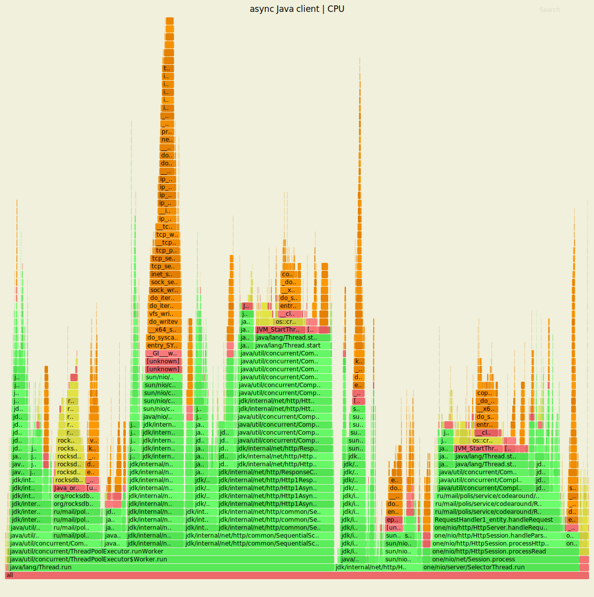
<p align="center">Рис.2. Выделение ресурса CPU при симулировании PUT-запросов (<em>async client</em>)</p>

В реализации кластера с асинхронным клиентом структура задач процессора, выполняемых на уровне потоков, расширяется за счёт обработчиков сценариев с отложенными проверкой и возвратом результатов. Профилирование выбранного узла в ходе тестирования текущей конфигурации позволяет зафиксировать поэтапное совершение операций с объектами <em>CompletableFuture<Value></em> посредством методов <em>execUpsertWithFutures</em>, <em>execLocalRequest</em> и <em>upsertValue</em> (в рамках вызова асинхронного обработчика). Как следует из той же визуализации, операции с future-объектами преобладают в разрезе задач, выполняемых с применением средств <em>Java Concurrency</em> в потоках <em>ThreadPoolExecutor</em>.         

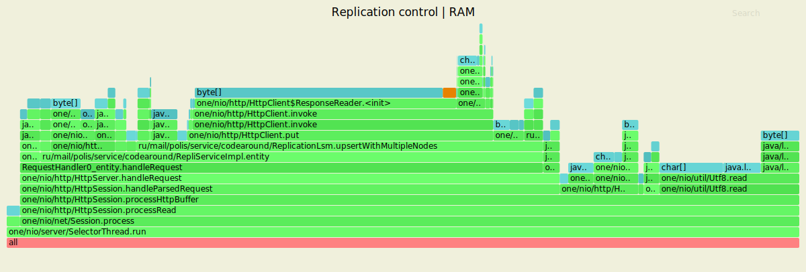
<p align="center">Рис.3. Выделение ресурса RAM при симулировании PUT-запросов (<em>replicas</em>)</p>

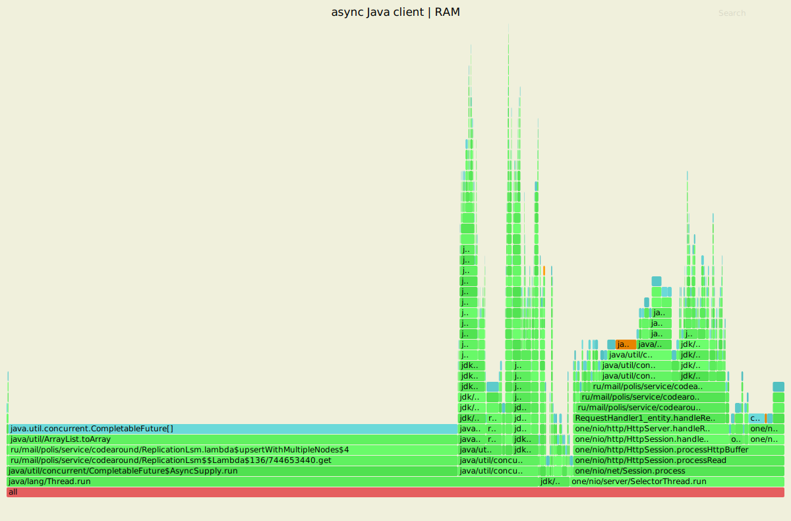
<p align="center">Рис.4. Выделение ресурса RAM при симулировании PUT-запросов (<em>async client</em>)</p>

Таким образом, теперь узлы должны поддерживать расширенный протокол (совместимый с предыдущей версией):
* HTTP `GET /v0/entity?id=<ID>[&replicas=ack/from]` -- получить данные по ключу `<ID>`. Возвращает:
  * `200 OK` и данные, если ответили хотя бы `ack` из `from` реплик
  * `404 Not Found`, если ни одна из `ack` реплик, вернувших ответ, не содержит данные (либо **самая свежая версия** среди `ack` ответов -- это tombstone)
  * `504 Not Enough Replicas`, если не получили `200`/`404` от `ack` реплик из всего множества `from` реплик

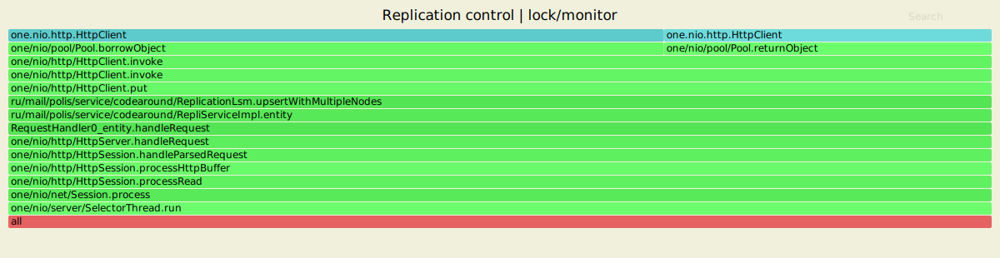
<p align="center">Рис.5. Профиль lock/monitor при симулировании PUT-запросов (<em>replicas</em>)</p>

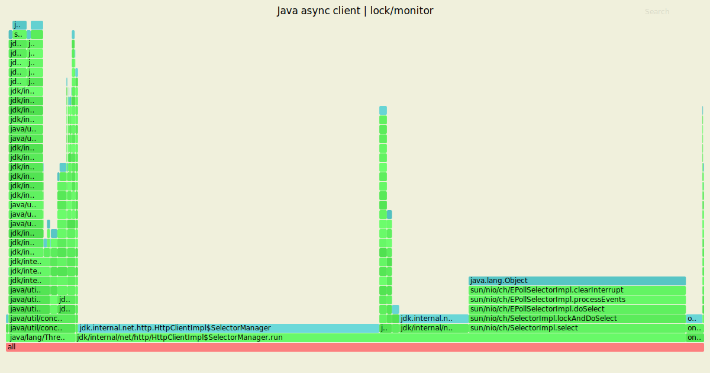
<p align="center">Рис.6. Профиль lock/monitor при симулировании PUT-запросов (<em>async client</em>)</p>

Профиль событий параллелизма показывает, что контроль взаимоисключений в реализации с асинхронным клиентом осуществляется вне контекста операций, связанных с исполнением основного кода на Java, т.е. в активности текущего клиента, как и предполагалось в процессе проектирования, отсутствуют указания на синхронизацию работы потоков путём примененения блокировок. В этой связи экстремальное ухудшение результатов по всем performance-метрикам вступает в определённое противоречие с прогнозируемыми эффектами поддержки асинхронности на уровне клиента. В качестве объяснения подобного результата возможно привести как существующий потенциал оптимизации кода через средства <em>Java Concurrency</em>, так и незначительные аппаратные ресурсы под управлением локальной системы.<br/>               

### 2. Чтение записей (GET)

<ins><em>wrk2</em> outputs / primary replicas</ins>  
```
max@max-Inspiron-15-3573:~/hack-dht$ wrk -t2 -c64 -d7m -s src/profiling/wrk_scripts/get.lua -R5000 --latency http://127.0.0.1:8080
Running 7m test @ http://127.0.0.1:8080
  2 threads and 64 connections
  Thread calibration: mean lat.: 422.430ms, rate sampling interval: 1614ms
  Thread calibration: mean lat.: 423.036ms, rate sampling interval: 1615ms
  Thread Stats   Avg      Stdev     Max   +/- Stdev
    Latency     2.05ms    6.22ms 180.74ms   98.57%
    Req/Sec     2.50k    20.54     2.72k    98.81%
  Latency Distribution (HdrHistogram - Recorded Latency)
 50.000%    1.51ms
 75.000%    1.99ms
 90.000%    2.45ms
 99.000%   12.46ms
 99.900%  124.22ms
 99.990%  167.29ms
 99.999%  174.59ms
100.000%  180.86ms

  Detailed Percentile spectrum:
       Value   Percentile   TotalCount 1/(1-Percentile)

       0.243     0.000000            1         1.00
       0.784     0.100000       205176         1.11
       0.988     0.200000       410104         1.25
       1.164     0.300000       615938         1.43
       1.334     0.400000       819742         1.67
       1.507     0.500000      1025001         2.00
       1.596     0.550000      1127085         2.22
       1.689     0.600000      1230388         2.50
       1.783     0.650000      1332200         2.86
       1.884     0.700000      1435353         3.33
       1.993     0.750000      1537207         4.00
       2.053     0.775000      1589582         4.44
       2.115     0.800000      1639508         5.00
       2.185     0.825000      1691935         5.71
       2.259     0.850000      1741879         6.67
       2.347     0.875000      1793810         8.00
       2.397     0.887500      1819293         8.89
       2.453     0.900000      1845042        10.00
       2.515     0.912500      1869924        11.43
       2.591     0.925000      1896020        13.33
       2.685     0.937500      1921458        16.00
       2.745     0.943750      1934013        17.78
       2.821     0.950000      1947007        20.00
       2.917     0.956250      1959708        22.86
       3.051     0.962500      1972465        26.67
       3.267     0.968750      1985228        32.00
       3.455     0.971875      1991575        35.56
       3.791     0.975000      1997974        40.00
       4.411     0.978125      2004379        45.71
       5.479     0.981250      2010787        53.33
       7.335     0.984375      2017185        64.00
       8.479     0.985938      2020391        71.11
       9.903     0.987500      2023591        80.00
      11.367     0.989062      2026795        91.43
      13.287     0.990625      2029999       106.67
      15.583     0.992188      2033203       128.00
      16.751     0.992969      2034806       142.22
      18.383     0.993750      2036395       160.00
      20.623     0.994531      2037998       182.86
      24.495     0.995313      2039595       213.33
      31.471     0.996094      2041199       256.00
      36.639     0.996484      2041999       284.44
      43.583     0.996875      2042797       320.00
      52.863     0.997266      2043597       365.71
      61.823     0.997656      2044399       426.67
      76.543     0.998047      2045200       512.00
      85.951     0.998242      2045597       568.89
      95.615     0.998437      2046000       640.00
     105.087     0.998633      2046400       731.43
     114.303     0.998828      2046799       853.33
     125.695     0.999023      2047199      1024.00
     131.007     0.999121      2047405      1137.78
     135.807     0.999219      2047599      1280.00
     140.927     0.999316      2047804      1462.86
     145.791     0.999414      2048006      1706.67
     150.527     0.999512      2048200      2048.00
     153.087     0.999561      2048304      2275.56
     155.391     0.999609      2048404      2560.00
     157.823     0.999658      2048504      2925.71
     160.383     0.999707      2048599      3413.33
     162.559     0.999756      2048699      4096.00
     163.455     0.999780      2048753      4551.11
     164.095     0.999805      2048800      5120.00
     164.863     0.999829      2048850      5851.43
     165.759     0.999854      2048909      6826.67
     166.399     0.999878      2048949      8192.00
     166.911     0.999890      2048976      9102.22
     167.295     0.999902      2048999     10240.00
     167.935     0.999915      2049029     11702.86
     168.447     0.999927      2049056     13653.33
     168.959     0.999939      2049075     16384.00
     169.471     0.999945      2049092     18204.44
     169.727     0.999951      2049101     20480.00
     169.983     0.999957      2049112     23405.71
     170.495     0.999963      2049128     27306.67
     170.879     0.999969      2049141     32768.00
     171.135     0.999973      2049148     36408.89
     171.263     0.999976      2049151     40960.00
     171.647     0.999979      2049157     46811.43
     172.287     0.999982      2049163     54613.33
     172.671     0.999985      2049168     65536.00
     172.927     0.999986      2049171     72817.78
     173.567     0.999988      2049175     81920.00
     174.335     0.999989      2049178     93622.86
     175.359     0.999991      2049181    109226.67
     176.127     0.999992      2049185    131072.00
     176.127     0.999993      2049185    145635.56
     176.639     0.999994      2049187    163840.00
     177.663     0.999995      2049189    187245.71
     177.791     0.999995      2049190    218453.33
     178.431     0.999996      2049192    262144.00
     178.431     0.999997      2049192    291271.11
     178.559     0.999997      2049193    327680.00
     178.687     0.999997      2049194    374491.43
     179.583     0.999998      2049195    436906.67
     179.711     0.999998      2049196    524288.00
     179.711     0.999998      2049196    582542.22
     179.711     0.999998      2049196    655360.00
     179.967     0.999999      2049197    748982.86
     179.967     0.999999      2049197    873813.33
     180.479     0.999999      2049198   1048576.00
     180.479     0.999999      2049198   1165084.44
     180.479     0.999999      2049198   1310720.00
     180.479     0.999999      2049198   1497965.71
     180.479     0.999999      2049198   1747626.67
     180.863     1.000000      2049199   2097152.00
     180.863     1.000000      2049199          inf
#[Mean    =        2.053, StdDeviation   =        6.218]
#[Max     =      180.736, Total count    =      2049199]
#[Buckets =           27, SubBuckets     =         2048]
----------------------------------------------------------
  2099636 requests in 7.00m, 136.04MB read
Requests/sec:   4999.13
Transfer/sec:    331.69KB
```
<ins><em>wrk2</em> outputs / async Java client</ins>  
```
max@max-Inspiron-15-3573:~/hack-dht$ wrk -t2 -c64 -d7m -s src/profiling/wrk_scripts/get.lua -R400 --latency http://127.0.0.1:8080
Running 7m test @ http://127.0.0.1:8080
  2 threads and 64 connections
  Thread calibration: mean lat.: 10.797ms, rate sampling interval: 66ms
  Thread calibration: mean lat.: 35.039ms, rate sampling interval: 106ms
  Thread Stats   Avg      Stdev     Max   +/- Stdev
    Latency   122.98ms  302.77ms   2.74s    93.43%
    Req/Sec   201.00    119.21   560.00     62.98%
  Latency Distribution (HdrHistogram - Recorded Latency)
 50.000%   51.71ms
 75.000%   72.83ms
 90.000%  108.29ms
 99.000%    1.70s 
 99.900%    2.37s 
 99.990%    2.58s 
 99.999%    2.70s 
100.000%    2.74s 

  Detailed Percentile spectrum:
       Value   Percentile   TotalCount 1/(1-Percentile)

       1.236     0.000000            1         1.00
       4.239     0.100000        16400         1.11
      21.007     0.200000        32790         1.25
      34.015     0.300000        49181         1.43
      43.583     0.400000        65609         1.67
      51.711     0.500000        82008         2.00
      55.679     0.550000        90180         2.22
      59.583     0.600000        98399         2.50
      63.455     0.650000       106563         2.86
      67.775     0.700000       114853         3.33
      72.831     0.750000       123004         4.00
      75.711     0.775000       127083         4.44
      79.167     0.800000       131178         5.00
      83.263     0.825000       135303         5.71
      88.447     0.850000       139352         6.67
      96.063     0.875000       143471         8.00
     100.991     0.887500       145490         8.89
     108.287     0.900000       147540        10.00
     127.615     0.912500       149590        11.43
     265.983     0.925000       151638        13.33
     472.831     0.937500       153688        16.00
     571.391     0.943750       154714        17.78
     678.911     0.950000       155740        20.00
     816.639     0.956250       156762        22.86
     962.559     0.962500       157787        26.67
    1112.063     0.968750       158813        32.00
    1196.031     0.971875       159329        35.56
    1274.879     0.975000       159834        40.00
    1357.823     0.978125       160352        45.71
    1436.671     0.981250       160862        53.33
    1521.663     0.984375       161372        64.00
    1561.599     0.985938       161627        71.11
    1609.727     0.987500       161889        80.00
    1655.807     0.989062       162143        91.43
    1714.175     0.990625       162396       106.67
    1776.639     0.992188       162654       128.00
    1812.479     0.992969       162784       142.22
    1854.463     0.993750       162908       160.00
    1913.855     0.994531       163036       182.86
    1979.391     0.995313       163164       213.33
    2061.311     0.996094       163293       256.00
    2088.959     0.996484       163356       284.44
    2134.015     0.996875       163425       320.00
    2177.023     0.997266       163485       365.71
    2211.839     0.997656       163548       426.67
    2246.655     0.998047       163613       512.00
    2265.087     0.998242       163646       568.89
    2301.951     0.998437       163676       640.00
    2326.527     0.998633       163708       731.43
    2355.199     0.998828       163743       853.33
    2379.775     0.999023       163772      1024.00
    2416.639     0.999121       163794      1137.78
    2422.783     0.999219       163807      1280.00
    2428.927     0.999316       163820      1462.86
    2449.407     0.999414       163838      1706.67
    2465.791     0.999512       163852      2048.00
    2480.127     0.999561       163861      2275.56
    2492.415     0.999609       163872      2560.00
    2494.463     0.999658       163876      2925.71
    2521.087     0.999707       163884      3413.33
    2529.279     0.999756       163892      4096.00
    2545.663     0.999780       163896      4551.11
    2557.951     0.999805       163900      5120.00
    2572.287     0.999829       163904      5851.43
    2574.335     0.999854       163909      6826.67
    2576.383     0.999878       163913      8192.00
    2580.479     0.999890       163916      9102.22
    2580.479     0.999902       163916     10240.00
    2582.527     0.999915       163919     11702.86
    2584.575     0.999927       163920     13653.33
    2596.863     0.999939       163922     16384.00
    2607.103     0.999945       163924     18204.44
    2607.103     0.999951       163924     20480.00
    2613.247     0.999957       163925     23405.71
    2637.823     0.999963       163926     27306.67
    2643.967     0.999969       163927     32768.00
    2682.879     0.999973       163928     36408.89
    2682.879     0.999976       163928     40960.00
    2691.071     0.999979       163929     46811.43
    2691.071     0.999982       163929     54613.33
    2697.215     0.999985       163930     65536.00
    2697.215     0.999986       163930     72817.78
    2697.215     0.999988       163930     81920.00
    2719.743     0.999989       163931     93622.86
    2719.743     0.999991       163931    109226.67
    2719.743     0.999992       163931    131072.00
    2719.743     0.999993       163931    145635.56
    2719.743     0.999994       163931    163840.00
    2744.319     0.999995       163932    187245.71
    2744.319     1.000000       163932          inf
#[Mean    =      122.984, StdDeviation   =      302.769]
#[Max     =     2742.272, Total count    =       163932]
#[Buckets =           27, SubBuckets     =         2048]
----------------------------------------------------------
  167809 requests in 7.00m, 10.70MB read
Requests/sec:    399.47
Transfer/sec:     26.09KB
```
Сравнение конфигураций в режиме чтения воспроизводит результаты, полученные в ходе заполнения БД записями. Повышение средней задержки по итогам настройки асинхронного клиента достигло 60-кратной разницы с данными, актуальными к завершению нагрузочных испытаний на предыдущем этапе. Наибольшая оценка времени отклика в 90% сеансов обмена данными увеличилась примерно в 54 раза, для крайних случаев установлена 15-кратная дельта результатов.<br/>                  
<ins>Flamegraph-анализ</ins><br/>  

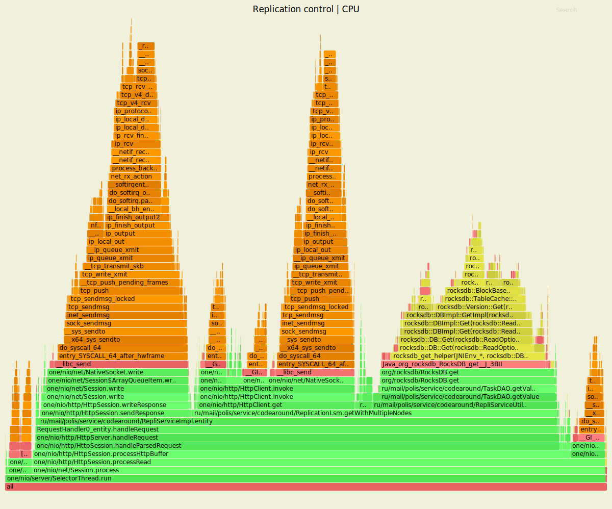
<p align="center">Рис.7. Выделение ресурса CPU при симулировании GET-запросов (<em>replicas</em>)</p>

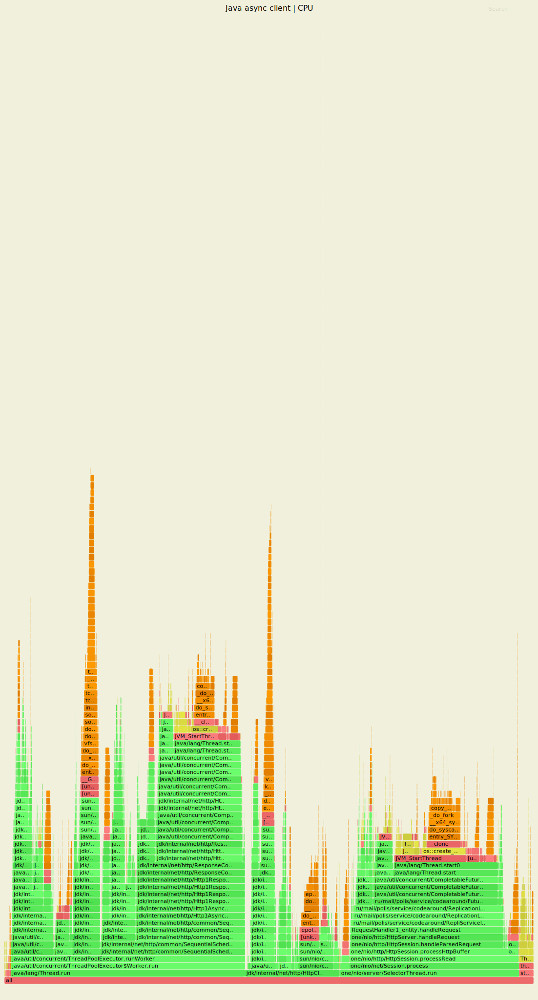
<p align="center">Рис.8. Выделение ресурса CPU при симулировании GET-запросов (<em>async client</em>)</p>                        

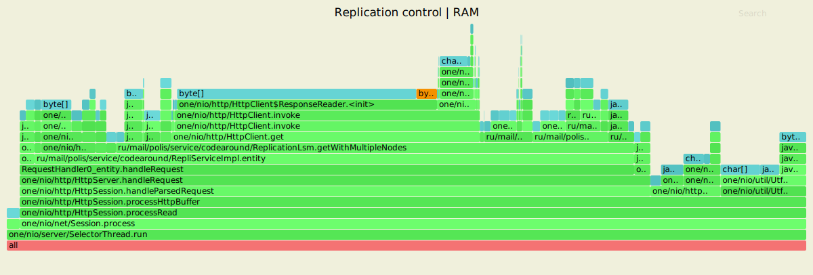
<p align="center">Рис.9. Выделение ресурса RAM при симулировании GET-запросов (<em>replicas</em>)</p>

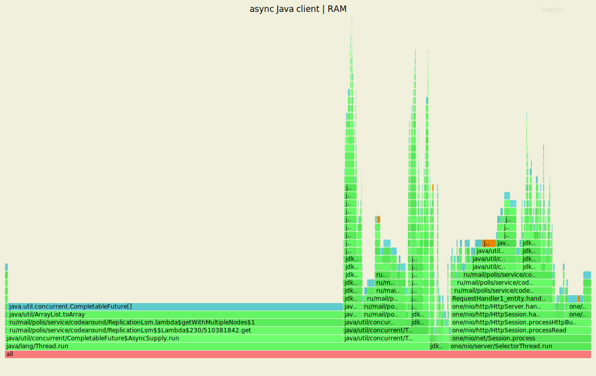
<p align="center">Рис.10. Выделение ресурса RAM при симулировании GET-запросов (<em>async client</em>)</p>

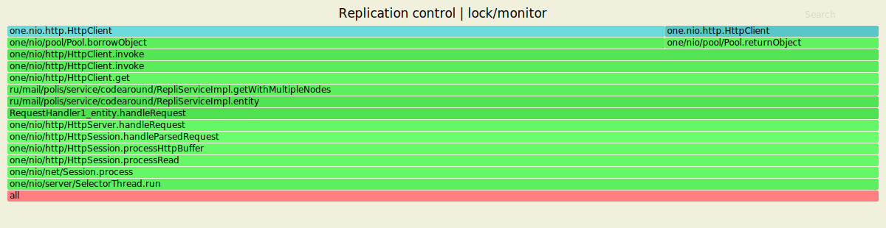
<p align="center">Рис.11. Профиль lock/monitor при симулировании GET-запросов (<em>replicas</em>)</p>

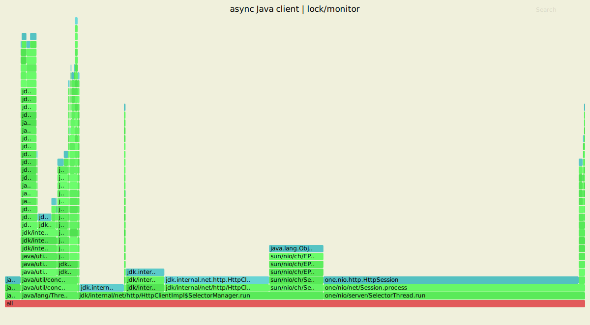
<p align="center">Рис.12. Профиль lock/monitor при симулировании GET-запросов (<em>async client</em>)</p>

Профили, сформированные в режиме чтения, подтверждают влияние методов, поддерживающих операции с futures на базе <em>Java Concurrency</em>. В соответствии с релевантной логикой, окончание цепочки вызовов для извлечения значений из БД установлено за методами <em>execGetWithFutures</em> и <em>getValue</em> при обработке запроса на текущем узле.