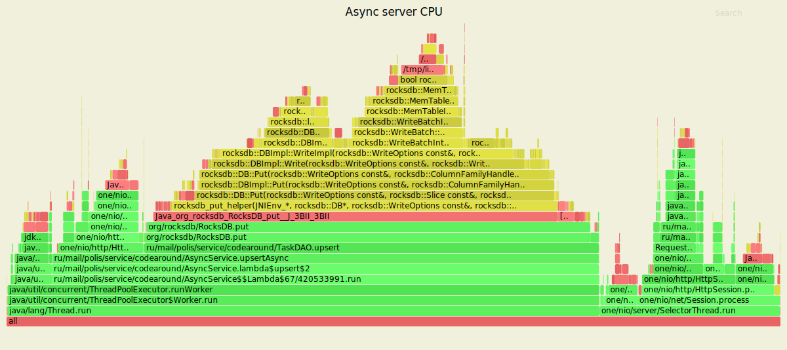
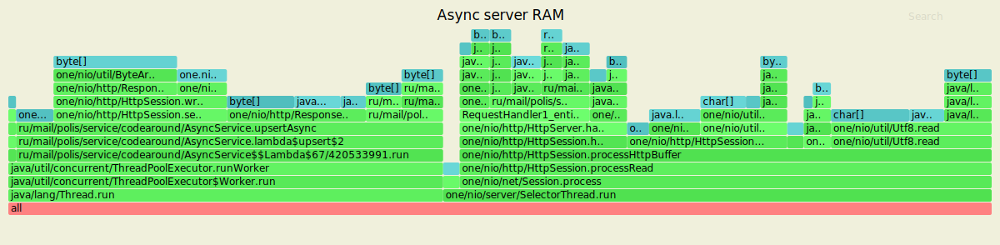
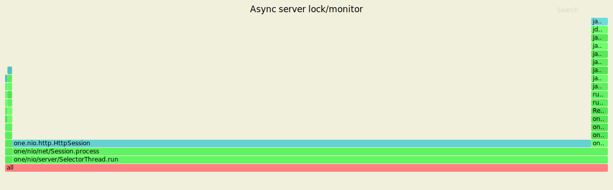
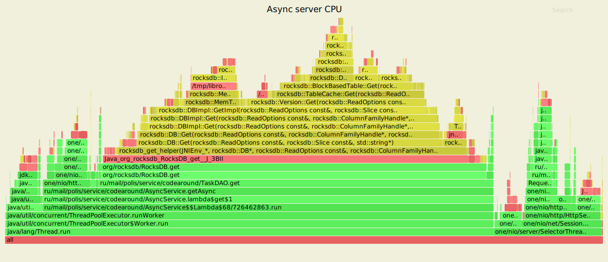
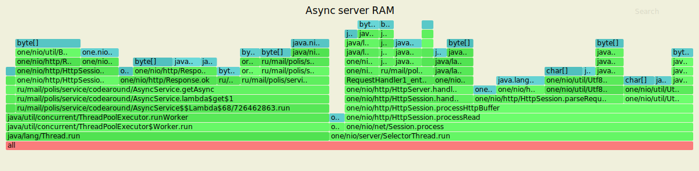
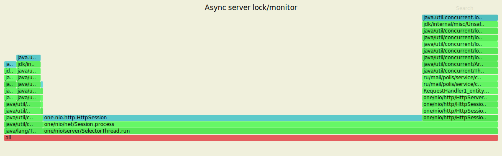

# Мониторинг работы сервера с поддержкой асинхронных операций (<em>wrk</em> + <em>async-profiler</em>)

**Система и программные средства** 
| | |
|-|-|
| ОС | Ubuntu Linux 18.04 LTS x64-bit |
| ЦПУ | Intel(R) Celeron(R) N4000 CPU @ 1.10GHz |
| Объём RAM | 8 ГБ |
| Количество ядер ЦПУ | 2 |
| [wrk2](https://github.com/giltene/wrk2) | v. 4.0.0 |
| [async-profiler](https://github.com/jvm-profiling-tools/async-profiler) | 1.8.1 |
| [VisualVM](https://visualvm.github.io/) | 2.0.4 |

В ходе очередного мониторинга производительности локального highload-сервера получены и рассмотрены оценки быстродействия при асинхронной обработке запросов от множества клиентов. Для определения технических (программн-аппаратных) факторов изменений, вносимых асинхронными процессами, предпринят сравнительный анализ результатов профилирования асинхронной (<em>async-featured</em>) и синхронизированной на уровне потоков (<em>thread safe synchronized</em>) реализаций программного управления сервером (класс TaskService). В качестве материалов, характеризующих производительность сервера с поддержкой синхронизации, приводятся статистические сводки и визуализации итогов профилирования (flame-графы) в расширенной конфигурации RocksDB, подвергнутые анализу в контексте исследования на 2-ом этапе проекта.<br/> 
Нагрузочные испытания, проведённые с использованием <em>wrk2</em>, организованы в виде серий PUT- и GET-запросов фиксированной продолжительности (7 минут) в режиме симулирования обмена данными с пулом клиентов (число клиентов (соединений с сервером) в synchronized-реализации установлено равным 16, в асинхронной - 64, количество параллельных потоков в обеих - 2 по числу ядер ЦПУ). Интенсивность генерации / отправки запросов каждого вида (<em>Rate</em>) задана равной 15000 запросов/с исходя из предварительной оценки стабильной нагрузки, де-факто достигаемой в ходе выполнения <em>wrk2</em> на локальном компьютере.

**Команды <em>wrk2</em>**<br/>

<p></p>

<ins><em>wrk2</em> | PUT | thread safe synchronized</ins>
```
wrk -t2 -c16 -d7m -s src/profiling/wrk_scripts/put.lua -R15000 --latency http://127.0.0.1:8080
```

<ins><em>wrk2</em> | PUT | async-featured</ins>
```
wrk -t2 -c64 -d7m -s src/profiling/wrk_scripts/put.lua -R15000 --latency http://127.0.0.1:8080
```

<ins><em>wrk2</em> | GET | thread safe synchronized</ins>
```
wrk -t2 -c16 -d7m -s src/profiling/wrk_scripts/get.lua -R15000 --latency http://127.0.0.1:8080
```

<ins><em>wrk2</em> | GET | async-featured</ins>
```
wrk -t2 -c64 -d7m -s src/profiling/wrk_scripts/get.lua -R15000 --latency http://127.0.0.1:8080
```

**Команды <em>async-profiler</em>**<br/>

<p></p>

<ins><em>async-profiler</em> | cpu</ins>
```
./profiler.sh -d 60 -e cpu -f /path/to/output/folder/flame_output_cpu.svg <server_process_pid>
```

<ins><em>async-profiler</em> | alloc</ins>
```
./profiler.sh -d 60 -e alloc -f /path/to/output/folder/flame_output_alloc.svg <server_process_pid>
```

<ins><em>async-profiler</em> | lock</ins>
```
./profiler.sh -d 60 -e lock -f /path/to/output/folder/flame_output_lock.svg <server_pid>
```

Результаты мониторинга и сравнения реализаций сервера приведены далее.

### 1. Добавление/изменение записей (PUT)

<ins><em>wrk2</em> outputs / **synchronized** server</ins>  
```
max@max-Inspiron-15-3573:~/hackdht$ wrk -t2 -c16 -d7m -s src/profiling/wrk_scripts/put.lua -R15000 --latency http://127.0.0.1:8080
Running 7m test @ http://127.0.0.1:8080
  2 threads and 16 connections
  Thread calibration: mean lat.: 81.369ms, rate sampling interval: 629ms
  Thread calibration: mean lat.: 42.386ms, rate sampling interval: 378ms
  Thread Stats   Avg      Stdev     Max   +/- Stdev
    Latency     2.41ms    8.48ms 195.58ms   98.42%
    Req/Sec     7.51k   127.15     9.60k    96.66%
  Latency Distribution (HdrHistogram - Recorded Latency)
 50.000%    1.34ms
 75.000%    1.93ms
 90.000%    2.65ms
 99.000%   28.98ms
 99.900%  126.91ms
 99.990%  162.82ms
 99.999%  192.00ms
100.000%  195.71ms

  Detailed Percentile spectrum:
       Value   Percentile   TotalCount 1/(1-Percentile)

       0.073     0.000000            1         1.00
       0.552     0.100000       615076         1.11
       0.776     0.200000      1232597         1.25
       0.969     0.300000      1846106         1.43
       1.155     0.400000      2462421         1.67
       1.342     0.500000      3074714         2.00
       1.442     0.550000      3383007         2.22
       1.548     0.600000      3691114         2.50
       1.662     0.650000      3999187         2.86
       1.787     0.700000      4305947         3.33
       1.929     0.750000      4612224         4.00
       2.009     0.775000      4766984         4.44
       2.097     0.800000      4921152         5.00
       2.197     0.825000      5075966         5.71
       2.313     0.850000      5229015         6.67
       2.457     0.875000      5381312         8.00
       2.545     0.887500      5457682         8.89
       2.653     0.900000      5534727        10.00
       2.791     0.912500      5612181        11.43
       2.977     0.925000      5688329        13.33
       3.273     0.937500      5765359        16.00
       3.515     0.943750      5803611        17.78
       3.899     0.950000      5841968        20.00
       4.523     0.956250      5880320        22.86
       5.387     0.962500      5918822        26.67
       6.359     0.968750      5957236        32.00
       6.867     0.971875      5976548        35.56
       7.439     0.975000      5995641        40.00
       8.163     0.978125      6014901        45.71
       9.239     0.981250      6034099        53.33
      11.031     0.984375      6053283        64.00
      12.503     0.985938      6062882        71.11
      15.415     0.987500      6072501        80.00
      22.927     0.989062      6082096        91.43
      33.375     0.990625      6091705       106.67
      47.295     0.992188      6101314       128.00
      54.815     0.992969      6106120       142.22
      61.983     0.993750      6110922       160.00
      68.927     0.994531      6115764       182.86
      76.799     0.995313      6120544       213.33
      84.607     0.996094      6125358       256.00
      88.703     0.996484      6127771       284.44
      92.543     0.996875      6130139       320.00
      96.959     0.997266      6132552       365.71
     101.951     0.997656      6134958       426.67
     106.687     0.998047      6137349       512.00
     110.463     0.998242      6138554       568.89
     114.943     0.998437      6139758       640.00
     118.847     0.998633      6140961       731.43
     122.751     0.998828      6142148       853.33
     127.487     0.999023      6143360      1024.00
     130.303     0.999121      6143968      1137.78
     132.991     0.999219      6144566      1280.00
     135.423     0.999316      6145155      1462.86
     138.367     0.999414      6145776      1706.67
     141.311     0.999512      6146363      2048.00
     143.359     0.999561      6146656      2275.56
     145.535     0.999609      6146956      2560.00
     147.839     0.999658      6147262      2925.71
     150.143     0.999707      6147560      3413.33
     152.319     0.999756      6147863      4096.00
     153.215     0.999780      6148008      4551.11
     154.879     0.999805      6148169      5120.00
     156.159     0.999829      6148306      5851.43
     157.823     0.999854      6148458      6826.67
     159.871     0.999878      6148604      8192.00
     161.279     0.999890      6148688      9102.22
     163.071     0.999902      6148755     10240.00
     164.607     0.999915      6148832     11702.86
     166.399     0.999927      6148905     13653.33
     168.831     0.999939      6148980     16384.00
     170.239     0.999945      6149019     18204.44
     171.775     0.999951      6149056     20480.00
     173.823     0.999957      6149093     23405.71
     176.639     0.999963      6149130     27306.67
     180.991     0.999969      6149168     32768.00
     183.423     0.999973      6149186     36408.89
     185.983     0.999976      6149204     40960.00
     187.775     0.999979      6149224     46811.43
     188.799     0.999982      6149242     54613.33
     189.823     0.999985      6149263     65536.00
     190.207     0.999986      6149271     72817.78
     190.719     0.999988      6149279     81920.00
     191.871     0.999989      6149290     93622.86
     192.255     0.999991      6149299    109226.67
     192.767     0.999992      6149309    131072.00
     192.895     0.999993      6149315    145635.56
     193.151     0.999994      6149317    163840.00
     193.535     0.999995      6149322    187245.71
     193.791     0.999995      6149327    218453.33
     193.919     0.999996      6149333    262144.00
     193.919     0.999997      6149333    291271.11
     194.175     0.999997      6149336    327680.00
     194.431     0.999997      6149339    374491.43
     194.559     0.999998      6149341    436906.67
     194.687     0.999998      6149344    524288.00
     194.687     0.999998      6149344    582542.22
     194.815     0.999998      6149347    655360.00
     194.815     0.999999      6149347    748982.86
     194.815     0.999999      6149347    873813.33
     195.071     0.999999      6149349   1048576.00
     195.071     0.999999      6149349   1165084.44
     195.199     0.999999      6149350   1310720.00
     195.199     0.999999      6149350   1497965.71
     195.327     0.999999      6149351   1747626.67
     195.455     1.000000      6149353   2097152.00
     195.455     1.000000      6149353   2330168.89
     195.455     1.000000      6149353   2621440.00
     195.455     1.000000      6149353   2995931.43
     195.455     1.000000      6149353   3495253.33
     195.455     1.000000      6149353   4194304.00
     195.455     1.000000      6149353   4660337.78
     195.455     1.000000      6149353   5242880.00
     195.455     1.000000      6149353   5991862.86
     195.711     1.000000      6149354   6990506.67
     195.711     1.000000      6149354          inf
#[Mean    =        2.406, StdDeviation   =        8.479]
#[Max     =      195.584, Total count    =      6149354]
#[Buckets =           27, SubBuckets     =         2048]
----------------------------------------------------------
  6299674 requests in 7.00m, 402.53MB read
Requests/sec:  14999.26
Transfer/sec:      0.96MB
```
<ins><em>wrk2</em> outputs / **async** server</ins>  
```
max@max-Inspiron-15-3573:~/hackdht$ wrk -t2 -c64 -d7m -s src/profiling/wrk_scripts/put.lua -R15000 --latency http://127.0.0.1:8080
Running 7m test @ http://127.0.0.1:8080
  2 threads and 64 connections
  Thread calibration: mean lat.: 7.287ms, rate sampling interval: 24ms
  Thread calibration: mean lat.: 13.080ms, rate sampling interval: 90ms
  Thread Stats   Avg      Stdev     Max   +/- Stdev
    Latency     4.14ms   12.24ms 248.58ms   97.11%
    Req/Sec     7.64k     1.02k   16.39k    87.30%
  Latency Distribution (HdrHistogram - Recorded Latency)
 50.000%    2.16ms
 75.000%    2.98ms
 90.000%    4.60ms
 99.000%   57.22ms
 99.900%  167.17ms
 99.990%  206.08ms
 99.999%  223.49ms
100.000%  248.70ms

  Detailed Percentile spectrum:
       Value   Percentile   TotalCount 1/(1-Percentile)
       0.096     0.000000            1         1.00
       0.977     0.100000       615919         1.11
       1.310     0.200000      1230927         1.25
       1.606     0.300000      1844335         1.43
       1.887     0.400000      2460286         1.67
       2.161     0.500000      3075944         2.00
       2.299     0.550000      3381353         2.22
       2.445     0.600000      3690330         2.50
       2.599     0.650000      3996270         2.86
       2.773     0.700000      4305916         3.33
       2.977     0.750000      4612712         4.00
       3.097     0.775000      4765856         4.44
       3.237     0.800000      4918983         5.00
       3.407     0.825000      5072725         5.71
       3.627     0.850000      5225732         6.67
       3.951     0.875000      5379620         8.00
       4.203     0.887500      5456847         8.89
       4.599     0.900000      5533270        10.00
       5.387     0.912500      5609681        11.43
       6.719     0.925000      5686609        13.33
       8.311     0.937500      5763379        16.00
       9.255     0.943750      5801799        17.78
      10.343     0.950000      5840178        20.00
      11.631     0.956250      5878713        22.86
      13.223     0.962500      5917181        26.67
      15.311     0.968750      5955465        32.00
      16.799     0.971875      5974728        35.56
      18.879     0.975000      5993953        40.00
      21.935     0.978125      6013144        45.71
      26.527     0.981250      6032297        53.33
      32.671     0.984375      6051529        64.00
      36.383     0.985938      6061140        71.11
      41.663     0.987500      6070723        80.00
      50.591     0.989062      6080332        91.43
      62.303     0.990625      6089949       106.67
      72.447     0.992188      6099560       128.00
      78.527     0.992969      6104362       142.22
      86.719     0.993750      6109156       160.00
      97.791     0.994531      6113936       182.86
     109.375     0.995313      6118743       213.33
     121.599     0.996094      6123559       256.00
     128.127     0.996484      6125951       284.44
     134.399     0.996875      6128371       320.00
     139.263     0.997266      6130766       365.71
     143.871     0.997656      6133212       426.67
     149.119     0.998047      6135550       512.00
     152.447     0.998242      6136780       568.89
     156.031     0.998437      6137947       640.00
     159.743     0.998633      6139184       731.43
     163.327     0.998828      6140355       853.33
     167.807     0.999023      6141561      1024.00
     170.239     0.999121      6142157      1137.78
     172.799     0.999219      6142762      1280.00
     175.871     0.999316      6143358      1462.86
     178.943     0.999414      6143950      1706.67
     183.039     0.999512      6144556      2048.00
     185.215     0.999561      6144873      2275.56
     187.263     0.999609      6145160      2560.00
     189.823     0.999658      6145463      2925.71
     192.255     0.999707      6145756      3413.33
     194.815     0.999756      6146057      4096.00
     196.607     0.999780      6146207      4551.11
     198.143     0.999805      6146360      5120.00
     200.319     0.999829      6146508      5851.43
     201.855     0.999854      6146652      6826.67
     204.031     0.999878      6146802      8192.00
     205.439     0.999890      6146876      9102.22
     206.207     0.999902      6146953     10240.00
     207.103     0.999915      6147027     11702.86
     207.999     0.999927      6147101     13653.33
     208.895     0.999939      6147180     16384.00
     209.279     0.999945      6147213     18204.44
     209.535     0.999951      6147251     20480.00
     210.047     0.999957      6147302     23405.71
     210.431     0.999963      6147332     27306.67
     211.071     0.999969      6147363     32768.00
     211.583     0.999973      6147388     36408.89
     212.351     0.999976      6147400     40960.00
     213.631     0.999979      6147421     46811.43
     214.655     0.999982      6147438     54613.33
     216.447     0.999985      6147457     65536.00
     217.343     0.999986      6147467     72817.78
     219.135     0.999988      6147475     81920.00
     222.463     0.999989      6147485     93622.86
     224.895     0.999991      6147494    109226.67
     227.839     0.999992      6147504    131072.00
     228.735     0.999993      6147509    145635.56
     229.759     0.999994      6147513    163840.00
     230.399     0.999995      6147518    187245.71
     232.191     0.999995      6147523    218453.33
     233.471     0.999996      6147527    262144.00
     233.855     0.999997      6147529    291271.11
     235.647     0.999997      6147532    327680.00
     236.415     0.999997      6147534    374491.43
     237.439     0.999998      6147536    436906.67
     239.103     0.999998      6147539    524288.00
     239.871     0.999998      6147540    582542.22
     240.127     0.999998      6147541    655360.00
     240.767     0.999999      6147542    748982.86
     241.919     0.999999      6147545    873813.33
     241.919     0.999999      6147545   1048576.00
     241.919     0.999999      6147545   1165084.44
     242.047     0.999999      6147546   1310720.00
     242.047     0.999999      6147546   1497965.71
     243.455     0.999999      6147547   1747626.67
     244.863     1.000000      6147548   2097152.00
     244.863     1.000000      6147548   2330168.89
     244.863     1.000000      6147548   2621440.00
     244.863     1.000000      6147548   2995931.43
     247.167     1.000000      6147549   3495253.33
     247.167     1.000000      6147549   4194304.00
     247.167     1.000000      6147549   4660337.78
     247.167     1.000000      6147549   5242880.00
     247.167     1.000000      6147549   5991862.86
     248.703     1.000000      6147550   6990506.67
     248.703     1.000000      6147550          inf
#[Mean    =        4.136, StdDeviation   =       12.244]
#[Max     =      248.576, Total count    =      6147550]
#[Buckets =           27, SubBuckets     =         2048]
----------------------------------------------------------
  6291887 requests in 7.00m, 402.03MB read
Requests/sec:  14980.69
Transfer/sec:      0.96MB
```
Сравнивая полученные результаты, можно утверждать, что операции на асинхронном сервере выполнялись с существенно большей средней задержкой, в 1.7 раза превосходящей оценку в предыдущей реализации. При максимально близких значениях интенсивности обслуживания (около 7,5 тысяч запросов/с) ожидание ответа synchronized-сервера в 99% случаев характеризуется двукратным улучшением показателя асинхронной реализации. Дальнейший анализ позволяет выявить устойчивое уменьшение дельты по мере достижения верхних квантилей (до 28% при сравнении предельных времён отклика).<br/>            
<ins>Flamegraph-анализ</ins><br/>  


<p align="center">Рис.1. Выделение ресурса CPU при симулировании PUT-запросов (thread safe synchronized)</p>


<p align="center">Рис.2. Выделение ресурса CPU при симулировании PUT-запросов (async-featured)</p>

Структура пользования ЦПУ, представленная на графах, позволяет зафиксировать характерные для асинхронной реализации доли времени, связанные с обеспечением активности пула потоков (<em>ThreadPoolExecutor</em>) и вызовом методов вставки/обновления (<em>upsert</em> и <em>upsertAsync</em>). Дополнительной задачей, решаемой в рамках поддержки асинхронных операций, становится выполнение пары потоков в составе ThreadPool сверх двух, установленных при вводе параметров нагрузки. Вследствие подобной специфики в работе ЦПУ асинхронного сервера достигается усложнение планирования потоков, выполняющих основной объём операций-потребителей ресурса, в частности перемещения и обработку данных, передаваемых через буфер и сокет.                


<p align="center">Рис.3. Выделение ресурса RAM при симулировании PUT-запросов (thread safe synchronized)</p>


<p align="center">Рис.4. Выделение ресурса RAM при симулировании PUT-запросов (async-featured)</p>

При сопоставлении профилей памяти проявляются те же особенности асинхронного дизайна, что наблюдались при анализе контроля процессорного времени. Так, на графе, полученном в ходе испытаний асинхронного сервера, продемонстрированы аллокации ресурса, предназначенные для поддержки работы потоков под управлением <em>ThreadPoolExecutor</em>. Для данных потоков устанавливается доступ к памяти, выделяемой при вызовах методов upsert, главным образом для хранения объектов в операциях приведения к различным типам данных (строкам, байтовым массивам, ByteBuffer).                   


<p align="center">Рис.5. Профиль lock/monitor при симулировании PUT-запросов (async-featured)</p>

Ввиду отсутствия содержимого актуального профиля для операций на syncronized-сервере в рамках текущего анализа рассмотрен единственный граф, сформированный в процессе испытаний асинхронной реализации. События управления параллелизмом, относимые к потокам <em>ThreadPoolExecutor</em>, проявляются в контроле взаимоисключений при попытке доступа к элементам блокирующей очереди (<em>ArrayBlockingQueue</em>). Для безопасности асинхронных операций в этом случае используется <em>ReentrantLock</em>, образующий механизм регулирования доступа в композиции с <em>AbstractQueuedSynchronizer</em>.<br/>               

### 2. Чтение записей (GET)

<ins><em>wrk2</em> outputs / **synchronized** server</ins>  
```
max@max-Inspiron-15-3573:~/hackdht$ wrk -t2 -c16 -d7m -s src/profiling/wrk_scripts/get.lua -R15000 --latency http://127.0.0.1:8080
Running 7m test @ http://127.0.0.1:8080
  2 threads and 16 connections
  Thread calibration: mean lat.: 10.730ms, rate sampling interval: 75ms
  Thread calibration: mean lat.: 25.269ms, rate sampling interval: 181ms
  Thread Stats   Avg      Stdev     Max   +/- Stdev
    Latency     1.56ms    1.26ms  30.03ms   90.42%
    Req/Sec     7.54k   164.07     9.27k    88.29%
  Latency Distribution (HdrHistogram - Recorded Latency)
 50.000%    1.35ms
 75.000%    1.91ms
 90.000%    2.52ms
 99.000%    7.32ms
 99.900%   12.70ms
 99.990%   20.72ms
 99.999%   27.14ms
100.000%   30.05ms

  Detailed Percentile spectrum:
       Value   Percentile   TotalCount 1/(1-Percentile)
       0.067     0.000000            1         1.00
       0.536     0.100000       615152         1.11
       0.759     0.200000      1230269         1.25
       0.964     0.300000      1846650         1.43
       1.158     0.400000      2462626         1.67
       1.347     0.500000      3077440         2.00
       1.445     0.550000      3385106         2.22
       1.548     0.600000      3690354         2.50
       1.659     0.650000      3999399         2.86
       1.777     0.700000      4306297         3.33
       1.908     0.750000      4613448         4.00
       1.980     0.775000      4766459         4.44
       2.059     0.800000      4920809         5.00
       2.147     0.825000      5073956         5.71
       2.247     0.850000      5227495         6.67
       2.365     0.875000      5381418         8.00
       2.435     0.887500      5457756         8.89
       2.517     0.900000      5534543        10.00
       2.615     0.912500      5611430        11.43
       2.737     0.925000      5688652        13.33
       2.903     0.937500      5765123        16.00
       3.013     0.943750      5803583        17.78
       3.153     0.950000      5842400        20.00
       3.333     0.956250      5880387        22.86
       3.599     0.962500      5918869        26.67
       4.019     0.968750      5957271        32.00
       4.331     0.971875      5976484        35.56
       4.727     0.975000      5995808        40.00
       5.203     0.978125      6014999        45.71
       5.723     0.981250      6034186        53.33
       6.259     0.984375      6053320        64.00
       6.539     0.985938      6063015        71.11
       6.819     0.987500      6072579        80.00
       7.119     0.989062      6082191        91.43
       7.451     0.990625      6091746       106.67
       7.835     0.992188      6101407       128.00
       8.051     0.992969      6106194       142.22
       8.295     0.993750      6110956       160.00
       8.583     0.994531      6115777       182.86
       8.911     0.995313      6120558       213.33
       9.327     0.996094      6125406       256.00
       9.567     0.996484      6127749       284.44
       9.855     0.996875      6130165       320.00
      10.183     0.997266      6132565       365.71
      10.583     0.997656      6134969       426.67
      11.047     0.998047      6137372       512.00
      11.311     0.998242      6138576       568.89
      11.607     0.998437      6139763       640.00
      11.935     0.998633      6140977       731.43
      12.311     0.998828      6142176       853.33
      12.759     0.999023      6143359      1024.00
      13.031     0.999121      6143975      1137.78
      13.327     0.999219      6144573      1280.00
      13.663     0.999316      6145172      1462.86
      14.071     0.999414      6145767      1706.67
      14.567     0.999512      6146364      2048.00
      14.895     0.999561      6146664      2275.56
      15.247     0.999609      6146963      2560.00
      15.759     0.999658      6147264      2925.71
      16.327     0.999707      6147567      3413.33
      17.071     0.999756      6147864      4096.00
      17.487     0.999780      6148016      4551.11
      17.935     0.999805      6148166      5120.00
      18.543     0.999829      6148316      5851.43
      19.119     0.999854      6148469      6826.67
      19.855     0.999878      6148616      8192.00
      20.303     0.999890      6148689      9102.22
      20.815     0.999902      6148765     10240.00
      21.375     0.999915      6148840     11702.86
      22.095     0.999927      6148918     13653.33
      22.975     0.999939      6148991     16384.00
      23.487     0.999945      6149027     18204.44
      24.175     0.999951      6149065     20480.00
      24.735     0.999957      6149102     23405.71
      25.247     0.999963      6149142     27306.67
      25.615     0.999969      6149178     32768.00
      25.775     0.999973      6149196     36408.89
      25.999     0.999976      6149214     40960.00
      26.175     0.999979      6149233     46811.43
      26.415     0.999982      6149252     54613.33
      26.655     0.999985      6149271     65536.00
      26.783     0.999986      6149280     72817.78
      26.959     0.999988      6149291     81920.00
      27.039     0.999989      6149299     93622.86
      27.247     0.999991      6149308    109226.67
      27.535     0.999992      6149318    131072.00
      27.647     0.999993      6149322    145635.56
      27.823     0.999994      6149328    163840.00
      27.935     0.999995      6149332    187245.71
      28.175     0.999995      6149336    218453.33
      28.383     0.999996      6149341    262144.00
      28.463     0.999997      6149344    291271.11
      28.559     0.999997      6149346    327680.00
      28.655     0.999997      6149348    374491.43
      28.687     0.999998      6149350    436906.67
      28.895     0.999998      6149355    524288.00
      28.895     0.999998      6149355    582542.22
      28.895     0.999998      6149355    655360.00
      29.263     0.999999      6149356    748982.86
      29.359     0.999999      6149357    873813.33
      29.407     0.999999      6149359   1048576.00
      29.407     0.999999      6149359   1165084.44
      29.535     0.999999      6149361   1310720.00
      29.535     0.999999      6149361   1497965.71
      29.535     0.999999      6149361   1747626.67
      29.903     1.000000      6149362   2097152.00
      29.903     1.000000      6149362   2330168.89
      29.903     1.000000      6149362   2621440.00
      29.903     1.000000      6149362   2995931.43
      29.999     1.000000      6149363   3495253.33
      29.999     1.000000      6149363   4194304.00
      29.999     1.000000      6149363   4660337.78
      29.999     1.000000      6149363   5242880.00
      29.999     1.000000      6149363   5991862.86
      30.047     1.000000      6149364   6990506.67
      30.047     1.000000      6149364          inf
#[Mean    =        1.564, StdDeviation   =        1.262]
#[Max     =       30.032, Total count    =      6149364]
#[Buckets =           27, SubBuckets     =         2048]
----------------------------------------------------------
  6299677 requests in 7.00m, 412.42MB read
  Non-2xx or 3xx responses: 2
Requests/sec:  14998.24
Transfer/sec:      0.98MB
```
<ins><em>wrk2</em> outputs / **async** server</ins>  
```
max@max-Inspiron-15-3573:~/hackdht$ wrk -t2 -c64 -d7m -s src/profiling/wrk_scripts/get.lua -R15000 --latency http://127.0.0.1:8080
Running 7m test @ http://127.0.0.1:8080
  2 threads and 64 connections
  Thread calibration: mean lat.: 2.766ms, rate sampling interval: 10ms
  Thread calibration: mean lat.: 3.178ms, rate sampling interval: 10ms
  Thread Stats   Avg      Stdev     Max   +/- Stdev
    Latency     2.48ms    3.07ms  97.47ms   94.85%
    Req/Sec     7.93k     1.56k   21.00k    79.73%
  Latency Distribution (HdrHistogram - Recorded Latency)
 50.000%    1.95ms
 75.000%    2.65ms
 90.000%    3.59ms
 99.000%   14.06ms
 99.900%   43.90ms
 99.990%   74.24ms
 99.999%   87.17ms
100.000%   97.54ms

  Detailed Percentile spectrum:
       Value   Percentile   TotalCount 1/(1-Percentile)

       0.087     0.000000            1         1.00
       0.907     0.100000       614773         1.11
       1.213     0.200000      1230415         1.25
       1.471     0.300000      1846593         1.43
       1.709     0.400000      2459624         1.67
       1.945     0.500000      3074745         2.00
       2.065     0.550000      3381658         2.22
       2.191     0.600000      3690048         2.50
       2.327     0.650000      3999088         2.86
       2.477     0.700000      4306724         3.33
       2.649     0.750000      4613130         4.00
       2.747     0.775000      4767341         4.44
       2.855     0.800000      4920594         5.00
       2.979     0.825000      5074017         5.71
       3.127     0.850000      5226690         6.67
       3.317     0.875000      5379532         8.00
       3.439     0.887500      5456293         8.89
       3.591     0.900000      5533690        10.00
       3.789     0.912500      5609958        11.43
       4.077     0.925000      5686514        13.33
       4.583     0.937500      5763630        16.00
       5.055     0.943750      5801871        17.78
       5.723     0.950000      5840244        20.00
       6.491     0.956250      5878690        22.86
       7.339     0.962500      5917188        26.67
       8.295     0.968750      5955475        32.00
       8.831     0.971875      5974780        35.56
       9.431     0.975000      5994081        40.00
      10.135     0.978125      6013266        45.71
      10.935     0.981250      6032321        53.33
      11.831     0.984375      6051627        64.00
      12.351     0.985938      6061164        71.11
      12.943     0.987500      6070837        80.00
      13.599     0.989062      6080415        91.43
      14.375     0.990625      6090029       106.67
      15.295     0.992188      6099570       128.00
      15.871     0.992969      6104415       142.22
      16.527     0.993750      6109175       160.00
      17.359     0.994531      6114010       182.86
      18.431     0.995313      6118765       213.33
      20.143     0.996094      6123572       256.00
      21.487     0.996484      6125975       284.44
      23.343     0.996875      6128379       320.00
      25.935     0.997266      6130771       365.71
      29.039     0.997656      6133178       426.67
      32.591     0.998047      6135577       512.00
      34.623     0.998242      6136783       568.89
      36.575     0.998437      6137987       640.00
      38.527     0.998633      6139174       731.43
      41.343     0.998828      6140392       853.33
      44.255     0.999023      6141589      1024.00
      45.919     0.999121      6142183      1137.78
      47.583     0.999219      6142783      1280.00
      49.503     0.999316      6143387      1462.86
      51.679     0.999414      6143978      1706.67
      53.919     0.999512      6144586      2048.00
      55.327     0.999561      6144880      2275.56
      57.215     0.999609      6145178      2560.00
      60.159     0.999658      6145477      2925.71
      63.519     0.999707      6145778      3413.33
      67.071     0.999756      6146080      4096.00
      68.543     0.999780      6146233      4551.11
      69.823     0.999805      6146381      5120.00
      70.911     0.999829      6146528      5851.43
      72.063     0.999854      6146679      6826.67
      73.151     0.999878      6146831      8192.00
      73.727     0.999890      6146904      9102.22
      74.367     0.999902      6146983     10240.00
      75.071     0.999915      6147054     11702.86
      75.967     0.999927      6147130     13653.33
      76.863     0.999939      6147207     16384.00
      77.503     0.999945      6147242     18204.44
      78.143     0.999951      6147278     20480.00
      79.167     0.999957      6147316     23405.71
      80.191     0.999963      6147353     27306.67
      81.599     0.999969      6147391     32768.00
      82.495     0.999973      6147411     36408.89
      83.135     0.999976      6147428     40960.00
      83.775     0.999979      6147447     46811.43
      84.479     0.999982      6147467     54613.33
      85.311     0.999985      6147485     65536.00
      85.631     0.999986      6147494     72817.78
      86.143     0.999988      6147503     81920.00
      86.847     0.999989      6147513     93622.86
      87.423     0.999991      6147523    109226.67
      87.935     0.999992      6147532    131072.00
      88.255     0.999993      6147536    145635.56
      88.767     0.999994      6147542    163840.00
      88.959     0.999995      6147546    187245.71
      89.343     0.999995      6147550    218453.33
      90.047     0.999996      6147555    262144.00
      90.239     0.999997      6147558    291271.11
      90.431     0.999997      6147560    327680.00
      90.495     0.999997      6147562    374491.43
      91.071     0.999998      6147564    436906.67
      91.583     0.999998      6147567    524288.00
      91.711     0.999998      6147568    582542.22
      91.903     0.999998      6147569    655360.00
      92.095     0.999999      6147570    748982.86
      92.351     0.999999      6147571    873813.33
      93.247     0.999999      6147573   1048576.00
      93.247     0.999999      6147573   1165084.44
      93.503     0.999999      6147574   1310720.00
      93.503     0.999999      6147574   1497965.71
      95.743     0.999999      6147575   1747626.67
      96.575     1.000000      6147576   2097152.00
      96.575     1.000000      6147576   2330168.89
      96.575     1.000000      6147576   2621440.00
      96.575     1.000000      6147576   2995931.43
      97.279     1.000000      6147577   3495253.33
      97.279     1.000000      6147577   4194304.00
      97.279     1.000000      6147577   4660337.78
      97.279     1.000000      6147577   5242880.00
      97.279     1.000000      6147577   5991862.86
      97.535     1.000000      6147578   6990506.67
      97.535     1.000000      6147578          inf
#[Mean    =        2.482, StdDeviation   =        3.072]
#[Max     =       97.472, Total count    =      6147578]
#[Buckets =           27, SubBuckets     =         2048]
----------------------------------------------------------
  6291914 requests in 7.00m, 411.91MB read
Requests/sec:  14977.57
Transfer/sec:      0.98MB
```

Сопоставление актуальных выводов подтверждает тезис о преимуществе оценок производительности в реализации synchronized: как и при обработке PUT-запросов, в ходе асинхронных операций, связанных с получением данных из БД, фиксируется повышение средней задержки (приблизительно в 1,5 раза) при небольшом приросте интенсивности (примерно на 400 запросов/с). В распределении времён отклика наблюдается расширение дельты относительно итогов анализа для PUT-запросов. Так, при двукратной разнице показателей применительно к 99%-му квантилю максимальное ожидание ответа асинхронного сервера более чем в 3 раза превышает результат, полученный в реализации synchronized.<br/>                  

<ins>Flamegraph-анализ</ins><br/>  


<p align="center">Рис.6. Выделение ресурса CPU при симулировании GET-запросов (thread safe synchronized)</p>


<p align="center">Рис.7. Выделение ресурса CPU при симулировании GET-запросов (async-featured)</p>

Как и результаты PUT-запросов, текущие профили отражают активность потоков, запущенных <em>ThreadPoolExecutor</em>. Часть выделений процессорного времени приходится на вызовы методов <em>get</em> и <em>getAsync</em>, формирующие основную вычислительную нагрузку наряду с операциями чтения ключей и записи связанных значений в сокет.    


<p align="center">Рис.8. Выделение ресурса RAM при симулировании GET-запросов (thread safe synchronized)</p>


<p align="center">Рис.9. Выделение ресурса RAM при симулировании GET-запросов (async-featured)</p>

Анализируя профиль аллокаций асинхронного сервера, можно обнаружить, что единственные различия с представлением, полученным при обработке PUT-запросов, заключаются в актуализации методов класса AsyncServer, т.е. триггерами выделений памяти выступают специально определённые методы <em>get</em> и <em>getAsync</em>. Как и в режиме добавления/изменения данных, преобладающим фактором нагрузки в процессе чтения является обеспечение хранения объектов реализации <em>ThreadPoolExecutor</em>.          


<p align="center">Рис.10. Профиль lock/monitor при симулировании GET-запросов (async-featured)</p>

Для визуализации управления совместным доступом в режиме чтения характерно интенсивное регулирование операций с блокирующей очередью в контексте селекторов. Подобное представление обусловлено логикой запросов на получение, определяющей активность селекторов для записи результата в сокет. Структура и последовательность реализации взаимоисключений при доступе к элементам очереди, сочетающая экземпляры <em>ReentrantLock</em> и <em>AbstractQueuedAynchronizer</em>, аналогична механизму, установленному посредством профилирования для PUT-запросов. 