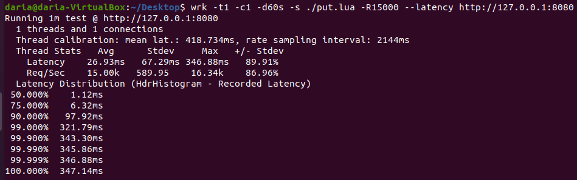
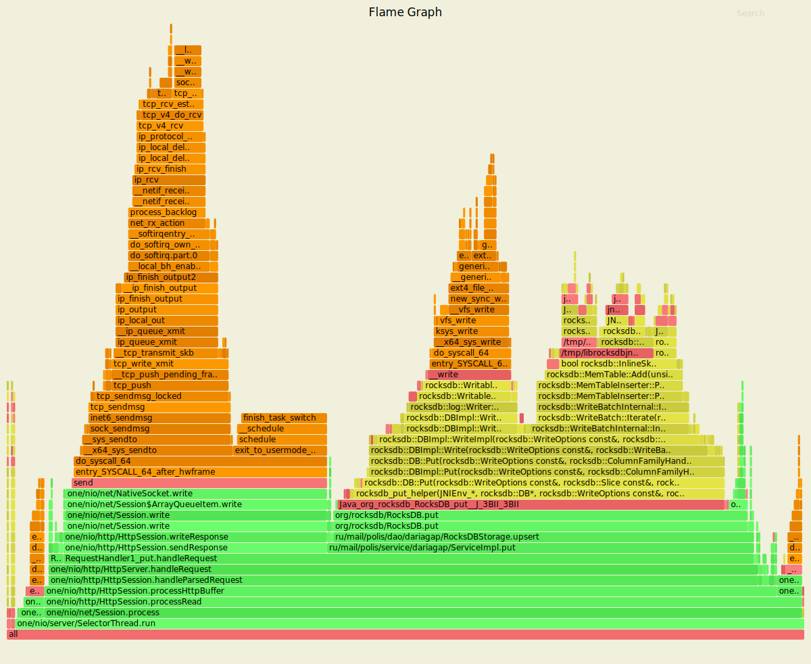
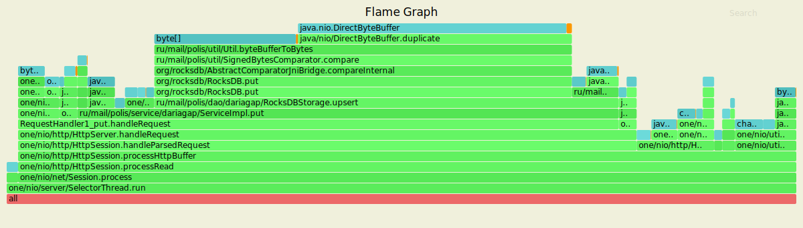
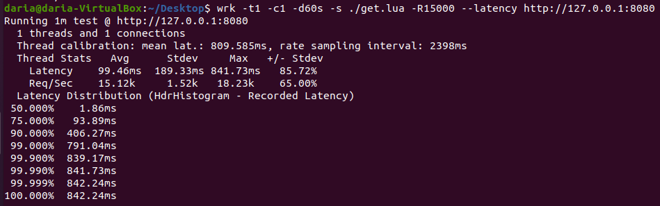
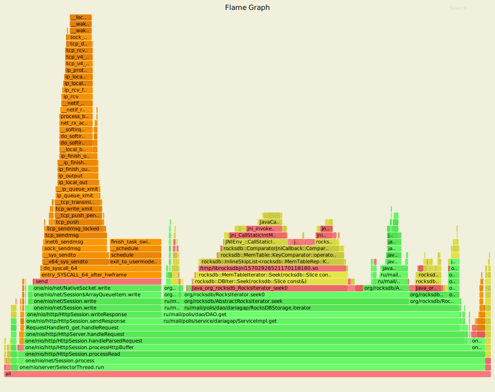
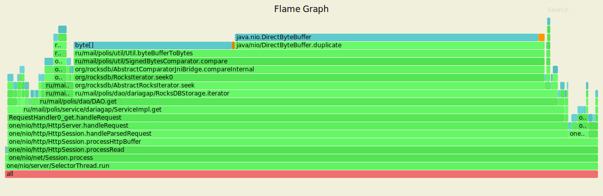

# PUT-запросы

Нагрузочное тестирование с помощью wrk2 проводилось со следующими настройками:

- 1 поток, 1 соединение
- время обстрела - 60 секунд
- стабильная нагрузка 15000 запросов в секунду

Профилирование cpu с помощью async-profiler показывает, что:

- 98% cpu занимает SelectorThread;
- 53% cpu уходит на операцию put (ServiceImpl.put), которая вызывает RocksDBStorage.upsert;
- 33% cpu уходит на отправку ответа (HttpSession.sendResponse).

Профилирование выделения памяти (alloc) с помощью async-profiler показывает, что:

- 68% памяти уходит на операцию put (ServiceImpl.put), которая вызывает RocksDBStorage.upsert;
- 35% памяти потребляет дублирование ByteBuffer при конвертации ByteBuffer в массив байт, требуемый для RocksDB.put;
- 5% памяти уходит на отправку ответа (HttpSession.sendResponse).

# GET-запросы

Нагрузочное тестирование с помощью wrk2 проводилось на заполненной базе данных со следующими настройками:

- 1 поток, 1 соединение
- время обстрела - 60 секунд
- стабильная нагрузка 15000 запросов в секунду

Профилирование cpu с помощью async-profiler показывает, что:

- 96% cpu занимает SelectorThread;
- 61% cpu уходит на операцию get (ServiceImpl.get);
- 28% cpu уходит на отправку ответа (HttpSession.sendResponse).

Профилирование выделения памяти (alloc) с помощью async-profiler показывает, что:

- 88% памяти уходит на операцию get (ServiceImpl.get);
- 52% памяти потребляет дублирование ByteBuffer при конвертации ByteBuffer в массив байт, требуемый для компаратора;
- 2% памяти уходит на отправку ответа (HttpSession.sendResponse).

