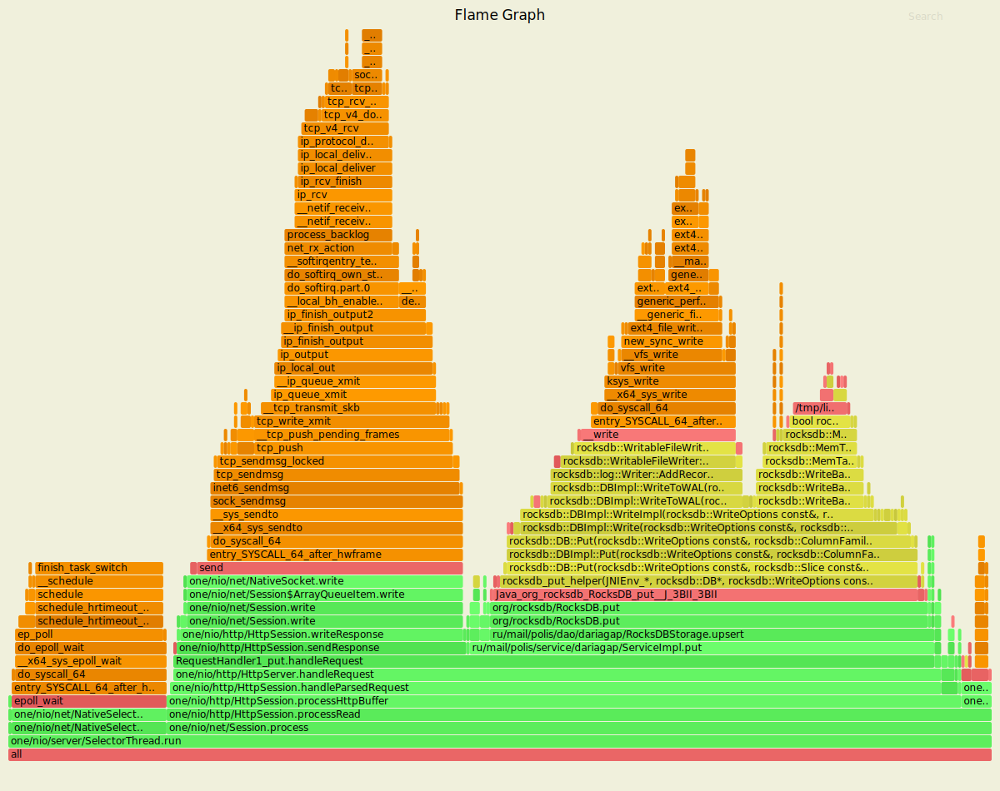
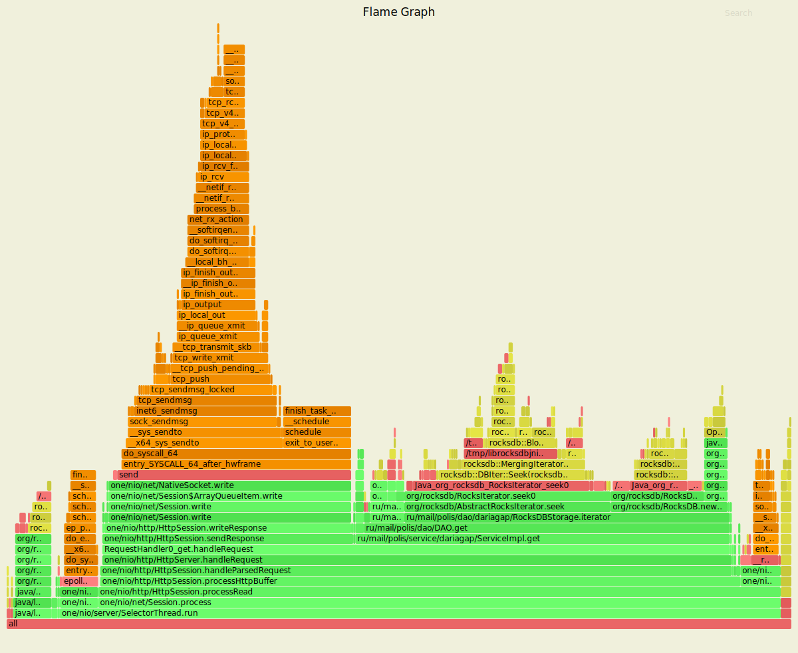
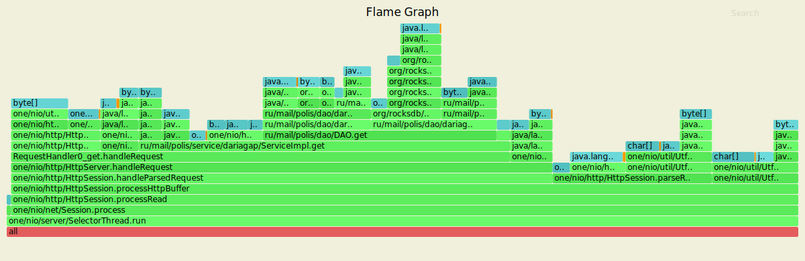
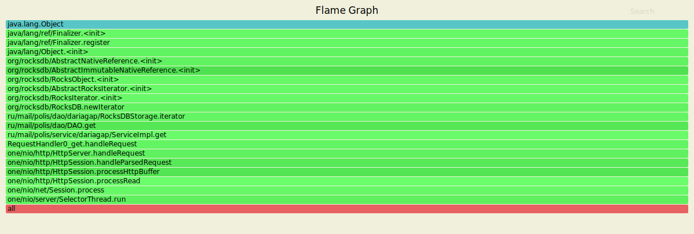

# Многопоточность
Так как RocksDB является потокобезопасной, код практически не изменился. Была сделана оптимизация, касающаяся используемого компаратора, поскольку в предыдущем этапе профилирование выявило использование достаточно большого процента памяти для конвертации данных, требуемой в компараторе.   
## PUT-запросы
Нагрузочное тестирование с помощью wrk2 проводилось со следующими настройками:
- 4 потока, 16 соединений
- время обстрела - 60 секунд
- стабильная нагрузка 15000 запросов в секунду

Результаты:

    wrk -t4 -c16 -d60s -s ./put.lua -R15000 --latency http://127.0.0.1:8080
    Running 1m test @ http://127.0.0.1:8080
      4 threads and 16 connections
      Thread calibration: mean lat.: 1.312ms, rate sampling interval: 10ms
      Thread calibration: mean lat.: 1.302ms, rate sampling interval: 10ms
      Thread calibration: mean lat.: 1.251ms, rate sampling interval: 10ms
      Thread calibration: mean lat.: 1.266ms, rate sampling interval: 10ms
      Thread Stats   Avg      Stdev     Max   +/- Stdev
        Latency     1.07ms    1.02ms  23.52ms   95.13%
        Req/Sec     3.92k   444.59    10.33k    88.34%
      Latency Distribution (HdrHistogram - Recorded Latency)
     50.000%    0.92ms
     75.000%    1.26ms
     90.000%    1.55ms
     99.000%    5.53ms
     99.900%   11.91ms
     99.990%   19.25ms
     99.999%   23.04ms
    100.000%   23.53ms
    
      Detailed Percentile spectrum:
           Value   Percentile   TotalCount 1/(1-Percentile)
    
           0.029     0.000000            2         1.00
           0.383     0.100000        75271         1.11
           0.519     0.200000       150095         1.25
           0.654     0.300000       224946         1.43
           0.788     0.400000       299895         1.67
           0.924     0.500000       374915         2.00
           0.993     0.550000       412578         2.22
           1.061     0.600000       450085         2.50
           1.129     0.650000       487726         2.86
           1.196     0.700000       525243         3.33
           1.263     0.750000       562420         4.00
           1.297     0.775000       581004         4.44
           1.332     0.800000       599730         5.00
           1.371     0.825000       618965         5.71
           1.415     0.850000       637478         6.67
           1.470     0.875000       655954         8.00
           1.507     0.887500       665496         8.89
           1.552     0.900000       674751        10.00
           1.613     0.912500       684132        11.43
           1.694     0.925000       693481        13.33
           1.818     0.937500       702807        16.00
           1.912     0.943750       707498        17.78
           2.046     0.950000       712160        20.00
           2.245     0.956250       716849        22.86
           2.539     0.962500       721560        26.67
           2.953     0.968750       726216        32.00
           3.219     0.971875       728567        35.56
           3.505     0.975000       730903        40.00
           3.825     0.978125       733251        45.71
           4.175     0.981250       735589        53.33
           4.559     0.984375       737949        64.00
           4.771     0.985938       739109        71.11
           5.023     0.987500       740278        80.00
           5.319     0.989062       741449        91.43
           5.695     0.990625       742618       106.67
           6.183     0.992188       743789       128.00
           6.507     0.992969       744377       142.22
           6.883     0.993750       744961       160.00
           7.355     0.994531       745542       182.86
           7.943     0.995313       746128       213.33
           8.639     0.996094       746718       256.00
           9.055     0.996484       747009       284.44
           9.463     0.996875       747299       320.00
           9.871     0.997266       747594       365.71
          10.303     0.997656       747885       426.67
          10.735     0.998047       748178       512.00
          10.959     0.998242       748324       568.89
          11.151     0.998437       748472       640.00
          11.399     0.998633       748618       731.43
          11.647     0.998828       748766       853.33
          11.959     0.999023       748910      1024.00
          12.127     0.999121       748983      1137.78
          12.327     0.999219       749056      1280.00
          12.551     0.999316       749129      1462.86
          12.807     0.999414       749203      1706.67
          13.127     0.999512       749277      2048.00
          13.335     0.999561       749313      2275.56
          13.575     0.999609       749350      2560.00
          13.815     0.999658       749386      2925.71
          14.199     0.999707       749422      3413.33
          14.535     0.999756       749458      4096.00
          14.751     0.999780       749477      4551.11
          15.111     0.999805       749495      5120.00
          15.535     0.999829       749513      5851.43
          16.063     0.999854       749532      6826.67
          17.807     0.999878       749550      8192.00
          18.815     0.999890       749559      9102.22
          19.519     0.999902       749568     10240.00
          19.951     0.999915       749577     11702.86
          20.831     0.999927       749587     13653.33
          21.455     0.999939       749596     16384.00
          21.567     0.999945       749600     18204.44
          21.871     0.999951       749606     20480.00
          21.935     0.999957       749610     23405.71
          22.207     0.999963       749614     27306.67
          22.415     0.999969       749619     32768.00
          22.495     0.999973       749622     36408.89
          22.543     0.999976       749623     40960.00
          22.575     0.999979       749625     46811.43
          22.671     0.999982       749628     54613.33
          22.863     0.999985       749631     65536.00
          22.863     0.999986       749631     72817.78
          22.879     0.999988       749632     81920.00
          22.895     0.999989       749633     93622.86
          23.055     0.999991       749635    109226.67
          23.135     0.999992       749636    131072.00
          23.135     0.999993       749636    145635.56
          23.151     0.999994       749637    163840.00
          23.151     0.999995       749637    187245.71
          23.199     0.999995       749638    218453.33
          23.343     0.999996       749639    262144.00
          23.343     0.999997       749639    291271.11
          23.343     0.999997       749639    327680.00
          23.343     0.999997       749639    374491.43
          23.471     0.999998       749640    436906.67
          23.471     0.999998       749640    524288.00
          23.471     0.999998       749640    582542.22
          23.471     0.999998       749640    655360.00
          23.471     0.999999       749640    748982.86
          23.535     0.999999       749641    873813.33
          23.535     1.000000       749641          inf
    #[Mean    =        1.074, StdDeviation   =        1.019]
    #[Max     =       23.520, Total count    =       749641]
    #[Buckets =           27, SubBuckets     =         2048]
    ----------------------------------------------------------
      899810 requests in 1.00m, 57.49MB read
    Requests/sec:  14997.58
    Transfer/sec:      0.96MB
    
За минуту сделано 899810 запросов, достигнута нагрузка в 14997.58 запросов в секунду, что соответствует выставленной стабильной нагрузке. 99% запросов обрабатываются за 5.53ms.

### async-profiler cpu

Профилирование cpu с помощью async-profiler показывает, что:

- 47% cpu уходит на операцию put (ServiceImpl.put), которая вызывает RocksDBStorage.upsert;
- 29% cpu уходит на отправку ответа (HttpSession.sendResponse).
 
### async-profiler alloc

Профилирование выделения памяти (alloc) с помощью async-profiler показывает, что:

- 33% памяти уходит на операцию put (ServiceImpl.put);
- 14% памяти уходит на отправку ответа (HttpSession.sendResponse).

### async-profiler lock

Несмотря на то, что идут операции добавления в базу, блокировок нет. Это вызвано особенностями реализации RocksDB.

## GET-запросы
Нагрузочное тестирование с помощью wrk2 проводилось на заполненной базе со следующими настройками:
- 4 потока, 16 соединений
- время обстрела - 60 секунд
- стабильная нагрузка 15000 запросов в секунду

Результаты:

    wrk -t4 -c16 -d60s -s ./get.lua -R15000 --latency http://127.0.0.1:8080
    Running 1m test @ http://127.0.0.1:8080
      4 threads and 16 connections
      Thread calibration: mean lat.: 3.320ms, rate sampling interval: 16ms
      Thread calibration: mean lat.: 3.322ms, rate sampling interval: 16ms
      Thread calibration: mean lat.: 3.333ms, rate sampling interval: 16ms
      Thread calibration: mean lat.: 3.320ms, rate sampling interval: 16ms
      Thread Stats   Avg      Stdev     Max   +/- Stdev
        Latency     2.27ms    4.52ms  43.42ms   92.20%
        Req/Sec     3.88k   646.79     9.38k    88.43%
      Latency Distribution (HdrHistogram - Recorded Latency)
     50.000%    1.01ms
     75.000%    1.39ms
     90.000%    3.29ms
     99.000%   22.42ms
     99.900%   33.66ms
     99.990%   40.67ms
     99.999%   42.56ms
    100.000%   43.46ms
    
      Detailed Percentile spectrum:
           Value   Percentile   TotalCount 1/(1-Percentile)
    
           0.030     0.000000            1         1.00
           0.414     0.100000        75237         1.11
           0.566     0.200000       150076         1.25
           0.716     0.300000       224931         1.43
           0.863     0.400000       300330         1.67
           1.009     0.500000       375123         2.00
           1.082     0.550000       412398         2.22
           1.157     0.600000       450185         2.50
           1.232     0.650000       487631         2.86
           1.307     0.700000       525040         3.33
           1.389     0.750000       562552         4.00
           1.437     0.775000       581250         4.44
           1.498     0.800000       599856         5.00
           1.585     0.825000       618514         5.71
           1.727     0.850000       637254         6.67
           2.039     0.875000       655941         8.00
           2.421     0.887500       665317         8.89
           3.291     0.900000       674698        10.00
           4.831     0.912500       684057        11.43
           7.643     0.925000       693423        13.33
          11.415     0.937500       702804        16.00
          12.847     0.943750       707508        17.78
          14.143     0.950000       712188        20.00
          15.335     0.956250       716854        22.86
          16.559     0.962500       721560        26.67
          17.807     0.968750       726291        32.00
          18.399     0.971875       728593        35.56
          18.975     0.975000       730909        40.00
          19.583     0.978125       733310        45.71
          20.191     0.981250       735642        53.33
          20.847     0.984375       737946        64.00
          21.231     0.985938       739141        71.11
          21.615     0.987500       740289        80.00
          22.095     0.989062       741479        91.43
          22.655     0.990625       742628       106.67
          23.343     0.992188       743790       128.00
          23.759     0.992969       744381       142.22
          24.223     0.993750       744975       160.00
          24.783     0.994531       745550       182.86
          25.535     0.995313       746139       213.33
          26.479     0.996094       746722       256.00
          27.039     0.996484       747014       284.44
          27.615     0.996875       747306       320.00
          28.223     0.997266       747600       365.71
          28.895     0.997656       747900       426.67
          29.679     0.998047       748183       512.00
          30.207     0.998242       748330       568.89
          31.023     0.998437       748475       640.00
          32.015     0.998633       748626       731.43
          32.927     0.998828       748773       853.33
          33.759     0.999023       748917      1024.00
          34.207     0.999121       748992      1137.78
          34.687     0.999219       749061      1280.00
          35.391     0.999316       749134      1462.86
          36.127     0.999414       749208      1706.67
          36.863     0.999512       749280      2048.00
          37.279     0.999561       749318      2275.56
          37.727     0.999609       749354      2560.00
          38.175     0.999658       749392      2925.71
          38.591     0.999707       749428      3413.33
          39.071     0.999756       749466      4096.00
          39.327     0.999780       749484      4551.11
          39.551     0.999805       749501      5120.00
          39.775     0.999829       749518      5851.43
          40.127     0.999854       749541      6826.67
          40.415     0.999878       749555      8192.00
          40.639     0.999890       749568      9102.22
          40.735     0.999902       749573     10240.00
          40.959     0.999915       749582     11702.86
          41.151     0.999927       749592     13653.33
          41.375     0.999939       749602     16384.00
          41.439     0.999945       749605     18204.44
          41.535     0.999951       749612     20480.00
          41.567     0.999957       749614     23405.71
          41.887     0.999963       749620     27306.67
          42.047     0.999969       749625     32768.00
          42.079     0.999973       749626     36408.89
          42.111     0.999976       749628     40960.00
          42.239     0.999979       749630     46811.43
          42.303     0.999982       749635     54613.33
          42.303     0.999985       749635     65536.00
          42.431     0.999986       749637     72817.78
          42.431     0.999988       749637     81920.00
          42.463     0.999989       749638     93622.86
          42.591     0.999991       749640    109226.67
          42.687     0.999992       749641    131072.00
          42.687     0.999993       749641    145635.56
          42.783     0.999994       749642    163840.00
          42.783     0.999995       749642    187245.71
          42.815     0.999995       749643    218453.33
          43.007     0.999996       749644    262144.00
          43.007     0.999997       749644    291271.11
          43.007     0.999997       749644    327680.00
          43.007     0.999997       749644    374491.43
          43.199     0.999998       749645    436906.67
          43.199     0.999998       749645    524288.00
          43.199     0.999998       749645    582542.22
          43.199     0.999998       749645    655360.00
          43.199     0.999999       749645    748982.86
          43.455     0.999999       749646    873813.33
          43.455     1.000000       749646          inf
    #[Mean    =        2.272, StdDeviation   =        4.517]
    #[Max     =       43.424, Total count    =       749646]
    #[Buckets =           27, SubBuckets     =         2048]
    ----------------------------------------------------------
      899829 requests in 1.00m, 63.04MB read
    Requests/sec:  14997.62
    Transfer/sec:      1.05MB
    
За минуту сделано 899829 запросов, достигнута нагрузка в 14997.62 запросов в секунду, что соответствует выставленной стабильной нагрузке. 90% запросов обрабатываются за 3.29ms.

### async-profiler cpu

Профилирование cpu с помощью async-profiler показывает, что:

- 48% cpu уходит на операцию get (ServiceImpl.get);
- 32% cpu уходит на отправку ответа (HttpSession.sendResponse).
 
### async-profiler alloc

Профилирование выделения памяти (alloc) с помощью async-profiler показывает, что:

- 47% памяти уходит на операцию get (ServiceImpl.get);
- 11% памяти уходит на отправку ответа (HttpSession.sendResponse).

### async-profiler lock

При чтении из базы появляются блокировки, вызванные методом RocksDB.newIterator, поскольку итератор используется в дефолтной реализации get в ru.mail.polis.dao.DAO.
