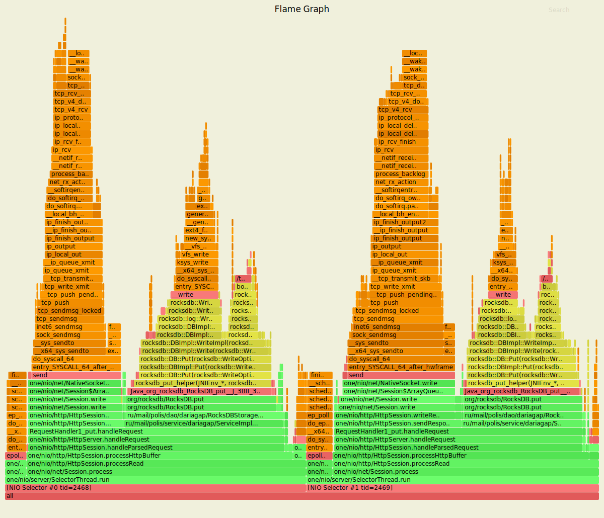
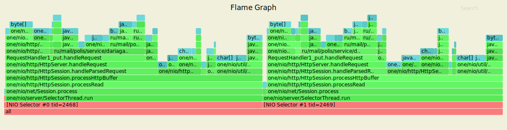
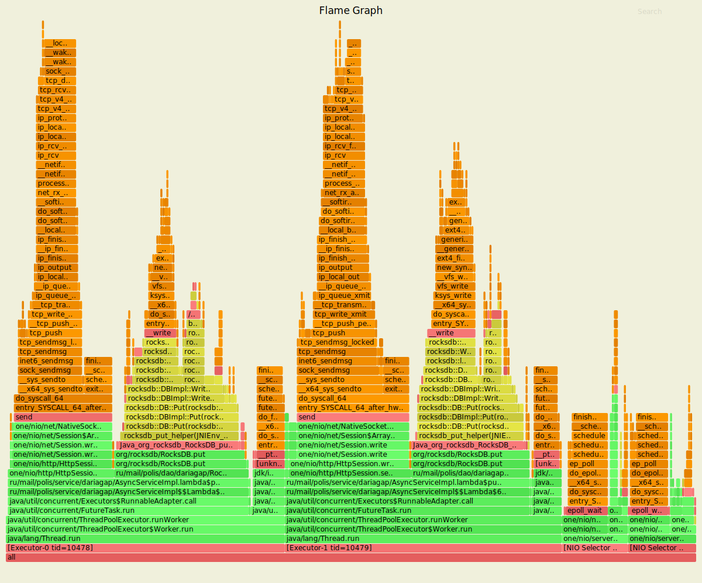
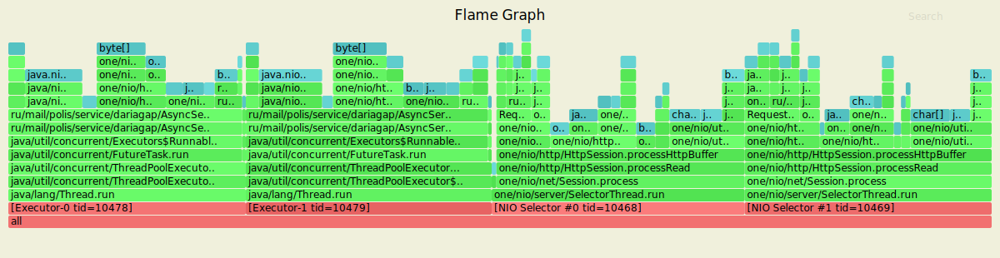
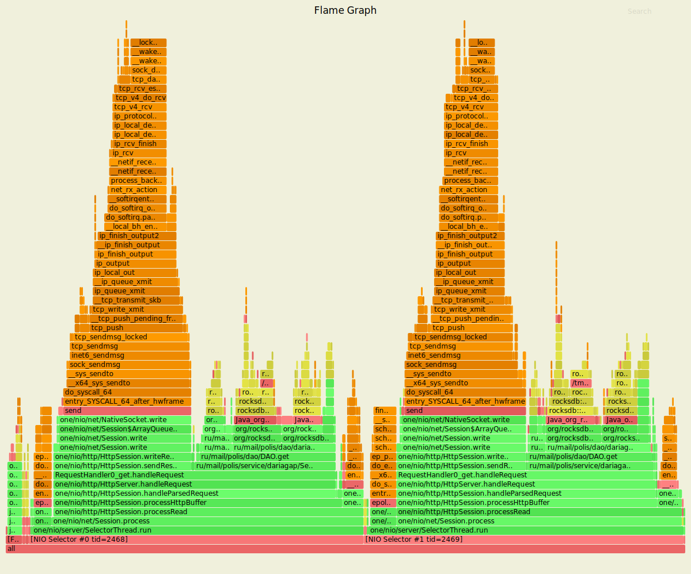
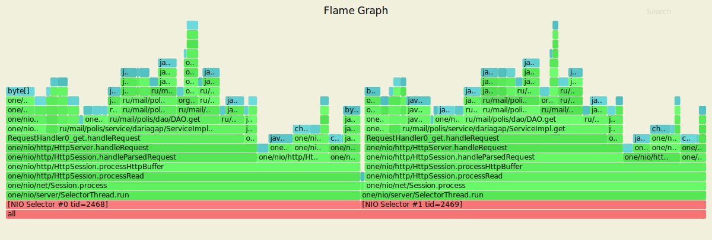
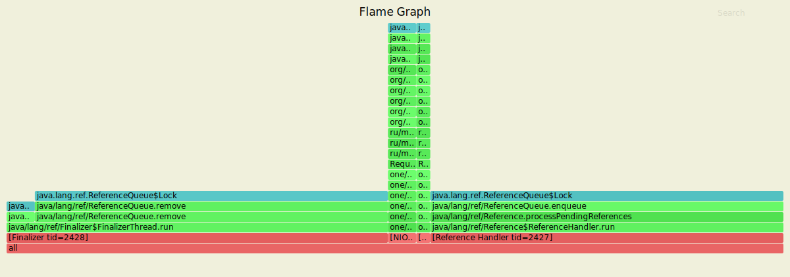
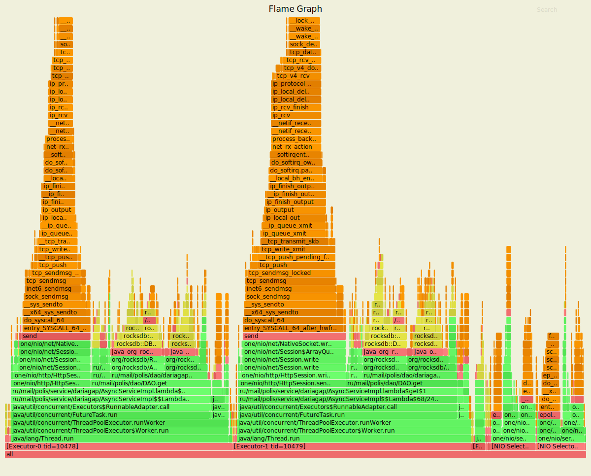
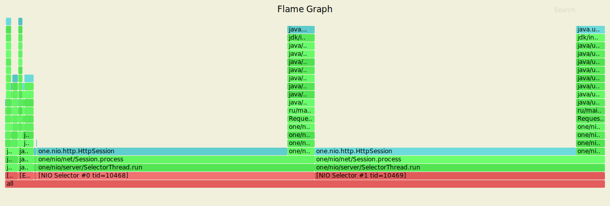

# Асинхронный сервер
## PUT-запросы
Нагрузочное тестирование с помощью wrk2 проводилось со следующими настройками:
- 4 потока, 64 соединения
- время обстрела - 60 секунд
- стабильная нагрузка 10000 запросов в секунду

### Синхронная версия
Результаты:

    wrk -t4 -c64 -d60s -s ./put.lua -R10000 --latency http://127.0.0.1:8080
    Running 1m test @ http://127.0.0.1:8080
      4 threads and 64 connections
      Thread calibration: mean lat.: 2.027ms, rate sampling interval: 10ms
      Thread calibration: mean lat.: 2.040ms, rate sampling interval: 10ms
      Thread calibration: mean lat.: 2.054ms, rate sampling interval: 10ms
      Thread calibration: mean lat.: 1.991ms, rate sampling interval: 10ms
      Thread Stats   Avg      Stdev     Max   +/- Stdev
        Latency     1.83ms    1.65ms  35.49ms   92.98%
        Req/Sec     2.65k   491.16     8.11k    82.05%
      Latency Distribution (HdrHistogram - Recorded Latency)
     50.000%    1.52ms
     75.000%    2.20ms
     90.000%    3.03ms
     99.000%    8.47ms
     99.900%   20.00ms
     99.990%   29.58ms
     99.999%   33.50ms
    100.000%   35.52ms
    
      Detailed Percentile spectrum:
           Value   Percentile   TotalCount 1/(1-Percentile)
    
           0.043     0.000000            1         1.00
           0.616     0.100000        50003         1.11
           0.864     0.200000        99914         1.25
           1.083     0.300000       149828         1.43
           1.298     0.400000       199893         1.67
           1.521     0.500000       249694         2.00
           1.640     0.550000       274756         2.22
           1.762     0.600000       299687         2.50
           1.892     0.650000       324539         2.86
           2.035     0.700000       349573         3.33
           2.199     0.750000       374637         4.00
           2.289     0.775000       386906         4.44
           2.391     0.800000       399356         5.00
           2.509     0.825000       411867         5.71
           2.645     0.850000       424447         6.67
           2.811     0.875000       436880         8.00
           2.911     0.887500       443102         8.89
           3.029     0.900000       449297        10.00
           3.169     0.912500       455553        11.43
           3.343     0.925000       461798        13.33
           3.579     0.937500       468046        16.00
           3.733     0.943750       471128        17.78
           3.929     0.950000       474236        20.00
           4.187     0.956250       477363        22.86
           4.515     0.962500       480487        26.67
           4.951     0.968750       483617        32.00
           5.211     0.971875       485165        35.56
           5.515     0.975000       486719        40.00
           5.899     0.978125       488278        45.71
           6.351     0.981250       489845        53.33
           6.923     0.984375       491397        64.00
           7.267     0.985938       492177        71.11
           7.679     0.987500       492961        80.00
           8.131     0.989062       493743        91.43
           8.711     0.990625       494522       106.67
           9.423     0.992188       495297       128.00
           9.815     0.992969       495688       142.22
          10.343     0.993750       496077       160.00
          10.919     0.994531       496467       182.86
          11.623     0.995313       496857       213.33
          12.583     0.996094       497246       256.00
          13.087     0.996484       497444       284.44
          13.735     0.996875       497638       320.00
          14.439     0.997266       497831       365.71
          15.279     0.997656       498028       426.67
          16.175     0.998047       498222       512.00
          16.655     0.998242       498321       568.89
          17.535     0.998437       498418       640.00
          18.303     0.998633       498513       731.43
          19.023     0.998828       498611       853.33
          20.111     0.999023       498708      1024.00
          20.783     0.999121       498759      1137.78
          21.503     0.999219       498807      1280.00
          22.367     0.999316       498854      1462.86
          23.135     0.999414       498905      1706.67
          23.855     0.999512       498952      2048.00
          24.159     0.999561       498976      2275.56
          24.687     0.999609       499001      2560.00
          25.231     0.999658       499026      2925.71
          25.695     0.999707       499049      3413.33
          26.463     0.999756       499075      4096.00
          26.623     0.999780       499086      4551.11
          27.007     0.999805       499098      5120.00
          27.519     0.999829       499110      5851.43
          28.191     0.999854       499122      6826.67
          28.927     0.999878       499135      8192.00
          29.167     0.999890       499141      9102.22
          29.775     0.999902       499147     10240.00
          30.303     0.999915       499154     11702.86
          30.655     0.999927       499159     13653.33
          31.407     0.999939       499165     16384.00
          31.839     0.999945       499168     18204.44
          32.239     0.999951       499171     20480.00
          32.575     0.999957       499174     23405.71
          32.703     0.999963       499177     27306.67
          32.895     0.999969       499180     32768.00
          33.087     0.999973       499182     36408.89
          33.151     0.999976       499183     40960.00
          33.279     0.999979       499185     46811.43
          33.311     0.999982       499186     54613.33
          33.439     0.999985       499188     65536.00
          33.503     0.999986       499190     72817.78
          33.503     0.999988       499190     81920.00
          33.503     0.999989       499190     93622.86
          33.695     0.999991       499191    109226.67
          33.887     0.999992       499192    131072.00
          33.887     0.999993       499192    145635.56
          33.887     0.999994       499192    163840.00
          34.047     0.999995       499193    187245.71
          34.047     0.999995       499193    218453.33
          34.655     0.999996       499194    262144.00
          34.655     0.999997       499194    291271.11
          34.655     0.999997       499194    327680.00
          34.655     0.999997       499194    374491.43
          34.655     0.999998       499194    436906.67
          35.519     0.999998       499195    524288.00
          35.519     1.000000       499195          inf
    #[Mean    =        1.831, StdDeviation   =        1.649]
    #[Max     =       35.488, Total count    =       499195]
    #[Buckets =           27, SubBuckets     =         2048]
    ----------------------------------------------------------
      599629 requests in 1.00m, 38.31MB read
    Requests/sec:   9993.71
    Transfer/sec:    653.89KB
    
За минуту сделано 599629 запросов, достигнута нагрузка в 9993.71 запросов в секунду, что соответствует выставленной стабильной нагрузке. 99% запросов обрабатываются за 8.47ms.

#### async-profiler cpu

Профилирование cpu с помощью async-profiler показывает, что:

- имеется 2 селектора, каждый из которых занимает 50% cpu;
- по 20 - 25% cpu в каждом селекторе уходит на операцию put (ServiceImpl.put);
- по 15 - 20% cpu в каждом селекторе  уходит на отправку ответа (HttpSession.sendResponse).
 
#### async-profiler alloc

Профилирование выделения памяти (alloc) с помощью async-profiler показывает, что:

- имеется 2 селектора, каждый из которых занимает 50% памяти;
- по 15 - 18% памяти в каждом селекторе уходит на операцию put (ServiceImpl.put);
- по 5 - 9% памяти в каждом селекторе  уходит на отправку ответа (HttpSession.sendResponse).

#### async-profiler lock

Несмотря на то, что идут операции добавления в базу, блокировок нет. Это вызвано особенностями реализации RocksDB.

### Асинхронная версия
Результаты:

    wrk -t4 -c64 -d60s -s ./put.lua -R10000 --latency http://127.0.0.1:8080
    Running 1m test @ http://127.0.0.1:8080
      4 threads and 64 connections
      Thread calibration: mean lat.: 1.887ms, rate sampling interval: 10ms
      Thread calibration: mean lat.: 1.881ms, rate sampling interval: 10ms
      Thread calibration: mean lat.: 1.920ms, rate sampling interval: 10ms
      Thread calibration: mean lat.: 1.862ms, rate sampling interval: 10ms
      Thread Stats   Avg      Stdev     Max   +/- Stdev
        Latency     1.83ms    1.24ms  23.12ms   84.12%
        Req/Sec     2.65k   436.94     7.33k    79.15%
      Latency Distribution (HdrHistogram - Recorded Latency)
     50.000%    1.62ms
     75.000%    2.35ms
     90.000%    3.04ms
     99.000%    6.44ms
     99.900%   13.84ms
     99.990%   19.33ms
     99.999%   21.71ms
    100.000%   23.14ms
    
      Detailed Percentile spectrum:
           Value   Percentile   TotalCount 1/(1-Percentile)
    
           0.053     0.000000            1         1.00
           0.703     0.100000        50057         1.11
           0.952     0.200000        99853         1.25
           1.168     0.300000       149794         1.43
           1.384     0.400000       199686         1.67
           1.615     0.500000       249699         2.00
           1.740     0.550000       274586         2.22
           1.875     0.600000       299683         2.50
           2.020     0.650000       324586         2.86
           2.177     0.700000       349648         3.33
           2.347     0.750000       374607         4.00
           2.437     0.775000       386908         4.44
           2.535     0.800000       399468         5.00
           2.639     0.825000       411897         5.71
           2.755     0.850000       424478         6.67
           2.887     0.875000       436990         8.00
           2.959     0.887500       443103         8.89
           3.039     0.900000       449307        10.00
           3.127     0.912500       455552        11.43
           3.229     0.925000       461834        13.33
           3.349     0.937500       468076        16.00
           3.419     0.943750       471146        17.78
           3.501     0.950000       474300        20.00
           3.595     0.956250       477377        22.86
           3.717     0.962500       480533        26.67
           3.877     0.968750       483621        32.00
           3.989     0.971875       485172        35.56
           4.127     0.975000       486733        40.00
           4.323     0.978125       488326        45.71
           4.615     0.981250       489859        53.33
           5.059     0.984375       491412        64.00
           5.355     0.985938       492197        71.11
           5.699     0.987500       492973        80.00
           6.131     0.989062       493749        91.43
           6.663     0.990625       494531       106.67
           7.275     0.992188       495313       128.00
           7.611     0.992969       495701       142.22
           7.995     0.993750       496089       160.00
           8.455     0.994531       496483       182.86
           8.951     0.995313       496873       213.33
           9.623     0.996094       497259       256.00
          10.007     0.996484       497455       284.44
          10.391     0.996875       497653       320.00
          10.783     0.997266       497846       365.71
          11.279     0.997656       498041       426.67
          11.823     0.998047       498234       512.00
          12.239     0.998242       498334       568.89
          12.591     0.998437       498430       640.00
          12.943     0.998633       498527       731.43
          13.431     0.998828       498625       853.33
          13.879     0.999023       498722      1024.00
          14.103     0.999121       498772      1137.78
          14.503     0.999219       498820      1280.00
          14.847     0.999316       498868      1462.86
          15.223     0.999414       498919      1706.67
          15.711     0.999512       498966      2048.00
          15.903     0.999561       498991      2275.56
          16.231     0.999609       499014      2560.00
          16.575     0.999658       499040      2925.71
          16.863     0.999707       499064      3413.33
          17.343     0.999756       499090      4096.00
          17.583     0.999780       499101      4551.11
          17.871     0.999805       499113      5120.00
          18.079     0.999829       499124      5851.43
          18.431     0.999854       499137      6826.67
          18.847     0.999878       499149      8192.00
          19.183     0.999890       499155      9102.22
          19.391     0.999902       499163     10240.00
          19.599     0.999915       499167     11702.86
          19.887     0.999927       499173     13653.33
          20.271     0.999939       499179     16384.00
          20.303     0.999945       499182     18204.44
          20.447     0.999951       499185     20480.00
          20.623     0.999957       499188     23405.71
          20.783     0.999963       499191     27306.67
          20.991     0.999969       499194     32768.00
          21.295     0.999973       499196     36408.89
          21.311     0.999976       499197     40960.00
          21.391     0.999979       499199     46811.43
          21.407     0.999982       499200     54613.33
          21.599     0.999985       499202     65536.00
          21.679     0.999986       499203     72817.78
          21.679     0.999988       499203     81920.00
          21.711     0.999989       499204     93622.86
          21.855     0.999991       499205    109226.67
          22.143     0.999992       499206    131072.00
          22.143     0.999993       499206    145635.56
          22.143     0.999994       499206    163840.00
          22.223     0.999995       499207    187245.71
          22.223     0.999995       499207    218453.33
          22.863     0.999996       499208    262144.00
          22.863     0.999997       499208    291271.11
          22.863     0.999997       499208    327680.00
          22.863     0.999997       499208    374491.43
          22.863     0.999998       499208    436906.67
          23.135     0.999998       499209    524288.00
          23.135     1.000000       499209          inf
    #[Mean    =        1.832, StdDeviation   =        1.241]
    #[Max     =       23.120, Total count    =       499209]
    #[Buckets =           27, SubBuckets     =         2048]
    ----------------------------------------------------------
      599637 requests in 1.00m, 38.31MB read
    Requests/sec:   9994.08
    Transfer/sec:    653.91KB
    
За минуту сделано 599637 запросов, достигнута нагрузка в 9994.08 запросов в секунду, что соответствует выставленной стабильной нагрузке. 99% запросов обрабатываются за 6.44ms.

По сравнению с синхронной версией уменьшилась максимальная задержка (все запросы обрабатываются не более чем за 23.12ms против 35.49ms в синхронной версии) и уменьшилось отклонение (Stdev) - 84.12% против 92.98% в синхронной версии.

#### async-profiler cpu

Профилирование cpu с помощью async-profiler показывает, что:

- имеется 2 селектора, каждый из которых занимает 10% cpu;
- имеется 2 потока, обрабатывающих запросы к асинхронному серверу (Executor), каждый из которых занимает 40% cpu;
- все действия по обработке запросов и отправке ответов выполняются в Executor-потоках;
- селекторы только парсят запросы и отдают их на обработку в Executor-поток;
- по 17 - 20% cpu в каждом Executor-потоке уходит на операцию put (RocksDBStorage.upsert);
- по 15 - 17% cpu в каждом Executor-потоке уходит на отправку ответа (HttpSession.sendResponse).
 
#### async-profiler alloc

Профилирование выделения памяти (alloc) с помощью async-profiler показывает, что:

- имеется 2 селектора и 2 потока, обрабатывающих запросы к асинхронному серверу (Executor), каждый из которых занимает 25% памяти;
- по 3% памяти в каждом Executor-потоке уходит на операцию put (RocksDBStorage.upsert);
- по 7% памяти в каждом Executor-потоке уходит на отправку ответа (HttpSession.sendResponse).

#### async-profiler lock

Добавляются блокировки, связанные с переключением между потоками.

## GET-запросы
Нагрузочное тестирование с помощью wrk2 проводилось на заполненной базе со следующими настройками:
- 4 потока, 64 соединения
- время обстрела - 60 секунд
- стабильная нагрузка 10000 запросов в секунду

### Синхронная версия
Результаты:

    wrk -t4 -c64 -d60s -s ./get.lua -R10000 --latency http://127.0.0.1:8080
    Running 1m test @ http://127.0.0.1:8080
      4 threads and 64 connections
      Thread calibration: mean lat.: 2.665ms, rate sampling interval: 10ms
      Thread calibration: mean lat.: 2.606ms, rate sampling interval: 10ms
      Thread calibration: mean lat.: 2.673ms, rate sampling interval: 10ms
      Thread calibration: mean lat.: 2.597ms, rate sampling interval: 10ms
      Thread Stats   Avg      Stdev     Max   +/- Stdev
        Latency     2.68ms    5.65ms  92.03ms   96.00%
        Req/Sec     2.68k   634.30    14.20k    90.10%
      Latency Distribution (HdrHistogram - Recorded Latency)
     50.000%    1.64ms
     75.000%    2.42ms
     90.000%    3.34ms
     99.000%   30.62ms
     99.900%   71.68ms
     99.990%   86.59ms
     99.999%   91.07ms
    100.000%   92.10ms
    
      Detailed Percentile spectrum:
           Value   Percentile   TotalCount 1/(1-Percentile)
    
           0.041     0.000000            1         1.00
           0.684     0.100000        50017         1.11
           0.943     0.200000        99998         1.25
           1.169     0.300000       149820         1.43
           1.398     0.400000       199797         1.67
           1.642     0.500000       249707         2.00
           1.774     0.550000       274704         2.22
           1.916     0.600000       299682         2.50
           2.067     0.650000       324585         2.86
           2.233     0.700000       349690         3.33
           2.417     0.750000       374590         4.00
           2.519     0.775000       386946         4.44
           2.633     0.800000       399444         5.00
           2.761     0.825000       411886         5.71
           2.909     0.850000       424324         6.67
           3.087     0.875000       436823         8.00
           3.201     0.887500       443066         8.89
           3.335     0.900000       449334        10.00
           3.507     0.912500       455536        11.43
           3.769     0.925000       461802        13.33
           4.327     0.937500       467999        16.00
           4.987     0.943750       471121        17.78
           6.031     0.950000       474239        20.00
           7.375     0.956250       477362        22.86
           9.071     0.962500       480488        26.67
          11.335     0.968750       483609        32.00
          12.831     0.971875       485162        35.56
          14.543     0.975000       486720        40.00
          16.463     0.978125       488285        45.71
          18.991     0.981250       489845        53.33
          22.431     0.984375       491403        64.00
          24.367     0.985938       492179        71.11
          26.479     0.987500       492960        80.00
          28.879     0.989062       493743        91.43
          31.919     0.990625       494520       106.67
          35.583     0.992188       495299       128.00
          37.631     0.992969       495695       142.22
          39.903     0.993750       496083       160.00
          42.815     0.994531       496469       182.86
          46.335     0.995313       496859       213.33
          50.591     0.996094       497250       256.00
          52.639     0.996484       497445       284.44
          54.847     0.996875       497643       320.00
          57.791     0.997266       497836       365.71
          60.447     0.997656       498030       426.67
          63.263     0.998047       498230       512.00
          64.735     0.998242       498321       568.89
          66.431     0.998437       498419       640.00
          68.287     0.998633       498516       731.43
          69.887     0.998828       498615       853.33
          71.935     0.999023       498711      1024.00
          73.023     0.999121       498762      1137.78
          74.047     0.999219       498811      1280.00
          75.135     0.999316       498860      1462.86
          76.287     0.999414       498907      1706.67
          77.375     0.999512       498957      2048.00
          77.951     0.999561       498980      2275.56
          78.719     0.999609       499004      2560.00
          79.487     0.999658       499028      2925.71
          80.767     0.999707       499054      3413.33
          81.855     0.999756       499079      4096.00
          83.007     0.999780       499089      4551.11
          83.903     0.999805       499103      5120.00
          84.671     0.999829       499113      5851.43
          85.375     0.999854       499126      6826.67
          86.015     0.999878       499138      8192.00
          86.271     0.999890       499145      9102.22
          86.719     0.999902       499151     10240.00
          87.423     0.999915       499157     11702.86
          87.935     0.999927       499162     13653.33
          88.319     0.999939       499169     16384.00
          88.447     0.999945       499171     18204.44
          88.767     0.999951       499175     20480.00
          88.959     0.999957       499177     23405.71
          89.343     0.999963       499182     27306.67
          89.471     0.999969       499183     32768.00
          89.663     0.999973       499185     36408.89
          89.727     0.999976       499186     40960.00
          89.919     0.999979       499188     46811.43
          90.239     0.999982       499189     54613.33
          90.687     0.999985       499191     65536.00
          90.815     0.999986       499192     72817.78
          90.815     0.999988       499192     81920.00
          91.071     0.999989       499193     93622.86
          91.327     0.999991       499194    109226.67
          91.583     0.999992       499196    131072.00
          91.583     0.999993       499196    145635.56
          91.583     0.999994       499196    163840.00
          91.583     0.999995       499196    187245.71
          91.583     0.999995       499196    218453.33
          91.967     0.999996       499197    262144.00
          91.967     0.999997       499197    291271.11
          91.967     0.999997       499197    327680.00
          91.967     0.999997       499197    374491.43
          91.967     0.999998       499197    436906.67
          92.095     0.999998       499198    524288.00
          92.095     1.000000       499198          inf
    #[Mean    =        2.678, StdDeviation   =        5.645]
    #[Max     =       92.032, Total count    =       499198]
    #[Buckets =           27, SubBuckets     =         2048]
    ----------------------------------------------------------
      599622 requests in 1.00m, 41.85MB read
    Requests/sec:   9993.78
    Transfer/sec:    714.32KB
    
За минуту сделано 599622 запросов, достигнута нагрузка в 9993.78 запросов в секунду, что соответствует выставленной стабильной нагрузке. 99% запросов обрабатываются за 30.62ms.

#### async-profiler cpu

Профилирование cpu с помощью async-profiler показывает, что:

- имеется 2 селектора, каждый из которых занимает 47 - 49% cpu;
- по 18 - 20% cpu в каждом селекторе уходит на операцию get (ServiceImpl.get);
- по 19 - 20% cpu в каждом селекторе уходит на отправку ответа (HttpSession.sendResponse).
 
#### async-profiler alloc

Профилирование выделения памяти (alloc) с помощью async-profiler показывает, что:

- имеется 2 селектора, каждый из которых занимает 50% памяти;
- по 26 - 29% памяти в каждом селекторе уходит на операцию get (ServiceImpl.get);
- по 4 - 6% памяти в каждом селекторе  уходит на отправку ответа (HttpSession.sendResponse).

#### async-profiler lock

При чтении из базы появляются блокировки, вызванные методом RocksDB.newIterator, поскольку итератор используется в дефолтной реализации get в ru.mail.polis.dao.DAO.

### Асинхронная версия
Результаты:

    wrk -t4 -c64 -d60s -s ./get.lua -R10000 --latency http://127.0.0.1:8080
    Running 1m test @ http://127.0.0.1:8080
      4 threads and 64 connections
      Thread calibration: mean lat.: 1.909ms, rate sampling interval: 10ms
      Thread calibration: mean lat.: 1.901ms, rate sampling interval: 10ms
      Thread calibration: mean lat.: 1.888ms, rate sampling interval: 10ms
      Thread calibration: mean lat.: 1.862ms, rate sampling interval: 10ms
      Thread Stats   Avg      Stdev     Max   +/- Stdev
        Latency     1.86ms    1.31ms  31.97ms   87.28%
        Req/Sec     2.65k   427.07     8.10k    82.32%
      Latency Distribution (HdrHistogram - Recorded Latency)
     50.000%    1.63ms
     75.000%    2.32ms
     90.000%    3.01ms
     99.000%    7.44ms
     99.900%   14.34ms
     99.990%   19.79ms
     99.999%   24.09ms
    100.000%   31.98ms
    
      Detailed Percentile spectrum:
           Value   Percentile   TotalCount 1/(1-Percentile)
    
           0.047     0.000000            1         1.00
           0.726     0.100000        50073         1.11
           0.981     0.200000        99907         1.25
           1.197     0.300000       149867         1.43
           1.409     0.400000       199688         1.67
           1.633     0.500000       249744         2.00
           1.753     0.550000       274726         2.22
           1.879     0.600000       299525         2.50
           2.013     0.650000       324593         2.86
           2.159     0.700000       349619         3.33
           2.319     0.750000       374494         4.00
           2.407     0.775000       387081         4.44
           2.501     0.800000       399470         5.00
           2.605     0.825000       411841         5.71
           2.723     0.850000       424499         6.67
           2.853     0.875000       436819         8.00
           2.929     0.887500       443049         8.89
           3.011     0.900000       449292        10.00
           3.105     0.912500       455592        11.43
           3.211     0.925000       461868        13.33
           3.337     0.937500       468052        16.00
           3.413     0.943750       471132        17.78
           3.505     0.950000       474286        20.00
           3.613     0.956250       477385        22.86
           3.753     0.962500       480484        26.67
           3.973     0.968750       483597        32.00
           4.139     0.971875       485161        35.56
           4.375     0.975000       486716        40.00
           4.739     0.978125       488279        45.71
           5.251     0.981250       489832        53.33
           5.875     0.984375       491398        64.00
           6.235     0.985938       492170        71.11
           6.659     0.987500       492953        80.00
           7.139     0.989062       493733        91.43
           7.643     0.990625       494512       106.67
           8.271     0.992188       495297       128.00
           8.607     0.992969       495684       142.22
           9.007     0.993750       496072       160.00
           9.431     0.994531       496461       182.86
           9.927     0.995313       496851       213.33
          10.471     0.996094       497240       256.00
          10.759     0.996484       497435       284.44
          11.095     0.996875       497631       320.00
          11.471     0.997266       497827       365.71
          11.903     0.997656       498020       426.67
          12.399     0.998047       498215       512.00
          12.647     0.998242       498312       568.89
          13.047     0.998437       498412       640.00
          13.511     0.998633       498510       731.43
          13.935     0.998828       498607       853.33
          14.391     0.999023       498702      1024.00
          14.687     0.999121       498751      1137.78
          15.055     0.999219       498800      1280.00
          15.431     0.999316       498848      1462.86
          15.775     0.999414       498898      1706.67
          16.327     0.999512       498946      2048.00
          16.591     0.999561       498971      2275.56
          16.815     0.999609       498995      2560.00
          17.071     0.999658       499019      2925.71
          17.391     0.999707       499044      3413.33
          17.807     0.999756       499069      4096.00
          18.079     0.999780       499080      4551.11
          18.271     0.999805       499092      5120.00
          18.767     0.999829       499104      5851.43
          19.263     0.999854       499116      6826.67
          19.503     0.999878       499129      8192.00
          19.711     0.999890       499135      9102.22
          19.807     0.999902       499141     10240.00
          20.047     0.999915       499147     11702.86
          20.223     0.999927       499153     13653.33
          20.511     0.999939       499159     16384.00
          20.895     0.999945       499162     18204.44
          21.135     0.999951       499165     20480.00
          21.199     0.999957       499168     23405.71
          21.487     0.999963       499171     27306.67
          21.903     0.999969       499174     32768.00
          22.159     0.999973       499176     36408.89
          22.239     0.999976       499177     40960.00
          22.559     0.999979       499179     46811.43
          22.927     0.999982       499181     54613.33
          23.439     0.999985       499182     65536.00
          23.887     0.999986       499183     72817.78
          23.887     0.999988       499183     81920.00
          24.095     0.999989       499184     93622.86
          24.495     0.999991       499185    109226.67
          24.543     0.999992       499186    131072.00
          24.543     0.999993       499186    145635.56
          24.543     0.999994       499186    163840.00
          24.847     0.999995       499187    187245.71
          24.847     0.999995       499187    218453.33
          25.663     0.999996       499188    262144.00
          25.663     0.999997       499188    291271.11
          25.663     0.999997       499188    327680.00
          25.663     0.999997       499188    374491.43
          25.663     0.999998       499188    436906.67
          31.983     0.999998       499189    524288.00
          31.983     1.000000       499189          inf
    #[Mean    =        1.858, StdDeviation   =        1.313]
    #[Max     =       31.968, Total count    =       499189]
    #[Buckets =           27, SubBuckets     =         2048]
    ----------------------------------------------------------
      599639 requests in 1.00m, 41.86MB read
    Requests/sec:   9993.97
    Transfer/sec:    714.34KB
    
За минуту сделано 599639 запросов, достигнута нагрузка в 9993.97 запросов в секунду, что соответствует выставленной стабильной нагрузке. 99% запросов обрабатываются за 7.44ms.

По сравнению с синхронной версией уменьшилась максимальная задержка (все запросы обрабатываются не более чем за 31.97ms против 92.03ms в синхронной версии) и уменьшилось отклонение (Stdev) - 87.28% против 96.00% в синхронной версии.

#### async-profiler cpu

Профилирование cpu с помощью async-profiler показывает, что:

- имеется 2 селектора, каждый из которых занимает 8 - 9% cpu;
- имеется 2 потока, обрабатывающих запросы к асинхронному серверу (Executor), каждый из которых занимает 39 - 41% cpu;
- все действия по обработке запросов и отправке ответов выполняются в Executor-потоках;
- селекторы только парсят запросы и отдают их на обработку в Executor-поток;
- по 19 - 21% cpu в каждом Executor-потоке уходит на операцию get (DAO.get);
- по 13 - 18% cpu в каждом Executor-потоке уходит на отправку ответа (HttpSession.sendResponse).
 
#### async-profiler alloc

Профилирование выделения памяти (alloc) с помощью async-profiler показывает, что:

- имеется 2 селектора и 2 потока, обрабатывающих запросы к асинхронному серверу (Executor), каждый из которых занимает 25% памяти;
- по 12 - 13% памяти в каждом Executor-потоке уходит на операцию get (DAO.get);
- по 3 - 5% памяти в каждом Executor-потоке уходит на отправку ответа (HttpSession.sendResponse).

#### async-profiler lock

Добавляются блокировки, связанные с переключением между потоками.
