# Шардирование
## PUT-запросы
Нагрузочное тестирование с помощью wrk2 проводилось со следующими настройками:
- 4 потока, 16 соединений
- время обстрела - 60 секунд
- стабильная нагрузка 10000 запросов в секунду

Результаты без шардирования:

    wrk -t4 -c16 -d60s -s ./put.lua -R10000 --latency http://127.0.0.1:8080
    Running 1m test @ http://127.0.0.1:8080
      4 threads and 16 connections
      Thread calibration: mean lat.: 0.965ms, rate sampling interval: 10ms
      Thread calibration: mean lat.: 0.957ms, rate sampling interval: 10ms
      Thread calibration: mean lat.: 0.955ms, rate sampling interval: 10ms
      Thread calibration: mean lat.: 0.967ms, rate sampling interval: 10ms
      Thread Stats   Avg      Stdev     Max   +/- Stdev
        Latency     0.92ms  656.32us  14.68ms   89.26%
        Req/Sec     2.66k   237.78     6.00k    80.86%
      Latency Distribution (HdrHistogram - Recorded Latency)
     50.000%    0.85ms
     75.000%    1.17ms
     90.000%    1.40ms
     99.000%    3.72ms
     99.900%    7.84ms
     99.990%   10.94ms
     99.999%   12.90ms
    100.000%   14.69ms
    
      Detailed Percentile spectrum:
           Value   Percentile   TotalCount 1/(1-Percentile)
    
           0.036     0.000000            1         1.00
           0.331     0.100000        50169         1.11
           0.466     0.200000       100273         1.25
           0.593     0.300000       150289         1.43
           0.720     0.400000       200142         1.67
           0.852     0.500000       250024         2.00
           0.916     0.550000       275006         2.22
           0.980     0.600000       300065         2.50
           1.044     0.650000       325139         2.86
           1.107     0.700000       350225         3.33
           1.172     0.750000       375180         4.00
           1.205     0.775000       387477         4.44
           1.239     0.800000       399938         5.00
           1.274     0.825000       412425         5.71
           1.311     0.850000       425078         6.67
           1.350     0.875000       437355         8.00
           1.372     0.887500       443574         8.89
           1.398     0.900000       449924        10.00
           1.429     0.912500       456174        11.43
           1.468     0.925000       462336        13.33
           1.522     0.937500       468647        16.00
           1.558     0.943750       471698        17.78
           1.605     0.950000       474817        20.00
           1.667     0.956250       477918        22.86
           1.762     0.962500       481066        26.67
           1.907     0.968750       484174        32.00
           2.013     0.971875       485738        35.56
           2.147     0.975000       487309        40.00
           2.325     0.978125       488851        45.71
           2.575     0.981250       490417        53.33
           2.901     0.984375       491975        64.00
           3.103     0.985938       492757        71.11
           3.333     0.987500       493543        80.00
           3.571     0.989062       494319        91.43
           3.833     0.990625       495099       106.67
           4.107     0.992188       495885       128.00
           4.267     0.992969       496274       142.22
           4.419     0.993750       496662       160.00
           4.603     0.994531       497055       182.86
           4.799     0.995313       497445       213.33
           5.031     0.996094       497834       256.00
           5.175     0.996484       498030       284.44
           5.327     0.996875       498224       320.00
           5.527     0.997266       498419       365.71
           5.743     0.997656       498612       426.67
           6.051     0.998047       498808       512.00
           6.267     0.998242       498905       568.89
           6.555     0.998437       499003       640.00
           6.835     0.998633       499101       731.43
           7.323     0.998828       499199       853.33
           7.923     0.999023       499295      1024.00
           8.187     0.999121       499344      1137.78
           8.567     0.999219       499393      1280.00
           8.847     0.999316       499442      1462.86
           9.143     0.999414       499492      1706.67
           9.407     0.999512       499541      2048.00
           9.591     0.999561       499564      2275.56
           9.719     0.999609       499591      2560.00
           9.911     0.999658       499613      2925.71
          10.063     0.999707       499638      3413.33
          10.175     0.999756       499663      4096.00
          10.327     0.999780       499674      4551.11
          10.447     0.999805       499686      5120.00
          10.543     0.999829       499698      5851.43
          10.647     0.999854       499713      6826.67
          10.799     0.999878       499722      8192.00
          10.879     0.999890       499730      9102.22
          10.951     0.999902       499735     10240.00
          11.047     0.999915       499741     11702.86
          11.191     0.999927       499747     13653.33
          11.343     0.999939       499753     16384.00
          11.383     0.999945       499756     18204.44
          11.415     0.999951       499762     20480.00
          11.415     0.999957       499762     23405.71
          11.487     0.999963       499765     27306.67
          11.719     0.999969       499768     32768.00
          11.735     0.999973       499770     36408.89
          11.743     0.999976       499771     40960.00
          11.967     0.999979       499773     46811.43
          12.031     0.999982       499774     54613.33
          12.255     0.999985       499776     65536.00
          12.527     0.999986       499777     72817.78
          12.527     0.999988       499777     81920.00
          12.895     0.999989       499778     93622.86
          13.143     0.999991       499779    109226.67
          13.415     0.999992       499780    131072.00
          13.415     0.999993       499780    145635.56
          13.415     0.999994       499780    163840.00
          13.487     0.999995       499781    187245.71
          13.487     0.999995       499781    218453.33
          13.839     0.999996       499782    262144.00
          13.839     0.999997       499782    291271.11
          13.839     0.999997       499782    327680.00
          13.839     0.999997       499782    374491.43
          13.839     0.999998       499782    436906.67
          14.687     0.999998       499783    524288.00
          14.687     1.000000       499783          inf
    #[Mean    =        0.919, StdDeviation   =        0.656]
    #[Max     =       14.680, Total count    =       499783]
    #[Buckets =           27, SubBuckets     =         2048]
    ----------------------------------------------------------
      599903 requests in 1.00m, 38.33MB read
    Requests/sec:   9998.45
    Transfer/sec:    654.20KB

Результаты с шардированием:

    wrk -t4 -c16 -d60s -s ./put.lua -R10000 --latency http://127.0.0.1:8080
    Running 1m test @ http://127.0.0.1:8080
      4 threads and 16 connections
      Thread calibration: mean lat.: 1.877ms, rate sampling interval: 10ms
      Thread calibration: mean lat.: 1.844ms, rate sampling interval: 10ms
      Thread calibration: mean lat.: 1.873ms, rate sampling interval: 10ms
      Thread calibration: mean lat.: 1.858ms, rate sampling interval: 10ms
      Thread Stats   Avg      Stdev     Max   +/- Stdev
        Latency     1.71ms    3.73ms  64.16ms   95.96%
        Req/Sec     2.64k   284.47     4.11k    84.05%
      Latency Distribution (HdrHistogram - Recorded Latency)
     50.000%    1.06ms
     75.000%    1.51ms
     90.000%    2.77ms
     99.000%   12.17ms
     99.900%   56.58ms
     99.990%   62.49ms
     99.999%   63.78ms
    100.000%   64.19ms
    
      Detailed Percentile spectrum:
           Value   Percentile   TotalCount 1/(1-Percentile)
    
           0.038     0.000000            1         1.00
           0.423     0.100000        50246         1.11
           0.588     0.200000       100220         1.25
           0.749     0.300000       149996         1.43
           0.908     0.400000       199948         1.67
           1.064     0.500000       250172         2.00
           1.144     0.550000       275030         2.22
           1.227     0.600000       300072         2.50
           1.316     0.650000       325079         2.86
           1.411     0.700000       350092         3.33
           1.514     0.750000       375061         4.00
           1.573     0.775000       387487         4.44
           1.641     0.800000       399902         5.00
           1.734     0.825000       412382         5.71
           1.885     0.850000       424852         6.67
           2.175     0.875000       437370         8.00
           2.425     0.887500       443592         8.89
           2.771     0.900000       449813        10.00
           3.205     0.912500       456087        11.43
           3.693     0.925000       462316        13.33
           4.239     0.937500       468565        16.00
           4.539     0.943750       471715        17.78
           4.855     0.950000       474807        20.00
           5.223     0.956250       477946        22.86
           5.643     0.962500       481069        26.67
           6.171     0.968750       484187        32.00
           6.495     0.971875       485739        35.56
           6.907     0.975000       487303        40.00
           7.399     0.978125       488860        45.71
           8.039     0.981250       490420        53.33
           9.023     0.984375       491979        64.00
           9.663     0.985938       492766        71.11
          10.519     0.987500       493541        80.00
          11.503     0.989062       494325        91.43
          12.647     0.990625       495107       106.67
          14.607     0.992188       495885       128.00
          16.343     0.992969       496274       142.22
          19.871     0.993750       496665       160.00
          27.215     0.994531       497055       182.86
          32.719     0.995313       497446       213.33
          38.111     0.996094       497839       256.00
          40.479     0.996484       498032       284.44
          42.687     0.996875       498229       320.00
          44.255     0.997266       498424       365.71
          46.047     0.997656       498617       426.67
          49.055     0.998047       498812       512.00
          50.559     0.998242       498911       568.89
          52.031     0.998437       499008       640.00
          53.727     0.998633       499107       731.43
          55.423     0.998828       499204       853.33
          56.831     0.999023       499303      1024.00
          57.503     0.999121       499350      1137.78
          58.303     0.999219       499401      1280.00
          59.007     0.999316       499451      1462.86
          59.679     0.999414       499499      1706.67
          60.223     0.999512       499546      2048.00
          60.447     0.999561       499570      2275.56
          60.799     0.999609       499597      2560.00
          61.023     0.999658       499619      2925.71
          61.279     0.999707       499644      3413.33
          61.503     0.999756       499666      4096.00
          61.695     0.999780       499679      4551.11
          61.823     0.999805       499693      5120.00
          61.951     0.999829       499704      5851.43
          62.143     0.999854       499717      6826.67
          62.335     0.999878       499731      8192.00
          62.367     0.999890       499734      9102.22
          62.527     0.999902       499742     10240.00
          62.559     0.999915       499746     11702.86
          62.751     0.999927       499753     13653.33
          62.847     0.999939       499758     16384.00
          62.911     0.999945       499762     18204.44
          62.975     0.999951       499764     20480.00
          63.135     0.999957       499767     23405.71
          63.199     0.999963       499772     27306.67
          63.231     0.999969       499773     32768.00
          63.359     0.999973       499776     36408.89
          63.359     0.999976       499776     40960.00
          63.455     0.999979       499779     46811.43
          63.455     0.999982       499779     54613.33
          63.679     0.999985       499781     65536.00
          63.711     0.999986       499782     72817.78
          63.711     0.999988       499782     81920.00
          63.775     0.999989       499783     93622.86
          63.807     0.999991       499785    109226.67
          63.807     0.999992       499785    131072.00
          63.807     0.999993       499785    145635.56
          63.807     0.999994       499785    163840.00
          63.839     0.999995       499786    187245.71
          63.839     0.999995       499786    218453.33
          63.903     0.999996       499787    262144.00
          63.903     0.999997       499787    291271.11
          63.903     0.999997       499787    327680.00
          63.903     0.999997       499787    374491.43
          63.903     0.999998       499787    436906.67
          64.191     0.999998       499788    524288.00
          64.191     1.000000       499788          inf
    #[Mean    =        1.706, StdDeviation   =        3.725]
    #[Max     =       64.160, Total count    =       499788]
    #[Buckets =           27, SubBuckets     =         2048]
    ----------------------------------------------------------
      599907 requests in 1.00m, 47.46MB read
    Requests/sec:   9998.54
    Transfer/sec:    809.96KB
    
Производительность падает за счет того, что часть запросов теперь перенаправляется на другие ноды.

#### async-profiler cpu

Без шардирования:

С шардированием: 

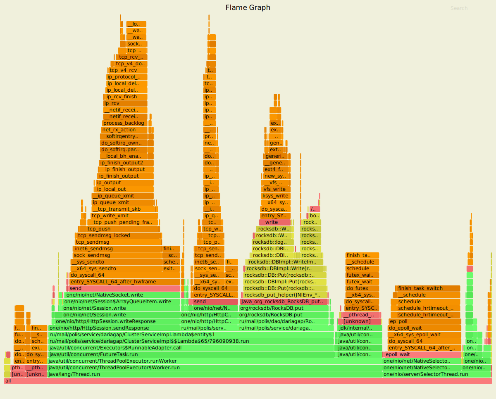

Добавляются вызовы ClusterServiceImpl.proxy, перенаправляющие запросы к другим нодам (занимают 11.88% cpu) и вызовы Util.getNode, определяющие в какой ноде хранятся данные (занимают 1.08% cpu).
 
#### async-profiler alloc
Без шардирования:

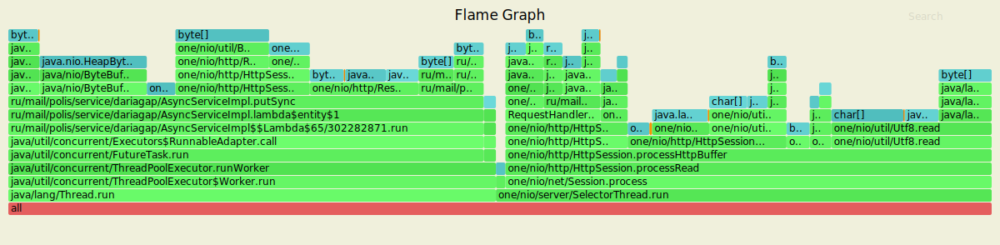

С шардированием: 

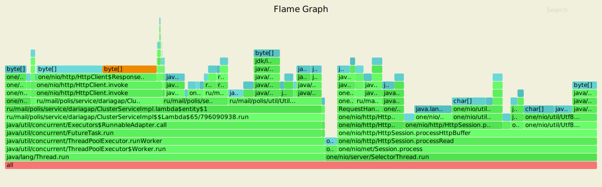

Добавляются вызовы ClusterServiceImpl.proxy, перенаправляющие запросы к другим нодам (занимают 21.47% памяти) и вызовы Util.getNode, определяющие в какой ноде хранятся данные (занимают 15.82% памяти).

#### async-profiler lock
Без шардирования:

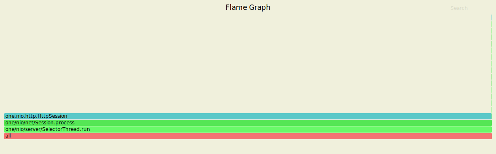

С шардированием: 

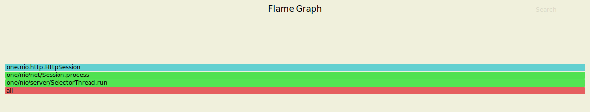

Шардирование не добавляет новых блокировок, имеющиеся блокировки связанны с отправкой ответа из HttpSession.

## GET-запросы
Нагрузочное тестирование с помощью wrk2 проводилось на заполненной базе со следующими настройками:
- 4 потока, 16 соединений
- время обстрела - 60 секунд
- стабильная нагрузка 10000 запросов в секунду

Результаты без шардирования:

    wrk -t4 -c16 -d60s -s ./get.lua -R10000 --latency http://127.0.0.1:8080
    Running 1m test @ http://127.0.0.1:8080
      4 threads and 16 connections
      Thread calibration: mean lat.: 2.608ms, rate sampling interval: 10ms
      Thread calibration: mean lat.: 2.590ms, rate sampling interval: 10ms
      Thread calibration: mean lat.: 2.556ms, rate sampling interval: 10ms
      Thread calibration: mean lat.: 2.514ms, rate sampling interval: 10ms
      Thread Stats   Avg      Stdev     Max   +/- Stdev
        Latency     2.31ms    5.00ms  35.71ms   92.69%
        Req/Sec     2.61k   446.65     6.20k    88.15%
      Latency Distribution (HdrHistogram - Recorded Latency)
     50.000%    0.94ms
     75.000%    1.31ms
     90.000%    2.94ms
     99.000%   26.00ms
     99.900%   31.39ms
     99.990%   33.57ms
     99.999%   34.59ms
    100.000%   35.74ms
    
      Detailed Percentile spectrum:
           Value   Percentile   TotalCount 1/(1-Percentile)
    
           0.043     0.000000            1         1.00
           0.365     0.100000        50089         1.11
           0.529     0.200000       100116         1.25
           0.675     0.300000       150217         1.43
           0.807     0.400000       199922         1.67
           0.938     0.500000       250168         2.00
           1.007     0.550000       275255         2.22
           1.079     0.600000       299975         2.50
           1.155     0.650000       324922         2.86
           1.230     0.700000       350022         3.33
           1.306     0.750000       374863         4.00
           1.348     0.775000       387597         4.44
           1.393     0.800000       399992         5.00
           1.447     0.825000       412460         5.71
           1.525     0.850000       424830         6.67
           1.702     0.875000       437307         8.00
           2.039     0.887500       443554         8.89
           2.939     0.900000       449808        10.00
           4.267     0.912500       456052        11.43
           6.743     0.925000       462294        13.33
          11.303     0.937500       468551        16.00
          13.551     0.943750       471673        17.78
          15.407     0.950000       474792        20.00
          17.167     0.956250       477936        22.86
          18.831     0.962500       481041        26.67
          20.431     0.968750       484178        32.00
          21.231     0.971875       485734        35.56
          22.031     0.975000       487304        40.00
          22.783     0.978125       488858        45.71
          23.535     0.981250       490424        53.33
          24.319     0.984375       491970        64.00
          24.767     0.985938       492776        71.11
          25.215     0.987500       493550        80.00
          25.695     0.989062       494323        91.43
          26.223     0.990625       495098       106.67
          26.799     0.992188       495873       128.00
          27.135     0.992969       496281       142.22
          27.455     0.993750       496665       160.00
          27.807     0.994531       497054       182.86
          28.223     0.995313       497437       213.33
          28.671     0.996094       497828       256.00
          28.895     0.996484       498028       284.44
          29.151     0.996875       498213       320.00
          29.455     0.997266       498409       365.71
          29.775     0.997656       498611       426.67
          30.111     0.998047       498799       512.00
          30.335     0.998242       498896       568.89
          30.575     0.998437       498994       640.00
          30.831     0.998633       499098       731.43
          31.119     0.998828       499191       853.33
          31.471     0.999023       499295      1024.00
          31.679     0.999121       499335      1137.78
          31.871     0.999219       499387      1280.00
          32.111     0.999316       499433      1462.86
          32.319     0.999414       499485      1706.67
          32.527     0.999512       499531      2048.00
          32.671     0.999561       499556      2275.56
          32.767     0.999609       499579      2560.00
          32.863     0.999658       499606      2925.71
          32.959     0.999707       499634      3413.33
          33.055     0.999756       499654      4096.00
          33.151     0.999780       499669      4551.11
          33.215     0.999805       499677      5120.00
          33.311     0.999829       499696      5851.43
          33.375     0.999854       499708      6826.67
          33.471     0.999878       499717      8192.00
          33.503     0.999890       499721      9102.22
          33.567     0.999902       499727     10240.00
          33.631     0.999915       499732     11702.86
          33.695     0.999927       499740     13653.33
          33.759     0.999939       499745     16384.00
          33.823     0.999945       499747     18204.44
          33.887     0.999951       499750     20480.00
          33.983     0.999957       499753     23405.71
          34.047     0.999963       499756     27306.67
          34.143     0.999969       499761     32768.00
          34.143     0.999973       499761     36408.89
          34.303     0.999976       499763     40960.00
          34.335     0.999979       499764     46811.43
          34.367     0.999982       499765     54613.33
          34.399     0.999985       499767     65536.00
          34.463     0.999986       499768     72817.78
          34.463     0.999988       499768     81920.00
          34.591     0.999989       499771     93622.86
          34.591     0.999991       499771    109226.67
          34.591     0.999992       499771    131072.00
          34.591     0.999993       499771    145635.56
          34.591     0.999994       499771    163840.00
          34.975     0.999995       499772    187245.71
          34.975     0.999995       499772    218453.33
          35.103     0.999996       499773    262144.00
          35.103     0.999997       499773    291271.11
          35.103     0.999997       499773    327680.00
          35.103     0.999997       499773    374491.43
          35.103     0.999998       499773    436906.67
          35.743     0.999998       499774    524288.00
          35.743     1.000000       499774          inf
    #[Mean    =        2.310, StdDeviation   =        5.003]
    #[Max     =       35.712, Total count    =       499774]
    #[Buckets =           27, SubBuckets     =         2048]
    ----------------------------------------------------------
      599882 requests in 1.00m, 41.87MB read
    Requests/sec:   9998.28
    Transfer/sec:    714.65KB

Результаты с шардированием:

    wrk -t4 -c16 -d60s -s ./get.lua -R10000 --latency http://127.0.0.1:8080
    Running 1m test @ http://127.0.0.1:8080
      4 threads and 16 connections
      Thread calibration: mean lat.: 1.729ms, rate sampling interval: 10ms
      Thread calibration: mean lat.: 1.700ms, rate sampling interval: 10ms
      Thread calibration: mean lat.: 1.708ms, rate sampling interval: 10ms
      Thread calibration: mean lat.: 1.696ms, rate sampling interval: 10ms
      Thread Stats   Avg      Stdev     Max   +/- Stdev
        Latency     1.76ms    3.58ms  58.34ms   95.93%
        Req/Sec     2.63k   342.21     4.33k    79.81%
      Latency Distribution (HdrHistogram - Recorded Latency)
     50.000%    1.08ms
     75.000%    1.57ms
     90.000%    3.16ms
     99.000%   14.31ms
     99.900%   51.55ms
     99.990%   56.86ms
     99.999%   57.82ms
    100.000%   58.37ms
    
      Detailed Percentile spectrum:
           Value   Percentile   TotalCount 1/(1-Percentile)
    
           0.034     0.000000            2         1.00
           0.420     0.100000        50090         1.11
           0.596     0.200000       100018         1.25
           0.766     0.300000       150248         1.43
           0.923     0.400000       199928         1.67
           1.083     0.500000       250059         2.00
           1.166     0.550000       275059         2.22
           1.254     0.600000       299923         2.50
           1.345     0.650000       324912         2.86
           1.445     0.700000       349920         3.33
           1.565     0.750000       374841         4.00
           1.644     0.775000       387407         4.44
           1.757     0.800000       399898         5.00
           1.933     0.825000       412307         5.71
           2.225     0.850000       424859         6.67
           2.643     0.875000       437340         8.00
           2.889     0.887500       443558         8.89
           3.157     0.900000       449832        10.00
           3.441     0.912500       456054        11.43
           3.771     0.925000       462301        13.33
           4.179     0.937500       468542        16.00
           4.427     0.943750       471668        17.78
           4.739     0.950000       474793        20.00
           5.115     0.956250       477902        22.86
           5.607     0.962500       481036        26.67
           6.255     0.968750       484150        32.00
           6.691     0.971875       485717        35.56
           7.227     0.975000       487269        40.00
           7.955     0.978125       488835        45.71
           8.927     0.981250       490404        53.33
          10.175     0.984375       491960        64.00
          10.999     0.985938       492738        71.11
          12.071     0.987500       493516        80.00
          13.415     0.989062       494297        91.43
          14.839     0.990625       495080       106.67
          16.191     0.992188       495865       128.00
          17.439     0.992969       496251       142.22
          19.215     0.993750       496642       160.00
          21.679     0.994531       497030       182.86
          28.447     0.995313       497423       213.33
          34.879     0.996094       497811       256.00
          39.359     0.996484       498007       284.44
          41.343     0.996875       498202       320.00
          42.783     0.997266       498399       365.71
          46.111     0.997656       498593       426.67
          48.639     0.998047       498791       512.00
          49.375     0.998242       498888       568.89
          50.175     0.998437       498989       640.00
          50.687     0.998633       499080       731.43
          51.167     0.998828       499183       853.33
          51.615     0.999023       499276      1024.00
          51.935     0.999121       499324      1137.78
          52.319     0.999219       499373      1280.00
          52.959     0.999316       499427      1462.86
          53.471     0.999414       499471      1706.67
          54.143     0.999512       499520      2048.00
          54.623     0.999561       499547      2275.56
          55.007     0.999609       499569      2560.00
          55.455     0.999658       499594      2925.71
          55.839     0.999707       499620      3413.33
          56.031     0.999756       499642      4096.00
          56.127     0.999780       499654      4551.11
          56.255     0.999805       499666      5120.00
          56.415     0.999829       499679      5851.43
          56.575     0.999854       499690      6826.67
          56.703     0.999878       499702      8192.00
          56.799     0.999890       499710      9102.22
          56.863     0.999902       499716     10240.00
          56.959     0.999915       499721     11702.86
          57.087     0.999927       499728     13653.33
          57.151     0.999939       499734     16384.00
          57.183     0.999945       499737     18204.44
          57.215     0.999951       499739     20480.00
          57.279     0.999957       499743     23405.71
          57.375     0.999963       499745     27306.67
          57.567     0.999969       499748     32768.00
          57.631     0.999973       499751     36408.89
          57.631     0.999976       499751     40960.00
          57.663     0.999979       499753     46811.43
          57.727     0.999982       499754     54613.33
          57.791     0.999985       499756     65536.00
          57.823     0.999986       499758     72817.78
          57.823     0.999988       499758     81920.00
          57.823     0.999989       499758     93622.86
          57.887     0.999991       499759    109226.67
          58.303     0.999992       499760    131072.00
          58.303     0.999993       499760    145635.56
          58.303     0.999994       499760    163840.00
          58.335     0.999995       499762    187245.71
          58.335     0.999995       499762    218453.33
          58.335     0.999996       499762    262144.00
          58.335     0.999997       499762    291271.11
          58.335     0.999997       499762    327680.00
          58.335     0.999997       499762    374491.43
          58.335     0.999998       499762    436906.67
          58.367     0.999998       499763    524288.00
          58.367     1.000000       499763          inf
    #[Mean    =        1.761, StdDeviation   =        3.579]
    #[Max     =       58.336, Total count    =       499763]
    #[Buckets =           27, SubBuckets     =         2048]
    ----------------------------------------------------------
      599879 requests in 1.00m, 51.00MB read
    Requests/sec:   9998.32
    Transfer/sec:      0.85MB
    
Производительность падает за счет того, что часть запросов теперь перенаправляется на другие ноды.

#### async-profiler cpu

Без шардирования:

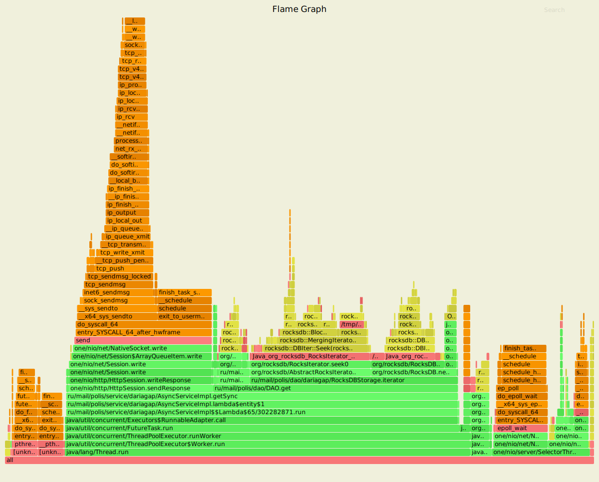

С шардированием: 

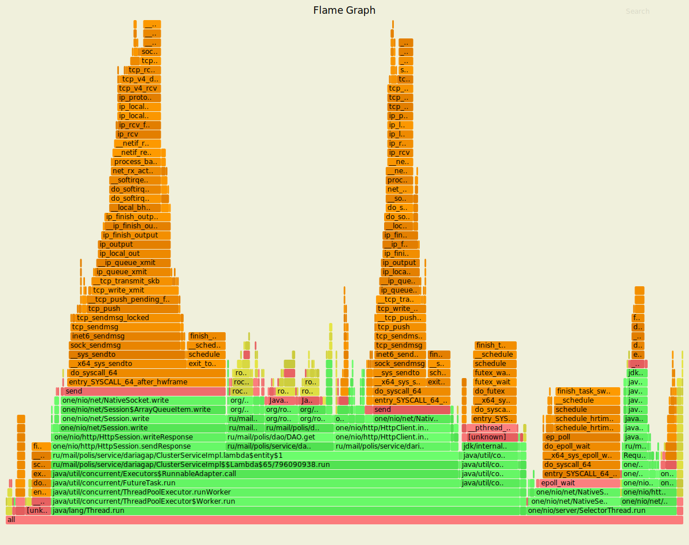

Добавляются вызовы ClusterServiceImpl.proxy, перенаправляющие запросы к другим нодам (занимают 17.18% cpu) и вызовы Util.getNode, определяющие в какой ноде хранятся данные (занимают 1.19% cpu).
 
#### async-profiler alloc
Без шардирования:

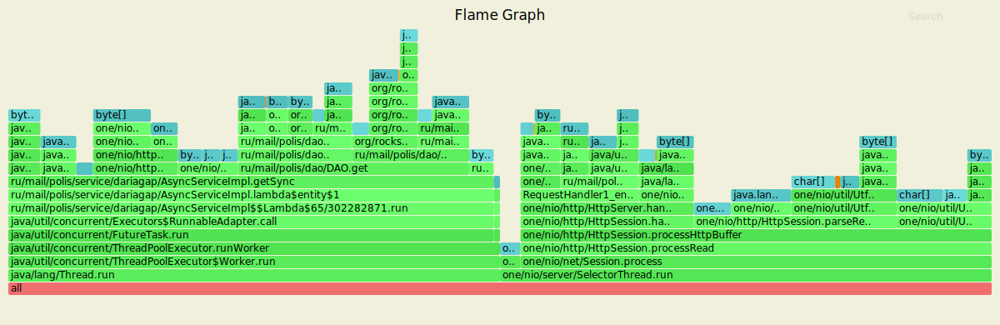

С шардированием: 

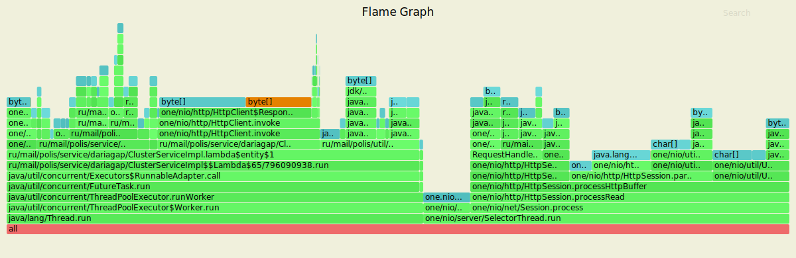

Добавляются вызовы ClusterServiceImpl.proxy, перенаправляющие запросы к другим нодам (занимают 20.80% памяти) и вызовы Util.getNode, определяющие в какой ноде хранятся данные (занимают 12.71% памяти).

#### async-profiler lock
Без шардирования:

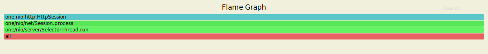

С шардированием: 

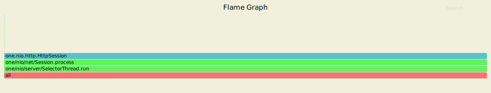

Шардирование не добавляет новых блокировок, имеющиеся блокировки связанны с отправкой ответа из HttpSession.
