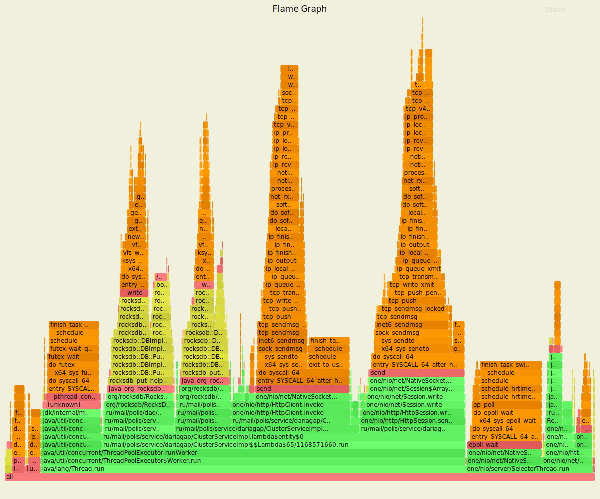
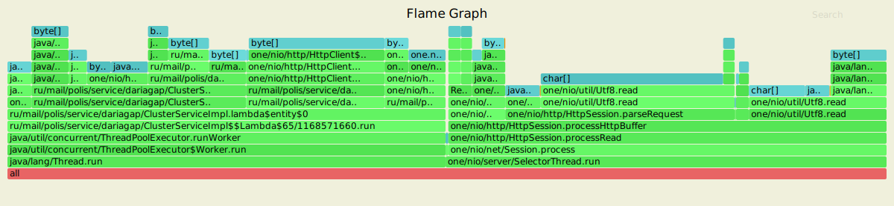
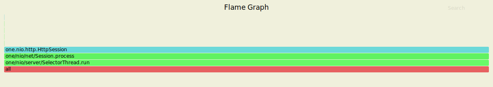
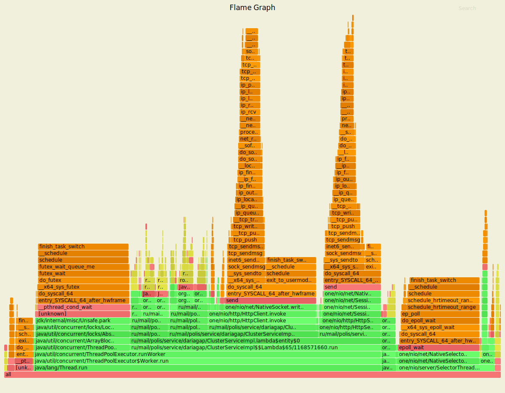
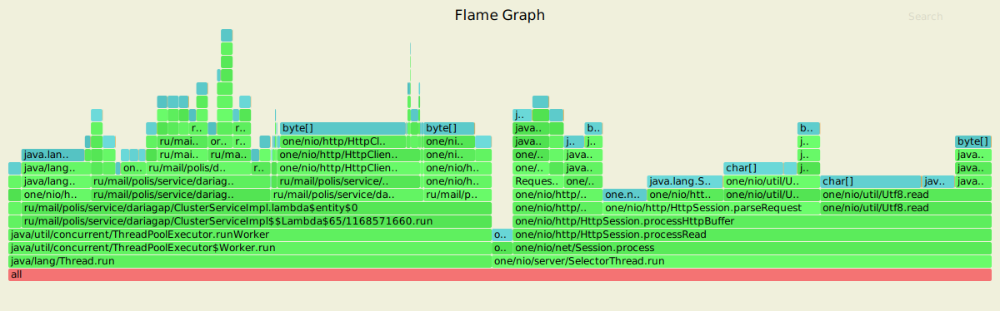
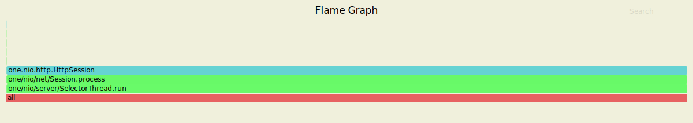

# Репликация
## PUT-запросы
Нагрузочное тестирование с помощью wrk2 проводилось со следующими настройками:
- 4 потока, 16 соединений
- время обстрела - 60 секунд
- стабильная нагрузка 6000 запросов в секунду
- параметр "replicas" не указан, "ask" берется по кворуму - 2/3

Результаты с репликацией:

    wrk -t4 -c16 -d60s -s ./put.lua -R6000 --latency http://127.0.0.1:8080
    Running 1m test @ http://127.0.0.1:8080
      4 threads and 16 connections
      Thread calibration: mean lat.: 1.930ms, rate sampling interval: 10ms
      Thread calibration: mean lat.: 1.942ms, rate sampling interval: 10ms
      Thread calibration: mean lat.: 1.903ms, rate sampling interval: 10ms
      Thread calibration: mean lat.: 1.946ms, rate sampling interval: 10ms
      Thread Stats   Avg      Stdev     Max   +/- Stdev
        Latency     1.82ms    3.69ms  67.52ms   96.21%
        Req/Sec     1.58k   175.11     2.67k    74.03%
      Latency Distribution (HdrHistogram - Recorded Latency)
     50.000%    1.23ms
     75.000%    1.71ms
     90.000%    2.71ms
     99.000%   12.18ms
     99.900%   59.36ms
     99.990%   65.73ms
     99.999%   67.07ms
    100.000%   67.58ms
    
      Detailed Percentile spectrum:
           Value   Percentile   TotalCount 1/(1-Percentile)
    
           0.089     0.000000            1         1.00
           0.519     0.100000        30111         1.11
           0.726     0.200000        60002         1.25
           0.901     0.300000        90069         1.43
           1.069     0.400000       120080         1.67
           1.229     0.500000       150001         2.00
           1.311     0.550000       164957         2.22
           1.398     0.600000       180032         2.50
           1.490     0.650000       194996         2.86
           1.592     0.700000       210002         3.33
           1.714     0.750000       224933         4.00
           1.792     0.775000       232474         4.44
           1.885     0.800000       239896         5.00
           1.993     0.825000       247399         5.71
           2.141     0.850000       254966         6.67
           2.347     0.875000       262434         8.00
           2.499     0.887500       266179         8.89
           2.715     0.900000       269913        10.00
           3.015     0.912500       273627        11.43
           3.435     0.925000       277385        13.33
           3.963     0.937500       281138        16.00
           4.295     0.943750       283026        17.78
           4.667     0.950000       284885        20.00
           5.067     0.956250       286754        22.86
           5.555     0.962500       288637        26.67
           6.147     0.968750       290498        32.00
           6.515     0.971875       291435        35.56
           6.939     0.975000       292376        40.00
           7.483     0.978125       293307        45.71
           8.183     0.981250       294254        53.33
           9.087     0.984375       295186        64.00
           9.671     0.985938       295650        71.11
          10.383     0.987500       296116        80.00
          11.447     0.989062       296588        91.43
          12.719     0.990625       297054       106.67
          14.943     0.992188       297522       128.00
          16.719     0.992969       297757       142.22
          18.687     0.993750       297990       160.00
          20.303     0.994531       298225       182.86
          25.087     0.995313       298459       213.33
          33.023     0.996094       298694       256.00
          36.799     0.996484       298811       284.44
          40.895     0.996875       298927       320.00
          44.415     0.997266       299045       365.71
          48.671     0.997656       299162       426.67
          52.159     0.998047       299279       512.00
          53.951     0.998242       299337       568.89
          55.455     0.998437       299396       640.00
          56.671     0.998633       299457       731.43
          57.951     0.998828       299513       853.33
          59.743     0.999023       299574      1024.00
          60.607     0.999121       299602      1137.78
          61.407     0.999219       299631      1280.00
          62.111     0.999316       299661      1462.86
          62.719     0.999414       299690      1706.67
          63.263     0.999512       299718      2048.00
          63.583     0.999561       299735      2275.56
          63.871     0.999609       299748      2560.00
          64.063     0.999658       299763      2925.71
          64.287     0.999707       299779      3413.33
          64.511     0.999756       299791      4096.00
          64.639     0.999780       299799      4551.11
          64.799     0.999805       299806      5120.00
          64.927     0.999829       299813      5851.43
          65.215     0.999854       299821      6826.67
          65.407     0.999878       299829      8192.00
          65.663     0.999890       299832      9102.22
          65.727     0.999902       299836     10240.00
          65.855     0.999915       299839     11702.86
          65.983     0.999927       299844     13653.33
          66.047     0.999939       299846     16384.00
          66.111     0.999945       299849     18204.44
          66.175     0.999951       299850     20480.00
          66.303     0.999957       299853     23405.71
          66.367     0.999963       299855     27306.67
          66.367     0.999969       299855     32768.00
          66.431     0.999973       299857     36408.89
          66.431     0.999976       299857     40960.00
          66.559     0.999979       299858     46811.43
          66.687     0.999982       299859     54613.33
          66.751     0.999985       299860     65536.00
          66.751     0.999986       299860     72817.78
          67.071     0.999988       299861     81920.00
          67.071     0.999989       299861     93622.86
          67.135     0.999991       299862    109226.67
          67.135     0.999992       299862    131072.00
          67.135     0.999993       299862    145635.56
          67.199     0.999994       299863    163840.00
          67.199     0.999995       299863    187245.71
          67.199     0.999995       299863    218453.33
          67.199     0.999996       299863    262144.00
          67.199     0.999997       299863    291271.11
          67.583     0.999997       299864    327680.00
          67.583     1.000000       299864          inf
    #[Mean    =        1.825, StdDeviation   =        3.686]
    #[Max     =       67.520, Total count    =       299864]
    #[Buckets =           27, SubBuckets     =         2048]
    ----------------------------------------------------------
      359931 requests in 1.00m, 23.00MB read
    Requests/sec:   5998.92
    Transfer/sec:    392.51KB
    
По результатам нагрузочного тестирования видно, что скорость обработки запросов по сравнению с предыдущим этапом замедляется незначительно (в 1 - 1.16 раз), что может объясняться меньшей очередью запросов, так как для 5 этапа нагрузка при тестировании была снижена до 6000 запросов в секунду.
По сравнению с предыдущим этапом производительность падает (сервер выдерживает нагрузку в 6000 запросов в секунду, вместо 10000 запросов в секунду). 
Падение производительности объясняется необходимостью обращения к двум репликам вместо одной, следовательно, добавляются затраты на проксирование запросов, ожидание обработки в каждой из реплик и обработку запросов в каждой реплике.

#### async-profiler cpu

31.55% cpu занимает обработка запроса узлом, принимающим запрос от клиента (ClusterServiceImpl.getResponseFromGateNode), которая включает в себя получение узлов, хранящих запрошенные данные (1.52% cpu), проксирование запроса на другие ноды (20.24% cpu) и обработку запроса, если данные хранятся на текущей ноде (9.28% cpu).
12.02% cpu занимает обработка проксированного запроса, которая включает только помещение данных с временной меткой (RocksBDStorage.upsertWithTimestamp) в базу данных.
 
#### async-profiler alloc

Проксирование запросов занимает 15.77% памяти, а сохранение данных с временной меткой занимает 11.15% памяти (в предыдущем этапе сохранение данных без временной метки занимало 4.08% памяти - дополнительно затрачивается память на хранение метки времени и состояния данных, а также на временное хранение данных в экземпляпе Timestamp).

#### async-profiler lock

Репликация не добавляет новых блокировок, имеющиеся блокировки связанны с отправкой ответа из HttpSession.

## GET-запросы
Нагрузочное тестирование с помощью wrk2 проводилось на заполненной базе со следующими настройками:
- 4 потока, 16 соединений
- время обстрела - 60 секунд
- стабильная нагрузка 6000 запросов в секунду
- параметр "replicas" не указан, "ask" берется по кворуму - 2/3

Результаты с репликацией:

    wrk -t4 -c16 -d60s -s ./get.lua -R6000 --latency http://127.0.0.1:8080
    Running 1m test @ http://127.0.0.1:8080
      4 threads and 16 connections
      Thread calibration: mean lat.: 5.320ms, rate sampling interval: 24ms
      Thread calibration: mean lat.: 5.355ms, rate sampling interval: 25ms
      Thread calibration: mean lat.: 5.382ms, rate sampling interval: 25ms
      Thread calibration: mean lat.: 5.474ms, rate sampling interval: 26ms
      Thread Stats   Avg      Stdev     Max   +/- Stdev
        Latency     5.25ms    6.99ms  49.09ms   89.68%
        Req/Sec     1.53k   191.33     2.04k    66.92%
      Latency Distribution (HdrHistogram - Recorded Latency)
     50.000%    2.58ms
     75.000%    6.14ms
     90.000%   12.60ms
     99.000%   35.71ms
     99.900%   46.49ms
     99.990%   48.03ms
     99.999%   48.90ms
    100.000%   49.12ms
    
      Detailed Percentile spectrum:
           Value   Percentile   TotalCount 1/(1-Percentile)
    
           0.090     0.000000            1         1.00
           0.740     0.100000        30038         1.11
           1.077     0.200000        60008         1.25
           1.385     0.300000        90019         1.43
           1.755     0.400000       119955         1.67
           2.581     0.500000       149965         2.00
           3.351     0.550000       164943         2.22
           4.107     0.600000       179953         2.50
           4.795     0.650000       194954         2.86
           5.463     0.700000       209912         3.33
           6.143     0.750000       224949         4.00
           6.515     0.775000       232435         4.44
           6.963     0.800000       239895         5.00
           7.583     0.825000       247388         5.71
           8.623     0.850000       254882         6.67
          10.311     0.875000       262375         8.00
          11.343     0.887500       266129         8.89
          12.599     0.900000       269868        10.00
          14.047     0.912500       273612        11.43
          15.783     0.925000       277367        13.33
          17.791     0.937500       281122        16.00
          18.975     0.943750       282987        17.78
          20.415     0.950000       284864        20.00
          21.839     0.956250       286732        22.86
          23.407     0.962500       288612        26.67
          25.615     0.968750       290491        32.00
          26.975     0.971875       291416        35.56
          28.303     0.975000       292356        40.00
          30.159     0.978125       293291        45.71
          31.935     0.981250       294230        53.33
          33.407     0.984375       295169        64.00
          34.047     0.985938       295658        71.11
          34.719     0.987500       296118        80.00
          35.327     0.989062       296572        91.43
          35.999     0.990625       297059       106.67
          36.863     0.992188       297508       128.00
          37.631     0.992969       297741       142.22
          38.399     0.993750       297981       160.00
          39.231     0.994531       298210       182.86
          40.607     0.995313       298443       213.33
          41.951     0.996094       298682       256.00
          42.591     0.996484       298794       284.44
          43.359     0.996875       298914       320.00
          44.095     0.997266       299031       365.71
          44.831     0.997656       299150       426.67
          45.439     0.998047       299265       512.00
          45.695     0.998242       299321       568.89
          45.951     0.998437       299387       640.00
          46.111     0.998633       299449       731.43
          46.271     0.998828       299501       853.33
          46.527     0.999023       299558      1024.00
          46.591     0.999121       299586      1137.78
          46.719     0.999219       299625      1280.00
          46.815     0.999316       299646      1462.86
          46.975     0.999414       299682      1706.67
          47.071     0.999512       299710      2048.00
          47.135     0.999561       299721      2275.56
          47.199     0.999609       299733      2560.00
          47.327     0.999658       299749      2925.71
          47.423     0.999707       299761      3413.33
          47.519     0.999756       299775      4096.00
          47.615     0.999780       299784      4551.11
          47.679     0.999805       299790      5120.00
          47.743     0.999829       299797      5851.43
          47.839     0.999854       299806      6826.67
          47.903     0.999878       299812      8192.00
          47.967     0.999890       299816      9102.22
          48.031     0.999902       299822     10240.00
          48.095     0.999915       299823     11702.86
          48.159     0.999927       299827     13653.33
          48.191     0.999939       299830     16384.00
          48.255     0.999945       299832     18204.44
          48.319     0.999951       299834     20480.00
          48.383     0.999957       299838     23405.71
          48.383     0.999963       299838     27306.67
          48.447     0.999969       299839     32768.00
          48.543     0.999973       299840     36408.89
          48.575     0.999976       299841     40960.00
          48.607     0.999979       299843     46811.43
          48.607     0.999982       299843     54613.33
          48.735     0.999985       299844     65536.00
          48.735     0.999986       299844     72817.78
          48.895     0.999988       299845     81920.00
          48.895     0.999989       299845     93622.86
          48.927     0.999991       299846    109226.67
          48.927     0.999992       299846    131072.00
          48.927     0.999993       299846    145635.56
          48.959     0.999994       299847    163840.00
          48.959     0.999995       299847    187245.71
          48.959     0.999995       299847    218453.33
          48.959     0.999996       299847    262144.00
          48.959     0.999997       299847    291271.11
          49.119     0.999997       299848    327680.00
          49.119     1.000000       299848          inf
    #[Mean    =        5.249, StdDeviation   =        6.992]
    #[Max     =       49.088, Total count    =       299848]
    #[Buckets =           27, SubBuckets     =         2048]
    ----------------------------------------------------------
      359856 requests in 1.00m, 24.97MB read
    Requests/sec:   5997.64
    Transfer/sec:    426.19KB
    
По результатам нагрузочного тестирования видно, что скорость обработки запросов по сравнению с предыдущим этапом замедляется для 99% запросов (замедление в 2.5 - 4 раза), но 1% запросов выполняется быстрее, чем на этапе 4 (ускорение в 1.1 - 1.19 раз), что может объясняться меньшей очередью запросов и, следовательно, меньшим ожиданием в худшем случае, так как для 5 этапа нагрузка при тестировании была снижена до 6000 запросов в секунду.
По сравнению с предыдущим этапом производительность падает (сервер выдерживает нагрузку в 6000 запросов в секунду, вместо 10000 запросов в секунду). 
Падение производительности объясняется необходимостью обращения к двум репликам вместо одной, следовательно, добавляются затраты на проксирование запросов, ожидание обработки в каждой из реплик и обработку запросов в каждой реплике.

#### async-profiler cpu

30.22% cpu занимает обработка запроса узлом, принимающим запрос от клиента (ClusterServiceImpl.getResponseFromGateNode), которая включает в себя получение узлов, хранящих запрошенные данные (0.30% cpu), проксирование запроса на другие ноды (21.78% cpu) и обработку запроса, если данные хранятся на текущей ноде (7.85% cpu).
7.70% cpu занимает обработка проксированного запроса, которая включает только получение данных с временной меткой из базы данных.
 
#### async-profiler alloc

Проксирование запросов занимает 14.53% памяти, а анализ полученных ответов (в том числе поиск наиболее свежих данных) занимает 0.36% памяти.

#### async-profiler lock

Репликация не добавляет новых блокировок, имеющиеся блокировки связанны с отправкой ответа из HttpSession.
