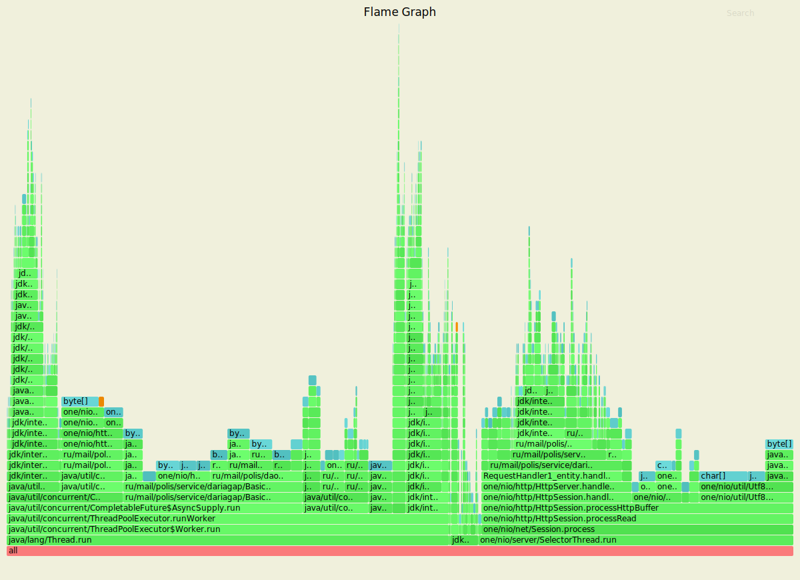
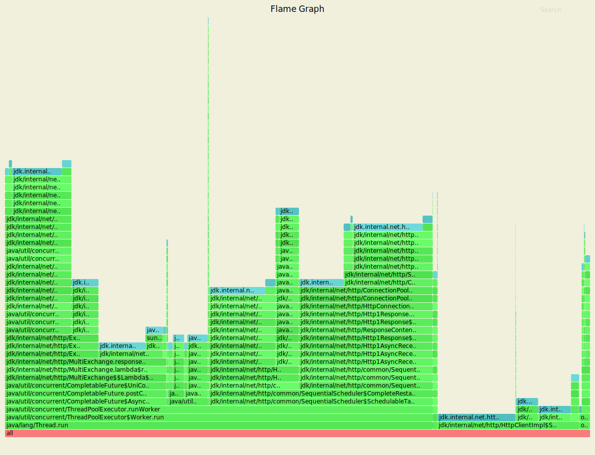
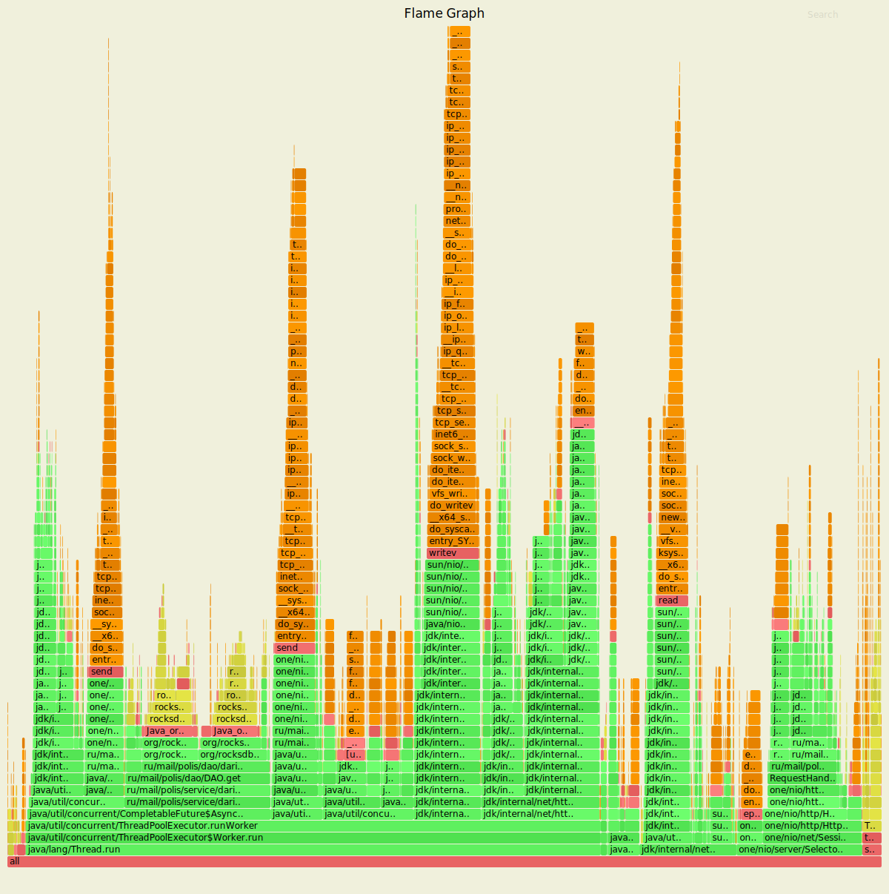
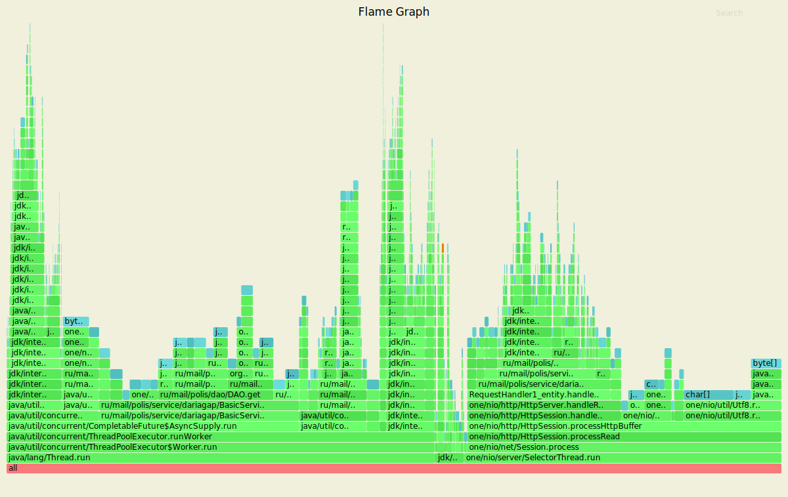
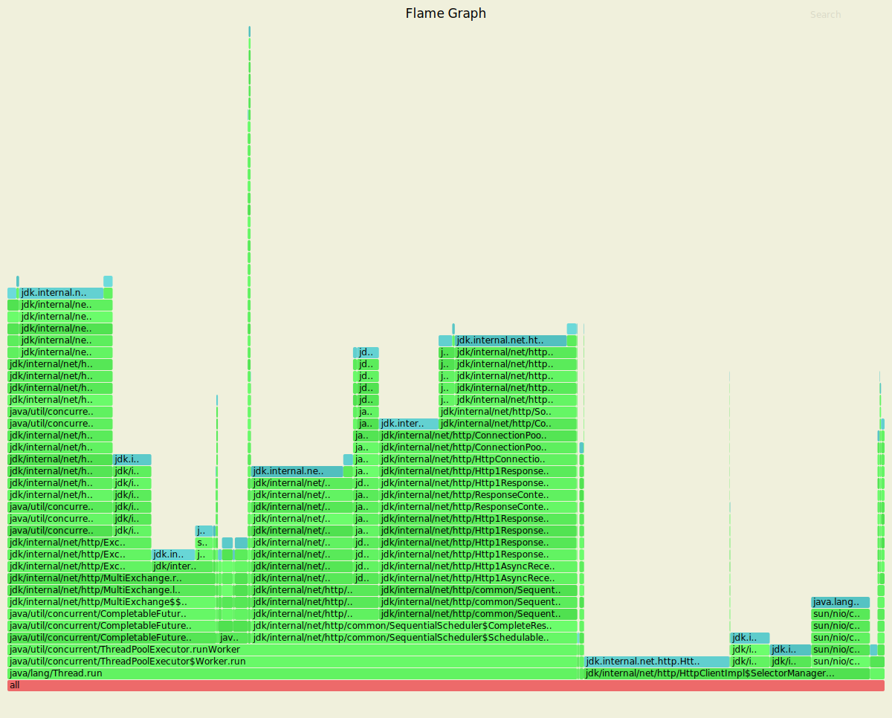

# Асинхронный клиент
## PUT-запросы
Нагрузочное тестирование с помощью wrk2 проводилось со следующими настройками:
- 4 потока, 16 соединений
- время обстрела - 20 секунд
- стабильная нагрузка 4000 запросов в секунду
- параметр "replicas" не указан, "aсk" берется по кворуму - 2/3

Результаты нагрузочного тестирования:

    wrk -t4 -c16 -d20s -s ./put.lua -R4000 --latency http://127.0.0.1:8080
    Running 20s test @ http://127.0.0.1:8080
      4 threads and 16 connections
      Thread calibration: mean lat.: 15.973ms, rate sampling interval: 89ms
      Thread calibration: mean lat.: 17.247ms, rate sampling interval: 89ms
      Thread calibration: mean lat.: 11.698ms, rate sampling interval: 54ms
      Thread calibration: mean lat.: 14.452ms, rate sampling interval: 79ms
      Thread Stats   Avg      Stdev     Max   +/- Stdev
        Latency     7.22ms    5.39ms  41.95ms   83.45%
        Req/Sec     1.01k    64.55     1.25k    75.80%
      Latency Distribution (HdrHistogram - Recorded Latency)
     50.000%    5.32ms
     75.000%    9.35ms
     90.000%   14.91ms
     99.000%   25.65ms
     99.900%   31.38ms
     99.990%   39.62ms
     99.999%   41.98ms
    100.000%   41.98ms
    
      Detailed Percentile spectrum:
           Value   Percentile   TotalCount 1/(1-Percentile)
    
           0.748     0.000000            1         1.00
           2.515     0.100000         3996         1.11
           3.097     0.200000         7991         1.25
           3.669     0.300000        11982         1.43
           4.387     0.400000        15980         1.67
           5.315     0.500000        19958         2.00
           5.911     0.550000        21952         2.22
           6.599     0.600000        23956         2.50
           7.383     0.650000        25943         2.86
           8.263     0.700000        27940         3.33
           9.351     0.750000        29950         4.00
           9.959     0.775000        30943         4.44
          10.655     0.800000        31941         5.00
          11.423     0.825000        32928         5.71
          12.375     0.850000        33926         6.67
          13.463     0.875000        34929         8.00
          14.167     0.887500        35425         8.89
          14.911     0.900000        35925        10.00
          15.727     0.912500        36420        11.43
          16.639     0.925000        36919        13.33
          17.759     0.937500        37422        16.00
          18.319     0.943750        37672        17.78
          18.943     0.950000        37918        20.00
          19.695     0.956250        38166        22.86
          20.479     0.962500        38420        26.67
          21.343     0.968750        38665        32.00
          21.775     0.971875        38790        35.56
          22.255     0.975000        38917        40.00
          22.799     0.978125        39041        45.71
          23.407     0.981250        39164        53.33
          24.159     0.984375        39289        64.00
          24.479     0.985938        39354        71.11
          24.815     0.987500        39415        80.00
          25.343     0.989062        39476        91.43
          25.775     0.990625        39539       106.67
          26.287     0.992188        39601       128.00
          26.591     0.992969        39632       142.22
          26.943     0.993750        39664       160.00
          27.311     0.994531        39696       182.86
          27.711     0.995313        39725       213.33
          28.303     0.996094        39758       256.00
          28.511     0.996484        39773       284.44
          28.927     0.996875        39788       320.00
          29.247     0.997266        39806       365.71
          29.471     0.997656        39819       426.67
          29.935     0.998047        39835       512.00
          30.207     0.998242        39842       568.89
          30.543     0.998437        39850       640.00
          30.799     0.998633        39858       731.43
          31.071     0.998828        39866       853.33
          31.407     0.999023        39875      1024.00
          31.807     0.999121        39877      1137.78
          32.127     0.999219        39881      1280.00
          32.447     0.999316        39885      1462.86
          32.991     0.999414        39889      1706.67
          33.631     0.999512        39893      2048.00
          33.951     0.999561        39895      2275.56
          34.367     0.999609        39897      2560.00
          34.495     0.999658        39899      2925.71
          36.639     0.999707        39901      3413.33
          37.759     0.999756        39903      4096.00
          37.887     0.999780        39904      4551.11
          38.783     0.999805        39905      5120.00
          38.815     0.999829        39906      5851.43
          39.007     0.999854        39907      6826.67
          39.615     0.999878        39908      8192.00
          39.615     0.999890        39908      9102.22
          39.967     0.999902        39909     10240.00
          39.967     0.999915        39909     11702.86
          40.447     0.999927        39910     13653.33
          40.447     0.999939        39910     16384.00
          40.447     0.999945        39910     18204.44
          41.439     0.999951        39911     20480.00
          41.439     0.999957        39911     23405.71
          41.439     0.999963        39911     27306.67
          41.439     0.999969        39911     32768.00
          41.439     0.999973        39911     36408.89
          41.983     0.999976        39912     40960.00
          41.983     1.000000        39912          inf
    #[Mean    =        7.222, StdDeviation   =        5.390]
    #[Max     =       41.952, Total count    =        39912]
    #[Buckets =           27, SubBuckets     =         2048]
    ----------------------------------------------------------
      79964 requests in 20.00s, 5.11MB read
    Requests/sec:   3998.33
    Transfer/sec:    261.61KB
    
По результатам нагрузочного тестирования видно, что скорость обработки запросов по сравнению с предыдущим этапом увеличивается (в 1.89 раз для 99.9% запросов и в 1.60 раз для 99.999% запросов), что объясняется введением асинхронного выполнения запросов, поскольку сервер меньше простаивает в ожидании ответов от реплик.

#### async-profiler cpu

Добавляется отправка запросов к репликам через пул потоков асинхронного сервера, в пуле потоков (executorPool) 
происходит сохранение данных в базу (RocksDBStorage.upsertWithTimestamp), отправка ответа с информацией об результате сохранения данных (sendResponseFromFuture), 
а также выбор асинхронной задачи на исполнение (ThreadPoolExecutor.getTask).   

#### async-profiler alloc

При профилировании видны выполнение вычислений асинхронно в пуле потоков (CompletableFuture.AsyncSupply),
а также асинхронная отправка запросов к репликам через пул потоков асинхронного сервера (HttpClientImpl.SelectorManager).

#### async-profiler lock

Добавляются блокировки, связанные с завершением CompletableFuture, блокировки переключения между потоками выполнения, а также блокировки, связанные с выбором задач на исполнение в асинхронном клиенте.

## GET-запросы
Нагрузочное тестирование с помощью wrk2 проводилось на заполненной базе со следующими настройками:
- 4 потока, 16 соединений
- время обстрела - 20 секунд
- стабильная нагрузка 4000 запросов в секунду
- параметр "replicas" не указан, "aсk" берется по кворуму - 2/3

Результаты нагрузочного тестирования:

    wrk -t4 -c16 -d20s -s ./get.lua -R4000 --latency http://127.0.0.1:8080
    Running 20s test @ http://127.0.0.1:8080
      4 threads and 16 connections
      Thread calibration: mean lat.: 20.226ms, rate sampling interval: 186ms
      Thread calibration: mean lat.: 20.281ms, rate sampling interval: 177ms
      Thread calibration: mean lat.: 19.429ms, rate sampling interval: 171ms
      Thread calibration: mean lat.: 21.515ms, rate sampling interval: 200ms
      Thread Stats   Avg      Stdev     Max   +/- Stdev
        Latency     4.36ms    3.56ms  32.74ms   90.12%
        Req/Sec     1.00k    28.28     1.14k    87.96%
      Latency Distribution (HdrHistogram - Recorded Latency)
     50.000%    3.21ms
     75.000%    5.07ms
     90.000%    7.89ms
     99.000%   20.88ms
     99.900%   29.97ms
     99.990%   31.52ms
     99.999%   32.75ms
    100.000%   32.75ms
    
      Detailed Percentile spectrum:
           Value   Percentile   TotalCount 1/(1-Percentile)
    
           0.624     0.000000            1         1.00
           1.867     0.100000         3994         1.11
           2.213     0.200000         7997         1.25
           2.513     0.300000        11989         1.43
           2.837     0.400000        15984         1.67
           3.211     0.500000        19963         2.00
           3.441     0.550000        21965         2.22
           3.711     0.600000        23958         2.50
           4.063     0.650000        25949         2.86
           4.519     0.700000        27948         3.33
           5.075     0.750000        29946         4.00
           5.419     0.775000        30941         4.44
           5.783     0.800000        31939         5.00
           6.191     0.825000        32936         5.71
           6.663     0.850000        33933         6.67
           7.215     0.875000        34931         8.00
           7.535     0.887500        35433         8.89
           7.887     0.900000        35928        10.00
           8.271     0.912500        36429        11.43
           8.767     0.925000        36926        13.33
           9.351     0.937500        37429        16.00
           9.719     0.943750        37680        17.78
          10.175     0.950000        37925        20.00
          10.767     0.956250        38176        22.86
          11.583     0.962500        38423        26.67
          12.839     0.968750        38673        32.00
          13.599     0.971875        38798        35.56
          14.359     0.975000        38923        40.00
          15.143     0.978125        39047        45.71
          16.223     0.981250        39173        53.33
          17.535     0.984375        39298        64.00
          18.255     0.985938        39360        71.11
          19.215     0.987500        39421        80.00
          20.207     0.989062        39484        91.43
          21.343     0.990625        39546       106.67
          23.039     0.992188        39609       128.00
          23.967     0.992969        39640       142.22
          24.879     0.993750        39671       160.00
          25.919     0.994531        39702       182.86
          26.991     0.995313        39733       213.33
          27.695     0.996094        39765       256.00
          27.903     0.996484        39781       284.44
          28.175     0.996875        39796       320.00
          28.431     0.997266        39811       365.71
          28.767     0.997656        39827       426.67
          29.199     0.998047        39844       512.00
          29.295     0.998242        39850       568.89
          29.407     0.998437        39858       640.00
          29.647     0.998633        39866       731.43
          29.823     0.998828        39874       853.33
          30.079     0.999023        39882      1024.00
          30.111     0.999121        39885      1137.78
          30.223     0.999219        39889      1280.00
          30.271     0.999316        39893      1462.86
          30.367     0.999414        39897      1706.67
          30.511     0.999512        39901      2048.00
          30.591     0.999561        39903      2275.56
          30.783     0.999609        39905      2560.00
          30.927     0.999658        39907      2925.71
          31.103     0.999707        39909      3413.33
          31.119     0.999756        39911      4096.00
          31.135     0.999780        39912      4551.11
          31.151     0.999805        39913      5120.00
          31.295     0.999829        39914      5851.43
          31.311     0.999854        39915      6826.67
          31.519     0.999878        39916      8192.00
          31.519     0.999890        39916      9102.22
          31.647     0.999902        39917     10240.00
          31.647     0.999915        39917     11702.86
          31.727     0.999927        39918     13653.33
          31.727     0.999939        39918     16384.00
          31.727     0.999945        39918     18204.44
          31.839     0.999951        39919     20480.00
          31.839     0.999957        39919     23405.71
          31.839     0.999963        39919     27306.67
          31.839     0.999969        39919     32768.00
          31.839     0.999973        39919     36408.89
          32.751     0.999976        39920     40960.00
          32.751     1.000000        39920          inf
    #[Mean    =        4.358, StdDeviation   =        3.559]
    #[Max     =       32.736, Total count    =        39920]
    #[Buckets =           27, SubBuckets     =         2048]
    ----------------------------------------------------------
      79962 requests in 20.00s, 5.49MB read
    Requests/sec:   3998.18
    Transfer/sec:    280.90KB
    
По результатам нагрузочного тестирования видно, что скорость обработки запросов по сравнению с предыдущим этапом увеличивается (в 1.55 раз для 99.9% запросов и в 1.49 раз для 99.999% запросов), что объясняется введением асинхронного выполнения запросов, поскольку сервер меньше простаивает в ожидании ответов от реплик.

#### async-profiler cpu

Добавляется отправка запросов к репликам через пул потоков асинхронного сервера, в пуле потоков (executorPool) 
происходит получение данных из базы (RocksDBStorage.get), отправка ответа c данными (sendResponseFromFuture), 
а также выбор асинхронной задачи на исполнение (ThreadPoolExecutor.getTask).   

#### async-profiler alloc

При профилировании видны выполнение вычислений асинхронно в пуле потоков (CompletableFuture.AsyncSupply),
а также асинхронная отправка запросов к репликам через пул потоков асинхронного сервера (HttpClientImpl.SelectorManager).

#### async-profiler lock

Добавляются блокировки, связанные с завершением CompletableFuture, блокировки переключения между потоками выполнения, 
а также блокировки, связанные с выбором задач на исполнение в асинхронном клиенте.
