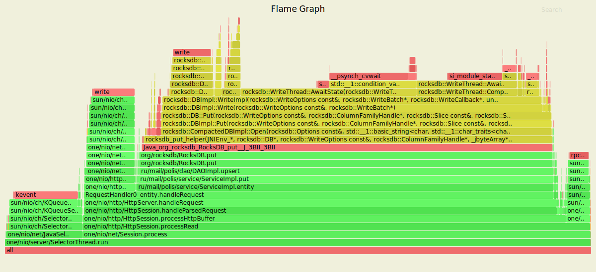
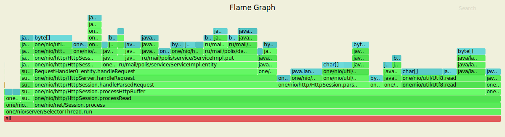
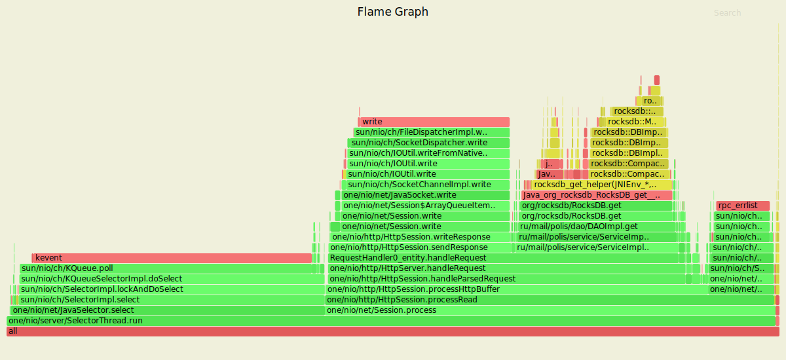
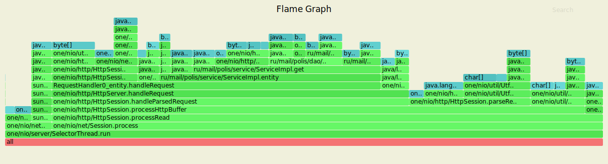

# Многопоточность

Так как RocksDB [потокобезопасна](https://github.com/facebook/rocksdb/wiki/RocksDB-FAQ#basic-readwrite) по своей природе, код проекта практически не изменился. Было проведено нагрузочное тестирование с помощью wrk в несколько соединений, и ниже представлены его результаты.

### Обстрел PUT-ами

Параметры запуска wrk
- 4 потока (worker'ы) отправляющие запросы
- 16 открытых соединений
- 20 000 запросов в секунду
- длительность 60 секунд

```text
Polinas-MacBook-Pro:wrk2 polina$ ./wrk -t4 -c16 -d60s -R20000 -s ./scripts/put.lua http://127.0.0.1:8080/
Running 1m test @ http://127.0.0.1:8080/
  4 threads and 16 connections
  Thread calibration: mean lat.: 1.246ms, rate sampling interval: 10ms
  Thread calibration: mean lat.: 1.246ms, rate sampling interval: 10ms
  Thread calibration: mean lat.: 1.244ms, rate sampling interval: 10ms
  Thread calibration: mean lat.: 1.238ms, rate sampling interval: 10ms
  Thread Stats   Avg      Stdev     Max   +/- Stdev
    Latency     1.25ms  640.59us  13.05ms   67.75%
    Req/Sec     5.27k   429.28     9.60k    72.65%
  1199828 requests in 1.00m, 76.66MB read
Requests/sec:  19997.22
Transfer/sec:  1.28MB
```

### Результаты с async profiler-а (CPU)


Flame Graph незначительно отличается от полученного в предыдущем задании. И то, возможно, только из-за того, что профилирование проводилось отдельным приложением async profiler-a, а не встроенным в IDEA. Большинство запросов также принадлежат NIO Selector-у, который обрабатывает наши запросы. Читая диграмму снизу вверх `one.nio.server.SelectorThread.run -> org.rocksdb.RocksDB.put`, видим, что процесс заканчивается помещением данных в RocksDB. А еще здесь на вершине диаграммы нет `[unknown]`, видимо, отдельно стоящий профилировщик справляется со своей задачей лучше.

### Результаты с async profiler-а (ALLOC)


Аналогичная предыдущему заданию ситуация с ALLOC — запросы NIO Selector-а занимают большую часть. 50-60% памяти занимает обработка запросов и где-то 30% - запись данных в DAO.

### Результаты с async profiler-a (LOCK)


Несмотря на многочисленные запуски async profiler, Flame Graph пустой, что говорит об отсутствии блокировок. 

Стала интересна [реализация](https://github.com/facebook/rocksdb/blob/master/db/db_impl/db_impl_write.cc) RocksDB на GitHub. И вот что выяснилось. RocksDB использует WriterThread для обработки многопоточной записи. И все «писатели» войдут в JoinBatchGroup, если «писатель» текущего потока получит так называемый group_leader, то он произведет запись. У всего процесса нет конкуренции.

Кстати, профилирование при помощи async profiler, встроенного в IDEA дает худший результат: граф меняется от запуска к запуску, и на нем периодически появляются процессы, не связанные с работой сервера. Возможно, это связано с тем, что процесс хуже удается «прогреть».

### Обстрел GET-ами

Параметры запуска wrk
- 4 потока (worker'ы) отправляющие запросы
- 16 открытых соединений
- 20 000 запросов в секунду
- длительность 60 секунд

```text
Polinas-MacBook-Pro:wrk2 polina$ ./wrk -t4 -c16 -d60s -R20000 -s ./scripts/get.lua http://127.0.0.1:8080/
Running 1m test @ http://127.0.0.1:8080/
  4 threads and 16 connections
  Thread calibration: mean lat.: 1.185ms, rate sampling interval: 10ms
  Thread calibration: mean lat.: 1.175ms, rate sampling interval: 10ms
  Thread calibration: mean lat.: 1.181ms, rate sampling interval: 10ms
  Thread calibration: mean lat.: 1.181ms, rate sampling interval: 10ms
  Thread Stats   Avg      Stdev     Max   +/- Stdev
    Latency     1.15ms  772.77us  31.50ms   80.73%
    Req/Sec     5.27k   431.94    19.80k    78.69%
  1199798 requests in 1.00m, 84.21MB read
Requests/sec:  19996.98
Transfer/sec:      1.40MB
```

### Результаты с async profiler-а (CPU)


Здесь на работу с DAO уходит ~20%. А обработка запросов составляет порядка 45%. Также где-то 20-30% уходит на чтение / запись в сокет. В отличие от предыдущего задания на графике явно видно `sun/nio/ch/SelectorImpl.lockAndDoSelect`, так как здесь мы имеем дело с многопоточностью.

### Результаты с async profiler-а (ALLOC)


На данном Flame Graph парсинг и обработка запросов составляют ~55% и 30-37% — получение данных из DAO `ru.mail.polis.dao.DAOImpl.get`.

### Результаты с async profiler-a (LOCK)


Как и в обстреле PUT'ами, Flame Graph пустой; lock'ов нет. Получен такой же результат, как и было показано на лекции для кастомной имплементации DAO. Во время обстрела GET'ами никто не пытается писать в базу; блокировок нет.