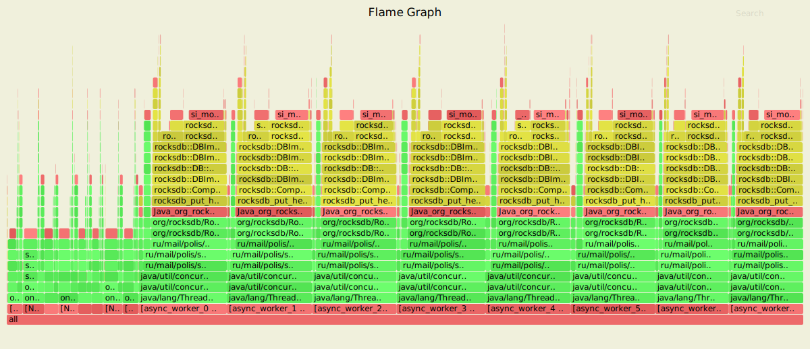
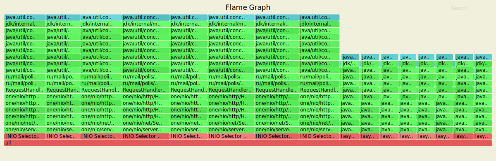
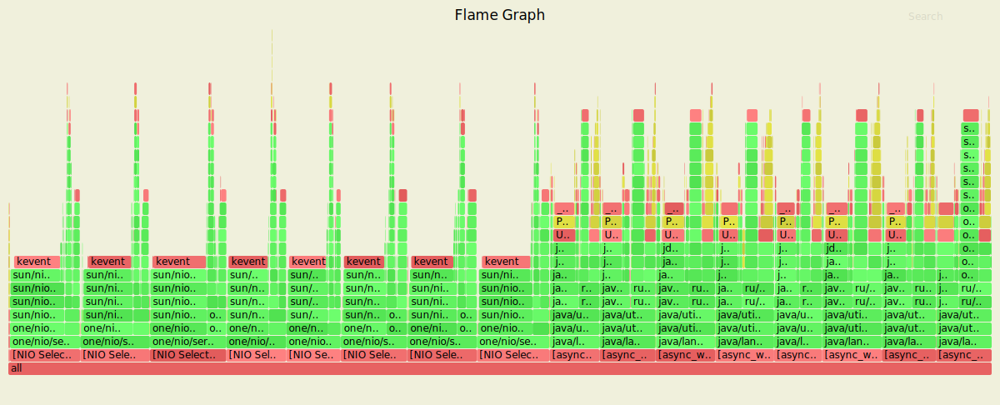
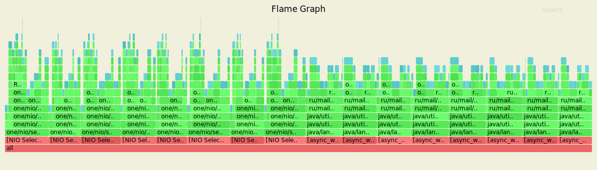
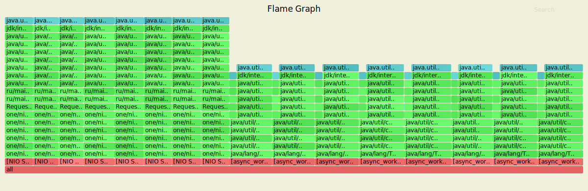

# Асинхронный сервер

На данном этапе обработка запросов была вынесена в [отдельный ExecutorService с ограниченной очередью](/Users/polina/GitHub/2020-highload-dht/src/main/java/ru/mail/polis/service/ServiceAsyncImpl.java), чтобы разгрузить SelectorThread'ы HTTP-сервера. Ниже приведены результаты профилирования под нагрузкой, а также анализ их и сравнение с [предыдущим этапом](/Users/polina/GitHub/2020-highload-dht/docs/Task2.md).

### Обстрел PUT-ами

Параметры запуска wrk
- 4 потока (worker'ы) отправляющие запросы
- 64 открытых соединения
- 30 000 запросов в секунду
- длительность 30 секунд

```text
Running 30s test @ http://127.0.0.1:8080/
  4 threads and 64 connections
  Thread calibration: mean lat.: 1.715ms, rate sampling interval: 10ms
  Thread calibration: mean lat.: 1.729ms, rate sampling interval: 10ms
  Thread calibration: mean lat.: 1.709ms, rate sampling interval: 10ms
  Thread calibration: mean lat.: 1.715ms, rate sampling interval: 10ms
  Thread Stats   Avg      Stdev     Max   +/- Stdev
    Latency     1.72ms    1.35ms  46.46ms   92.29%
    Req/Sec     7.91k     0.86k   16.89k    79.61%
  Latency Distribution (HdrHistogram - Recorded Latency)
 50.000%    1.52ms
 75.000%    2.13ms
 90.000%    2.77ms
 99.000%    5.37ms
 99.900%   20.78ms
 99.990%   29.69ms
 99.999%   40.00ms
100.000%   46.49ms

  Detailed Percentile spectrum:
       Value   Percentile   TotalCount 1/(1-Percentile)

       0.095     0.000000            1         1.00
       0.713     0.100000        59863         1.11
       0.938     0.200000       119560         1.25
       1.134     0.300000       179254         1.43
       1.323     0.400000       238993         1.67
       1.522     0.500000       298909         2.00
       1.627     0.550000       328739         2.22
       1.738     0.600000       358667         2.50
       1.856     0.650000       388458         2.86
       1.986     0.700000       418361         3.33
       2.127     0.750000       448128         4.00
       2.207     0.775000       463347         4.44
       2.291     0.800000       478083         5.00
       2.385     0.825000       493007         5.71
       2.491     0.850000       507802         6.67
       2.617     0.875000       522906         8.00
       2.687     0.887500       530271         8.89
       2.767     0.900000       537734        10.00
       2.859     0.912500       545173        11.43
       2.967     0.925000       552664        13.33
       3.091     0.937500       560069        16.00
       3.165     0.943750       563812        17.78
       3.247     0.950000       567549        20.00
       3.343     0.956250       571311        22.86
       3.455     0.962500       575003        26.67
       3.595     0.968750       578743        32.00
       3.685     0.971875       580624        35.56
       3.791     0.975000       582476        40.00
       3.929     0.978125       584341        45.71
       4.119     0.981250       586216        53.33
       4.375     0.984375       588086        64.00
       4.555     0.985938       589014        71.11
       4.803     0.987500       589950        80.00
       5.123     0.989062       590878        91.43
       5.559     0.990625       591806       106.67
       6.195     0.992188       592738       128.00
       6.591     0.992969       593206       142.22
       7.059     0.993750       593673       160.00
       7.655     0.994531       594139       182.86
       8.399     0.995313       594606       213.33
       9.479     0.996094       595072       256.00
      10.159     0.996484       595304       284.44
      10.959     0.996875       595538       320.00
      11.783     0.997266       595772       365.71
      12.767     0.997656       596004       426.67
      14.527     0.998047       596238       512.00
      16.159     0.998242       596354       568.89
      17.599     0.998437       596471       640.00
      18.719     0.998633       596588       731.43
      19.871     0.998828       596704       853.33
      20.911     0.999023       596821      1024.00
      21.359     0.999121       596879      1137.78
      21.967     0.999219       596938      1280.00
      22.495     0.999316       596996      1462.86
      23.183     0.999414       597054      1706.67
      23.823     0.999512       597113      2048.00
      24.335     0.999561       597142      2275.56
      24.735     0.999609       597172      2560.00
      25.215     0.999658       597200      2925.71
      26.095     0.999707       597230      3413.33
      26.799     0.999756       597259      4096.00
      26.991     0.999780       597273      4551.11
      27.471     0.999805       597288      5120.00
      27.791     0.999829       597302      5851.43
      28.223     0.999854       597317      6826.67
      28.911     0.999878       597333      8192.00
      29.343     0.999890       597339      9102.22
      29.759     0.999902       597346     10240.00
      29.903     0.999915       597353     11702.86
      30.639     0.999927       597361     13653.33
      31.279     0.999939       597368     16384.00
      31.791     0.999945       597372     18204.44
      32.431     0.999951       597375     20480.00
      32.991     0.999957       597380     23405.71
      33.183     0.999963       597383     27306.67
      33.823     0.999969       597386     32768.00
      34.143     0.999973       597388     36408.89
      34.335     0.999976       597390     40960.00
      35.071     0.999979       597392     46811.43
      36.831     0.999982       597394     54613.33
      37.887     0.999985       597395     65536.00
      38.911     0.999986       597396     72817.78
      39.967     0.999988       597397     81920.00
      39.999     0.999989       597398     93622.86
      40.799     0.999991       597399    109226.67
      41.887     0.999992       597400    131072.00
      41.887     0.999993       597400    145635.56
      42.623     0.999994       597401    163840.00
      42.623     0.999995       597401    187245.71
      43.967     0.999995       597402    218453.33
      43.967     0.999996       597402    262144.00
      43.967     0.999997       597402    291271.11
      45.311     0.999997       597403    327680.00
      45.311     0.999997       597403    374491.43
      45.311     0.999998       597403    436906.67
      45.311     0.999998       597403    524288.00
      45.311     0.999998       597403    582542.22
      46.495     0.999998       597404    655360.00
      46.495     1.000000       597404          inf
#[Mean    =        1.725, StdDeviation   =        1.346]
#[Max     =       46.464, Total count    =       597404]
#[Buckets =           27, SubBuckets     =         2048]
----------------------------------------------------------
  898672 requests in 30.00s, 57.42MB read
Requests/sec:  29956.76
Transfer/sec:      1.91MB
```

### Результаты с async profiler-а (CPU)


В отличие от предыдущего этапа, на Flame Graph мы видим 8 селекторов слева (примерно по 4% каждый) и 8 потоков работы сервиса справа (~8% каждый). На графике отражено не только взаимодействие с RocksDB, но и постановка запросов в очередь (`java/util/concurrent/ThreadPoolExecutor.execute`, `java/util/concurrent/ArrayBlockingQueue.offer` и выше).

### Результаты с async profiler-а (ALLOC)


Здесь мы также видим 8 селекторов (по 5-6% каждый) и столько же потоков работы нашего HTTP-сервиса. 

### Результаты с async profiler-a (LOCK)



В отличие от синхронной реализаии Flame Graph не пустой — появились блокировки потоков работы HTTP-сервиса.

### Обстрел GET-ами

Параметры запуска wrk
- 4 потока (worker'ы) отправляющие запросы
- 64 открытых соединений
- 30 000 запросов в секунду
- длительность 30 секунд

```text
Running 30s test @ http://127.0.0.1:8080/
  4 threads and 64 connections
  Thread calibration: mean lat.: 1.585ms, rate sampling interval: 10ms
  Thread calibration: mean lat.: 1.584ms, rate sampling interval: 10ms
  Thread calibration: mean lat.: 1.572ms, rate sampling interval: 10ms
  Thread calibration: mean lat.: 1.593ms, rate sampling interval: 10ms
  Thread Stats   Avg      Stdev     Max   +/- Stdev
    Latency     1.56ms  738.08us  11.10ms   67.38%
    Req/Sec     7.91k   670.46    15.11k    70.70%
  Latency Distribution (HdrHistogram - Recorded Latency)
 50.000%    1.46ms
 75.000%    2.04ms
 90.000%    2.59ms
 99.000%    3.47ms
 99.900%    4.30ms
 99.990%    7.66ms
 99.999%   10.87ms
100.000%   11.11ms

  Detailed Percentile spectrum:
       Value   Percentile   TotalCount 1/(1-Percentile)

       0.072     0.000000            1         1.00
       0.688     0.100000        59873         1.11
       0.909     0.200000       119723         1.25
       1.094     0.300000       179327         1.43
       1.271     0.400000       239113         1.67
       1.456     0.500000       299008         2.00
       1.555     0.550000       328912         2.22
       1.660     0.600000       358764         2.50
       1.774     0.650000       388546         2.86
       1.899     0.700000       418333         3.33
       2.039     0.750000       448308         4.00
       2.115     0.775000       463512         4.44
       2.193     0.800000       478138         5.00
       2.281     0.825000       493290         5.71
       2.373     0.850000       508000         6.67
       2.477     0.875000       523002         8.00
       2.533     0.887500       530465         8.89
       2.593     0.900000       537914        10.00
       2.661     0.912500       545482        11.43
       2.733     0.925000       552857        13.33
       2.813     0.937500       560251        16.00
       2.861     0.943750       564071        17.78
       2.911     0.950000       567772        20.00
       2.965     0.956250       571517        22.86
       3.025     0.962500       575264        26.67
       3.091     0.968750       578925        32.00
       3.129     0.971875       580839        35.56
       3.169     0.975000       582670        40.00
       3.219     0.978125       584574        45.71
       3.271     0.981250       586423        53.33
       3.331     0.984375       588276        64.00
       3.367     0.985938       589231        71.11
       3.405     0.987500       590140        80.00
       3.447     0.989062       591088        91.43
       3.495     0.990625       591996       106.67
       3.553     0.992188       592941       128.00
       3.583     0.992969       593384       142.22
       3.623     0.993750       593848       160.00
       3.663     0.994531       594314       182.86
       3.713     0.995313       594782       213.33
       3.771     0.996094       595255       256.00
       3.807     0.996484       595496       284.44
       3.847     0.996875       595720       320.00
       3.891     0.997266       595955       365.71
       3.943     0.997656       596186       426.67
       4.009     0.998047       596419       512.00
       4.049     0.998242       596534       568.89
       4.091     0.998437       596649       640.00
       4.151     0.998633       596767       731.43
       4.219     0.998828       596886       853.33
       4.315     0.999023       596998      1024.00
       4.355     0.999121       597056      1137.78
       4.411     0.999219       597115      1280.00
       4.491     0.999316       597176      1462.86
       4.595     0.999414       597233      1706.67
       4.723     0.999512       597291      2048.00
       4.811     0.999561       597318      2275.56
       4.895     0.999609       597347      2560.00
       5.003     0.999658       597376      2925.71
       5.135     0.999707       597408      3413.33
       5.251     0.999756       597435      4096.00
       5.367     0.999780       597449      4551.11
       5.483     0.999805       597464      5120.00
       5.651     0.999829       597478      5851.43
       5.919     0.999854       597493      6826.67
       6.715     0.999878       597508      8192.00
       7.167     0.999890       597515      9102.22
       8.019     0.999902       597522     10240.00
       8.327     0.999915       597529     11702.86
       8.927     0.999927       597537     13653.33
       9.319     0.999939       597544     16384.00
       9.535     0.999945       597548     18204.44
       9.711     0.999951       597551     20480.00
       9.863     0.999957       597555     23405.71
       9.999     0.999963       597559     27306.67
      10.071     0.999969       597562     32768.00
      10.223     0.999973       597564     36408.89
      10.479     0.999976       597566     40960.00
      10.551     0.999979       597568     46811.43
      10.647     0.999982       597570     54613.33
      10.735     0.999985       597571     65536.00
      10.783     0.999986       597572     72817.78
      10.791     0.999988       597573     81920.00
      10.871     0.999989       597575     93622.86
      10.871     0.999991       597575    109226.67
      10.879     0.999992       597576    131072.00
      10.879     0.999993       597576    145635.56
      10.967     0.999994       597577    163840.00
      10.967     0.999995       597577    187245.71
      10.999     0.999995       597578    218453.33
      10.999     0.999996       597578    262144.00
      10.999     0.999997       597578    291271.11
      11.015     0.999997       597579    327680.00
      11.015     0.999997       597579    374491.43
      11.015     0.999998       597579    436906.67
      11.015     0.999998       597579    524288.00
      11.015     0.999998       597579    582542.22
      11.111     0.999998       597580    655360.00
      11.111     1.000000       597580          inf
#[Mean    =        1.563, StdDeviation   =        0.738]
#[Max     =       11.104, Total count    =       597580]
#[Buckets =           27, SubBuckets     =         2048]
----------------------------------------------------------
  898840 requests in 30.00s, 62.97MB read
Requests/sec:  29962.40
Transfer/sec:      2.10MB
```

### Результаты с async profiler-а (CPU)


На графике видно 8 селекторов слева (примерно по 7% каждый) и 8 потоков работы сервиса справа (~5% каждый). 

### Результаты с async profiler-а (ALLOC)


График визуально очень похож на ALLOC PUT (распределение между селекторами и воркерами аналогичное). Только вместо PUT-запроса — GET, и выше также работа с сессией.

### Результаты с async profiler-a (LOCK)



Здесь в отличие от предыдущего этапа Flame Graph тоже пустой; Присутствуют блокировки потоков работы HTTP-сервиса.

## Вывод

Что касается быстродействия, асинхронная реализация сервиса явно выигрывает. Посмотрим на результаты нагрузочного тестирования с теми же параметрами. Запросы теперь обрабатываются явно быстрее: для PUT 100% запросов асинхронно обрабатываются за 46.49ms против 58.75ms синхронно, и для GET асинхронно мы имеем 11.11ms против 16.46ms синхронно.

### PUT

```text
Running 30s test @ http://127.0.0.1:8080/
  4 threads and 64 connections
  Thread calibration: mean lat.: 1.641ms, rate sampling interval: 10ms
  Thread calibration: mean lat.: 1.639ms, rate sampling interval: 10ms
  Thread calibration: mean lat.: 1.635ms, rate sampling interval: 10ms
  Thread calibration: mean lat.: 1.660ms, rate sampling interval: 10ms
  Thread Stats   Avg      Stdev     Max   +/- Stdev
    Latency     1.69ms    1.65ms  58.72ms   96.01%
    Req/Sec     7.91k   806.07    18.11k    76.28%
  Latency Distribution (HdrHistogram - Recorded Latency)
 50.000%    1.45ms
 75.000%    2.10ms
 90.000%    2.75ms
 99.000%    4.86ms
 99.900%   26.19ms
 99.990%   50.97ms
 99.999%   58.11ms
100.000%   58.75ms

  Detailed Percentile spectrum:
       Value   Percentile   TotalCount 1/(1-Percentile)

       0.076     0.000000            1         1.00
       0.663     0.100000        59959         1.11
       0.882     0.200000       119614         1.25
       1.073     0.300000       179416         1.43
       1.259     0.400000       239154         1.67
       1.453     0.500000       298971         2.00
       1.559     0.550000       328915         2.22
       1.674     0.600000       358622         2.50
       1.801     0.650000       388452         2.86
       1.942     0.700000       418402         3.33
       2.095     0.750000       448201         4.00
       2.179     0.775000       463380         4.44
       2.269     0.800000       478229         5.00
       2.367     0.825000       493246         5.71
       2.477     0.850000       508132         6.67
       2.601     0.875000       522900         8.00
       2.671     0.887500       530438         8.89
       2.749     0.900000       537854        10.00
       2.839     0.912500       545411        11.43
       2.939     0.925000       552858        13.33
       3.055     0.937500       560287        16.00
       3.121     0.943750       563990        17.78
       3.193     0.950000       567707        20.00
       3.277     0.956250       571482        22.86
       3.373     0.962500       575163        26.67
       3.497     0.968750       578945        32.00
       3.569     0.971875       580767        35.56
       3.657     0.975000       582667        40.00
       3.757     0.978125       584529        45.71
       3.889     0.981250       586376        53.33
       4.077     0.984375       588243        64.00
       4.203     0.985938       589192        71.11
       4.359     0.987500       590102        80.00
       4.623     0.989062       591041        91.43
       5.047     0.990625       591974       106.67
       5.679     0.992188       592904       128.00
       6.139     0.992969       593371       142.22
       6.695     0.993750       593839       160.00
       7.415     0.994531       594304       182.86
       8.455     0.995313       594771       213.33
      10.055     0.996094       595235       256.00
      11.263     0.996484       595469       284.44
      13.175     0.996875       595703       320.00
      15.199     0.997266       595936       365.71
      17.519     0.997656       596169       426.67
      19.631     0.998047       596402       512.00
      20.687     0.998242       596520       568.89
      21.871     0.998437       596636       640.00
      23.231     0.998633       596753       731.43
      24.655     0.998828       596869       853.33
      26.415     0.999023       596989      1024.00
      27.247     0.999121       597044      1137.78
      28.303     0.999219       597103      1280.00
      29.311     0.999316       597161      1462.86
      30.575     0.999414       597219      1706.67
      31.775     0.999512       597280      2048.00
      32.127     0.999561       597307      2275.56
      32.991     0.999609       597336      2560.00
      34.111     0.999658       597366      2925.71
      35.871     0.999707       597395      3413.33
      37.951     0.999756       597424      4096.00
      39.103     0.999780       597438      4551.11
      40.447     0.999805       597453      5120.00
      41.439     0.999829       597467      5851.43
      43.167     0.999854       597482      6826.67
      47.391     0.999878       597497      8192.00
      49.823     0.999890       597504      9102.22
      51.263     0.999902       597511     10240.00
      52.063     0.999915       597519     11702.86
      53.215     0.999927       597526     13653.33
      54.399     0.999939       597533     16384.00
      55.455     0.999945       597537     18204.44
      55.679     0.999951       597540     20480.00
      56.095     0.999957       597544     23405.71
      56.543     0.999963       597548     27306.67
      57.151     0.999969       597551     32768.00
      57.215     0.999973       597554     36408.89
      57.311     0.999976       597555     40960.00
      57.727     0.999979       597557     46811.43
      57.887     0.999982       597559     54613.33
      57.919     0.999985       597560     65536.00
      57.951     0.999986       597561     72817.78
      58.015     0.999988       597562     81920.00
      58.111     0.999989       597563     93622.86
      58.335     0.999991       597564    109226.67
      58.367     0.999992       597565    131072.00
      58.367     0.999993       597565    145635.56
      58.687     0.999994       597566    163840.00
      58.687     0.999995       597566    187245.71
      58.719     0.999995       597568    218453.33
      58.719     0.999996       597568    262144.00
      58.719     0.999997       597568    291271.11
      58.719     0.999997       597568    327680.00
      58.719     0.999997       597568    374491.43
      58.719     0.999998       597568    436906.67
      58.719     0.999998       597568    524288.00
      58.719     0.999998       597568    582542.22
      58.751     0.999998       597569    655360.00
      58.751     1.000000       597569          inf
#[Mean    =        1.689, StdDeviation   =        1.645]
#[Max     =       58.720, Total count    =       597569]
#[Buckets =           27, SubBuckets     =         2048]
----------------------------------------------------------
  898816 requests in 30.00s, 57.43MB read
Requests/sec:  29961.29
Transfer/sec:      1.91MB
```

### GET

```text
Running 30s test @ http://127.0.0.1:8080/
  4 threads and 64 connections
  Thread calibration: mean lat.: 1.536ms, rate sampling interval: 10ms
  Thread calibration: mean lat.: 1.529ms, rate sampling interval: 10ms
  Thread calibration: mean lat.: 1.534ms, rate sampling interval: 10ms
  Thread calibration: mean lat.: 1.538ms, rate sampling interval: 10ms
  Thread Stats   Avg      Stdev     Max   +/- Stdev
    Latency     1.54ms  747.43us  16.45ms   68.02%
    Req/Sec     7.91k   651.40    20.22k    75.00%
  Latency Distribution (HdrHistogram - Recorded Latency)
 50.000%    1.42ms
 75.000%    2.02ms
 90.000%    2.58ms
 99.000%    3.42ms
 99.900%    4.83ms
 99.990%   10.78ms
 99.999%   15.34ms
100.000%   16.46ms

  Detailed Percentile spectrum:
       Value   Percentile   TotalCount 1/(1-Percentile)

       0.074     0.000000            1         1.00
       0.681     0.100000        59942         1.11
       0.888     0.200000       119753         1.25
       1.065     0.300000       179287         1.43
       1.236     0.400000       239078         1.67
       1.419     0.500000       298971         2.00
       1.519     0.550000       328922         2.22
       1.627     0.600000       358745         2.50
       1.746     0.650000       388472         2.86
       1.879     0.700000       418447         3.33
       2.024     0.750000       448349         4.00
       2.101     0.775000       463301         4.44
       2.183     0.800000       478300         5.00
       2.269     0.825000       493189         5.71
       2.363     0.850000       508110         6.67
       2.465     0.875000       522896         8.00
       2.521     0.887500       530456         8.89
       2.581     0.900000       538006        10.00
       2.643     0.912500       545294        11.43
       2.715     0.925000       552910        13.33
       2.793     0.937500       560398        16.00
       2.835     0.943750       564093        17.78
       2.881     0.950000       567710        20.00
       2.933     0.956250       571538        22.86
       2.987     0.962500       575258        26.67
       3.051     0.968750       578948        32.00
       3.085     0.971875       580799        35.56
       3.123     0.975000       582734        40.00
       3.165     0.978125       584507        45.71
       3.215     0.981250       586397        53.33
       3.273     0.984375       588291        64.00
       3.305     0.985938       589182        71.11
       3.343     0.987500       590122        80.00
       3.385     0.989062       591045        91.43
       3.437     0.990625       591992       106.67
       3.499     0.992188       592924       128.00
       3.537     0.992969       593386       142.22
       3.583     0.993750       593849       160.00
       3.629     0.994531       594311       182.86
       3.685     0.995313       594782       213.33
       3.755     0.996094       595245       256.00
       3.801     0.996484       595481       284.44
       3.861     0.996875       595712       320.00
       3.921     0.997266       595949       365.71
       3.999     0.997656       596178       426.67
       4.115     0.998047       596412       512.00
       4.195     0.998242       596531       568.89
       4.315     0.998437       596648       640.00
       4.455     0.998633       596764       731.43
       4.639     0.998828       596879       853.33
       4.863     0.999023       596996      1024.00
       5.019     0.999121       597055      1137.78
       5.175     0.999219       597112      1280.00
       5.311     0.999316       597170      1462.86
       5.563     0.999414       597228      1706.67
       5.855     0.999512       597287      2048.00
       6.015     0.999561       597316      2275.56
       6.191     0.999609       597345      2560.00
       6.383     0.999658       597375      2925.71
       6.651     0.999707       597403      3413.33
       6.979     0.999756       597433      4096.00
       7.251     0.999780       597447      4551.11
       7.547     0.999805       597462      5120.00
       8.067     0.999829       597476      5851.43
       8.967     0.999854       597491      6826.67
       9.711     0.999878       597506      8192.00
      10.575     0.999890       597513      9102.22
      10.839     0.999902       597520     10240.00
      11.143     0.999915       597527     11702.86
      11.767     0.999927       597535     13653.33
      12.439     0.999939       597542     16384.00
      12.567     0.999945       597546     18204.44
      12.735     0.999951       597549     20480.00
      13.471     0.999957       597553     23405.71
      13.951     0.999963       597557     27306.67
      14.199     0.999969       597560     32768.00
      14.271     0.999973       597562     36408.89
      14.407     0.999976       597564     40960.00
      14.615     0.999979       597566     46811.43
      14.703     0.999982       597568     54613.33
      15.127     0.999985       597569     65536.00
      15.183     0.999986       597570     72817.78
      15.247     0.999988       597571     81920.00
      15.335     0.999989       597572     93622.86
      15.655     0.999991       597573    109226.67
      15.807     0.999992       597574    131072.00
      15.807     0.999993       597574    145635.56
      15.815     0.999994       597575    163840.00
      15.815     0.999995       597575    187245.71
      15.847     0.999995       597576    218453.33
      15.847     0.999996       597576    262144.00
      15.847     0.999997       597576    291271.11
      15.863     0.999997       597577    327680.00
      15.863     0.999997       597577    374491.43
      15.863     0.999998       597577    436906.67
      15.863     0.999998       597577    524288.00
      15.863     0.999998       597577    582542.22
      16.463     0.999998       597578    655360.00
      16.463     1.000000       597578          inf
#[Mean    =        1.542, StdDeviation   =        0.747]
#[Max     =       16.448, Total count    =       597578]
#[Buckets =           27, SubBuckets     =         2048]
----------------------------------------------------------
  898847 requests in 30.00s, 62.97MB read
Requests/sec:  29960.81
Transfer/sec:      2.10MB
```