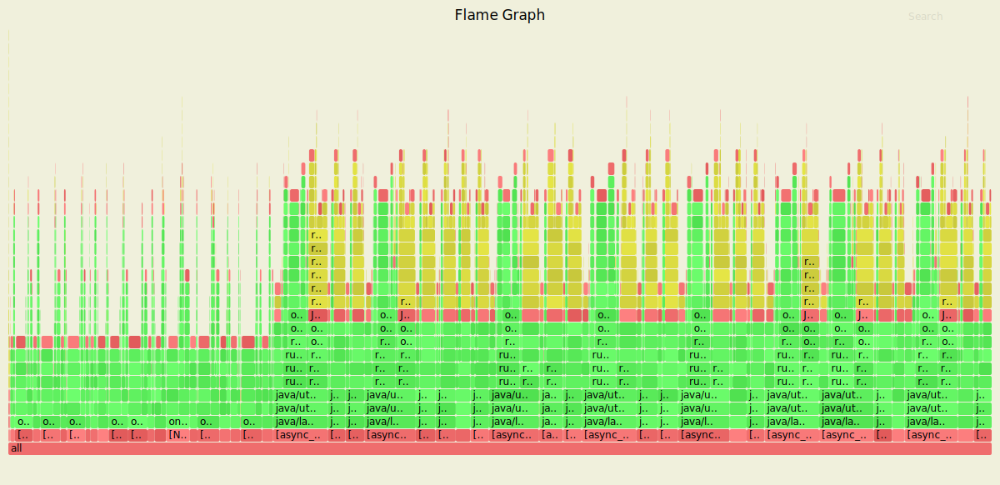
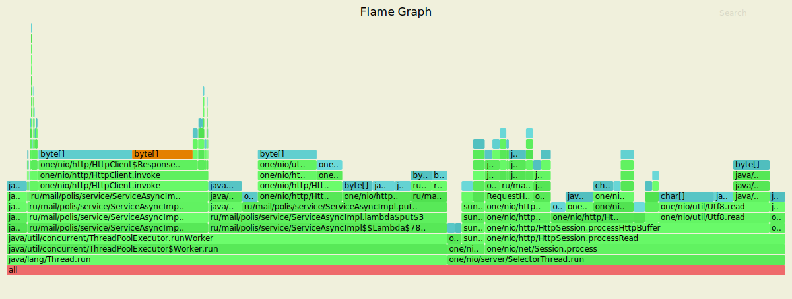
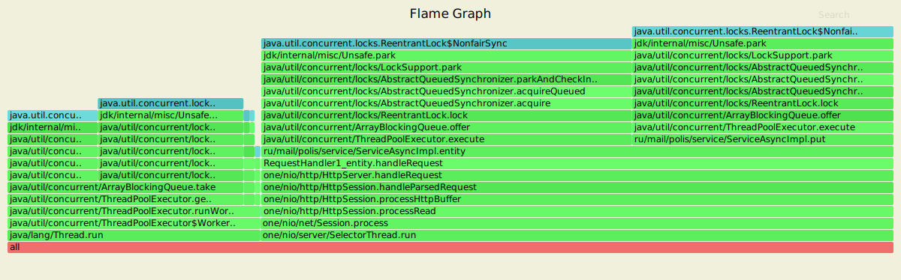
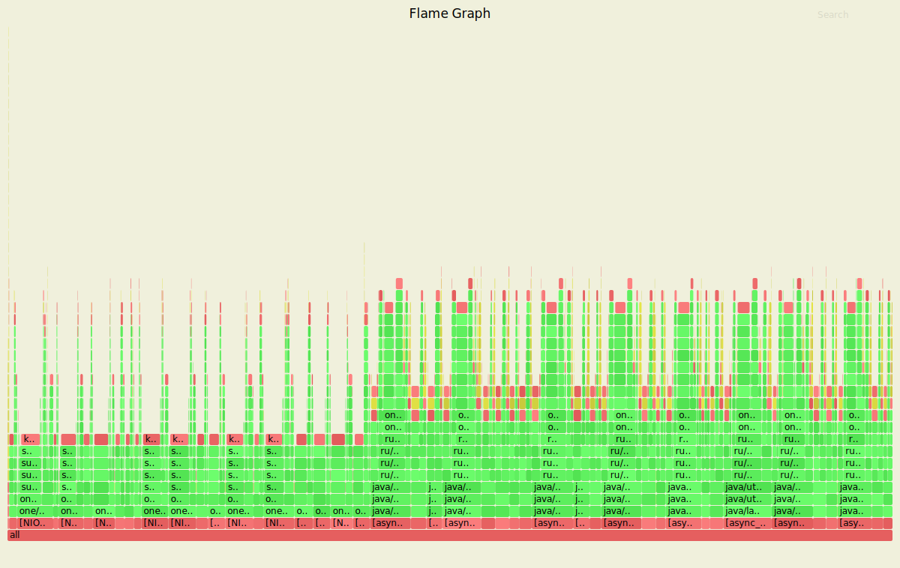
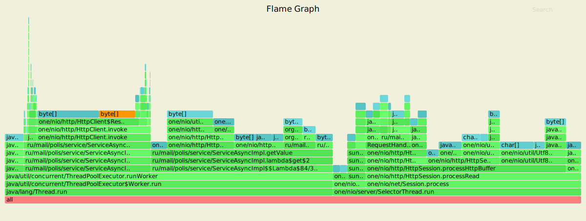
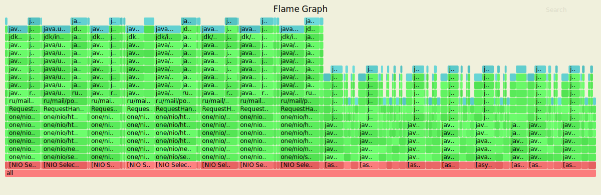

# Шардирование

На данном этапе было реализовано горизонтальное масштабирование через поддержку кластерных конфигураций, состоящих из нескольких узлов, взаимодействующих друг с другом через реализованный HTTP API.

### Обстрел PUT-ами

Параметры запуска wrk
- 4 потока (worker'ы) отправляющие запросы
- 64 открытых соединения
- 20 000 запросов в секунду
- длительность 30 секунд

```text
Running 30s test @ http://127.0.0.1:8080/
  4 threads and 64 connections
  Thread calibration: mean lat.: 1.620ms, rate sampling interval: 10ms
  Thread calibration: mean lat.: 1.630ms, rate sampling interval: 10ms
  Thread calibration: mean lat.: 1.632ms, rate sampling interval: 10ms
  Thread calibration: mean lat.: 1.621ms, rate sampling interval: 10ms
  Thread Stats   Avg      Stdev     Max   +/- Stdev
    Latency     2.31ms    3.88ms  51.84ms   96.35%
    Req/Sec     7.91k     0.98k   15.78k    79.28%
  Latency Distribution (HdrHistogram - Recorded Latency)
 50.000%    1.56ms
 75.000%    2.25ms
 90.000%    3.07ms
 99.000%   26.05ms
 99.900%   38.59ms
 99.990%   45.31ms
 99.999%   50.56ms
100.000%   51.87ms 
```

### Результаты с async profiler-а (CPU)


На Flame Graph теперь видны методы проксирования (invoke) в структуре класса ServiceAsyncImpl. Так осуществляется переадресация запроса в пределах кластера при обнаружении несоответствия ID текущего и целевого (обслуживающего запросы по конкретному ключу) узла-обработчика. Это оказывает потенциально негативное влияние на быстродействие работы нашего сервиса.

### Результаты с async profiler-а (ALLOC)


Нет ощутимых различий с предыдущим этапом: здесь также основными факторами выделения памяти являются объекты класса ThreadPoolExecutor, размещение данных из буфера и преобразование их типов.

### Результаты с async profiler-a (LOCK)



На графе также, как и в предыдущем этапе, присутствуют блокировки потоков работы HTTP-сервера. 

### Обстрел GET-ами

Параметры запуска wrk
- 4 потока (worker'ы) отправляющие запросы
- 64 открытых соединений
- 20 000 запросов в секунду
- длительность 30 секунд

```text
Running 30s test @ http://127.0.0.1:8080/
  4 threads and 64 connections
  Thread calibration: mean lat.: 1.634ms, rate sampling interval: 10ms
  Thread calibration: mean lat.: 1.630ms, rate sampling interval: 10ms
  Thread calibration: mean lat.: 1.628ms, rate sampling interval: 10ms
  Thread calibration: mean lat.: 1.611ms, rate sampling interval: 10ms
  Thread Stats   Avg      Stdev     Max   +/- Stdev
    Latency     1.73ms    1.46ms  38.02ms   94.34%
    Req/Sec     7.92k     0.87k   25.00k    78.54%
  Latency Distribution (HdrHistogram - Recorded Latency)
 50.000%    1.52ms
 75.000%    2.15ms
 90.000%    2.80ms
 99.000%    4.47ms
 99.900%   25.04ms
 99.990%   35.01ms
 99.999%   37.44ms
100.000%   38.05ms
```

### Результаты с async profiler-а (CPU)


Также, как и в PUT, на графике видны методы проксирования (invoke). По сравнению с предыдущим этапом быстродействие получения данных упало в 3.5 раза.

### Результаты с async profiler-а (ALLOC)


График не имеет существенных отличий от предыдущего этапа. Можно предположить, что различия в топологиях сервера не оказывают влияния на состав операций, требующих выделения памяти.

### Результаты с async profiler-a (LOCK)



Здесь как и в LOCK PUT — присутствуют блокировки потоков. Контроль асинхронного параллелизма при выполнении запросов на чтение реализуется с использованием механизма взаимоисключений (ReentrantLock + AbstractQueueSynchronizer).

## Вывод

Что касается быстродействия, для PUT оно почти не уменьшилось: 100% запросов обрабатываются за 51.87ms против 46.49ms в топологии с одним узлом. А вот в случае GET мы имеем 38.96ms против 11.11ms на предыдущем этапе.

