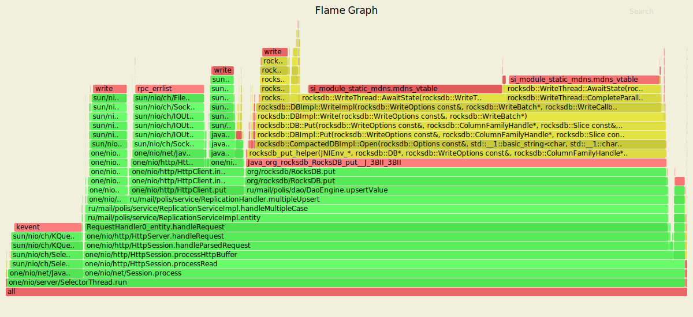
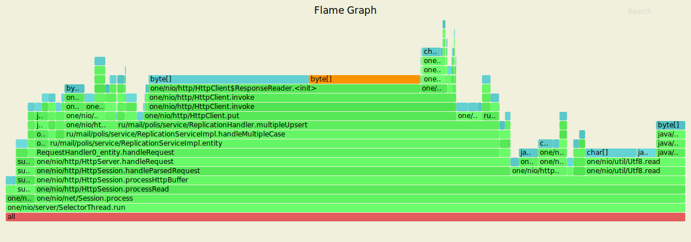
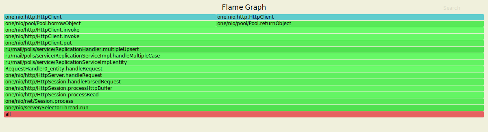
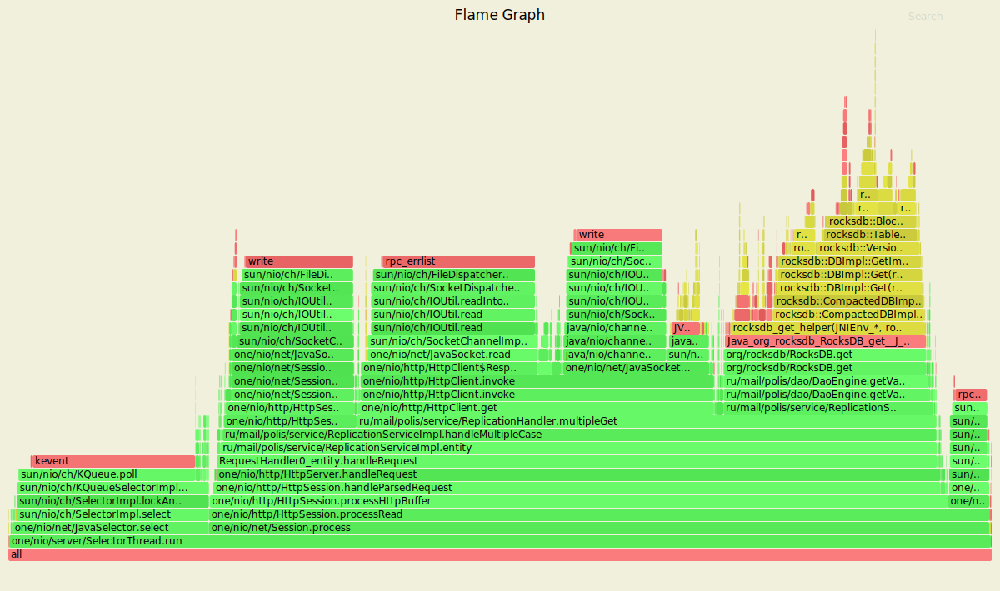
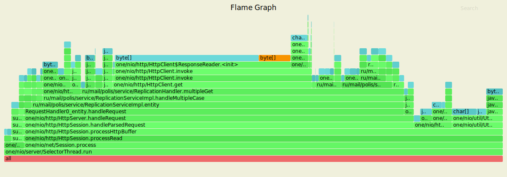
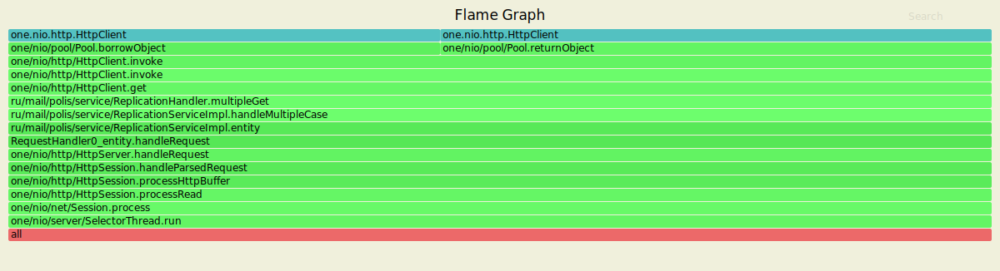

# Репликация

На данном этапе была реализована поддержка хранения нескольких реплик данных в кластере для обеспечения отказоустойчивости.

### Обстрел PUT-ами

Параметры запуска wrk
- 4 потока (worker'ы) отправляющие запросы
- 64 открытых соединения
- 10 000 запросов в секунду
- длительность 7 минут

```text
Running 7m test @ http://127.0.0.1:8080/
  4 threads and 64 connections
  Thread calibration: mean lat.: 1.364ms, rate sampling interval: 10ms
  Thread calibration: mean lat.: 1.453ms, rate sampling interval: 10ms
  Thread calibration: mean lat.: 1.391ms, rate sampling interval: 10ms
  Thread calibration: mean lat.: 1.371ms, rate sampling interval: 10ms
  Thread Stats   Avg      Stdev     Max   +/- Stdev
    Latency     1.32ms    0.86ms  59.04ms   87.55%
    Req/Sec     2.64k   220.93     7.44k    69.36%
  Latency Distribution (HdrHistogram - Recorded Latency)
 50.000%    1.22ms
 75.000%    1.67ms
 90.000%    2.09ms
 99.000%    3.06ms
 99.900%   10.68ms
 99.990%   27.07ms
 99.999%   45.50ms
100.000%   59.07ms 
```

### Результаты с async profiler-а (CPU)


На Flame Graph также, как и в предыдущем этапе, видны методы проксирования (invoke). Также видна работа по созданию репликаций `ru/mail/polis/service/ReplicationHandler.multipleUpsert`. Очевидно, это оказывает негативное влияние на быстродействие работы нашего сервиса. Также видно, что работа с базой занимает 62% ресурсов против 42% на прошлом этапе.

### Результаты с async profiler-а (ALLOC)


На прошлом этапе основным фактором выделения памяти были объекты класса ThreadPoolExecutor. Здесь их нет. Зато значительную часть ресурса занимает работа с репликами, в частности `multipleUpsert`.

### Результаты с async profiler-a (LOCK)



Здесь также пропал ThreadPoolExecutor, зато появились блокировки, характерные для чтения / парсинга данных и операций с созданием / распространением реплик.

### Обстрел GET-ами

Параметры запуска wrk
- 4 потока (worker'ы) отправляющие запросы
- 64 открытых соединений
- 20 000 запросов в секунду
- длительность 30 секунд

```text
Running 7m test @ http://127.0.0.1:8080/
  4 threads and 64 connections
  Thread calibration: mean lat.: 1.455ms, rate sampling interval: 10ms
  Thread calibration: mean lat.: 1.421ms, rate sampling interval: 10ms
  Thread calibration: mean lat.: 1.385ms, rate sampling interval: 10ms
  Thread calibration: mean lat.: 1.758ms, rate sampling interval: 10ms
  Thread Stats   Avg      Stdev     Max   +/- Stdev
    Latency     1.48ms  810.13us  54.53ms   77.82%
    Req/Sec     2.64k   391.85     6.44k    75.78%
  Latency Distribution (HdrHistogram - Recorded Latency)
 50.000%    1.38ms
 75.000%    1.88ms
 90.000%    2.36ms
 99.000%    3.56ms
 99.900%    6.03ms
 99.990%   24.48ms
 99.999%   42.37ms
100.000%   54.56ms
```

### Результаты с async profiler-а (CPU)


Аналогично — с графика пропал ThreadPoolExecutor. Большую часть ресурса (72%) занимает работа с репликами `ru/mail/polis/service/ReplicationServiceImpl.handleMultipleCase`

### Результаты с async profiler-а (ALLOC)


Здесь ключевыми являются операции получения и парсинга данных из буфера. Примерно 72% ресурса занимает работа с репликами.

### Результаты с async profiler-a (LOCK)



На Flame Graph присутствуют lock'и работы с репликами `handleMultipleCase`. Также, как и в PUT, не наблюдается lock'ов ThreadPoolExecutor'a.

## Вывод

Быстродействие ухудшилось. Для PUT мы имеем обработку 100% запросов за 59.07ms против 51.87ms на предыдушем этапе. А для GET — 54.56ms против 38.96ms на предыдущем этапе. Зато благодаря репликации данных значительно повысилась надежность нашего сервиса.