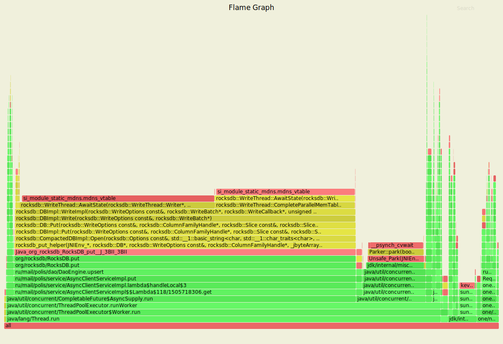
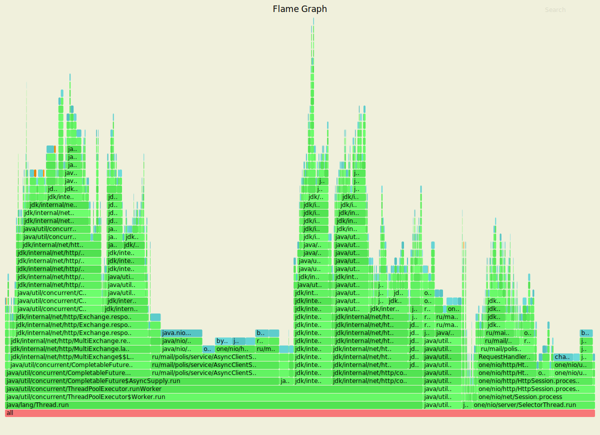
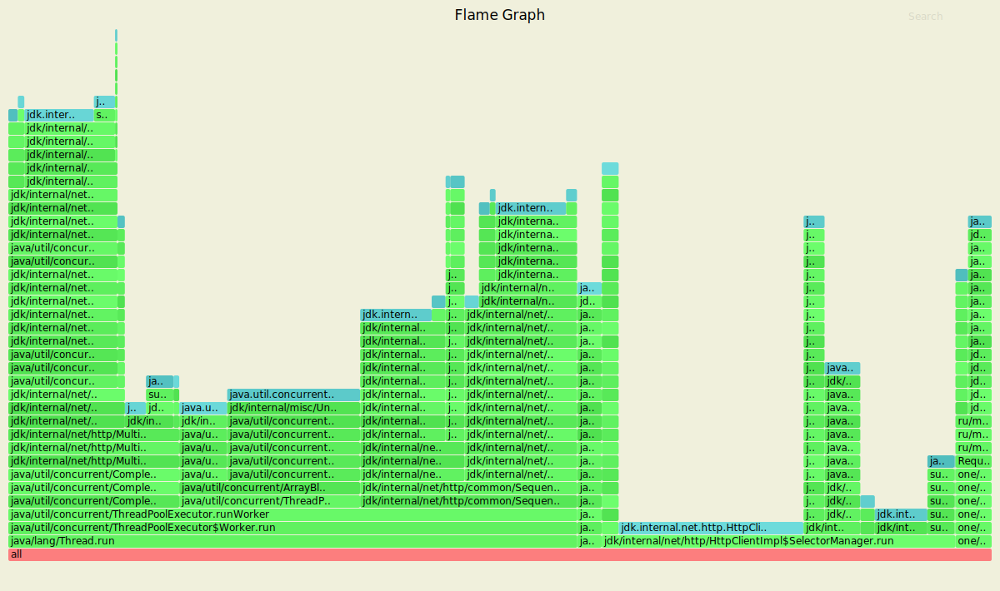
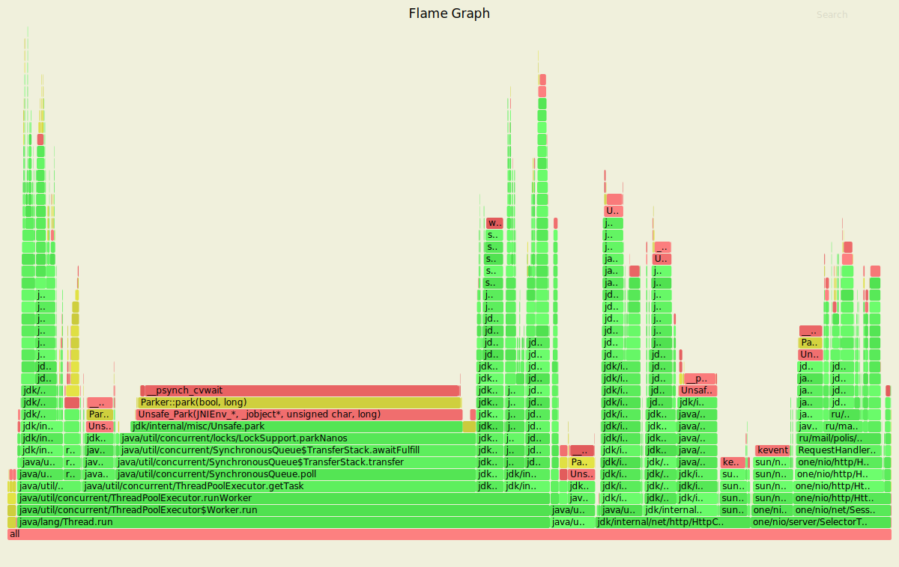
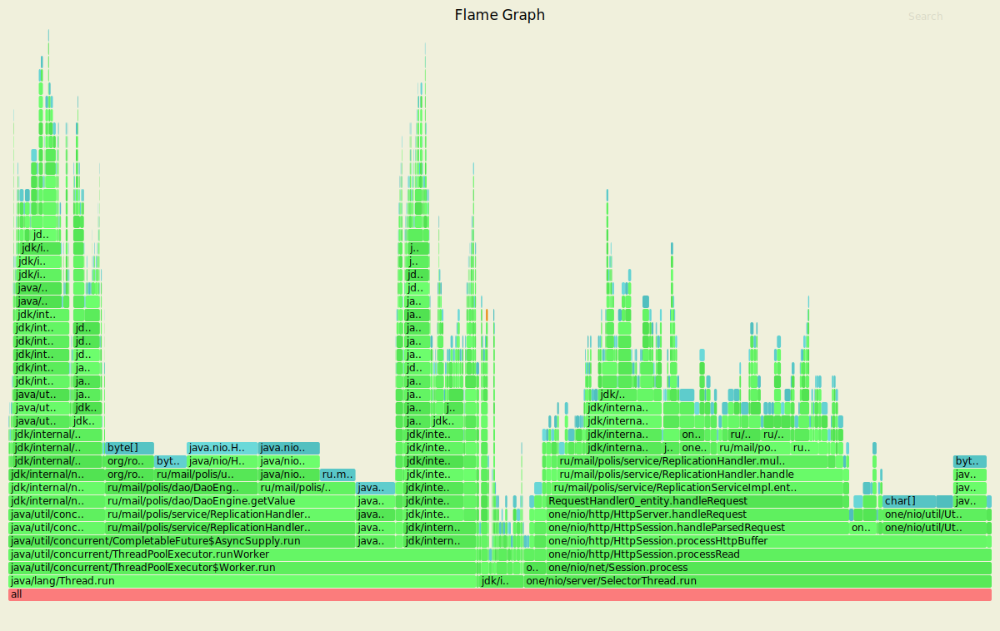
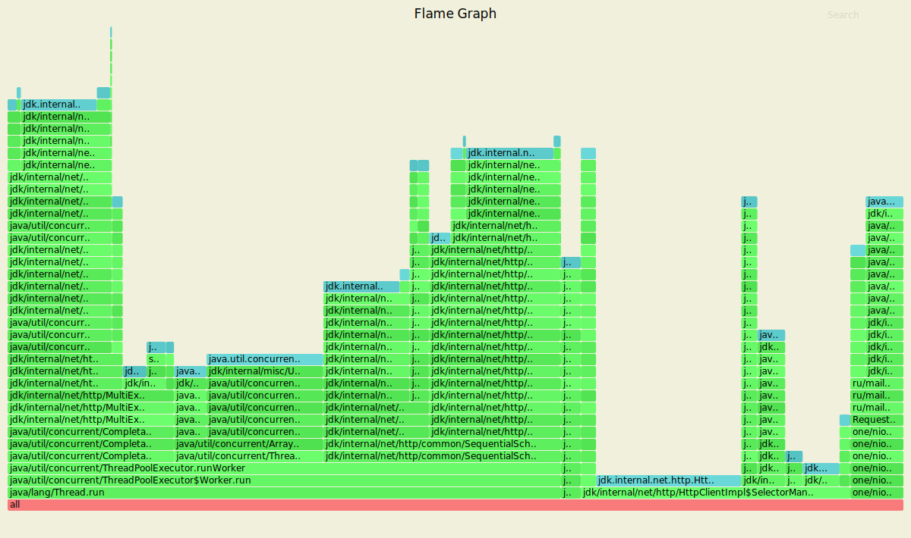

# Асинхронный клиент

На данном этапе внутреннее взаимодействие узлов было переписано на асинхронный `java.net.http.HttpClient`.

### Обстрел PUT-ами

Параметры запуска wrk
- 4 потока (worker'ы) отправляющие запросы
- 64 открытых соединения
- 10 000 запросов в секунду
- длительность 30 секунд

```text
Running 30s test @ http://127.0.0.1:8080/
  4 threads and 64 connections
  Thread calibration: mean lat.: 3.077ms, rate sampling interval: 10ms
  Thread calibration: mean lat.: 3.043ms, rate sampling interval: 10ms
  Thread calibration: mean lat.: 3.074ms, rate sampling interval: 10ms
  Thread calibration: mean lat.: 3.054ms, rate sampling interval: 10ms
  Thread Stats   Avg      Stdev     Max   +/- Stdev
    Latency     4.21ms    3.24ms  35.39ms   85.00%
    Req/Sec     2.64k   544.34     4.44k    70.88%
  Latency Distribution (HdrHistogram - Recorded Latency)
 50.000%    3.08ms
 75.000%    5.27ms
 90.000%    8.42ms
 99.000%   16.67ms
 99.900%   25.38ms
 99.990%   29.98ms
 99.999%   34.53ms
100.000%   35.42ms
```

### Результаты с async profiler-а (CPU)


На графе значительно меньше сущностей из пакета `one.nio`, зато видна деятельность асинхронного HTTP-клиента. Также на Flame Graph появились примитивы синхронизации `java/util/concurrent`.

### Результаты с async profiler-а (ALLOC)


На Flame Graph внушительную часть занимает работа с CompletableFuture. Также видна локальная обработка запросов (handleLocal), работающая с `one.nio` и немного работы с сессией. По сравнению с предыдущим этапом наш код увидеть на графе нелегко. Зато хорошо видны потоки асинхронных HTTP клиентов.

### Результаты с async profiler-a (LOCK)



В отличие от прошлого этапа, Flame Graph LOCK'ов достаточно разнородный: здесь видны блокировки HTTP-клиента и работы сокетов. Также около 25% занимают локи CompletableFuture. CompletableFuture's являются видом межпотокового взаимодействия, поэтому внутри них используются примитивы синхронизации.

### Обстрел GET-ами

Параметры запуска wrk
- 4 потока (worker'ы) отправляющие запросы
- 64 открытых соединений
- 10 000 запросов в секунду
- длительность 30 секунд

```text
Running 30s test @ http://127.0.0.1:8080/
  4 threads and 64 connections
  Thread calibration: mean lat.: 1.981ms, rate sampling interval: 10ms
  Thread calibration: mean lat.: 1.990ms, rate sampling interval: 10ms
  Thread calibration: mean lat.: 1.968ms, rate sampling interval: 10ms
  Thread calibration: mean lat.: 2.488ms, rate sampling interval: 10ms
  Thread Stats   Avg      Stdev     Max   +/- Stdev
    Latency     2.28ms    1.51ms  30.35ms   89.94%
    Req/Sec     2.63k   493.64     5.33k    66.95%
  Latency Distribution (HdrHistogram - Recorded Latency)
 50.000%    2.08ms
 75.000%    2.74ms
 90.000%    3.46ms
 99.000%    6.68ms
 99.900%   20.53ms
 99.990%   24.94ms
 99.999%   28.85ms
100.000%   30.37ms
```

### Результаты с async profiler-а (CPU)


На графе очень сложно прочитать наш код, зато видно множество сущностей `java/util/concurrent`, работу с сокетами и следы деятельности асинхронного HTTP-клиента.

### Результаты с async profiler-а (ALLOC)


Внешний вид графа напоминает PUT ALLOC. Очень много сэмплов относятся к CompletableFutures.

### Результаты с async profiler-a (LOCK)



График LOCK'ов тоже очень неоднородный: много блокировок асинхронного HTTP-клиента и работы с CompletableFuture. Также видны блокировки ReentrantLock и AbstractQueueSynchronizer.

## Вывод

~~На данном этапе обстрел GET-ами и PUT-ами проводился меньшим количеством запросов в секунду (3 000 вместо 10 000). При обстреле запросами той же интенсивности наблюдалась сильная деградация быстродействия (в среднем в 5-7 раз по результатам 10 запусков).~~
После внесения исправлений в реализацию (теперь мы не ждем пока выполнятся все фьючи, а берем ack самых быстрых из них) быстродействие сервиса выросло в два раза по сравнению с предыдущим этапом при той же нагрузке.