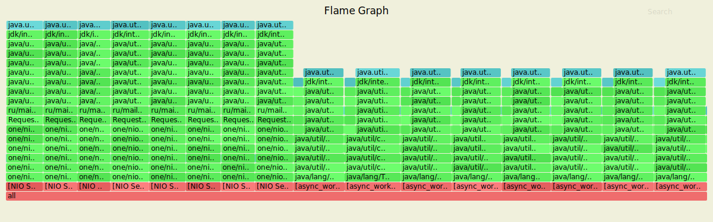
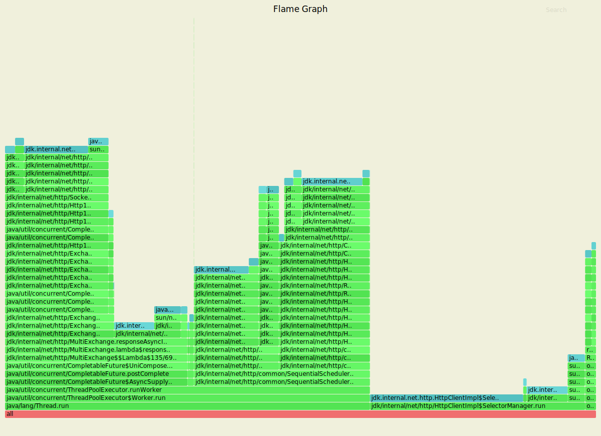

### PUT

Параметры запуска:
<ol>
<li>4 потока</li>
<li>16 открытых соединений</li>
<li>2 минуты работы</li>
<li>10000 запросов в секунду</li>
</ol>


Каждый из 8 селекторов отрабатывают запросы и занимают около 12% работы процессора. Хендлеры запросов занимают в среднем 75% ресурсов селекторов, работа DAO - 60%. Остальное пространство ядра занимает работа основного потока Java (1%). 


Каждый из 8 селекторов использует в среднем 13% выделяемой памяти.



Локи отсутствуют, поэтому граф пустой.

```
wrk2 -t4 -c16 -d2m -R10000 -s wrk/put.lua --latency http://127.0.0.1:8080
Running 2m test @ http://127.0.0.1:8080
  4 threads and 16 connections
  Thread calibration: mean lat.: 1.198ms, rate sampling interval: 10ms
  Thread calibration: mean lat.: 1.198ms, rate sampling interval: 10ms
  Thread calibration: mean lat.: 1.154ms, rate sampling interval: 10ms
  Thread calibration: mean lat.: 1.204ms, rate sampling interval: 10ms
  Thread Stats   Avg      Stdev     Max   +/- Stdev
    Latency     1.13ms  627.45us  22.30ms   76.14%
    Req/Sec     2.64k   205.88     7.40k    75.82%
  Latency Distribution (HdrHistogram - Recorded Latency)
 50.000%    1.07ms
 75.000%    1.47ms
 90.000%    1.83ms
 99.000%    2.41ms
 99.900%    7.41ms
 99.990%   14.76ms
 99.999%   20.86ms
100.000%   22.32ms

#[Mean    =        1.130, StdDeviation   =        0.627]
#[Max     =       22.304, Total count    =      1099792]
#[Buckets =           27, SubBuckets     =         2048]
----------------------------------------------------------
  1199912 requests in 2.00m, 76.67MB read
Requests/sec:   9999.37
Transfer/sec:    654.26KB
```

Итоги:
<ol>
<li>обработано 1199912 запросов</li>
<li>прочитано 76.67MB данных</li>
<li>сервер держит заданную нагрузку на уровне 9999.37 запросов в секунду</li>
</ol>

### GET

Параметры запуска:
<ol>
<li>4 потока</li>
<li>16 открытых соединений</li>
<li>2 минуты работы</li>
<li>10000 запросов в секунду</li>
</ol>


Каждый из 8 селекторов отрабатывают запросы и занимают около 12% работы процессора. Хендлеры запросов занимают в среднем 65% ресурсов селекторов, работа DAO - 50%. Остальное пространство ядра занимает работа основного потока Java (1.5%).


Каждый из 8 селекторов использует около 12% выделяемой памяти.



Локи отсутствуют, поэтому граф пустой.

```
wrk2 -t4 -c16 -d2m -R10000 -s wrk/get.lua --latency http://127.0.0.1:8080
Running 2m test @ http://127.0.0.1:8080
  4 threads and 16 connections
  Thread calibration: mean lat.: 1.049ms, rate sampling interval: 10ms
  Thread calibration: mean lat.: 1.076ms, rate sampling interval: 10ms
  Thread calibration: mean lat.: 1.030ms, rate sampling interval: 10ms
  Thread calibration: mean lat.: 1.053ms, rate sampling interval: 10ms
  Thread Stats   Avg      Stdev     Max   +/- Stdev
    Latency     1.06ms  534.61us  20.34ms   67.94%
    Req/Sec     2.63k   190.00     5.44k    76.59%
  Latency Distribution (HdrHistogram - Recorded Latency)
 50.000%    0.99ms
 75.000%    1.42ms
 90.000%    1.75ms
 99.000%    2.15ms
 99.900%    4.00ms
 99.990%   10.57ms
 99.999%   17.58ms
100.000%   20.35ms

#[Mean    =        1.057, StdDeviation   =        0.535]
#[Max     =       20.336, Total count    =      1099787]
#[Buckets =           27, SubBuckets     =         2048]
----------------------------------------------------------
  1199913 requests in 2.00m, 77.39MB read
Requests/sec:   9999.36
Transfer/sec:    660.40KB

```

Итоги:
<ol>
<li>обработано 1199913 запросов</li>
<li>прочитано 77.39MB данных</li>
<li>сервер выдерживает заданную нагрузку на уровне 9999.36 запросов в секунду</li>
</ol>