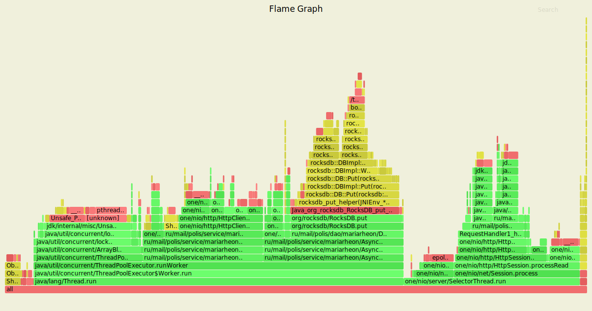
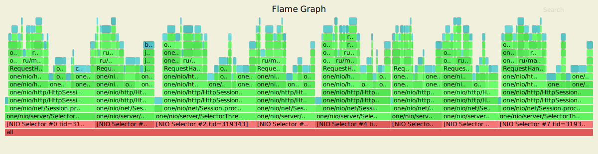
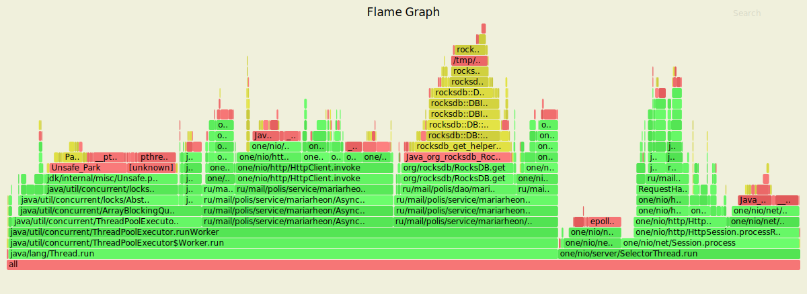
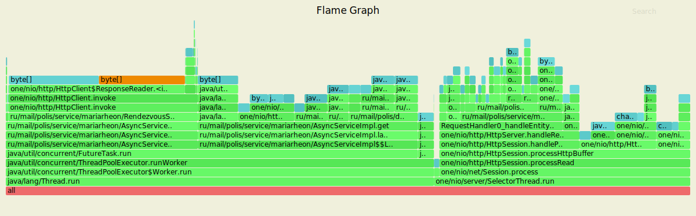
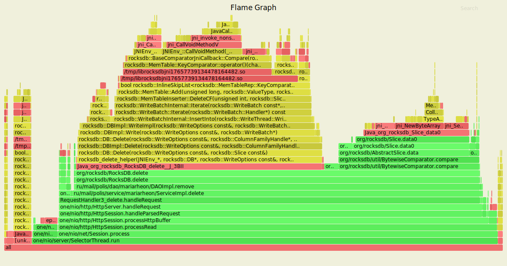
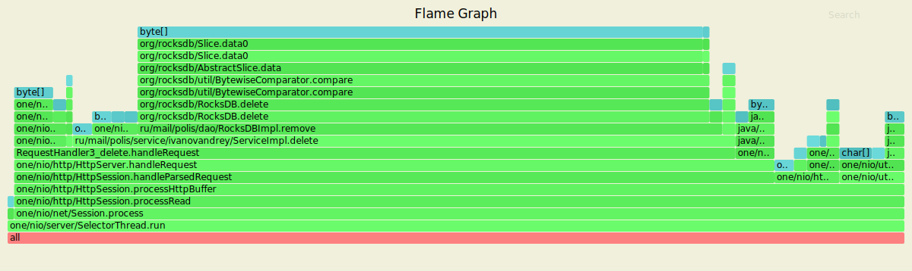

### PUT



Выводы:
<ol>
<li>Добавление записей происходит в пустое хранилище</li>
<li>Handler сервиса потребляет 75% ресурсов процессора</li>
<li>Работа DAO потребляет 53% ресурсов процессора</li>
<li>Присутствуют системные вызовы - взаимодействие с RocksDB</li>
</ol>


Выводы:
<ol>
<li>Работа DAO занимает 36.7% памяти</li>
<li>Парсинга запроса занимает 18% памяти</li>
</ol>

``` wrk2 -t1 -c1 -d50s -s wrk/put.lua -R5000 --latency http://127.0.0.1:8080
Running 50s test @ http://127.0.0.1:8080
  1 threads and 1 connections
  Thread calibration: mean lat.: 7.578ms, rate sampling interval: 42ms
  Thread Stats   Avg      Stdev     Max   +/- Stdev
    Latency     5.85ms    7.03ms  51.01ms   86.44%
    Req/Sec     5.06k   819.29     9.44k    74.16%
  Latency Distribution (HdrHistogram - Recorded Latency)
 50.000%    2.97ms
 75.000%    8.10ms
 90.000%   15.25ms
 99.000%   31.90ms
 99.900%   46.43ms
 99.990%   50.49ms
 99.999%   51.04ms
100.000%   51.04ms  </code>

  Detailed Percentile spectrum:
       Value   Percentile   TotalCount 1/(1-Percentile)

       0.034     0.000000            1         1.00
       0.559     0.100000        20016         1.11
       0.936     0.200000        40024         1.25
       1.242     0.300000        60008         1.43
       1.905     0.400000        80010         1.67
       2.967     0.500000       100006         2.00
       3.653     0.550000       110003         2.22
       4.503     0.600000       119999         2.50
       5.463     0.650000       130040         2.86
       6.667     0.700000       140004         3.33
       8.095     0.750000       150004         4.00
       8.935     0.775000       155037         4.44
       9.863     0.800000       160021         5.00
      10.951     0.825000       165014         5.71
      12.119     0.850000       170016         6.67
      13.487     0.875000       175012         8.00
      14.311     0.887500       177520         8.89
      15.247     0.900000       180012        10.00
      16.399     0.912500       182519        11.43
      17.727     0.925000       185016        13.33
      19.327     0.937500       187500        16.00
      20.207     0.943750       188766        17.78
      21.055     0.950000       190001        20.00
      22.031     0.956250       191254        22.86
      23.135     0.962500       192501        26.67
      24.191     0.968750       193757        32.00
      24.815     0.971875       194375        35.56
      25.695     0.975000       195001        40.00
      26.527     0.978125       195630        45.71
      27.599     0.981250       196255        53.33
      28.799     0.984375       196878        64.00
      29.663     0.985938       197187        71.11
      30.511     0.987500       197503        80.00
      31.391     0.989062       197819        91.43
      32.415     0.990625       198126       106.67
      33.823     0.992188       198439       128.00
      34.431     0.992969       198595       142.22
      35.135     0.993750       198754       160.00
      35.935     0.994531       198906       182.86
      36.639     0.995313       199066       213.33
      37.535     0.996094       199217       256.00
      38.207     0.996484       199297       284.44
      39.231     0.996875       199374       320.00
      39.935     0.997266       199452       365.71
      40.575     0.997656       199530       426.67
      41.279     0.998047       199610       512.00
      41.983     0.998242       199648       568.89
      42.687     0.998437       199687       640.00
      43.039     0.998633       199725       731.43
      45.087     0.998828       199764       853.33
      46.559     0.999023       199803      1024.00
      47.423     0.999121       199823      1137.78
      47.967     0.999219       199842      1280.00
      48.351     0.999316       199862      1462.86
      48.703     0.999414       199881      1706.67
      49.055     0.999512       199901      2048.00
      49.343     0.999561       199912      2275.56
      49.503     0.999609       199920      2560.00
      49.663     0.999658       199930      2925.71
      49.855     0.999707       199940      3413.33
      50.015     0.999756       199951      4096.00
      50.111     0.999780       199955      4551.11
      50.143     0.999805       199959      5120.00
      50.335     0.999829       199964      5851.43
      50.399     0.999854       199970      6826.67
      50.463     0.999878       199977      8192.00
      50.463     0.999890       199977      9102.22
      50.495     0.999902       199979     10240.00
      50.527     0.999915       199981     11702.86
      50.591     0.999927       199984     13653.33
      50.655     0.999939       199986     16384.00
      50.719     0.999945       199989     18204.44
      50.719     0.999951       199989     20480.00
      50.751     0.999957       199990     23405.71
      50.815     0.999963       199991     27306.67
      50.879     0.999969       199993     32768.00
      50.879     0.999973       199993     36408.89
      50.943     0.999976       199994     40960.00
      50.943     0.999979       199994     46811.43
      51.007     0.999982       199995     54613.33
      51.007     0.999985       199995     65536.00
      51.039     0.999986       199998     72817.78
      51.039     1.000000       199998          inf
[Mean    =        5.847, StdDeviation   =        7.030]
[Max     =       51.008, Total count    =       199998]
[Buckets =           27, SubBuckets     =         2048]
----------------------------------------------------------
  249993 requests in 50.00s, 15.97MB read
Requests/sec:   4999.92
Transfer/sec:    327.14KB
```

### GET



Выводы:
<ol>
<li>Чтение записей из полного хранилища</li>
<li>Handler сервиса потребляет 91% ресурсов процессора</li>
<li>Работа DAO потребляет 88% ресурсов процессора</li>
<li>Компаратор RocksDB потребляет 27% ресурсов процессора</li>
<li>Присутствуют системные вызовы - взаимодействие с RocksDB</li>
</ol>


Выводы:
<ol>
<li>Работа DAO занимает 78% памяти</li>
<li>Парсинга запроса занимает 8% памяти</li>
</ol>


```
wrk2 -t1 -c1 -d50s -s wrk/get.lua -R5000 --latency http://127.0.0.1:8080
Running 50s test @ http://127.0.0.1:8080
  1 threads and 1 connections
  Thread calibration: mean lat.: 30.468ms, rate sampling interval: 184ms
  Thread Stats   Avg      Stdev     Max   +/- Stdev
    Latency    37.47ms   47.48ms 257.54ms   86.16%
    Req/Sec     5.02k     1.57k   11.60k    68.66%
  Latency Distribution (HdrHistogram - Recorded Latency)
 50.000%   18.88ms
 75.000%   51.39ms
 90.000%  105.47ms
 99.000%  212.10ms
 99.900%  250.88ms
 99.990%  257.41ms
 99.999%  257.66ms
100.000%  257.66ms  </code>

  Detailed Percentile spectrum:
       Value   Percentile   TotalCount 1/(1-Percentile)

       0.035     0.000000            1         1.00
       0.993     0.100000        20045         1.11
       2.028     0.200000        40028         1.25
       5.963     0.300000        60039         1.43
      11.895     0.400000        80051         1.67
      18.879     0.500000       100066         2.00
      23.247     0.550000       110061         2.22
      28.479     0.600000       120084         2.50
      34.335     0.650000       130110         2.86
      41.983     0.700000       140083         3.33
      51.391     0.750000       150090         4.00
      56.927     0.775000       155087         4.44
      63.903     0.800000       160090         5.00
      71.551     0.825000       165122         5.71
      80.767     0.850000       170095         6.67
      90.687     0.875000       175112         8.00
      97.599     0.887500       177622         8.89
     105.471     0.900000       180098        10.00
     113.279     0.912500       182613        11.43
     122.239     0.925000       185117        13.33
     131.839     0.937500       187623        16.00
     138.239     0.943750       188863        17.78
     143.743     0.950000       190125        20.00
     149.759     0.956250       191391        22.86
     157.567     0.962500       192616        26.67
     167.679     0.968750       193865        32.00
     173.311     0.971875       194489        35.56
     180.479     0.975000       195112        40.00
     184.959     0.978125       195730        45.71
     191.487     0.981250       196363        53.33
     197.247     0.984375       196982        64.00
     201.343     0.985938       197298        71.11
     205.439     0.987500       197609        80.00
     209.791     0.989062       197924        91.43
     214.271     0.990625       198235       106.67
     217.727     0.992188       198548       128.00
     219.903     0.992969       198703       142.22
     223.103     0.993750       198857       160.00
     225.535     0.994531       199013       182.86
     229.503     0.995313       199173       213.33
     232.959     0.996094       199331       256.00
     234.495     0.996484       199406       284.44
     236.415     0.996875       199487       320.00
     238.079     0.997266       199560       365.71
     239.103     0.997656       199642       426.67
     240.767     0.998047       199717       512.00
     241.535     0.998242       199759       568.89
     244.095     0.998437       199796       640.00
     246.655     0.998633       199835       731.43
     249.215     0.998828       199875       853.33
     251.007     0.999023       199913      1024.00
     251.775     0.999121       199933      1137.78
     252.927     0.999219       199952      1280.00
     253.823     0.999316       199975      1462.86
     254.463     0.999414       199990      1706.67
     255.487     0.999512       200010      2048.00
     255.871     0.999561       200024      2275.56
     255.999     0.999609       200030      2560.00
     256.255     0.999658       200043      2925.71
     256.383     0.999707       200050      3413.33
     256.767     0.999756       200062      4096.00
     256.895     0.999780       200066      4551.11
     257.023     0.999805       200071      5120.00
     257.151     0.999829       200078      5851.43
     257.151     0.999854       200078      6826.67
     257.279     0.999878       200083      8192.00
     257.407     0.999890       200091      9102.22
     257.407     0.999902       200091     10240.00
     257.407     0.999915       200091     11702.86
     257.535     0.999927       200099     13653.33
     257.535     0.999939       200099     16384.00
     257.535     0.999945       200099     18204.44
     257.535     0.999951       200099     20480.00
     257.535     0.999957       200099     23405.71
     257.663     0.999963       200107     27306.67
     257.663     1.000000       200107          inf
[Mean    =       37.467, StdDeviation   =       47.477]
[Max     =      257.536, Total count    =       200107]
[Buckets =           27, SubBuckets     =         2048]
----------------------------------------------------------
  249901 requests in 50.00s, 16.10MB read
Requests/sec:   4998.02
Transfer/sec:    329.73KB
```

### DELETE



Выводы:
<ol>
<li>Удаление записей из полного хранилища</li>
<li>Handler сервиса потребляет 84% ресурсов процессора</li>
<li>Работа DAO потребляет 82% ресурсов процессора</li>
<li>Компаратор RocksDB потребляет 28% ресурсов процессора</li>
<li>Присутствуют системные вызовы - взаимодействие с RocksDB</li>
</ol>


Выводы:
<ol>
<li>Работа DAO занимает 91% памяти</li>
<li>Парсинга запроса занимает 4% памяти</li>
</ol>

```
wrk2 -t1 -c1 -d50s -s wrk/delete.lua -R5000 --latency http://127.0.0.1:8080
Running 50s test @ http://127.0.0.1:8080
  1 threads and 1 connections
  Thread calibration: mean lat.: 26.921ms, rate sampling interval: 142ms
  Thread Stats   Avg      Stdev     Max   +/- Stdev
    Latency    27.95ms   36.96ms 308.74ms   88.02%
    Req/Sec     5.02k     1.41k   14.26k    73.67%
  Latency Distribution (HdrHistogram - Recorded Latency)
 50.000%   15.14ms
 75.000%   39.33ms
 90.000%   71.87ms
 99.000%  161.92ms
 99.900%  297.73ms
 99.990%  308.48ms
 99.999%  308.73ms
100.000%  308.99ms

  Detailed Percentile spectrum:
       Value   Percentile   TotalCount 1/(1-Percentile)

       0.046     0.000000            1         1.00
       0.846     0.100000        20025         1.11
       1.523     0.200000        40031         1.25
       3.945     0.300000        60034         1.43
       9.199     0.400000        80046         1.67
      15.143     0.500000       100041         2.00
      18.639     0.550000       110083         2.22
      22.479     0.600000       120090         2.50
      27.007     0.650000       130057         2.86
      32.671     0.700000       140055         3.33
      39.327     0.750000       150073         4.00
      43.359     0.775000       155057         4.44
      47.807     0.800000       160066         5.00
      52.543     0.825000       165074         5.71
      57.503     0.850000       170078         6.67
      63.455     0.875000       175072         8.00
      67.519     0.887500       177586         8.89
      71.871     0.900000       180095        10.00
      76.543     0.912500       182587        11.43
      82.303     0.925000       185070        13.33
      89.599     0.937500       187578        16.00
      93.759     0.943750       188820        17.78
      99.007     0.950000       190070        20.00
     104.319     0.956250       191330        22.86
     109.951     0.962500       192585        26.67
     114.879     0.968750       193825        32.00
     117.183     0.971875       194463        35.56
     119.871     0.975000       195081        40.00
     123.775     0.978125       195698        45.71
     129.407     0.981250       196321        53.33
     137.983     0.984375       196952        64.00
     142.847     0.985938       197262        71.11
     146.431     0.987500       197580        80.00
     150.143     0.989062       197886        91.43
     172.415     0.990625       198197       106.67
     197.503     0.992188       198510       128.00
     210.175     0.992969       198666       142.22
     223.231     0.993750       198822       160.00
     232.447     0.994531       198981       182.86
     244.223     0.995313       199137       213.33
     255.743     0.996094       199291       256.00
     261.759     0.996484       199370       284.44
     267.519     0.996875       199447       320.00
     273.663     0.997266       199527       365.71
     279.807     0.997656       199605       426.67
     285.439     0.998047       199684       512.00
     288.511     0.998242       199721       568.89
     290.815     0.998437       199761       640.00
     293.375     0.998633       199799       731.43
     296.191     0.998828       199844       853.33
     298.239     0.999023       199879      1024.00
     299.775     0.999121       199898      1137.78
     301.311     0.999219       199916      1280.00
     303.103     0.999316       199939      1462.86
     304.127     0.999414       199956      1706.67
     305.407     0.999512       199978      2048.00
     305.663     0.999561       199986      2275.56
     306.175     0.999609       199998      2560.00
     306.431     0.999658       200005      2925.71
     306.943     0.999707       200018      3413.33
     307.199     0.999756       200024      4096.00
     307.455     0.999780       200030      4551.11
     307.711     0.999805       200036      5120.00
     307.967     0.999829       200043      5851.43
     307.967     0.999854       200043      6826.67
     308.479     0.999878       200052      8192.00
     308.479     0.999890       200052      9102.22
     308.735     0.999902       200070     10240.00
     308.735     0.999915       200070     11702.86
     308.735     0.999927       200070     13653.33
     308.735     0.999939       200070     16384.00
     308.735     0.999945       200070     18204.44
     308.735     0.999951       200070     20480.00
     308.735     0.999957       200070     23405.71
     308.735     0.999963       200070     27306.67
     308.735     0.999969       200070     32768.00
     308.735     0.999973       200070     36408.89
     308.735     0.999976       200070     40960.00
     308.735     0.999979       200070     46811.43
     308.735     0.999982       200070     54613.33
     308.735     0.999985       200070     65536.00
     308.735     0.999986       200070     72817.78
     308.735     0.999988       200070     81920.00
     308.735     0.999989       200070     93622.86
     308.991     0.999991       200072    109226.67
     308.991     1.000000       200072          inf
[Mean    =       27.950, StdDeviation   =       36.956]
[Max     =      308.736, Total count    =       200072]
[Buckets =           27, SubBuckets     =         2048]
----------------------------------------------------------
  249966 requests in 50.00s, 16.21MB read
Requests/sec:   4999.33
Transfer/sec:    331.99KB
```
