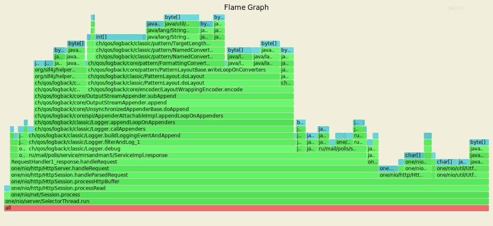
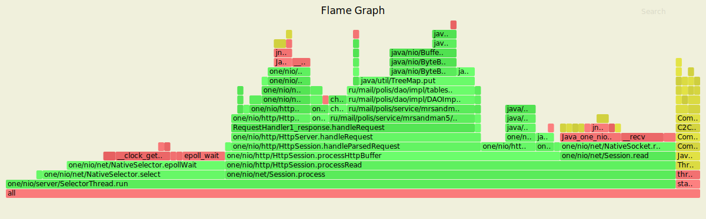
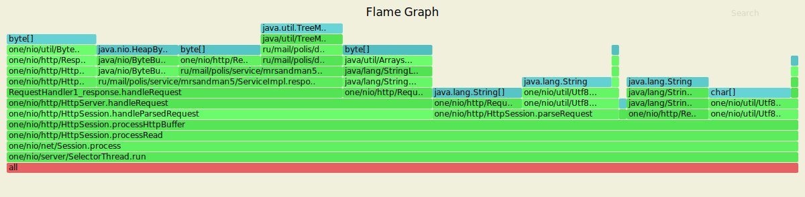
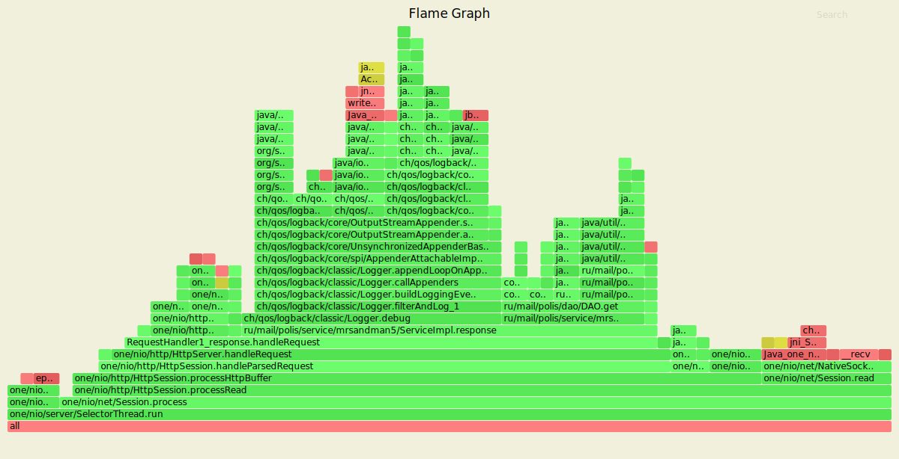
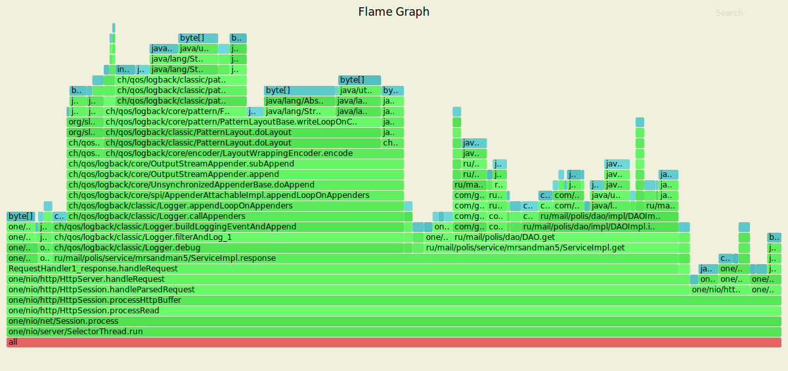
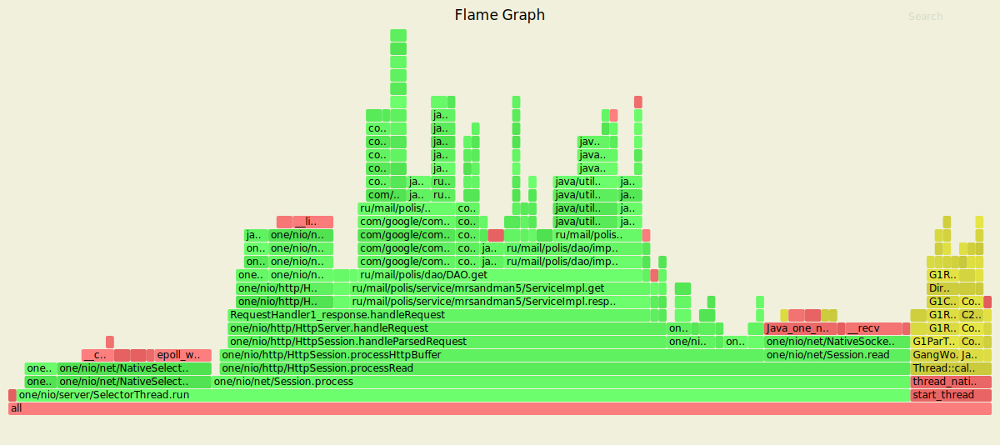
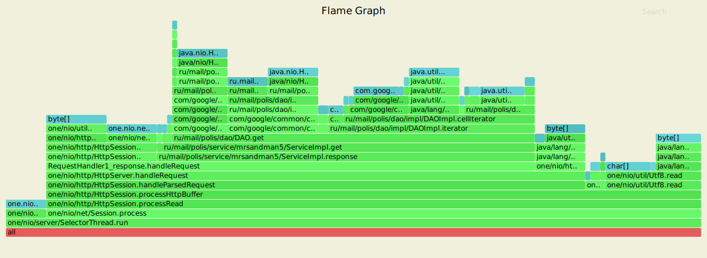
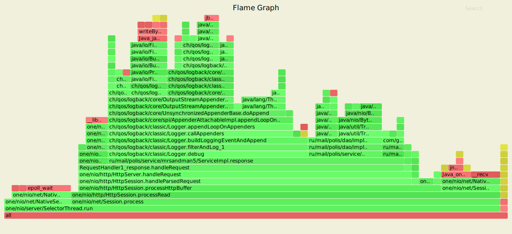
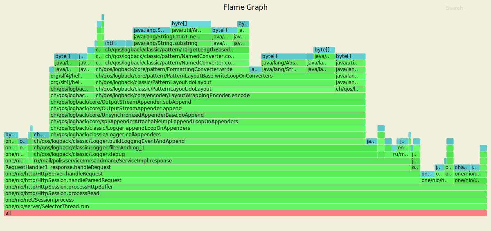

## Requests

### PUT


Выводы:
<ol>
<li>Добавление записей происходит в пустое хранилище</li>
<li>Обработка HTTP-сессии потребляет 83.45% ресурсов процессора</li>
<li>Логирование потребляет 40.29% ресурсов процессора</li>
<li>Работа DAO потребляет 12.23% ресурсов процессора</li>
<li>Работа Java-потока потребляет 7.19% ресурсов процессора</li>
</ol>



Выводы:
<ol>
<li>Логирование занимает 55.28% памяти</li>
<li>Работа сервиса и DAO занимает 10% памяти</li>
</ol>

Результаты при смене режима логирования с DEBUG на INFO





```
[mrsandman5@simon-gl552vx 2020-highload-dht]$ wrk2 -t1 -c1 -d2m -R2000 -s wrk/put.lua --latency http://127.0.0.1:8080
Running 2m test @ http://127.0.0.1:8080
  1 threads and 1 connections
  Thread calibration: mean lat.: 1.141ms, rate sampling interval: 10ms
  Thread Stats   Avg      Stdev     Max   +/- Stdev
    Latency     1.07ms  633.34us  26.67ms   76.62%
    Req/Sec     2.11k   196.64     7.11k    67.31%
  Latency Distribution (HdrHistogram - Recorded Latency)
 50.000%    1.05ms
 75.000%    1.39ms
 90.000%    1.76ms
 99.000%    2.13ms
 99.900%    5.67ms
 99.990%   19.20ms
 99.999%   26.00ms
100.000%   26.69ms

#[Mean    =        1.074, StdDeviation   =        0.633]
#[Max     =       26.672, Total count    =       219988]
#[Buckets =           27, SubBuckets     =         2048]
----------------------------------------------------------
  239997 requests in 2.00m, 15.33MB read
Requests/sec:   1999.98
Transfer/sec:    130.86KB
```

### GET



Выводы:
<ol>
<li>Чтение записей из полного хранилища</li>
<li>Handler сервиса потребляет 60% ресурсов процессора</li>
<li>Логирование потребляет 29.41% ресурсов процессора</li>
<li>Работа DAO потребляет 16.18% ресурсов процессора</li>
</ol>



Выводы:
<ol>
<li>Логирование занимает 45.39% памяти</li>
<li>Работа сервиса и DAO занимает 32.84% памяти</li>
</ol>

Результаты при смене режима логирования с DEBUG на INFO





```
[mrsandman5@simon-gl552vx 2020-highload-dht]$ wrk2 -t1 -c1 -d2m -R2000 -s wrk/get.lua --latency http://127.0.0.1:8080
Running 2m test @ http://127.0.0.1:8080
  1 threads and 1 connections
  Thread calibration: mean lat.: 1.183ms, rate sampling interval: 10ms
  Thread Stats   Avg      Stdev     Max   +/- Stdev
    Latency     1.06ms  494.43us  12.65ms   64.56%
    Req/Sec     2.11k   173.92     3.30k    65.34%
  Latency Distribution (HdrHistogram - Recorded Latency)
 50.000%    1.05ms
 75.000%    1.38ms
 90.000%    1.75ms
 99.000%    2.12ms
 99.900%    2.32ms
 99.990%    5.16ms
 99.999%   11.95ms
100.000%   12.65ms

#[Mean    =        1.061, StdDeviation   =        0.494]
#[Max     =       12.648, Total count    =       219989]
#[Buckets =           27, SubBuckets     =         2048]
----------------------------------------------------------
  239998 requests in 2.00m, 15.46MB read
  Non-2xx or 3xx responses: 1
Requests/sec:   1999.99
Transfer/sec:    131.91KB
```

### DELETE





```
[mrsandman5@simon-gl552vx 2020-highload-dht]$ wrk2 -t1 -c1 -d2m -R2000 -s wrk/delete.lua --latency http://127.0.0.1:8080
Running 2m test @ http://127.0.0.1:8080
  1 threads and 1 connections
  Thread calibration: mean lat.: 1.009ms, rate sampling interval: 10ms
  Thread Stats   Avg      Stdev     Max   +/- Stdev
    Latency     1.78ms    6.10ms 129.41ms   97.77%
    Req/Sec     2.11k   623.41    16.00k    96.73%
  Latency Distribution (HdrHistogram - Recorded Latency)
 50.000%    1.02ms
 75.000%    1.42ms
 90.000%    1.75ms
 99.000%   29.84ms
 99.900%   86.46ms
 99.990%  120.32ms
 99.999%  128.77ms
100.000%  129.47ms

#[Mean    =        1.776, StdDeviation   =        6.102]
#[Max     =      129.408, Total count    =       219989]
#[Buckets =           27, SubBuckets     =         2048]
----------------------------------------------------------
  239997 requests in 2.00m, 15.56MB read
Requests/sec:   1999.97
Transfer/sec:    132.81KB

```