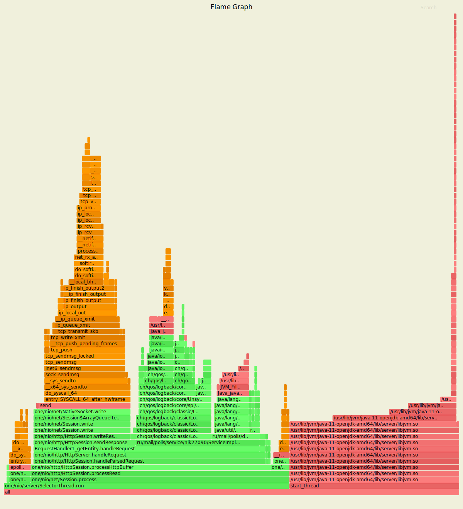
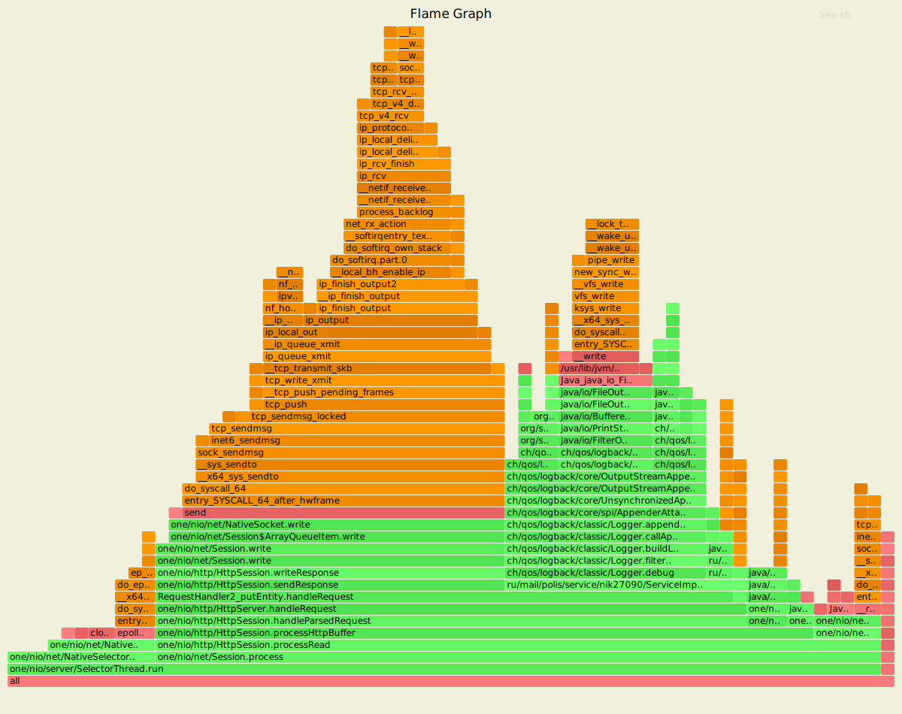
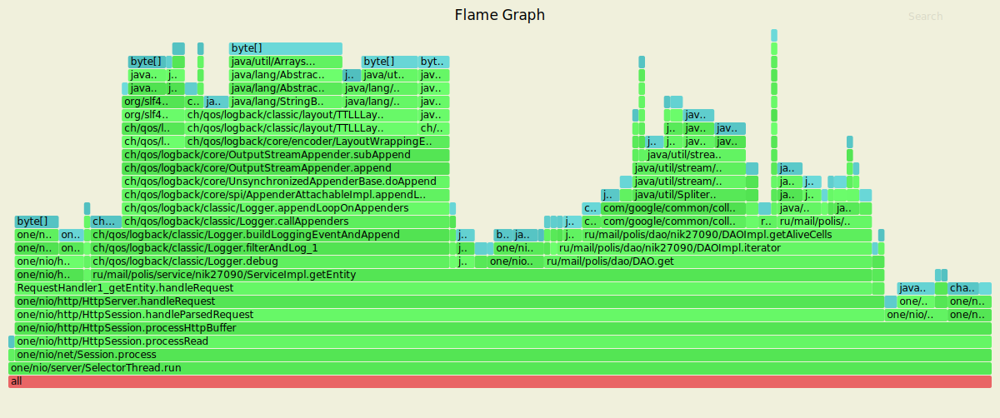
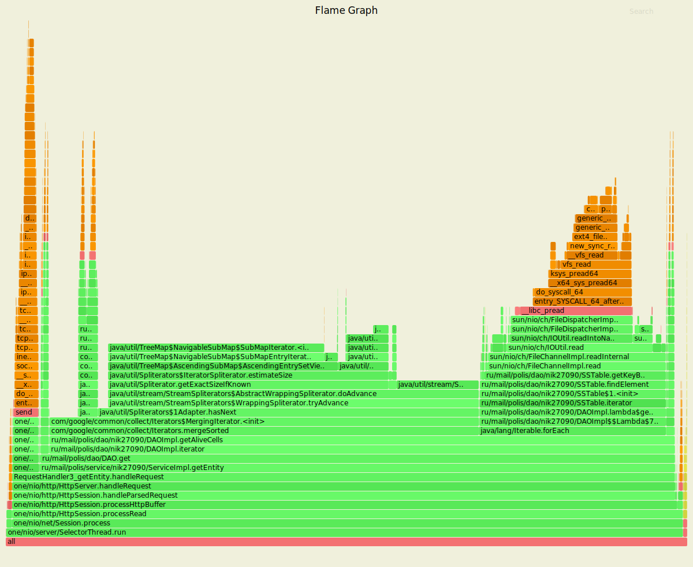
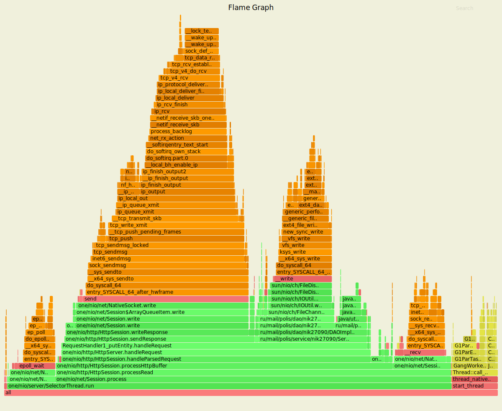
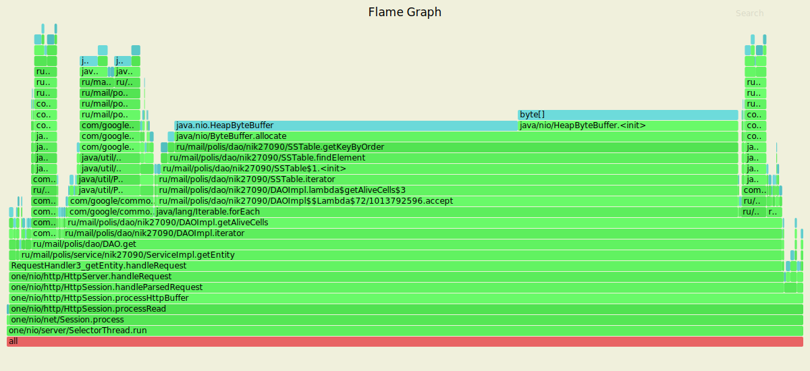
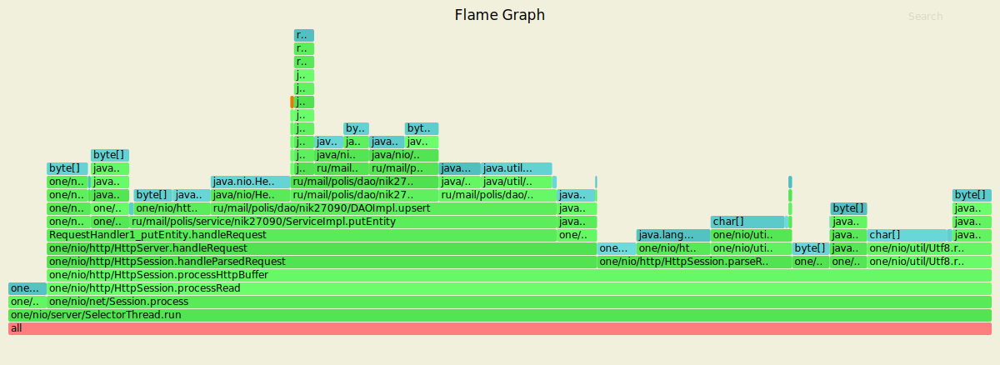

#V1

##CPU GET

На графике видно:
1) Старт треда селектора начинается параллельно со стартом JIT процесса, который потребляет треть всех ресурсов, потому что процесс еще не оптмимизирован.
2) Дебаг логирование потребляет 17% ресурсов.
3) Логика DAO потребляет всего 10%, но некторые все таки находят свое value. Слишком поздно запустил тетирование, инкремент ключа сильно вырос и большая часть ключей по запросам не найдена.
4) Так же видно системные вызовы.

##CPU PUT

На графике видно:
1) JIT процесс потребляет всего 1.5%, процесс успел достаточно оптимизироваться.
2) Логгер снова жрет аж 23%.
3) Логика DAO всего лишь 3%, так мало скорей всего из-за того, что на сервер было отправлено недостаточное количество данных для флеша на диск, в этом случае потребление выростит в разы.
4) Появили процессы обработки реквеста и реквест боди.
4) Так же видно системные вызовы.

##ALLOC GET
Учитывая заммечания в CPU тесте просто опишу куда уходит большая часть ресурсов. 
1) DAO 5%, видимо совсем мало обстреливал.
2) Дебагг 51%
3) Чтение из сокета 11%
4) остальное получение хедеров, парсинг реквеста, иницилизация респонсна и его отправка.

##ALLOC PUT
Учитывая заммечания в CPU тесте просто опишу куда уходит большая часть ресурсов. 
1) DAO 33%
2) Логгер 37%
3) Остальное парсинг реквеста, иницилизирование респонса, жонглирование байт буфферами.

#UPDATE!

#V2

##CPU GET

1) Процесс прогрет
2) Не тратим цпу на логгирование
3) Перед профилированием сторач наполнен

##CPU PUT

1) Появился флаш

##ALLOC GET

##ALLOC PUT

#Результаты wkr2: 

##GET

    wrk -t1 -c1 -d5m -R2000 --latency -s wrk2/getScript.lua http://127.0.0.1:8080
    Running 5m test @ http://127.0.0.1:8080
      1 threads and 1 connections
      Thread calibration: mean lat.: 7.678ms, rate sampling interval: 42ms
      Thread Stats   Avg      Stdev     Max   +/- Stdev
        Latency   133.54ms  294.69ms   1.21s    86.04%
        Req/Sec     2.01k   473.12     4.80k    74.63%
      Latency Distribution (HdrHistogram - Recorded Latency)
     50.000%    3.32ms
     75.000%   20.37ms
     90.000%  694.78ms
     99.000%    1.07s 
     99.900%    1.19s 
     99.990%    1.21s 
     99.999%    1.21s 
    100.000%    1.21s
    #[Mean    =      133.544, StdDeviation   =      294.695]
    #[Max     =     1212.416, Total count    =       322016]
    #[Buckets =           27, SubBuckets     =         2048]
    ----------------------------------------------------------
      342024 requests in 2.87m, 24.02MB read
    Requests/sec:   1988.42
    Transfer/sec:    143.01KB 

##PUT

    wrk -t1 -c1 -d5m -R2000 --latency -s wrk2/putScript.lua http://127.0.0.1:8080
    Running 5m test @ http://127.0.0.1:8080
    1 threads and 1 connections
    Thread calibration: mean lat.: 1.003ms, rate sampling interval: 10ms
    Thread Stats   Avg      Stdev     Max   +/- Stdev
    Latency     8.86ms   79.34ms   1.26s    98.79%
    Req/Sec     2.11k     1.11k   61.11k    98.58%
    Latency Distribution (HdrHistogram - Recorded Latency)
    50.000%    0.98ms
    75.000%    1.34ms
     90.000%    1.68ms
     99.000%  282.11ms
     99.900%    1.11s 
     99.990%    1.24s 
     99.999%    1.26s 
    100.000%    1.26s
    #[Mean    =      133.544, StdDeviation   =      294.695]
    #[Max     =     1212.416, Total count    =       322016]
    #[Buckets =           27, SubBuckets     =         2048]
    ----------------------------------------------------------
      342024 requests in 2.87m, 24.02MB read
    Requests/sec:   1988.42
    Transfer/sec:    143.01KB