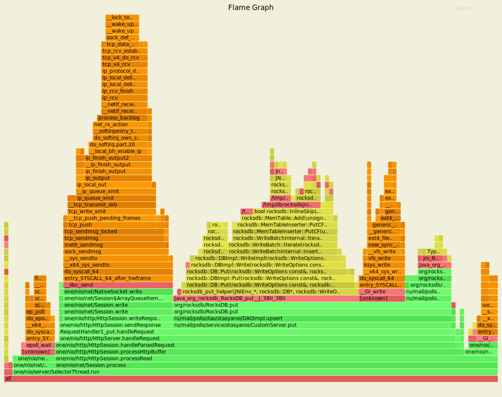
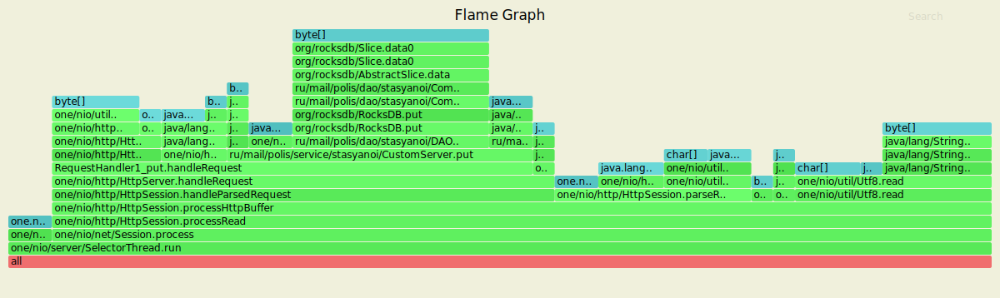
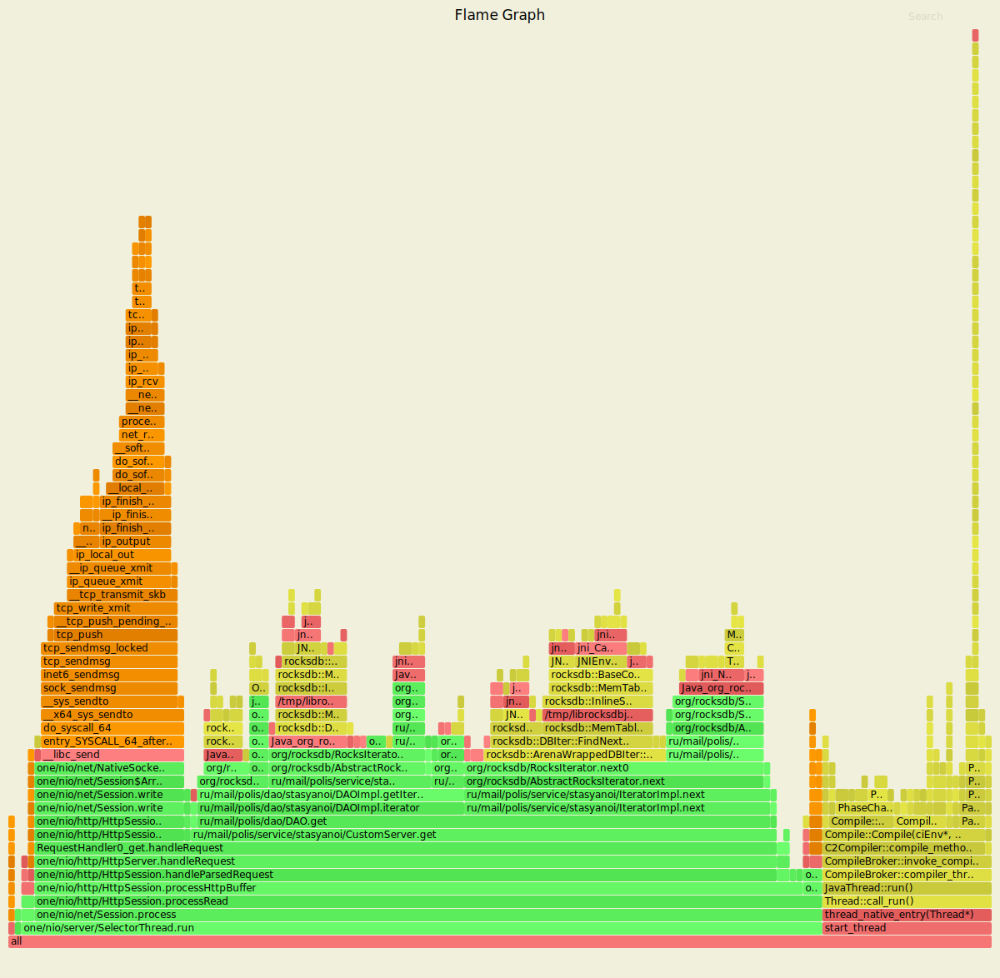
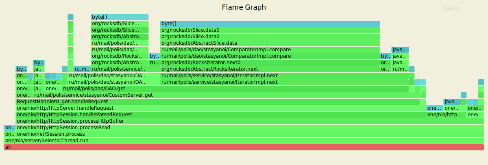

В рамках использования утилиты wrk2|profiler сервер имеет следующие показатели для put.
---------------------------------------------------------------------------------------
1) Команды 

rm wrkLogsPut.txt

./wrk2/wrk -t1 -c1 -d15s -R2000 -s ./wrk2/scripts/put.lua --u_latency http://localhost:8080/v0/entity?id=100 > wrkLogsPut.txt &

rm flamePutCpu.svg 

rm flamePutAlloc.svg 

./async-profiler-1.8.1-linux-x64/profiler.sh -d 5 -e cpu -f flamePutCpu.svg $(lsof -t -i :8080 -s TCP:LISTEN)

./async-profiler-1.8.1-linux-x64/profiler.sh -d 5 -e alloc -f flamePutAlloc.svg $(lsof -t -i :8080 -s TCP:LISTEN)

----------------------------------------------------------------------------------------

1) Логи

Running 15s test @ http://localhost:8080/v0/entity?id=100

  1 threads and 1 connections

  Thread calibration: mean lat.: 1.095ms, rate sampling interval: 10ms

  Thread Stats   Avg      Stdev     Max   +/- Stdev

    Latency     1.10ms  499.29us   2.63ms   62.28%

    Req/Sec     2.10k   172.87     2.67k    65.59%

  Latency Distribution (HdrHistogram - Recorded Latency)

 50.000%    1.09ms

 75.000%    1.47ms

 90.000%    1.80ms

 99.000%    2.11ms

 99.900%    2.23ms

 99.990%    2.35ms

 99.999%    2.63ms

100.000%    2.63ms

  Detailed Percentile spectrum:

       Value   Percentile   TotalCount 1/(1-Percentile)

       0.071     0.000000            1         1.00
       0.408     0.100000         1003         1.11
       0.631     0.200000         2007         1.25
       0.823     0.300000         3002         1.43
       0.972     0.400000         4002         1.67
       1.093     0.500000         5001         2.00
       1.154     0.550000         5499         2.22
       1.217     0.600000         5998         2.50
       1.280     0.650000         6505         2.86
       1.360     0.700000         6995         3.33
       1.469     0.750000         7494         4.00
       1.519     0.775000         7745         4.44
       1.575     0.800000         7995         5.00
       1.637     0.825000         8246         5.71
       1.693     0.850000         8495         6.67
       1.747     0.875000         8744         8.00
       1.776     0.887500         8871         8.89
       1.804     0.900000         8995        10.00
       1.835     0.912500         9122        11.43
       1.867     0.925000         9246        13.33
       1.902     0.937500         9373        16.00
       1.919     0.943750         9437        17.78
       1.934     0.950000         9494        20.00
       1.953     0.956250         9555        22.86
       1.980     0.962500         9618        26.67
       2.009     0.968750         9683        32.00
       2.021     0.971875         9711        35.56
       2.033     0.975000         9744        40.00
       2.045     0.978125         9774        45.71
       2.063     0.981250         9810        53.33
       2.077     0.984375         9839        64.00
       2.089     0.985938         9857        71.11
       2.097     0.987500         9870        80.00
       2.105     0.989062         9883        91.43
       2.117     0.990625         9901       106.67
       2.129     0.992188         9915       128.00
       2.135     0.992969         9923       142.22
       2.145     0.993750         9933       160.00
       2.151     0.994531         9939       182.86
       2.161     0.995313         9948       213.33
       2.167     0.996094         9956       256.00
       2.169     0.996484         9957       284.44
       2.175     0.996875         9962       320.00
       2.179     0.997266         9965       365.71
       2.185     0.997656         9969       426.67
       2.195     0.998047         9973       512.00
       2.205     0.998242         9975       568.89
       2.209     0.998437         9977       640.00
       2.225     0.998633         9979       731.43
       2.231     0.998828         9982       853.33
       2.235     0.999023         9983      1024.00
       2.237     0.999121         9984      1137.78
       2.243     0.999219         9985      1280.00
       2.247     0.999316         9986      1462.86
       2.259     0.999414         9987      1706.67
       2.263     0.999512         9988      2048.00
       2.263     0.999561         9988      2275.56
       2.281     0.999609         9989      2560.00
       2.281     0.999658         9989      2925.71
       2.293     0.999707         9990      3413.33
       2.293     0.999756         9990      4096.00
       2.293     0.999780         9990      4551.11
       2.351     0.999805         9991      5120.00
       2.351     0.999829         9991      5851.43
       2.351     0.999854         9991      6826.67
       2.351     0.999878         9991      8192.00
       2.351     0.999890         9991      9102.22
       2.635     0.999902         9992     10240.00
       2.635     1.000000         9992          inf
[Mean    =        1.101, StdDeviation   =        0.499]

[Max     =        2.634, Total count    =         9992]

[Buckets =           27, SubBuckets     =         2048]

----------------------------------------------------------

 Latency Distribution (HdrHistogram - Uncorrected Latency (measured without taking delayed starts into account))

 50.000%  206.00us

 75.000%  242.00us

 90.000%  261.00us

 99.000%  306.00us

 99.900%  381.00us

 99.990%  473.00us

 99.999%    1.39ms

100.000%    1.39ms

  Detailed Percentile spectrum:
       Value   Percentile   TotalCount 1/(1-Percentile)

       0.031     0.000000            1         1.00
       0.110     0.100000         1023         1.11
       0.136     0.200000         2039         1.25
       0.154     0.300000         3038         1.43
       0.181     0.400000         4019         1.67
       0.206     0.500000         5000         2.00
       0.217     0.550000         5512         2.22
       0.226     0.600000         6023         2.50
       0.231     0.650000         6539         2.86
       0.236     0.700000         7098         3.33
       0.242     0.750000         7505         4.00
       0.245     0.775000         7835         4.44
       0.247     0.800000         8046         5.00
       0.249     0.825000         8252         5.71
       0.252     0.850000         8517         6.67
       0.256     0.875000         8761         8.00
       0.259     0.887500         8913         8.89
       0.261     0.900000         9022        10.00
       0.264     0.912500         9135        11.43
       0.267     0.925000         9251        13.33
       0.270     0.937500         9379        16.00
       0.272     0.943750         9461        17.78
       0.273     0.950000         9496        20.00
       0.275     0.956250         9562        22.86
       0.277     0.962500         9624        26.67
       0.280     0.968750         9684        32.00
       0.282     0.971875         9714        35.56
       0.285     0.975000         9746        40.00
       0.289     0.978125         9784        45.71
       0.292     0.981250         9813        53.33
       0.295     0.984375         9836        64.00
       0.299     0.985938         9855        71.11
       0.301     0.987500         9868        80.00
       0.305     0.989062         9886        91.43
       0.308     0.990625         9900       106.67
       0.312     0.992188         9916       128.00
       0.313     0.992969         9922       142.22
       0.317     0.993750         9932       160.00
       0.320     0.994531         9938       182.86
       0.326     0.995313         9947       213.33
       0.329     0.996094         9954       256.00
       0.332     0.996484         9959       284.44
       0.335     0.996875         9961       320.00
       0.343     0.997266         9967       365.71
       0.346     0.997656         9970       426.67
       0.351     0.998047         9973       512.00
       0.355     0.998242         9975       568.89
       0.361     0.998437         9977       640.00
       0.369     0.998633         9979       731.43
       0.378     0.998828         9981       853.33
       0.381     0.999023         9983      1024.00
       0.385     0.999121         9984      1137.78
       0.387     0.999219         9985      1280.00
       0.404     0.999316         9986      1462.86
       0.406     0.999414         9987      1706.67
       0.435     0.999512         9988      2048.00
       0.435     0.999561         9988      2275.56
       0.455     0.999609         9989      2560.00
       0.455     0.999658         9989      2925.71
       0.463     0.999707         9990      3413.33
       0.463     0.999756         9990      4096.00
       0.463     0.999780         9990      4551.11
       0.473     0.999805         9991      5120.00
       0.473     0.999829         9991      5851.43
       0.473     0.999854         9991      6826.67
       0.473     0.999878         9991      8192.00
       0.473     0.999890         9991      9102.22
       1.394     0.999902         9992     10240.00
       1.394     1.000000         9992          inf
[Mean    =        0.194, StdDeviation   =        0.060]

[Max     =        1.394, Total count    =         9992]

[Buckets =           27, SubBuckets     =         2048]

----------------------------------------------------------

30000 requests in 15.00s, 1.92MB read

Requests/sec:   1999.93

Transfer/sec:    130.85KB

----------------------------------------------------------------
CPU put
----------------------------------------------------

------------------------------------------------------
ALLOC put
----------------------------------------------------

----------------------------------------------------------------------------------------
В рамках использования утилиты wrk2|profiler сервер имеет следующие показатели для get.
---------------------------------------------------------------------------------------
1) Команды 

rm wrkLogsGet.txt

./wrk2/wrk -t1 -c1 -d15s -R2000 --u_latency http://localhost:8080/v0/status > wrkLogsGet.txt &

rm flameGetCpu.svg 

rm flameGetAlloc.svg  

./async-profiler-1.8.1-linux-x64/profiler.sh -d 5 -e cpu -f flameGetCpu.svg $(lsof -t -i :8080 -s TCP:LISTEN)

./async-profiler-1.8.1-linux-x64/profiler.sh -d 5 -e alloc -f flameGetAlloc.svg $(lsof -t -i :8080 -s TCP:LISTEN)

----------------------------------------------------------------------------------------------

1) Логи

Running 15s test @ http://localhost:8080/v0/status

  1 threads and 1 connections

  Thread calibration: mean lat.: 1.061ms, rate sampling interval: 10ms

  Thread Stats   Avg      Stdev     Max   +/- Stdev

    Latency     1.07ms  504.23us   2.18ms   61.31%

    Req/Sec     2.12k   160.18     2.67k    68.41%

  Latency Distribution (HdrHistogram - Recorded Latency)

 50.000%    1.06ms

 75.000%    1.45ms

 90.000%    1.77ms

 99.000%    2.04ms

 99.900%    2.12ms

 99.990%    2.17ms

 99.999%    2.18ms

100.000%    2.18ms

  Detailed Percentile spectrum:

       Value   Percentile   TotalCount 1/(1-Percentile)

       0.036     0.000000            1         1.00
       0.360     0.100000         1002         1.11
       0.575     0.200000         2005         1.25
       0.790     0.300000         3001         1.43
       0.943     0.400000         3998         1.67
       1.062     0.500000         4994         2.00
       1.121     0.550000         5494         2.22
       1.185     0.600000         5998         2.50
       1.250     0.650000         6495         2.86
       1.339     0.700000         6995         3.33
       1.447     0.750000         7491         4.00
       1.503     0.775000         7743         4.44
       1.558     0.800000         7999         5.00
       1.612     0.825000         8242         5.71
       1.664     0.850000         8491         6.67
       1.712     0.875000         8740         8.00
       1.739     0.887500         8867         8.89
       1.767     0.900000         8991        10.00
       1.799     0.912500         9115        11.43
       1.837     0.925000         9240        13.33
       1.871     0.937500         9365        16.00
       1.888     0.943750         9429        17.78
       1.903     0.950000         9489        20.00
       1.920     0.956250         9554        22.86
       1.939     0.962500         9614        26.67
       1.957     0.968750         9678        32.00
       1.964     0.971875         9713        35.56
       1.975     0.975000         9739        40.00
       1.986     0.978125         9772        45.71
       1.997     0.981250         9804        53.33
       2.008     0.984375         9833        64.00
       2.019     0.985938         9849        71.11
       2.026     0.987500         9865        80.00
       2.031     0.989062         9879        91.43
       2.040     0.990625         9898       106.67
       2.049     0.992188         9911       128.00
       2.053     0.992969         9919       142.22
       2.059     0.993750         9928       160.00
       2.065     0.994531         9935       182.86
       2.071     0.995313         9945       213.33
       2.075     0.996094         9949       256.00
       2.083     0.996484         9953       284.44
       2.087     0.996875         9959       320.00
       2.091     0.997266         9963       365.71
       2.097     0.997656         9968       426.67
       2.101     0.998047         9971       512.00
       2.101     0.998242         9971       568.89
       2.105     0.998437         9974       640.00
       2.107     0.998633         9975       731.43
       2.109     0.998828         9977       853.33
       2.115     0.999023         9979      1024.00
       2.119     0.999121         9980      1137.78
       2.125     0.999219         9981      1280.00
       2.129     0.999316         9982      1462.86
       2.133     0.999414         9983      1706.67
       2.141     0.999512         9984      2048.00
       2.141     0.999561         9984      2275.56
       2.143     0.999609         9985      2560.00
       2.143     0.999658         9985      2925.71
       2.165     0.999707         9986      3413.33
       2.165     0.999756         9986      4096.00
       2.165     0.999780         9986      4551.11
       2.175     0.999805         9987      5120.00
       2.175     0.999829         9987      5851.43
       2.175     0.999854         9987      6826.67
       2.175     0.999878         9987      8192.00
       2.175     0.999890         9987      9102.22
       2.177     0.999902         9988     10240.00
       2.177     1.000000         9988          inf
[Mean    =        1.065, StdDeviation   =        0.504]

[Max     =        2.176, Total count    =         9988]

[Buckets =           27, SubBuckets     =         2048]

----------------------------------------------------------

 Latency Distribution (HdrHistogram - Uncorrected Latency (measured without taking delayed starts into account))

 50.000%  164.00us

 75.000%  186.00us

 90.000%  193.00us

 99.000%  226.00us

 99.900%  264.00us

 99.990%  523.00us

 99.999%  548.00us

100.000%  548.00us

  Detailed Percentile spectrum:

       Value   Percentile   TotalCount 1/(1-Percentile)

       0.013     0.000000            1         1.00
       0.059     0.100000         1030         1.11
       0.081     0.200000         2008         1.25
       0.123     0.300000         3042         1.43
       0.143     0.400000         4035         1.67
       0.164     0.500000         5035         2.00
       0.171     0.550000         5509         2.22
       0.176     0.600000         6121         2.50
       0.179     0.650000         6558         2.86
       0.182     0.700000         7023         3.33
       0.186     0.750000         7601         4.00
       0.187     0.775000         7815         4.44
       0.188     0.800000         8030         5.00
       0.189     0.825000         8265         5.71
       0.190     0.850000         8548         6.67
       0.191     0.875000         8754         8.00
       0.192     0.887500         8915         8.89
       0.193     0.900000         9067        10.00
       0.194     0.912500         9167        11.43
       0.195     0.925000         9252        13.33
       0.198     0.937500         9395        16.00
       0.200     0.943750         9457        17.78
       0.202     0.950000         9513        20.00
       0.205     0.956250         9564        22.86
       0.208     0.962500         9626        26.67
       0.211     0.968750         9690        32.00
       0.212     0.971875         9709        35.56
       0.214     0.975000         9760        40.00
       0.215     0.978125         9780        45.71
       0.217     0.981250         9814        53.33
       0.220     0.984375         9834        64.00
       0.222     0.985938         9855        71.11
       0.224     0.987500         9871        80.00
       0.225     0.989062         9879        91.43
       0.227     0.990625         9902       106.67
       0.228     0.992188         9911       128.00
       0.229     0.992969         9922       142.22
       0.230     0.993750         9932       160.00
       0.231     0.994531         9936       182.86
       0.232     0.995313         9949       213.33
       0.232     0.996094         9949       256.00
       0.235     0.996484         9958       284.44
       0.235     0.996875         9958       320.00
       0.239     0.997266         9962       365.71
       0.240     0.997656         9965       426.67
       0.245     0.998047         9970       512.00
       0.247     0.998242         9971       568.89
       0.253     0.998437         9973       640.00
       0.258     0.998633         9976       731.43
       0.262     0.998828         9977       853.33
       0.269     0.999023         9979      1024.00
       0.270     0.999121         9980      1137.78
       0.271     0.999219         9981      1280.00
       0.288     0.999316         9982      1462.86
       0.289     0.999414         9983      1706.67
       0.294     0.999512         9984      2048.00
       0.294     0.999561         9984      2275.56
       0.302     0.999609         9985      2560.00
       0.302     0.999658         9985      2925.71
       0.366     0.999707         9986      3413.33
       0.366     0.999756         9986      4096.00
       0.366     0.999780         9986      4551.11
       0.523     0.999805         9987      5120.00
       0.523     0.999829         9987      5851.43
       0.523     0.999854         9987      6826.67
       0.523     0.999878         9987      8192.00
       0.523     0.999890         9987      9102.22
       0.548     0.999902         9988     10240.00
       0.548     1.000000         9988          inf

[Mean    =        0.144, StdDeviation   =        0.052]

[Max     =        0.548, Total count    =         9988]

[Buckets =           27, SubBuckets     =         2048]

----------------------------------------------------------

29997 requests in 15.00s, 1.77MB read

Requests/sec:   1999.83

Transfer/sec:    121.08KB

CPU get
-----------------------------------------------------------------------------------------------

ALLOC get
------------------------------------------------------------------------------------------------

------------------------------------------------------------------------------------------------
Профилирование процессора
-------------------------------------------------------------------------------------------------
Логи после профилирования процессора (./profiler.sh -d 5 29233)

Started [cpu] profiling

--- Execution profile ---

Total samples       : 676

not_walkable_Java   : 1 (0,15%)

Frame buffer usage  : 0.7403%

    142511144    2.07%       14  java.lang.StringLatin1.indexOf
    122353866    1.78%       12  one.nio.net.NativeSelector.epollWait
    122285574    1.78%       12  [vdso]
    122209820    1.77%       12  ipt_do_table?[ip_tables]_[k]
    122208116    1.77%       12  one.nio.util.Utf8.startsWith
    111976334    1.63%       11  __lock_text_start_[k]
    102205352    1.48%       10  do_syscall_64_[k]
    101940305    1.48%       10  java.lang.StringUTF16.checkIndex
    101887035    1.48%       10  __tcp_transmit_skb_[k]
    101837817    1.48%       10  one.nio.http.Response.toBytes
    91738448    1.33%        9  aa_sk_perm_[k]
    91653576    1.33%        9  clock_gettime
    91626865    1.33%        9  __ksize_[k]
    81584450    1.18%        8  epoll_wait
    81579409    1.18%        8  __fget_[k]
    81556485    1.18%        8  tcp_ack_[k]
    81515724    1.18%        8  tcp_sendmsg_locked_[k]
    81494617    1.18%        8  __check_object_size_[k]
    81467530    1.18%        8  __inet_lookup_established_[k]
    81436539    1.18%        8  one.nio.http.Request.getHeader
    71383571    1.04%        7  __nf_conntrack_find_get?[nf_conntrack]_[k]
    71358705    1.04%        7  tcp_recvmsg_[k]
    71352372    1.04%        7  jni_SetByteArrayRegion
    71316828    1.04%        7  __kmalloc_node_track_caller_[k]
    71279815    1.03%        7  java.util.HashMap.getNode
    71256852    1.03%        7  __slab_free_[k]
    71238445    1.03%        7  aa_label_sk_perm.part.4_[k]
    61186180    0.89%        6  ep_scan_ready_list.constprop.20_[k]
    61184944    0.89%        6  eth_type_trans_[k]
    61164647    0.89%        6  nf_conntrack_in?[nf_conntrack]_[k]
    61163508    0.89%        6  syscall_trace_enter_[k]
    61120315    0.89%        6  net_rx_action_[k]
    61081057    0.89%        6  __ip_queue_xmit_[k]
    51006066    0.74%        5  one.nio.net.NativeSelector.select
    50999001    0.74%        5  HandleMark::pop_and_restore()
    50980892    0.74%        5  one.nio.server.SelectorThread.run
    50962924    0.74%        5  tcp_in_window?[nf_conntrack]_[k]
    50959757    0.74%        5  skb_release_data_[k]
    50949899    0.74%        5  __fget_light_[k]
    50949566    0.74%        5  __libc_disable_asynccancel
    50949547    0.74%        5  read_tsc_[k]
    50929323    0.74%        5  nf_ct_get_tuple?[nf_conntrack]_[k]
    50919379    0.74%        5  one.nio.net.NativeSocket.read
    50887434    0.74%        5  _raw_spin_lock_bh_[k]
    50860150    0.74%        5  __libc_send
    50034633    0.73%        5  SpinPause
    41573095    0.60%        4  tcp_v4_rcv_[k]
    40928437    0.59%        4  __ip_finish_output_[k]
    40803502    0.59%        4  ThreadInVMfromNative::~ThreadInVMfromNative()
    40800894    0.59%        4  get_l4proto?[nf_conntrack]_[k]
    40795823    0.59%        4  copy_user_generic_unrolled_[k]
    40795590    0.59%        4  loopback_xmit_[k]
    40792276    0.59%        4  ipv4_dst_check_[k]
    40779629    0.59%        4  sock_def_readable_[k]
    40773433    0.59%        4  __netif_receive_skb_core_[k]
    40766544    0.59%        4  tcp_clean_rtx_queue_[k]
    40766481    0.59%        4  aa_profile_af_perm_[k]
    40764945    0.59%        4  tcp_wfree_[k]
    40753982    0.59%        4  one.nio.http.HttpSession.processHttpBuffer
    40752841    0.59%        4  tcp_current_mss_[k]
    40748291    0.59%        4  clock_gettime
    40740321    0.59%        4  __dev_queue_xmit_[k]
    40736990    0.59%        4  import_single_range_[k]
    40730708    0.59%        4  ip_finish_output2_[k]
    40723472    0.59%        4  fput_many_[k]
    40701501    0.59%        4  _raw_spin_unlock_bh_[k]
    40695212    0.59%        4  ipv4_conntrack_defrag?[nf_defrag_ipv4]_[k]
    30654064    0.44%        3  __GI___recv
    30620298    0.44%        3  one.nio.net.Session.read
    30613003    0.44%        3  security_socket_recvmsg_[k]
    30612239    0.44%        3  ip_rcv_finish_core.isra.18_[k]
    30605147    0.44%        3  __skb_clone_[k]
    30604472    0.44%        3  tcp_schedule_loss_probe_[k]
    30594485    0.44%        3  __tcp_select_window_[k]
    30593766    0.44%        3  tcp_rcv_established_[k]
    30591398    0.44%        3  __sk_dst_check_[k]
    30589203    0.44%        3  tcp_v4_fill_cb_[k]
    30584609    0.44%        3  ktime_get_[k]
    30576982    0.44%        3  mod_timer_[k]
    30575887    0.44%        3  ep_poll_[k]
    30574450    0.44%        3  unroll_tree_refs_[k]
    30565737    0.44%        3  process_backlog_[k]
    30563171    0.44%        3  tcp_event_new_data_sent_[k]
    30562293    0.44%        3  ip_output_[k]
    30559668    0.44%        3  memset_erms_[k]
    30558340    0.44%        3  __audit_syscall_exit_[k]
    30556824    0.44%        3  syscall_slow_exit_work_[k]
    30555057    0.44%        3  enqueue_to_backlog_[k]
    30547429    0.44%        3  java.lang.StringLatin1.regionMatchesCI
    30539972    0.44%        3  skb_page_frag_refill_[k]
    30536377    0.44%        3  _raw_spin_lock_[k]
    30525453    0.44%        3  __libc_enable_asynccancel
    30516587    0.44%        3  do_softirq.part.20_[k]
    20434610    0.30%        2  ipv4_mtu_[k]
    20420069    0.30%        2  __slab_alloc_[k]
    20417544    0.30%        2  check_bounds(int, int, int, Thread*)
    20415524    0.30%        2  rb_insert_color_[k]
    20414995    0.30%        2  ip_rcv_[k]
    20412614    0.30%        2  sock_sendmsg_[k]
    20411900    0.30%        2  Java_one_nio_net_NativeSelector_epollWait
    20411770    0.30%        2  kmem_cache_free_[k]
    20410117    0.30%        2  ipv4_conntrack_local?[nf_conntrack]_[k]
    20404719    0.30%        2  tcp_event_data_recv_[k]
    20403812    0.30%        2  kmem_cache_alloc_node_[k]
    20401959    0.30%        2  inet6_sendmsg_[k]
    20400201    0.30%        2  tcp_send_delayed_ack_[k]
    20398194    0.30%        2  validate_xmit_xfrm_[k]
    20397834    0.30%        2  sock_recvmsg_[k]
    20396476    0.30%        2  hash_conntrack_raw?[nf_conntrack]_[k]
    20395220    0.30%        2  one.nio.net.NativeSocket.write
    20395059    0.30%        2  ip_rcv_core.isra.20_[k]
    20394022    0.30%        2  schedule_[k]
    20387809    0.30%        2  validate_xmit_skb_[k]
    20387665    0.30%        2  __local_bh_enable_ip_[k]
    20387658    0.30%        2  jbyte_disjoint_arraycopy
    20385933    0.30%        2  __cgroup_bpf_run_filter_skb_[k]
    20379600    0.30%        2  __softirqentry_text_start_[k]
    20377191    0.30%        2  release_sock_[k]
    20374468    0.30%        2  one.nio.net.Session.write
    20373470    0.30%        2  netif_skb_features_[k]
    20368912    0.30%        2  sock_poll_[k]
    20368415    0.30%        2  tcp_release_cb_[k]
    20368175    0.30%        2  Java_one_nio_net_NativeSocket_read
    20365673    0.30%        2  iptable_filter_hook?[iptable_filter]_[k]
    20364816    0.30%        2  tcp_write_xmit_[k]
    20364713    0.30%        2  kfree_[k]
    20364507    0.30%        2  one.nio.http.HttpServer.handleRequest
    20364449    0.30%        2  nf_hook_slow_[k]
    20363713    0.30%        2  __kfree_skb_flush_[k]
    20362941    0.30%        2  security_sock_rcv_skb_[k]
    20356583    0.30%        2  tcp_ack_update_rtt.isra.45_[k]
    20355159    0.30%        2  tcp_queue_rcv_[k]
    20353538    0.30%        2  __alloc_skb_[k]
    20353176    0.30%        2  apparmor_socket_recvmsg_[k]
    20352895    0.30%        2  dst_release_[k]
    20352881    0.30%        2  tcp_cleanup_rbuf_[k]
    20351884    0.30%        2  nf_ct_deliver_cached_events?[nf_conntrack]_[k]
    20348595    0.30%        2  ktime_get_seconds_[k]
    20341916    0.30%        2  Java_one_nio_net_NativeSocket_write
    20323079    0.30%        2  __x64_sys_recvfrom_[k]
    20021331    0.29%        2  HeapRegion::block_size(HeapWord const*) const
    10441599    0.15%        1  schedule_hrtimeout_range_clock_[k]
    10234327    0.15%        1  ep_send_events_proc_[k]
    10226763    0.15%        1  __kfree_skb_[k]
    10222025    0.15%        1  __sched_text_start_[k]
    10220769    0.15%        1  tcp_push_[k]
    10219672    0.15%        1  tcp_rate_skb_delivered_[k]
    10218681    0.15%        1  one.nio.http.HttpSession.writeResponse
    10218053    0.15%        1  __virt_addr_valid_[k]
    10216889    0.15%        1  kfree_skbmem_[k]
    10216297    0.15%        1  java.lang.StringLatin1.hashCode
    10216051    0.15%        1  _raw_write_lock_irq_[k]
    10215640    0.15%        1  skb_network_protocol_[k]
    10215628    0.15%        1  __netif_receive_skb_one_core_[k]
    10213500    0.15%        1  tcp_v4_send_check_[k]
    10213202    0.15%        1  tcp_small_queue_check.isra.33_[k]
    10213021    0.15%        1  __audit_syscall_entry_[k]
    10212635    0.15%        1  _cond_resched_[k]
    10211883    0.15%        1  bictcp_cwnd_event_[k]
    10210784    0.15%        1  __x64_sys_epoll_wait_[k]
    10210041    0.15%        1  __usecs_to_jiffies_[k]
    10209866    0.15%        1  _raw_spin_lock_irqsave_[k]
    10208742    0.15%        1  __x86_indirect_thunk_rax_[k]
    10208188    0.15%        1  apparmor_socket_sendmsg_[k]
    10208028    0.15%        1  memmove@plt
    10207368    0.15%        1  bictcp_acked_[k]
    10206530    0.15%        1  lock_sock_nested_[k]
    10206270    0.15%        1  __kmalloc_reserve.isra.62_[k]
    10205421    0.15%        1  ipv4_confirm?[nf_conntrack]_[k]
    10204525    0.15%        1  __memmove_avx_unaligned_erms
    10203883    0.15%        1  simple_copy_to_iter_[k]
    10203854    0.15%        1  iov_iter_advance_[k]
    10203829    0.15%        1  __skb_datagram_iter_[k]
    10203672    0.15%        1  netif_rx_[k]
    10201814    0.15%        1  raw_local_deliver_[k]
    10201502    0.15%        1  recv@plt
    10200394    0.15%        1  sk_filter_trim_cap_[k]
    10199154    0.15%        1  tcp_rcv_space_adjust_[k]
    10198810    0.15%        1  ResourceMark::reset_to_mark()
    10197421    0.15%        1  __x64_sys_sendto_[k]
    10197265    0.15%        1  __sys_sendto_[k]
    10197107    0.15%        1  CodeHeap::find_blob_unsafe(void*) const
    10194829    0.15%        1  __ip_local_out_[k]
    10194117    0.15%        1  MemAllocator::Allocation::notify_allocation_jvmti_sampler()
    10193314    0.15%        1  clear_page_erms_[k]
    10191477    0.15%        1  skb_copy_datagram_iter_[k]
    10191104    0.15%        1  one.nio.net.Session.process
    10190139    0.15%        1  ip_local_deliver_[k]
    10190076    0.15%        1  rb_next_[k]
    10188778    0.15%        1  bictcp_cong_avoid_[k]
    10188598    0.15%        1  ip_copy_addrs_[k]
    10188363    0.15%        1  __tcp_ack_snd_check_[k]
    10187987    0.15%        1  rcu_all_qs_[k]
    10186103    0.15%        1  skb_clone_tx_timestamp_[k]
    10185584    0.15%        1  tcp_update_skb_after_send_[k]
    10185470    0.15%        1  ThreadStateTransition::transition_from_native(JavaThread*, JavaThreadState) [clone .constprop.222]
    10184219    0.15%        1  nf_conntrack_tcp_packet?[nf_conntrack]_[k]
    10182211    0.15%        1  epoll_wait@plt
    10180951    0.15%        1  tcp_rack_advance_[k]
    10179534    0.15%        1  aa_apply_modes_to_perms_[k]