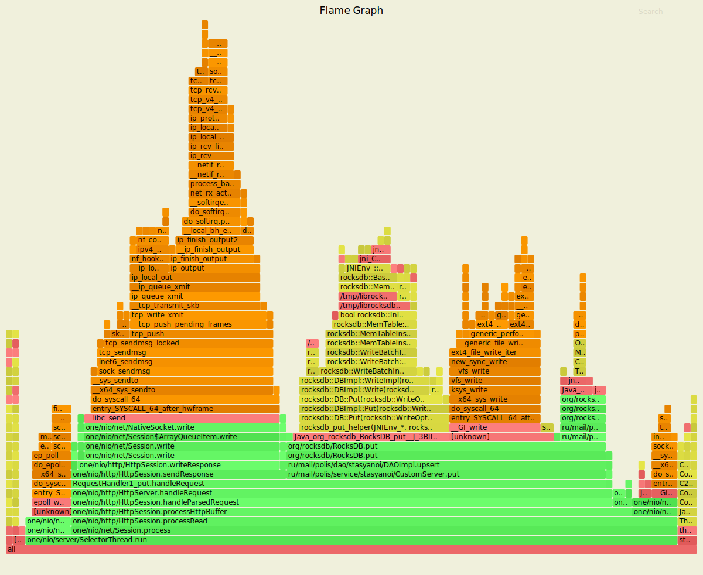
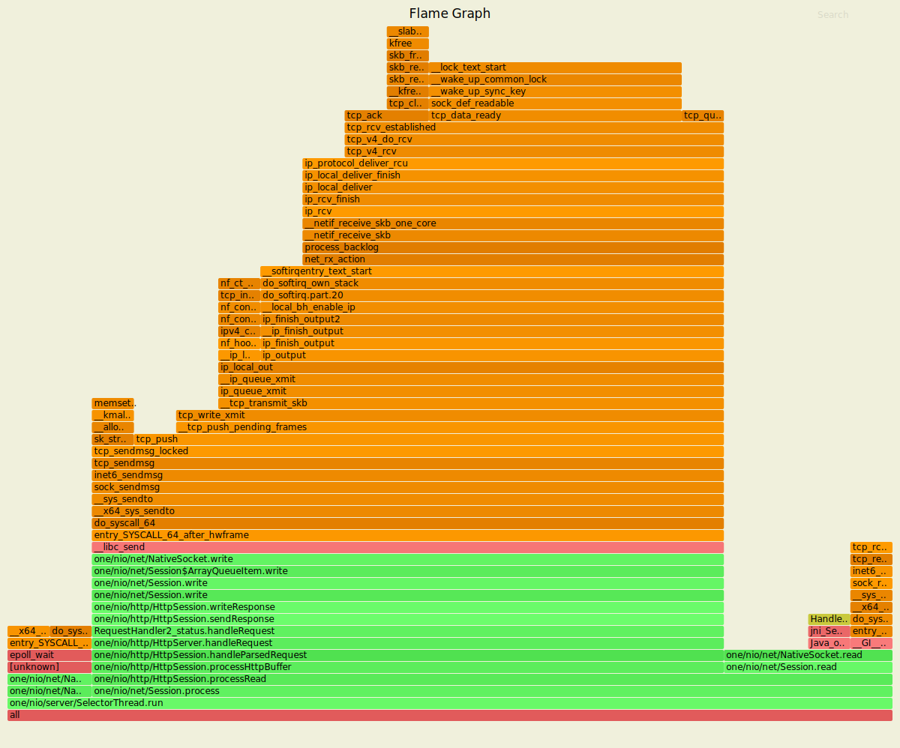

В рамках использования утилиты wrk2 сервер имеет следующие показатели для put.
---------------------------------------------------------------------------------------
1) Команды 

rm wrkLogsPut.txt

./wrk2/wrk -t1 -c1 -d5s -R2000 -s ./wrk2/scripts/put.lua --u_latency http://localhost:8080/v0/entity?id=100 > wrkLogsPut.txt &

rm flamePut.svg 

./async-profiler-1.8.1-linux-x64/profiler.sh -d 5 -f flamePut.svg $(lsof -t -i :8080 -s TCP:LISTEN)

----------------------------------------------------------------------------------------

1) Логи

Running 5s test @ http://localhost:8080/v0/entity?id=100

  1 threads and 1 connections

  Thread Stats   Avg      Stdev     Max   +/- Stdev

    Latency     1.10ms  503.79us   2.30ms   62.17%

    Req/Sec       -nan      -nan   0.00      0.00%

  Latency Distribution (HdrHistogram - Recorded Latency)
  
 50.000%    1.10ms

 75.000%    1.48ms

 90.000%    1.82ms

 99.000%    2.10ms

 99.900%    2.21ms

 99.990%    2.27ms

 99.999%    2.30ms

100.000%    2.30ms

  Detailed Percentile spectrum:
       Value   Percentile   TotalCount 1/(1-Percentile)

       0.052     0.000000            1         1.00
       0.406     0.100000         1002         1.11
       0.621     0.200000         2001         1.25
       0.815     0.300000         2999         1.43
       0.979     0.400000         4000         1.67
       1.098     0.500000         5003         2.00
       1.153     0.550000         5500         2.22
       1.214     0.600000         6001         2.50
       1.281     0.650000         6507         2.86
       1.364     0.700000         7004         3.33
       1.475     0.750000         7502         4.00
       1.530     0.775000         7749         4.44
       1.588     0.800000         7998         5.00
       1.638     0.825000         8248         5.71
       1.697     0.850000         8504         6.67
       1.760     0.875000         8748         8.00
       1.790     0.887500         8877         8.89
       1.823     0.900000         8999        10.00
       1.860     0.912500         9125        11.43
       1.890     0.925000         9247        13.33
       1.921     0.937500         9376        16.00
       1.937     0.943750         9437        17.78
       1.954     0.950000         9500        20.00
       1.970     0.956250         9560        22.86
       1.989     0.962500         9622        26.67
       2.014     0.968750         9684        32.00
       2.027     0.971875         9716        35.56
       2.042     0.975000         9747        40.00
       2.051     0.978125         9784        45.71
       2.063     0.981250         9810        53.33
       2.077     0.984375         9844        64.00
       2.083     0.985938         9864        71.11
       2.091     0.987500         9875        80.00
       2.099     0.989062         9892        91.43
       2.107     0.990625         9906       106.67
       2.117     0.992188         9920       128.00
       2.125     0.992969         9927       142.22
       2.133     0.993750         9934       160.00
       2.139     0.994531         9942       182.86
       2.145     0.995313         9950       213.33
       2.153     0.996094         9957       256.00
       2.161     0.996484         9962       284.44
       2.165     0.996875         9966       320.00
       2.169     0.997266         9969       365.71
       2.175     0.997656         9974       426.67
       2.179     0.998047         9977       512.00
       2.187     0.998242         9981       568.89
       2.187     0.998437         9981       640.00
       2.199     0.998633         9983       731.43
       2.203     0.998828         9985       853.33
       2.219     0.999023         9988      1024.00
       2.219     0.999121         9988      1137.78
       2.223     0.999219         9989      1280.00
       2.225     0.999316         9992      1462.86
       2.225     0.999414         9992      1706.67
       2.225     0.999512         9992      2048.00
       2.225     0.999561         9992      2275.56
       2.243     0.999609         9993      2560.00
       2.243     0.999658         9993      2925.71
       2.265     0.999707         9994      3413.33
       2.265     0.999756         9994      4096.00
       2.265     0.999780         9994      4551.11
       2.269     0.999805         9995      5120.00
       2.269     0.999829         9995      5851.43
       2.269     0.999854         9995      6826.67
       2.269     0.999878         9995      8192.00
       2.269     0.999890         9995      9102.22
       2.297     0.999902         9996     10240.00
       2.297     1.000000         9996          inf
[Mean    =        1.104, StdDeviation   =        0.504]

[Max     =        2.296, Total count    =         9996]

[Buckets =           27, SubBuckets     =         2048]

Latency Distribution (HdrHistogram - Uncorrected Latency (measured without taking delayed starts into account))
 
 50.000%  208.00us
 
 75.000%  242.00us
 
 90.000%  261.00us
 
 99.000%  295.00us
 
 99.900%  367.00us
 
 99.990%  471.00us
 
 99.999%  689.00us

100.000%  689.00us

  Detailed Percentile spectrum:
       Value   Percentile   TotalCount 1/(1-Percentile)

       0.028     0.000000            1         1.00
       0.103     0.100000         1030         1.11
       0.136     0.200000         2010         1.25
       0.159     0.300000         3029         1.43
       0.184     0.400000         4036         1.67
       0.208     0.500000         5023         2.00
       0.216     0.550000         5504         2.22
       0.223     0.600000         6007         2.50
       0.230     0.650000         6501         2.86
       0.236     0.700000         7069         3.33
       0.242     0.750000         7571         4.00
       0.244     0.775000         7762         4.44
       0.247     0.800000         8033         5.00
       0.250     0.825000         8278         5.71
       0.253     0.850000         8527         6.67
       0.257     0.875000         8796         8.00
       0.259     0.887500         8916         8.89
       0.261     0.900000         9031        10.00
       0.263     0.912500         9150        11.43
       0.266     0.925000         9297        13.33
       0.268     0.937500         9378        16.00
       0.270     0.943750         9441        17.78
       0.272     0.950000         9521        20.00
       0.273     0.956250         9567        22.86
       0.275     0.962500         9634        26.67
       0.277     0.968750         9692        32.00
       0.278     0.971875         9716        35.56
       0.280     0.975000         9762        40.00
       0.281     0.978125         9785        45.71
       0.283     0.981250         9811        53.33
       0.286     0.984375         9841        64.00
       0.288     0.985938         9861        71.11
       0.291     0.987500         9880        80.00
       0.293     0.989062         9887        91.43
       0.298     0.990625         9903       106.67
       0.302     0.992188         9918       128.00
       0.304     0.992969         9926       142.22
       0.307     0.993750         9936       160.00
       0.313     0.994531         9942       182.86
       0.318     0.995313         9951       213.33
       0.321     0.996094         9957       256.00
       0.323     0.996484         9961       284.44
       0.325     0.996875         9965       320.00
       0.329     0.997266         9969       365.71
       0.334     0.997656         9973       426.67
       0.336     0.998047         9977       512.00
       0.343     0.998242         9979       568.89
       0.345     0.998437         9981       640.00
       0.355     0.998633         9983       731.43
       0.364     0.998828         9985       853.33
       0.368     0.999023         9987      1024.00
       0.370     0.999121         9988      1137.78
       0.373     0.999219         9989      1280.00
       0.376     0.999316         9991      1462.86
       0.376     0.999414         9991      1706.67
       0.381     0.999512         9992      2048.00
       0.381     0.999561         9992      2275.56
       0.382     0.999609         9993      2560.00
       0.382     0.999658         9993      2925.71
       0.398     0.999707         9994      3413.33
       0.398     0.999756         9994      4096.00
       0.398     0.999780         9994      4551.11
       0.471     0.999805         9995      5120.00
       0.471     0.999829         9995      5851.43
       0.471     0.999854         9995      6826.67
       0.471     0.999878         9995      8192.00
       0.471     0.999890         9995      9102.22
       0.689     0.999902         9996     10240.00
       0.689     1.000000         9996          inf
[Mean    =        0.194, StdDeviation   =        0.059]

[Max     =        0.689, Total count    =         9996]

[Buckets =           27, SubBuckets     =         2048]

9997 requests in 5.00s, 654.10KB read
Requests/sec:   1999.43
Transfer/sec:    130.82KB

----------------------------------------------------------------

----------------------------------------------------------------------------------------
В рамках использования утилиты wrk2 сервер имеет следующие показатели для get.
---------------------------------------------------------------------------------------
1) Команды 

rm wrkLogsGet.txt

./wrk2/wrk -t1 -c1 -d5s -R2000 --u_latency http://localhost:8080/v0/status > wrkLogsGet.txt &

rm flameGet.svg 

./async-profiler-1.8.1-linux-x64/profiler.sh -d 5 -f flameGet.svg $(lsof -t -i :8080 -s TCP:LISTEN)

----------------------------------------------------------------------------------------------

1) Логи

Running 5s test @ http://localhost:8080/v0/status
 
  1 threads and 1 connections
 
  Thread Stats   Avg      Stdev     Max   +/- Stdev
 
    Latency     0.93ms  465.29us   5.50ms   63.45%
 
    Req/Sec       -nan      -nan   0.00      0.00%
 
  Latency Distribution (HdrHistogram - Recorded Latency)
 
 50.000%    0.92ms
 
 75.000%    1.26ms
 
 90.000%    1.57ms
 
 99.000%    1.84ms
 
 
 99.900%    2.08ms
 
 99.990%    5.12ms
 
 99.999%    5.50ms

100.000%    5.50ms

  Detailed Percentile spectrum:
       Value   Percentile   TotalCount 1/(1-Percentile)

       0.016     0.000000            2         1.00
       0.272     0.100000         1006         1.11
       0.495     0.200000         2000         1.25
       0.685     0.300000         3009         1.43
       0.811     0.400000         4003         1.67
       0.924     0.500000         5005         2.00
       0.979     0.550000         5506         2.22
       1.030     0.600000         6008         2.50
       1.091     0.650000         6502         2.86
       1.155     0.700000         7003         3.33
       1.256     0.750000         7502         4.00
       1.306     0.775000         7749         4.44
       1.359     0.800000         8004         5.00
       1.407     0.825000         8254         5.71
       1.455     0.850000         8499         6.67
       1.509     0.875000         8751         8.00
       1.536     0.887500         8879         8.89
       1.571     0.900000         9000        10.00
       1.601     0.912500         9126        11.43
       1.631     0.925000         9252        13.33
       1.657     0.937500         9373        16.00
       1.670     0.943750         9436        17.78
       1.685     0.950000         9500        20.00
       1.702     0.956250         9563        22.86
       1.719     0.962500         9625        26.67
       1.735     0.968750         9685        32.00
       1.745     0.971875         9724        35.56
       1.755     0.975000         9748        40.00
       1.766     0.978125         9780        45.71
       1.784     0.981250         9812        53.33
       1.798     0.984375         9842        64.00
       1.805     0.985938         9859        71.11
       1.813     0.987500         9873        80.00
       1.829     0.989062         9888        91.43
       1.841     0.990625         9904       106.67
       1.852     0.992188         9919       128.00
       1.860     0.992969         9927       142.22
       1.868     0.993750         9936       160.00
       1.871     0.994531         9943       182.86
       1.881     0.995313         9955       213.33
       1.886     0.996094         9959       256.00
       1.892     0.996484         9962       284.44
       1.900     0.996875         9966       320.00
       1.906     0.997266         9970       365.71
       1.913     0.997656         9974       426.67
       1.933     0.998047         9978       512.00
       1.941     0.998242         9980       568.89
       1.951     0.998437         9982       640.00
       1.965     0.998633         9984       731.43
       2.034     0.998828         9986       853.33
       2.105     0.999023         9988      1024.00
       2.127     0.999121         9989      1137.78
       2.451     0.999219         9990      1280.00
       2.937     0.999316         9991      1462.86
       3.421     0.999414         9992      1706.67
       3.903     0.999512         9993      2048.00
       3.903     0.999561         9993      2275.56
       4.379     0.999609         9994      2560.00
       4.379     0.999658         9994      2925.71
       4.751     0.999707         9995      3413.33
       4.751     0.999756         9995      4096.00
       4.751     0.999780         9995      4551.11
       5.123     0.999805         9996      5120.00
       5.123     0.999829         9996      5851.43
       5.123     0.999854         9996      6826.67
       5.123     0.999878         9996      8192.00
       5.123     0.999890         9996      9102.22
       5.503     0.999902         9997     10240.00
       5.503     1.000000         9997          inf

[Mean    =        0.925, StdDeviation   =        0.465]

[Max     =        5.500, Total count    =         9997]

[Buckets =           27, SubBuckets     =         2048]

 Latency Distribution (HdrHistogram - Uncorrected Latency (measured without taking delayed starts into account))

 50.000%   65.00us

 75.000%   86.00us

 90.000%  117.00us

 99.000%  148.00us

 99.900%  221.00us

 99.990%  377.00us

 99.999%    4.68ms

100.000%    4.68ms

  Detailed Percentile spectrum:
       Value   Percentile   TotalCount 1/(1-Percentile)

       0.013     0.000000           21         1.00
       0.020     0.100000         1277         1.11
       0.023     0.200000         2375         1.25
       0.027     0.300000         3053         1.43
       0.060     0.400000         4010         1.67
       0.065     0.500000         5159         2.00
       0.068     0.550000         5621         2.22
       0.074     0.600000         6015         2.50
       0.081     0.650000         6614         2.86
       0.083     0.700000         7229         3.33
       0.086     0.750000         7544         4.00
       0.091     0.775000         7750         4.44
       0.103     0.800000         8009         5.00
       0.107     0.825000         8400         5.71
       0.108     0.850000         8608         6.67
       0.110     0.875000         8818         8.00
       0.112     0.887500         8886         8.89
       0.117     0.900000         9007        10.00
       0.124     0.912500         9143        11.43
       0.125     0.925000         9406        13.33
       0.125     0.937500         9406        16.00
       0.126     0.943750         9523        17.78
       0.126     0.950000         9523        20.00
       0.127     0.956250         9597        22.86
       0.128     0.962500         9638        26.67
       0.130     0.968750         9706        32.00
       0.131     0.971875         9762        35.56
       0.131     0.975000         9762        40.00
       0.132     0.978125         9803        45.71
       0.133     0.981250         9823        53.33
       0.135     0.984375         9842        64.00
       0.139     0.985938         9857        71.11
       0.144     0.987500         9876        80.00
       0.148     0.989062         9898        91.43
       0.149     0.990625         9911       106.67
       0.151     0.992188         9920       128.00
       0.155     0.992969         9933       142.22
       0.157     0.993750         9935       160.00
       0.165     0.994531         9943       182.86
       0.173     0.995313         9951       213.33
       0.191     0.996094         9958       256.00
       0.195     0.996484         9964       284.44
       0.197     0.996875         9966       320.00
       0.201     0.997266         9970       365.71
       0.207     0.997656         9976       426.67
       0.208     0.998047         9981       512.00
       0.208     0.998242         9981       568.89
       0.209     0.998437         9984       640.00
       0.209     0.998633         9984       731.43
       0.216     0.998828         9986       853.33
       0.221     0.999023         9989      1024.00
       0.221     0.999121         9989      1137.78
       0.222     0.999219         9991      1280.00
       0.222     0.999316         9991      1462.86
       0.225     0.999414         9992      1706.67
       0.231     0.999512         9993      2048.00
       0.231     0.999561         9993      2275.56
       0.239     0.999609         9994      2560.00
       0.239     0.999658         9994      2925.71
       0.277     0.999707         9995      3413.33
       0.277     0.999756         9995      4096.00
       0.277     0.999780         9995      4551.11
       0.377     0.999805         9996      5120.00
       0.377     0.999829         9996      5851.43
       0.377     0.999854         9996      6826.67
       0.377     0.999878         9996      8192.00
       0.377     0.999890         9996      9102.22
       4.683     0.999902         9997     10240.00
       4.683     1.000000         9997          inf
[Mean    =        0.065, StdDeviation   =        0.060]

[Max     =        4.680, Total count    =         9997]

[Buckets =           27, SubBuckets     =         2048]

9998 requests in 5.00s, 605.35KB read

Requests/sec:   1999.66

Transfer/sec:    121.07KB

-----------------------------------------------------------------------------------------------

------------------------------------------------------------------------------------------------
Профилирование процессора
-------------------------------------------------------------------------------------------------
Логи после профилирования процессора (./profiler.sh -d 5 29233)

Started [cpu] profiling

--- Execution profile ---

Total samples       : 676

not_walkable_Java   : 1 (0,15%)

Frame buffer usage  : 0.7403%

    142511144    2.07%       14  java.lang.StringLatin1.indexOf
    122353866    1.78%       12  one.nio.net.NativeSelector.epollWait
    122285574    1.78%       12  [vdso]
    122209820    1.77%       12  ipt_do_table?[ip_tables]_[k]
    122208116    1.77%       12  one.nio.util.Utf8.startsWith
    111976334    1.63%       11  __lock_text_start_[k]
    102205352    1.48%       10  do_syscall_64_[k]
    101940305    1.48%       10  java.lang.StringUTF16.checkIndex
    101887035    1.48%       10  __tcp_transmit_skb_[k]
    101837817    1.48%       10  one.nio.http.Response.toBytes
    91738448    1.33%        9  aa_sk_perm_[k]
    91653576    1.33%        9  clock_gettime
    91626865    1.33%        9  __ksize_[k]
    81584450    1.18%        8  epoll_wait
    81579409    1.18%        8  __fget_[k]
    81556485    1.18%        8  tcp_ack_[k]
    81515724    1.18%        8  tcp_sendmsg_locked_[k]
    81494617    1.18%        8  __check_object_size_[k]
    81467530    1.18%        8  __inet_lookup_established_[k]
    81436539    1.18%        8  one.nio.http.Request.getHeader
    71383571    1.04%        7  __nf_conntrack_find_get?[nf_conntrack]_[k]
    71358705    1.04%        7  tcp_recvmsg_[k]
    71352372    1.04%        7  jni_SetByteArrayRegion
    71316828    1.04%        7  __kmalloc_node_track_caller_[k]
    71279815    1.03%        7  java.util.HashMap.getNode
    71256852    1.03%        7  __slab_free_[k]
    71238445    1.03%        7  aa_label_sk_perm.part.4_[k]
    61186180    0.89%        6  ep_scan_ready_list.constprop.20_[k]
    61184944    0.89%        6  eth_type_trans_[k]
    61164647    0.89%        6  nf_conntrack_in?[nf_conntrack]_[k]
    61163508    0.89%        6  syscall_trace_enter_[k]
    61120315    0.89%        6  net_rx_action_[k]
    61081057    0.89%        6  __ip_queue_xmit_[k]
    51006066    0.74%        5  one.nio.net.NativeSelector.select
    50999001    0.74%        5  HandleMark::pop_and_restore()
    50980892    0.74%        5  one.nio.server.SelectorThread.run
    50962924    0.74%        5  tcp_in_window?[nf_conntrack]_[k]
    50959757    0.74%        5  skb_release_data_[k]
    50949899    0.74%        5  __fget_light_[k]
    50949566    0.74%        5  __libc_disable_asynccancel
    50949547    0.74%        5  read_tsc_[k]
    50929323    0.74%        5  nf_ct_get_tuple?[nf_conntrack]_[k]
    50919379    0.74%        5  one.nio.net.NativeSocket.read
    50887434    0.74%        5  _raw_spin_lock_bh_[k]
    50860150    0.74%        5  __libc_send
    50034633    0.73%        5  SpinPause
    41573095    0.60%        4  tcp_v4_rcv_[k]
    40928437    0.59%        4  __ip_finish_output_[k]
    40803502    0.59%        4  ThreadInVMfromNative::~ThreadInVMfromNative()
    40800894    0.59%        4  get_l4proto?[nf_conntrack]_[k]
    40795823    0.59%        4  copy_user_generic_unrolled_[k]
    40795590    0.59%        4  loopback_xmit_[k]
    40792276    0.59%        4  ipv4_dst_check_[k]
    40779629    0.59%        4  sock_def_readable_[k]
    40773433    0.59%        4  __netif_receive_skb_core_[k]
    40766544    0.59%        4  tcp_clean_rtx_queue_[k]
    40766481    0.59%        4  aa_profile_af_perm_[k]
    40764945    0.59%        4  tcp_wfree_[k]
    40753982    0.59%        4  one.nio.http.HttpSession.processHttpBuffer
    40752841    0.59%        4  tcp_current_mss_[k]
    40748291    0.59%        4  clock_gettime
    40740321    0.59%        4  __dev_queue_xmit_[k]
    40736990    0.59%        4  import_single_range_[k]
    40730708    0.59%        4  ip_finish_output2_[k]
    40723472    0.59%        4  fput_many_[k]
    40701501    0.59%        4  _raw_spin_unlock_bh_[k]
    40695212    0.59%        4  ipv4_conntrack_defrag?[nf_defrag_ipv4]_[k]
    30654064    0.44%        3  __GI___recv
    30620298    0.44%        3  one.nio.net.Session.read
    30613003    0.44%        3  security_socket_recvmsg_[k]
    30612239    0.44%        3  ip_rcv_finish_core.isra.18_[k]
    30605147    0.44%        3  __skb_clone_[k]
    30604472    0.44%        3  tcp_schedule_loss_probe_[k]
    30594485    0.44%        3  __tcp_select_window_[k]
    30593766    0.44%        3  tcp_rcv_established_[k]
    30591398    0.44%        3  __sk_dst_check_[k]
    30589203    0.44%        3  tcp_v4_fill_cb_[k]
    30584609    0.44%        3  ktime_get_[k]
    30576982    0.44%        3  mod_timer_[k]
    30575887    0.44%        3  ep_poll_[k]
    30574450    0.44%        3  unroll_tree_refs_[k]
    30565737    0.44%        3  process_backlog_[k]
    30563171    0.44%        3  tcp_event_new_data_sent_[k]
    30562293    0.44%        3  ip_output_[k]
    30559668    0.44%        3  memset_erms_[k]
    30558340    0.44%        3  __audit_syscall_exit_[k]
    30556824    0.44%        3  syscall_slow_exit_work_[k]
    30555057    0.44%        3  enqueue_to_backlog_[k]
    30547429    0.44%        3  java.lang.StringLatin1.regionMatchesCI
    30539972    0.44%        3  skb_page_frag_refill_[k]
    30536377    0.44%        3  _raw_spin_lock_[k]
    30525453    0.44%        3  __libc_enable_asynccancel
    30516587    0.44%        3  do_softirq.part.20_[k]
    20434610    0.30%        2  ipv4_mtu_[k]
    20420069    0.30%        2  __slab_alloc_[k]
    20417544    0.30%        2  check_bounds(int, int, int, Thread*)
    20415524    0.30%        2  rb_insert_color_[k]
    20414995    0.30%        2  ip_rcv_[k]
    20412614    0.30%        2  sock_sendmsg_[k]
    20411900    0.30%        2  Java_one_nio_net_NativeSelector_epollWait
    20411770    0.30%        2  kmem_cache_free_[k]
    20410117    0.30%        2  ipv4_conntrack_local?[nf_conntrack]_[k]
    20404719    0.30%        2  tcp_event_data_recv_[k]
    20403812    0.30%        2  kmem_cache_alloc_node_[k]
    20401959    0.30%        2  inet6_sendmsg_[k]
    20400201    0.30%        2  tcp_send_delayed_ack_[k]
    20398194    0.30%        2  validate_xmit_xfrm_[k]
    20397834    0.30%        2  sock_recvmsg_[k]
    20396476    0.30%        2  hash_conntrack_raw?[nf_conntrack]_[k]
    20395220    0.30%        2  one.nio.net.NativeSocket.write
    20395059    0.30%        2  ip_rcv_core.isra.20_[k]
    20394022    0.30%        2  schedule_[k]
    20387809    0.30%        2  validate_xmit_skb_[k]
    20387665    0.30%        2  __local_bh_enable_ip_[k]
    20387658    0.30%        2  jbyte_disjoint_arraycopy
    20385933    0.30%        2  __cgroup_bpf_run_filter_skb_[k]
    20379600    0.30%        2  __softirqentry_text_start_[k]
    20377191    0.30%        2  release_sock_[k]
    20374468    0.30%        2  one.nio.net.Session.write
    20373470    0.30%        2  netif_skb_features_[k]
    20368912    0.30%        2  sock_poll_[k]
    20368415    0.30%        2  tcp_release_cb_[k]
    20368175    0.30%        2  Java_one_nio_net_NativeSocket_read
    20365673    0.30%        2  iptable_filter_hook?[iptable_filter]_[k]
    20364816    0.30%        2  tcp_write_xmit_[k]
    20364713    0.30%        2  kfree_[k]
    20364507    0.30%        2  one.nio.http.HttpServer.handleRequest
    20364449    0.30%        2  nf_hook_slow_[k]
    20363713    0.30%        2  __kfree_skb_flush_[k]
    20362941    0.30%        2  security_sock_rcv_skb_[k]
    20356583    0.30%        2  tcp_ack_update_rtt.isra.45_[k]
    20355159    0.30%        2  tcp_queue_rcv_[k]
    20353538    0.30%        2  __alloc_skb_[k]
    20353176    0.30%        2  apparmor_socket_recvmsg_[k]
    20352895    0.30%        2  dst_release_[k]
    20352881    0.30%        2  tcp_cleanup_rbuf_[k]
    20351884    0.30%        2  nf_ct_deliver_cached_events?[nf_conntrack]_[k]
    20348595    0.30%        2  ktime_get_seconds_[k]
    20341916    0.30%        2  Java_one_nio_net_NativeSocket_write
    20323079    0.30%        2  __x64_sys_recvfrom_[k]
    20021331    0.29%        2  HeapRegion::block_size(HeapWord const*) const
    10441599    0.15%        1  schedule_hrtimeout_range_clock_[k]
    10234327    0.15%        1  ep_send_events_proc_[k]
    10226763    0.15%        1  __kfree_skb_[k]
    10222025    0.15%        1  __sched_text_start_[k]
    10220769    0.15%        1  tcp_push_[k]
    10219672    0.15%        1  tcp_rate_skb_delivered_[k]
    10218681    0.15%        1  one.nio.http.HttpSession.writeResponse
    10218053    0.15%        1  __virt_addr_valid_[k]
    10216889    0.15%        1  kfree_skbmem_[k]
    10216297    0.15%        1  java.lang.StringLatin1.hashCode
    10216051    0.15%        1  _raw_write_lock_irq_[k]
    10215640    0.15%        1  skb_network_protocol_[k]
    10215628    0.15%        1  __netif_receive_skb_one_core_[k]
    10213500    0.15%        1  tcp_v4_send_check_[k]
    10213202    0.15%        1  tcp_small_queue_check.isra.33_[k]
    10213021    0.15%        1  __audit_syscall_entry_[k]
    10212635    0.15%        1  _cond_resched_[k]
    10211883    0.15%        1  bictcp_cwnd_event_[k]
    10210784    0.15%        1  __x64_sys_epoll_wait_[k]
    10210041    0.15%        1  __usecs_to_jiffies_[k]
    10209866    0.15%        1  _raw_spin_lock_irqsave_[k]
    10208742    0.15%        1  __x86_indirect_thunk_rax_[k]
    10208188    0.15%        1  apparmor_socket_sendmsg_[k]
    10208028    0.15%        1  memmove@plt
    10207368    0.15%        1  bictcp_acked_[k]
    10206530    0.15%        1  lock_sock_nested_[k]
    10206270    0.15%        1  __kmalloc_reserve.isra.62_[k]
    10205421    0.15%        1  ipv4_confirm?[nf_conntrack]_[k]
    10204525    0.15%        1  __memmove_avx_unaligned_erms
    10203883    0.15%        1  simple_copy_to_iter_[k]
    10203854    0.15%        1  iov_iter_advance_[k]
    10203829    0.15%        1  __skb_datagram_iter_[k]
    10203672    0.15%        1  netif_rx_[k]
    10201814    0.15%        1  raw_local_deliver_[k]
    10201502    0.15%        1  recv@plt
    10200394    0.15%        1  sk_filter_trim_cap_[k]
    10199154    0.15%        1  tcp_rcv_space_adjust_[k]
    10198810    0.15%        1  ResourceMark::reset_to_mark()
    10197421    0.15%        1  __x64_sys_sendto_[k]
    10197265    0.15%        1  __sys_sendto_[k]
    10197107    0.15%        1  CodeHeap::find_blob_unsafe(void*) const
    10194829    0.15%        1  __ip_local_out_[k]
    10194117    0.15%        1  MemAllocator::Allocation::notify_allocation_jvmti_sampler()
    10193314    0.15%        1  clear_page_erms_[k]
    10191477    0.15%        1  skb_copy_datagram_iter_[k]
    10191104    0.15%        1  one.nio.net.Session.process
    10190139    0.15%        1  ip_local_deliver_[k]
    10190076    0.15%        1  rb_next_[k]
    10188778    0.15%        1  bictcp_cong_avoid_[k]
    10188598    0.15%        1  ip_copy_addrs_[k]
    10188363    0.15%        1  __tcp_ack_snd_check_[k]
    10187987    0.15%        1  rcu_all_qs_[k]
    10186103    0.15%        1  skb_clone_tx_timestamp_[k]
    10185584    0.15%        1  tcp_update_skb_after_send_[k]
    10185470    0.15%        1  ThreadStateTransition::transition_from_native(JavaThread*, JavaThreadState) [clone .constprop.222]
    10184219    0.15%        1  nf_conntrack_tcp_packet?[nf_conntrack]_[k]
    10182211    0.15%        1  epoll_wait@plt
    10180951    0.15%        1  tcp_rack_advance_[k]
    10179534    0.15%        1  aa_apply_modes_to_perms_[k]