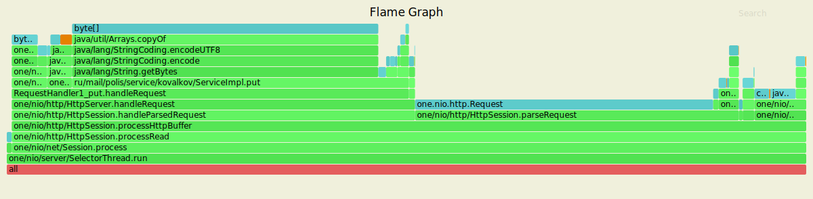

# Проифилирование нагрузки 1-го этапа
Нагрузочное тестирование с помощью wrk2 (код скрипта в соседней папке):
- 1 поток, 1 соединение, 60 секунд, 15000 запросов в секунду
### Анализ GET-запросов
Использовалась следующая команда терминала:
wrk -t1 -c1 -d60s -s 2020-highload-dht/proffiling/STAGE_1/lua-scripts/get.lua -R15000 --latency http://127.0.0.1:8080/

Был получен следующий результат:

       Value   Percentile   TotalCount 1/(1-Percentile)
       0.029     0.000000           12         1.00
       0.257     0.100000        75105         1.11
       0.471     0.200000       150283         1.25
       0.678     0.300000       225120         1.43
       0.880     0.400000       300164         1.67
       1.082     0.500000       374805         2.00
       1.245     0.550000       412345         2.22
       1.506     0.600000       449780         2.50
       1.987     0.650000       487249         2.86
       3.681     0.700000       524729         3.33
       5.843     0.750000       562206         4.00
       7.067     0.775000       580916         4.44
       8.359     0.800000       599736         5.00
       9.759     0.825000       618421         5.71
      11.311     0.850000       637143         6.67
      13.039     0.875000       655929         8.00
      14.071     0.887500       665262         8.89
      15.407     0.900000       674650        10.00
      17.343     0.912500       684039        11.43
      19.599     0.925000       693371        13.33
      22.095     0.937500       702733        16.00
      23.439     0.943750       707442        17.78
      24.863     0.950000       712107        20.00
      26.367     0.956250       716774        22.86
      27.999     0.962500       721493        26.67
      29.951     0.968750       726182        32.00
      31.119     0.971875       728508        35.56
      32.271     0.975000       730863        40.00
      33.567     0.978125       733201        45.71
      35.135     0.981250       735544        53.33
      37.023     0.984375       737893        64.00
      38.111     0.985938       739044        71.11
      39.327     0.987500       740206        80.00
      40.831     0.989062       741376        91.43
      43.167     0.990625       742543       106.67
      46.047     0.992188       743712       128.00
      47.615     0.992969       744303       142.22
      49.279     0.993750       744886       160.00
      51.199     0.994531       745472       182.86
      53.055     0.995313       746060       213.33
      55.903     0.996094       746644       256.00
      57.119     0.996484       746935       284.44
      58.591     0.996875       747226       320.00
      61.055     0.997266       747518       365.71
      63.839     0.997656       747814       426.67
      66.751     0.998047       748107       512.00
      68.031     0.998242       748252       568.89
      69.567     0.998437       748402       640.00
      70.911     0.998633       748546       731.43
      72.319     0.998828       748691       853.33
      73.791     0.999023       748844      1024.00
      74.239     0.999121       748910      1137.78
      74.943     0.999219       748982      1280.00
      75.903     0.999316       749057      1462.86
      76.991     0.999414       749130      1706.67
      78.143     0.999512       749204      2048.00
      78.655     0.999561       749241      2275.56
      79.423     0.999609       749275      2560.00
      80.575     0.999658       749313      2925.71
      81.727     0.999707       749349      3413.33
      82.751     0.999756       749387      4096.00
      83.199     0.999780       749407      4551.11
      83.391     0.999805       749421      5120.00
      83.647     0.999829       749443      5851.43
      83.839     0.999854       749463      6826.67
      84.031     0.999878       749478      8192.00
      84.287     0.999890       749486      9102.22
      84.543     0.999902       749496     10240.00
      84.799     0.999915       749503     11702.86
      85.055     0.999927       749513     13653.33
      85.311     0.999939       749525     16384.00
      85.375     0.999945       749527     18204.44
      85.503     0.999951       749533     20480.00
      85.567     0.999957       749535     23405.71
      85.759     0.999963       749542     27306.67
      85.823     0.999969       749545     32768.00
      85.887     0.999973       749547     36408.89
      85.951     0.999976       749549     40960.00
      86.015     0.999979       749551     46811.43
      86.143     0.999982       749555     54613.33
      86.207     0.999985       749557     65536.00
      86.207     0.999986       749557     72817.78
      86.271     0.999988       749559     81920.00
      86.271     0.999989       749559     93622.86
      86.335     0.999991       749561    109226.67
      86.399     0.999992       749564    131072.00
      86.399     0.999993       749564    145635.56
      86.399     0.999994       749564    163840.00
      86.399     0.999995       749564    187245.71
      86.399     0.999995       749564    218453.33
      86.463     0.999996       749566    262144.00
      86.463     0.999997       749566    291271.11
      86.463     0.999997       749566    327680.00
      86.463     0.999997       749566    374491.43
      86.463     0.999998       749566    436906.67
      86.463     0.999998       749566    524288.00
      86.463     0.999998       749566    582542.22
      86.463     0.999998       749566    655360.00
      86.463     0.999999       749566    748982.86
      86.527     0.999999       749567    873813.33
      86.527     1.000000       749567          inf
      Mean    =       5.162,  StdDeviation   =       9.128
      Max     =       86.464, Total count    =       749567
      Buckets =           27, SubBuckets     =         2048
----------------------------------------------------------
  899438 requests in 1.00m, 63.36MB read
Requests/sec:  14990.68
Transfer/sec:      1.06MB

 ### Результаты профилирования для cpu с помощью Async-profiler
  

Основываясь на результатах мы можем сделать выводы о том что 99% cpu занимает SelectorThread, также  
26% cpu уходит на операцию get (ServiceImpl) , а на отправку ответов 33%(HttpSession.sendResponse).

### Результаты профилирования Allocation с помощью Async-profiler

Основываясь на результатах мы можем сделать выводы о том что 100% cpu занимает SelectorThread, также  
22% cpu уходит на операцию get (ServiceImpl) , а на отправку ответов 17.8%(HttpSession.sendResponse).

### Анализ PUT-запросов

Использовалась следующая команда терминала:
wrk -t1 -c1 -d60s -s 2020-highload-dht/proffiling/STAGE_1/lua-scripts/put.lua -R15000 --latency http://127.0.0.1:8080/

Был получен следующий результат:
     
     Value       Precentile     TotalCount    1/(1-Precentile)
    1314.815     0.000000          119         1.00
    2312.191     0.100000        74156         1.11
    2367.487     0.200000       145267         1.25
    2414.591     0.300000       217049         1.43
    2971.647     0.400000       289863         1.67
    3313.663     0.500000       361742         2.00
    3440.639     0.550000       398359         2.22
    3524.607     0.600000       434221         2.50
    3637.247     0.650000       470634         2.86
    3704.831     0.700000       507214         3.33
    3741.695     0.750000       545143         4.00
    3751.935     0.775000       561734         4.44
    3764.223     0.800000       581940         5.00
    3772.415     0.825000       597658         5.71
    3782.655     0.850000       615181         6.67
    3796.991     0.875000       634677         8.00
    3809.279     0.887500       643075         8.89
    3821.567     0.900000       653357        10.00
    3837.951     0.912500       660371        11.43
    3864.575     0.925000       669809        13.33
    3872.767     0.937500       679572        16.00
    3876.863     0.943750       684631        17.78
    3880.959     0.950000       689649        20.00
    3883.007     0.956250       692970        22.86
    3887.103     0.962500       698864        26.67
    3889.151     0.968750       701277        32.00
    3891.199     0.971875       703354        35.56
    3893.247     0.975000       706093        40.00
    3895.295     0.978125       708463        45.71
    3897.343     0.981250       710446        53.33
    3899.391     0.984375       712480        64.00
    3901.439     0.985938       714393        71.11
    3901.439     0.987500       714393        80.00
    3903.487     0.989062       715788        91.43
    3907.583     0.990625       717530       106.67
    3909.631     0.992188       718663       128.00
    3909.631     0.992969       718663       142.22
    3911.679     0.993750       719622       160.00
    3911.679     0.994531       719622       182.86
    3913.727     0.995313       720676       213.33
    3913.727     0.996094       720676       256.00
    3915.775     0.996484       721397       284.44
    3915.775     0.996875       721397       320.00
    3917.823     0.997266       722285       365.71
    3917.823     0.997656       722285       426.67
    3917.823     0.998047       722285       512.00
    3917.823     0.998242       722285       568.89
    3919.871     0.998437       722893       640.00
    3919.871     0.998633       722893       731.43
    3919.871     0.998828       722893       853.33
    3919.871     0.999023       722893      1024.00
    3919.871     0.999121       722893      1137.78
    3919.871     0.999219       722893      1280.00
    3921.919     0.999316       723345      1462.86
    3921.919     0.999414       723345      1706.67
    3921.919     0.999512       723345      2048.00
    3921.919     0.999561       723345      2275.56
    3921.919     0.999609       723345      2560.00
    3921.919     0.999658       723345      2925.71
    3921.919     0.999707       723345      3413.33
    3921.919     0.999756       723345      4096.00
    3921.919     0.999780       723345      4551.11
    3921.919     0.999805       723345      5120.00
    3921.919     0.999829       723345      5851.43
    3921.919     0.999854       723345      6826.67
    3921.919     0.999878       723345      8192.00
    3921.919     0.999890       723345      9102.22
    3923.967     0.999902       723423     10240.00
    3923.967     1.000000       723423          inf
    Mean = 3070.655   StDeviation = 721.493
    Max  = 3921.920   TotalCount = 723423
    BUckets = 27      SubBuckets = 2048
    853769 requests in 1.00m, 54.55MB read
    Requests/sec:  14232.76
    Transfer/sec:      0.91MB
----------------------------------------------------------

### Результаты профилирования для cpu с помощью Async-profiler

Основываясь на результатах мы можем сделать выводы о том что 99% cpu занимает SelectorThread,
 37.1% cpu уходит на операцию put (ServiceImpl.put), 42.3% уходит на отправку ответа (HttpSession.sendResponse).

### Результаты профилирования Allocation с помощью Async-profiler

Основываясь на результатах мы можем сделать выводы о том что 100% cpu занимает SelectorThread,
 42.3% cpu уходит на операцию put (ServiceImpl.put), 4% уходит на отправку ответа (HttpSession.sendResponse).