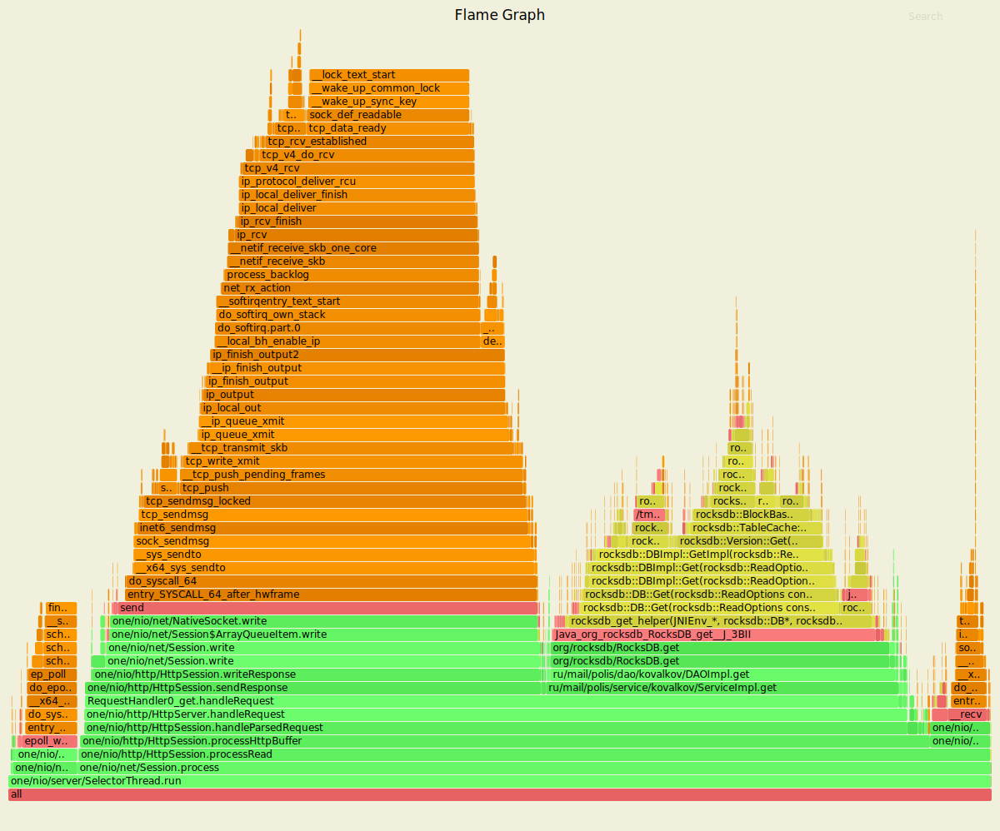

# Проифилирование нагрузки 1-го этапа
Нагрузочное тестирование с помощью wrk2 (код скрипта использовался из stage 1):
- 4 потока, 16 соединение, 60 секунд, 15000 запросов в секунду

### Анализ PUT-запросов

Использовалась следующая команда терминала:
wrk -t4 -c16 -d60s -s proffiling/lua-scripts/put.lua -R15000 --latency http://127.0.0.1:8080

Был получен следующий результат:
     
       4 threads and 16 connections
       Thread calibration: mean lat.: 1.727ms, rate sampling interval: 10ms
       Thread calibration: mean lat.: 1.660ms, rate sampling interval: 10ms
       Thread calibration: mean lat.: 1.671ms, rate sampling interval: 10ms
       Thread calibration: mean lat.: 1.713ms, rate sampling interval: 10ms
       Thread Stats   Avg      Stdev     Max   +/- Stdev
         Latency    11.44ms   54.02ms 509.70ms   96.20%
         Req/Sec     4.06k     1.20k   24.44k    94.75%
       Latency Distribution (HdrHistogram - Recorded Latency)
      50.000%    1.53ms
      75.000%    2.19ms
      90.000%    2.98ms
      99.000%  353.54ms
      99.900%  488.96ms
      99.990%  506.62ms
      99.999%  509.18ms
     100.000%  509.95ms
     
       Detailed Percentile spectrum:
            Value   Percentile   TotalCount 1/(1-Percentile)
     
            0.025     0.000000            1         1.00
            0.524     0.100000        75202         1.11
            0.819     0.200000       149992         1.25
            1.072     0.300000       225285         1.43
            1.302     0.400000       300071         1.67
            1.527     0.500000       375074         2.00
            1.644     0.550000       412694         2.22
            1.764     0.600000       450112         2.50
            1.892     0.650000       487395         2.86
            2.034     0.700000       524922         3.33
            2.195     0.750000       562518         4.00
            2.285     0.775000       581117         4.44
            2.383     0.800000       599865         5.00
            2.495     0.825000       618902         5.71
            2.619     0.850000       637388         6.67
            2.775     0.875000       656289         8.00
            2.867     0.887500       665594         8.89
            2.983     0.900000       674963        10.00
            3.129     0.912500       684257        11.43
            3.345     0.925000       693602        13.33
            3.789     0.937500       702965        16.00
            4.799     0.943750       707646        17.78
            9.335     0.950000       712332        20.00
           25.727     0.956250       717019        22.86
           69.055     0.962500       721707        26.67
          116.927     0.968750       726393        32.00
          145.151     0.971875       728744        35.56
          173.183     0.975000       731081        40.00
          200.319     0.978125       733423        45.71
          238.719     0.981250       735764        53.33
          279.807     0.984375       738115        64.00
          300.031     0.985938       739290        71.11
          320.511     0.987500       740453        80.00
          341.247     0.989062       741631        91.43
          361.471     0.990625       742812       106.67
          380.415     0.992188       743973       128.00
          389.631     0.992969       744566       142.22
          399.615     0.993750       745150       160.00
          409.343     0.994531       745727       182.86
          420.095     0.995313       746320       213.33
          432.639     0.996094       746897       256.00
          442.367     0.996484       747191       284.44
          450.303     0.996875       747481       320.00
          458.495     0.997266       747773       365.71
          465.151     0.997656       748067       426.67
          472.831     0.998047       748361       512.00
          476.927     0.998242       748508       568.89
          479.743     0.998437       748659       640.00
          482.303     0.998633       748809       731.43
          485.887     0.998828       748952       853.33
          489.471     0.999023       749091      1024.00
          491.775     0.999121       749172      1137.78
          494.079     0.999219       749248      1280.00
          495.871     0.999316       749316      1462.86
          497.663     0.999414       749385      1706.67
          499.711     0.999512       749465      2048.00
          500.479     0.999561       749499      2275.56
          501.247     0.999609       749538      2560.00
          501.759     0.999658       749568      2925.71
          502.527     0.999707       749616      3413.33
          503.039     0.999756       749648      4096.00
          503.295     0.999780       749664      4551.11
          503.551     0.999805       749677      5120.00
          504.063     0.999829       749698      5851.43
          505.087     0.999854       749717      6826.67
          505.855     0.999878       749738      8192.00
          506.111     0.999890       749744      9102.22
          506.623     0.999902       749756     10240.00
          506.879     0.999915       749761     11702.86
          507.135     0.999927       749769     13653.33
          507.391     0.999939       749778     16384.00
          507.647     0.999945       749785     18204.44
          507.903     0.999951       749788     20480.00
          508.159     0.999957       749798     23405.71
          508.159     0.999963       749798     27306.67
          508.415     0.999969       749803     32768.00
          508.415     0.999973       749803     36408.89
          508.671     0.999976       749811     40960.00
          508.671     0.999979       749811     46811.43
          508.671     0.999982       749811     54613.33
          508.927     0.999985       749815     65536.00
          508.927     0.999986       749815     72817.78
          508.927     0.999988       749815     81920.00
          508.927     0.999989       749815     93622.86
          509.183     0.999991       749820    109226.67
          509.183     0.999992       749820    131072.00
          509.183     0.999993       749820    145635.56
          509.183     0.999994       749820    163840.00
          509.183     0.999995       749820    187245.71
          509.183     0.999995       749820    218453.33
          509.439     0.999996       749821    262144.00
          509.439     0.999997       749821    291271.11
          509.439     0.999997       749821    327680.00
          509.439     0.999997       749821    374491.43
          509.695     0.999998       749822    436906.67
          509.695     0.999998       749822    524288.00
          509.695     0.999998       749822    582542.22
          509.695     0.999998       749822    655360.00
          509.695     0.999999       749822    748982.86
          509.951     0.999999       749823    873813.33
          509.951     1.000000       749823          inf
     #[Mean    =       11.437, StdDeviation   =       54.018]
     #[Max     =      509.696, Total count    =       749823]
     #[Buckets =           27, SubBuckets     =         2048]
     ----------------------------------------------------------
       899863 requests in 1.00m, 57.50MB read
     Requests/sec:  14997.73
     Transfer/sec:      0.96MB

Как мы можем видеть, средняя задержка для операции put, составила всего 11 ms при отклонении
в 96%. На 90 процентов запросов система отвечает быстрей чем за 3 милесекунды. Но на промежутке
от 90 до 100% мы имеем существенное увеличение отлика.

#### Результаты профилирования для cpu с помощью Async-profiler


Анализуря данный граф, мы можем увидеть, что 99.9% cpu занимает SelectorThread.run, который обрабатывает
запросы. По стеку вызово, мы видим что 40.9% занимает работа нативного метода rocksdb - put. Также 
мы видим что справа от put появился маленький столбец _pthread_cond_signal, в нашем случае этот стэк
заканчивается lock-ом, и отвечает за потокобезопасность добавления данных и уходит в POSIX. Порядка
 30% уходит на отправку ответов.  

#### Результаты профилирования Allocation с помощью Async-profiler


На данном графе можно посмотреть выделение памяти под процессы. SelectorThread.run занимает 100%.
При этом на one/nio/http/HttpSession.sendResponse мы тратим 11% памяти, и 20% на парсинг запроса.
На операцию put (ServiceImpl.put) тратится 32%. Все что указано на верху голубым цветом, по большому счету является safe point-ами jvm, и появились 
в стэке только по причине остановки потоков при семплинорвании именно на этом моменте.
 
#### Результаты профилирования Lock с помощью Async-profiler
 
 

Данный граф отображает блокировки потоков, и как мы можем увидеть отображаеть ему нечего, и это 
определенно хороший знак.
 
 ### Анализ GET-запросов
 Использовалась следующая команда терминала:
 wrk -t4 -c16 -d60s -s proffiling/lua-scripts/get.lua -R15000 --latency http://127.0.0.1:8080
 
 Был получен следующий результат:
   
       Running 1m test @ http://127.0.0.1:8080
         4 threads and 16 connections
         Thread calibration: mean lat.: 1.557ms, rate sampling interval: 10ms
         Thread calibration: mean lat.: 1.578ms, rate sampling interval: 10ms
         Thread calibration: mean lat.: 2.501ms, rate sampling interval: 10ms
         Thread calibration: mean lat.: 1.569ms, rate sampling interval: 10ms
         Thread Stats   Avg      Stdev     Max   +/- Stdev
           Latency     1.56ms    1.16ms  25.46ms   85.34%
           Req/Sec     4.00k   528.27    13.78k    81.44%
         Latency Distribution (HdrHistogram - Recorded Latency)
        50.000%    1.43ms
        75.000%    2.00ms
        90.000%    2.58ms
        99.000%    5.14ms
        99.900%   14.77ms
        99.990%   21.65ms
        99.999%   24.67ms
       100.000%   25.47ms          
       Detailed Percentile spectrum:      
       Value     Percentile   TotalCount 1/(1-Percentile)
        0.025     0.000000            1         1.00
        0.482     0.100000        75172         1.11
        0.787     0.200000       150165         1.25
        1.017     0.300000       225060         1.43
        1.228     0.400000       300186         1.67
        1.431     0.500000       375041         2.00
        1.533     0.550000       412355         2.22
        1.641     0.600000       450065         2.50
        1.747     0.650000       487448         2.86
        1.860     0.700000       524892         3.33
        1.999     0.750000       562392         4.00
        2.081     0.775000       581101         4.44
        2.173     0.800000       600061         5.00
        2.269     0.825000       618788         5.71
        2.367     0.850000       637290         6.67
        2.471     0.875000       656075         8.00
        2.527     0.887500       665600         8.89
        2.583     0.900000       675055        10.00
        2.639     0.912500       684347        11.43
        2.697     0.925000       693518        13.33
        2.765     0.937500       703017        16.00
        2.803     0.943750       707724        17.78
        2.847     0.950000       712360        20.00
        2.901     0.956250       716947        22.86
        2.977     0.962500       721610        26.67
        3.095     0.968750       726305        32.00
        3.183     0.971875       728656        35.56
        3.295     0.975000       730958        40.00
        3.433     0.978125       733303        45.71
        3.597     0.981250       735656        53.33
        3.823     0.984375       737987        64.00
        4.013     0.985938       739147        71.11
        4.339     0.987500       740327        80.00
        4.791     0.989062       741490        91.43
        5.391     0.990625       742662       106.67
        6.171     0.992188       743837       128.00
        6.631     0.992969       744428       142.22
        7.123     0.993750       745004       160.00
        7.727     0.994531       745597       182.86
        8.407     0.995313       746177       213.33
        9.255     0.996094       746764       256.00
        9.711     0.996484       747055       284.44
       10.255     0.996875       747352       320.00
       10.871     0.997266       747643       365.71
       11.615     0.997656       747933       426.67
       12.431     0.998047       748226       512.00
       12.895     0.998242       748374       568.89
       13.303     0.998437       748518       640.00
       13.751     0.998633       748667       731.43
       14.223     0.998828       748811       853.33
       14.847     0.999023       748959      1024.00
       15.231     0.999121       749032      1137.78
       15.615     0.999219       749105      1280.00
       15.983     0.999316       749177      1462.86
       16.479     0.999414       749252      1706.67
       17.007     0.999512       749324      2048.00
       17.295     0.999561       749360      2275.56
       17.663     0.999609       749398      2560.00
       17.983     0.999658       749434      2925.71
       18.383     0.999707       749470      3413.33
       18.911     0.999756       749506      4096.00
       19.231     0.999780       749525      4551.11
       19.647     0.999805       749543      5120.00
       20.175     0.999829       749562      5851.43
       20.639     0.999854       749580      6826.67
       21.263     0.999878       749598      8192.00
       21.439     0.999890       749607      9102.22
       21.727     0.999902       749616     10240.00
       22.031     0.999915       749625     11702.86
       22.415     0.999927       749635     13653.33
       22.799     0.999939       749644     16384.00
       23.039     0.999945       749649     18204.44
       23.327     0.999951       749653     20480.00
       23.535     0.999957       749657     23405.71
       23.663     0.999963       749662     27306.67
       23.903     0.999969       749667     32768.00
       23.999     0.999973       749669     36408.89
       24.191     0.999976       749671     40960.00
       24.223     0.999979       749673     46811.43
       24.335     0.999982       749676     54613.33
       24.479     0.999985       749679     65536.00
       24.479     0.999986       749679     72817.78
       24.607     0.999988       749680     81920.00
       24.623     0.999989       749681     93622.86
       24.687     0.999991       749683    109226.67
       24.719     0.999992       749684    131072.00
       24.719     0.999993       749684    145635.56
       24.895     0.999994       749685    163840.00
       24.895     0.999995       749685    187245.71
       24.975     0.999995       749686    218453.33
       25.023     0.999996       749687    262144.00
       25.023     0.999997       749687    291271.11
       25.023     0.999997       749687    327680.00
       25.023     0.999997       749687    374491.43
       25.183     0.999998       749688    436906.67
       25.183     0.999998       749688    524288.00
       25.183     0.999998       749688    582542.22
       25.183     0.999998       749688    655360.00
       25.183     0.999999       749688    748982.86
       25.471     0.999999       749689    873813.33
       25.471     1.000000       749689          inf
    Mean    =        1.556, StdDeviation   =        1.162
    Max     =       25.456, Total count    =       749689
    Buckets =           27, SubBuckets     =         2048
    ----------------------------------------------------------
    899849 requests in 1.00m, 63.04MB read
    Requests/sec:  14997.35
    Transfer/sec:      1.05MB
 
 В случае с get запросом мы имеем более радужную картину. Мы имеем среднюю зажерэку в 1.5 
 миллесекунды, при стандартном откланении в 86%. Как мы можем видеть, 90% наших запросов 
 укладываются в 3 мс, а 99% в 5 мс.
 
  #### Результаты профилирования для cpu с помощью Async-profiler
   
 
 
 Основываясь на результатах мы можем сделать выводы о том что 99% cpu занимает SelectorThread, также  
 35% cpu уходит на операцию get (ServiceImpl) , а на отправку ответов 42%(HttpSession.sendResponse).
 
 #### Результаты профилирования Allocation с помощью Async-profiler
 
 
 
 Основываясь на результатах мы можем сделать выводы о том что 100% cpu занимает SelectorThread, также  
 32% cpu уходит на операцию get (ServiceImpl) , а на отправку ответов 12% (HttpSession.sendResponse).

#### Результаты профилирования Lock с помощью Async-profiler
 
 

Данный граф отображает блокировки потоков, и как мы можем увидеть отображаеть ему нечего, и это 
определенно хороший знак.

### Попытка улучшения результатов, путём настройки RocksDB

В качестве улучшений, как и было предложенно, было необходимо посмотреть документацию, и найти
потенциальные конфигурации хранилища, которые смогли бы повлиять на их проивзодительность.

В результате чтения документации были получены следующие сведения:
1. setEnableWriteThreadAdaptiveYield - потоки, синхронизирующиеся с лидером группы пакетов записи, будут ждать до,
 writeThreadMaxYieldUsec()прежде чем блокироваться на мьютексе. Это может существенно повысить пропускную способность
  для одновременных рабочих нагрузок независимо от того allowConcurrentMemtableWrite().
2. setAllowConcurrentMemtableWrite - Если true, разрешить многопользовательским разработчикам обновлять memtable 
   параллельно. В настоящее время это реализовано для SkipListFactory.
3. Установить следующие дополнительные параметры:
```
    option.setLevelCompactionDynamicLevelBytes(true)
        .setAllowConcurrentMemtableWrite(true)
        .setBytesPerSync(1048576)
        .setCompactionPriority(CompactionPriority.MinOverlappingRatio);
```
Почему именно они ? Потому что по мнению расзработчиков rocksDB это лучшие параметры, но они не
вписываются в регрессы и по этому на них по умолчанию указывать не собираются, по причинам безопасности
 пользователей (возможны нарушения при внезапном переходе). 
 
 Про эти опции можно узнать здесь: 
 https://github.com/facebook/rocksdb/wiki/Setup-Options-and-Basic-Tuning

Использовалась следующая команда терминала:
 wrk -t4 -c16 -d60s -s proffiling/lua-scripts/put.lua -R15000 --latency http://127.0.0.1:8080
 
 Был получен следующий результат:
   
      4 threads and 16 connections
      Thread calibration: mean lat.: 1.612ms, rate sampling interval: 10ms
      Thread calibration: mean lat.: 1.675ms, rate sampling interval: 10ms
      Thread calibration: mean lat.: 1.658ms, rate sampling interval: 10ms
      Thread calibration: mean lat.: 1.642ms, rate sampling interval: 10ms
      Thread Stats   Avg      Stdev     Max   +/- Stdev
        Latency     1.99ms    4.64ms 162.94ms   97.47%
        Req/Sec     3.99k   747.89    23.67k    88.16%
      Latency Distribution (HdrHistogram - Recorded Latency)
     50.000%    1.51ms
     75.000%    2.18ms
     90.000%    2.91ms
     99.000%   11.14ms
     99.900%   87.29ms
     99.990%  155.39ms
     99.999%  162.43ms
    100.000%  163.07ms
    
      Detailed Percentile spectrum:
           Value   Percentile   TotalCount 1/(1-Percentile)
    
           0.030     0.000000            1         1.00
           0.510     0.100000        74994         1.11
           0.815     0.200000       150068         1.25
           1.064     0.300000       225007         1.43
           1.293     0.400000       300222         1.67
           1.514     0.500000       374951         2.00
           1.630     0.550000       412461         2.22
           1.749     0.600000       449871         2.50
           1.876     0.650000       487507         2.86
           2.017     0.700000       524971         3.33
           2.179     0.750000       562414         4.00
           2.271     0.775000       581399         4.44
           2.369     0.800000       600051         5.00
           2.475     0.825000       618803         5.71
           2.595     0.850000       637475         6.67
           2.733     0.875000       656174         8.00
           2.813     0.887500       665377         8.89
           2.911     0.900000       674799        10.00
           3.031     0.912500       684142        11.43
           3.195     0.925000       693520        13.33
           3.431     0.937500       702870        16.00
           3.597     0.943750       707538        17.78
           3.829     0.950000       712218        20.00
           4.191     0.956250       716930        22.86
           4.743     0.962500       721613        26.67
           5.551     0.968750       726293        32.00
           6.079     0.971875       728618        35.56
           6.703     0.975000       730968        40.00
           7.419     0.978125       733313        45.71
           8.231     0.981250       735662        53.33
           9.119     0.984375       737994        64.00
           9.623     0.985938       739179        71.11
          10.135     0.987500       740330        80.00
          10.727     0.989062       741508        91.43
          11.447     0.990625       742687       106.67
          12.343     0.992188       743845       128.00
          12.903     0.992969       744441       142.22
          13.535     0.993750       745024       160.00
          14.239     0.994531       745602       182.86
          15.143     0.995313       746190       213.33
          16.463     0.996094       746779       256.00
          17.375     0.996484       747068       284.44
          18.591     0.996875       747359       320.00
          20.159     0.997266       747652       365.71
          22.415     0.997656       747945       426.67
          26.671     0.998047       748237       512.00
          32.479     0.998242       748384       568.89
          45.311     0.998437       748530       640.00
          59.999     0.998633       748677       731.43
          74.367     0.998828       748823       853.33
          89.151     0.999023       748969      1024.00
          96.575     0.999121       749043      1137.78
         103.807     0.999219       749116      1280.00
         110.975     0.999316       749189      1462.86
         118.143     0.999414       749262      1706.67
         125.823     0.999512       749335      2048.00
         129.407     0.999561       749372      2275.56
         133.119     0.999609       749410      2560.00
         136.831     0.999658       749445      2925.71
         140.415     0.999707       749482      3413.33
         144.255     0.999756       749518      4096.00
         146.303     0.999780       749537      4551.11
         148.095     0.999805       749558      5120.00
         149.759     0.999829       749573      5851.43
         151.807     0.999854       749592      6826.67
         153.727     0.999878       749610      8192.00
         154.623     0.999890       749620      9102.22
         155.519     0.999902       749628     10240.00
         156.415     0.999915       749638     11702.86
         157.311     0.999927       749647     13653.33
         158.207     0.999939       749656     16384.00
         158.591     0.999945       749660     18204.44
         159.359     0.999951       749665     20480.00
         159.743     0.999957       749669     23405.71
         160.255     0.999963       749674     27306.67
         160.767     0.999969       749679     32768.00
         161.023     0.999973       749683     36408.89
         161.023     0.999976       749683     40960.00
         161.151     0.999979       749685     46811.43
         161.663     0.999982       749688     54613.33
         161.919     0.999985       749690     65536.00
         162.047     0.999986       749693     72817.78
         162.047     0.999988       749693     81920.00
         162.047     0.999989       749693     93622.86
         162.559     0.999991       749695    109226.67
         162.687     0.999992       749697    131072.00
         162.687     0.999993       749697    145635.56
         162.687     0.999994       749697    163840.00
         162.687     0.999995       749697    187245.71
         162.815     0.999995       749699    218453.33
         162.815     0.999996       749699    262144.00
         162.815     0.999997       749699    291271.11
         162.815     0.999997       749699    327680.00
         162.815     0.999997       749699    374491.43
         162.943     0.999998       749700    436906.67
         162.943     0.999998       749700    524288.00
         162.943     0.999998       749700    582542.22
         162.943     0.999998       749700    655360.00
         162.943     0.999999       749700    748982.86
         163.071     0.999999       749701    873813.33
         163.071     1.000000       749701          inf
    #[Mean    =        1.992, StdDeviation   =        4.642]
    #[Max     =      162.944, Total count    =       749701]
    #[Buckets =           27, SubBuckets     =         2048]
    ----------------------------------------------------------
      899867 requests in 1.00m, 57.50MB read
    Requests/sec:  14997.82
    Transfer/sec:      0.96MB
    
Использовалась следующая команда терминала:
 wrk -t4 -c16 -d60s -s proffiling/lua-scripts/get.lua -R15000 --latency http://127.0.0.1:8080
 
 Был получен следующий результат:
 
    4 threads and 16 connections
      Thread calibration: mean lat.: 1.483ms, rate sampling interval: 10ms
      Thread calibration: mean lat.: 1.497ms, rate sampling interval: 10ms
      Thread calibration: mean lat.: 1.475ms, rate sampling interval: 10ms
      Thread calibration: mean lat.: 1.511ms, rate sampling interval: 10ms
      Thread Stats   Avg      Stdev     Max   +/- Stdev
        Latency     5.38ms   34.97ms 502.27ms   98.45%
        Req/Sec     4.03k     1.00k   46.44k    96.36%
      Latency Distribution (HdrHistogram - Recorded Latency)
     50.000%    1.44ms
     75.000%    2.01ms
     90.000%    2.60ms
     99.000%  178.43ms
     99.900%  466.17ms
     99.990%  498.69ms
     99.999%  501.76ms
    100.000%  502.53ms
    
      Detailed Percentile spectrum:
           Value   Percentile   TotalCount 1/(1-Percentile)
    
           0.022     0.000000            1         1.00
           0.472     0.100000        75110         1.11
           0.791     0.200000       149970         1.25
           1.025     0.300000       224965         1.43
           1.236     0.400000       300151         1.67
           1.438     0.500000       374915         2.00
           1.543     0.550000       412703         2.22
           1.649     0.600000       450078         2.50
           1.755     0.650000       487588         2.86
           1.868     0.700000       525032         3.33
           2.009     0.750000       562286         4.00
           2.097     0.775000       581316         4.44
           2.191     0.800000       600038         5.00
           2.287     0.825000       618622         5.71
           2.387     0.850000       637462         6.67
           2.491     0.875000       656019         8.00
           2.545     0.887500       665382         8.89
           2.601     0.900000       675019        10.00
           2.655     0.912500       684270        11.43
           2.713     0.925000       693530        13.33
           2.779     0.937500       703023        16.00
           2.815     0.943750       707544        17.78
           2.861     0.950000       712229        20.00
           2.923     0.956250       716975        22.86
           3.025     0.962500       721596        26.67
           3.263     0.968750       726287        32.00
           3.471     0.971875       728620        35.56
           3.773     0.975000       730973        40.00
           4.751     0.978125       733305        45.71
           7.559     0.981250       735644        53.33
          38.207     0.984375       737986        64.00
          74.751     0.985938       739161        71.11
         110.591     0.987500       740329        80.00
         152.959     0.989062       741504        91.43
         195.583     0.990625       742675       106.67
         236.927     0.992188       743845       128.00
         255.871     0.992969       744429       142.22
         277.759     0.993750       745017       160.00
         305.663     0.994531       745604       182.86
         334.591     0.995313       746193       213.33
         363.007     0.996094       746775       256.00
         376.831     0.996484       747065       284.44
         391.167     0.996875       747358       320.00
         405.503     0.997266       747657       365.71
         418.559     0.997656       747943       426.67
         432.383     0.998047       748240       512.00
         438.783     0.998242       748383       568.89
         445.695     0.998437       748530       640.00
         452.863     0.998633       748678       731.43
         459.775     0.998828       748823       853.33
         466.943     0.999023       748969      1024.00
         470.783     0.999121       749047      1137.78
         474.367     0.999219       749119      1280.00
         477.695     0.999316       749188      1462.86
         481.279     0.999414       749263      1706.67
         484.863     0.999512       749336      2048.00
         486.655     0.999561       749371      2275.56
         488.703     0.999609       749413      2560.00
         490.239     0.999658       749446      2925.71
         491.775     0.999707       749485      3413.33
         493.311     0.999756       749518      4096.00
         494.079     0.999780       749536      4551.11
         495.103     0.999805       749555      5120.00
         496.127     0.999829       749573      5851.43
         497.151     0.999854       749596      6826.67
         497.919     0.999878       749613      8192.00
         498.431     0.999890       749621      9102.22
         498.687     0.999902       749630     10240.00
         498.943     0.999915       749636     11702.86
         499.711     0.999927       749652     13653.33
         499.967     0.999939       749657     16384.00
         500.223     0.999945       749661     18204.44
         500.479     0.999951       749667     20480.00
         500.735     0.999957       749672     23405.71
         500.991     0.999963       749678     27306.67
         500.991     0.999969       749678     32768.00
         501.247     0.999973       749682     36408.89
         501.247     0.999976       749682     40960.00
         501.503     0.999979       749687     46811.43
         501.503     0.999982       749687     54613.33
         501.759     0.999985       749693     65536.00
         501.759     0.999986       749693     72817.78
         501.759     0.999988       749693     81920.00
         501.759     0.999989       749693     93622.86
         502.015     0.999991       749696    109226.67
         502.015     0.999992       749696    131072.00
         502.015     0.999993       749696    145635.56
         502.015     0.999994       749696    163840.00
         502.015     0.999995       749696    187245.71
         502.271     0.999995       749697    218453.33
         502.527     0.999996       749700    262144.00
         502.527     1.000000       749700          inf
    #[Mean    =        5.384, StdDeviation   =       34.970]
    #[Max     =      502.272, Total count    =       749700]
    #[Buckets =           27, SubBuckets     =         2048]
    ----------------------------------------------------------
      899867 requests in 1.00m, 63.04MB read
    Requests/sec:  14997.84
    Transfer/sec:      1.05MB
    
Исходя из увиденного не довольно двоякая ситуация. В целом мы улучшили среднюю задержку для put на 
несколько миллисекунд, и увеличили на теже несколько миллисекунд в get. Зато максимально значение 
задержки, в методе put уменьшилось в 5 раз (с 500 до 100), но в тоже врвемя мы на это же колличество
увеличили задежку для метода get. Стандартные отклонения особо не изменились, но в результате 
улудшений мы получили, как бы отзеркаленную ситуацию, но зато, прилично выросло среднее количество
запросов выполняемых сервисом в секунду.

И действительно, если почитать документацию, то можно узнать, что там не так много методов которые 
способны увеличить производительность в одном месте, и не изменить в другом, в ту или иную сторону.
Как вывод можно сказать что нужно делать упор на какой-то конкретный метод для его оптимизации,
в зависимости от того что мы хотим, больше писать или читать.