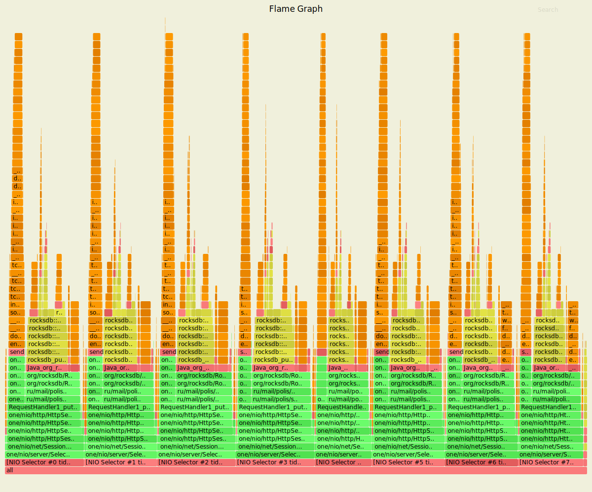
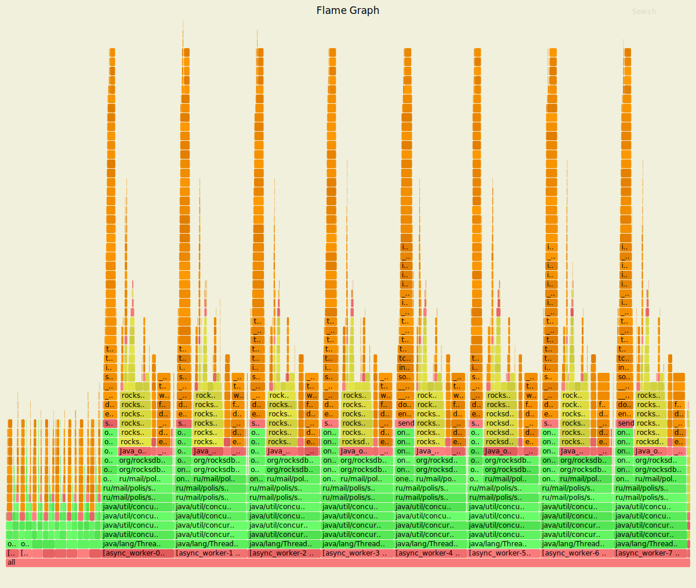
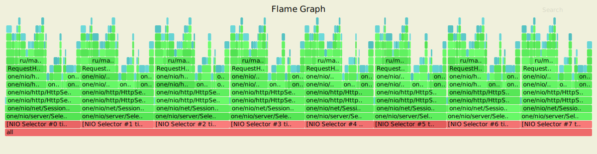
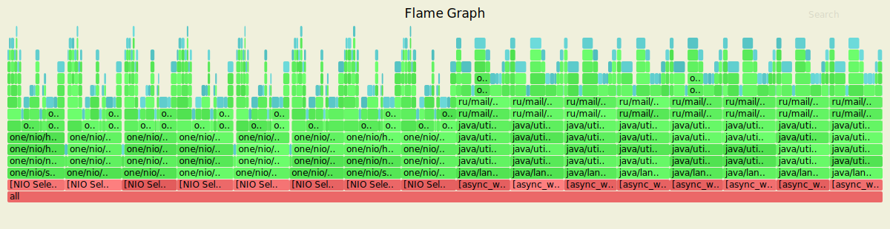
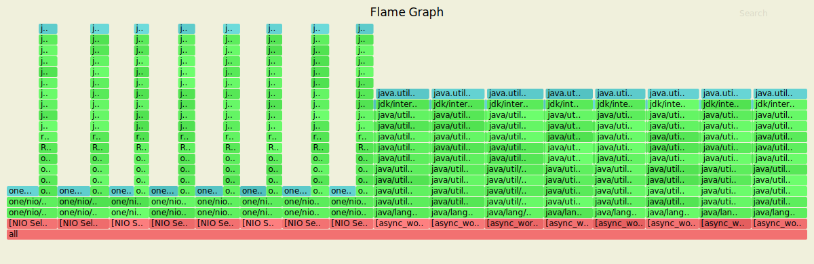
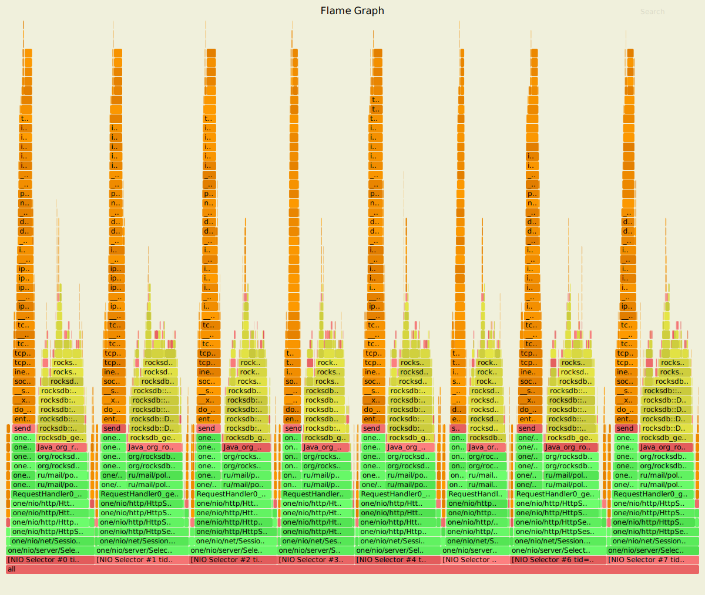
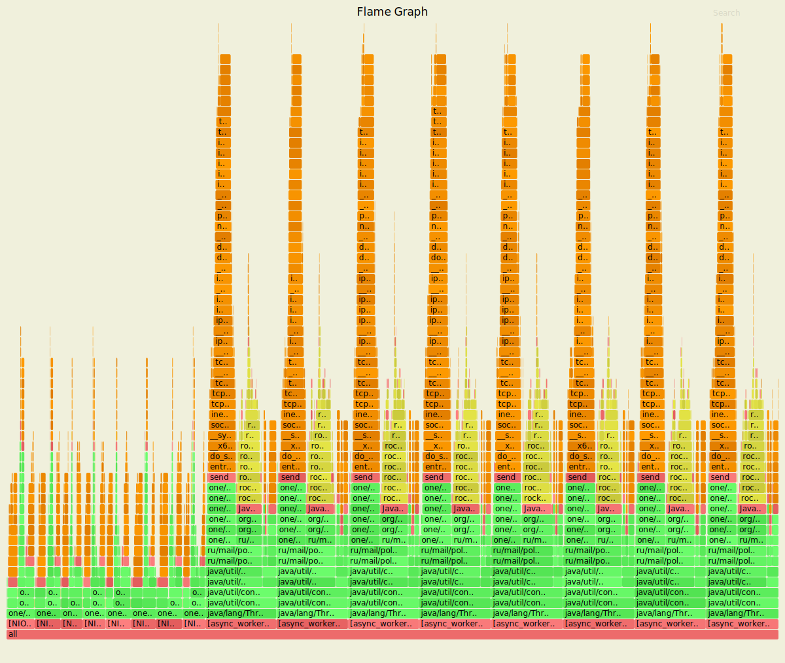
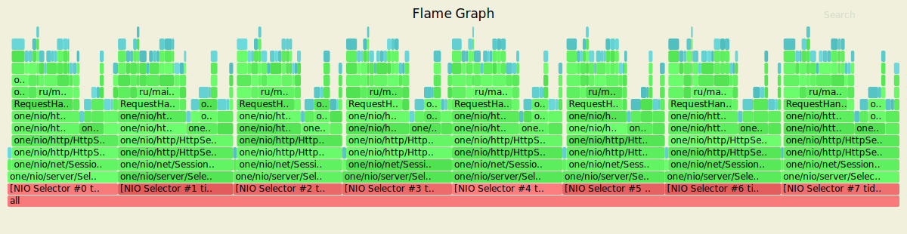
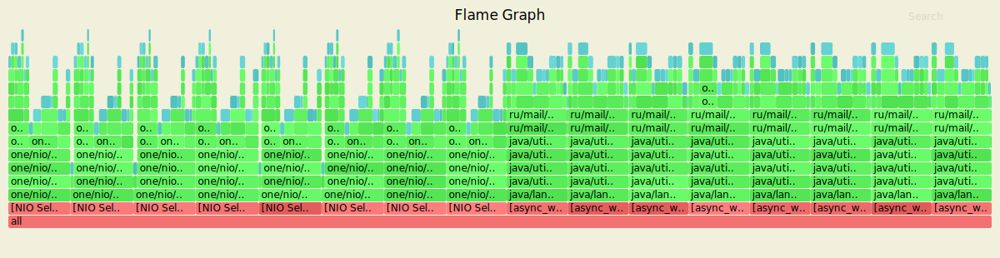
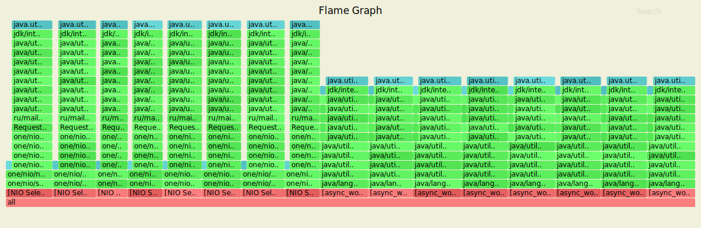

# Проифилирование нагрузки 3-го этапа
Нагрузочное тестирование с помощью wrk2 (код скрипта использовался из stage 1).
На данном этапе стреляем в 64 соединения.

## Подбор уровня оптимальной нагрузки

Первым делом определим уровень допустимой нагрузки (запросов в секунду), которое будем подавать
на наш сервис. Для этого вначале обстреляем сервис с помощью wrk с заоблачными значениями и посмотрим
что вообще способен выдержать наш сервис, затем мы начнём уменшать нагрузку до тех пор, пока не добъёмся
максимальной задержки ниже 100мс.

1. Обстрел  R = 100 000. 

Очевидно что 100 тысяч запросов непосильная нагрузка на сервис и вот что нам удалось определить:

    Thread Stats   Avg      Stdev     Max   +/- Stdev
    Latency     4.16s     8.81s   27.90s    84.45%
    Req/Sec    22.43k    11.79k   49.70k    68.71%
    Latency Distribution
    90.000%   24.22s 
    99.000%   27.00s 
    99.900%   27.89s 
    99.990%   27.92s 
    99.999%   27.92s 
    100.000%   27.92s 
    Requests/sec:  58081.75

Мы имеем задержку измеряемую в секундах, при этом мы смогли поддержать только половину запросов.

2. Обстрел R = 50 000. И так что мы видим :

    
        Thread Stats   Avg      Stdev     Max   +/- Stdev
       Latency     2.46ms    2.62ms  28.74ms   86.51%
       Req/Sec    13.06k     3.78k   29.67k    71.32%
        Latency Distribution (HdrHistogram - Recorded Latency)
        50.000%    1.59ms
        75.000%    2.59ms
        90.000%    6.70ms
        99.000%   11.40ms
        99.900%   13.61ms
        99.990%   17.15ms
        99.999%   25.04ms
        100.000%   28.75ms

И мы можем поддержать нагрузку в 50 000 запросов в секнуду с приемлемой задержкой. Если сравнить
с прошлыми замерами эта катострофическая разница, так как до этого 99.999 имела задержку близку к 
500 мс при частоте не выше 15 000 запросов. В первую очередь, это связано с переходом на более 
производительную тачку.

       Характеристика   Было                 Стало     
       Процессор        Intel I7 47000HQ     AMD Ryzen 7 4800
       Ядра\Потоки      4\8                  8\16
       Тактовая ч-а     до 3.6               до 4.6
       RAM              16gb DDR3 2600hz     16gb DDR4 3200hz
       SSD              SATA3                PCI-E NVME
      

Таким образом на этапе 3, мы будем производить замеры на частоте запросов 50000r/sec вместо 10000r/sec.
По этому в следующих этапах будут произведены новые замеры производительности прошлого этапа.
А для анализа графов мы будем использовать параметры -t для разбиения по потокам.

## Анализ PUT-запросов и сравнение с реализацией прошлого этапа

#### Результаты wrk

Использовалась следующая команда терминала:
wrk -t4 -c64 -d20s -s proffiling/lua-scripts/put.lua -R50000 --latency http://127.0.0.1:8080

Результаты не асинхронного сервиса:

    Running 20s test @ http://127.0.0.1:8080
    4 threads and 64 connections
    Thread calibration: mean lat.: 2.416ms, rate sampling interval: 10ms
    Thread calibration: mean lat.: 2.386ms, rate sampling interval: 10ms
    Thread calibration: mean lat.: 2.420ms, rate sampling interval: 10ms
    Thread calibration: mean lat.: 2.401ms, rate sampling interval: 10ms
    Thread Stats   Avg      Stdev     Max   +/- Stdev
    Latency     2.65ms    3.01ms  41.89ms   88.89%
    Req/Sec    13.57k     4.24k   34.11k    79.51%
      Latency Distribution (HdrHistogram - Recorded Latency)
    50.000%    1.76ms
    75.000%    2.84ms
    90.000%    6.25ms
    99.000%   12.06ms
    99.900%   34.40ms
    99.990%   40.54ms
    99.999%   41.50ms
    100.000%   41.92ms

    Detailed Percentile spectrum:
       Value   Percentile   TotalCount 1/(1-Percentile)

       0.024     0.000000            1         1.00
       0.579     0.100000        49686         1.11
       0.919     0.200000        99221         1.25
       1.205     0.300000       148886         1.43
       1.475     0.400000       198489         1.67
       1.761     0.500000       248144         2.00
       1.922     0.550000       272822         2.22
       2.101     0.600000       297644         2.50
       2.301     0.650000       322436         2.86
       2.535     0.700000       347304         3.33
       2.837     0.750000       372059         4.00
       3.041     0.775000       384418         4.44
       3.301     0.800000       396832         5.00
       3.643     0.825000       409205         5.71
       4.151     0.850000       421612         6.67
       4.999     0.875000       433997         8.00
       5.595     0.887500       440211         8.89
       6.247     0.900000       446400        10.00
       6.911     0.912500       452581        11.43
       7.575     0.925000       458786        13.33
       8.263     0.937500       464993        16.00
       8.599     0.943750       468144        17.78
       8.943     0.950000       471181        20.00
       9.295     0.956250       474310        22.86
       9.655     0.962500       477408        26.67
      10.031     0.968750       480501        32.00
      10.239     0.971875       482074        35.56
      10.439     0.975000       483581        40.00
      10.679     0.978125       485156        45.71
      10.951     0.981250       486716        53.33
      11.247     0.984375       488257        64.00
      11.439     0.985938       489039        71.11
      11.639     0.987500       489784        80.00
      11.879     0.989062       490557        91.43
      12.183     0.990625       491340       106.67
      12.559     0.992188       492114       128.00
      12.799     0.992969       492494       142.22
      13.183     0.993750       492886       160.00
      13.815     0.994531       493268       182.86
      15.399     0.995313       493655       213.33
      18.655     0.996094       494042       256.00
      20.751     0.996484       494238       284.44
      22.895     0.996875       494433       320.00
      24.847     0.997266       494624       365.71
      27.055     0.997656       494816       426.67
      29.007     0.998047       495010       512.00
      29.903     0.998242       495107       568.89
      30.991     0.998437       495204       640.00
      31.999     0.998633       495300       731.43
      33.247     0.998828       495398       853.33
      34.495     0.999023       495494      1024.00
      35.359     0.999121       495545      1137.78
      36.095     0.999219       495592      1280.00
      36.703     0.999316       495640      1462.86
      37.471     0.999414       495692      1706.67
      38.111     0.999512       495736      2048.00
      38.431     0.999561       495762      2275.56
      38.783     0.999609       495786      2560.00
      39.039     0.999658       495809      2925.71
      39.327     0.999707       495834      3413.33
      39.583     0.999756       495861      4096.00
      39.711     0.999780       495870      4551.11
      39.903     0.999805       495885      5120.00
      40.031     0.999829       495894      5851.43
      40.255     0.999854       495907      6826.67
      40.415     0.999878       495919      8192.00
      40.479     0.999890       495925      9102.22
      40.575     0.999902       495931     10240.00
      40.671     0.999915       495936     11702.86
      40.799     0.999927       495942     13653.33
      40.895     0.999939       495948     16384.00
      40.927     0.999945       495951     18204.44
      40.959     0.999951       495955     20480.00
      41.055     0.999957       495958     23405.71
      41.087     0.999963       495961     27306.67
      41.151     0.999969       495964     32768.00
      41.215     0.999973       495969     36408.89
      41.215     0.999976       495969     40960.00
      41.215     0.999979       495969     46811.43
      41.215     0.999982       495969     54613.33
      41.407     0.999985       495971     65536.00
      41.439     0.999986       495972     72817.78
      41.439     0.999988       495972     81920.00
      41.503     0.999989       495973     93622.86
      41.631     0.999991       495974    109226.67
      41.663     0.999992       495975    131072.00
      41.663     0.999993       495975    145635.56
      41.663     0.999994       495975    163840.00
      41.727     0.999995       495977    187245.71
      41.727     0.999995       495977    218453.33
      41.727     0.999996       495977    262144.00
      41.727     0.999997       495977    291271.11
      41.727     0.999997       495977    327680.00
      41.727     0.999997       495977    374491.43
      41.727     0.999998       495977    436906.67
      41.919     0.999998       495978    524288.00
      41.919     1.000000       495978          inf
    #[Mean    =        2.645, StdDeviation   =        3.014]
    #[Max     =       41.888, Total count    =       495978]
    #[Buckets =           27, SubBuckets     =         2048]
    ----------------------------------------------------------
    998064 requests in 20.00s, 63.77MB read
    Requests/sec:  49902.27
    Transfer/sec:      3.19MB

Результаты асинхронного сервиса:

    Running 20s test @ http://127.0.0.1:8080
    4 threads and 64 connections
    Thread calibration: mean lat.: 108.207ms, rate sampling interval: 1000ms
    Thread calibration: mean lat.: 105.327ms, rate sampling interval: 975ms
    Thread calibration: mean lat.: 106.770ms, rate sampling interval: 977ms
    Thread calibration: mean lat.: 106.019ms, rate sampling interval: 974ms
    Thread Stats   Avg      Stdev     Max   +/- Stdev
    Latency     2.74ms    2.60ms  21.57ms   87.93%
    Req/Sec    12.51k    55.25    12.64k    76.92%
    Latency Distribution (HdrHistogram - Recorded Latency)
    50.000%    1.91ms
    75.000%    3.08ms
    90.000%    6.25ms
    99.000%   12.44ms
    99.900%   17.66ms
    99.990%   20.03ms
    99.999%   21.25ms
    100.000%   21.58ms
    Detailed Percentile spectrum:
       Value   Percentile   TotalCount 1/(1-Percentile)
       0.043     0.000000            1         1.00
       0.720     0.100000        49709         1.11
       1.045     0.200000        99250         1.25
       1.331     0.300000       148843         1.43
       1.612     0.400000       198519         1.67
       1.914     0.500000       248157         2.00
       2.083     0.550000       273100         2.22
       2.271     0.600000       297826         2.50
       2.485     0.650000       322557         2.86
       2.743     0.700000       347334         3.33
       3.079     0.750000       372107         4.00
       3.299     0.775000       384543         4.44
       3.565     0.800000       396889         5.00
       3.905     0.825000       409242         5.71
       4.391     0.850000       421680         6.67
       5.139     0.875000       434082         8.00
       5.651     0.887500       440280         8.89
       6.247     0.900000       446471        10.00
       6.883     0.912500       452662        11.43
       7.551     0.925000       458854        13.33
       8.215     0.937500       465121        16.00
       8.543     0.943750       468202        17.78
       8.879     0.950000       471266        20.00
       9.223     0.956250       474352        22.86
       9.599     0.962500       477473        26.67
      10.039     0.968750       480576        32.00
      10.271     0.971875       482114        35.56
      10.527     0.975000       483651        40.00
      10.815     0.978125       485217        45.71
      11.119     0.981250       486750        53.33
      11.495     0.984375       488334        64.00
      11.703     0.985938       489080        71.11
      11.959     0.987500       489863        80.00
      12.239     0.989062       490649        91.43
      12.607     0.990625       491413       106.67
      13.015     0.992188       492180       128.00
      13.263     0.992969       492569       142.22
      13.535     0.993750       492950       160.00
      13.863     0.994531       493339       182.86
      14.271     0.995313       493729       213.33
      14.855     0.996094       494116       256.00
      15.191     0.996484       494307       284.44
      15.535     0.996875       494506       320.00
      15.903     0.997266       494698       365.71
      16.271     0.997656       494890       426.67
      16.655     0.998047       495089       512.00
      16.831     0.998242       495184       568.89
      17.007     0.998437       495278       640.00
      17.215     0.998633       495376       731.43
      17.439     0.998828       495473       853.33
      17.695     0.999023       495569      1024.00
      17.855     0.999121       495619      1137.78
      17.967     0.999219       495665      1280.00
      18.143     0.999316       495717      1462.86
      18.303     0.999414       495763      1706.67
      18.511     0.999512       495812      2048.00
      18.607     0.999561       495833      2275.56
      18.751     0.999609       495858      2560.00
      18.847     0.999658       495881      2925.71
      19.023     0.999707       495905      3413.33
      19.231     0.999756       495931      4096.00
      19.327     0.999780       495943      4551.11
      19.439     0.999805       495954      5120.00
      19.551     0.999829       495966      5851.43
      19.679     0.999854       495978      6826.67
      19.887     0.999878       495991      8192.00
      19.951     0.999890       495996      9102.22
      20.047     0.999902       496004     10240.00
      20.095     0.999915       496008     11702.86
      20.239     0.999927       496014     13653.33
      20.399     0.999939       496020     16384.00
      20.431     0.999945       496023     18204.44
      20.463     0.999951       496026     20480.00
      20.639     0.999957       496030     23405.71
      20.735     0.999963       496032     27306.67
      20.863     0.999969       496035     32768.00
      20.895     0.999973       496038     36408.89
      20.895     0.999976       496038     40960.00
      21.023     0.999979       496040     46811.43
      21.039     0.999982       496041     54613.33
      21.087     0.999985       496043     65536.00
      21.183     0.999986       496044     72817.78
      21.183     0.999988       496044     81920.00
      21.247     0.999989       496045     93622.86
      21.359     0.999991       496046    109226.67
      21.375     0.999992       496047    131072.00
      21.375     0.999993       496047    145635.56
      21.375     0.999994       496047    163840.00
      21.423     0.999995       496048    187245.71
      21.423     0.999995       496048    218453.33
      21.567     0.999996       496049    262144.00
      21.567     0.999997       496049    291271.11
      21.567     0.999997       496049    327680.00
      21.567     0.999997       496049    374491.43
      21.567     0.999998       496049    436906.67
      21.583     0.999998       496050    524288.00
      21.583     1.000000       496050          inf
    #[Mean    =        2.740, StdDeviation   =        2.604]
    #[Max     =       21.568, Total count    =       496050]
    #[Buckets =           27, SubBuckets     =         2048]
    ----------------------------------------------------------
    998035 requests in 20.00s, 63.77MB read
    Requests/sec:  49901.70
    Transfer/sec:      3.19MB

При рассмотрении двух вариантов мы видим что средняя задержка практически одинакова, но зато
максимальная задержка, которая была зафиксирована в диапазоне от 99.900 до 99.999 вдове уменьшилась,
с 40 мс до 20 мс.

#### Результаты профилирования для cpu с помощью Async-profiler
Не асинхронный:

Асинхронный:

Наша ассинхронная реализация в левом углу имеет 8 стеков NIOSelector-ов, котороые в предидущей
реализации были внизу каждого стека, каждый из воркеров при этом заниммает по 1.8% нашего процессора,
а у основания стека каждого потока мы имеем наши пронумерованные ворекры. При этом без ассинхронномтси
воркеры занимали у нас по 12% процессора на каждый поток, а воркеры 10%, при этом мы понимаем что,
раз селекторы заняты лишь на 2% то мы могли бы при наличии ресурсов и дальше увеличивать количество
соединений и потоков, особого простоя мы бы не достигили.

#### Результаты профилирования Allocation с помощью Async-profiler

Не асинхронный:

Асинхронный:

По выделению памяти в случае ассинхронной реализации мы также имеем разделение. Память у нас выделяется
под каждый наш селектор 6.47% (на поток) и отдельно ворекры. HttpSession.sendResponse у нас ожидаем
находится в воркере и занимает по 1.79% на поток, а DAO.upsert занимает всего 0.88% на поток.
В случае с не асинхронной реализацией, мы выделиляли 1.2% на ответ и 1.32% на запрос в базу.

При этом в обоих случаях мы тратили достаточно много на выделение памяти под парсинг запроса.
Но в асинхронной реализации граф показывает что мы тратили на это меньше 1.61% вместо 6.4%.
 
#### Результаты профилирования Lock с помощью Async-profiler
 
 Не асинхронный:
 
 Асинхронный:
 

В данном случае это самое главное отличие двух реализаций. На прошлом этапе у нас ничего нигде не 
блокировалось, а в асинхронной реализации уже показывает себя ArrayBlockingQueue. Как бы то нибыло,
все потоки одинаковых размеров, а значит мы не имеем доминирующих и голодающих потоков.
 
 
 ## Анализ GET-запросов и сравнение с реализацией прошлого этапа
 #### Результаты wrk
 Использовалась следующая команда терминала:
 wrk -t4 -c64 -d20s -s proffiling/lua-scripts/get.lua -R50000 --latency http://127.0.0.1:8080
 
 Результаты не асинхронного сервиса:

    Running 20s test @ http://127.0.0.1:8080
      4 threads and 64 connections
      Thread calibration: mean lat.: 2.111ms, rate sampling interval: 10ms
      Thread calibration: mean lat.: 2.142ms, rate sampling interval: 10ms
      Thread calibration: mean lat.: 2.124ms, rate sampling interval: 10ms
      Thread calibration: mean lat.: 2.131ms, rate sampling interval: 10ms
      Thread Stats   Avg      Stdev     Max   +/- Stdev
        Latency     1.99ms    1.84ms  20.02ms   91.37%
        Req/Sec    13.40k     3.05k   33.89k    88.09%
      Latency Distribution (HdrHistogram - Recorded Latency)
     50.000%    1.57ms
     75.000%    2.32ms
     90.000%    3.32ms
     99.000%   10.65ms
     99.900%   13.06ms
     99.990%   16.33ms
     99.999%   18.88ms
    100.000%   20.03ms
    
      Detailed Percentile spectrum:
           Value   Percentile   TotalCount 1/(1-Percentile)
    
           0.017     0.000000            1         1.00
           0.551     0.100000        49641         1.11
           0.876     0.200000        99395         1.25
           1.117     0.300000       148863         1.43
           1.343     0.400000       198513         1.67
           1.571     0.500000       248098         2.00
           1.697     0.550000       272892         2.22
           1.840     0.600000       297700         2.50
           1.994     0.650000       322426         2.86
           2.155     0.700000       347243         3.33
           2.321     0.750000       372094         4.00
           2.413     0.775000       384604         4.44
           2.515     0.800000       396883         5.00
           2.639     0.825000       409304         5.71
           2.805     0.850000       421637         6.67
           3.035     0.875000       434054         8.00
           3.167     0.887500       440214         8.89
           3.317     0.900000       446458        10.00
           3.499     0.912500       452656        11.43
           3.761     0.925000       458848        13.33
           4.215     0.937500       465012        16.00
           4.571     0.943750       468115        17.78
           5.135     0.950000       471218        20.00
           5.959     0.956250       474314        22.86
           6.815     0.962500       477414        26.67
           7.711     0.968750       480518        32.00
           8.191     0.971875       482055        35.56
           8.623     0.975000       483618        40.00
           9.071     0.978125       485173        45.71
           9.495     0.981250       486717        53.33
           9.911     0.984375       488273        64.00
          10.111     0.985938       489034        71.11
          10.327     0.987500       489827        80.00
          10.527     0.989062       490580        91.43
          10.751     0.990625       491372       106.67
          10.991     0.992188       492147       128.00
          11.127     0.992969       492526       142.22
          11.255     0.993750       492918       160.00
          11.391     0.994531       493307       182.86
          11.543     0.995313       493685       213.33
          11.727     0.996094       494074       256.00
          11.823     0.996484       494260       284.44
          11.935     0.996875       494455       320.00
          12.055     0.997266       494647       365.71
          12.223     0.997656       494844       426.67
          12.391     0.998047       495037       512.00
          12.471     0.998242       495133       568.89
          12.583     0.998437       495227       640.00
          12.719     0.998633       495328       731.43
          12.895     0.998828       495423       853.33
          13.079     0.999023       495520      1024.00
          13.183     0.999121       495567      1137.78
          13.311     0.999219       495617      1280.00
          13.463     0.999316       495664      1462.86
          13.631     0.999414       495712      1706.67
          13.831     0.999512       495760      2048.00
          14.015     0.999561       495785      2275.56
          14.143     0.999609       495809      2560.00
          14.359     0.999658       495833      2925.71
          14.607     0.999707       495857      3413.33
          14.911     0.999756       495882      4096.00
          15.143     0.999780       495894      4551.11
          15.295     0.999805       495906      5120.00
          15.535     0.999829       495918      5851.43
          15.807     0.999854       495930      6826.67
          16.047     0.999878       495942      8192.00
          16.199     0.999890       495948      9102.22
          16.399     0.999902       495954     10240.00
          16.687     0.999915       495960     11702.86
          17.023     0.999927       495966     13653.33
          17.551     0.999939       495972     16384.00
          17.743     0.999945       495975     18204.44
          17.871     0.999951       495978     20480.00
          18.047     0.999957       495981     23405.71
          18.335     0.999963       495984     27306.67
          18.495     0.999969       495987     32768.00
          18.575     0.999973       495989     36408.89
          18.703     0.999976       495990     40960.00
          18.751     0.999979       495993     46811.43
          18.751     0.999982       495993     54613.33
          18.815     0.999985       495995     65536.00
          18.831     0.999986       495996     72817.78
          18.831     0.999988       495996     81920.00
          18.879     0.999989       495997     93622.86
          18.975     0.999991       495998    109226.67
          19.071     0.999992       495999    131072.00
          19.071     0.999993       495999    145635.56
          19.071     0.999994       495999    163840.00
          19.087     0.999995       496000    187245.71
          19.087     0.999995       496000    218453.33
          19.695     0.999996       496001    262144.00
          19.695     0.999997       496001    291271.11
          19.695     0.999997       496001    327680.00
          19.695     0.999997       496001    374491.43
          19.695     0.999998       496001    436906.67
          20.031     0.999998       496002    524288.00
          20.031     1.000000       496002          inf
    #[Mean    =        1.988, StdDeviation   =        1.842]
    #[Max     =       20.016, Total count    =       496002]
    #[Buckets =           27, SubBuckets     =         2048]
    ----------------------------------------------------------
      998025 requests in 20.00s, 69.97MB read
    Requests/sec:  49899.99
    Transfer/sec:      3.50MB

 Результаты асинхронного сервиса:
 
    Running 50s test @ http://127.0.0.1:8080/
      4 threads and 64 connections
      Thread calibration: mean lat.: 2.372ms, rate sampling interval: 10ms
      Thread calibration: mean lat.: 2.375ms, rate sampling interval: 10ms
      Thread calibration: mean lat.: 2.371ms, rate sampling interval: 10ms
      Thread calibration: mean lat.: 2.388ms, rate sampling interval: 10ms
      Thread Stats   Avg      Stdev     Max   +/- Stdev
        Latency     1.83ms    1.46ms  29.89ms   86.83%
        Req/Sec    13.27k     2.13k   36.89k    81.45%
      Latency Distribution (HdrHistogram - Recorded Latency)
     50.000%    1.60ms
     75.000%    2.32ms
     90.000%    3.09ms
     99.000%    8.33ms
     99.900%   15.10ms
     99.990%   21.06ms
     99.999%   28.21ms
    100.000%   29.90ms
    
      Detailed Percentile spectrum:
           Value   Percentile   TotalCount 1/(1-Percentile)
    
           0.029     0.000000            1         1.00
           0.539     0.100000       199609         1.11
           0.856     0.200000       399695         1.25
           1.121     0.300000       599162         1.43
           1.363     0.400000       798661         1.67
           1.601     0.500000       998101         2.00
           1.726     0.550000      1098411         2.22
           1.858     0.600000      1197684         2.50
           2.002     0.650000      1298080         2.86
           2.155     0.700000      1397725         3.33
           2.323     0.750000      1497866         4.00
           2.413     0.775000      1547281         4.44
           2.513     0.800000      1597697         5.00
           2.621     0.825000      1647087         5.71
           2.747     0.850000      1696981         6.67
           2.899     0.875000      1746787         8.00
           2.989     0.887500      1771968         8.89
           3.091     0.900000      1796841        10.00
           3.205     0.912500      1821643        11.43
           3.337     0.925000      1846357        13.33
           3.495     0.937500      1871295        16.00
           3.591     0.943750      1883735        17.78
           3.703     0.950000      1896286        20.00
           3.841     0.956250      1908766        22.86
           4.013     0.962500      1921170        26.67
           4.243     0.968750      1933651        32.00
           4.395     0.971875      1939905        35.56
           4.595     0.975000      1946199        40.00
           4.875     0.978125      1952361        45.71
           5.315     0.981250      1958619        53.33
           6.031     0.984375      1964818        64.00
           6.563     0.985938      1967938        71.11
           7.179     0.987500      1971052        80.00
           7.887     0.989062      1974184        91.43
           8.639     0.990625      1977294       106.67
           9.479     0.992188      1980425       128.00
           9.927     0.992969      1981993       142.22
          10.359     0.993750      1983543       160.00
          10.815     0.994531      1985085       182.86
          11.303     0.995313      1986663       213.33
          11.815     0.996094      1988217       256.00
          12.095     0.996484      1988993       284.44
          12.415     0.996875      1989778       320.00
          12.751     0.997266      1990547       365.71
          13.127     0.997656      1991332       426.67
          13.567     0.998047      1992108       512.00
          13.783     0.998242      1992495       568.89
          14.063     0.998437      1992888       640.00
          14.391     0.998633      1993276       731.43
          14.727     0.998828      1993665       853.33
          15.159     0.999023      1994055      1024.00
          15.415     0.999121      1994249      1137.78
          15.711     0.999219      1994442      1280.00
          16.007     0.999316      1994637      1462.86
          16.415     0.999414      1994836      1706.67
          16.863     0.999512      1995030      2048.00
          17.103     0.999561      1995126      2275.56
          17.375     0.999609      1995223      2560.00
          17.727     0.999658      1995318      2925.71
          18.079     0.999707      1995418      3413.33
          18.527     0.999756      1995513      4096.00
          18.863     0.999780      1995562      4551.11
          19.183     0.999805      1995611      5120.00
          19.535     0.999829      1995659      5851.43
          19.887     0.999854      1995710      6826.67
          20.463     0.999878      1995757      8192.00
          20.863     0.999890      1995783      9102.22
          21.215     0.999902      1995807     10240.00
          21.727     0.999915      1995830     11702.86
          22.271     0.999927      1995855     13653.33
          23.375     0.999939      1995879     16384.00
          23.871     0.999945      1995891     18204.44
          24.319     0.999951      1995903     20480.00
          25.039     0.999957      1995915     23405.71
          25.455     0.999963      1995927     27306.67
          26.319     0.999969      1995940     32768.00
          26.655     0.999973      1995946     36408.89
          26.879     0.999976      1995953     40960.00
          27.135     0.999979      1995958     46811.43
          27.407     0.999982      1995964     54613.33
          27.567     0.999985      1995970     65536.00
          27.647     0.999986      1995973     72817.78
          27.871     0.999988      1995976     81920.00
          28.191     0.999989      1995979     93622.86
          28.255     0.999991      1995983    109226.67
          28.319     0.999992      1995985    131072.00
          28.447     0.999993      1995987    145635.56
          28.463     0.999994      1995988    163840.00
          28.527     0.999995      1995990    187245.71
          28.559     0.999995      1995991    218453.33
          28.639     0.999996      1995993    262144.00
          28.719     0.999997      1995994    291271.11
          28.719     0.999997      1995994    327680.00
          28.751     0.999997      1995995    374491.43
          28.767     0.999998      1995996    436906.67
          29.183     0.999998      1995997    524288.00
          29.183     0.999998      1995997    582542.22
          29.183     0.999998      1995997    655360.00
          29.295     0.999999      1995998    748982.86
          29.295     0.999999      1995998    873813.33
          29.407     0.999999      1995999   1048576.00
          29.407     0.999999      1995999   1165084.44
          29.407     0.999999      1995999   1310720.00
          29.407     0.999999      1995999   1497965.71
          29.407     0.999999      1995999   1747626.67
          29.903     1.000000      1996000   2097152.00
          29.903     1.000000      1996000          inf
    #[Mean    =        1.833, StdDeviation   =        1.463]
    #[Max     =       29.888, Total count    =      1996000]
    #[Buckets =           27, SubBuckets     =         2048]
    ----------------------------------------------------------
      2498047 requests in 50.00s, 175.83MB read
    Requests/sec:  49959.64
    Transfer/sec:      3.52MB

В случае get, мы имеем примерно одинаковую среднюю задержку, но в случае с асинхронной реализацеией
её максимальные значения увеличились с 18-20 мс до 21-29 для 99.900-100%. Это всё равно не критичная,
задерка, особенно учитывая что для LSM хранилищ put является наиболее важной операцией. 
  
 #### Результаты профилирования для cpu с помощью Async-profiler
   
 Не асинхронный:
 
 Асинхронный:
 

 Аналогично put-запросам, в асинхронной реализации у нас появились отдельные потоки селекторов, в случае
 с get запросом они тратят 3.2% на поток. 3.6% на поток уходит на операцию get (DAOImpl) при асинхронной реализации
 и 7.19% при обычной. На отправку ответа в случае в асинхронной реализации тратится 4.11% на поток, а в
 обычной 3.6% (HttpSession.sendResponse).
 
 #### Результаты профилирования Allocation с помощью Async-profiler
 
 Не асинхронный:
  
  Асинхронный:
  
 
 По выделению памяти в случае ассинхронной реализации мы также имеем разделение. Память у нас выделяется
 под каждый наш селектор 6.4% (на поток) и отдельно ворекры 6.22 (в не асинхронной реализации орба стека
 объединены и занимают 12.3%. HttpSession.sendResponse занимает по 1.76% на поток, 
 а DAO.get занимает 1.66% на поток.
 В случае с не асинхронной реализацией, мы выделиляли 1.7% на ответ и 1.5% на запрос в базу.
 
 При этом в обоих случаях мы тратили достаточно много на выделение памяти под парсинг запроса.
 Но в асинхронной реализации граф показывает что мы тратили на это меньше 1.61% вместо 6.4%.

#### Результаты профилирования Lock с помощью Async-profiler
 
 Не асинхронный:
  
  Асинхронный:
  

На прошлом этапе у нас ничего нигде не 
блокировалось, а в асинхронной реализации уже показывает себя ArrayBlockingQueue. Как бы то нибыло,
все потоки одинаковых размеров, а значит мы не имеем доминирующих и голодающих потоков.

### Выводы
Резюмирую, первое что мы смогли добится асинхронностью - разделение стеков в программе, и теперь
мы видимо насколько на самом деле нагруженны сокеты и селекторы, от сюда можно делать расчёты
на более мощные машины и большее количество соединений.

Хранилище показало себя со стороны крайне производительного и быстрого, дажерп и 50 000 запросах в
секунду, 64 соединениях она удерживает задержку ниже 30 мс. Смена рабочей станции также сильно
повлияло на производительность сервиса (не удвитиельно).

В случае с put запросом, асинхронный вариант показал немного хуже, так как немного увеличил 
максимальную задержку на 0.5 раза, а в случае с put запросом мы наоборот уменшьили максимальную
задержку но уже в 2 раза. В целом и та и та реализация является достаточно производительной, но
асинхронная реализация является более разумной, так как мы можем отдавать ещё большее количество
потоков на работу сервиса, так как мы смогли разгрузить селекторы.
