# New data
## RendezvousHashingImpl 
### Put
 
    pc@pc-VirtualBox:~/projects/2020-highload-dht$ wrk -t4 -c64 -d60s -s proffiling/lua-scripts/put.lua -R35000 -L http://127.0.0.1:8080
    Running 1m test @ http://127.0.0.1:8080
    4 threads and 64 connections
    Thread calibration: mean lat.: 1.958ms, rate sampling interval: 10ms
    Thread calibration: mean lat.: 1.956ms, rate sampling interval: 10ms
    Thread calibration: mean lat.: 1.957ms, rate sampling interval: 10ms
    Thread calibration: mean lat.: 1.960ms, rate sampling interval: 10ms
    Thread Stats   Avg      Stdev     Max   +/- Stdev
    Latency     1.94ms    1.06ms  23.26ms   74.71%
    Req/Sec     9.24k     1.10k   17.44k    72.35%
      Latency Distribution (HdrHistogram - Recorded Latency)
    50.000%    1.75ms
    75.000%    2.49ms
    90.000%    3.25ms
    99.000%    4.91ms
    99.900%   10.33ms
    99.990%   15.98ms
    99.999%   18.85ms
    100.000%   23.28ms

    Detailed Percentile spectrum:
       Value   Percentile   TotalCount 1/(1-Percentile)

       0.075     0.000000            1         1.00
       0.842     0.100000       174781         1.11
       1.092     0.200000       349478         1.25
       1.307     0.300000       524697         1.43
       1.520     0.400000       699519         1.67
       1.748     0.500000       873636         2.00
       1.873     0.550000       960957         2.22
       2.008     0.600000      1048788         2.50
       2.155     0.650000      1136783         2.86
       2.313     0.700000      1223454         3.33
       2.489     0.750000      1310647         4.00
       2.585     0.775000      1354105         4.44
       2.691     0.800000      1398127         5.00
       2.805     0.825000      1441658         5.71
       2.933     0.850000      1485545         6.67
       3.079     0.875000      1529315         8.00
       3.159     0.887500      1551005         8.89
       3.247     0.900000      1572610        10.00
       3.345     0.912500      1594439        11.43
       3.455     0.925000      1616214        13.33
       3.581     0.937500      1638142        16.00
       3.653     0.943750      1648932        17.78
       3.735     0.950000      1659963        20.00
       3.827     0.956250      1670946        22.86
       3.933     0.962500      1681866        26.67
       4.057     0.968750      1692612        32.00
       4.131     0.971875      1698133        35.56
       4.215     0.975000      1703641        40.00
       4.311     0.978125      1709124        45.71
       4.419     0.981250      1714506        53.33
       4.551     0.984375      1719900        64.00
       4.631     0.985938      1722638        71.11
       4.723     0.987500      1725399        80.00
       4.831     0.989062      1728145        91.43
       4.967     0.990625      1730823       106.67
       5.143     0.992188      1733560       128.00
       5.255     0.992969      1734930       142.22
       5.391     0.993750      1736289       160.00
       5.559     0.994531      1737672       182.86
       5.783     0.995313      1739016       213.33
       6.139     0.996094      1740372       256.00
       6.403     0.996484      1741060       284.44
       6.743     0.996875      1741745       320.00
       7.151     0.997266      1742421       365.71
       7.607     0.997656      1743101       426.67
       8.147     0.998047      1743791       512.00
       8.447     0.998242      1744128       568.89
       8.815     0.998437      1744474       640.00
       9.199     0.998633      1744807       731.43
       9.743     0.998828      1745147       853.33
      10.415     0.999023      1745489      1024.00
      10.799     0.999121      1745659      1137.78
      11.223     0.999219      1745831      1280.00
      11.679     0.999316      1746000      1462.86
      12.111     0.999414      1746177      1706.67
      12.535     0.999512      1746341      2048.00
      12.727     0.999561      1746427      2275.56
      12.959     0.999609      1746513      2560.00
      13.207     0.999658      1746599      2925.71
      13.559     0.999707      1746683      3413.33
      13.935     0.999756      1746768      4096.00
      14.255     0.999780      1746812      4551.11
      14.495     0.999805      1746854      5120.00
      14.831     0.999829      1746896      5851.43
      15.183     0.999854      1746939      6826.67
      15.583     0.999878      1746982      8192.00
      15.807     0.999890      1747004      9102.22
      16.015     0.999902      1747024     10240.00
      16.183     0.999915      1747045     11702.86
      16.431     0.999927      1747069     13653.33
      16.591     0.999939      1747089     16384.00
      16.735     0.999945      1747099     18204.44
      16.847     0.999951      1747109     20480.00
      17.023     0.999957      1747120     23405.71
      17.167     0.999963      1747131     27306.67
      17.359     0.999969      1747142     32768.00
      17.407     0.999973      1747147     36408.89
      17.519     0.999976      1747152     40960.00
      17.599     0.999979      1747157     46811.43
      17.887     0.999982      1747163     54613.33
      18.063     0.999985      1747168     65536.00
      18.143     0.999986      1747171     72817.78
      18.591     0.999988      1747173     81920.00
      18.767     0.999989      1747176     93622.86
      19.055     0.999991      1747179    109226.67
      19.343     0.999992      1747181    131072.00
      20.127     0.999993      1747183    145635.56
      20.223     0.999994      1747184    163840.00
      20.367     0.999995      1747185    187245.71
      21.471     0.999995      1747187    218453.33
      21.647     0.999996      1747188    262144.00
      22.335     0.999997      1747189    291271.11
      22.335     0.999997      1747189    327680.00
      22.351     0.999997      1747190    374491.43
      22.559     0.999998      1747191    436906.67
      22.559     0.999998      1747191    524288.00
      22.879     0.999998      1747192    582542.22
      22.879     0.999998      1747192    655360.00
      22.879     0.999999      1747192    748982.86
      23.103     0.999999      1747193    873813.33
      23.103     0.999999      1747193   1048576.00
      23.103     0.999999      1747193   1165084.44
      23.103     0.999999      1747193   1310720.00
      23.103     0.999999      1747193   1497965.71
      23.279     0.999999      1747194   1747626.67
      23.279     1.000000      1747194          inf
    #[Mean    =        1.940, StdDeviation   =        1.055]
    #[Max     =       23.264, Total count    =      1747194]
    #[Buckets =           27, SubBuckets     =         2048]
    ----------------------------------------------------------
    2098660 requests in 1.00m, 179.30MB read
    Requests/sec:  34977.91
    Transfer/sec:      2.99MB

В сравнении с прошлыми замерами, проводимыми до ревью, мы видим что задержка и среднее время
упало. Возможно сказались исправления изменений по ревью и\или работа ПК. Но мы можем поднять
нагрузку до 45000 запросов в секунду и замерить и для хеширования рандеву и для хеширования по модулю.

    pc@pc-VirtualBox:~/projects/2020-highload-dht$ wrk -t4 -c64 -d60s -s proffiling/lua-scripts/put.lua -R45000 -L http://127.0.0.1:8080
    Running 1m test @ http://127.0.0.1:8080
    4 threads and 64 connections
    Thread calibration: mean lat.: 6.251ms, rate sampling interval: 22ms
    Thread calibration: mean lat.: 5.905ms, rate sampling interval: 21ms
    Thread calibration: mean lat.: 5.773ms, rate sampling interval: 21ms
    Thread calibration: mean lat.: 6.258ms, rate sampling interval: 22ms
    Thread Stats   Avg      Stdev     Max   +/- Stdev
    Latency     3.52ms    3.68ms  45.66ms   87.10%
    Req/Sec    11.56k     2.11k   19.35k    68.20%
    Latency Distribution (HdrHistogram - Recorded Latency)
    50.000%    2.15ms
    75.000%    4.30ms
    90.000%    8.10ms
    99.000%   17.52ms
    99.900%   33.60ms
    99.990%   38.17ms
    99.999%   41.22ms
    100.000%   45.69ms

    Detailed Percentile spectrum:
       Value   Percentile   TotalCount 1/(1-Percentile)

       0.083     0.000000            1         1.00
       0.933     0.100000       224936         1.11
       1.221     0.200000       449803         1.25
       1.487     0.300000       674283         1.43
       1.782     0.400000       898779         1.67
       2.149     0.500000      1123985         2.00
       2.377     0.550000      1236245         2.22
       2.653     0.600000      1348057         2.50
       3.013     0.650000      1460267         2.86
       3.525     0.700000      1572509         3.33
       4.295     0.750000      1685165         4.00
       4.791     0.775000      1741033         4.44
       5.355     0.800000      1797488         5.00
       5.959     0.825000      1853352         5.71
       6.611     0.850000      1909667         6.67
       7.315     0.875000      1965820         8.00
       7.695     0.887500      1993732         8.89
       8.099     0.900000      2021777        10.00
       8.543     0.912500      2050044        11.43
       9.039     0.925000      2078220        13.33
       9.615     0.937500      2106237        16.00
       9.959     0.943750      2120368        17.78
      10.335     0.950000      2134256        20.00
      10.775     0.956250      2148221        22.86
      11.303     0.962500      2162263        26.67
      11.943     0.968750      2176258        32.00
      12.311     0.971875      2183320        35.56
      12.711     0.975000      2190361        40.00
      13.167     0.978125      2197274        45.71
      13.719     0.981250      2204293        53.33
      14.479     0.984375      2211351        64.00
      15.023     0.985938      2214875        71.11
      15.799     0.987500      2218338        80.00
      16.799     0.989062      2221866        91.43
      18.047     0.990625      2225372       106.67
      19.631     0.992188      2228884       128.00
      20.607     0.992969      2230622       142.22
      21.695     0.993750      2232383       160.00
      22.991     0.994531      2234152       182.86
      24.351     0.995313      2235894       213.33
      25.695     0.996094      2237647       256.00
      26.431     0.996484      2238533       284.44
      27.183     0.996875      2239409       320.00
      28.031     0.997266      2240276       365.71
      28.991     0.997656      2241155       426.67
      30.255     0.998047      2242034       512.00
      30.959     0.998242      2242475       568.89
      31.663     0.998437      2242905       640.00
      32.335     0.998633      2243356       731.43
      32.991     0.998828      2243781       853.33
      33.695     0.999023      2244241      1024.00
      34.015     0.999121      2244457      1137.78
      34.335     0.999219      2244666      1280.00
      34.687     0.999316      2244884      1462.86
      35.071     0.999414      2245114      1706.67
      35.487     0.999512      2245328      2048.00
      35.743     0.999561      2245442      2275.56
      35.935     0.999609      2245541      2560.00
      36.191     0.999658      2245651      2925.71
      36.511     0.999707      2245771      3413.33
      36.767     0.999756      2245865      4096.00
      37.023     0.999780      2245932      4551.11
      37.183     0.999805      2245979      5120.00
      37.439     0.999829      2246032      5851.43
      37.663     0.999854      2246090      6826.67
      37.887     0.999878      2246141      8192.00
      38.079     0.999890      2246169      9102.22
      38.207     0.999902      2246198     10240.00
      38.431     0.999915      2246225     11702.86
      38.719     0.999927      2246251     13653.33
      39.007     0.999939      2246278     16384.00
      39.199     0.999945      2246293     18204.44
      39.423     0.999951      2246304     20480.00
      39.551     0.999957      2246318     23405.71
      39.711     0.999963      2246331     27306.67
      39.967     0.999969      2246345     32768.00
      40.127     0.999973      2246352     36408.89
      40.415     0.999976      2246360     40960.00
      40.575     0.999979      2246369     46811.43
      40.639     0.999982      2246372     54613.33
      40.767     0.999985      2246379     65536.00
      40.927     0.999986      2246383     72817.78
      40.959     0.999988      2246386     81920.00
      41.151     0.999989      2246390     93622.86
      41.279     0.999991      2246393    109226.67
      41.695     0.999992      2246396    131072.00
      42.111     0.999993      2246398    145635.56
      42.495     0.999994      2246401    163840.00
      42.783     0.999995      2246402    187245.71
      43.263     0.999995      2246403    218453.33
      43.679     0.999996      2246405    262144.00
      43.967     0.999997      2246406    291271.11
      44.255     0.999997      2246407    327680.00
      44.543     0.999997      2246408    374491.43
      44.543     0.999998      2246408    436906.67
      44.767     0.999998      2246409    524288.00
      45.151     0.999998      2246410    582542.22
      45.151     0.999998      2246410    655360.00
      45.407     0.999999      2246411    748982.86
      45.407     0.999999      2246411    873813.33
      45.407     0.999999      2246411   1048576.00
      45.599     0.999999      2246412   1165084.44
      45.599     0.999999      2246412   1310720.00
      45.599     0.999999      2246412   1497965.71
      45.599     0.999999      2246412   1747626.67
      45.599     1.000000      2246412   2097152.00
      45.695     1.000000      2246413   2330168.89
      45.695     1.000000      2246413          inf
    #[Mean    =        3.516, StdDeviation   =        3.679]
    #[Max     =       45.664, Total count    =      2246413]
    #[Buckets =           27, SubBuckets     =         2048]
    ----------------------------------------------------------
    2698245 requests in 1.00m, 230.52MB read
    Requests/sec:  44970.79
    Transfer/sec:      3.84MB

#### Cpu
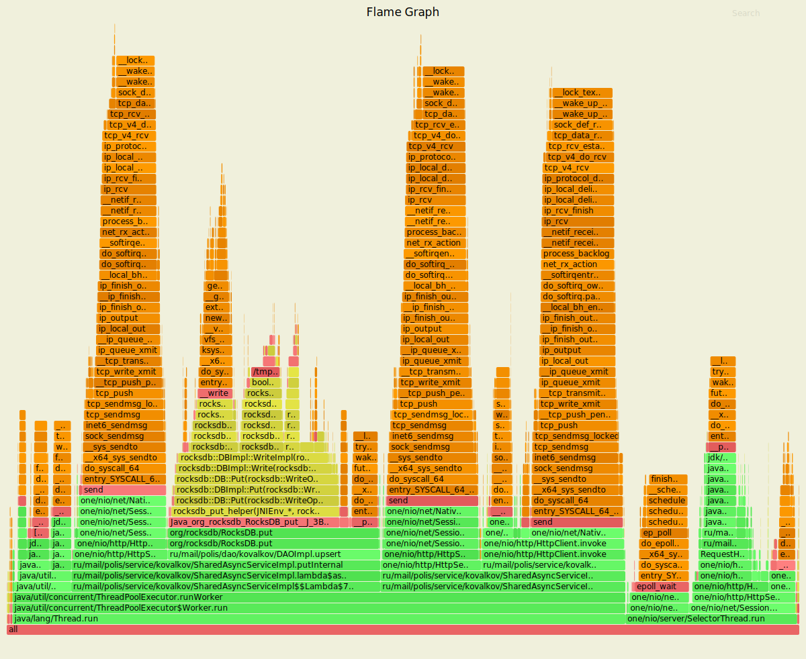
На TreeMap тратится всего лишь 0.36% времени. Зато на хеширование по модулю hashCode тратит 0.5%.
#### Alloc
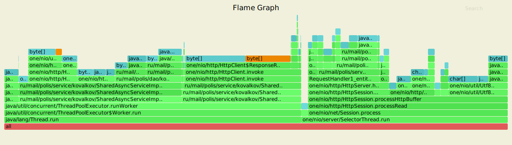
7.31% мы тратим на identifyByKey из которых 6% занимает TreeMap ( 1.65% на саму мапу и 3.9% на put).
В хешировании по модулю handleRequest занимает 6% место 14, при этом аллокация на само хеширование судя по всему
спрятана как лямбда в стеке checkIdAndReturnTargetNode и занимает 1.92% (весь стек целиком).  
#### Lock
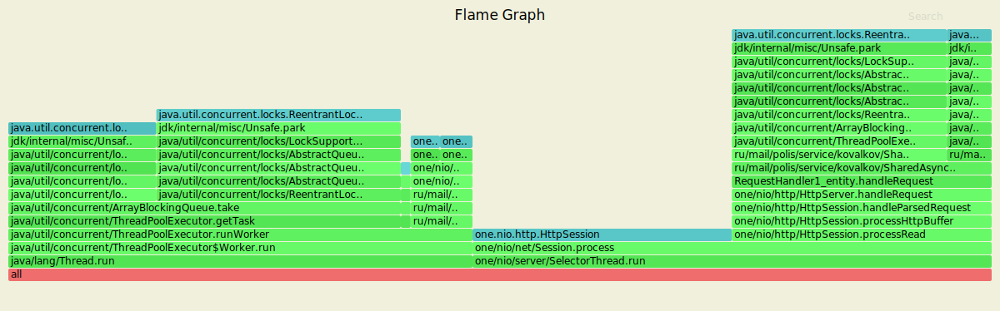
Аналогичные хешированию по модулю блокировки, зато видно, что после ревью уменьшились блокировки
на сессии.
### Get
    pc@pc-VirtualBox:~/projects/2020-highload-dht$ wrk -t4 -c64 -d60s -s proffiling/lua-scripts/get.lua -R45000 -L http://127.0.0.1:8080
    Running 1m test @ http://127.0.0.1:8080
    4 threads and 64 connections
    Thread calibration: mean lat.: 4.966ms, rate sampling interval: 19ms
    Thread calibration: mean lat.: 5.033ms, rate sampling interval: 20ms
    Thread calibration: mean lat.: 4.994ms, rate sampling interval: 19ms
    Thread calibration: mean lat.: 4.849ms, rate sampling interval: 20ms
    Thread Stats   Avg      Stdev     Max   +/- Stdev
    Latency     3.09ms    2.85ms  36.80ms   84.59%
    Req/Sec    11.61k     2.32k   26.83k    68.14%
      Latency Distribution (HdrHistogram - Recorded Latency)
    50.000%    1.99ms
    75.000%    3.78ms
    90.000%    7.43ms
    99.000%   12.48ms
    99.900%   21.87ms
    99.990%   29.26ms
    99.999%   32.11ms
    100.000%   36.83ms

    Detailed Percentile spectrum:
       Value   Percentile   TotalCount 1/(1-Percentile)

       0.074     0.000000            1         1.00
       0.867     0.100000       224892         1.11
       1.144     0.200000       449356         1.25
       1.397     0.300000       674613         1.43
       1.667     0.400000       898999         1.67
       1.990     0.500000      1123760         2.00
       2.187     0.550000      1236178         2.22
       2.419     0.600000      1348220         2.50
       2.713     0.650000      1460200         2.86
       3.133     0.700000      1572888         3.33
       3.781     0.750000      1684974         4.00
       4.231     0.775000      1741013         4.44
       4.771     0.800000      1797489         5.00
       5.371     0.825000      1853550         5.71
       6.019     0.850000      1909674         6.67
       6.703     0.875000      1965771         8.00
       7.055     0.887500      1993706         8.89
       7.427     0.900000      2021930        10.00
       7.815     0.912500      2050120        11.43
       8.231     0.925000      2078277        13.33
       8.679     0.937500      2106142        16.00
       8.927     0.943750      2120166        17.78
       9.199     0.950000      2134368        20.00
       9.495     0.956250      2148298        22.86
       9.831     0.962500      2162331        26.67
      10.215     0.968750      2176277        32.00
      10.439     0.971875      2183300        35.56
      10.695     0.975000      2190425        40.00
      10.967     0.978125      2197298        45.71
      11.287     0.981250      2204439        53.33
      11.647     0.984375      2211340        64.00
      11.863     0.985938      2214944        71.11
      12.087     0.987500      2218444        80.00
      12.327     0.989062      2221930        91.43
      12.599     0.990625      2225461       106.67
      12.895     0.992188      2228878       128.00
      13.071     0.992969      2230669       142.22
      13.263     0.993750      2232406       160.00
      13.479     0.994531      2234140       182.86
      13.775     0.995313      2235929       213.33
      14.127     0.996094      2237675       256.00
      14.367     0.996484      2238528       284.44
      14.679     0.996875      2239399       320.00
      15.135     0.997266      2240277       365.71
      15.991     0.997656      2241154       426.67
      17.615     0.998047      2242032       512.00
      18.559     0.998242      2242478       568.89
      19.391     0.998437      2242913       640.00
      20.223     0.998633      2243351       731.43
      21.103     0.998828      2243788       853.33
      21.967     0.999023      2244230      1024.00
      22.415     0.999121      2244445      1137.78
      22.975     0.999219      2244664      1280.00
      23.631     0.999316      2244884      1462.86
      24.415     0.999414      2245103      1706.67
      25.231     0.999512      2245328      2048.00
      25.599     0.999561      2245435      2275.56
      25.951     0.999609      2245545      2560.00
      26.271     0.999658      2245655      2925.71
      26.543     0.999707      2245761      3413.33
      26.959     0.999756      2245873      4096.00
      27.247     0.999780      2245929      4551.11
      27.631     0.999805      2245982      5120.00
      27.935     0.999829      2246037      5851.43
      28.351     0.999854      2246091      6826.67
      28.863     0.999878      2246146      8192.00
      29.071     0.999890      2246173      9102.22
      29.359     0.999902      2246201     10240.00
      29.599     0.999915      2246228     11702.86
      29.871     0.999927      2246257     13653.33
      30.255     0.999939      2246282     16384.00
      30.431     0.999945      2246296     18204.44
      30.559     0.999951      2246311     20480.00
      30.735     0.999957      2246324     23405.71
      30.927     0.999963      2246337     27306.67
      31.199     0.999969      2246351     32768.00
      31.263     0.999973      2246358     36408.89
      31.391     0.999976      2246366     40960.00
      31.487     0.999979      2246373     46811.43
      31.567     0.999982      2246378     54613.33
      31.727     0.999985      2246385     65536.00
      31.903     0.999986      2246390     72817.78
      31.951     0.999988      2246392     81920.00
      32.111     0.999989      2246397     93622.86
      32.175     0.999991      2246399    109226.67
      32.399     0.999992      2246402    131072.00
      33.023     0.999993      2246404    145635.56
      33.887     0.999994      2246406    163840.00
      34.495     0.999995      2246408    187245.71
      34.943     0.999995      2246409    218453.33
      35.839     0.999996      2246411    262144.00
      36.095     0.999997      2246412    291271.11
      36.287     0.999997      2246413    327680.00
      36.543     0.999997      2246414    374491.43
      36.543     0.999998      2246414    436906.67
      36.639     0.999998      2246415    524288.00
      36.671     0.999998      2246416    582542.22
      36.671     0.999998      2246416    655360.00
      36.799     0.999999      2246417    748982.86
      36.799     0.999999      2246417    873813.33
      36.799     0.999999      2246417   1048576.00
      36.831     0.999999      2246419   1165084.44
      36.831     1.000000      2246419          inf
    #[Mean    =        3.094, StdDeviation   =        2.848]
    #[Max     =       36.800, Total count    =      2246419]
    #[Buckets =           27, SubBuckets     =         2048]
    ----------------------------------------------------------
    2698284 requests in 1.00m, 248.07MB read
    Requests/sec:  44970.69
    Transfer/sec:      4.13MB

#### Cpu
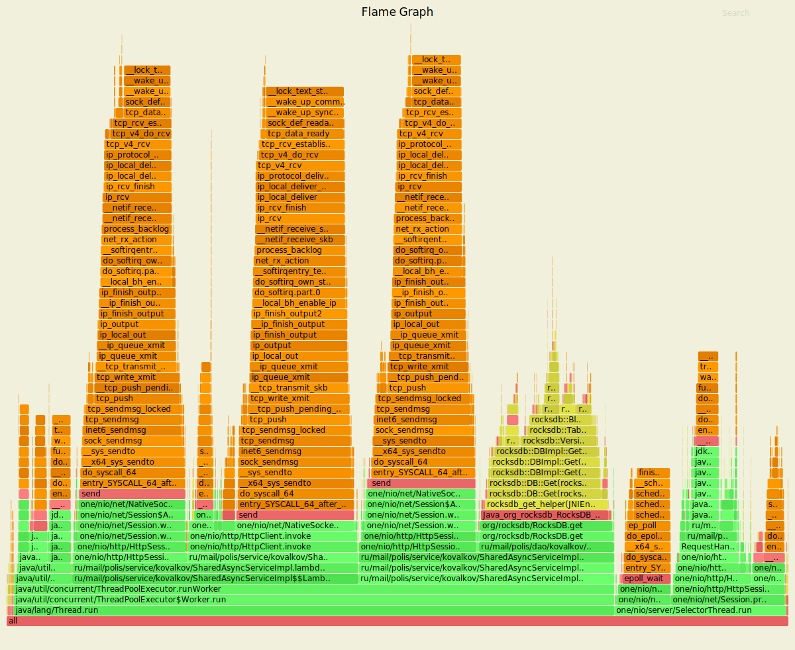
На TreeMap мы тратим уже 0.56%, а в случае с хешированием по модулю мы тратим 0.58% 
#### Alloc
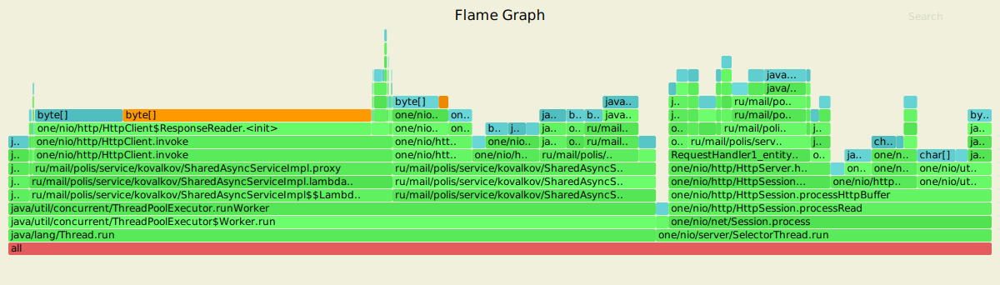
Аналогично 4.29% на TreeMap put  и 1.68 TreeMap, и 2.05% в случае хеширования по модулю.
#### Lock
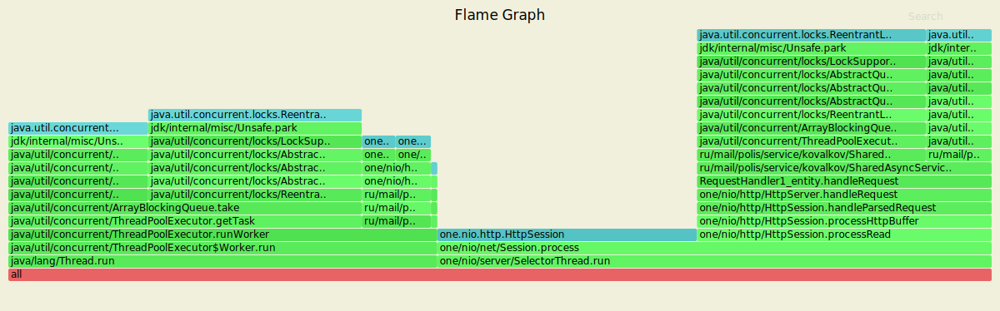
Аналогичные хешированию по модулю блокировки, зато видно, что после уменьшили блокировки
на сессии.
## Mod hashing 
### Put
    
    pc@pc-VirtualBox:~/projects/2020-highload-dht$ wrk -t4 -c64 -d60s -s proffiling/lua-scripts/put.lua -R45000 -L http://127.0.0.1:8080
    Running 1m test @ http://127.0.0.1:8080
    4 threads and 64 connections
    Thread calibration: mean lat.: 3.125ms, rate sampling interval: 16ms
    Thread calibration: mean lat.: 3.087ms, rate sampling interval: 15ms
    Thread calibration: mean lat.: 3.098ms, rate sampling interval: 15ms
    Thread calibration: mean lat.: 3.109ms, rate sampling interval: 15ms
    Thread Stats   Avg      Stdev     Max   +/- Stdev
    Latency     2.87ms    2.77ms  32.96ms   86.23%
    Req/Sec    11.76k     3.14k   21.93k    72.43%
      Latency Distribution (HdrHistogram - Recorded Latency)
    50.000%    1.89ms
    75.000%    3.16ms
    90.000%    7.10ms
    99.000%   12.36ms
    99.900%   19.76ms
    99.990%   28.74ms
    99.999%   30.85ms
    100.000%   32.99ms

    Detailed Percentile spectrum:
       Value   Percentile   TotalCount 1/(1-Percentile)

       0.061     0.000000            2         1.00
       0.771     0.100000       225036         1.11
       1.057     0.200000       449340         1.25
       1.319     0.300000       674549         1.43
       1.589     0.400000       898908         1.67
       1.893     0.500000      1123466         2.00
       2.065     0.550000      1235879         2.22
       2.257     0.600000      1348666         2.50
       2.479     0.650000      1460720         2.86
       2.761     0.700000      1573038         3.33
       3.157     0.750000      1684955         4.00
       3.441     0.775000      1741116         4.44
       3.837     0.800000      1797344         5.00
       4.403     0.825000      1853415         5.71
       5.191     0.850000      1909605         6.67
       6.119     0.875000      1965789         8.00
       6.603     0.887500      1993736         8.89
       7.103     0.900000      2021833        10.00
       7.615     0.912500      2050027        11.43
       8.135     0.925000      2078138        13.33
       8.679     0.937500      2106252        16.00
       8.959     0.943750      2120117        17.78
       9.255     0.950000      2134178        20.00
       9.575     0.956250      2148503        22.86
       9.911     0.962500      2162510        26.67
      10.287     0.968750      2176497        32.00
      10.487     0.971875      2183401        35.56
      10.711     0.975000      2190334        40.00
      10.959     0.978125      2197300        45.71
      11.247     0.981250      2204436        53.33
      11.575     0.984375      2211399        64.00
      11.759     0.985938      2214899        71.11
      11.967     0.987500      2218384        80.00
      12.199     0.989062      2221877        91.43
      12.471     0.990625      2225413       106.67
      12.791     0.992188      2228931       128.00
      12.983     0.992969      2230692       142.22
      13.183     0.993750      2232393       160.00
      13.423     0.994531      2234180       182.86
      13.711     0.995313      2235906       213.33
      14.079     0.996094      2237674       256.00
      14.295     0.996484      2238537       284.44
      14.583     0.996875      2239432       320.00
      14.927     0.997266      2240293       365.71
      15.431     0.997656      2241177       426.67
      16.223     0.998047      2242047       512.00
      16.783     0.998242      2242495       568.89
      17.407     0.998437      2242927       640.00
      18.159     0.998633      2243367       731.43
      19.007     0.998828      2243808       853.33
      19.871     0.999023      2244238      1024.00
      20.415     0.999121      2244461      1137.78
      20.959     0.999219      2244679      1280.00
      21.567     0.999316      2244897      1462.86
      22.287     0.999414      2245119      1706.67
      23.407     0.999512      2245335      2048.00
      24.175     0.999561      2245445      2275.56
      24.783     0.999609      2245555      2560.00
      25.439     0.999658      2245666      2925.71
      25.983     0.999707      2245775      3413.33
      26.703     0.999756      2245883      4096.00
      27.055     0.999780      2245941      4551.11
      27.375     0.999805      2245993      5120.00
      27.711     0.999829      2246048      5851.43
      28.047     0.999854      2246104      6826.67
      28.367     0.999878      2246157      8192.00
      28.559     0.999890      2246186      9102.22
      28.783     0.999902      2246215     10240.00
      28.943     0.999915      2246241     11702.86
      29.167     0.999927      2246268     13653.33
      29.343     0.999939      2246294     16384.00
      29.423     0.999945      2246308     18204.44
      29.503     0.999951      2246324     20480.00
      29.711     0.999957      2246338     23405.71
      29.823     0.999963      2246350     27306.67
      30.047     0.999969      2246363     32768.00
      30.175     0.999973      2246372     36408.89
      30.239     0.999976      2246377     40960.00
      30.351     0.999979      2246384     46811.43
      30.431     0.999982      2246390     54613.33
      30.591     0.999985      2246397     65536.00
      30.703     0.999986      2246402     72817.78
      30.719     0.999988      2246404     81920.00
      30.847     0.999989      2246409     93622.86
      30.991     0.999991      2246411    109226.67
      31.087     0.999992      2246414    131072.00
      31.119     0.999993      2246416    145635.56
      31.151     0.999994      2246418    163840.00
      31.279     0.999995      2246420    187245.71
      31.295     0.999995      2246421    218453.33
      31.359     0.999996      2246423    262144.00
      31.599     0.999997      2246424    291271.11
      31.711     0.999997      2246425    327680.00
      31.967     0.999997      2246426    374491.43
      31.967     0.999998      2246426    436906.67
      32.047     0.999998      2246427    524288.00
      32.063     0.999998      2246428    582542.22
      32.063     0.999998      2246428    655360.00
      32.511     0.999999      2246429    748982.86
      32.511     0.999999      2246429    873813.33
      32.511     0.999999      2246429   1048576.00
      32.895     0.999999      2246430   1165084.44
      32.895     0.999999      2246430   1310720.00
      32.895     0.999999      2246430   1497965.71
      32.895     0.999999      2246430   1747626.67
      32.895     1.000000      2246430   2097152.00
      32.991     1.000000      2246431   2330168.89
      32.991     1.000000      2246431          inf
    #[Mean    =        2.866, StdDeviation   =        2.767]
    #[Max     =       32.960, Total count    =      2246431]
    #[Buckets =           27, SubBuckets     =         2048]
    ----------------------------------------------------------
    2698280 requests in 1.00m, 213.58MB read
    Requests/sec:  44966.75
    Transfer/sec:      3.56MB

#### Cpu
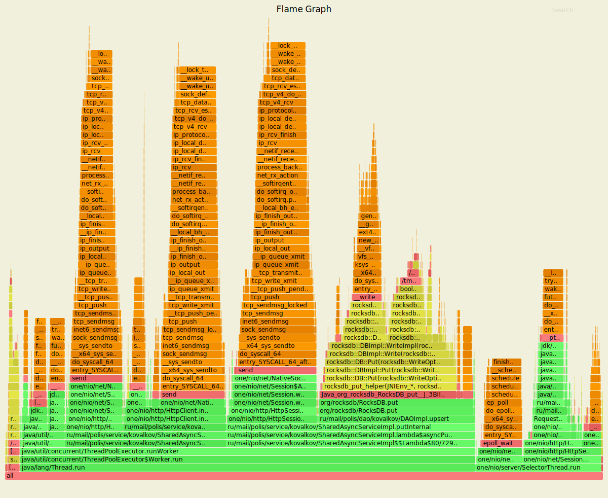 

#### Alloc
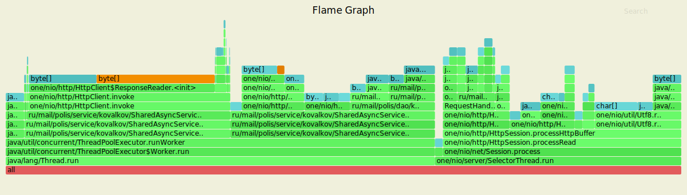

#### Lock
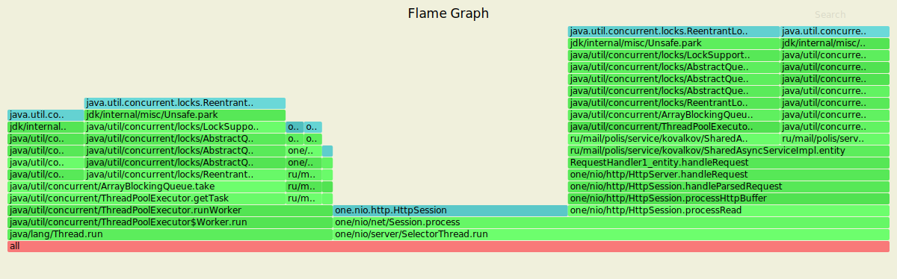

### Get

    pc@pc-VirtualBox:~/projects/2020-highload-dht$ wrk -t4 -c64 -d60s -s proffiling/lua-scripts/get.lua -R45000 -L http://127.0.0.1:8080
    Running 1m test @ http://127.0.0.1:8080
    4 threads and 64 connections
    Thread calibration: mean lat.: 3.107ms, rate sampling interval: 16ms
    Thread calibration: mean lat.: 3.094ms, rate sampling interval: 16ms
    Thread calibration: mean lat.: 3.098ms, rate sampling interval: 16ms
    Thread calibration: mean lat.: 3.099ms, rate sampling interval: 16ms
    Thread Stats   Avg      Stdev     Max   +/- Stdev
    Latency     3.19ms    3.04ms  33.92ms   83.85%
    Req/Sec    11.78k     3.77k   24.40k    64.42%
      Latency Distribution (HdrHistogram - Recorded Latency)
    50.000%    2.01ms
    75.000%    3.76ms
    90.000%    8.32ms
    99.000%   12.70ms
    99.900%   17.57ms
    99.990%   22.98ms
    99.999%   26.35ms
    100.000%   33.95ms

    Detailed Percentile spectrum:
       Value   Percentile   TotalCount 1/(1-Percentile)

       0.048     0.000000            1         1.00
       0.741     0.100000       225170         1.11
       1.066     0.200000       449358         1.25
       1.360     0.300000       674127         1.43
       1.664     0.400000       898983         1.67
       2.005     0.500000      1123272         2.00
       2.203     0.550000      1236054         2.22
       2.431     0.600000      1348640         2.50
       2.713     0.650000      1460811         2.86
       3.107     0.700000      1572500         3.33
       3.759     0.750000      1684852         4.00
       4.267     0.775000      1741197         4.44
       4.951     0.800000      1797143         5.00
       5.759     0.825000      1853495         5.71
       6.599     0.850000      1909525         6.67
       7.455     0.875000      1965763         8.00
       7.887     0.887500      1993898         8.89
       8.319     0.900000      2021840        10.00
       8.759     0.912500      2050225        11.43
       9.199     0.925000      2078173        13.33
       9.655     0.937500      2106353        16.00
       9.895     0.943750      2120485        17.78
      10.135     0.950000      2134188        20.00
      10.399     0.956250      2148370        22.86
      10.687     0.962500      2162460        26.67
      10.999     0.968750      2176360        32.00
      11.175     0.971875      2183437        35.56
      11.367     0.975000      2190407        40.00
      11.575     0.978125      2197488        45.71
      11.807     0.981250      2204336        53.33
      12.079     0.984375      2211475        64.00
      12.223     0.985938      2214852        71.11
      12.391     0.987500      2218378        80.00
      12.583     0.989062      2221939        91.43
      12.791     0.990625      2225401       106.67
      13.039     0.992188      2228852       128.00
      13.191     0.992969      2230657       142.22
      13.351     0.993750      2232399       160.00
      13.543     0.994531      2234179       182.86
      13.759     0.995313      2235913       213.33
      14.023     0.996094      2237659       256.00
      14.183     0.996484      2238532       284.44
      14.359     0.996875      2239410       320.00
      14.567     0.997266      2240259       365.71
      14.871     0.997656      2241141       426.67
      15.255     0.998047      2242016       512.00
      15.567     0.998242      2242452       568.89
      15.935     0.998437      2242890       640.00
      16.415     0.998633      2243336       731.43
      16.975     0.998828      2243769       853.33
      17.647     0.999023      2244216      1024.00
      17.983     0.999121      2244429      1137.78
      18.383     0.999219      2244652      1280.00
      18.751     0.999316      2244873      1462.86
      19.119     0.999414      2245086      1706.67
      19.551     0.999512      2245307      2048.00
      19.791     0.999561      2245418      2275.56
      20.127     0.999609      2245529      2560.00
      20.415     0.999658      2245637      2925.71
      20.799     0.999707      2245743      3413.33
      21.279     0.999756      2245854      4096.00
      21.535     0.999780      2245909      4551.11
      21.823     0.999805      2245963      5120.00
      22.079     0.999829      2246018      5851.43
      22.383     0.999854      2246072      6826.67
      22.687     0.999878      2246127      8192.00
      22.863     0.999890      2246156      9102.22
      23.023     0.999902      2246181     10240.00
      23.247     0.999915      2246211     11702.86
      23.439     0.999927      2246236     13653.33
      23.663     0.999939      2246263     16384.00
      23.871     0.999945      2246278     18204.44
      23.999     0.999951      2246291     20480.00
      24.191     0.999957      2246305     23405.71
      24.303     0.999963      2246318     27306.67
      24.575     0.999969      2246334     32768.00
      24.655     0.999973      2246339     36408.89
      24.847     0.999976      2246346     40960.00
      24.927     0.999979      2246354     46811.43
      25.087     0.999982      2246360     54613.33
      25.439     0.999985      2246367     65536.00
      25.679     0.999986      2246370     72817.78
      25.871     0.999988      2246373     81920.00
      26.303     0.999989      2246377     93622.86
      26.799     0.999991      2246380    109226.67
      27.215     0.999992      2246383    131072.00
      27.535     0.999993      2246385    145635.56
      27.839     0.999994      2246387    163840.00
      28.335     0.999995      2246389    187245.71
      28.479     0.999995      2246390    218453.33
      29.423     0.999996      2246392    262144.00
      30.063     0.999997      2246393    291271.11
      30.735     0.999997      2246394    327680.00
      31.327     0.999997      2246395    374491.43
      31.327     0.999998      2246395    436906.67
      32.047     0.999998      2246396    524288.00
      32.303     0.999998      2246397    582542.22
      32.303     0.999998      2246397    655360.00
      32.831     0.999999      2246398    748982.86
      32.831     0.999999      2246398    873813.33
      32.831     0.999999      2246398   1048576.00
      33.375     0.999999      2246399   1165084.44
      33.375     0.999999      2246399   1310720.00
      33.375     0.999999      2246399   1497965.71
      33.375     0.999999      2246399   1747626.67
      33.375     1.000000      2246399   2097152.00
      33.951     1.000000      2246400   2330168.89
      33.951     1.000000      2246400          inf
    #[Mean    =        3.189, StdDeviation   =        3.044]
    #[Max     =       33.920, Total count    =      2246400]
    #[Buckets =           27, SubBuckets     =         2048]
    ----------------------------------------------------------
    2698196 requests in 1.00m, 231.13MB read
    Requests/sec:  44970.02
    Transfer/sec:      3.85MB

#### Cpu
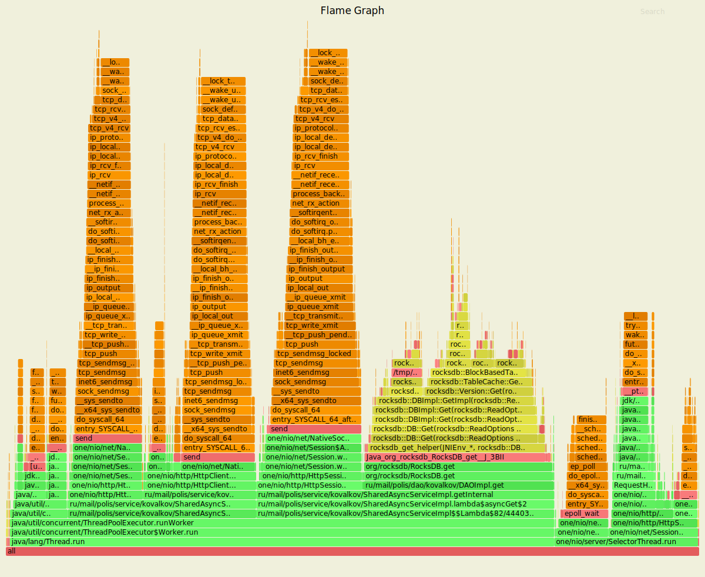 

#### Alloc
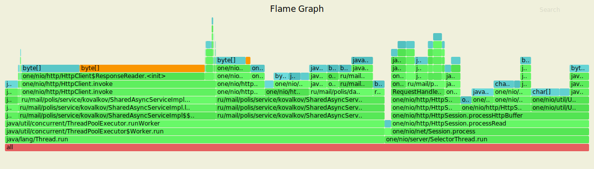

#### Lock
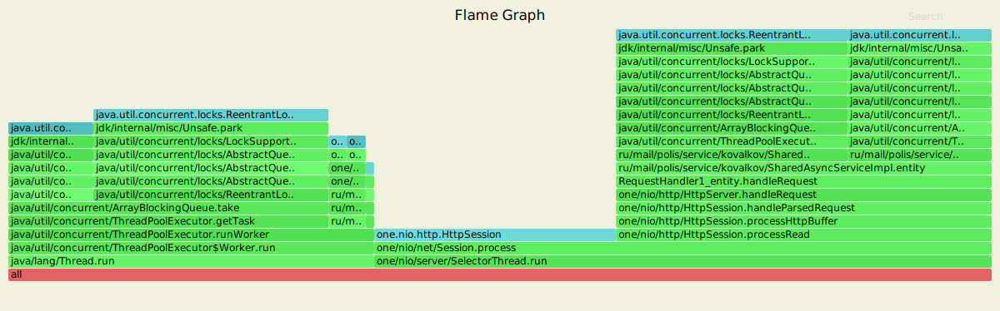

# Резюме
Суммарно мы видим многократное снижение максимальной задержки в обоих случая, так же как и задержки
в последних процентилях. В случае с put рандеву хеширование стало быстрей в среднем значении
 на 1 мс (50%), а в максимальном значении 23мс против 32 ( что тоже немало). Для get запросов 
 наблюдается паритет по среднему значению около 3.2 мс, но максимальная задержка уже меньше 
 у хеширования по модулю 33 мс против 45 мс у рандеву.
 
 Исходя из увиденного можно сделать вывод, используя рандеву хешированию, мы тратим больше памяти ~6% против ~2%,
 зато (по крайней мере) в случае с put запросами, мы занимаем меньше процессорного времени 0.36% против 0.5%.
 