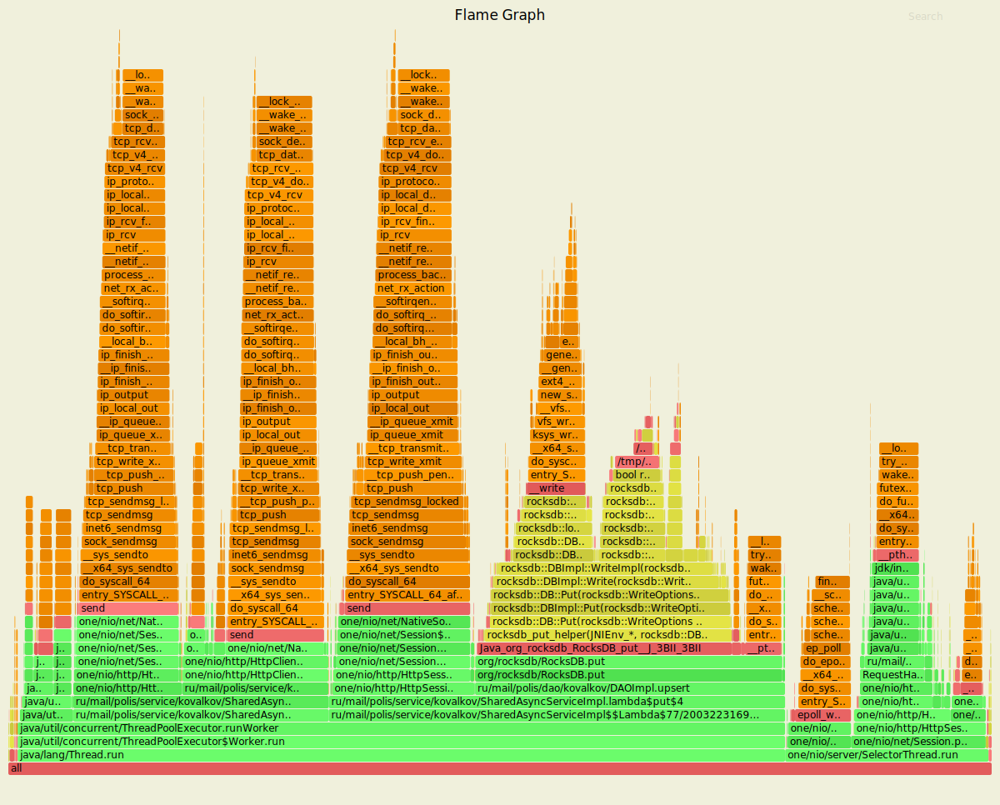
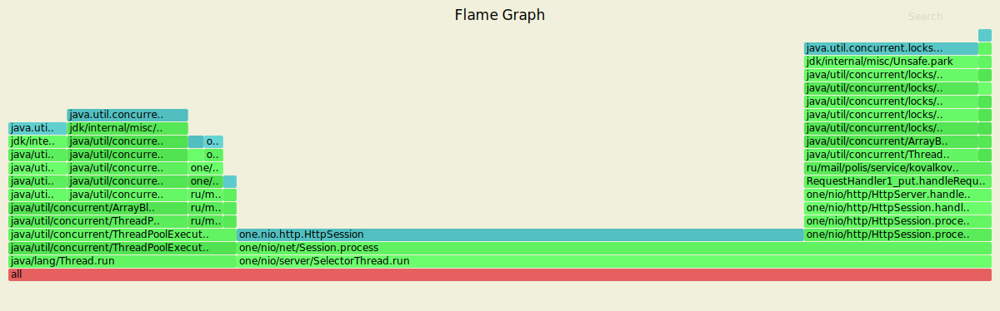
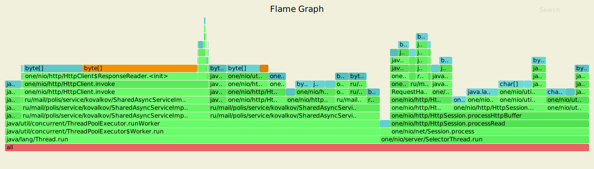

# Проифилирование нагрузки 4-го этапа
Нагрузочное тестирование с помощью wrk2 (код скрипта использовался из stage 1).
На данном этапе стреляем в 64 соединения и 4 потока.

## Анализ PUT-запросов и сравнение с реализацией прошлого этапа
#### Результаты wrk
Мы до замеров производительности понимаем, что результаты рандеву хеширования будут дольше чем по модулю,
по этому чтобы у данного подхода не задирались последние процентили мы пытаемся подобрать оптимальную нагрузку для него.

Обстрел начинался с 50000 запросов в секунуду (оптимальная нагрузка прошлого этапа) и постипенно снижалась до тех пор,
пока 99.999% процентиль не перестал уходить выше 100мс.

Исходя из подхода описанного выше мы подобрали нагрузку в 35 тыс. запросов\секунду.

wrk -t4 -c64 -d20s -s proffiling/lua-scripts/put.lua -R35000 --latency http://127.0.0.1:8080

Учитывая что мы достаточно прогрели наш сервис подбором значений, нам достаточно мерить от 20 секунд, для получения
достоверного результата.

##### Рандеву хеширование
Результаты нагрузки:

    Running 20s test @ http://127.0.0.1:8080
    4 threads and 64 connections
    Thread calibration: mean lat.: 65.052ms, rate sampling interval: 366ms
    Thread calibration: mean lat.: 65.670ms, rate sampling interval: 363ms
    Thread calibration: mean lat.: 64.378ms, rate sampling interval: 360ms
    Thread calibration: mean lat.: 63.440ms, rate sampling interval: 357ms
    Thread Stats   Avg      Stdev     Max   +/- Stdev
    Latency     3.95ms     8.17ms  71.68ms   94.70%
    Req/Sec     8.76k   123.96     9.25k    91.67%
    Latency Distribution (HdrHistogram - Recorded Latency)
     50.000%    1.93ms
    75.000%    2.70ms
    90.000%    4.72ms
    99.000%   50.62ms
    99.900%   63.26ms
    99.990%   69.50ms
    99.999%   71.36ms
    100.000%   71.74ms

    Detailed Percentile spectrum:
       Value   Percentile   TotalCount 1/(1-Percentile)
       0.134     0.000000            1         1.00
       1.066     0.100000        34819         1.11
       1.328     0.200000        69485         1.25
       1.537     0.300000       104300         1.43
       1.731     0.400000       138896         1.67
       1.935     0.500000       173588         2.00
       2.051     0.550000       191159         2.22
       2.175     0.600000       208436         2.50
       2.319     0.650000       225812         2.86
       2.487     0.700000       243142         3.33
       2.703     0.750000       260377         4.00
       2.841     0.775000       269077         4.44
       3.013     0.800000       277811         5.00
       3.227     0.825000       286451         5.71
       3.509     0.850000       295103         6.67
       3.929     0.875000       303798         8.00
       4.251     0.887500       308132         8.89
       4.723     0.900000       312468        10.00
       5.559     0.912500       316797        11.43
       6.775     0.925000       321132        13.33
       8.599     0.937500       325482        16.00
      10.311     0.943750       327640        17.78
      14.063     0.950000       329811        20.00
      19.295     0.956250       331981        22.86
      24.943     0.962500       334150        26.67
      30.239     0.968750       336321        32.00
      32.511     0.971875       337409        35.56
      34.495     0.975000       338490        40.00
      36.991     0.978125       339576        45.71
      40.255     0.981250       340660        53.33
      45.375     0.984375       341756        64.00
      47.231     0.985938       342291        71.11
      48.735     0.987500       342832        80.00
      49.951     0.989062       343370        91.43
      51.135     0.990625       343925       106.67
      52.319     0.992188       344466       128.00
      52.863     0.992969       344728       142.22
      53.535     0.993750       345009       160.00
      54.143     0.994531       345279       182.86
      54.943     0.995313       345548       213.33
      55.967     0.996094       345811       256.00
      56.543     0.996484       345948       284.44
      57.407     0.996875       346088       320.00
      58.303     0.997266       346222       365.71
      59.039     0.997656       346356       426.67
      60.223     0.998047       346491       512.00
      60.927     0.998242       346560       568.89
      61.631     0.998437       346626       640.00
      62.239     0.998633       346698       731.43
      62.719     0.998828       346761       853.33
      63.327     0.999023       346829      1024.00
      63.711     0.999121       346867      1137.78
      63.967     0.999219       346897      1280.00
      64.287     0.999316       346931      1462.86
      64.799     0.999414       346967      1706.67
      65.279     0.999512       346998      2048.00
      65.599     0.999561       347015      2275.56
      65.919     0.999609       347034      2560.00
      66.495     0.999658       347051      2925.71
      66.879     0.999707       347067      3413.33
      67.583     0.999756       347083      4096.00
      67.775     0.999780       347091      4551.11
      68.031     0.999805       347101      5120.00
      68.671     0.999829       347108      5851.43
      68.927     0.999854       347117      6826.67
      69.311     0.999878       347127      8192.00
      69.439     0.999890       347130      9102.22
      69.503     0.999902       347136     10240.00
      69.631     0.999915       347139     11702.86
      69.759     0.999927       347144     13653.33
      69.887     0.999939       347146     16384.00
      69.951     0.999945       347148     18204.44
      70.207     0.999951       347152     20480.00
      70.335     0.999957       347153     23405.71
      70.463     0.999963       347155     27306.67
      70.655     0.999969       347158     32768.00
      70.655     0.999973       347158     36408.89
      70.719     0.999976       347160     40960.00
      70.719     0.999979       347160     46811.43
      70.783     0.999982       347161     54613.33
      71.231     0.999985       347162     65536.00
      71.295     0.999986       347163     72817.78
      71.295     0.999988       347163     81920.00
      71.359     0.999989       347164     93622.86
      71.359     0.999991       347164    109226.67
      71.551     0.999992       347166    131072.00
      71.551     0.999993       347166    145635.56
      71.551     0.999994       347166    163840.00
      71.551     0.999995       347166    187245.71
      71.551     0.999995       347166    218453.33
      71.551     0.999996       347166    262144.00
      71.551     0.999997       347166    291271.11
      71.551     0.999997       347166    327680.00
      71.743     0.999997       347167    374491.43
      71.743     1.000000       347167          inf
    #[Mean    =        3.948, StdDeviation   =        8.170]
    #[Max     =       71.680, Total count    =       347167]
    #[Buckets =           27, SubBuckets     =         2048]
    ----------------------------------------------------------
    698608 requests in 20.00s, 55.30MB read
    Requests/sec:  34930.63
    Transfer/sec:      2.77MB

##### По модулю
Результаты нагрузки:

    Running 20s test @ http://127.0.0.1:8080
    4 threads and 64 connections
    Thread calibration: mean lat.: 2.055ms, rate sampling interval: 10ms
    Thread calibration: mean lat.: 2.057ms, rate sampling interval: 10ms
    Thread calibration: mean lat.: 2.040ms, rate sampling interval: 10ms
    Thread calibration: mean lat.: 2.098ms, rate sampling interval: 10ms
    Thread Stats   Avg      Stdev     Max   +/- Stdev
    Latency     2.85ms    5.19ms  54.75ms   96.38%
    Req/Sec     9.24k     1.15k   13.78k    75.80%
    Latency Distribution (HdrHistogram - Recorded Latency)
    50.000%    1.83ms
    75.000%    2.47ms
    90.000%    3.43ms
    99.000%   36.96ms
    99.900%   44.10ms
    99.990%   49.63ms
    99.999%   54.33ms
    100.000%   54.78ms

    Detailed Percentile spectrum:
       Value   Percentile   TotalCount 1/(1-Percentile)

       0.111     0.000000            1         1.00
       1.024     0.100000        34814         1.11
       1.276     0.200000        69482         1.25
       1.473     0.300000       104194         1.43
       1.650     0.400000       139006         1.67
       1.834     0.500000       173734         2.00
       1.935     0.550000       191085         2.22
       2.045     0.600000       208352         2.50
       2.167     0.650000       225865         2.86
       2.303     0.700000       243092         3.33
       2.467     0.750000       260492         4.00
       2.563     0.775000       269073         4.44
       2.675     0.800000       277762         5.00
       2.807     0.825000       286473         5.71
       2.965     0.850000       295056         6.67
       3.163     0.875000       303743         8.00
       3.285     0.887500       308085         8.89
       3.429     0.900000       312437        10.00
       3.601     0.912500       316752        11.43
       3.817     0.925000       321101        13.33
       4.111     0.937500       325446        16.00
       4.315     0.943750       327603        17.78
       4.595     0.950000       329791        20.00
       5.075     0.956250       331944        22.86
       7.311     0.962500       334105        26.67
      10.727     0.968750       336274        32.00
      12.887     0.971875       337358        35.56
      17.215     0.975000       338445        40.00
      21.839     0.978125       339527        45.71
      25.551     0.981250       340612        53.33
      30.991     0.984375       341697        64.00
      33.055     0.985938       342252        71.11
      34.687     0.987500       342792        80.00
      36.063     0.989062       343337        91.43
      37.567     0.990625       343872       106.67
      38.879     0.992188       344410       128.00
      39.519     0.992969       344689       142.22
      39.999     0.993750       344958       160.00
      40.479     0.994531       345239       182.86
      40.927     0.995313       345503       213.33
      41.471     0.996094       345775       256.00
      41.791     0.996484       345916       284.44
      42.079     0.996875       346042       320.00
      42.495     0.997266       346181       365.71
      42.879     0.997656       346316       426.67
      43.263     0.998047       346443       512.00
      43.423     0.998242       346518       568.89
      43.583     0.998437       346585       640.00
      43.775     0.998633       346659       731.43
      43.903     0.998828       346715       853.33
      44.127     0.999023       346786      1024.00
      44.255     0.999121       346819      1137.78
      44.383     0.999219       346850      1280.00
      44.543     0.999316       346887      1462.86
      44.703     0.999414       346920      1706.67
      44.831     0.999512       346951      2048.00
      44.927     0.999561       346968      2275.56
      45.055     0.999609       346991      2560.00
      45.151     0.999658       347004      2925.71
      45.247     0.999707       347019      3413.33
      45.439     0.999756       347037      4096.00
      45.567     0.999780       347044      4551.11
      45.759     0.999805       347053      5120.00
      46.047     0.999829       347061      5851.43
      48.063     0.999854       347070      6826.67
      49.119     0.999878       347078      8192.00
      49.343     0.999890       347082      9102.22
      49.759     0.999902       347087     10240.00
      50.079     0.999915       347091     11702.86
      50.335     0.999927       347096     13653.33
      50.431     0.999939       347099     16384.00
      50.879     0.999945       347101     18204.44
      51.743     0.999951       347104     20480.00
      52.351     0.999957       347106     23405.71
      52.895     0.999963       347108     27306.67
      53.311     0.999969       347111     32768.00
      53.311     0.999973       347111     36408.89
      53.471     0.999976       347112     40960.00
      53.727     0.999979       347113     46811.43
      53.759     0.999982       347114     54613.33
      53.983     0.999985       347115     65536.00
      54.111     0.999986       347116     72817.78
      54.111     0.999988       347116     81920.00
      54.335     0.999989       347117     93622.86
      54.335     0.999991       347117    109226.67
      54.559     0.999992       347118    131072.00
      54.559     0.999993       347118    145635.56
      54.559     0.999994       347118    163840.00
      54.655     0.999995       347119    187245.71
      54.655     0.999995       347119    218453.33
      54.655     0.999996       347119    262144.00
      54.655     0.999997       347119    291271.11
      54.655     0.999997       347119    327680.00
      54.783     0.999997       347120    374491.43
      54.783     1.000000       347120          inf
    #[Mean    =        2.847, StdDeviation   =        5.190]
    #[Max     =       54.752, Total count    =       347120]
    #[Buckets =           27, SubBuckets     =         2048]
    ----------------------------------------------------------
    690166 requests in 20.00s, 54.63MB read
    Requests/sec:  34511.07
    Transfer/sec:      2.73MB

Анализируя результаты двух разных подходов к шардированиб мы видим, что результат рандеву хеширования
выполняются с большей задержкой, больше на 30% от классического подхода. 

Но стоит отдать должное и если долго прогревать сервис, то результаты
по обоим показателям немного упадут. 100% процентилей пользователей испытают в хужшем случае задержку
в 50мс в сулучае с хешированием по модулю и 71 в случае с рандеву. 

В целом, учитывая что в реальной продакшен системе будет использоваться не подход с модулем, то очевидно,
что нам приходится больше отдавать. Вопрос только в том насколько больше.

Относительно прошлого этапа, мы заметно снизили количество запросов в секунду, чтобы добится
адекватной задержки. В нашем случае мы снизили рейт с 50 тысяч запросов до 35. Несмотря на это,
это всё равно отличный результат, и нужно учитывать, что на каждый подающийся ключ, используется
сортировка и хеширование в случае рандеву. 

Среднее значения составляют 3.95ms  для рандеву и 2.85ms для хеширования по модулю. По большому счёту
среднее значение нам ни о чём не говорит. 

Также для рандеву вместо стандартного алгоритма хеширования был взять более быстрый и равномерный алгоритм murmurhash.

## Async-Profiler
Для построения flame-графов, как для пут так и для get запросов
мы используем async-profiler с типовыми параметрами:

`./profiler.sh -d 30 -f cpu.svg      -e cpu jps` - процессор
`./profiler.sh -d 30 -f alloc.svg    -e alloc jps` - выделение памяти
`./profiler.sh -d 30 -f lock.svg     -e lock jps` - блокировки потоков

Почему 30 секунд хватит, хорошо рассказал Андрей Паньгин, например [тут](https://www.youtube.com/watch?v=QiGrTvsCZmA).
Все замеры запускались с небольшой задержкой после wrk (около 1 минуты).

Анализ графиков и их построение будет проводиться только для основного решения (по модулю). Так как рандеву является
бонусным. 

#### Результаты профилирования для cpu с помощью Async-profiler

Мы имеем 20% на SelectorThread, собственно разгрузить его было задачей прошлого этапа. 31% занимает DAO. Сам RocksDB
уходит в нативные функции. Но концептуально делится на 2 стека - запись данных (WriteToWal - 8.2%) и вставка (InsertTo - 24%).

Левые 2 больших стека, отправка ответов клиентам, левый стек обработка конкретной ноды SendResponse (11%), правей проксируемые ноды
14.8%. И то и другое вызывается асинхронно. Ну и стэк это обработка запросов нодой владеющей нужными данными.

Все 3 стека по работе с запросами-ответами имеют большой трейс. При том системных вызовов. Это говорит нам о том что 
мы работаем с нативными posix сокетами linux. Забавно то что мы даже можем найти, к примеру
команду send_msg. В каждом из стеков, а это значит, что вполне возможно, подобная производительность достигается благодаря 
межпроцессному взаимодействию. Т.е вполне вероятно, что если мы задеплоим наш сервис на удаленную ноду, результаты нас удивят.      

#### Результаты профилирования Allocation с помощью Async-profiler

Под наш асинхронный Executor выделяется порядка 65% памяти, 28% из которой мы тратим на lambda#put
 оставшиеся 33% на асинхронное проксирование запросов и собственно сам вызов invoke, 
 33% мы тратим на обработку запроса и отправку ответа в рамках сессии. Включая
буферизацию, парсинг запроса и тд.
 
#### Результаты профилирования Lock с помощью Async-profiler
 
 

На графике мы видим все блокирующие элементы в нашей программе. Таких не много. 
Слева мы имеем ArrayBlockingQueue (18.28%), выше по стеку мы упираемся reentrantLock. Который лежит в корне ExecutorService.

На самом деле крайне настораживает, что на вершине каждого стека мы имеем блокирующий sun.misc.Unsafe метод. Который, по сути,
являяется внутренними, библиотечными api java и по сути можем поменяться в любой момент. Но мы можем предпологать, что данная
библиотека могла понадобится для кастомной сериализации объектов, при этом более шустрой чем классический reflection api.

Чуть правей, мы видим широкий стек относящийся к селекторам (765) и Http.Session которая лочится при помощи concurrent ReentrantLock. 
 
 ## Анализ GET-запросов и сравнение с реализацией прошлого этапа
 #### Результаты wrk
 Использовалась следующая команда терминала:
  wrk -t4 -c64 -d20s -s proffiling/lua-scripts/get.lua -R30000 --latency http://127.0.0.1:8080
 
 ##### Рандеву хеширование
 Результаты нагрузки:
    
    Running 20s test @ http://127.0.0.1:8080
    4 threads and 64 connections
    Thread calibration: mean lat.: 2.170ms, rate sampling interval: 10ms
    Thread calibration: mean lat.: 2.156ms, rate sampling interval: 10ms
    Thread calibration: mean lat.: 2.202ms, rate sampling interval: 10ms
    Thread calibration: mean lat.: 2.311ms, rate sampling interval: 10ms
       Thread Stats   Avg      Stdev     Max   +/- Stdev
     Latency     2.50ms    5.20ms  74.05ms   98.13%
     Req/Sec     9.23k     1.31k   16.56k    79.69%
    Latency Distribution (HdrHistogram - Recorded Latency)
    50.000%    1.71ms
    75.000%    2.46ms
    90.000%    3.30ms
    99.000%   35.52ms
    99.900%   60.45ms
    99.990%   70.40ms
    99.999%   73.15ms
    100.000%   74.11ms
 
    Detailed Percentile spectrum:
        Value   Percentile   TotalCount 1/(1-Percentile)
 
        0.106     0.000000            2         1.00
        0.832     0.100000        34849         1.11
        1.079     0.200000        69575         1.25
        1.287     0.300000       104255         1.43
        1.492     0.400000       138935         1.67
        1.714     0.500000       173645         2.00
        1.837     0.550000       191114         2.22
        1.969     0.600000       208395         2.50
        2.117     0.650000       225882         2.86
        2.275     0.700000       243062         3.33
        2.457     0.750000       260432         4.00
        2.559     0.775000       269188         4.44
        2.669     0.800000       277808         5.00
        2.795     0.825000       286586         5.71
        2.937     0.850000       295203         6.67
        3.099     0.875000       303866         8.00
        3.193     0.887500       308208         8.89
        3.301     0.900000       312562        10.00
        3.417     0.912500       316846        11.43
        3.549     0.925000       321188        13.33
        3.711     0.937500       325562        16.00
        3.809     0.943750       327708        17.78
        3.917     0.950000       329869        20.00
        4.051     0.956250       332035        22.86
        4.215     0.962500       334223        26.67
        4.435     0.968750       336403        32.00
        4.583     0.971875       337464        35.56
        4.803     0.975000       338557        40.00
        5.223     0.978125       339636        45.71
        7.591     0.981250       340717        53.33
       16.479     0.984375       341800        64.00
       22.143     0.985938       342343        71.11
       27.551     0.987500       342888        80.00
       33.119     0.989062       343428        91.43
       36.511     0.990625       343976       106.67
       39.071     0.992188       344513       128.00
       41.599     0.992969       344786       142.22
       44.607     0.993750       345056       160.00
       47.135     0.994531       345328       182.86
       49.087     0.995313       345599       213.33
       51.167     0.996094       345870       256.00
       52.287     0.996484       346005       284.44
       53.599     0.996875       346141       320.00
       54.943     0.997266       346276       365.71
       56.447     0.997656       346414       426.67
       57.791     0.998047       346548       512.00
       58.367     0.998242       346619       568.89
       58.911     0.998437       346684       640.00
       59.423     0.998633       346758       731.43
       59.999     0.998828       346820       853.33
       60.511     0.999023       346890      1024.00
       60.799     0.999121       346923      1137.78
       61.247     0.999219       346954      1280.00
       61.759     0.999316       346988      1462.86
       62.399     0.999414       347024      1706.67
       63.647     0.999512       347056      2048.00
       64.415     0.999561       347073      2275.56
       65.183     0.999609       347090      2560.00
       66.111     0.999658       347107      2925.71
       67.327     0.999707       347124      3413.33
       68.223     0.999756       347141      4096.00
       68.607     0.999780       347150      4551.11
       68.991     0.999805       347159      5120.00
       69.375     0.999829       347166      5851.43
       69.759     0.999854       347176      6826.67
       70.079     0.999878       347183      8192.00
       70.335     0.999890       347187      9102.22
       70.463     0.999902       347192     10240.00
       70.655     0.999915       347198     11702.86
       70.783     0.999927       347201     13653.33
       70.847     0.999939       347205     16384.00
       71.039     0.999945       347207     18204.44
       71.103     0.999951       347209     20480.00
       71.167     0.999957       347211     23405.71
       71.295     0.999963       347213     27306.67
       71.551     0.999969       347215     32768.00
       71.615     0.999973       347216     36408.89
       71.999     0.999976       347218     40960.00
       71.999     0.999979       347218     46811.43
       72.127     0.999982       347219     54613.33
       72.383     0.999985       347220     65536.00
       72.703     0.999986       347221     72817.78
       72.703     0.999988       347221     81920.00
       73.151     0.999989       347222     93622.86
       73.151     0.999991       347222    109226.67
       73.599     0.999992       347223    131072.00
       73.599     0.999993       347223    145635.56
       73.599     0.999994       347223    163840.00
       73.855     0.999995       347224    187245.71
       73.855     0.999995       347224    218453.33
       73.855     0.999996       347224    262144.00
       73.855     0.999997       347224    291271.11
       73.855     0.999997       347224    327680.00
       74.111     0.999997       347225    374491.43
       74.111     1.000000       347225          inf
    #[Mean    =        2.503, StdDeviation   =        5.198]
    #[Max     =       74.048, Total count    =       347225]
    #[Buckets =           27, SubBuckets     =         2048]
    ----------------------------------------------------------
    698670 requests in 20.00s, 59.51MB read
    Requests/sec:  34930.90
     Transfer/sec:      2.98MB

 ##### По модулю
 Результаты нагрузки:
 
    Running 20s test @ http://127.0.0.1:8080
    4 threads and 64 connections
    Thread calibration: mean lat.: 2.019ms, rate sampling interval: 10ms
    Thread calibration: mean lat.: 1.993ms, rate sampling interval: 10ms
    Thread calibration: mean lat.: 1.996ms, rate sampling interval: 10ms
    Thread calibration: mean lat.: 1.998ms, rate sampling interval: 10ms
    Thread Stats   Avg      Stdev     Max   +/- Stdev
     Latency     2.14ms    2.76ms  53.66ms   98.35%
     Req/Sec     9.24k     1.19k   16.11k    74.36%
    Latency Distribution (HdrHistogram - Recorded Latency)
    50.000%    1.72ms
    75.000%    2.46ms
    90.000%    3.26ms
    99.000%   13.93ms
    99.900%   37.06ms
    99.990%   51.71ms
    99.999%   53.18ms
    100.000%   53.69ms
 
    Detailed Percentile spectrum:
        Value   Percentile   TotalCount 1/(1-Percentile)
        0.092     0.000000            1         1.00
        0.833     0.100000        34794         1.11
        1.077     0.200000        69510         1.25
        1.287     0.300000       104214         1.43
        1.493     0.400000       139060         1.67
        1.715     0.500000       173722         2.00
        1.837     0.550000       191077         2.22
        1.972     0.600000       208366         2.50
        2.119     0.650000       225691         2.86
        2.281     0.700000       243114         3.33
        2.457     0.750000       260432         4.00
        2.557     0.775000       269088         4.44
        2.665     0.800000       277829         5.00
        2.787     0.825000       286531         5.71
        2.921     0.850000       295197         6.67
        3.077     0.875000       303871         8.00
        3.165     0.887500       308165         8.89
        3.263     0.900000       312558        10.00
        3.369     0.912500       316865        11.43
        3.493     0.925000       321169        13.33
        3.633     0.937500       325544        16.00
        3.717     0.943750       327728        17.78
        3.809     0.950000       329869        20.00
        3.917     0.956250       332045        22.86
        4.043     0.962500       334191        26.67
        4.199     0.968750       336405        32.00
        4.283     0.971875       337455        35.56
        4.395     0.975000       338553        40.00
        4.531     0.978125       339628        45.71
        4.711     0.981250       340711        53.33
        4.975     0.984375       341790        64.00
        5.231     0.985938       342329        71.11
        6.059     0.987500       342869        80.00
       10.759     0.989062       343413        91.43
       15.879     0.990625       343957       106.67
       19.503     0.992188       344497       128.00
       20.927     0.992969       344769       142.22
       22.335     0.993750       345042       160.00
       23.503     0.994531       345312       182.86
       24.751     0.995313       345582       213.33
       27.007     0.996094       345853       256.00
       28.335     0.996484       345991       284.44
       29.791     0.996875       346124       320.00
       31.135     0.997266       346262       365.71
       32.607     0.997656       346396       426.67
       34.143     0.998047       346531       512.00
       34.751     0.998242       346599       568.89
       35.391     0.998437       346667       640.00
       35.871     0.998633       346738       731.43
       36.479     0.998828       346804       853.33
       37.183     0.999023       346872      1024.00
       37.535     0.999121       346905      1137.78
       37.983     0.999219       346943      1280.00
       38.623     0.999316       346972      1462.86
       39.583     0.999414       347007      1706.67
       41.439     0.999512       347040      2048.00
       42.463     0.999561       347058      2275.56
       43.743     0.999609       347075      2560.00
       44.959     0.999658       347091      2925.71
       46.303     0.999707       347108      3413.33
       47.775     0.999756       347126      4096.00
       48.543     0.999780       347133      4551.11
       49.215     0.999805       347142      5120.00
       50.047     0.999829       347150      5851.43
       50.783     0.999854       347159      6826.67
       51.231     0.999878       347167      8192.00
       51.551     0.999890       347171      9102.22
       51.743     0.999902       347176     10240.00
       51.903     0.999915       347180     11702.86
       52.159     0.999927       347185     13653.33
       52.319     0.999939       347188     16384.00
       52.511     0.999945       347190     18204.44
       52.607     0.999951       347194     20480.00
       52.639     0.999957       347195     23405.71
       52.799     0.999963       347198     27306.67
       52.863     0.999969       347201     32768.00
       52.863     0.999973       347201     36408.89
       52.863     0.999976       347201     40960.00
       52.991     0.999979       347202     46811.43
       53.023     0.999982       347203     54613.33
       53.151     0.999985       347204     65536.00
       53.183     0.999986       347206     72817.78
       53.183     0.999988       347206     81920.00
       53.183     0.999989       347206     93622.86
       53.183     0.999991       347206    109226.67
       53.503     0.999992       347207    131072.00
       53.503     0.999993       347207    145635.56
       53.503     0.999994       347207    163840.00
       53.567     0.999995       347208    187245.71
       53.567     0.999995       347208    218453.33
       53.567     0.999996       347208    262144.00
       53.567     0.999997       347208    291271.11
       53.567     0.999997       347208    327680.00
       53.695     0.999997       347209    374491.43
       53.695     1.000000       347209          inf
    #[Mean    =        2.137, StdDeviation   =        2.758]
    #[Max     =       53.664, Total count    =       347209]
    #[Buckets =           27, SubBuckets     =         2048]
    ----------------------------------------------------------
    698653 requests in 20.00s, 59.51MB read
    Requests/sec:  34932.72
    Transfer/sec:      2.98MB

 Аналогичная тенденция наблюдается и с гет методом. Мы тоже имеем разницу в 30% и также
 последние три процентиля 100, 99.99, 99.9 не так уж и сильно друг от друга отключаются, что безусловно
 хороший показатель.
  
 #### Результаты профилирования для cpu с помощью Async-profiler
   
 Асинхронный:
 

Аналогично профилированию put, мы видим стеки вызова синхронного http-клиента (HttpClient.invoke 18.65%), 
отправка ответа этим же клиентом (SendResponse 12.54$) и в центре стек ноды-владельца (SendReponse 18%, 
и её запрос в хранилище (DaoImpl.get 17.9%).  А в крайнем правом углу у нас обособленны селекторы - 23%.
 
 #### Результаты профилирования Allocation с помощью Async-profiler
 
  
 
 Данный график очень похож на put. Мы имеем большу часть памяти под Executor-ом, который управляяет воркерами,
 внутри которых мы вызываем либо метод invoke (33.54%) , проксируя запрос, либо либо обробатываем его сами (28.73%).
 В крайнем правом углу мы имеем операции парсинга и приёма запроса, которые происходят в обычном, не асинхронном.

#### Результаты профилирования Lock с помощью Async-profiler

  

Здесь картина немного меняется, мы имеем уже 40% блокировок на воркерах ExecutirServuce-а, и 60% тратится на 
сессии. Мы имеем HttpSession.processRead (44.43%, который делится на перенаправление на другие ноды proxyForwarding (12,89))
и асинхронный ответ на запрос. 

### Выводы

Главное что нам удалось понять, по нагрузке, безусловно, надёжные методы шардирования нод проигрывают примитивным,
в моём случае на 30%. Среднее значение оказалось почти одинаково небольшим, так тчо верить среднему не стоит.

Мы имеем много синхронных моментов - HttpClinet, ArrayQueue (ExcecutorService), нативные сокеты и даже сессии.

Работа суммарно затрачиваемая на селекторы, по затратам процесссора примерно равна обработке запроса с походом в хранилище, что 
неплохо. Из прошлого этапа мы знаем, что на самом деле у нас не один селектор, и на самом деле они загруженны на 2-3%.

Из графиков видно, что мы работаем с нативными Unix сокетами нашей ОС. Которые общаются на уровне posix-сигналов, и 
обеспечивают высокую скорость работы, но мы не можем быть уверенны что мы не имеем дело с IPC на уровне сигналов, вместо 
http-соединений. Таким образом, было бы неплохо пострелять и по профилировать сервис на удаленной ноде, думаю
производительность не была бы такой бешенной.

