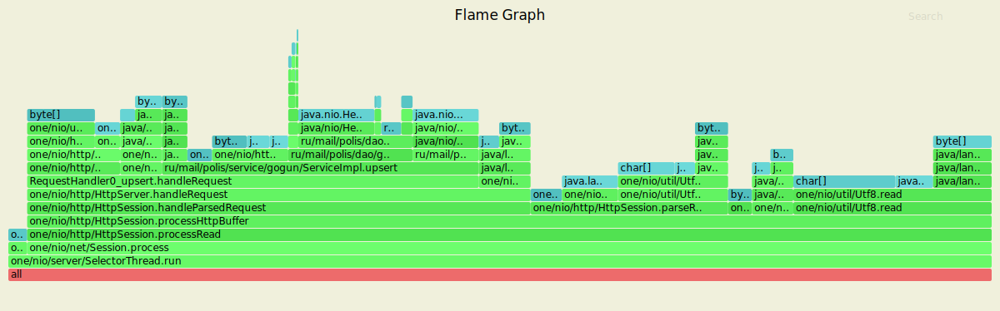
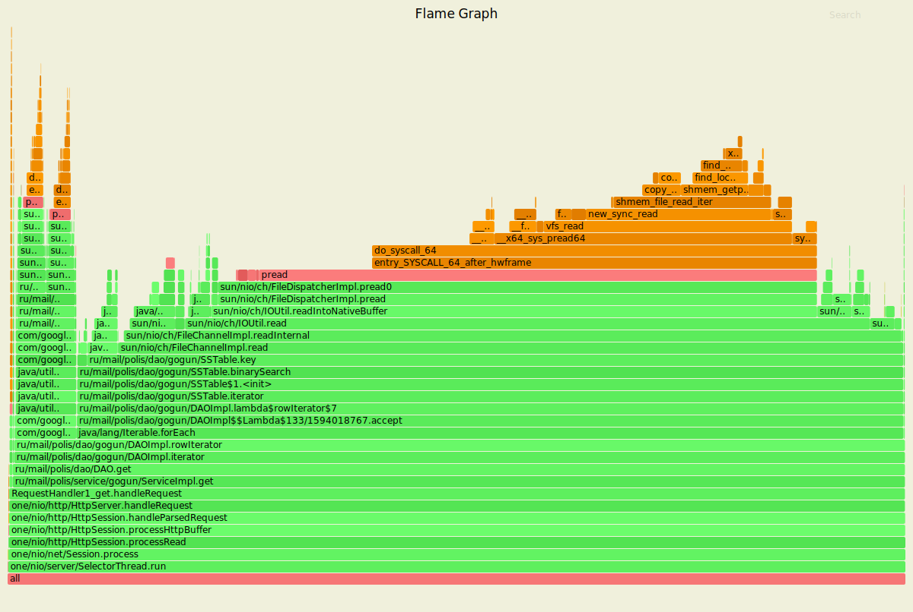
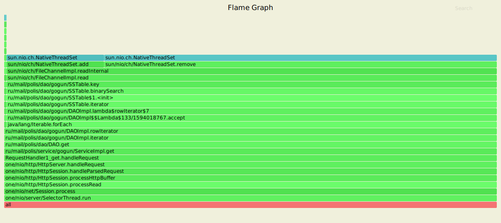

# Отчет по второму этапу

## Предисловие

Бесконечные `OutOfMemory` были устранены оптимизацией работы `SSTable`, прогнал `RepeatedTests` все канкарент тесты, ни разу ошибка не выскочила. Благодаря этому удалось избавиться от высокой потребляемости cpu сборщиком мусора, которая была заметна на профилировании первого этапа.
    
## Отчет
   
### PUT
   
   `$ wrk2 -t 4 -c 16 -L -d5m -s wrk_scripts/put.lua http://localhost:8080 -R 20000`
   
Стрелял с рейтом в 20000, 4 потока, 16 соединений
   
    Running 5m test @ http://localhost:8080
      4 threads and 16 connections
      Thread calibration: mean lat.: 1.308ms, rate sampling interval: 10ms
      Thread calibration: mean lat.: 1.299ms, rate sampling interval: 10ms
      Thread calibration: mean lat.: 1.302ms, rate sampling interval: 10ms
      Thread calibration: mean lat.: 1.313ms, rate sampling interval: 10ms
      Thread Stats   Avg      Stdev     Max   +/- Stdev
        Latency     1.33ms    1.37ms  44.86ms   97.23%
        Req/Sec     5.28k   677.16    20.22k    85.67%
      Latency Distribution (HdrHistogram - Recorded Latency)
     50.000%    1.17ms
     75.000%    1.62ms
     90.000%    2.07ms
     99.000%    5.56ms
     99.900%   20.00ms
     99.990%   34.72ms
     99.999%   39.74ms
    100.000%   44.90ms
    
      Detailed Percentile spectrum:
           Value   Percentile   TotalCount 1/(1-Percentile)
    
           0.020     0.000000            2         1.00
           0.438     0.100000       580849         1.11
           0.674     0.200000      1162230         1.25
           0.861     0.300000      1740333         1.43
           1.017     0.400000      2320061         1.67
           1.171     0.500000      2900782         2.00
           1.254     0.550000      3192991         2.22
           1.338     0.600000      3482547         2.50
           1.425     0.650000      3772581         2.86
           1.516     0.700000      4060696         3.33
           1.617     0.750000      4350453         4.00
           1.674     0.775000      4496311         4.44
           1.736     0.800000      4641393         5.00
           1.805     0.825000      4785738         5.71
           1.883     0.850000      4931078         6.67
           1.970     0.875000      5075183         8.00
           2.017     0.887500      5147347         8.89
           2.069     0.900000      5220970        10.00
           2.125     0.912500      5293585        11.43
           2.189     0.925000      5365964        13.33
           2.265     0.937500      5437653        16.00
           2.311     0.943750      5474220        17.78
           2.365     0.950000      5510816        20.00
           2.427     0.956250      5546506        22.86
           2.505     0.962500      5582151        26.67
           2.613     0.968750      5618628        32.00
           2.685     0.971875      5636538        35.56
           2.783     0.975000      5654808        40.00
           2.923     0.978125      5672752        45.71
           3.171     0.981250      5690883        53.33
           3.651     0.984375      5709001        64.00
           4.027     0.985938      5718082        71.11
           4.507     0.987500      5727157        80.00
           5.119     0.989062      5736165        91.43
           5.899     0.990625      5745249       106.67
           6.871     0.992188      5754311       128.00
           7.467     0.992969      5758835       142.22
           8.159     0.993750      5763360       160.00
           8.975     0.994531      5767892       182.86
           9.959     0.995313      5772422       213.33
          11.095     0.996094      5776949       256.00
          11.759     0.996484      5779231       284.44
          12.479     0.996875      5781499       320.00
          13.287     0.997266      5783748       365.71
          14.247     0.997656      5786028       426.67
          15.383     0.998047      5788276       512.00
          16.047     0.998242      5789411       568.89
          16.799     0.998437      5790538       640.00
          17.711     0.998633      5791669       731.43
          18.863     0.998828      5792808       853.33
          20.191     0.999023      5793945      1024.00
          20.927     0.999121      5794511      1137.78
          21.727     0.999219      5795070      1280.00
          22.671     0.999316      5795638      1462.86
          23.775     0.999414      5796204      1706.67
          25.231     0.999512      5796774      2048.00
          26.031     0.999561      5797051      2275.56
          27.007     0.999609      5797335      2560.00
          28.175     0.999658      5797618      2925.71
          29.439     0.999707      5797903      3413.33
          30.735     0.999756      5798185      4096.00
          31.375     0.999780      5798325      4551.11
          32.015     0.999805      5798466      5120.00
          32.703     0.999829      5798609      5851.43
          33.407     0.999854      5798758      6826.67
          34.079     0.999878      5798895      8192.00
          34.431     0.999890      5798966      9102.22
          34.783     0.999902      5799032     10240.00
          35.199     0.999915      5799104     11702.86
          35.647     0.999927      5799177     13653.33
          36.063     0.999939      5799247     16384.00
          36.255     0.999945      5799280     18204.44
          36.543     0.999951      5799319     20480.00
          36.735     0.999957      5799353     23405.71
          36.991     0.999963      5799388     27306.67
          37.279     0.999969      5799424     32768.00
          37.503     0.999973      5799441     36408.89
          37.727     0.999976      5799458     40960.00
          38.015     0.999979      5799475     46811.43
          38.367     0.999982      5799492     54613.33
          38.847     0.999985      5799511     65536.00
          39.167     0.999986      5799521     72817.78
          39.359     0.999988      5799528     81920.00
          39.679     0.999989      5799539     93622.86
          39.839     0.999991      5799545    109226.67
          40.319     0.999992      5799554    131072.00
          40.671     0.999993      5799559    145635.56
          40.927     0.999994      5799564    163840.00
          41.247     0.999995      5799568    187245.71
          41.375     0.999995      5799572    218453.33
          41.823     0.999996      5799576    262144.00
          41.855     0.999997      5799579    291271.11
          41.919     0.999997      5799581    327680.00
          42.143     0.999997      5799583    374491.43
          42.367     0.999998      5799585    436906.67
          42.399     0.999998      5799587    524288.00
          42.879     0.999998      5799589    582542.22
          42.911     0.999998      5799590    655360.00
          42.943     0.999999      5799591    748982.86
          43.359     0.999999      5799592    873813.33
          43.583     0.999999      5799593   1048576.00
          43.871     0.999999      5799594   1165084.44
          43.871     0.999999      5799594   1310720.00
          44.127     0.999999      5799595   1497965.71
          44.127     0.999999      5799595   1747626.67
          44.319     1.000000      5799596   2097152.00
          44.319     1.000000      5799596   2330168.89
          44.319     1.000000      5799596   2621440.00
          44.671     1.000000      5799597   2995931.43
          44.671     1.000000      5799597   3495253.33
          44.671     1.000000      5799597   4194304.00
          44.671     1.000000      5799597   4660337.78
          44.671     1.000000      5799597   5242880.00
          44.895     1.000000      5799598   5991862.86
          44.895     1.000000      5799598          inf
    #[Mean    =        1.328, StdDeviation   =        1.369]
    #[Max     =       44.864, Total count    =      5799598]
    #[Buckets =           27, SubBuckets     =         2048]
    ----------------------------------------------------------
      5999839 requests in 5.00m, 383.37MB read
    Requests/sec:  19999.43
    Transfer/sec:      1.28MB

- 77% занимает обработка запроса 
- 11% из которой ест вставка в таблицу в памяти
- чтение из сокета - 12%
- запись в сокет - 38% 

- порядка 47% суммарно занимает чтение и парсинг запроса 
- 9% - отправка ответа
- 12% - запись в таблицу в памяти

- Reentrant Read Lock - 91%
- Write lock на flush - 8%

### GET

    $ wrk2 -t 4 -c 16 -L -d60s -s wrk_scripts/get.lua http://localhost:8080 -R 1000

Стрелял с рейтом 1000, также 4 потока и 16 соединений 

    Running 1m test @ http://localhost:8080
      4 threads and 16 connections
      Thread calibration: mean lat.: 6.041ms, rate sampling interval: 18ms
      Thread calibration: mean lat.: 6.055ms, rate sampling interval: 17ms
      Thread calibration: mean lat.: 6.675ms, rate sampling interval: 19ms
      Thread calibration: mean lat.: 5.762ms, rate sampling interval: 16ms
      Thread Stats   Avg      Stdev     Max   +/- Stdev
        Latency    13.90ms   27.30ms 385.28ms   94.47%
        Req/Sec   257.21     45.04   470.00     70.16%
      Latency Distribution (HdrHistogram - Recorded Latency)
     50.000%    7.28ms
     75.000%   10.53ms
     90.000%   15.73ms
     99.000%  161.66ms
     99.900%  345.86ms
     99.990%  380.42ms
     99.999%  385.54ms
    100.000%  385.54ms

    Detailed Percentile spectrum:
       Value   Percentile   TotalCount 1/(1-Percentile)

       3.581     0.000000            1         1.00
       5.195     0.100000         5023         1.11
       5.851     0.200000        10015         1.25
       6.403     0.300000        15001         1.43
       6.847     0.400000        20024         1.67
       7.279     0.500000        24995         2.00
       7.547     0.550000        27497         2.22
       7.883     0.600000        30004         2.50
       8.367     0.650000        32493         2.86
       9.191     0.700000        34992         3.33
      10.527     0.750000        37486         4.00
      11.311     0.775000        38733         4.44
      11.967     0.800000        39983         5.00
      12.487     0.825000        41246         5.71
      13.023     0.850000        42496         6.67
      13.743     0.875000        43730         8.00
      14.367     0.887500        44354         8.89
      15.735     0.900000        44978        10.00
      19.279     0.912500        45604        11.43
      25.743     0.925000        46228        13.33
      34.463     0.937500        46853        16.00
      40.223     0.943750        47164        17.78
      47.583     0.950000        47479        20.00
      55.679     0.956250        47790        22.86
      63.903     0.962500        48102        26.67
      73.663     0.968750        48415        32.00
      77.887     0.971875        48570        35.56
      84.351     0.975000        48726        40.00
      94.463     0.978125        48882        45.71
     107.135     0.981250        49039        53.33
     125.375     0.984375        49195        64.00
     135.167     0.985938        49273        71.11
     143.999     0.987500        49351        80.00
     154.495     0.989062        49429        91.43
     164.735     0.990625        49507       106.67
     173.823     0.992188        49585       128.00
     179.071     0.992969        49625       142.22
     183.295     0.993750        49663       160.00
     188.159     0.994531        49703       182.86
     195.199     0.995313        49742       213.33
     202.111     0.996094        49780       256.00
     210.303     0.996484        49800       284.44
     215.423     0.996875        49819       320.00
     220.671     0.997266        49839       365.71
     227.327     0.997656        49858       426.67
     259.583     0.998047        49878       512.00
     277.503     0.998242        49888       568.89
     306.431     0.998437        49897       640.00
     325.631     0.998633        49907       731.43
     339.455     0.998828        49918       853.33
     348.159     0.999023        49927      1024.00
     352.255     0.999121        49932      1137.78
     354.559     0.999219        49936      1280.00
     356.863     0.999316        49941      1462.86
     359.167     0.999414        49946      1706.67
     361.471     0.999512        49951      2048.00
     363.519     0.999561        49954      2275.56
     364.031     0.999609        49956      2560.00
     365.055     0.999658        49958      2925.71
     366.079     0.999707        49961      3413.33
     366.847     0.999756        49963      4096.00
     368.127     0.999780        49965      4551.11
     369.407     0.999805        49966      5120.00
     373.759     0.999829        49967      5851.43
     376.063     0.999854        49968      6826.67
     378.879     0.999878        49969      8192.00
     380.415     0.999890        49970      9102.22
     381.695     0.999902        49971     10240.00
     381.695     0.999915        49971     11702.86
     383.743     0.999927        49972     13653.33
     383.743     0.999939        49972     16384.00
     384.255     0.999945        49973     18204.44
     384.255     0.999951        49973     20480.00
     384.255     0.999957        49973     23405.71
     384.767     0.999963        49974     27306.67
     384.767     0.999969        49974     32768.00
     384.767     0.999973        49974     36408.89
     384.767     0.999976        49974     40960.00
     384.767     0.999979        49974     46811.43
     385.535     0.999982        49975     54613.33
     385.535     1.000000        49975          inf
    #[Mean    =       13.898, StdDeviation   =       27.295]
    #[Max     =      385.280, Total count    =        49975]
    #[Buckets =           27, SubBuckets     =         2048]
    ----------------------------------------------------------
      59992 requests in 1.00m, 4.10MB read
    Requests/sec:    999.83
    Transfer/sec:     69.90KB

- здесь почти всё cpu занимает чтение из DAO - 99%
- из которых 91% - бинарный поиск для нахождения места в файле, с которого будем читать
- а 7% занимает Merge итераторов

- здесь ситуация похожая, 99% - чтение из DAO
- из которых 87% - бинарный поиск
- а 9% - Merge

- 99% - блокировка файлов