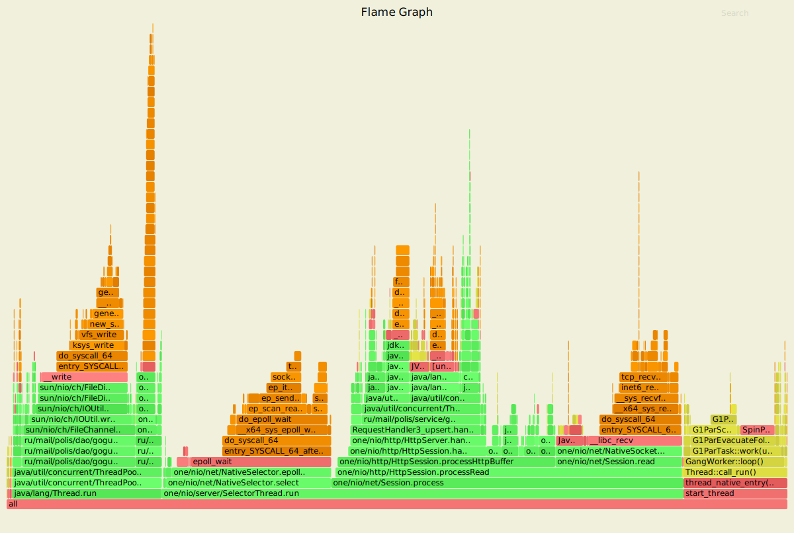
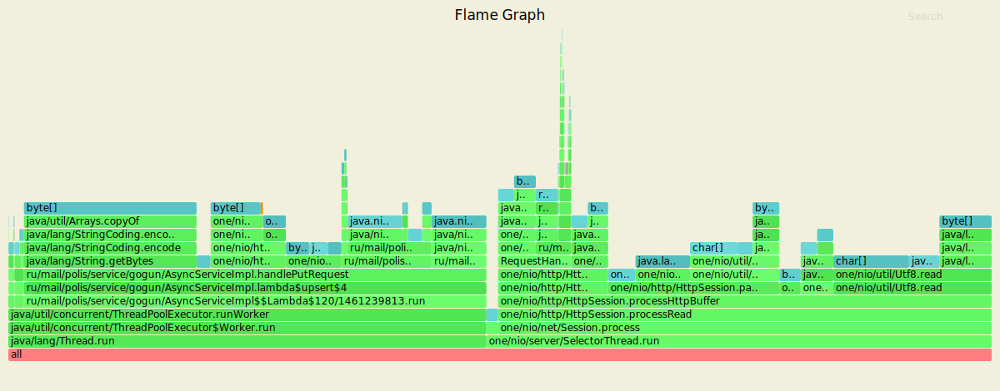
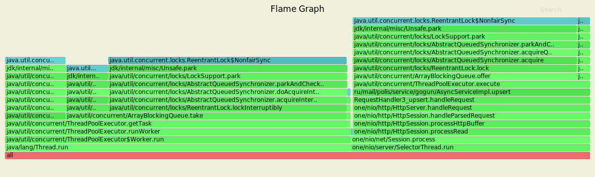
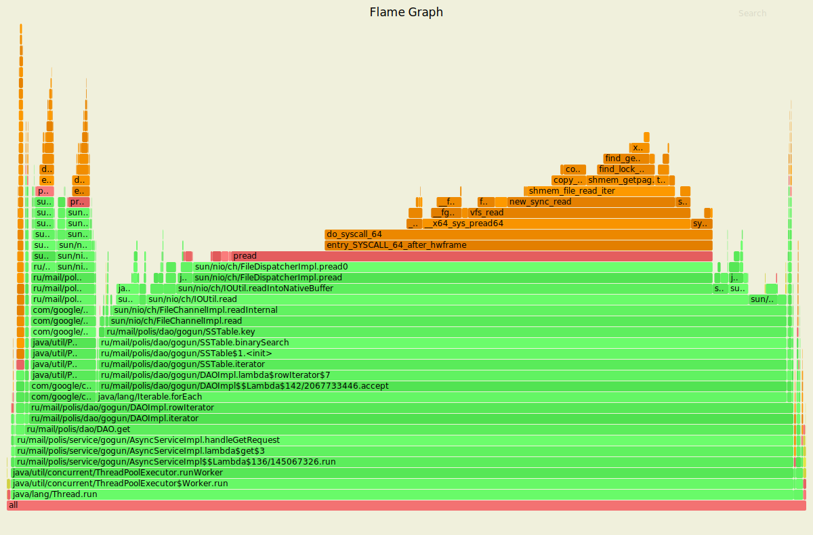
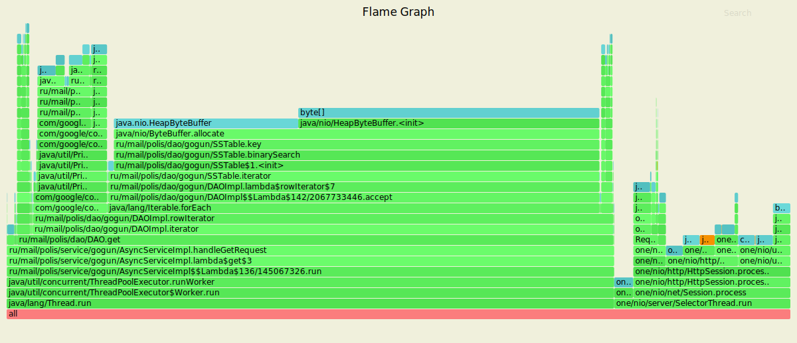
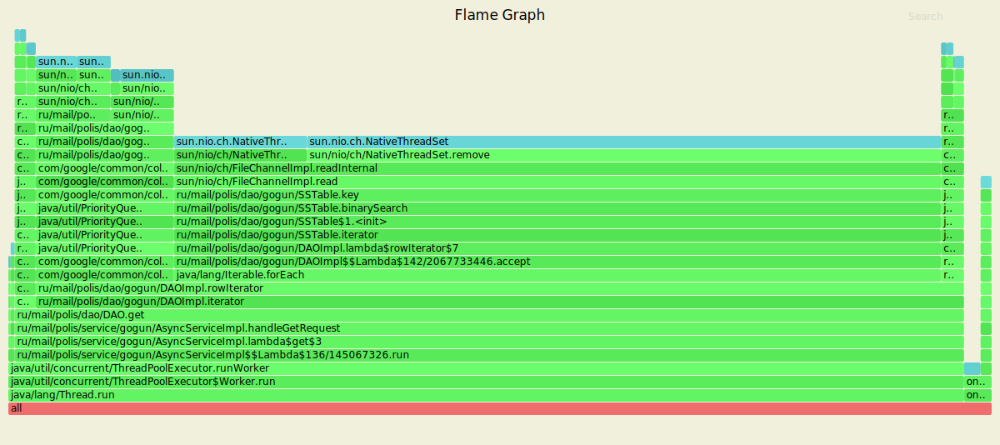

# Отчет по третьему этапу

## PUT

    $ wrk2 -t 4 -c 64 -L -d5m -s wrk_scripts/put.lua http://localhost:8080 -R 80000
    
Стрелял с рейтом в 80000, что в два раза больше, чем в прошлом этапе. 4 потока, 64 соединения    
    
    Running 5m test @ http://localhost:8080
      4 threads and 64 connections
      Thread calibration: mean lat.: 15.692ms, rate sampling interval: 80ms
      Thread calibration: mean lat.: 14.399ms, rate sampling interval: 74ms
      Thread calibration: mean lat.: 15.279ms, rate sampling interval: 79ms
      Thread calibration: mean lat.: 14.589ms, rate sampling interval: 76ms
      Thread Stats   Avg      Stdev     Max   +/- Stdev
        Latency    12.40ms   14.72ms 178.69ms   82.34%
        Req/Sec    20.13k     5.31k   36.37k    64.09%
      Latency Distribution (HdrHistogram - Recorded Latency)
     50.000%    4.56ms
     75.000%   20.86ms
     90.000%   35.33ms
     99.000%   55.84ms
     99.900%   72.96ms
     99.990%   99.20ms
     99.999%  154.62ms
    100.000%  178.82ms
    
      Detailed Percentile spectrum:
           Value   Percentile   TotalCount 1/(1-Percentile)

       0.020     0.000000            1         1.00
       0.673     0.100000      2322706         1.11
       1.076     0.200000      4638996         1.25
       1.481     0.300000      6960925         1.43
       2.079     0.400000      9280198         1.67
       4.563     0.500000     11597210         2.00
       7.275     0.550000     12756692         2.22
      10.287     0.600000     13917289         2.50
      13.543     0.650000     15076291         2.86
      17.071     0.700000     16235941         3.33
      20.863     0.750000     17396633         4.00
      22.879     0.775000     17975323         4.44
      25.023     0.800000     18555000         5.00
      27.295     0.825000     19134651         5.71
      29.727     0.850000     19713763         6.67
      32.383     0.875000     20293904         8.00
      33.823     0.887500     20585670         8.89
      35.327     0.900000     20872164        10.00
      36.991     0.912500     21166353        11.43
      38.751     0.925000     21452542        13.33
      40.767     0.937500     21745754        16.00
      41.855     0.943750     21890267        17.78
      43.007     0.950000     22032158        20.00
      44.319     0.956250     22179690        22.86
      45.727     0.962500     22323564        26.67
      47.295     0.968750     22467191        32.00
      48.191     0.971875     22541169        35.56
      49.119     0.975000     22611527        40.00
      50.175     0.978125     22684446        45.71
      51.359     0.981250     22757360        53.33
      52.703     0.984375     22829747        64.00
      53.471     0.985938     22866353        71.11
      54.303     0.987500     22902124        80.00
      55.231     0.989062     22937936        91.43
      56.287     0.990625     22974125       106.67
      57.503     0.992188     23010274       128.00
      58.207     0.992969     23028339       142.22
      59.007     0.993750     23046517       160.00
      59.903     0.994531     23064449       182.86
      60.959     0.995313     23082428       213.33
      62.207     0.996094     23100485       256.00
      62.943     0.996484     23109668       284.44
      63.775     0.996875     23118760       320.00
      64.735     0.997266     23127694       365.71
      65.919     0.997656     23136775       426.67
      67.391     0.998047     23145845       512.00
      68.223     0.998242     23150351       568.89
      69.183     0.998437     23154983       640.00
      70.207     0.998633     23159356       731.43
      71.551     0.998828     23163981       853.33
      73.151     0.999023     23168479      1024.00
      74.175     0.999121     23170668      1137.78
      75.455     0.999219     23172955      1280.00
      76.927     0.999316     23175206      1462.86
      78.591     0.999414     23177439      1706.67
      80.767     0.999512     23179743      2048.00
      81.983     0.999561     23180850      2275.56
      83.391     0.999609     23181994      2560.00
      84.991     0.999658     23183130      2925.71
      86.911     0.999707     23184271      3413.33
      89.151     0.999756     23185376      4096.00
      90.495     0.999780     23185936      4551.11
      91.967     0.999805     23186521      5120.00
      93.439     0.999829     23187079      5851.43
      95.103     0.999854     23187639      6826.67
      97.023     0.999878     23188203      8192.00
      98.175     0.999890     23188490      9102.22
      99.455     0.999902     23188765     10240.00
     101.247     0.999915     23189046     11702.86
     103.743     0.999927     23189328     13653.33
     107.007     0.999939     23189615     16384.00
     108.927     0.999945     23189753     18204.44
     110.975     0.999951     23189894     20480.00
     113.471     0.999957     23190036     23405.71
     117.375     0.999963     23190177     27306.67
     122.751     0.999969     23190322     32768.00
     126.719     0.999973     23190391     36408.89
     131.071     0.999976     23190460     40960.00
     136.575     0.999979     23190533     46811.43
     141.439     0.999982     23190604     54613.33
     146.175     0.999985     23190675     65536.00
     148.607     0.999986     23190708     72817.78
     151.295     0.999988     23190744     81920.00
     153.727     0.999989     23190779     93622.86
     155.775     0.999991     23190817    109226.67
     157.439     0.999992     23190850    131072.00
     158.463     0.999993     23190867    145635.56
     159.999     0.999994     23190886    163840.00
     160.767     0.999995     23190903    187245.71
     161.663     0.999995     23190922    218453.33
     162.943     0.999996     23190938    262144.00
     163.839     0.999997     23190947    291271.11
     164.863     0.999997     23190956    327680.00
     165.631     0.999997     23190965    374491.43
     166.143     0.999998     23190975    436906.67
     166.783     0.999998     23190982    524288.00
     167.039     0.999998     23190987    582542.22
     167.679     0.999998     23190991    655360.00
     169.087     0.999999     23190996    748982.86
     170.495     0.999999     23191000    873813.33
     171.903     0.999999     23191004   1048576.00
     172.799     0.999999     23191007   1165084.44
     173.311     0.999999     23191009   1310720.00
     174.079     0.999999     23191011   1497965.71
     174.463     0.999999     23191013   1747626.67
     174.847     1.000000     23191015   2097152.00
     175.487     1.000000     23191017   2330168.89
     175.615     1.000000     23191018   2621440.00
     175.871     1.000000     23191019   2995931.43
     176.127     1.000000     23191020   3495253.33
     176.383     1.000000     23191021   4194304.00
     176.639     1.000000     23191022   4660337.78
     176.639     1.000000     23191022   5242880.00
     176.767     1.000000     23191023   5991862.86
     176.767     1.000000     23191023   6990506.67
     177.407     1.000000     23191024   8388608.00
     177.407     1.000000     23191024   9320675.55
     177.407     1.000000     23191024  10485760.00
     178.047     1.000000     23191025  11983725.71
     178.047     1.000000     23191025  13981013.34
     178.047     1.000000     23191025  16777216.00
     178.047     1.000000     23191025  18641351.10
     178.047     1.000000     23191025  20971519.98
     178.815     1.000000     23191026  23967451.45
     178.815     1.000000     23191026          inf
    #[Mean    =       12.396, StdDeviation   =       14.724]
    #[Max     =      178.688, Total count    =     23191026]
    #[Buckets =           27, SubBuckets     =         2048]
    ----------------------------------------------------------
      23994337 requests in 5.00m, 1.50GB read
    Requests/sec:  79981.72
    Transfer/sec:      5.11MB
    

- 20% занимает воркер, то есть поток из executorservice'a
- 1% из которого занимает getTask
- 15% на flush
- и 3% на обработку запроса и запись в memTable
- 21% уходит на выборку Selector'ом
- 16% на чтение их сокета
- 10% уходит на парсинг запроса  
- 16% на обработку ThreadPoolExecutor

В сравнении с прошлым этапом можно увидеть возросшую пропускную способность
из-за разгрузки Select'ров

- ThreadPool Worker занимает 48%
- остальная память уходит на чтение и обработку запроса селектором

Ситуация схожая с прошлым этапом только добавились блокировки на ArrayBlockingQueue - то есть
на выборку задачи из ExecutorService - 58%

## GET

    $ wrk2 -t 4 -c 64 -L -d2m -s wrk_scripts/get.lua http://localhost:8080 -R 2000
    
Стрелял с рейтом в 2000, что в два раза больше чем в прошлом этапе. 4 потока, 64
соединения
    
       Running 2m test @ http://localhost:8080
      4 threads and 64 connections
      Thread calibration: mean lat.: 5.982ms, rate sampling interval: 37ms
      Thread calibration: mean lat.: 5.872ms, rate sampling interval: 36ms
      Thread calibration: mean lat.: 5.950ms, rate sampling interval: 37ms
      Thread calibration: mean lat.: 5.971ms, rate sampling interval: 37ms
      Thread Stats   Avg      Stdev     Max   +/- Stdev
        Latency     5.30ms    9.38ms 122.18ms   89.79%
        Req/Sec   506.57    105.72     1.28k    84.18%
      Latency Distribution (HdrHistogram - Recorded Latency)
     50.000%    2.21ms
     75.000%    2.73ms
     90.000%   15.29ms
     99.000%   46.91ms
     99.900%   73.02ms
     99.990%   95.29ms
     99.999%  110.27ms
    100.000%  122.24ms
    
      Detailed Percentile spectrum:
           Value   Percentile   TotalCount 1/(1-Percentile)

       0.896     0.000000            1         1.00
       1.523     0.100000        22060         1.11
       1.735     0.200000        44054         1.25
       1.908     0.300000        66021         1.43
       2.061     0.400000        87961         1.67
       2.213     0.500000       109925         2.00
       2.293     0.550000       121119         2.22
       2.379     0.600000       132114         2.50
       2.473     0.650000       143024         2.86
       2.585     0.700000       153922         3.33
       2.729     0.750000       164919         4.00
       2.821     0.775000       170388         4.44
       2.949     0.800000       175921         5.00
       3.165     0.825000       181395         5.71
       4.431     0.850000       186864         6.67
       9.135     0.875000       192366         8.00
      12.015     0.887500       195108         8.89
      15.295     0.900000       197861        10.00
      18.495     0.912500       200609        11.43
      21.407     0.925000       203355        13.33
      24.175     0.937500       206108        16.00
      25.631     0.943750       207474        17.78
      27.247     0.950000       208854        20.00
      28.847     0.956250       210234        22.86
      30.527     0.962500       211599        26.67
      32.447     0.968750       212974        32.00
      33.663     0.971875       213657        35.56
      35.199     0.975000       214353        40.00
      37.151     0.978125       215033        45.71
      39.199     0.981250       215727        53.33
      41.407     0.984375       216409        64.00
      42.751     0.985938       216757        71.11
      44.159     0.987500       217095        80.00
      45.791     0.989062       217437        91.43
      47.679     0.990625       217782       106.67
      50.079     0.992188       218124       128.00
      51.423     0.992969       218295       142.22
      52.799     0.993750       218471       160.00
      54.559     0.994531       218639       182.86
      56.543     0.995313       218809       213.33
      58.847     0.996094       218982       256.00
      60.063     0.996484       219068       284.44
      61.183     0.996875       219154       320.00
      62.431     0.997266       219241       365.71
      64.063     0.997656       219324       426.67
      66.111     0.998047       219412       512.00
      67.263     0.998242       219455       568.89
      68.287     0.998437       219497       640.00
      69.631     0.998633       219539       731.43
      71.359     0.998828       219582       853.33
      73.215     0.999023       219629      1024.00
      73.919     0.999121       219646      1137.78
      75.199     0.999219       219668      1280.00
      76.351     0.999316       219689      1462.86
      77.695     0.999414       219711      1706.67
      80.127     0.999512       219732      2048.00
      81.791     0.999561       219744      2275.56
      82.751     0.999609       219754      2560.00
      84.031     0.999658       219764      2925.71
      85.759     0.999707       219775      3413.33
      87.231     0.999756       219786      4096.00
      88.383     0.999780       219791      4551.11
      90.303     0.999805       219797      5120.00
      91.455     0.999829       219802      5851.43
      92.287     0.999854       219807      6826.67
      94.399     0.999878       219813      8192.00
      95.039     0.999890       219815      9102.22
      95.295     0.999902       219818     10240.00
      95.999     0.999915       219821     11702.86
      97.407     0.999927       219823     13653.33
      98.431     0.999939       219826     16384.00
      98.815     0.999945       219827     18204.44
      99.967     0.999951       219829     20480.00
     100.671     0.999957       219830     23405.71
     101.055     0.999963       219831     27306.67
     105.599     0.999969       219833     32768.00
     105.599     0.999973       219833     36408.89
     106.175     0.999976       219834     40960.00
     106.879     0.999979       219835     46811.43
     106.879     0.999982       219835     54613.33
     107.135     0.999985       219836     65536.00
     107.135     0.999986       219836     72817.78
     110.271     0.999988       219837     81920.00
     110.271     0.999989       219837     93622.86
     110.271     0.999991       219837    109226.67
     112.703     0.999992       219838    131072.00
     112.703     0.999993       219838    145635.56
     112.703     0.999994       219838    163840.00
     112.703     0.999995       219838    187245.71
     112.703     0.999995       219838    218453.33
     122.239     0.999996       219839    262144.00
     122.239     1.000000       219839          inf
    #[Mean    =        5.305, StdDeviation   =        9.377]
    #[Max     =      122.176, Total count    =       219839]
    #[Buckets =           27, SubBuckets     =         2048]
    ----------------------------------------------------------
      239952 requests in 2.00m, 16.62MB read
    Requests/sec:   1999.59
    Transfer/sec:    141.86KB

Здесь ситуация в точности такая же как и на прошлом этапе, только теперь работа, 
которая делалась в Selector треде, была вынесена в отдельный поток, который занимает
98% и SelectorThread с чтением сокета и выбором потока из очереди 1%

- SelectorThread - 22% на обслуживание запроса (чтение, парсинг)
- и 77% у Thread.run на поиск в файле и Merge итераторов

Теперь кроме блокировки файлов и итераторов еще 1% на блокировку ArrayBlockingQueue 