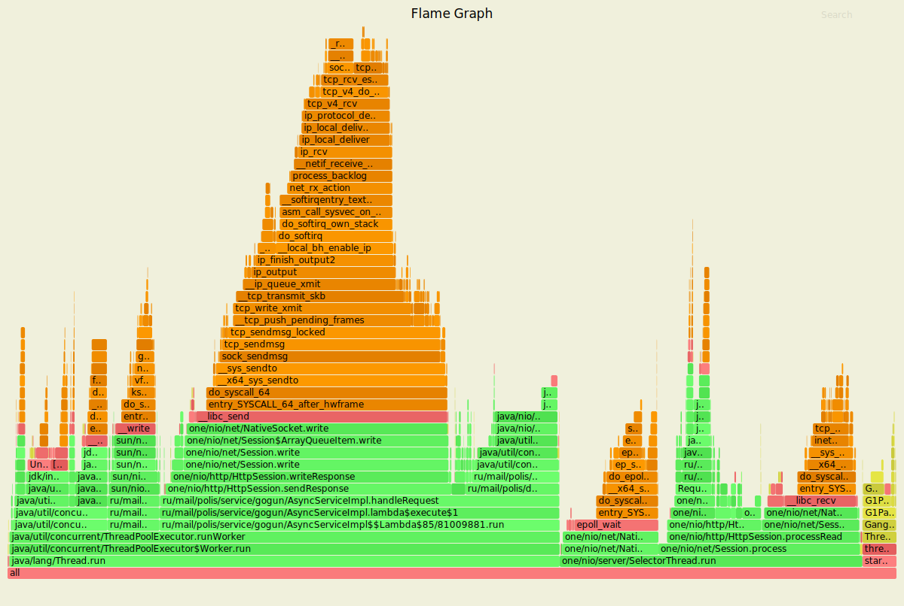
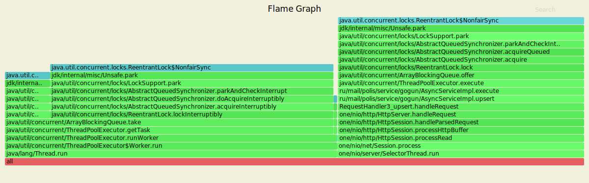
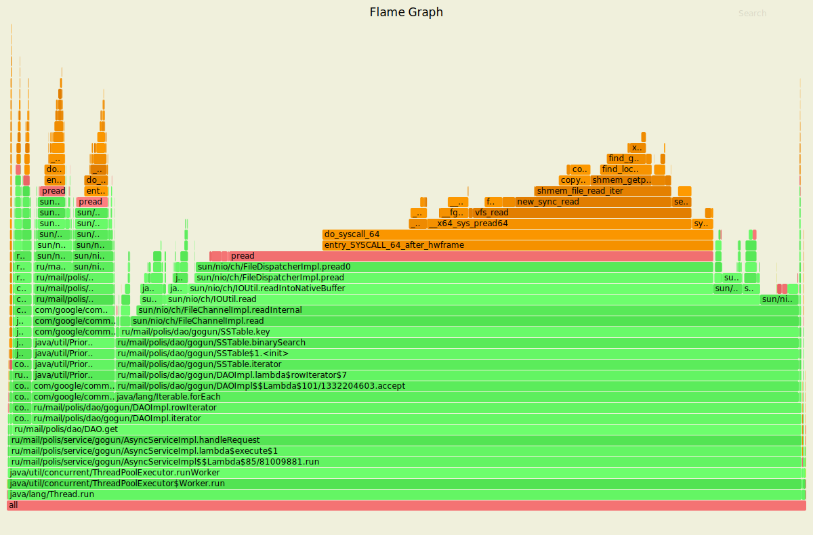
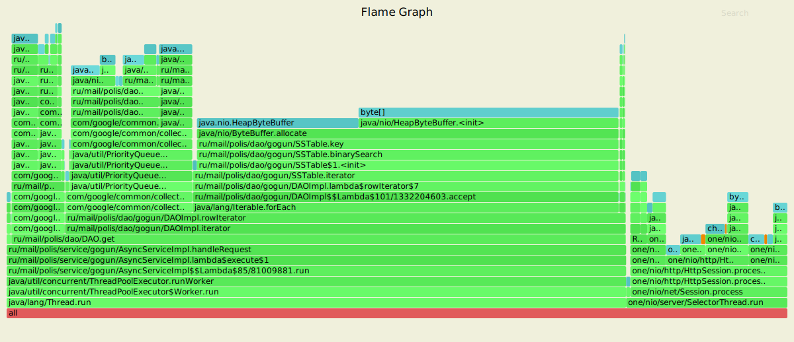
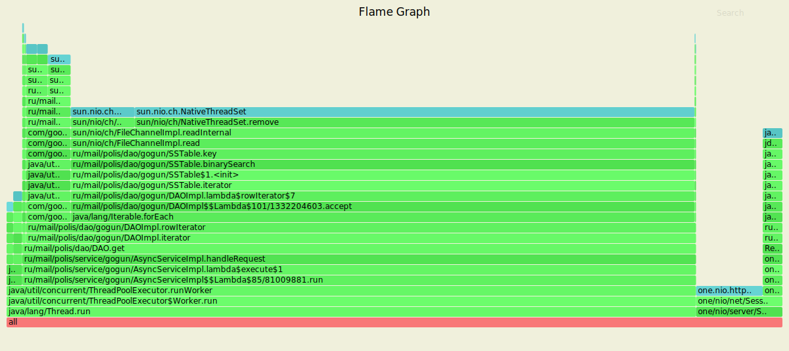

# Отчет
## Put

Обстрел шел 5 минут с рейтом 80 000, 4 потока и 32 соединения. 
Количество соединений было уменьшено из-за AbortPolicy.

`wrk2 -t 4  -c 32 -L -d5m -R 80000 -s wrk_scripts/put.lua http://localhost:8080`

    Running 5m test @ http://localhost:8080
      4 threads and 32 connections
      Thread calibration: mean lat.: 15.273ms, rate sampling interval: 85ms
      Thread calibration: mean lat.: 15.708ms, rate sampling interval: 88ms
      Thread calibration: mean lat.: 14.915ms, rate sampling interval: 84ms
      Thread calibration: mean lat.: 15.160ms, rate sampling interval: 86ms
      Thread Stats   Avg      Stdev     Max   +/- Stdev
        Latency    14.34ms   18.35ms 202.37ms   82.83%
        Req/Sec    20.12k     5.58k   36.92k    63.47%
      Latency Distribution (HdrHistogram - Recorded Latency)
     50.000%    3.65ms
     75.000%   24.96ms
     90.000%   41.06ms
     99.000%   64.80ms
     99.900%  150.14ms
     99.990%  184.57ms
     99.999%  196.61ms
    100.000%  202.49ms
    
      Detailed Percentile spectrum:
           Value   Percentile   TotalCount 1/(1-Percentile)
    
           0.020     0.000000            1         1.00
           0.589     0.100000      2324518         1.11
           1.009     0.200000      4640604         1.25
           1.376     0.300000      6961177         1.43
           1.887     0.400000      9282963         1.67
           3.649     0.500000     11600753         2.00
           7.235     0.550000     12760529         2.22
          11.415     0.600000     13921202         2.50
          15.815     0.650000     15081745         2.86
          20.351     0.700000     16243873         3.33
          24.959     0.750000     17403102         4.00
          27.343     0.775000     17980689         4.44
          29.823     0.800000     18561765         5.00
          32.367     0.825000     19140985         5.71
          35.007     0.850000     19720771         6.67
          37.855     0.875000     20302037         8.00
          39.423     0.887500     20595482         8.89
          41.055     0.900000     20885668        10.00
          42.751     0.912500     21173311        11.43
          44.575     0.925000     21460730        13.33
          46.591     0.937500     21751053        16.00
          47.711     0.943750     21896165        17.78
          48.927     0.950000     22042111        20.00
          50.239     0.956250     22186551        22.86
          51.711     0.962500     22331214        26.67
          53.407     0.968750     22476215        32.00
          54.399     0.971875     22550071        35.56
          55.455     0.975000     22620510        40.00
          56.703     0.978125     22694049        45.71
          58.143     0.981250     22766739        53.33
          59.871     0.984375     22838285        64.00
          60.927     0.985938     22874270        71.11
          62.207     0.987500     22911017        80.00
          63.711     0.989062     22946748        91.43
          65.663     0.990625     22983374       106.67
          68.415     0.992188     23019670       128.00
          70.271     0.992969     23037272       142.22
          72.895     0.993750     23055572       160.00
          76.671     0.994531     23073496       182.86
          82.175     0.995313     23091656       213.33
          91.007     0.996094     23109813       256.00
          96.383     0.996484     23118836       284.44
         103.039     0.996875     23127904       320.00
         111.551     0.997266     23136972       365.71
         118.719     0.997656     23145994       426.67
         126.463     0.998047     23155069       512.00
         131.007     0.998242     23159628       568.89
         136.319     0.998437     23164187       640.00
         141.439     0.998633     23168768       731.43
         146.175     0.998828     23173277       853.33
         150.783     0.999023     23177778      1024.00
         152.959     0.999121     23179983      1137.78
         155.903     0.999219     23182265      1280.00
         159.743     0.999316     23184514      1462.86
         164.223     0.999414     23186839      1706.67
         167.679     0.999512     23189096      2048.00
         169.471     0.999561     23190192      2275.56
         171.263     0.999609     23191345      2560.00
         173.055     0.999658     23192463      2925.71
         174.719     0.999707     23193616      3413.33
         176.511     0.999756     23194703      4096.00
         177.663     0.999780     23195335      4551.11
         178.687     0.999805     23195877      5120.00
         180.223     0.999829     23196408      5851.43
         181.887     0.999854     23197002      6826.67
         183.295     0.999878     23197555      8192.00
         183.935     0.999890     23197819      9102.22
         184.703     0.999902     23198114     10240.00
         185.599     0.999915     23198412     11702.86
         186.623     0.999927     23198689     13653.33
         187.647     0.999939     23198959     16384.00
         188.287     0.999945     23199108     18204.44
         188.927     0.999951     23199247     20480.00
         189.695     0.999957     23199391     23405.71
         190.591     0.999963     23199530     27306.67
         191.615     0.999969     23199669     32768.00
         192.255     0.999973     23199732     36408.89
         193.023     0.999976     23199809     40960.00
         193.663     0.999979     23199880     46811.43
         194.175     0.999982     23199949     54613.33
         194.943     0.999985     23200020     65536.00
         195.199     0.999986     23200047     72817.78
         195.711     0.999988     23200090     81920.00
         196.223     0.999989     23200119     93622.86
         196.991     0.999991     23200159    109226.67
         197.375     0.999992     23200189    131072.00
         197.631     0.999993     23200208    145635.56
         198.015     0.999994     23200226    163840.00
         198.399     0.999995     23200246    187245.71
         198.655     0.999995     23200259    218453.33
         199.039     0.999996     23200277    262144.00
         199.295     0.999997     23200289    291271.11
         199.551     0.999997     23200298    327680.00
         199.807     0.999997     23200304    374491.43
         200.063     0.999998     23200313    436906.67
         200.319     0.999998     23200322    524288.00
         200.447     0.999998     23200326    582542.22
         200.575     0.999998     23200330    655360.00
         200.831     0.999999     23200337    748982.86
         200.959     0.999999     23200340    873813.33
         201.087     0.999999     23200346   1048576.00
         201.087     0.999999     23200346   1165084.44
         201.215     0.999999     23200350   1310720.00
         201.215     0.999999     23200350   1497965.71
         201.471     0.999999     23200352   1747626.67
         201.727     1.000000     23200354   2097152.00
         201.855     1.000000     23200356   2330168.89
         201.983     1.000000     23200359   2621440.00
         201.983     1.000000     23200359   2995931.43
         201.983     1.000000     23200359   3495253.33
         202.111     1.000000     23200362   4194304.00
         202.111     1.000000     23200362   4660337.78
         202.111     1.000000     23200362   5242880.00
         202.111     1.000000     23200362   5991862.86
         202.111     1.000000     23200362   6990506.67
         202.239     1.000000     23200363   8388608.00
         202.239     1.000000     23200363   9320675.55
         202.239     1.000000     23200363  10485760.00
         202.367     1.000000     23200364  11983725.71
         202.367     1.000000     23200364  13981013.34
         202.367     1.000000     23200364  16777216.00
         202.367     1.000000     23200364  18641351.10
         202.367     1.000000     23200364  20971519.98
         202.495     1.000000     23200365  23967451.45
         202.495     1.000000     23200365          inf
    #[Mean    =       14.338, StdDeviation   =       18.354]
    #[Max     =      202.368, Total count    =     23200365]
    #[Buckets =           27, SubBuckets     =         2048]
    ----------------------------------------------------------
      23998392 requests in 5.00m, 1.50GB read
    Requests/sec:  79994.90
    Transfer/sec:      5.11MB

`sudo async-profiler -d 30 -f ~/cpu_put.svg -e cpu 44039`

- 61% - поток из executor service
- 5% на флаш таблицы на диск
- 10% на обслуживание очереди потоков
- 45% которого идут на обработку запроса и отправку ответа
- из них 10% на upsert в DAO
- 1.5% на выбор ноды в consistent hashing
- и 32% на отправку ответа
- оставшиеся 34% уходят потоку селектора

`sudo async-profiler -d 30 -f ~/alloc_put.svg -e alloc 44039`

тут ситуация схожая с прошлым этапом

- половина памяти уходит на обработку запроса 
- из которой 1.5% уходят на объекты во флаше
- меньше одного процента на объекты локов в синхронизации thread pool executors
- 9% на получение ноды в ConsistentHashing 
- 11% - upsert в таблицу в памяти
- 7% на ByteBuffer ключа
- 3% на его byte[]
- 9% отправку ответа
- вторая половина памяти занята селектор тредом
- 37% суммарно на парсинг запроса
- и 9% на обработку  

`sudo async-profiler -d 30 -f ~/lock_put.svg -e lock 44039`

как в прошлом этапе

## GET

Обстрел шел с рейтом в 1000, 4 потока и 32 соединения. Количество запросов в секунду
 пришлось снизить, так как время обработки запроса увеличилось. 

`wrk2 -t 4  -c 32 -L -d5m -R 1000 -s wrk_scripts/get.lua http://localhost:8080`

    Running 5m test @ http://localhost:8080
      4 threads and 32 connections
      Thread calibration: mean lat.: 8.195ms, rate sampling interval: 50ms
      Thread calibration: mean lat.: 8.175ms, rate sampling interval: 51ms
      Thread calibration: mean lat.: 8.095ms, rate sampling interval: 49ms
      Thread calibration: mean lat.: 8.171ms, rate sampling interval: 53ms
      Thread Stats   Avg      Stdev     Max   +/- Stdev
        Latency     7.19ms    8.25ms 111.36ms   90.75%
        Req/Sec   252.15     45.83   500.00     86.35%
      Latency Distribution (HdrHistogram - Recorded Latency)
     50.000%    4.61ms
     75.000%    5.32ms
     90.000%   13.45ms
     99.000%   43.01ms
     99.900%   53.41ms
     99.990%   78.59ms
     99.999%  102.53ms
    100.000%  111.42ms
    
      Detailed Percentile spectrum:
           Value   Percentile   TotalCount 1/(1-Percentile)
    
           2.497     0.000000            1         1.00
           3.629     0.100000        29019         1.11
           3.945     0.200000        58222         1.25
           4.183     0.300000        87390         1.43
           4.395     0.400000       116272         1.67
           4.611     0.500000       145508         2.00
           4.723     0.550000       159933         2.22
           4.839     0.600000       174206         2.50
           4.971     0.650000       188826         2.86
           5.119     0.700000       203051         3.33
           5.315     0.750000       217572         4.00
           5.443     0.775000       224781         4.44
           5.615     0.800000       232016         5.00
           5.891     0.825000       239265         5.71
           6.467     0.850000       246478         6.67
           8.183     0.875000       253719         8.00
          10.063     0.887500       257343         8.89
          13.455     0.900000       260969        10.00
          16.623     0.912500       264591        11.43
          20.495     0.925000       268228        13.33
          24.591     0.937500       271851        16.00
          26.911     0.943750       273660        17.78
          29.183     0.950000       275463        20.00
          31.471     0.956250       277275        22.86
          33.503     0.962500       279100        26.67
          35.519     0.968750       280926        32.00
          36.575     0.971875       281811        35.56
          37.663     0.975000       282728        40.00
          38.687     0.978125       283625        45.71
          39.679     0.981250       284535        53.33
          40.703     0.984375       285431        64.00
          41.311     0.985938       285899        71.11
          41.887     0.987500       286337        80.00
          42.559     0.989062       286810        91.43
          43.327     0.990625       287251       106.67
          44.095     0.992188       287701       128.00
          44.543     0.992969       287923       142.22
          45.055     0.993750       288151       160.00
          45.663     0.994531       288387       182.86
          46.239     0.995313       288601       213.33
          46.975     0.996094       288832       256.00
          47.423     0.996484       288945       284.44
          47.967     0.996875       289055       320.00
          48.511     0.997266       289172       365.71
          49.119     0.997656       289284       426.67
          50.015     0.998047       289398       512.00
          50.527     0.998242       289451       568.89
          51.103     0.998437       289508       640.00
          51.647     0.998633       289567       731.43
          52.511     0.998828       289624       853.33
          53.535     0.999023       289678      1024.00
          54.527     0.999121       289706      1137.78
          55.583     0.999219       289734      1280.00
          57.087     0.999316       289763      1462.86
          59.039     0.999414       289791      1706.67
          61.407     0.999512       289819      2048.00
          62.815     0.999561       289833      2275.56
          64.351     0.999609       289847      2560.00
          66.303     0.999658       289861      2925.71
          68.159     0.999707       289876      3413.33
          70.719     0.999756       289890      4096.00
          71.551     0.999780       289897      4551.11
          72.575     0.999805       289905      5120.00
          73.855     0.999829       289911      5851.43
          76.095     0.999854       289918      6826.67
          77.695     0.999878       289925      8192.00
          78.399     0.999890       289929      9102.22
          78.719     0.999902       289932     10240.00
          80.063     0.999915       289936     11702.86
          80.703     0.999927       289939     13653.33
          81.983     0.999939       289943     16384.00
          82.175     0.999945       289945     18204.44
          82.367     0.999951       289946     20480.00
          83.583     0.999957       289948     23405.71
          85.631     0.999963       289950     27306.67
          91.775     0.999969       289952     32768.00
          92.159     0.999973       289953     36408.89
          92.159     0.999976       289953     40960.00
          92.479     0.999979       289954     46811.43
          92.607     0.999982       289955     54613.33
          96.127     0.999985       289956     65536.00
         102.527     0.999986       289957     72817.78
         102.527     0.999988       289957     81920.00
         102.527     0.999989       289957     93622.86
         103.935     0.999991       289958    109226.67
         103.935     0.999992       289958    131072.00
         108.479     0.999993       289959    145635.56
         108.479     0.999994       289959    163840.00
         108.479     0.999995       289959    187245.71
         108.479     0.999995       289959    218453.33
         108.479     0.999996       289959    262144.00
         111.423     0.999997       289960    291271.11
         111.423     1.000000       289960          inf
    #[Mean    =        7.192, StdDeviation   =        8.254]
    #[Max     =      111.360, Total count    =       289960]
    #[Buckets =           27, SubBuckets     =         2048]
    ----------------------------------------------------------
      299996 requests in 5.00m, 20.80MB read
    Requests/sec:    999.97
    Transfer/sec:     71.01KB

`sudo async-profiler -d 30 -f ~/cpu_get.svg -e cpu 44039`

Ситуация точь-в-точь прошлый этап, почти все уходит на поиск в таблице.
ConsistentHashing не нашел, видимо ест совсем мало

`sudo async-profiler -d 30 -f ~/alloc_get.svg -e alloc 44039`

тоже ничего не поменялось. и ConsistentHashing ест слишком мало, видимо, чтобы его отобразить.

`sudo async-profiler -d 30 -f ~/lock_get.svg -e lock 44039`

немного поменялось процентное соотношение, но в целом картина такая же. 
SelectorThread - было 3% стало 11%
Merge итераторов - было 14% стало 6%
 

