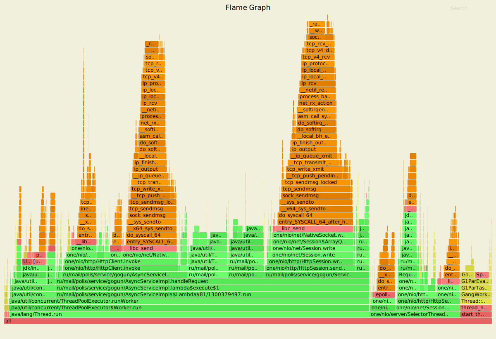
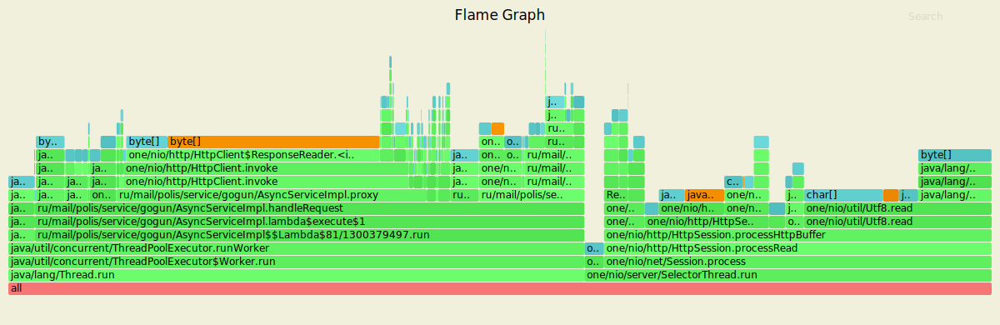
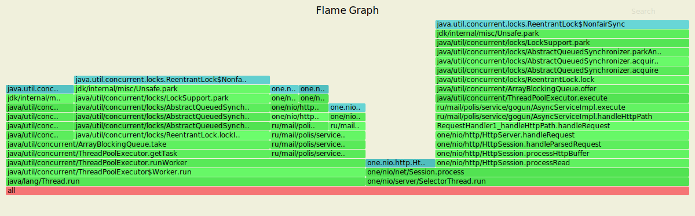
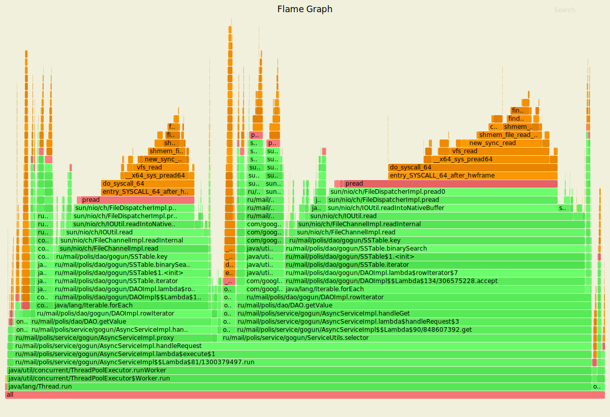
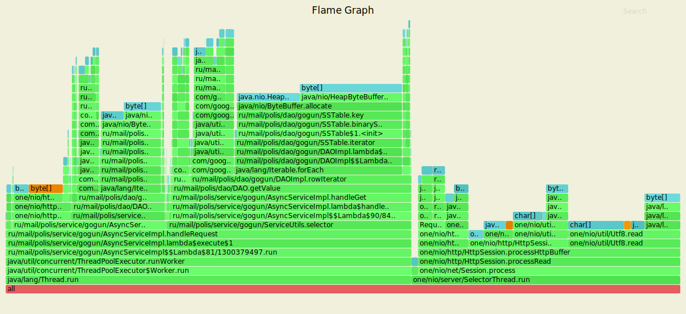
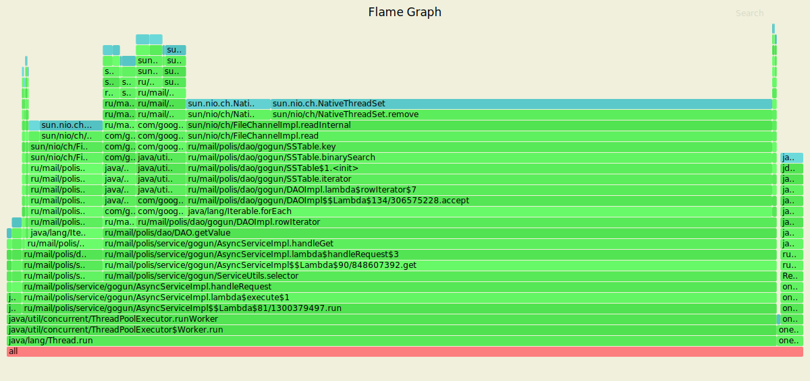

# Отчет 
## Put

Обстрел шел 4 минуты с рейтом в 120000 запросов, кол-во запросов в секунду пришлось понизить из-за репликации
(по умолчанию фактор репликации 2/3)

`wrk2 -t 4  -c 64 -L -d4m -R 12000 -s wrk_scripts/put.lua http://localhost:8080`

    Running 4m test @ http://localhost:8080
      4 threads and 64 connections
      Thread calibration: mean lat.: 5.327ms, rate sampling interval: 30ms
      Thread calibration: mean lat.: 5.309ms, rate sampling interval: 30ms
      Thread calibration: mean lat.: 5.302ms, rate sampling interval: 30ms
      Thread calibration: mean lat.: 5.286ms, rate sampling interval: 30ms
      Thread Stats   Avg      Stdev     Max   +/- Stdev
        Latency    15.96ms   67.29ms 763.39ms   97.70%
        Req/Sec     3.05k   843.77     7.97k    75.81%
      Latency Distribution (HdrHistogram - Recorded Latency)
     50.000%    1.98ms
     75.000%   11.03ms
     90.000%   22.14ms
     99.000%  391.68ms
     99.900%  696.83ms
     99.990%  732.67ms
     99.999%  755.71ms
    100.000%  763.90ms
    
      Detailed Percentile spectrum:
           Value   Percentile   TotalCount 1/(1-Percentile)
    
           0.119     0.000000            1         1.00
           0.662     0.100000       276457         1.11
           0.947     0.200000       552710         1.25
           1.223     0.300000       828241         1.43
           1.522     0.400000      1103970         1.67
           1.981     0.500000      1379718         2.00
           2.635     0.550000      1517523         2.22
           4.251     0.600000      1655536         2.50
           6.315     0.650000      1793636         2.86
           8.479     0.700000      1931628         3.33
          11.031     0.750000      2069351         4.00
          12.455     0.775000      2138375         4.44
          13.967     0.800000      2207244         5.00
          15.639     0.825000      2276354         5.71
          17.471     0.850000      2345401         6.67
          19.551     0.875000      2414324         8.00
          20.751     0.887500      2448826         8.89
          22.143     0.900000      2483491        10.00
          23.759     0.912500      2517695        11.43
          25.679     0.925000      2552347        13.33
          28.015     0.937500      2586638        16.00
          29.391     0.943750      2603884        17.78
          31.055     0.950000      2621166        20.00
          33.151     0.956250      2638446        22.86
          35.935     0.962500      2655687        26.67
          40.447     0.968750      2672892        32.00
          44.287     0.971875      2681455        35.56
          52.831     0.975000      2690072        40.00
         134.015     0.978125      2698681        45.71
         222.719     0.981250      2707303        53.33
         261.503     0.984375      2715935        64.00
         274.943     0.985938      2720268        71.11
         291.583     0.987500      2724570        80.00
         347.903     0.989062      2728857        91.43
         417.023     0.990625      2733181       106.67
         561.663     0.992188      2737489       128.00
         608.255     0.992969      2739636       142.22
         627.199     0.993750      2741808       160.00
         638.463     0.994531      2743958       182.86
         647.679     0.995313      2746179       213.33
         657.407     0.996094      2748325       256.00
         662.015     0.996484      2749415       284.44
         667.135     0.996875      2750528       320.00
         671.231     0.997266      2751489       365.71
         676.351     0.997656      2752678       426.67
         680.959     0.998047      2753724       512.00
         683.519     0.998242      2754251       568.89
         686.591     0.998437      2754790       640.00
         689.663     0.998633      2755279       731.43
         693.759     0.998828      2755878       853.33
         697.343     0.999023      2756371      1024.00
         699.391     0.999121      2756653      1137.78
         701.439     0.999219      2756951      1280.00
         702.975     0.999316      2757182      1462.86
         705.023     0.999414      2757463      1706.67
         707.071     0.999512      2757714      2048.00
         708.095     0.999561      2757843      2275.56
         709.631     0.999609      2757977      2560.00
         711.167     0.999658      2758091      2925.71
         713.727     0.999707      2758246      3413.33
         717.311     0.999756      2758370      4096.00
         719.871     0.999780      2758426      4551.11
         723.455     0.999805      2758504      5120.00
         725.503     0.999829      2758566      5851.43
         727.551     0.999854      2758638      6826.67
         730.111     0.999878      2758700      8192.00
         731.135     0.999890      2758728      9102.22
         732.671     0.999902      2758766     10240.00
         734.207     0.999915      2758808     11702.86
         735.743     0.999927      2758833     13653.33
         738.303     0.999939      2758866     16384.00
         739.839     0.999945      2758886     18204.44
         740.863     0.999951      2758905     20480.00
         741.375     0.999957      2758915     23405.71
         742.399     0.999963      2758931     27306.67
         743.423     0.999969      2758953     32768.00
         743.935     0.999973      2758956     36408.89
         745.471     0.999976      2758967     40960.00
         747.007     0.999979      2758974     46811.43
         749.055     0.999982      2758981     54613.33
         753.151     0.999985      2758989     65536.00
         754.175     0.999986      2758995     72817.78
         755.199     0.999988      2759000     81920.00
         755.711     0.999989      2759003     93622.86
         756.223     0.999991      2759010    109226.67
         756.223     0.999992      2759010    131072.00
         757.247     0.999993      2759013    145635.56
         758.271     0.999994      2759015    163840.00
         758.783     0.999995      2759021    187245.71
         758.783     0.999995      2759021    218453.33
         758.783     0.999996      2759021    262144.00
         759.807     0.999997      2759022    291271.11
         760.319     0.999997      2759023    327680.00
         761.343     0.999997      2759027    374491.43
         761.343     0.999998      2759027    436906.67
         761.343     0.999998      2759027    524288.00
         761.343     0.999998      2759027    582542.22
         761.343     0.999998      2759027    655360.00
         761.855     0.999999      2759029    748982.86
         761.855     0.999999      2759029    873813.33
         761.855     0.999999      2759029   1048576.00
         761.855     0.999999      2759029   1165084.44
         761.855     0.999999      2759029   1310720.00
         762.879     0.999999      2759030   1497965.71
         762.879     0.999999      2759030   1747626.67
         762.879     1.000000      2759030   2097152.00
         762.879     1.000000      2759030   2330168.89
         762.879     1.000000      2759030   2621440.00
         763.903     1.000000      2759031   2995931.43
         763.903     1.000000      2759031          inf
    #[Mean    =       15.960, StdDeviation   =       67.294]
    #[Max     =      763.392, Total count    =      2759031]
    #[Buckets =           27, SubBuckets     =         2048]
    ----------------------------------------------------------
      2879558 requests in 4.00m, 183.99MB read
    Requests/sec:  11998.23
    Transfer/sec:    785.04KB

`sudo async-profiler -d 10 -f ~/cpu_put.svg -e cpu 257258`

- 18% уходят потоку селектора
- 73% потоку из executor service
- 9% из которого уходит на метод getTask - те получение задачи из ArrayBlockingQueue
- остальные 64% идут на обработку запроса внутри потока
- 25% на проксирование другой ноде запроса
- 8% на получение всех нод из кольца ConsistentHashing
- 7% идут на получение нод для репликации
- и 21% уходит на обработку запроса в текущей ноде

`sudo async-profiler -d 10 -f ~/alloc_put.svg -e alloc 257258`

- 41% на селектор тред 
- остальные 58% на воркер
- из которых только 3% памяти уходит на взятие задачи из очереди
- 55% уходят на метод handleRequest
- 3 % из которых - получение массива байт из строки
- еще почти 3% на получение заголовка запроса
- 31% на проксирование
- менее 1% на получение списка всех нод
- чуть больше 1% на получение нод для репликации
- 3% на получение ByteBuffer из массива байт
- и оставшиеся почти 11% идут на объекты, связанные с обработкой запроса на текущую ноду

`sudo async-profiler -d 10 -f ~/lock_put.svg -e lock 257258`

ситуация схожая с прошлым этапом

 - 37% постановка в очередь executor service'а
 - 10% висит HttpSession
 - 38% взятие задачи из очереди executor service'а
 - и 14% метод handleRequest
 - из которого 8% на проксирование
 - и 5% на локальный запрос

## GET

Обстрел шел 4 минуты с рейтом в 2000, рейт не уменьшал, но кол-во соединений увеличил.

`wrk2 -t 4  -c 64 -L -d4m -R 2000 -s wrk_scripts/get.lua http://localhost:8080`

    Running 4m test @ http://localhost:8080
      4 threads and 64 connections
      Thread calibration: mean lat.: 3.813ms, rate sampling interval: 10ms
      Thread calibration: mean lat.: 3.793ms, rate sampling interval: 10ms
      Thread calibration: mean lat.: 3.752ms, rate sampling interval: 10ms
      Thread calibration: mean lat.: 3.823ms, rate sampling interval: 10ms
      Thread Stats   Avg      Stdev     Max   +/- Stdev
        Latency     3.94ms    6.41ms  97.34ms   96.26%
        Req/Sec   526.36    117.64     1.33k    59.33%
      Latency Distribution (HdrHistogram - Recorded Latency)
     50.000%    2.79ms
     75.000%    3.22ms
     90.000%    3.94ms
     99.000%   37.22ms
     99.900%   77.25ms
     99.990%   87.55ms
     99.999%   93.82ms
    100.000%   97.41ms
    
      Detailed Percentile spectrum:
           Value   Percentile   TotalCount 1/(1-Percentile)
    
           1.320     0.000000            1         1.00
           2.169     0.100000        46106         1.11
           2.353     0.200000        92297         1.25
           2.507     0.300000       138163         1.43
           2.651     0.400000       184354         1.67
           2.793     0.500000       230296         2.00
           2.865     0.550000       253238         2.22
           2.941     0.600000       276434         2.50
           3.021     0.650000       299229         2.86
           3.113     0.700000       322250         3.33
           3.221     0.750000       345124         4.00
           3.285     0.775000       356514         4.44
           3.359     0.800000       368081         5.00
           3.447     0.825000       379482         5.71
           3.557     0.850000       390950         6.67
           3.707     0.875000       402448         8.00
           3.807     0.887500       408183         8.89
           3.943     0.900000       413937        10.00
           4.151     0.912500       419705        11.43
           4.507     0.925000       425388        13.33
           5.187     0.937500       431138        16.00
           5.755     0.943750       434009        17.78
           6.659     0.950000       436876        20.00
           8.107     0.956250       439752        22.86
          10.319     0.962500       442622        26.67
          13.471     0.968750       445499        32.00
          15.239     0.971875       446935        35.56
          17.279     0.975000       448372        40.00
          19.743     0.978125       449816        45.71
          23.327     0.981250       451248        53.33
          27.631     0.984375       452683        64.00
          29.759     0.985938       453405        71.11
          32.511     0.987500       454123        80.00
          35.551     0.989062       454841        91.43
          38.527     0.990625       455561       106.67
          42.431     0.992188       456279       128.00
          45.503     0.992969       456634       142.22
          48.799     0.993750       456993       160.00
          52.799     0.994531       457355       182.86
          57.055     0.995313       457714       213.33
          61.951     0.996094       458073       256.00
          64.639     0.996484       458253       284.44
          67.007     0.996875       458434       320.00
          69.119     0.997266       458613       365.71
          70.911     0.997656       458795       426.67
          72.831     0.998047       458971       512.00
          73.791     0.998242       459065       568.89
          74.687     0.998437       459158       640.00
          75.455     0.998633       459243       731.43
          76.415     0.998828       459331       853.33
          77.439     0.999023       459425      1024.00
          77.951     0.999121       459463      1137.78
          78.719     0.999219       459511      1280.00
          79.423     0.999316       459556      1462.86
          80.063     0.999414       459599      1706.67
          80.767     0.999512       459646      2048.00
          81.471     0.999561       459669      2275.56
          81.919     0.999609       459689      2560.00
          82.623     0.999658       459711      2925.71
          83.391     0.999707       459734      3413.33
          84.287     0.999756       459756      4096.00
          84.735     0.999780       459766      4551.11
          85.055     0.999805       459779      5120.00
          85.375     0.999829       459790      5851.43
          86.399     0.999854       459800      6826.67
          87.167     0.999878       459812      8192.00
          87.295     0.999890       459817      9102.22
          87.807     0.999902       459823     10240.00
          88.767     0.999915       459828     11702.86
          89.343     0.999927       459834     13653.33
          89.855     0.999939       459840     16384.00
          90.175     0.999945       459842     18204.44
          90.559     0.999951       459847     20480.00
          90.623     0.999957       459848     23405.71
          91.583     0.999963       459851     27306.67
          92.095     0.999969       459853     32768.00
          92.735     0.999973       459855     36408.89
          92.927     0.999976       459856     40960.00
          93.311     0.999979       459858     46811.43
          93.567     0.999982       459859     54613.33
          93.631     0.999985       459860     65536.00
          93.695     0.999986       459861     72817.78
          93.823     0.999988       459862     81920.00
          95.359     0.999989       459863     93622.86
          95.359     0.999991       459863    109226.67
          95.679     0.999992       459864    131072.00
          95.679     0.999993       459864    145635.56
          95.743     0.999994       459865    163840.00
          95.743     0.999995       459865    187245.71
          95.743     0.999995       459865    218453.33
          96.767     0.999996       459866    262144.00
          96.767     0.999997       459866    291271.11
          96.767     0.999997       459866    327680.00
          96.767     0.999997       459866    374491.43
          96.767     0.999998       459866    436906.67
          97.407     0.999998       459867    524288.00
          97.407     1.000000       459867          inf
    #[Mean    =        3.936, StdDeviation   =        6.412]
    #[Max     =       97.344, Total count    =       459867]
    #[Buckets =           27, SubBuckets     =         2048]
    ----------------------------------------------------------
      479949 requests in 4.00m, 33.41MB read
    Requests/sec:   1999.79
    Transfer/sec:    142.55KB

`sudo async-profiler -d 10 -f ~/cpu_get.svg -e cpu 257258`

- 96% идут на обработку запроса 
- 61% из которых идут на обработку запроса локально, те взятие значения из дао и отправку клиенту
- 32% на получение ответа из проксированного запроса

`sudo async-profiler -d 10 -f ~/alloc_get.svg -e alloc 257258`

- 40% у селектор треда
- оставшиеся 60% - обработка запроса 
- 22% из которых на проксирование запроса
- и 36% на обработку локально 
- 24% из которых на бинарный поиск по DAO

`sudo async-profiler -d 10 -f ~/lock_get.svg -e lock 257258`

- 94% блокировок держит метод обрабатывающий запрос
- 84% на локальный запрос 
- и 10% на проксированный
 

