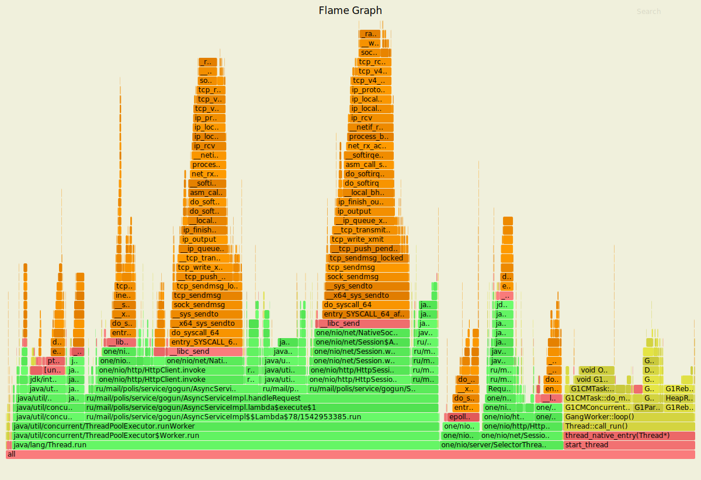
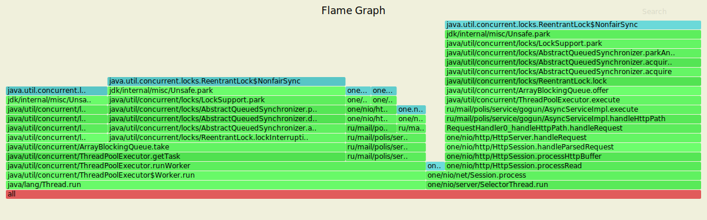

# Отчет 
## Put

Обстрел шел 4 минуты с рейтом в 120000 запросов, кол-во запросов в секунду пришлось понизить из-за репликации
(по умолчанию фактор репликации 2/3)

`wrk2 -R 7000 -t 4 -c 64 -L -d2m -s wrk_scripts/put.lua http://localhost:8080 `

      4 threads and 64 connections
      Thread calibration: mean lat.: 2.317ms, rate sampling interval: 10ms
      Thread calibration: mean lat.: 2.655ms, rate sampling interval: 10ms
      Thread calibration: mean lat.: 2.310ms, rate sampling interval: 10ms
      Thread calibration: mean lat.: 2.324ms, rate sampling interval: 10ms
      Thread Stats   Avg      Stdev     Max   +/- Stdev
        Latency     2.73ms    4.17ms  65.12ms   91.97%
        Req/Sec     1.84k   469.51     6.11k    84.75%
      Latency Distribution (HdrHistogram - Recorded Latency)
     50.000%    1.55ms
     75.000%    2.40ms
     90.000%    5.48ms
     99.000%   21.68ms
     99.900%   45.50ms
     99.990%   55.87ms
     99.999%   59.84ms
    100.000%   65.15ms
    
      Detailed Percentile spectrum:
           Value   Percentile   TotalCount 1/(1-Percentile)
    
           0.123     0.000000            1         1.00
           0.687     0.100000        76992         1.11
           0.932     0.200000       154213         1.25
           1.142     0.300000       231084         1.43
           1.342     0.400000       307935         1.67
           1.554     0.500000       385008         2.00
           1.675     0.550000       423448         2.22
           1.809     0.600000       461786         2.50
           1.964     0.650000       500250         2.86
           2.153     0.700000       538731         3.33
           2.405     0.750000       577154         4.00
           2.569     0.775000       596451         4.44
           2.773     0.800000       615609         5.00
           3.055     0.825000       634870         5.71
           3.467     0.850000       654064         6.67
           4.207     0.875000       673314         8.00
           4.775     0.887500       682926         8.89
           5.479     0.900000       692537        10.00
           6.335     0.912500       702152        11.43
           7.383     0.925000       711734        13.33
           8.687     0.937500       721367        16.00
           9.423     0.943750       726160        17.78
          10.191     0.950000       730990        20.00
          11.055     0.956250       735784        22.86
          12.015     0.962500       740603        26.67
          13.151     0.968750       745414        32.00
          13.855     0.971875       747825        35.56
          14.615     0.975000       750216        40.00
          15.471     0.978125       752615        45.71
          16.559     0.981250       755015        53.33
          17.951     0.984375       757436        64.00
          18.783     0.985938       758623        71.11
          19.727     0.987500       759832        80.00
          20.895     0.989062       761043        91.43
          22.287     0.990625       762232       106.67
          24.047     0.992188       763436       128.00
          25.007     0.992969       764031       142.22
          26.047     0.993750       764634       160.00
          27.359     0.994531       765234       182.86
          28.847     0.995313       765836       213.33
          30.575     0.996094       766437       256.00
          31.519     0.996484       766738       284.44
          32.511     0.996875       767039       320.00
          33.663     0.997266       767342       365.71
          35.135     0.997656       767646       426.67
          36.831     0.998047       767939       512.00
          38.047     0.998242       768091       568.89
          39.615     0.998437       768239       640.00
          41.695     0.998633       768391       731.43
          43.679     0.998828       768540       853.33
          45.791     0.999023       768696      1024.00
          46.975     0.999121       768767      1137.78
          47.999     0.999219       768844      1280.00
          48.831     0.999316       768918      1462.86
          49.695     0.999414       768993      1706.67
          50.687     0.999512       769067      2048.00
          51.231     0.999561       769103      2275.56
          51.935     0.999609       769142      2560.00
          52.575     0.999658       769180      2925.71
          53.151     0.999707       769216      3413.33
          54.015     0.999756       769254      4096.00
          54.271     0.999780       769274      4551.11
          54.559     0.999805       769292      5120.00
          54.847     0.999829       769310      5851.43
          55.103     0.999854       769330      6826.67
          55.551     0.999878       769348      8192.00
          55.743     0.999890       769357      9102.22
          55.935     0.999902       769370     10240.00
          56.127     0.999915       769376     11702.86
          56.415     0.999927       769385     13653.33
          56.735     0.999939       769395     16384.00
          56.959     0.999945       769399     18204.44
          57.215     0.999951       769404     20480.00
          57.407     0.999957       769409     23405.71
          57.471     0.999963       769413     27306.67
          57.983     0.999969       769418     32768.00
          58.047     0.999973       769420     36408.89
          58.335     0.999976       769423     40960.00
          58.559     0.999979       769425     46811.43
          58.719     0.999982       769427     54613.33
          59.103     0.999985       769430     65536.00
          59.583     0.999986       769431     72817.78
          59.647     0.999988       769432     81920.00
          59.839     0.999989       769433     93622.86
          59.871     0.999991       769434    109226.67
          60.191     0.999992       769436    131072.00
          60.191     0.999993       769436    145635.56
          60.799     0.999994       769437    163840.00
          60.799     0.999995       769437    187245.71
          61.087     0.999995       769438    218453.33
          61.343     0.999996       769439    262144.00
          61.343     0.999997       769439    291271.11
          61.343     0.999997       769439    327680.00
          61.343     0.999997       769439    374491.43
          62.175     0.999998       769440    436906.67
          62.175     0.999998       769440    524288.00
          62.175     0.999998       769440    582542.22
          62.175     0.999998       769440    655360.00
          62.175     0.999999       769440    748982.86
          65.151     0.999999       769441    873813.33
          65.151     1.000000       769441          inf
    #[Mean    =        2.731, StdDeviation   =        4.171]
    #[Max     =       65.120, Total count    =       769441]
    #[Buckets =           27, SubBuckets     =         2048]
    ----------------------------------------------------------
      838072 requests in 2.00m, 53.55MB read
    Requests/sec:   6983.93
    Transfer/sec:    456.96KB

`sudo async-profiler -d 10 -f ~/cpu_put.svg -e cpu 257258`

- 18% уходят потоку селектора
- 73% потоку из executor service
- 9% из которого уходит на метод getTask - те получение задачи из ArrayBlockingQueue
- остальные 64% идут на обработку запроса внутри потока
- 25% на проксирование другой ноде запроса
- 8% на получение всех нод из кольца ConsistentHashing
- 7% идут на получение нод для репликации
- и 21% уходит на обработку запроса в текущей ноде

- оптимизация ConsistentHashing помогла немного снизить нагрузку 

раньше

- 8% на получение всех нод из кольца ConsistentHashing
- 7% идут на получение нод для репликации

теперь

- 6% на оба этих пункта

`sudo async-profiler -d 10 -f ~/alloc_put.svg -e alloc 257258`

- 41% на селектор тред 
- остальные 58% на воркер
- из которых только 3% памяти уходит на взятие задачи из очереди
- 55% уходят на метод handleRequest
- 3 % из которых - получение массива байт из строки
- еще почти 3% на получение заголовка запроса
- 31% на проксирование
- менее 1% на получение списка всех нод
- чуть больше 1% на получение нод для репликации
- 3% на получение ByteBuffer из массива байт
- и оставшиеся почти 11% идут на объекты, связанные с обработкой запроса на текущую ноду

интересных изменений не заметил

`sudo async-profiler -d 10 -f ~/lock_put.svg -e lock 257258`

ситуация схожая с прошлым этапом

 - 37% постановка в очередь executor service'а
 - 10% висит HttpSession
 - 38% взятие задачи из очереди executor service'а
 - и 14% метод handleRequest
 - из которого 8% на проксирование
 - и 5% на локальный запрос

интересных изменений не заметил

## GET

Обстрел шел 4 минуты с рейтом в 2000, рейт не уменьшал, но кол-во соединений увеличил.

`wrk2 -t 4  -c 64 -L -d4m -R 2000 -s wrk_scripts/get.lua http://localhost:8080`

    Running 4m test @ http://localhost:8080
      4 threads and 64 connections
      Thread calibration: mean lat.: 3.813ms, rate sampling interval: 10ms
      Thread calibration: mean lat.: 3.793ms, rate sampling interval: 10ms
      Thread calibration: mean lat.: 3.752ms, rate sampling interval: 10ms
      Thread calibration: mean lat.: 3.823ms, rate sampling interval: 10ms
      Thread Stats   Avg      Stdev     Max   +/- Stdev
        Latency     3.94ms    6.41ms  97.34ms   96.26%
        Req/Sec   526.36    117.64     1.33k    59.33%
      Latency Distribution (HdrHistogram - Recorded Latency)
     50.000%    2.79ms
     75.000%    3.22ms
     90.000%    3.94ms
     99.000%   37.22ms
     99.900%   77.25ms
     99.990%   87.55ms
     99.999%   93.82ms
    100.000%   97.41ms
    
      Detailed Percentile spectrum:
           Value   Percentile   TotalCount 1/(1-Percentile)
    
           1.320     0.000000            1         1.00
           2.169     0.100000        46106         1.11
           2.353     0.200000        92297         1.25
           2.507     0.300000       138163         1.43
           2.651     0.400000       184354         1.67
           2.793     0.500000       230296         2.00
           2.865     0.550000       253238         2.22
           2.941     0.600000       276434         2.50
           3.021     0.650000       299229         2.86
           3.113     0.700000       322250         3.33
           3.221     0.750000       345124         4.00
           3.285     0.775000       356514         4.44
           3.359     0.800000       368081         5.00
           3.447     0.825000       379482         5.71
           3.557     0.850000       390950         6.67
           3.707     0.875000       402448         8.00
           3.807     0.887500       408183         8.89
           3.943     0.900000       413937        10.00
           4.151     0.912500       419705        11.43
           4.507     0.925000       425388        13.33
           5.187     0.937500       431138        16.00
           5.755     0.943750       434009        17.78
           6.659     0.950000       436876        20.00
           8.107     0.956250       439752        22.86
          10.319     0.962500       442622        26.67
          13.471     0.968750       445499        32.00
          15.239     0.971875       446935        35.56
          17.279     0.975000       448372        40.00
          19.743     0.978125       449816        45.71
          23.327     0.981250       451248        53.33
          27.631     0.984375       452683        64.00
          29.759     0.985938       453405        71.11
          32.511     0.987500       454123        80.00
          35.551     0.989062       454841        91.43
          38.527     0.990625       455561       106.67
          42.431     0.992188       456279       128.00
          45.503     0.992969       456634       142.22
          48.799     0.993750       456993       160.00
          52.799     0.994531       457355       182.86
          57.055     0.995313       457714       213.33
          61.951     0.996094       458073       256.00
          64.639     0.996484       458253       284.44
          67.007     0.996875       458434       320.00
          69.119     0.997266       458613       365.71
          70.911     0.997656       458795       426.67
          72.831     0.998047       458971       512.00
          73.791     0.998242       459065       568.89
          74.687     0.998437       459158       640.00
          75.455     0.998633       459243       731.43
          76.415     0.998828       459331       853.33
          77.439     0.999023       459425      1024.00
          77.951     0.999121       459463      1137.78
          78.719     0.999219       459511      1280.00
          79.423     0.999316       459556      1462.86
          80.063     0.999414       459599      1706.67
          80.767     0.999512       459646      2048.00
          81.471     0.999561       459669      2275.56
          81.919     0.999609       459689      2560.00
          82.623     0.999658       459711      2925.71
          83.391     0.999707       459734      3413.33
          84.287     0.999756       459756      4096.00
          84.735     0.999780       459766      4551.11
          85.055     0.999805       459779      5120.00
          85.375     0.999829       459790      5851.43
          86.399     0.999854       459800      6826.67
          87.167     0.999878       459812      8192.00
          87.295     0.999890       459817      9102.22
          87.807     0.999902       459823     10240.00
          88.767     0.999915       459828     11702.86
          89.343     0.999927       459834     13653.33
          89.855     0.999939       459840     16384.00
          90.175     0.999945       459842     18204.44
          90.559     0.999951       459847     20480.00
          90.623     0.999957       459848     23405.71
          91.583     0.999963       459851     27306.67
          92.095     0.999969       459853     32768.00
          92.735     0.999973       459855     36408.89
          92.927     0.999976       459856     40960.00
          93.311     0.999979       459858     46811.43
          93.567     0.999982       459859     54613.33
          93.631     0.999985       459860     65536.00
          93.695     0.999986       459861     72817.78
          93.823     0.999988       459862     81920.00
          95.359     0.999989       459863     93622.86
          95.359     0.999991       459863    109226.67
          95.679     0.999992       459864    131072.00
          95.679     0.999993       459864    145635.56
          95.743     0.999994       459865    163840.00
          95.743     0.999995       459865    187245.71
          95.743     0.999995       459865    218453.33
          96.767     0.999996       459866    262144.00
          96.767     0.999997       459866    291271.11
          96.767     0.999997       459866    327680.00
          96.767     0.999997       459866    374491.43
          96.767     0.999998       459866    436906.67
          97.407     0.999998       459867    524288.00
          97.407     1.000000       459867          inf
    #[Mean    =        3.936, StdDeviation   =        6.412]
    #[Max     =       97.344, Total count    =       459867]
    #[Buckets =           27, SubBuckets     =         2048]
    ----------------------------------------------------------
      479949 requests in 4.00m, 33.41MB read
    Requests/sec:   1999.79
    Transfer/sec:    142.55KB

`sudo async-profiler -d 10 -f ~/cpu_get.svg -e cpu 257258`

- 96% идут на обработку запроса 
- 61% из которых идут на обработку запроса локально, те взятие значения из дао и отправку клиенту
- 32% на получение ответа из проксированного запроса

`sudo async-profiler -d 10 -f ~/alloc_get.svg -e alloc 257258`

- 40% у селектор треда
- оставшиеся 60% - обработка запроса 
- 22% из которых на проксирование запроса
- и 36% на обработку локально 
- 24% из которых на бинарный поиск по DAO

`sudo async-profiler -d 10 -f ~/lock_get.svg -e lock 257258`

- 94% блокировок держит метод обрабатывающий запрос
- 84% на локальный запрос 
- и 10% на проксированный
 

