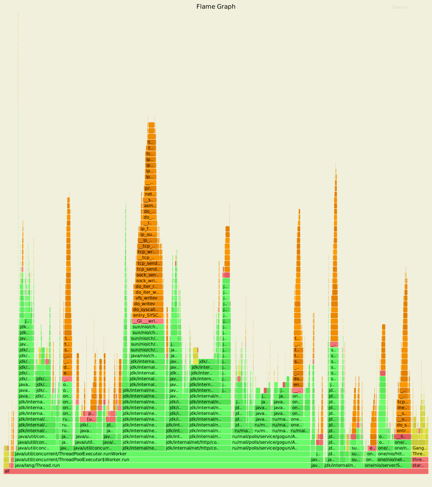
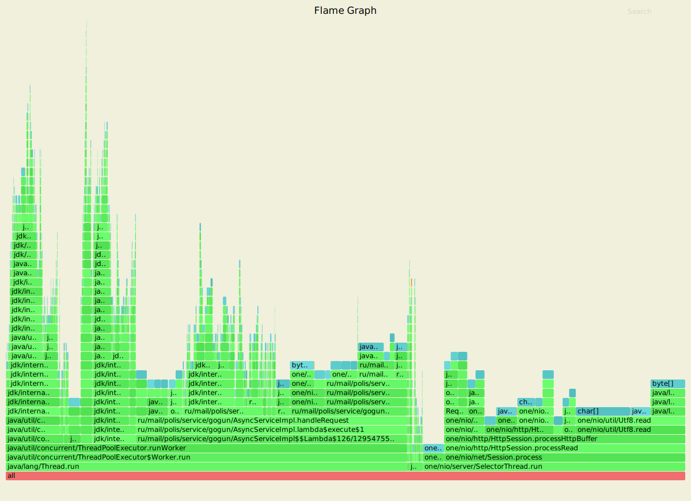
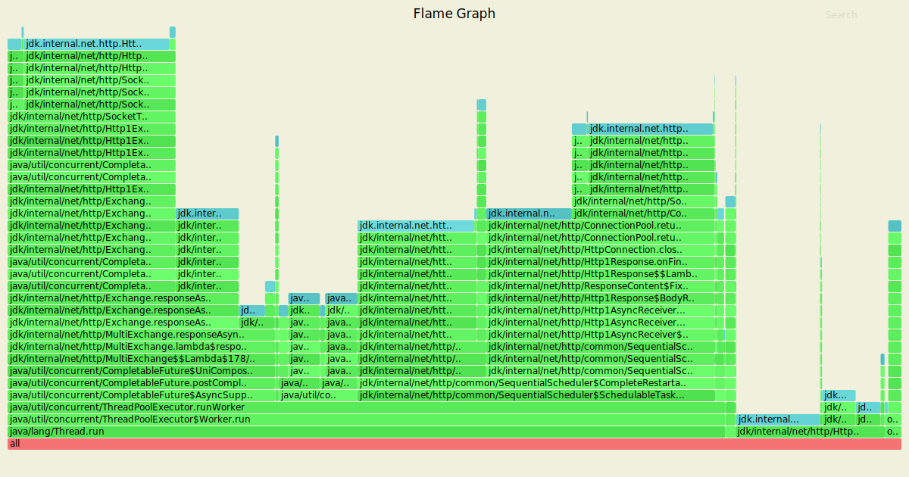
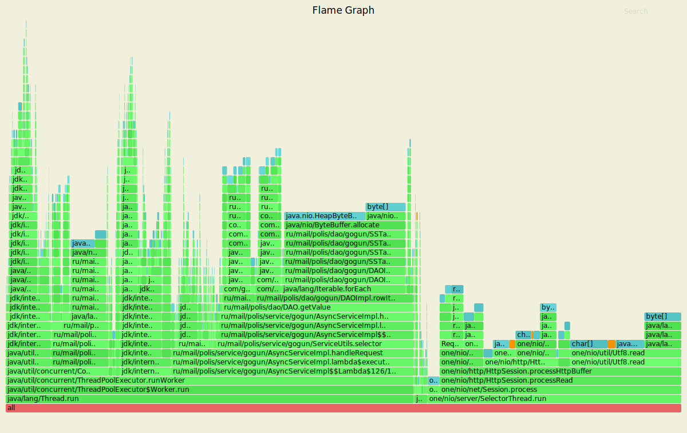
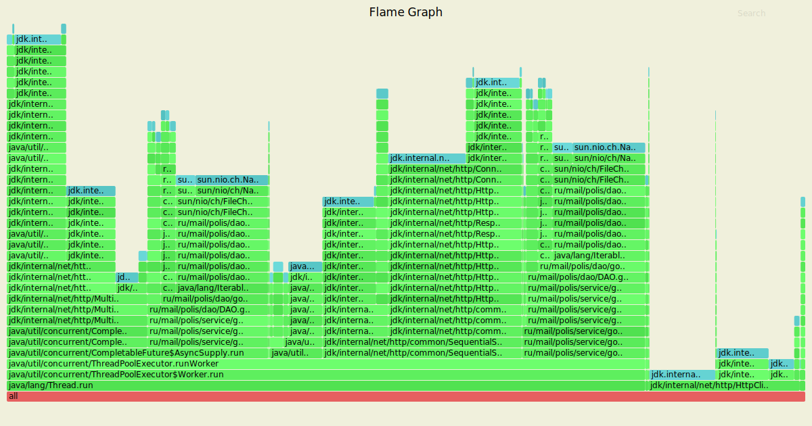

# Отчет 
## Put

Обстрел шел 2 минуты с рейтом в 5000 запросов, с большим рейтом ожидание достигало более минуты.

`wrk2 -R 5000 -t 4 -c 64 -L -d2m -s wrk_scripts/put.lua http://localhost:8080`

    Running 2m test @ http://localhost:8080
      4 threads and 64 connections
      Thread calibration: mean lat.: 4.443ms, rate sampling interval: 24ms
      Thread calibration: mean lat.: 4.476ms, rate sampling interval: 24ms
      Thread calibration: mean lat.: 4.521ms, rate sampling interval: 24ms
      Thread calibration: mean lat.: 4.411ms, rate sampling interval: 24ms
      Thread Stats   Avg      Stdev     Max   +/- Stdev
        Latency     6.89ms   14.56ms 193.54ms   93.52%
        Req/Sec     1.28k   332.34     4.26k    79.18%
      Latency Distribution (HdrHistogram - Recorded Latency)
     50.000%    1.70ms
     75.000%    7.48ms
     90.000%   16.28ms
     99.000%   81.73ms
     99.900%  155.13ms
     99.990%  181.89ms
     99.999%  189.70ms
    100.000%  193.66ms
    
      Detailed Percentile spectrum:
           Value   Percentile   TotalCount 1/(1-Percentile)
    
           0.203     0.000000            1         1.00
           0.775     0.100000        54975         1.11
           1.015     0.200000       110012         1.25
           1.234     0.300000       164894         1.43
           1.449     0.400000       219871         1.67
           1.699     0.500000       274959         2.00
           1.856     0.550000       302283         2.22
           2.075     0.600000       329871         2.50
           2.547     0.650000       357287         2.86
           4.535     0.700000       384728         3.33
           7.479     0.750000       412226         4.00
           8.943     0.775000       426009         4.44
          10.311     0.800000       439728         5.00
          11.615     0.825000       453449         5.71
          12.943     0.850000       467186         6.67
          14.391     0.875000       480937         8.00
          15.231     0.887500       487818         8.89
          16.279     0.900000       494686        10.00
          17.615     0.912500       501539        11.43
          19.439     0.925000       508433        13.33
          21.999     0.937500       515249        16.00
          23.631     0.943750       518698        17.78
          25.567     0.950000       522126        20.00
          27.887     0.956250       525578        22.86
          30.815     0.962500       529000        26.67
          35.103     0.968750       532423        32.00
          38.303     0.971875       534151        35.56
          42.911     0.975000       535862        40.00
          49.311     0.978125       537583        45.71
          56.319     0.981250       539293        53.33
          64.383     0.984375       541017        64.00
          69.695     0.985938       541879        71.11
          74.239     0.987500       542737        80.00
          78.847     0.989062       543592        91.43
          83.903     0.990625       544449       106.67
          89.535     0.992188       545312       128.00
          93.119     0.992969       545737       142.22
          96.639     0.993750       546167       160.00
         101.183     0.994531       546595       182.86
         106.431     0.995313       547023       213.33
         112.127     0.996094       547451       256.00
         114.943     0.996484       547668       284.44
         117.695     0.996875       547880       320.00
         121.087     0.997266       548098       365.71
         125.503     0.997656       548311       426.67
         131.583     0.998047       548524       512.00
         135.039     0.998242       548633       568.89
         139.391     0.998437       548739       640.00
         144.127     0.998633       548846       731.43
         150.015     0.998828       548953       853.33
         155.775     0.999023       549061      1024.00
         158.719     0.999121       549115      1137.78
         161.791     0.999219       549169      1280.00
         164.607     0.999316       549225      1462.86
         167.423     0.999414       549275      1706.67
         169.855     0.999512       549332      2048.00
         171.135     0.999561       549356      2275.56
         172.671     0.999609       549384      2560.00
         174.335     0.999658       549411      2925.71
         175.487     0.999707       549437      3413.33
         176.895     0.999756       549463      4096.00
         177.663     0.999780       549479      4551.11
         178.559     0.999805       549490      5120.00
         179.327     0.999829       549504      5851.43
         179.967     0.999854       549517      6826.67
         180.991     0.999878       549531      8192.00
         181.375     0.999890       549537      9102.22
         182.015     0.999902       549545     10240.00
         183.679     0.999915       549551     11702.86
         184.575     0.999927       549557     13653.33
         185.855     0.999939       549564     16384.00
         186.111     0.999945       549568     18204.44
         186.751     0.999951       549571     20480.00
         187.263     0.999957       549574     23405.71
         187.519     0.999963       549578     27306.67
         188.415     0.999969       549581     32768.00
         188.671     0.999973       549583     36408.89
         188.799     0.999976       549584     40960.00
         188.927     0.999979       549586     46811.43
         189.055     0.999982       549587     54613.33
         189.311     0.999985       549589     65536.00
         189.695     0.999986       549592     72817.78
         189.695     0.999988       549592     81920.00
         189.695     0.999989       549592     93622.86
         189.695     0.999991       549592    109226.67
         190.719     0.999992       549593    131072.00
         190.847     0.999993       549594    145635.56
         190.847     0.999994       549594    163840.00
         191.871     0.999995       549595    187245.71
         191.871     0.999995       549595    218453.33
         191.871     0.999996       549595    262144.00
         192.127     0.999997       549596    291271.11
         192.127     0.999997       549596    327680.00
         192.127     0.999997       549596    374491.43
         192.127     0.999998       549596    436906.67
         192.127     0.999998       549596    524288.00
         193.663     0.999998       549597    582542.22
         193.663     1.000000       549597          inf
    #[Mean    =        6.888, StdDeviation   =       14.557]
    #[Max     =      193.536, Total count    =       549597]
    #[Buckets =           27, SubBuckets     =         2048]
    ----------------------------------------------------------
      599837 requests in 2.00m, 38.33MB read
    Requests/sec:   4998.62
    Transfer/sec:    327.06KB

`sudo async-profiler -d 10 -f ~/cpu_put.svg -e cpu 8288`

- 11% уходят потоку селектора
- 9% httpclient менеджеру
- 3% пулу потоков у future
- остальные 70% потоку из executor сервиса
- из которых 10% на AsyncSupply у future, те на локальную обработку запроса
- 3% на complete future те на выдачу ответа
- 11% - взятие задачи из thread pool executor
- 10% - socket tube канал для выдачи ответов http client
- 15% - scheduler асинхронного http client
- оставшиеся 20% старый добрый обработчик запросов из AsyncServiceImpl
- из 20% которого 4% идут на проксирование или локальную обработку запроса
- 4% на получение всех уникальных нод с кольца ConsistentHashing
- еще 4% на получение всех нод для репликации
- и еще 4% на отправку ответа session

`sudo async-profiler -d 10 -f ~/alloc_put.svg -e alloc 8288`

- 38% на селектор тред
- 2% на http client manager 
- остальные 60% на воркер тред
- из которых 8% на AsyncSupply - те на локальную обработку запроса внутри future
- 2% на взятие задачи из очереди задач executor
- 6% на планировщик http client
- и остальные 40% на обработку запроса
- из которых 11% на обработку локального запроса или проксирование
- 17% на метод selector, отвечающий за выдачу ответа в session
- метод преобразовывающий массив байт в ByteBuffer - 2%

`sudo async-profiler -d 10 -f ~/lock_put.svg -e lock 8288`

ситуация схожая с прошлым этапом

 - 2% у селектор треда
 - 16% держит http client manager
 - все остальное - наш воркер тред - 80%
 - из которых 30% на блокировках completable future AsyncSupply
 - еще 9% - блокировки очереди executor service 
 - и 61% - планировщик http client

## GET

Обстрел шел 2 минуты с рейтом в 4000, удалось поднять пропускную способность.

`wrk2 -R 4000 -t 4 -c 64 -L -d2m -s wrk_scripts/get.lua http://localhost:8080`

    Running 2m test @ http://localhost:8080
      4 threads and 64 connections
      Thread calibration: mean lat.: 8.310ms, rate sampling interval: 59ms
      Thread calibration: mean lat.: 8.278ms, rate sampling interval: 58ms
      Thread calibration: mean lat.: 8.353ms, rate sampling interval: 58ms
      Thread calibration: mean lat.: 8.400ms, rate sampling interval: 59ms
      Thread Stats   Avg      Stdev     Max   +/- Stdev
        Latency     5.17ms    7.74ms  82.37ms   88.28%
        Req/Sec     1.01k   158.58     1.72k    80.95%
      Latency Distribution (HdrHistogram - Recorded Latency)
     50.000%    2.03ms
     75.000%    4.26ms
     90.000%   15.23ms
     99.000%   36.83ms
     99.900%   49.92ms
     99.990%   59.78ms
     99.999%   76.54ms
    100.000%   82.43ms
    
      Detailed Percentile spectrum:
           Value   Percentile   TotalCount 1/(1-Percentile)
    
           0.305     0.000000            1         1.00
           1.022     0.100000        43983         1.11
           1.285     0.200000        88045         1.25
           1.515     0.300000       132073         1.43
           1.750     0.400000       175905         1.67
           2.025     0.500000       219970         2.00
           2.199     0.550000       242069         2.22
           2.415     0.600000       263941         2.50
           2.729     0.650000       285880         2.86
           3.251     0.700000       307819         3.33
           4.263     0.750000       329843         4.00
           5.051     0.775000       340813         4.44
           6.107     0.800000       351813         5.00
           7.515     0.825000       362797         5.71
           9.439     0.850000       373771         6.67
          11.999     0.875000       384790         8.00
          13.511     0.887500       390281         8.89
          15.231     0.900000       395771        10.00
          17.119     0.912500       401287        11.43
          19.119     0.925000       406769        13.33
          21.327     0.937500       412269        16.00
          22.543     0.943750       415011        17.78
          23.807     0.950000       417743        20.00
          25.199     0.956250       420516        22.86
          26.735     0.962500       423258        26.67
          28.399     0.968750       425997        32.00
          29.295     0.971875       427363        35.56
          30.271     0.975000       428752        40.00
          31.327     0.978125       430115        45.71
          32.559     0.981250       431505        53.33
          33.919     0.984375       432875        64.00
          34.623     0.985938       433554        71.11
          35.391     0.987500       434243        80.00
          36.255     0.989062       434922        91.43
          37.247     0.990625       435617       106.67
          38.367     0.992188       436308       128.00
          39.039     0.992969       436643       142.22
          39.775     0.993750       436987       160.00
          40.575     0.994531       437325       182.86
          41.535     0.995313       437675       213.33
          42.559     0.996094       438014       256.00
          43.167     0.996484       438191       284.44
          43.871     0.996875       438356       320.00
          44.735     0.997266       438530       365.71
          45.631     0.997656       438700       426.67
          46.623     0.998047       438872       512.00
          47.167     0.998242       438960       568.89
          47.775     0.998437       439045       640.00
          48.383     0.998633       439128       731.43
          49.151     0.998828       439214       853.33
          49.951     0.999023       439300      1024.00
          50.559     0.999121       439344      1137.78
          51.071     0.999219       439386      1280.00
          51.679     0.999316       439432      1462.86
          52.191     0.999414       439474      1706.67
          53.023     0.999512       439515      2048.00
          53.343     0.999561       439537      2275.56
          53.887     0.999609       439559      2560.00
          54.623     0.999658       439580      2925.71
          55.167     0.999707       439601      3413.33
          55.839     0.999756       439622      4096.00
          56.287     0.999780       439633      4551.11
          57.055     0.999805       439644      5120.00
          58.111     0.999829       439654      5851.43
          58.623     0.999854       439666      6826.67
          59.103     0.999878       439676      8192.00
          59.327     0.999890       439681      9102.22
          59.903     0.999902       439687     10240.00
          60.223     0.999915       439692     11702.86
          60.671     0.999927       439697     13653.33
          61.375     0.999939       439703     16384.00
          61.695     0.999945       439705     18204.44
          62.111     0.999951       439708     20480.00
          62.591     0.999957       439711     23405.71
          63.135     0.999963       439713     27306.67
          64.511     0.999969       439716     32768.00
          65.471     0.999973       439717     36408.89
          65.855     0.999976       439719     40960.00
          66.367     0.999979       439720     46811.43
          67.327     0.999982       439721     54613.33
          72.895     0.999985       439723     65536.00
          72.895     0.999986       439723     72817.78
          76.159     0.999988       439724     81920.00
          76.543     0.999989       439725     93622.86
          76.543     0.999991       439725    109226.67
          78.591     0.999992       439726    131072.00
          78.591     0.999993       439726    145635.56
          78.783     0.999994       439727    163840.00
          78.783     0.999995       439727    187245.71
          78.783     0.999995       439727    218453.33
          78.911     0.999996       439728    262144.00
          78.911     0.999997       439728    291271.11
          78.911     0.999997       439728    327680.00
          78.911     0.999997       439728    374491.43
          78.911     0.999998       439728    436906.67
          82.431     0.999998       439729    524288.00
          82.431     1.000000       439729          inf
    #[Mean    =        5.168, StdDeviation   =        7.739]
    #[Max     =       82.368, Total count    =       439729]
    #[Buckets =           27, SubBuckets     =         2048]
    ----------------------------------------------------------
      479868 requests in 2.00m, 33.40MB read
    Requests/sec:   3998.96
    Transfer/sec:    285.05KB

`sudo async-profiler -d 10 -f ~/cpu_get.svg -e cpu 8288`

- 6% - http client maanger
- 4% - selector thread
- остальные 76% - worker из executor service
- 19% из которых - AsyncSupply, те обработка локального запроса в future
- 2% на отправку ответа после завершения работы future
- 5% - взятие задачи из executor service
- 3% - socket tube 
- 9% - планировщик http client
- и 38% на метод handle request - те это и получение нод для репликации, и обработка проксированного запроса

`sudo async-profiler -d 10 -f ~/alloc_get.svg -e alloc 8288`

- 37% у селектор треда
- 2% у http client manager
- оставшиеся 60% - worker из executor service (задачи те же что и в анализе cpu)

`sudo async-profiler -d 10 -f ~/lock_get.svg -e lock 8288`

- 32% держит обработка локального запроса
- 6% - взятие задачи из executor service
- 25% - планировщик http client
- 15% - проксированный запроса
 

