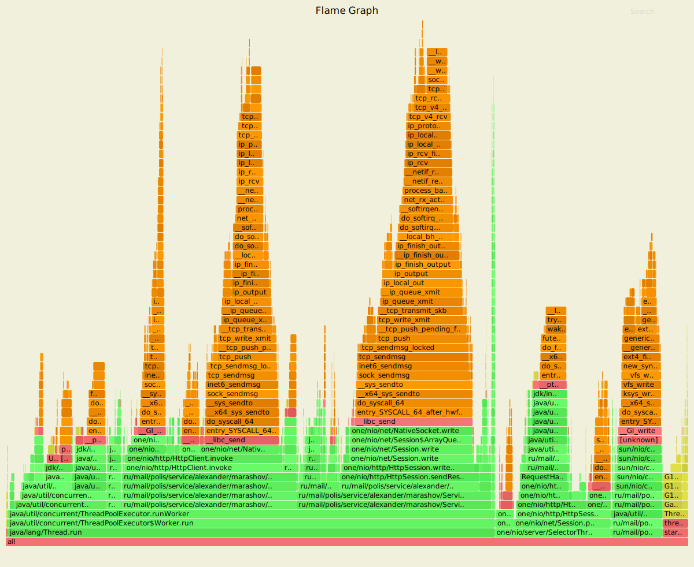
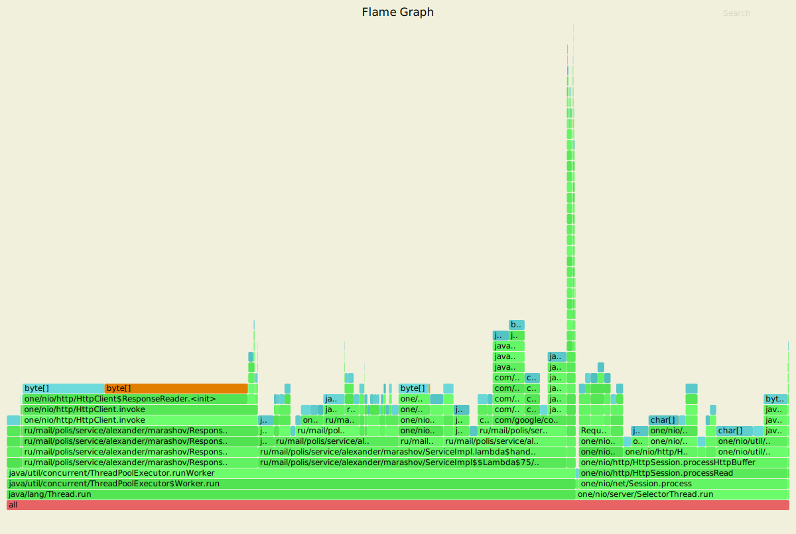
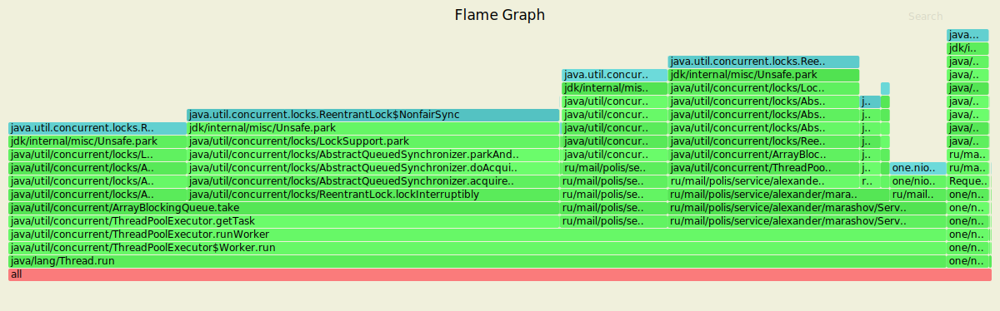
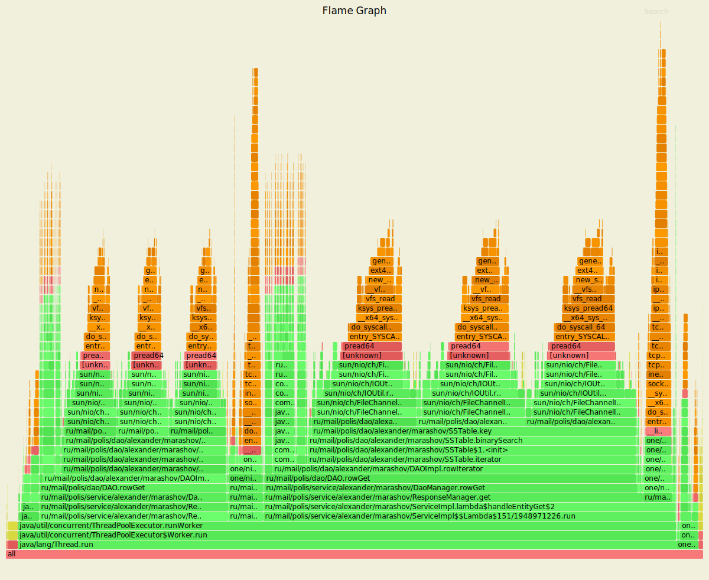
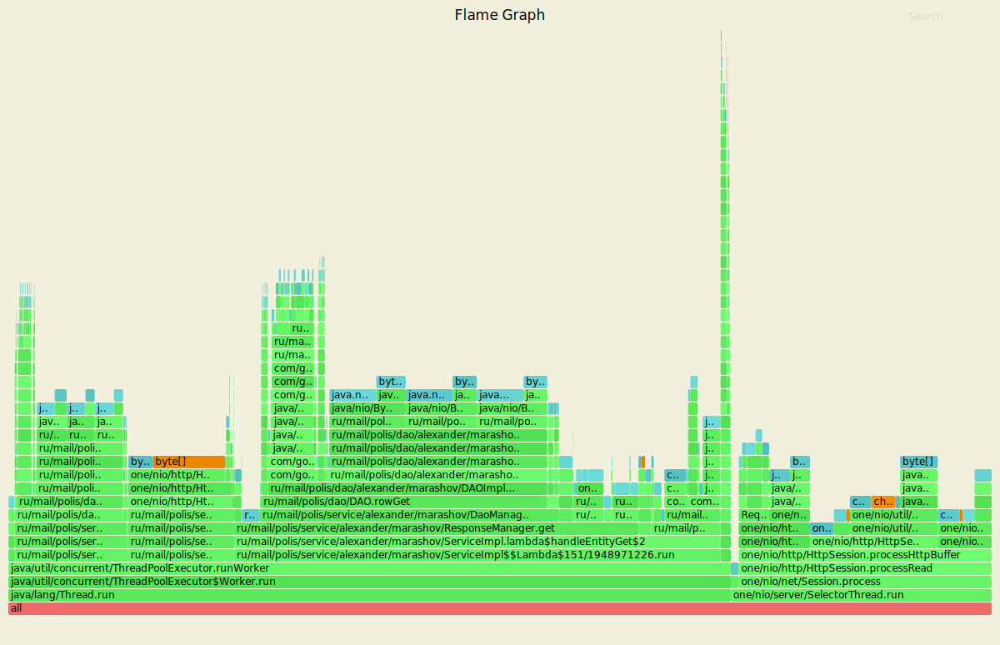
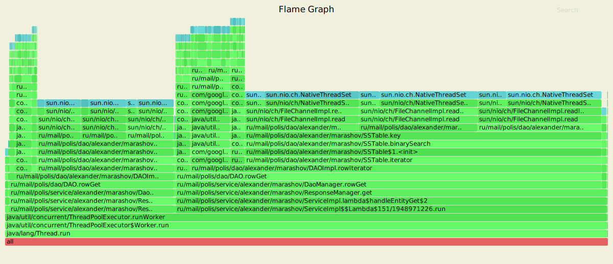

<h1>Этап 5. Репликация</h1>
<h3>Формулировка задания</h3>
<ul>
    <li>Реализовать поддержку хранения нескольких реплик данных в кластере 
        для обеспечения отказоустойчивости.</li>
    <li>Отпрофилировать кластер с различными значениями параметра <b>replicas</b>.</li>
    <li>Проанализировать полученные результаты, сравнить их с этапом 4.</li>
</ul>
<h3>Результаты нагрузки</h3>

Ниже представлены результаты работы wrk2 на запущенном кластере из 3х нод на разных значениях параметра <b>replicas</b>.
 

 
<h4>ack = 1, from = 3</h4>

PUT
./wrk -c 64 -d 4m -t1 -s ../../2020-highload-dht/profiler/scripts/putS1.lua --latency -R2000 http://localhost:8080  

Running 4m test @ http://localhost:8080  
  1 threads and 64 connections  
  Thread calibration: mean lat.: 0.875ms, rate sampling interval: 10ms  
  Thread Stats   Avg      Stdev     Max   +/- Stdev  
    Latency     0.86ms  440.81us  14.82ms   68.81%  
    Req/Sec     2.16k   132.33     3.33k    65.07%    
  Latency Distribution (HdrHistogram - Recorded Latency)  
 50.000%    0.85ms  
 75.000%    1.15ms  
 90.000%    1.38ms  
 99.000%    1.91ms  
 99.900%    3.71ms  
 99.990%    6.34ms  
 99.999%   10.44ms  
100.000%   14.82ms   

  Detailed Percentile spectrum:  
       Value   Percentile   TotalCount 1/(1-Percentile)

       0.074     0.000000            2         1.00
       0.302     0.100000        46129         1.11
       0.463     0.200000        91897         1.25
       0.606     0.300000       137963         1.43
       0.731     0.400000       183811         1.67
       0.850     0.500000       230013         2.00
       0.909     0.550000       252659         2.22
       0.966     0.600000       275877         2.50
       1.024     0.650000       298767         2.86
       1.087     0.700000       321802         3.33
       1.153     0.750000       344865         4.00
       1.185     0.775000       356033         4.44
       1.219     0.800000       367753         5.00
       1.252     0.825000       379191         5.71
       1.286     0.850000       390483         6.67
       1.325     0.875000       402084         8.00
       1.348     0.887500       407770         8.89
       1.377     0.900000       413502        10.00
       1.415     0.912500       419229        11.43
       1.464     0.925000       424935        13.33
       1.526     0.937500       430714        16.00
       1.557     0.943750       433547        17.78
       1.591     0.950000       436417        20.00
       1.627     0.956250       439275        22.86
       1.665     0.962500       442181        26.67
       1.710     0.968750       445045        32.00
       1.734     0.971875       446488        35.56
       1.761     0.975000       447928        40.00
       1.787     0.978125       449330        45.71
       1.815     0.981250       450770        53.33
       1.845     0.984375       452202        64.00
       1.860     0.985938       452911        71.11
       1.879     0.987500       453654        80.00
       1.899     0.989062       454376        91.43
       1.921     0.990625       455059       106.67
       1.947     0.992188       455792       128.00
       1.960     0.992969       456148       142.22
       1.975     0.993750       456511       160.00
       1.993     0.994531       456873       182.86
       2.018     0.995313       457220       213.33
       2.045     0.996094       457574       256.00
       2.061     0.996484       457758       284.44
       2.079     0.996875       457939       320.00
       2.101     0.997266       458113       365.71
       2.139     0.997656       458289       426.67
       2.261     0.998047       458466       512.00
       2.511     0.998242       458555       568.89
       2.769     0.998437       458645       640.00
       3.041     0.998633       458734       731.43
       3.403     0.998828       458824       853.33
       3.751     0.999023       458914      1024.00
       3.917     0.999121       458959      1137.78
       4.183     0.999219       459004      1280.00
       4.391     0.999316       459048      1462.86
       4.615     0.999414       459095      1706.67
       4.847     0.999512       459138      2048.00
       5.019     0.999561       459161      2275.56
       5.147     0.999609       459183      2560.00
       5.295     0.999658       459206      2925.71
       5.463     0.999707       459228      3413.33
       5.663     0.999756       459250      4096.00
       5.783     0.999780       459262      4551.11
       5.843     0.999805       459273      5120.00
       5.975     0.999829       459284      5851.43
       6.075     0.999854       459295      6826.67
       6.295     0.999878       459306      8192.00
       6.311     0.999890       459312      9102.22
       6.415     0.999902       459318     10240.00
       6.491     0.999915       459323     11702.86
       6.739     0.999927       459329     13653.33
       6.831     0.999939       459334     16384.00
       6.867     0.999945       459337     18204.44
       6.927     0.999951       459340     20480.00
       7.063     0.999957       459343     23405.71
       7.147     0.999963       459346     27306.67
       7.567     0.999969       459348     32768.00
       7.667     0.999973       459350     36408.89
       7.703     0.999976       459351     40960.00
       8.463     0.999979       459353     46811.43
       8.519     0.999982       459354     54613.33
       9.551     0.999985       459355     65536.00
      10.183     0.999986       459356     72817.78
      10.439     0.999988       459357     81920.00
      11.711     0.999989       459358     93622.86
      11.711     0.999991       459358    109226.67
      12.719     0.999992       459359    131072.00
      12.719     0.999993       459359    145635.56
      13.023     0.999994       459360    163840.00
      13.023     0.999995       459360    187245.71
      13.023     0.999995       459360    218453.33
      14.287     0.999996       459361    262144.00
      14.287     0.999997       459361    291271.11
      14.287     0.999997       459361    327680.00
      14.287     0.999997       459361    374491.43
      14.287     0.999998       459361    436906.67
      14.823     0.999998       459362    524288.00
      14.823     1.000000       459362          inf
Mean    =        0.864, StdDeviation   =        0.441  
Max     =       14.816, Total count    =       459362  
Buckets =           27, SubBuckets     =         2048  
  479716 requests in 4.00m, 30.65MB read  
Requests/sec:   1998.81  
Transfer/sec:    130.78KB  

GET

./wrk -c 64 -d 4m -t1 -s ../../2020-highload-dht/profiler/scripts/getS1.lua --latency -R2000 http://localhost:8080  
Running 4m test @ http://localhost:8080  
  1 threads and 64 connections  
  Thread calibration: mean lat.: 1.320ms, rate sampling interval: 10ms  
  Thread Stats   Avg      Stdev     Max   +/- Stdev  
    Latency     1.30ms  519.95us  16.11ms   63.77%  
    Req/Sec     2.11k   123.34     3.50k    85.90%   
  Latency Distribution (HdrHistogram - Recorded Latency)  
 50.000%    1.24ms  
 75.000%    1.67ms  
 90.000%    2.01ms  
 99.000%    2.46ms   
 99.900%    3.44ms  
 99.990%    6.79ms  
 99.999%   11.24ms  
100.000%   16.12ms  

  Detailed Percentile spectrum:  
       Value   Percentile   TotalCount 1/(1-Percentile)  

       0.263     0.000000            1         1.00
       0.658     0.100000        46111         1.11
       0.808     0.200000        92186         1.25
       0.950     0.300000       137965         1.43
       1.099     0.400000       183903         1.67
       1.243     0.500000       229904         2.00
       1.314     0.550000       252649         2.22
       1.390     0.600000       275652         2.50
       1.474     0.650000       298772         2.86
       1.567     0.700000       321655         3.33
       1.671     0.750000       344653         4.00
       1.726     0.775000       356047         4.44
       1.782     0.800000       367492         5.00
       1.839     0.825000       379106         5.71
       1.896     0.850000       390515         6.67
       1.952     0.875000       401956         8.00
       1.982     0.887500       407797         8.89
       2.012     0.900000       413430        10.00
       2.045     0.912500       419258        11.43
       2.081     0.925000       425153        13.33
       2.119     0.937500       430745        16.00
       2.141     0.943750       433710        17.78
       2.163     0.950000       436410        20.00
       2.189     0.956250       439273        22.86
       2.221     0.962500       442278        26.67
       2.255     0.968750       445179        32.00
       2.275     0.971875       446568        35.56
       2.295     0.975000       447945        40.00
       2.319     0.978125       449381        45.71
       2.347     0.981250       450770        53.33
       2.381     0.984375       452227        64.00
       2.401     0.985938       452961        71.11
       2.421     0.987500       453680        80.00
       2.447     0.989062       454399        91.43
       2.473     0.990625       455056       106.67
       2.509     0.992188       455775       128.00
       2.533     0.992969       456163       142.22
       2.555     0.993750       456500       160.00
       2.579     0.994531       456850       182.86
       2.611     0.995313       457211       213.33
       2.653     0.996094       457581       256.00
       2.679     0.996484       457752       284.44
       2.713     0.996875       457927       320.00
       2.751     0.997266       458119       365.71
       2.799     0.997656       458289       426.67
       2.883     0.998047       458467       512.00
       2.931     0.998242       458554       568.89
       3.007     0.998437       458644       640.00
       3.095     0.998633       458733       731.43
       3.231     0.998828       458823       853.33
       3.465     0.999023       458913      1024.00
       3.599     0.999121       458959      1137.78
       3.803     0.999219       459003      1280.00
       4.043     0.999316       459047      1462.86
       4.251     0.999414       459092      1706.67
       4.479     0.999512       459138      2048.00
       4.615     0.999561       459160      2275.56
       4.827     0.999609       459182      2560.00
       4.967     0.999658       459205      2925.71
       5.123     0.999707       459228      3413.33
       5.367     0.999756       459249      4096.00
       5.575     0.999780       459261      4551.11
       5.727     0.999805       459272      5120.00
       5.843     0.999829       459283      5851.43
       6.123     0.999854       459294      6826.67
       6.419     0.999878       459305      8192.00
       6.559     0.999890       459311      9102.22
       6.903     0.999902       459317     10240.00
       7.043     0.999915       459322     11702.86
       7.419     0.999927       459328     13653.33
       7.651     0.999939       459333     16384.00
       8.019     0.999945       459336     18204.44
       8.231     0.999951       459339     20480.00
       8.319     0.999957       459342     23405.71
       8.527     0.999963       459345     27306.67
       8.575     0.999969       459347     32768.00
       9.223     0.999973       459350     36408.89
       9.223     0.999976       459350     40960.00
       9.583     0.999979       459352     46811.43
       9.951     0.999982       459353     54613.33
      10.191     0.999985       459354     65536.00
      10.223     0.999986       459355     72817.78
      11.239     0.999988       459356     81920.00
      11.263     0.999989       459357     93622.86
      11.263     0.999991       459357    109226.67
      11.639     0.999992       459358    131072.00
      11.639     0.999993       459358    145635.56
      12.863     0.999994       459359    163840.00
      12.863     0.999995       459359    187245.71
      12.863     0.999995       459359    218453.33
      14.887     0.999996       459360    262144.00
      14.887     0.999997       459360    291271.11
      14.887     0.999997       459360    327680.00
      14.887     0.999997       459360    374491.43
      14.887     0.999998       459360    436906.67
      16.119     0.999998       459361    524288.00
      16.119     1.000000       459361          inf

Mean    =        1.296, StdDeviation   =        0.520  
Max     =       16.112, Total count    =       459361  
Buckets =           27, SubBuckets     =         2048  
  479716 requests in 4.00m, 33.74MB read  
Requests/sec:   1998.82  
Transfer/sec:    143.95KB  

 
<h4>ack = 2, from = 3,</h4>

PUT

./wrk -c 64 -d 4m -t1 -s ../../2020-highload-dht/profiler/scripts/putS2.lua --latency -R2000 http://localhost:8080  
Running 4m test @ http://localhost:8080  
  1 threads and 64 connections  
  Thread calibration: mean lat.: 0.911ms, rate sampling interval: 10ms  
  Thread Stats   Avg      Stdev     Max   +/- Stdev  
    Latency     0.92ms  446.02us   9.20ms   67.89%  
    Req/Sec     2.06k   133.67     3.78k    61.11%  
  Latency Distribution (HdrHistogram - Recorded Latency)  
 50.000%    0.91ms    
 75.000%    1.21ms  
 90.000%    1.44ms  
 99.000%    1.93ms  
 99.900%    4.22ms  
 99.990%    7.01ms  
 99.999%    8.49ms  
100.000%    9.21ms  

  Detailed Percentile spectrum:  
       Value   Percentile   TotalCount 1/(1-Percentile)  

       0.104     0.000000            1         1.00
       0.346     0.100000        46159         1.11
       0.508     0.200000        91969         1.25
       0.664     0.300000       137976         1.43
       0.785     0.400000       184050         1.67
       0.914     0.500000       229932         2.00
       0.970     0.550000       252860         2.22
       1.025     0.600000       275679         2.50
       1.087     0.650000       298934         2.86
       1.151     0.700000       321582         3.33
       1.214     0.750000       344611         4.00
       1.247     0.775000       356244         4.44
       1.282     0.800000       367512         5.00
       1.321     0.825000       379185         5.71
       1.359     0.850000       390764         6.67
       1.395     0.875000       402020         8.00
       1.415     0.887500       407746         8.89
       1.438     0.900000       413561        10.00
       1.465     0.912500       419184        11.43
       1.502     0.925000       424920        13.33
       1.553     0.937500       430715        16.00
       1.580     0.943750       433593        17.78
       1.610     0.950000       436446        20.00
       1.642     0.956250       439298        22.86
       1.677     0.962500       442180        26.67
       1.714     0.968750       445021        32.00
       1.733     0.971875       446462        35.56
       1.753     0.975000       447935        40.00
       1.774     0.978125       449361        45.71
       1.799     0.981250       450785        53.33
       1.833     0.984375       452187        64.00
       1.858     0.985938       452905        71.11
       1.885     0.987500       453632        80.00
       1.913     0.989062       454348        91.43
       1.945     0.990625       455058       106.67
       1.986     0.992188       455774       128.00
       2.009     0.992969       456146       142.22
       2.034     0.993750       456492       160.00
       2.069     0.994531       456864       182.86
       2.113     0.995313       457206       213.33
       2.153     0.996094       457578       256.00
       2.171     0.996484       457744       284.44
       2.197     0.996875       457924       320.00
       2.229     0.997266       458106       365.71
       2.273     0.997656       458291       426.67
       2.523     0.998047       458461       512.00
       2.779     0.998242       458551       568.89
       3.107     0.998437       458641       640.00
       3.421     0.998633       458730       731.43
       3.867     0.998828       458820       853.33
       4.267     0.999023       458910      1024.00
       4.479     0.999121       458955      1137.78
       4.731     0.999219       459002      1280.00
       4.971     0.999316       459045      1462.86
       5.243     0.999414       459089      1706.67
       5.491     0.999512       459134      2048.00
       5.619     0.999561       459157      2275.56
       5.759     0.999609       459179      2560.00
       5.859     0.999658       459201      2925.71
       6.031     0.999707       459225      3413.33
       6.231     0.999756       459246      4096.00
       6.351     0.999780       459259      4551.11
       6.423     0.999805       459270      5120.00
       6.555     0.999829       459280      5851.43
       6.655     0.999854       459291      6826.67
       6.839     0.999878       459302      8192.00
       6.951     0.999890       459308      9102.22
       7.059     0.999902       459314     10240.00
       7.099     0.999915       459319     11702.86
       7.263     0.999927       459325     13653.33
       7.387     0.999939       459330     16384.00
       7.455     0.999945       459333     18204.44
       7.499     0.999951       459336     20480.00
       7.575     0.999957       459339     23405.71
       7.691     0.999963       459342     27306.67
       7.735     0.999969       459344     32768.00
       7.831     0.999973       459346     36408.89
       7.891     0.999976       459347     40960.00
       7.995     0.999979       459349     46811.43
       8.027     0.999982       459350     54613.33
       8.247     0.999985       459351     65536.00
       8.375     0.999986       459352     72817.78
       8.487     0.999988       459353     81920.00
       8.711     0.999989       459354     93622.86
       8.711     0.999991       459354    109226.67
       9.055     0.999992       459355    131072.00
       9.055     0.999993       459355    145635.56
       9.063     0.999994       459356    163840.00
       9.063     0.999995       459356    187245.71
       9.063     0.999995       459356    218453.33
       9.151     0.999996       459357    262144.00
       9.151     0.999997       459357    291271.11
       9.151     0.999997       459357    327680.00
       9.151     0.999997       459357    374491.43
       9.151     0.999998       459357    436906.67
       9.207     0.999998       459358    524288.00
       9.207     1.000000       459358          inf
Mean    =        0.919, StdDeviation   =        0.446  
Max     =        9.200, Total count    =       459358  
Buckets =           27, SubBuckets     =         2048  
  479714 requests in 4.00m, 30.65MB read  
Requests/sec:   1998.81  
Transfer/sec:    130.78KB  

GET

./wrk -c 64 -d 4m -t1 -s ../../2020-highload-dht/profiler/scripts/getS2.lua --latency -R2000 http://localhost:8080  
Running 4m test @ http://localhost:8080  
  1 threads and 64 connections  
  Thread calibration: mean lat.: 1.192ms, rate sampling interval: 10ms  
  Thread Stats   Avg      Stdev     Max   +/- Stdev  
    Latency     1.18ms  493.67us  22.35ms   65.45%  
    Req/Sec     2.10k   125.57     5.20k    82.69%  
  Latency Distribution (HdrHistogram - Recorded Latency)  
 50.000%    1.14ms  
 75.000%    1.53ms  
 90.000%    1.83ms  
 99.000%    2.30ms  
 99.900%    2.68ms  
 99.990%    4.90ms  
 99.999%   19.63ms  
100.000%   22.37ms  

  Detailed Percentile spectrum:  
       Value   Percentile   TotalCount 1/(1-Percentile)  

       0.195     0.000000            1         1.00
       0.564     0.100000        45943         1.11
       0.718     0.200000        92092         1.25
       0.857     0.300000       138152         1.43
       0.990     0.400000       183822         1.67
       1.136     0.500000       229787         2.00
       1.211     0.550000       252714         2.22
       1.287     0.600000       275679         2.50
       1.365     0.650000       298760         2.86
       1.444     0.700000       321793         3.33
       1.526     0.750000       344588         4.00
       1.570     0.775000       356057         4.44
       1.615     0.800000       367580         5.00
       1.662     0.825000       378983         5.71
       1.713     0.850000       390559         6.67
       1.769     0.875000       402092         8.00
       1.799     0.887500       407821         8.89
       1.830     0.900000       413473        10.00
       1.864     0.912500       419305        11.43
       1.900     0.925000       425009        13.33
       1.942     0.937500       430789        16.00
       1.965     0.943750       433616        17.78
       1.990     0.950000       436460        20.00
       2.018     0.956250       439360        22.86
       2.049     0.962500       442261        26.67
       2.085     0.968750       445108        32.00
       2.105     0.971875       446512        35.56
       2.127     0.975000       447889        40.00
       2.153     0.978125       449347        45.71
       2.183     0.981250       450826        53.33
       2.215     0.984375       452213        64.00
       2.235     0.985938       452973        71.11
       2.255     0.987500       453660        80.00
       2.279     0.989062       454387        91.43
       2.305     0.990625       455081       106.67
       2.339     0.992188       455787       128.00
       2.357     0.992969       456135       142.22
       2.379     0.993750       456506       160.00
       2.401     0.994531       456862       182.86
       2.425     0.995313       457217       213.33
       2.455     0.996094       457583       256.00
       2.471     0.996484       457752       284.44
       2.491     0.996875       457935       320.00
       2.513     0.997266       458125       365.71
       2.537     0.997656       458293       426.67
       2.565     0.998047       458467       512.00
       2.583     0.998242       458552       568.89
       2.601     0.998437       458644       640.00
       2.623     0.998633       458732       731.43
       2.651     0.998828       458822       853.33
       2.681     0.999023       458911      1024.00
       2.705     0.999121       458956      1137.78
       2.747     0.999219       459003      1280.00
       2.779     0.999316       459046      1462.86
       2.839     0.999414       459091      1706.67
       2.919     0.999512       459135      2048.00
       2.969     0.999561       459158      2275.56
       3.047     0.999609       459180      2560.00
       3.129     0.999658       459203      2925.71
       3.207     0.999707       459225      3413.33
       3.429     0.999756       459247      4096.00
       3.611     0.999780       459259      4551.11
       3.791     0.999805       459270      5120.00
       3.947     0.999829       459281      5851.43
       4.171     0.999854       459292      6826.67
       4.499     0.999878       459303      8192.00
       4.755     0.999890       459309      9102.22
       5.015     0.999902       459315     10240.00
       5.459     0.999915       459320     11702.86
       7.151     0.999927       459326     13653.33
       8.623     0.999939       459331     16384.00
       9.655     0.999945       459334     18204.44
      11.975     0.999951       459337     20480.00
      13.511     0.999957       459340     23405.71
      15.327     0.999963       459343     27306.67
      16.167     0.999969       459345     32768.00
      17.119     0.999973       459347     36408.89
      17.231     0.999976       459348     40960.00
      17.951     0.999979       459350     46811.43
      19.279     0.999982       459351     54613.33
      19.551     0.999985       459352     65536.00
      19.631     0.999986       459354     72817.78
      19.631     0.999988       459354     81920.00
      20.047     0.999989       459355     93622.86
      20.047     0.999991       459355    109226.67
      20.511     0.999992       459356    131072.00
      20.511     0.999993       459356    145635.56
      21.151     0.999994       459357    163840.00
      21.151     0.999995       459357    187245.71
      21.151     0.999995       459357    218453.33
      21.695     0.999996       459358    262144.00
      21.695     0.999997       459358    291271.11
      21.695     0.999997       459358    327680.00
      21.695     0.999997       459358    374491.43
      21.695     0.999998       459358    436906.67
      22.367     0.999998       459359    524288.00
      22.367     1.000000       459359          inf
Mean    =        1.175, StdDeviation   =        0.494  
Max     =       22.352, Total count    =       459359  
Buckets =           27, SubBuckets     =         2048  
  479715 requests in 4.00m, 33.74MB read  
Requests/sec:   1998.81  
Transfer/sec:    143.95KB  

 
<h4>ack = 3, from = 3 </h4>

PUT

./wrk -c 64 -d 4m -t1 -s ../../2020-highload-dht/profiler/scripts/putS3.lua --latency -R2000 http://localhost:8080  
Running 4m test @ http://localhost:8080  
  1 threads and 64 connections  
  Thread calibration: mean lat.: 0.885ms, rate sampling interval: 10ms  
  Thread Stats   Avg      Stdev     Max   +/- Stdev  
    Latency     0.87ms  439.97us  15.23ms   67.81%   
    Req/Sec     2.07k   128.24     3.50k    62.36%  
  Latency Distribution (HdrHistogram - Recorded Latency)  
 50.000%    0.86ms  
 75.000%    1.17ms  
 90.000%    1.39ms  
 99.000%    1.82ms  
 99.900%    4.57ms  
 99.990%    7.25ms  
 99.999%    9.62ms  
100.000%   15.24ms  

  Detailed Percentile spectrum:  
       Value   Percentile   TotalCount 1/(1-Percentile)  

       0.108     0.000000            1         1.00
       0.331     0.100000        46216         1.11
       0.465     0.200000        91898         1.25
       0.602     0.300000       138048         1.43
       0.728     0.400000       184058         1.67
       0.858     0.500000       229726         2.00
       0.924     0.550000       252789         2.22
       0.988     0.600000       275755         2.50
       1.051     0.650000       298633         2.86
       1.114     0.700000       321768         3.33
       1.175     0.750000       344552         4.00
       1.207     0.775000       356201         4.44
       1.239     0.800000       367712         5.00
       1.273     0.825000       379214         5.71
       1.310     0.850000       390520         6.67
       1.350     0.875000       402188         8.00
       1.369     0.887500       407681         8.89
       1.389     0.900000       413553        10.00
       1.409     0.912500       419351        11.43
       1.430     0.925000       424999        13.33
       1.454     0.937500       430779        16.00
       1.468     0.943750       433591        17.78
       1.485     0.950000       436539        20.00
       1.504     0.956250       439303        22.86
       1.530     0.962500       442212        26.67
       1.566     0.968750       445024        32.00
       1.588     0.971875       446492        35.56
       1.614     0.975000       447891        40.00
       1.646     0.978125       449336        45.71
       1.682     0.981250       450777        53.33
       1.723     0.984375       452182        64.00
       1.746     0.985938       452907        71.11
       1.770     0.987500       453633        80.00
       1.799     0.989062       454346        91.43
       1.836     0.990625       455058       106.67
       1.882     0.992188       455782       128.00
       1.906     0.992969       456130       142.22
       1.931     0.993750       456496       160.00
       1.960     0.994531       456851       182.86
       1.998     0.995313       457209       213.33
       2.059     0.996094       457573       256.00
       2.107     0.996484       457751       284.44
       2.161     0.996875       457924       320.00
       2.269     0.997266       458101       365.71
       2.563     0.997656       458281       426.67
       3.015     0.998047       458460       512.00
       3.283     0.998242       458550       568.89
       3.617     0.998437       458640       640.00
       3.913     0.998633       458730       731.43
       4.247     0.998828       458819       853.33
       4.607     0.999023       458909      1024.00
       4.823     0.999121       458954      1137.78
       5.063     0.999219       459001      1280.00
       5.247     0.999316       459043      1462.86
       5.507     0.999414       459089      1706.67
       5.759     0.999512       459133      2048.00
       5.903     0.999561       459156      2275.56
       6.031     0.999609       459180      2560.00
       6.151     0.999658       459201      2925.71
       6.371     0.999707       459223      3413.33
       6.543     0.999756       459245      4096.00
       6.631     0.999780       459257      4551.11
       6.707     0.999805       459268      5120.00
       6.819     0.999829       459279      5851.43
       6.903     0.999854       459292      6826.67
       7.051     0.999878       459301      8192.00
       7.147     0.999890       459307      9102.22
       7.271     0.999902       459313     10240.00
       7.387     0.999915       459318     11702.86
       7.563     0.999927       459324     13653.33
       7.675     0.999939       459329     16384.00
       7.791     0.999945       459332     18204.44
       7.959     0.999951       459335     20480.00
       8.279     0.999957       459338     23405.71
       8.543     0.999963       459341     27306.67
       8.607     0.999969       459343     32768.00
       9.031     0.999973       459345     36408.89
       9.151     0.999976       459346     40960.00
       9.271     0.999979       459348     46811.43
       9.319     0.999982       459349     54613.33
       9.391     0.999985       459350     65536.00
       9.479     0.999986       459351     72817.78
       9.623     0.999988       459352     81920.00
      10.287     0.999989       459353     93622.86
      10.287     0.999991       459353    109226.67
      10.479     0.999992       459354    131072.00
      10.479     0.999993       459354    145635.56
      10.903     0.999994       459355    163840.00
      10.903     0.999995       459355    187245.71
      10.903     0.999995       459355    218453.33
      12.271     0.999996       459356    262144.00
      12.271     0.999997       459356    291271.11
      12.271     0.999997       459356    327680.00
      12.271     0.999997       459356    374491.43
      12.271     0.999998       459356    436906.67
      15.239     0.999998       459357    524288.00
      15.239     1.000000       459357          inf
Mean    =        0.872, StdDeviation   =        0.440  
Max     =       15.232, Total count    =       459357  
Buckets =           27, SubBuckets     =         2048  
  479713 requests in 4.00m, 30.65MB read  
Requests/sec:   1998.80  
Transfer/sec:    130.78KB  

GET

./wrk -c 64 -d 4m -t1 -s ../../2020-highload-dht/profiler/scripts/getS3.lua --latency -R2000 http://localhost:8080  
Running 4m test @ http://localhost:8080  
  1 threads and 64 connections  
  Thread calibration: mean lat.: 1.216ms, rate sampling interval: 10ms  
  Thread Stats   Avg      Stdev     Max   +/- Stdev  
    Latency     1.21ms  513.31us  15.41ms   66.28%  
    Req/Sec     2.11k   136.18     4.33k    81.96%  
  Latency Distribution (HdrHistogram - Recorded Latency)  
 50.000%    1.18ms  
 75.000%    1.57ms  
 90.000%    1.85ms  
 99.000%    2.31ms  
 99.900%    3.90ms  
 99.990%    9.12ms  
 99.999%   13.26ms  
100.000%   15.41ms  

  Detailed Percentile spectrum:  
       Value   Percentile   TotalCount 1/(1-Percentile)  

       0.193     0.000000            1         1.00
       0.570     0.100000        46169         1.11
       0.729     0.200000        91923         1.25
       0.877     0.300000       137814         1.43
       1.030     0.400000       184011         1.67
       1.179     0.500000       229913         2.00
       1.255     0.550000       252915         2.22
       1.331     0.600000       275688         2.50
       1.409     0.650000       298715         2.86
       1.487     0.700000       321700         3.33
       1.568     0.750000       344560         4.00
       1.611     0.775000       356218         4.44
       1.654     0.800000       367698         5.00
       1.698     0.825000       379037         5.71
       1.744     0.850000       390474         6.67
       1.794     0.875000       402056         8.00
       1.821     0.887500       407870         8.89
       1.849     0.900000       413507        10.00
       1.881     0.912500       419339        11.43
       1.915     0.925000       425038        13.33
       1.954     0.937500       430754        16.00
       1.976     0.943750       433572        17.78
       2.000     0.950000       436462        20.00
       2.028     0.956250       439339        22.86
       2.059     0.962500       442246        26.67
       2.095     0.968750       445113        32.00
       2.115     0.971875       446493        35.56
       2.137     0.975000       447881        40.00
       2.163     0.978125       449356        45.71
       2.191     0.981250       450802        53.33
       2.225     0.984375       452251        64.00
       2.243     0.985938       452920        71.11
       2.265     0.987500       453652        80.00
       2.291     0.989062       454367        91.43
       2.321     0.990625       455098       106.67
       2.357     0.992188       455814       128.00
       2.377     0.992969       456134       142.22
       2.403     0.993750       456496       160.00
       2.435     0.994531       456852       182.86
       2.473     0.995313       457215       213.33
       2.533     0.996094       457569       256.00
       2.569     0.996484       457751       284.44
       2.619     0.996875       457927       320.00
       2.695     0.997266       458107       365.71
       2.807     0.997656       458285       426.67
       2.989     0.998047       458464       512.00
       3.119     0.998242       458556       568.89
       3.259     0.998437       458644       640.00
       3.425     0.998633       458733       731.43
       3.649     0.998828       458823       853.33
       3.937     0.999023       458914      1024.00
       4.061     0.999121       458958      1137.78
       4.231     0.999219       459003      1280.00
       4.543     0.999316       459047      1462.86
       4.907     0.999414       459092      1706.67
       5.367     0.999512       459137      2048.00
       5.659     0.999561       459161      2275.56
       5.975     0.999609       459182      2560.00
       6.311     0.999658       459204      2925.71
       6.671     0.999707       459227      3413.33
       7.139     0.999756       459250      4096.00
       7.367     0.999780       459261      4551.11
       7.683     0.999805       459272      5120.00
       7.923     0.999829       459283      5851.43
       8.279     0.999854       459294      6826.67
       8.807     0.999878       459305      8192.00
       9.063     0.999890       459311      9102.22
       9.383     0.999902       459317     10240.00
       9.631     0.999915       459322     11702.86
      10.007     0.999927       459328     13653.33
      10.279     0.999939       459333     16384.00
      10.623     0.999945       459336     18204.44
      10.855     0.999951       459339     20480.00
      11.087     0.999957       459342     23405.71
      11.471     0.999963       459345     27306.67
      11.919     0.999969       459347     32768.00
      12.159     0.999973       459349     36408.89
      12.247     0.999976       459350     40960.00
      12.327     0.999979       459352     46811.43
      12.431     0.999982       459353     54613.33
      12.887     0.999985       459354     65536.00
      13.183     0.999986       459355     72817.78
      13.255     0.999988       459356     81920.00
      13.359     0.999989       459357     93622.86
      13.359     0.999991       459357    109226.67
      14.343     0.999992       459358    131072.00
      14.343     0.999993       459358    145635.56
      14.407     0.999994       459359    163840.00
      14.407     0.999995       459359    187245.71
      14.407     0.999995       459359    218453.33
      15.287     0.999996       459360    262144.00
      15.287     0.999997       459360    291271.11
      15.287     0.999997       459360    327680.00
      15.287     0.999997       459360    374491.43
      15.287     0.999998       459360    436906.67
      15.415     0.999998       459361    524288.00
      15.415     1.000000       459361          inf
Mean    =        1.205, StdDeviation   =        0.513  
Max     =       15.408, Total count    =       459361  
Buckets =           27, SubBuckets     =         2048  
  479715 requests in 4.00m, 33.74MB read  
Requests/sec:   1998.81  
Transfer/sec:    143.95KB  

<h4>Выводы</h4>
Анализ результатов показал, что увеличение параметра ack в replicas не привело к росту ожидания ответа от сервера.  
Это объясняется тем, что запросы к репликам происходят параллельно (через executorService), так что формирование ответа было в среднем не дольше работы самой медленной ноды.
Если сравнивать результаты нагрузки с этапом 4, то прирост ожидания ответа put метода вырос практически в два раза: с 8 мс на 4 этапе до 9-16 мс (100% ответов).
А что касается нагрузки GET методами: с 8 мс до 15-22 мс, то есть вырос практически в полтора раза.
Однако в отличие от реализации кластера 4 этапа, текущий сервер имеет большую отказоустойчивость.      
 
<h3>Результаты профилирования</h3>
Для анализа написанной системы я провёл профилирование для следующих значений параметра replicas:
<ul>
<li> ack = 1, from = 3,</li>
<li> ack = 2, from = 3,</li>
<li> ack = 3, from = 3 </li>
</ul>
Поскольку флеймграфы для разных значений получились схожи, то буду анализировать ack=2, from=3 
 
(Однако в папках profiler/homework5/*_3 все остальные флеймграфы тоже присутствуют)
  
1) PUT cpu

Во избежание ошибки heap overflow мне пришлось уменьшить порог сброса MemTable на диск. 
По флеймграфу виден результат этой операции: из 40 секунд профилирования 7.54% процессорного времени выполнялся код потока Flusher.

Далее видно, что 17% процессорного времени было задействовано под работу SelectorThread, в его компетенцию входит и выбор 
соединения для обслуживания (2,69%), и роутинг запроса (7,35%), и чтение заголовков (1,3%), и прочее.
Всё остальное (71,34% процессорного времени) принадлежит работе executorService. В текущей реализации, кстати,
используется два экземпляра: один для выполнения локальных задач, другой - для осуществления проксирования на другие ноды.

Если конкретизировать: getTask занимает 13.49% процессорного времени, выполнение задачи локальной вставки без проксирования - 2.21%,
само проксирование запросов - 23.14%, обработка полученного ответа - 2.06%.

Добавление единой валидации входных параметров в коде позволило отследить, сколько процессорного времени требуется на эту задачу.
По результатам флеймграфа, из 40 секунд профилирования примерно 1.78% процессорного времени уходило именно на это.

Далее - 6% полученных семплов принадлежит ResponseManager, в рамках которого происходит перебор нужных нод для проксирования запросов,
ожидание накопления нужного количества ответов и обращения к ДАО в случае, когда другая нода проксировала нашей локальной ноде запрос.

    И, наконец, оставшиеся 20% принадлежат непосредственной отправке ответов клиенту.

2) PUT alloc

27% потребляемой памяти принадлежит SelectorThread для обеспечения
 работы работы с клиентскими соединениями и запросами. 

 

    Всё остальное (почти 73%) принадлежит executorService. 
    Из них почти 2% - getTask, 30% - проксирование запросов из ResponseManager, 
    16% - на работу метода ValidatedParameters.validateParameters (большая часть этого: работа splitToList - 9.45%),
     6% - отправка ответов клиентам, и 16% - работа логики самого метода Put (из них ДАО - 8.17%)  

3) PUT lock

4.28% блокировок - SelectorThread,
 56% блокировок - getTask (из чего можно сделать вывод, что часть воркеров простаивала какое-то время, а значит можно будет и увеличить нагрузку),
 10.75% блокировок принадлежит ResponseAnalyzer.accept, так как для обеспечения атомарности учёта получаемых ответов от других нод я использовал ReentrantLock.
  
4) GET cpu 

В отличие от cpu_put, здесь работа SelectorThread занимает значительно меньшую часть семплов: всего 3.19%.
и getTask занимает тоже значительно меньшее количество процессорного времени (2.75%). 
Метод invoke для проксирования на другие ноды занимает 5% времени cpu, работа DAO - 53% + 26% (так как количество таблиц на диске было увеличено за счёт изменения параметра flushThreshold).

5) GET alloc

    SelectorThread - 26.53% (как и в PUT), 11% - на проксирование запросов (в три раза менее значимо, чем в PUT),
    50% + 12% - DAO (поиск в таблицах, работа с итераторами...), 7% - валидация параметров.

6) GET lock

    Практически 100% блокировок происходили в executorServices.
    Меньше 0.68% - getTask, остальное - rowGet в DAO. 

