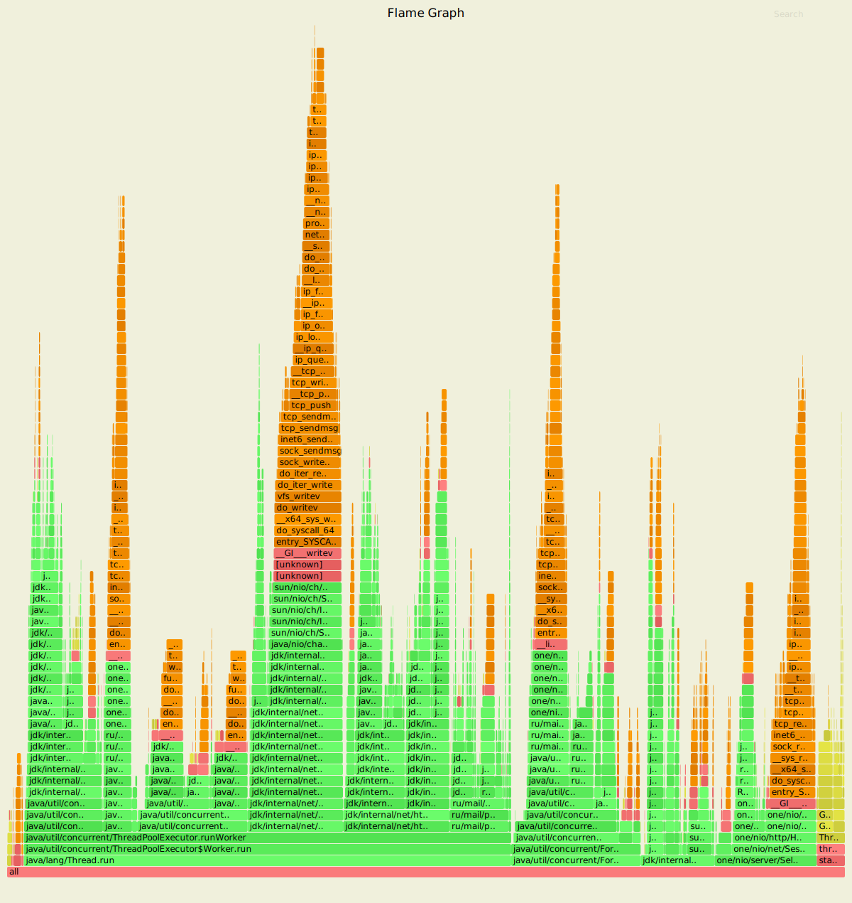
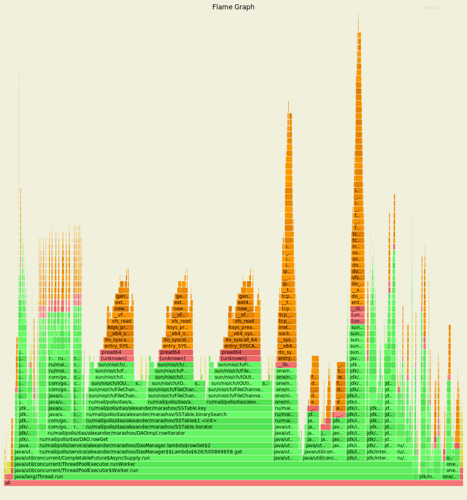
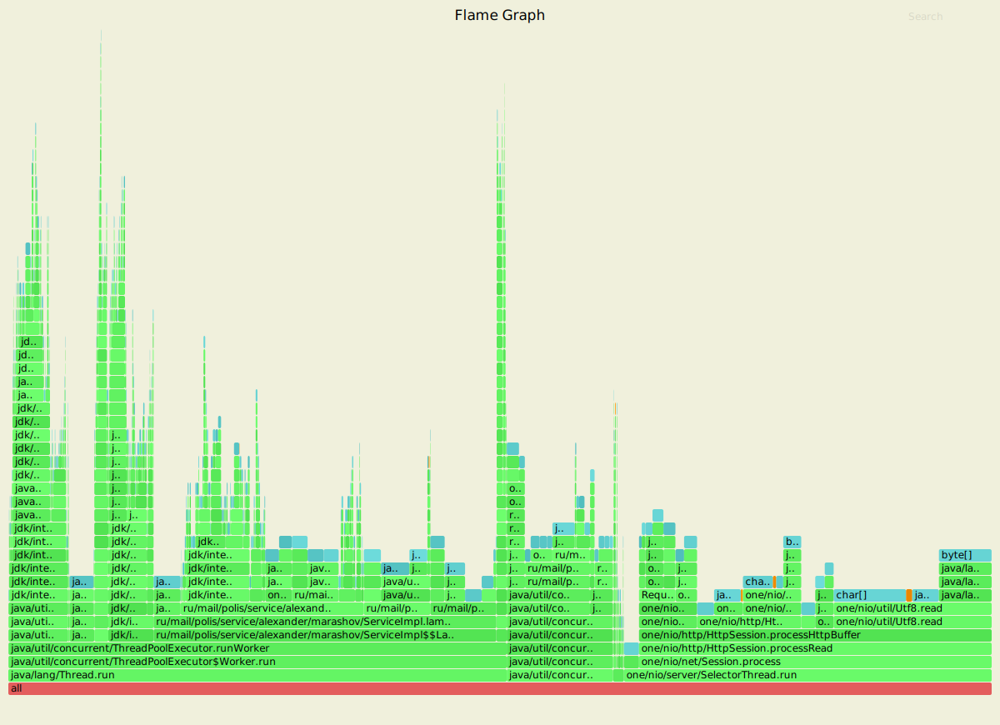
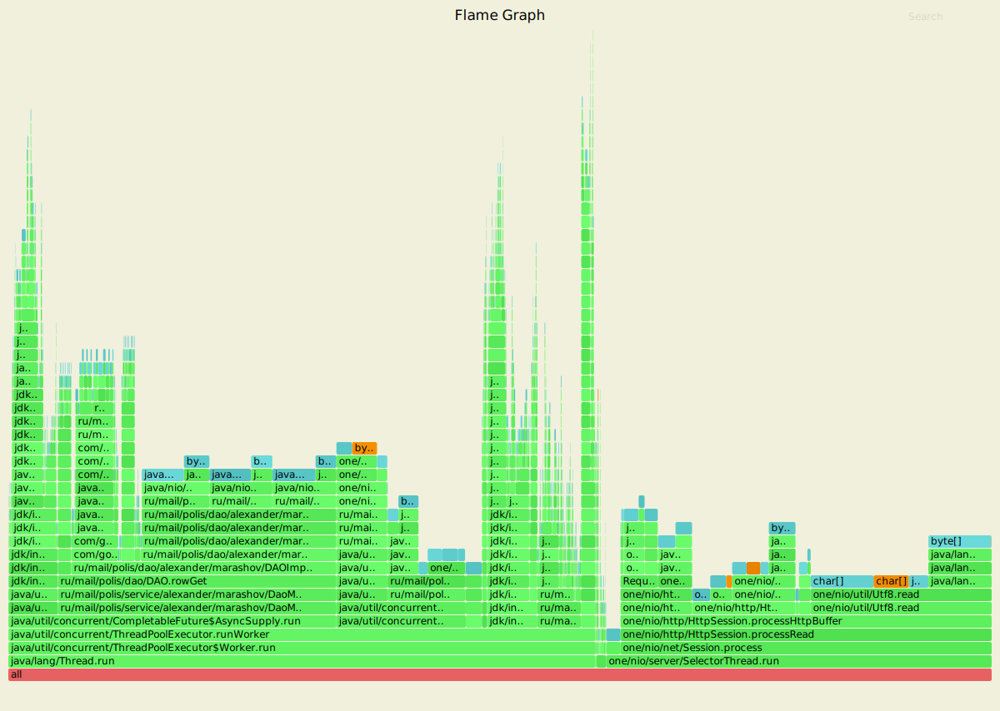
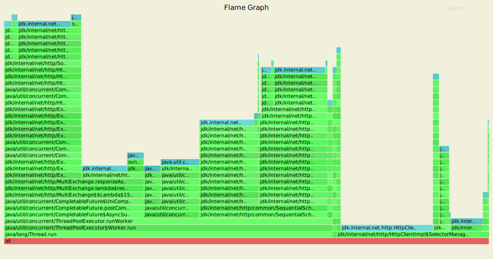
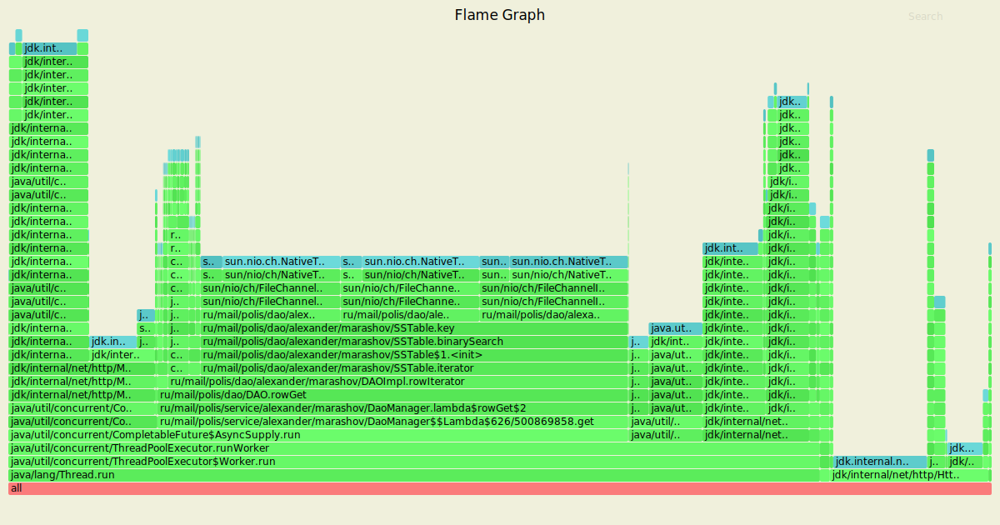

# Этап 6. Асинхронный клиент

## Формулировка задания
- С помощью `java.net.http.HttpClient` реализовать параллельную отправку запросов к репликам.
- Использовать `CompletableFuture` для сбора подтверждений
- Провести нагрузочное тестирование с помощью wrk2 в несколько соединений.

## Результаты нагрузки 

### PUT запросы (ack = 2, from = 3)
```sh
./wrk -c 64 -d 4m -t1 -s ../../2020-highload-dht/profiler/scripts/putS2.lua --latency -R2000 http://localhost:8080
Running 4m test @ http://localhost:8080
  1 threads and 64 connections
  Thread calibration: mean lat.: 1.591ms, rate sampling interval: 10ms
  Thread Stats   Avg      Stdev     Max   +/- Stdev
    Latency     1.20ms  680.39us  19.25ms   84.22%
    Req/Sec     2.09k   179.27     4.90k    82.05%
  Latency Distribution (HdrHistogram - Recorded Latency)
 50.000%    1.13ms
 75.000%    1.52ms
 90.000%    1.78ms
 99.000%    3.61ms
 99.900%    8.00ms
 99.990%   12.96ms
 99.999%   16.70ms
100.000%   19.26ms

  Detailed Percentile spectrum:
       Value   Percentile   TotalCount 1/(1-Percentile)

       0.196     0.000000            1         1.00
       0.538     0.100000        45941         1.11
       0.698     0.200000        92175         1.25
       0.842     0.300000       137911         1.43
       0.987     0.400000       183856         1.67
       1.133     0.500000       229804         2.00
       1.205     0.550000       252835         2.22
       1.279     0.600000       275691         2.50
       1.356     0.650000       298790         2.86
       1.436     0.700000       321782         3.33
       1.517     0.750000       344663         4.00
       1.558     0.775000       356071         4.44
       1.599     0.800000       367520         5.00
       1.641     0.825000       379159         5.71
       1.683     0.850000       390649         6.67
       1.729     0.875000       401945         8.00
       1.755     0.887500       407754         8.89
       1.785     0.900000       413590        10.00
       1.818     0.912500       419202        11.43
       1.859     0.925000       425017        13.33
       1.911     0.937500       430704        16.00
       1.942     0.943750       433601        17.78
       1.978     0.950000       436422        20.00
       2.023     0.956250       439277        22.86
       2.075     0.962500       442195        26.67
       2.137     0.968750       445008        32.00
       2.177     0.971875       446465        35.56
       2.227     0.975000       447888        40.00
       2.299     0.978125       449337        45.71
       2.421     0.981250       450749        53.33
       2.689     0.984375       452184        64.00
       2.901     0.985938       452909        71.11
       3.145     0.987500       453620        80.00
       3.429     0.989062       454338        91.43
       3.743     0.990625       455059       106.67
       4.111     0.992188       455778       128.00
       4.307     0.992969       456137       142.22
       4.523     0.993750       456489       160.00
       4.783     0.994531       456849       182.86
       5.083     0.995313       457209       213.33
       5.419     0.996094       457571       256.00
       5.639     0.996484       457746       284.44
       5.867     0.996875       457930       320.00
       6.111     0.997266       458105       365.71
       6.403     0.997656       458286       426.67
       6.735     0.998047       458463       512.00
       6.919     0.998242       458553       568.89
       7.123     0.998437       458644       640.00
       7.343     0.998633       458732       731.43
       7.611     0.998828       458824       853.33
       8.063     0.999023       458913      1024.00
       8.263     0.999121       458959      1137.78
       8.471     0.999219       459002      1280.00
       8.695     0.999316       459048      1462.86
       9.127     0.999414       459091      1706.67
       9.527     0.999512       459136      2048.00
       9.855     0.999561       459159      2275.56
      10.087     0.999609       459181      2560.00
      10.455     0.999658       459204      2925.71
      10.703     0.999707       459226      3413.33
      11.087     0.999756       459248      4096.00
      11.359     0.999780       459260      4551.11
      11.663     0.999805       459271      5120.00
      11.943     0.999829       459283      5851.43
      12.191     0.999854       459294      6826.67
      12.607     0.999878       459305      8192.00
      12.791     0.999890       459310      9102.22
      13.143     0.999902       459316     10240.00
      13.415     0.999915       459321     11702.86
      13.575     0.999927       459327     13653.33
      13.743     0.999939       459332     16384.00
      14.071     0.999945       459335     18204.44
      14.383     0.999951       459338     20480.00
      14.855     0.999957       459341     23405.71
      15.103     0.999963       459344     27306.67
      15.247     0.999969       459346     32768.00
      15.607     0.999973       459348     36408.89
      15.623     0.999976       459349     40960.00
      16.007     0.999979       459351     46811.43
      16.023     0.999982       459352     54613.33
      16.479     0.999985       459353     65536.00
      16.655     0.999986       459354     72817.78
      16.703     0.999988       459355     81920.00
      17.519     0.999989       459356     93622.86
      17.519     0.999991       459356    109226.67
      17.567     0.999992       459357    131072.00
      17.567     0.999993       459357    145635.56
      18.351     0.999994       459358    163840.00
      18.351     0.999995       459358    187245.71
      18.351     0.999995       459358    218453.33
      18.655     0.999996       459359    262144.00
      18.655     0.999997       459359    291271.11
      18.655     0.999997       459359    327680.00
      18.655     0.999997       459359    374491.43
      18.655     0.999998       459359    436906.67
      19.263     0.999998       459360    524288.00
      19.263     1.000000       459360          inf
#[Mean    =        1.198, StdDeviation   =        0.680]
#[Max     =       19.248, Total count    =       459360]
#[Buckets =           27, SubBuckets     =         2048]
----------------------------------------------------------
  479717 requests in 4.00m, 30.65MB read
Requests/sec:   1998.82
Transfer/sec:    130.78KB
```

### GET запросы (ack = 2, from = 3)
```sh
./wrk -c 64 -d 4m -t1 -s ../../2020-highload-dht/profiler/scripts/getS2.lua --latency -R2000 http://localhost:8080
Running 4m test @ http://localhost:8080
  1 threads and 64 connections
  Thread calibration: mean lat.: 1.141ms, rate sampling interval: 10ms
  Thread Stats   Avg      Stdev     Max   +/- Stdev
    Latency     1.13ms  548.87us  17.09ms   72.95%
    Req/Sec     2.11k   155.30     4.55k    79.79%
  Latency Distribution (HdrHistogram - Recorded Latency)
 50.000%    1.09ms
 75.000%    1.45ms
 90.000%    1.74ms
 99.000%    2.46ms
 99.900%    5.57ms
 99.990%    9.99ms
 99.999%   12.77ms
100.000%   17.10ms

  Detailed Percentile spectrum:
       Value   Percentile   TotalCount 1/(1-Percentile)

       0.164     0.000000            1         1.00
       0.501     0.100000        46019         1.11
       0.666     0.200000        91905         1.25
       0.815     0.300000       138074         1.43
       0.951     0.400000       183828         1.67
       1.088     0.500000       229980         2.00
       1.157     0.550000       252819         2.22
       1.225     0.600000       275625         2.50
       1.295     0.650000       298665         2.86
       1.369     0.700000       321678         3.33
       1.447     0.750000       344678         4.00
       1.488     0.775000       356165         4.44
       1.531     0.800000       367652         5.00
       1.576     0.825000       379169         5.71
       1.624     0.850000       390536         6.67
       1.677     0.875000       401986         8.00
       1.707     0.887500       407804         8.89
       1.739     0.900000       413463        10.00
       1.775     0.912500       419210        11.43
       1.815     0.925000       424950        13.33
       1.863     0.937500       430693        16.00
       1.891     0.943750       433564        17.78
       1.922     0.950000       436432        20.00
       1.957     0.956250       439331        22.86
       1.997     0.962500       442159        26.67
       2.047     0.968750       445065        32.00
       2.073     0.971875       446456        35.56
       2.107     0.975000       447916        40.00
       2.145     0.978125       449329        45.71
       2.191     0.981250       450747        53.33
       2.251     0.984375       452200        64.00
       2.289     0.985938       452908        71.11
       2.339     0.987500       453623        80.00
       2.407     0.989062       454342        91.43
       2.505     0.990625       455062       106.67
       2.679     0.992188       455775       128.00
       2.823     0.992969       456134       142.22
       2.983     0.993750       456490       160.00
       3.161     0.994531       456848       182.86
       3.375     0.995313       457210       213.33
       3.611     0.996094       457568       256.00
       3.741     0.996484       457746       284.44
       3.919     0.996875       457925       320.00
       4.119     0.997266       458106       365.71
       4.367     0.997656       458287       426.67
       4.651     0.998047       458463       512.00
       4.787     0.998242       458553       568.89
       4.923     0.998437       458645       640.00
       5.127     0.998633       458733       731.43
       5.363     0.998828       458823       853.33
       5.611     0.999023       458913      1024.00
       5.847     0.999121       458958      1137.78
       6.043     0.999219       459003      1280.00
       6.299     0.999316       459046      1462.86
       6.563     0.999414       459091      1706.67
       6.923     0.999512       459136      2048.00
       7.175     0.999561       459159      2275.56
       7.395     0.999609       459181      2560.00
       7.579     0.999658       459203      2925.71
       7.915     0.999707       459226      3413.33
       8.335     0.999756       459248      4096.00
       8.591     0.999780       459260      4551.11
       8.871     0.999805       459271      5120.00
       9.079     0.999829       459282      5851.43
       9.247     0.999854       459293      6826.67
       9.591     0.999878       459304      8192.00
       9.743     0.999890       459310      9102.22
      10.023     0.999902       459316     10240.00
      10.223     0.999915       459321     11702.86
      10.567     0.999927       459327     13653.33
      10.743     0.999939       459332     16384.00
      10.967     0.999945       459336     18204.44
      11.199     0.999951       459338     20480.00
      11.359     0.999957       459341     23405.71
      11.535     0.999963       459344     27306.67
      11.615     0.999969       459346     32768.00
      11.943     0.999973       459348     36408.89
      12.079     0.999976       459349     40960.00
      12.223     0.999979       459352     46811.43
      12.223     0.999982       459352     54613.33
      12.279     0.999985       459353     65536.00
      12.639     0.999986       459354     72817.78
      12.775     0.999988       459355     81920.00
      13.383     0.999989       459356     93622.86
      13.383     0.999991       459356    109226.67
      13.519     0.999992       459357    131072.00
      13.519     0.999993       459357    145635.56
      14.887     0.999994       459358    163840.00
      14.887     0.999995       459358    187245.71
      14.887     0.999995       459358    218453.33
      16.111     0.999996       459359    262144.00
      16.111     0.999997       459359    291271.11
      16.111     0.999997       459359    327680.00
      16.111     0.999997       459359    374491.43
      16.111     0.999998       459359    436906.67
      17.103     0.999998       459360    524288.00
      17.103     1.000000       459360          inf
#[Mean    =        1.128, StdDeviation   =        0.549]
#[Max     =       17.088, Total count    =       459360]
#[Buckets =           27, SubBuckets     =         2048]
----------------------------------------------------------
  479715 requests in 4.00m, 33.74MB read
Requests/sec:   1998.81
Transfer/sec:    143.95KB
```

## Сравнение с результатами этапа 5
* В предыдущем этапе 99.9% запросов при replicas=2/3 были обработаны:
    - PUT - за 4.22ms,
    - GET - за 2.68ms
* в текущей реализации:
    - PUT -- за 8ms.
    - GET -- за 5.57ms.
######
<br/>
Исходя из результатов, мне не удалось добиться ускорения работы кластера за счёт перехода
с асинхронного проксирования через executorService на асинхронное проксирование через `java.net.http.HttpClient`.
Возможно, из-за неэффективности моей реализации.

## Анализ профилирования

### Cpu
#### Put запросы

#### Get запросы

<p>
    По результатам видно, что 8.81% cpu-семплов принадлежат классу SelectorManager
     из асинхронного HttpClient. При этом большую из этого часть процессорного времени
      этот класс выбирал готовые к обработке запросы (.select - 2.95%),
       обрабатывал асинхронные события (AsyncTriggerEvent.handle - 1.64%) 
        и работал с элементами ArrayList (.forEach - 2.02%).
</p>
<p>
    Далее, 15% времени потреблял ForkJoinWorkerPool, в котором, в частности, обрабатывался
    наш метод Respond из ServiceImpl (после получения результата future).
</p>

<p>
    Поскольку ThreadPoolExecutor.getTask занимает 13.18% процессорного времени (из которых 7.7% - метод await)
    почти 10% времени потоки простаивали в ожидании задач, что говорит либо о возможности кластера выдержать более высокую нагрузку 
    (2000 запросов в секунду - не предел), либо о неэффективности распределения задач между executorServices.
</p>

<p>
    Что касается анализа get-нагрузки, то абсолютная половина семплов относится к DAO.rowGet, в работе которой
    в равной пропорции замечены SSTable.getFrom, SSTable.getIntFrom, SSTable.getOffset (чтение из файлов SSTable).
    В случае наличия большого количества SSTable-таблиц, думаю, стоило бы добавить автоматический вызов метода compact:
    проще двоичным поиском бегать по одному файлу, чем собирать данные из разных, а потом ещё и выполнять слияние (mergeSorted - 5.21%, collapseEquals - 2.04%) 
</p>

### Alloc
#### Put запросы

По результатам 
#### Get запросы


<p>
Значительно увеличилась доля семплов аллокации памяти `one.nio.server.SelectorThread` (37.4% - PUT, 39% - GET с 27% в прошлом этапе),
хотя использование этого класса на кластере я не менял. Это может говорить о том, что общее количество аллокаций памяти 
остальными участками кода заметно уменьшилось.   
</p>

### Lock
#### Put запросы

#### Get запросы


<p>
    На графике блокировок добавилось много новых видов семплов из асинхронного клиента, таких как SelectorManager (9.5%), 
    AsyncTriggerEvent.handle (1.86%) (данные для get профилирования).
    PUT график от GET отличается лишь наличием во втором большой доли блокировок при работе с DAO (50%), в частности, SSTable.  
</p>

### Подводя итоги
<p>
    На первых этапах разработки при профилировании DAO занимала обычно не больше 2% на всех графиках.
    Получалось, что все вспомогательные классы, обслуживающие DAO, потребляли большую часть процессорного времени и памяти.
    На мой взгляд, большая доля вовлечённости в работу самого DAO говорит о том, что отдельно взятая нода кластера занимается тем, чем и должна,
    исходя из идеи.
</p>
