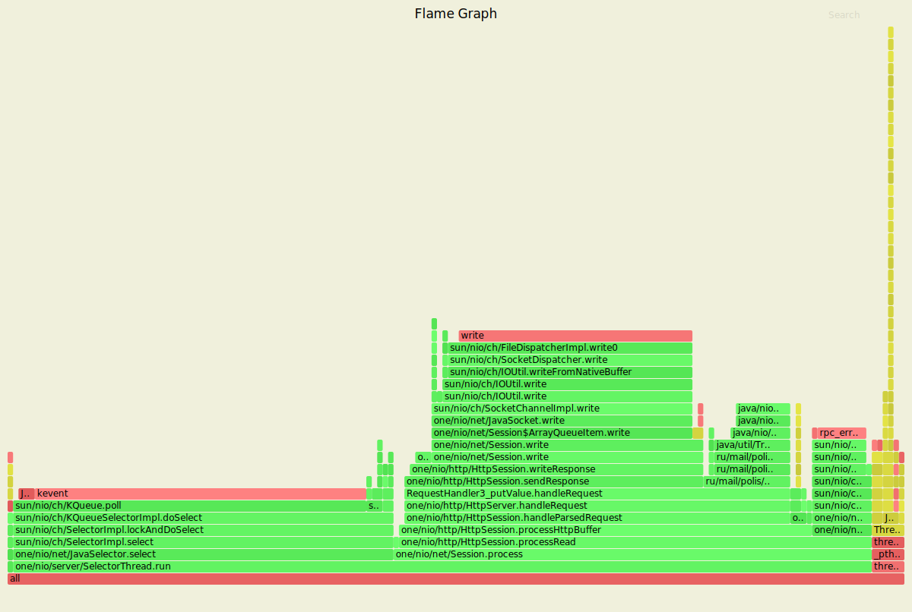
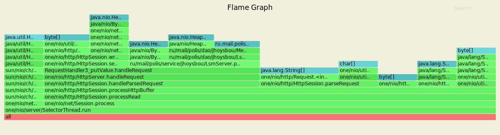
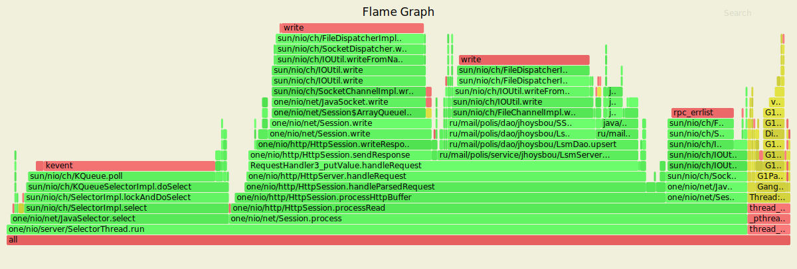
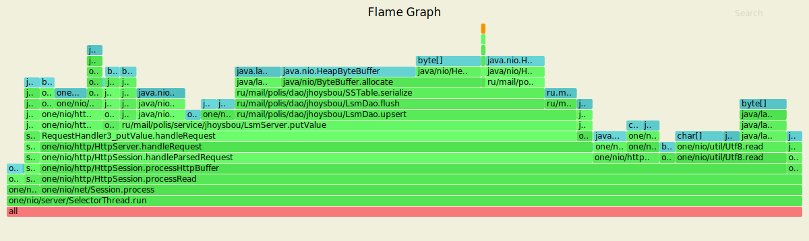
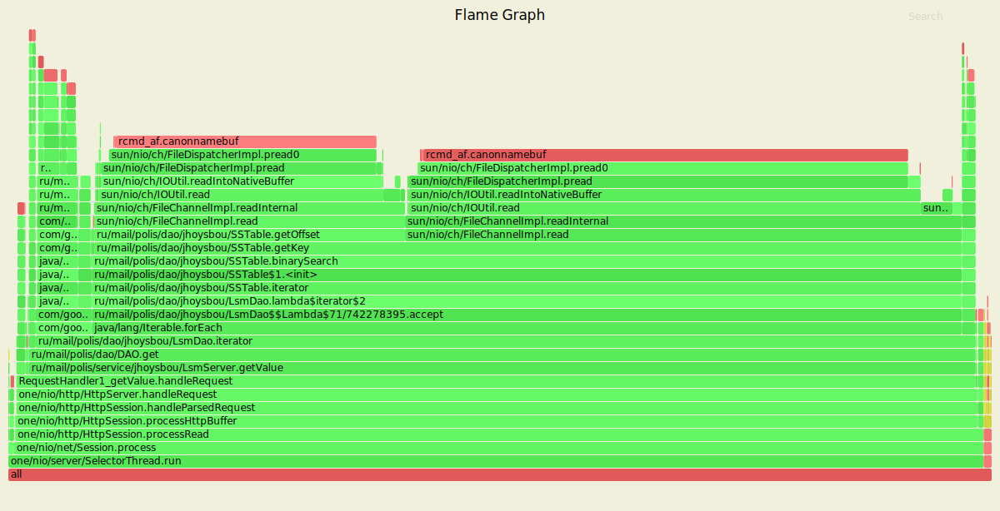
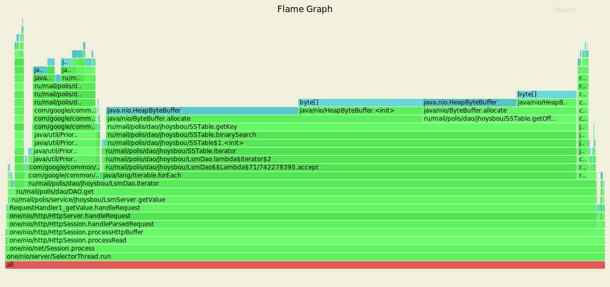

# Профилирование 
## Сетап
 - Для поддержания нагрузки на сервер будем использовать утилиту wrk2
 - Для сбора и визуализации информации о нагрузке CPU и памяти будем использовать async-profiler
 
### PUT
Замер latency `2000 r/sec`
```
Thread Stats   Avg      Stdev     Max   +/- Stdev
    Latency     1.13ms  601.85us  15.79ms   64.77%
    Req/Sec     2.10k   209.15     4.90k    79.25%
  Latency Distribution (HdrHistogram - Recorded Latency)
 50.000%    1.12ms
 75.000%    1.55ms
 90.000%    1.92ms
 99.000%    2.21ms
 99.900%    3.09ms
 99.990%   12.10ms
 99.999%   15.44ms
100.000%   15.80ms

  119997 requests in 1.00m, 7.67MB read
Requests/sec:   1999.92
Transfer/sec:    130.85KB
```
Можно сразу заметить, что мы без проблем поддерживаем 2000 put'ов в секунду. 
Как видно из таблицы распределения задержи 99.9% запросов не занимают более 3.09 секунд. Однако существует небольшое количество
запросов (~0.1%) на выполнение которых требуется больше времени. Это скорее всего связано с периодической сборкой мусора.
Среднеквадратичное отклонение - 600 микросекунд.

#### Результаты профилирования cpu:

Около 4% ресурсов процессора занимает JIT-компиляция\
~6% - Чтение из сокета\
~10% - Вставка в DAO\
~30% - Формирование ответа на запрос и его отправка\
~40% - Прослушивание сокета


Вероятнее всего, из-за небольшой нагрузки значительное время приходится именно на прослушивание сокетов.

#### Результаты профилирования alloc:

~8% - Прослушивание сокета\
~17% - Формирование ответа на запрос и его отправка\
~24% - Парсинг запроса\
~25% - Вставку значения в DAO

Можно заметить, что выделяется еще ~24% на обработку запроса, а именно конвертация заголовков и тела запроса.

Посмотрим, как изменяться показатели, если увеличить нагрузку.

#### Увеличим `rate` и сравним результаты
Замер latency `20000 r/sec`
```
Thread Stats   Avg      Stdev     Max   +/- Stdev
    Latency     3.73s     2.01s    7.45s    65.67%
    Req/Sec    19.84k    12.57k   33.78k    69.72%
  Latency Distribution (HdrHistogram - Recorded Latency)
 50.000%    3.95s 
 75.000%    5.21s 
 90.000%    6.21s 
 99.000%    7.33s 
 99.900%    7.45s 
 99.990%    7.46s 
 99.999%    7.46s 
100.000%    7.46s 

  1103718 requests in 1.00m, 70.52MB read
  Socket errors: connect 0, read 0, write 0, timeout 6
Requests/sec:  18395.41
Transfer/sec:      1.18MB
```
Выдержать 20000 вставок в секунду уже не получается. Среднее время обработки, среднеквадратичное отклонение 
и распределение задержки существенно выросли. Теперь, 99.9% запросов обрабатываются уже за 7 секунд. 

#### Результаты профилирования cpu:


Видим снижение потребления ресурсов системы на прослушивание сокетов и записи на диск в DAO. Однако выросли затраты 
на чтение сокета и появилась еще одна операция записи на диск, которая занимает ~24% cpu. Смею предположить, 
что это произошло из-за того, что при таком количестве запросов доступная память быстро закончилась и пришлось 
часть запросов сохранять на диск. 

#### Результаты профилирования alloc:


Доля памяти, требуемая на запись увеличилась и теперь составляет ~57%. Доля памяти на все остальные процессы уменьшилась. 
Вероятнее всего, абсолютные значения потребления памяти выросли и выросли по большей части за счет DAO. Этим и сказывается 
относительное уменьшение потребления памяти другими процессами. 

### GET
Замер latency `2000 r/sec`
```
  Thread Stats   Avg      Stdev     Max   +/- Stdev
      Latency   139.93ms  318.45ms   1.23s    86.08%
      Req/Sec     1.99k   211.79     2.46k    80.65%
    Latency Distribution (HdrHistogram - Recorded Latency)
   50.000%    1.46ms
   75.000%    1.92ms
   90.000%  698.88ms
   99.000%    1.22s 
   99.900%    1.24s 
   99.990%    1.24s 
   99.999%    1.24s 
  100.000%    1.24s 

  119688 requests in 1.00m, 8.33MB read
Requests/sec:   1994.81
Transfer/sec:    142.19KB
```
#### Результаты профилирования cpu:

~0.5% - Прослушивание сокета\
~1% - Подготовка ответа\
~90% - Поиск значения

Большую часть времени занимает поиск значения, что вполне логично.

#### Результаты профилирования alloc:

3% - работа с итераторами 
95% - Поиск значения по ключу.

Почти вся память уходит на получение ключа.


