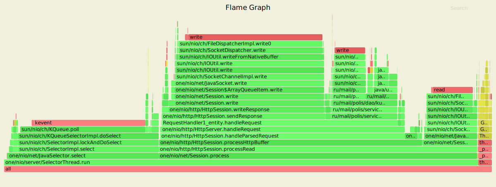
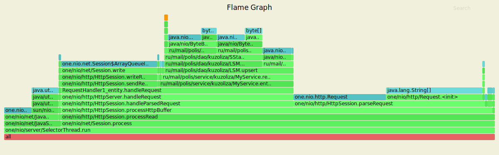
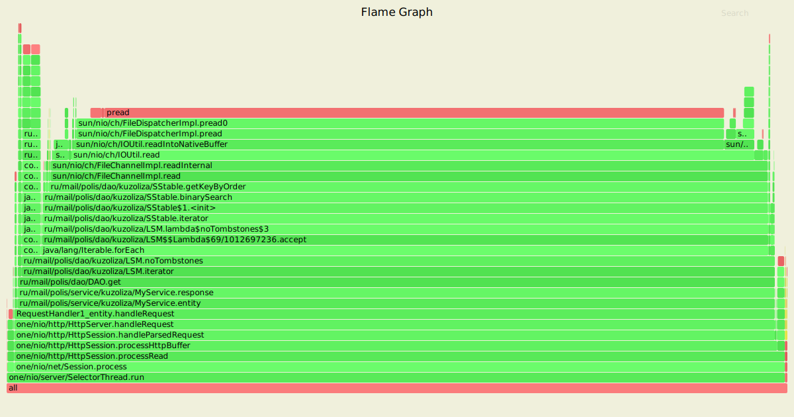
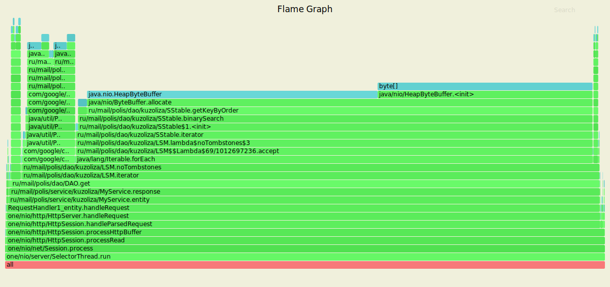

## Нагрузочное тестирование - hw1

Добавлен конфиг для логирования, чтобы ресурсы не тратились на это.

#### PUT

Было увеличено время обстрела до 10 минут. На графиках видно, что происходит flush данных на диск.

##### CPU

6.9% тратится на запись данных на диск, 6.4% - на запись в MemTable, таким образом на работу с DAO уходит 13.3%.
Мониторинг доступных каналов занимает 30% ресурсов CPU. Обработка запросов занимает 49%, запись в сокет - 30%, чтение из сокета - 11%. Процесс "прогрет", поэтому JIT компилятор тратит всего 2.8% ресурсов. 

##### ALLOC

20% памяти занимает flush данных на диск, а добавление в MemTable всего 6%, следовательно на работу с DAO уходит 26% памяти. Обработка запросов занимает 47%, парсинг запроса - 38.9%.

Обстрел производился одним потоком с одним соединением. Заданную нагрузку сервер отрабатывает успешно - 1999.99 запросов в секунду. Среднеквадратичное отклонение составляет 95.92%. За 10 минут было обработано успешно почти 1.2 млн запросов.

	Running 10m test @ http://127.0.0.1:8080
    1 threads and 1 connections
    Thread calibration: mean lat.: 1.704ms, rate sampling interval: 10ms
    Thread Stats   Avg      Stdev     Max   +/- Stdev
    Latency    90.53ms  462.54ms   4.36s    95.92%
    Req/Sec     2.13k     1.48k   29.78k    94.87%
    Latency Distribution (HdrHistogram - Recorded Latency)
    50.000%    1.27ms
    75.000%    1.78ms
    90.000%    2.33ms
    99.000%    2.90s 
    99.900%    3.99s 
    99.990%    4.32s 
    99.999%    4.36s 
    100.000%    4.37s 

    Detailed Percentile spectrum:
       Value   Percentile   TotalCount 1/(1-Percentile)

       0.045     0.000000            1         1.00
       0.429     0.100000       118259         1.11
       0.690     0.200000       236298         1.25
       0.922     0.300000       354360         1.43
       1.117     0.400000       472444         1.67
       1.271     0.500000       590611         2.00
       1.345     0.550000       649668         2.22
       1.423     0.600000       708673         2.50
       1.513     0.650000       767137         2.86
       1.629     0.700000       826071         3.33
       1.777     0.750000       884992         4.00
       1.855     0.775000       914535         4.44
       1.936     0.800000       944115         5.00
       2.023     0.825000       973687         5.71
       2.113     0.850000      1003150         6.67
       2.211     0.875000      1032755         8.00
       2.265     0.887500      1047243         8.89
       2.327     0.900000      1062178        10.00
       2.397     0.912500      1076803        11.43
       2.505     0.925000      1091568        13.33
       3.437     0.937500      1106238        16.00
       9.215     0.943750      1113611        17.78
      57.343     0.950000      1120987        20.00
     327.679     0.956250      1128362        22.86
     800.255     0.962500      1135740        26.67
    1273.855     0.968750      1143121        32.00
    1513.471     0.971875      1146808        35.56
    1752.063     0.975000      1150497        40.00
    1992.703     0.978125      1154182        45.71
    2232.319     0.981250      1157882        53.33
    2471.935     0.984375      1161570        64.00
    2590.719     0.985938      1163401        71.11
    2709.503     0.987500      1165257        80.00
    2828.287     0.989062      1167102        91.43
    2947.071     0.990625      1168945       106.67
    3063.807     0.992188      1170793       128.00
    3121.151     0.992969      1171695       142.22
    3182.591     0.993750      1172637       160.00
    3241.983     0.994531      1173557       182.86
    3305.471     0.995313      1174463       213.33
    3389.439     0.996094      1175390       256.00
    3438.591     0.996484      1175843       284.44
    3489.791     0.996875      1176308       320.00
    3553.279     0.997266      1176762       365.71
    3647.487     0.997656      1177224       426.67
    3749.887     0.998047      1177686       512.00
    3799.039     0.998242      1177916       568.89
    3850.239     0.998437      1178151       640.00
    3899.391     0.998633      1178381       731.43
    3948.543     0.998828      1178607       853.33
    3997.695     0.999023      1178841      1024.00
    4018.175     0.999121      1178952      1137.78
    4042.751     0.999219      1179071      1280.00
    4065.279     0.999316      1179187      1462.86
    4091.903     0.999414      1179295      1706.67
    4136.959     0.999512      1179418      2048.00
    4155.391     0.999561      1179468      2275.56
    4179.967     0.999609      1179528      2560.00
    4198.399     0.999658      1179592      2925.71
    4218.879     0.999707      1179647      3413.33
    4243.455     0.999756      1179702      4096.00
    4255.743     0.999780      1179731      4551.11
    4268.031     0.999805      1179760      5120.00
    4280.319     0.999829      1179790      5851.43
    4292.607     0.999854      1179818      6826.67
    4304.895     0.999878      1179846      8192.00
    4313.087     0.999890      1179865      9102.22
    4317.183     0.999902      1179875     10240.00
    4321.279     0.999915      1179885     11702.86
    4329.471     0.999927      1179903     13653.33
    4337.663     0.999939      1179921     16384.00
    4337.663     0.999945      1179921     18204.44
    4341.759     0.999951      1179930     20480.00
    4345.855     0.999957      1179939     23405.71
    4349.951     0.999963      1179948     27306.67
    4354.047     0.999969      1179958     32768.00
    4354.047     0.999973      1179958     36408.89
    4354.047     0.999976      1179958     40960.00
    4358.143     0.999979      1179968     46811.43
    4358.143     0.999982      1179968     54613.33
    4358.143     0.999985      1179968     65536.00
    4362.239     0.999986      1179978     72817.78
    4362.239     0.999988      1179978     81920.00
    4362.239     0.999989      1179978     93622.86
    4362.239     0.999991      1179978    109226.67
    4362.239     0.999992      1179978    131072.00
    4362.239     0.999993      1179978    145635.56
    4362.239     0.999994      1179978    163840.00
    4366.335     0.999995      1179985    187245.71
    4366.335     1.000000      1179985          inf
    #[Mean    =       90.528, StdDeviation   =      462.540]
    #[Max     =     4362.240, Total count    =      1179985]
    #[Buckets =           27, SubBuckets     =         2048]
    ----------------------------------------------------------
    1199996 requests in 10.00m, 76.68MB read
    Socket errors: connect 0, read 0, write 0, timeout 6
    Requests/sec:   1999.99
    Transfer/sec:    130.86KB 

#### GET

Обстрел выполнялся по заполненной ранее базе. Почти 97% ресурсов CPU уходит на работу с DAO. Запись в сокет занимает 0.26%, мониторинг каналов - 0.89%, чтение из сокета 1%. Обработка запросов занимает 97%. Процесс "прогрет", поэтому JIT компилятор тратит всего 0.32% ресурсов. 

98% памяти занимает работа с DAO. На обработку запросов уходит 99%, на парсинг запроса - 0.44%.

Обстрел производился одним потоком с одним соединением. Заданную нагрузку сервер отрабатывает успешно - 935.53 запросов в секунду. Среднеквадратичное отклонение составляет 60.83%. За 2 минуты было обработано успешно более 130 тыс. запросов.

    Running 2m test @ http://127.0.0.1:8080
    1 threads and 1 connections
    Thread calibration: mean lat.: 1781.361ms, rate sampling interval: 5382ms
    Thread Stats   Avg      Stdev     Max   +/- Stdev
    Latency     6.34s     1.14s    9.06s    60.83%
    Req/Sec     0.95k   115.74     1.09k    83.33%
    Latency Distribution (HdrHistogram - Recorded Latency)
    50.000%    6.37s 
    75.000%    6.90s 
    90.000%    8.12s 
    99.000%    9.03s 
    99.900%    9.07s 
    99.990%    9.07s 
    99.999%    9.07s 
    100.000%    9.07s 

    Detailed Percentile spectrum:
       Value   Percentile   TotalCount 1/(1-Percentile)

    3215.359     0.000000            1         1.00
    4984.831     0.100000        12665         1.11
    5124.095     0.200000        24975         1.25
    5566.463     0.300000        37308         1.43
    5906.431     0.400000        49748         1.67
    6373.375     0.500000        62176         2.00
    6459.391     0.550000        68476         2.22
    6504.447     0.600000        74660         2.50
    6553.599     0.650000        81105         2.86
    6811.647     0.700000        86985         3.33
    6897.663     0.750000        93158         4.00
    6995.967     0.775000        96378         4.44
    7106.559     0.800000        99413         5.00
    7548.927     0.825000       102526         5.71
    7921.663     0.850000       105664         6.67
    8105.983     0.875000       109150         8.00
    8114.175     0.887500       110222         8.89
    8122.367     0.900000       111867        10.00
    8138.751     0.912500       113853        11.43
    8146.943     0.925000       115064        13.33
    8159.231     0.937500       116580        16.00
    8171.519     0.943750       117267        17.78
    8323.071     0.950000       117977        20.00
    8478.719     0.956250       119240        22.86
    8585.215     0.962500       119540        26.67
    8822.783     0.968750       120312        32.00
    8880.127     0.971875       120752        35.56
    8945.663     0.975000       121216        40.00
    8962.047     0.978125       121549        45.71
    8986.623     0.981250       121937        53.33
    9003.007     0.984375       122366        64.00
    9011.199     0.985938       122648        71.11
    9011.199     0.987500       122648        80.00
    9019.391     0.989062       122929        91.43
    9027.583     0.990625       123179       106.67
    9035.775     0.992188       123418       128.00
    9035.775     0.992969       123418       142.22
    9035.775     0.993750       123418       160.00
    9043.967     0.994531       123682       182.86
    9043.967     0.995313       123682       213.33
    9052.159     0.996094       123919       256.00
    9052.159     0.996484       123919       284.44
    9052.159     0.996875       123919       320.00
    9052.159     0.997266       123919       365.71
    9052.159     0.997656       123919       426.67
    9060.351     0.998047       124055       512.00
    9060.351     0.998242       124055       568.89
    9060.351     0.998437       124055       640.00
    9060.351     0.998633       124055       731.43
    9060.351     0.998828       124055       853.33
    9068.543     0.999023       124182      1024.00
    9068.543     1.000000       124182          inf
    #[Mean    =     6339.317, StdDeviation   =     1140.947]
    #[Max     =     9060.352, Total count    =       124182]
    #[Buckets =           27, SubBuckets     =         2048]
    ----------------------------------------------------------
    130974 requests in 2.33m, 9.13MB read
    Requests/sec:    935.53
    Transfer/sec:     66.76KB
