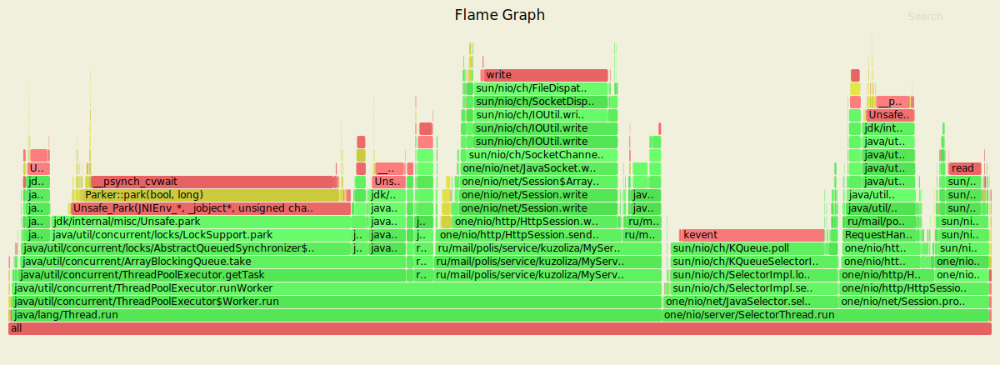
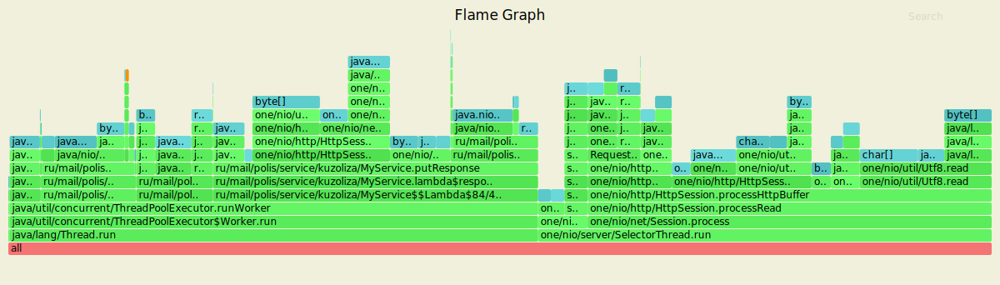
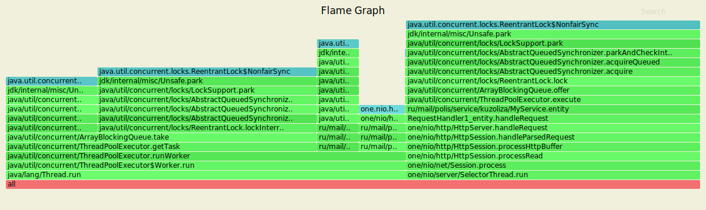
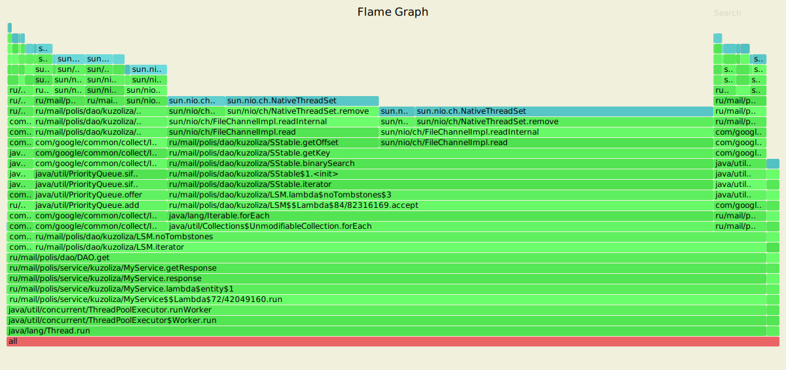

## Нагрузочное тестирование - hw3

#### PUT

Время обстрела 10 минут для заполнения DAO.

##### CPU

Менее 1% тратится на запись данных на диск, 3.6% - на запись в MemTable.
Мониторинг доступных каналов занимает 17.8% ресурсов CPU. Обработка запросов занимает почти 8%, запись в сокет - 16%, чтение из сокета - 5.55%. Процесс "прогрет", поэтому JIT компилятор тратит всего 0.27% ресурсов. 

##### ALLOC

9.7% памяти занимает flush данных на диск, а добавление в MemTable всего 8.7%. Обработка запросов занимает 8.6%, парсинг запроса - 14.22%.

##### LOCK

Работа c ExecutorService занимает 57%, обработка запроса - 42%.

Обстрел производился 4 потоками с 64 соединениями. Заданную нагрузку сервер отрабатывает успешно - 1999.92 запросов в секунду. Среднеквадратичное отклонение составляет 99.04%. За 10 минут было обработано успешно почти 1.2 млн запросов.

    Running 10m test @ http://127.0.0.1:8080
      4 threads and 64 connections
      Thread calibration: mean lat.: 1.358ms, rate sampling interval: 10ms
      Thread calibration: mean lat.: 1.341ms, rate sampling interval: 10ms
      Thread calibration: mean lat.: 1.383ms, rate sampling interval: 10ms
      Thread calibration: mean lat.: 1.314ms, rate sampling interval: 10ms
      Thread Stats   Avg      Stdev     Max   +/- Stdev
        Latency     2.70ms   15.84ms 359.68ms   99.04%
        Req/Sec   527.92    259.94    18.89k    98.94%
      Latency Distribution (HdrHistogram - Recorded Latency)
     50.000%    1.32ms
     75.000%    1.67ms
     90.000%    2.03ms
     99.000%   12.11ms
     99.900%  246.40ms
     99.990%  305.92ms
     99.999%  353.28ms
    100.000%  359.93ms
    
      Detailed Percentile spectrum:
           Value   Percentile   TotalCount 1/(1-Percentile)
    
           0.085     0.000000            1         1.00
           0.638     0.100000       118423         1.11
           0.845     0.200000       236037         1.25
           1.021     0.300000       354411         1.43
           1.179     0.400000       472383         1.67
           1.324     0.500000       590554         2.00
           1.393     0.550000       649489         2.22
           1.460     0.600000       708411         2.50
           1.528     0.650000       767601         2.86
           1.598     0.700000       826313         3.33
           1.674     0.750000       885211         4.00
           1.715     0.775000       914777         4.44
           1.760     0.800000       943961         5.00
           1.813     0.825000       973650         5.71
           1.873     0.850000      1003110         6.67
           1.943     0.875000      1032457         8.00
           1.983     0.887500      1047178         8.89
           2.027     0.900000      1062074        10.00
           2.075     0.912500      1076666        11.43
           2.131     0.925000      1091506        13.33
           2.199     0.937500      1106457        16.00
           2.237     0.943750      1113676        17.78
           2.279     0.950000      1120971        20.00
           2.329     0.956250      1128480        22.86
           2.385     0.962500      1135717        26.67
           2.455     0.968750      1143117        32.00
           2.495     0.971875      1146846        35.56
           2.541     0.975000      1150490        40.00
           2.593     0.978125      1154086        45.71
           2.657     0.981250      1157747        53.33
           2.749     0.984375      1161435        64.00
           2.823     0.985938      1163257        71.11
           2.979     0.987500      1165100        80.00
           4.547     0.989062      1166938        91.43
          22.463     0.990625      1168779       106.67
          59.743     0.992188      1170625       128.00
          80.895     0.992969      1171546       142.22
         102.591     0.993750      1172466       160.00
         124.351     0.994531      1173389       182.86
         145.279     0.995313      1174313       213.33
         166.783     0.996094      1175233       256.00
         177.663     0.996484      1175694       284.44
         188.415     0.996875      1176158       320.00
         198.911     0.997266      1176618       365.71
         209.791     0.997656      1177078       426.67
         220.415     0.998047      1177539       512.00
         225.663     0.998242      1177767       568.89
         231.039     0.998437      1177999       640.00
         236.287     0.998633      1178228       731.43
         241.663     0.998828      1178460       853.33
         247.039     0.999023      1178689      1024.00
         249.727     0.999121      1178805      1137.78
         252.671     0.999219      1178927      1280.00
         255.231     0.999316      1179035      1462.86
         258.431     0.999414      1179153      1706.67
         262.399     0.999512      1179266      2048.00
         264.191     0.999561      1179322      2275.56
         267.263     0.999609      1179381      2560.00
         270.591     0.999658      1179445      2925.71
         274.431     0.999707      1179498      3413.33
         279.551     0.999756      1179556      4096.00
         282.623     0.999780      1179583      4551.11
         285.951     0.999805      1179611      5120.00
         289.023     0.999829      1179640      5851.43
         293.887     0.999854      1179668      6826.67
         299.775     0.999878      1179696      8192.00
         303.359     0.999890      1179712      9102.22
         306.175     0.999902      1179727     10240.00
         309.759     0.999915      1179740     11702.86
         315.647     0.999927      1179754     13653.33
         325.119     0.999939      1179769     16384.00
         328.447     0.999945      1179777     18204.44
         330.239     0.999951      1179783     20480.00
         333.055     0.999957      1179790     23405.71
         336.383     0.999963      1179798     27306.67
         339.199     0.999969      1179804     32768.00
         340.991     0.999973      1179808     36408.89
         343.295     0.999976      1179812     40960.00
         344.063     0.999979      1179815     46811.43
         347.647     0.999982      1179819     54613.33
         348.671     0.999985      1179822     65536.00
         350.975     0.999986      1179824     72817.78
         351.487     0.999988      1179826     81920.00
         353.279     0.999989      1179829     93622.86
         353.535     0.999991      1179830    109226.67
         354.559     0.999992      1179831    131072.00
         356.095     0.999993      1179833    145635.56
         356.095     0.999994      1179833    163840.00
         356.351     0.999995      1179834    187245.71
         356.607     0.999995      1179835    218453.33
         358.143     0.999996      1179836    262144.00
         358.143     0.999997      1179836    291271.11
         358.655     0.999997      1179838    327680.00
         358.655     0.999997      1179838    374491.43
         358.655     0.999998      1179838    436906.67
         358.655     0.999998      1179838    524288.00
         358.655     0.999998      1179838    582542.22
         359.679     0.999998      1179839    655360.00
         359.679     0.999999      1179839    748982.86
         359.679     0.999999      1179839    873813.33
         359.679     0.999999      1179839   1048576.00
         359.679     0.999999      1179839   1165084.44
         359.935     0.999999      1179840   1310720.00
         359.935     1.000000      1179840          inf
    #[Mean    =        2.700, StdDeviation   =       15.841]
    #[Max     =      359.680, Total count    =      1179840]
    #[Buckets =           27, SubBuckets     =         2048]
    ----------------------------------------------------------
      1199952 requests in 10.00m, 76.67MB read
    Requests/sec:   1999.92
    Transfer/sec:    130.85KB

#### GET

Время обстрела 100 секунд.

##### CPU

Обстрел выполнялся по заполненной ранее базе. Почти 79% ресурсов CPU уходит на работу с DAO. Запись в сокет занимает 1.5%, мониторинг каналов - почти 8%, чтение из сокета 1.68%. Процесс "прогрет", поэтому JIT компилятор тратит всего 0.24% ресурсов. 

##### ALLOC

Почти 51% памяти занимает работа с DAO. На обработку запросов уходит 9.79%, на парсинг запроса - 19%.

##### LOCK

Работа c ExecutorService занимает 98%, обработка запроса - 1.67%.

Обстрел производился 4 потоками с 64 соединениями. Заданную нагрузку сервер отрабатывает успешно - 1999.70 запросов в секунду. Среднеквадратичное отклонение составляет 81.3%. За 2.5 минуты было обработано успешно почти 300 тыс. запросов.

    Running 2m test @ http://127.0.0.1:8080
      4 threads and 64 connections
      Thread calibration: mean lat.: 1.935ms, rate sampling interval: 10ms
      Thread calibration: mean lat.: 1.885ms, rate sampling interval: 10ms
      Thread calibration: mean lat.: 1.936ms, rate sampling interval: 10ms
      Thread calibration: mean lat.: 1.929ms, rate sampling interval: 10ms
      Thread Stats   Avg      Stdev     Max   +/- Stdev
        Latency     1.96ms    0.86ms  16.38ms   81.30%
        Req/Sec   526.73    115.01     1.33k    59.67%
      Latency Distribution (HdrHistogram - Recorded Latency)
     50.000%    1.83ms
     75.000%    2.31ms
     90.000%    2.82ms
     99.000%    5.15ms
     99.900%    9.60ms
     99.990%   12.48ms
     99.999%   14.14ms
    100.000%   16.40ms
    
      Detailed Percentile spectrum:
           Value   Percentile   TotalCount 1/(1-Percentile)
    
           0.461     0.000000            1         1.00
           1.130     0.100000        28030         1.11
           1.339     0.200000        56006         1.25
           1.508     0.300000        84083         1.43
           1.667     0.400000       112083         1.67
           1.826     0.500000       139967         2.00
           1.911     0.550000       154013         2.22
           1.999     0.600000       167992         2.50
           2.091     0.650000       181922         2.86
           2.193     0.700000       195938         3.33
           2.307     0.750000       210082         4.00
           2.369     0.775000       217011         4.44
           2.437     0.800000       224026         5.00
           2.513     0.825000       230939         5.71
           2.599     0.850000       237896         6.67
           2.701     0.875000       244956         8.00
           2.757     0.887500       248367         8.89
           2.821     0.900000       251927        10.00
           2.895     0.912500       255387        11.43
           2.981     0.925000       258861        13.33
           3.087     0.937500       262373        16.00
           3.151     0.943750       264153        17.78
           3.219     0.950000       265851        20.00
           3.299     0.956250       267608        22.86
           3.399     0.962500       269370        26.67
           3.533     0.968750       271097        32.00
           3.617     0.971875       271977        35.56
           3.729     0.975000       272847        40.00
           3.875     0.978125       273727        45.71
           4.061     0.981250       274597        53.33
           4.303     0.984375       275470        64.00
           4.475     0.985938       275906        71.11
           4.695     0.987500       276348        80.00
           4.963     0.989062       276781        91.43
           5.283     0.990625       277218       106.67
           5.647     0.992188       277659       128.00
           5.871     0.992969       277877       142.22
           6.087     0.993750       278092       160.00
           6.375     0.994531       278311       182.86
           6.679     0.995313       278529       213.33
           7.023     0.996094       278748       256.00
           7.223     0.996484       278857       284.44
           7.447     0.996875       278967       320.00
           7.707     0.997266       279075       365.71
           7.999     0.997656       279185       426.67
           8.343     0.998047       279294       512.00
           8.567     0.998242       279351       568.89
           8.767     0.998437       279404       640.00
           9.023     0.998633       279458       731.43
           9.319     0.998828       279513       853.33
           9.631     0.999023       279568      1024.00
           9.783     0.999121       279596      1137.78
           9.999     0.999219       279622      1280.00
          10.159     0.999316       279650      1462.86
          10.367     0.999414       279677      1706.67
          10.623     0.999512       279704      2048.00
          10.823     0.999561       279718      2275.56
          10.935     0.999609       279733      2560.00
          11.135     0.999658       279746      2925.71
          11.327     0.999707       279759      3413.33
          11.559     0.999756       279772      4096.00
          11.711     0.999780       279779      4551.11
          11.919     0.999805       279786      5120.00
          12.015     0.999829       279793      5851.43
          12.183     0.999854       279800      6826.67
          12.319     0.999878       279806      8192.00
          12.423     0.999890       279810      9102.22
          12.487     0.999902       279813     10240.00
          12.583     0.999915       279817     11702.86
          12.663     0.999927       279820     13653.33
          12.815     0.999939       279823     16384.00
          12.879     0.999945       279825     18204.44
          12.983     0.999951       279827     20480.00
          13.207     0.999957       279829     23405.71
          13.287     0.999963       279830     27306.67
          13.511     0.999969       279832     32768.00
          13.551     0.999973       279833     36408.89
          13.567     0.999976       279834     40960.00
          13.791     0.999979       279835     46811.43
          13.791     0.999982       279835     54613.33
          13.967     0.999985       279836     65536.00
          14.135     0.999986       279837     72817.78
          14.135     0.999988       279837     81920.00
          14.423     0.999989       279838     93622.86
          14.423     0.999991       279838    109226.67
          14.423     0.999992       279838    131072.00
          14.871     0.999993       279839    145635.56
          14.871     0.999994       279839    163840.00
          14.871     0.999995       279839    187245.71
          14.871     0.999995       279839    218453.33
          14.871     0.999996       279839    262144.00
          16.399     0.999997       279840    291271.11
          16.399     1.000000       279840          inf
    #[Mean    =        1.956, StdDeviation   =        0.861]
    #[Max     =       16.384, Total count    =       279840]
    #[Buckets =           27, SubBuckets     =         2048]
    ----------------------------------------------------------
      299956 requests in 2.50m, 20.80MB read
    Requests/sec:   1999.70
    Transfer/sec:    142.01KB

