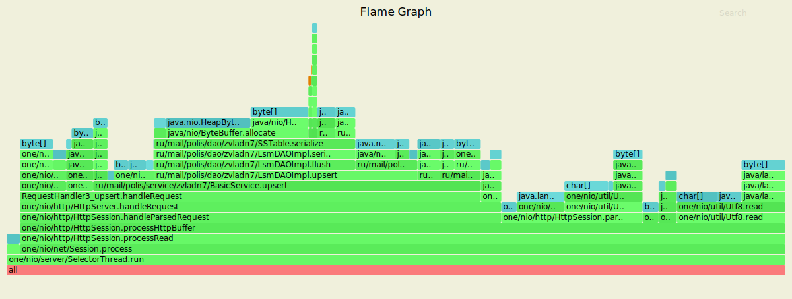
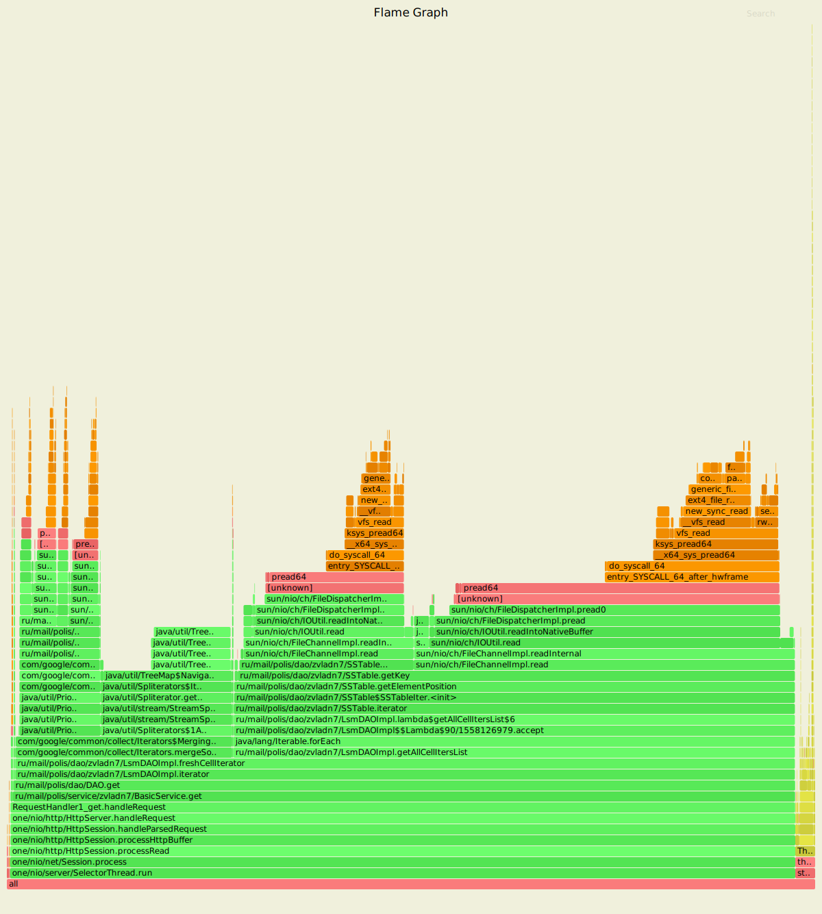
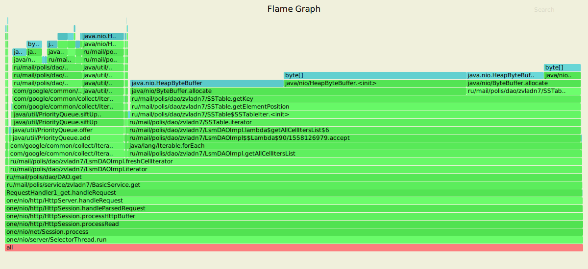

# Нагрузочное тестирование с помощью wrk2

Параметры запуска тестов:
1. Thread - 1
2. Connection - 1
3. Requests per second - 20000
4. Duration - 60s

### 1) Тестирование PUT запросов

`wrk2 -t1 -c1 -R20000 -d60s -s wrk/put.lua --latency  http://localhost:8080`

  Running 1m test @ http://localhost:8080 
  
  1 threads and 1 connections
  
  Thread calibration: mean lat.: 0.641ms, rate sampling interval: 10ms
      
     Thread Stats   Avg      Stdev     Max   +/- Stdev
       Latency   363.60ms  518.40ms   2.32s    83.61%
       Req/Sec    20.93k    13.54k   46.78k    57.46%
  Latency Distribution (HdrHistogram - Recorded Latency)
  
    50.000%    2.11ms
    75.000%  647.17ms
    90.000%    1.14s 
    99.000%    2.13s 
    99.900%    2.30s 
    99.990%    2.32s 
    99.999%    2.32s 
    100.000%    2.32s 

Detailed Percentile spectrum:

       Value   Percentile   TotalCount 1/(1-Percentile)

       0.021     0.000000            2         1.00
       0.280     0.100000        99227         1.11
       0.525     0.200000       198245         1.25
       0.764     0.300000       296889         1.43
       0.996     0.400000       396040         1.67
       2.105     0.500000       494705         2.00
     108.735     0.550000       544181         2.22
     246.911     0.600000       593665         2.50
     388.607     0.650000       643155         2.86
     512.767     0.700000       692625         3.33
     647.167     0.750000       742146         4.00
     714.751     0.775000       766859         4.44
     783.871     0.800000       791572         5.00
     853.503     0.825000       816302         5.71
     926.719     0.850000       841079         6.67
    1028.607     0.875000       865750         8.00
    1082.367     0.887500       878095         8.89
    1135.615     0.900000       890496        10.00
    1205.247     0.912500       902981        11.43
    1277.951     0.925000       915311        13.33
    1344.511     0.937500       927574        16.00
    1393.663     0.943750       933874        17.78
    1441.791     0.950000       939978        20.00
    1500.159     0.956250       946136        22.86
    1576.959     0.962500       952346        26.67
    1650.687     0.968750       958480        32.00
    1726.463     0.971875       961608        35.56
    1789.951     0.975000       964682        40.00
    1860.607     0.978125       967786        45.71
    1932.287     0.981250       970876        53.33
    2002.943     0.984375       973958        64.00
    2040.831     0.985938       975511        71.11
    2073.599     0.987500       977078        80.00
    2107.391     0.989062       978605        91.43
    2142.207     0.990625       980167       106.67
    2164.735     0.992188       981689       128.00
    2177.023     0.992969       982519       142.22
    2181.119     0.993750       983320       160.00
    2191.359     0.994531       984000       182.86
    2209.791     0.995313       984818       213.33
    2228.223     0.996094       985586       256.00
    2236.415     0.996484       985959       284.44
    2244.607     0.996875       986310       320.00
    2254.847     0.997266       986737       365.71
    2265.087     0.997656       987158       426.67
    2273.279     0.998047       987510       512.00
    2277.375     0.998242       987679       568.89
    2283.519     0.998437       987927       640.00
    2287.615     0.998633       988091       731.43
    2291.711     0.998828       988264       853.33
    2295.807     0.999023       988430      1024.00
    2299.903     0.999121       988591      1137.78
    2301.951     0.999219       988673      1280.00
    2303.999     0.999316       988754      1462.86
    2306.047     0.999414       988833      1706.67
    2308.095     0.999512       988917      2048.00
    2310.143     0.999561       989003      2275.56
    2312.191     0.999609       989088      2560.00
    2312.191     0.999658       989088      2925.71
    2314.239     0.999707       989173      3413.33
    2314.239     0.999756       989173      4096.00
    2316.287     0.999780       989258      4551.11
    2316.287     0.999805       989258      5120.00
    2316.287     0.999829       989258      5851.43
    2316.287     0.999854       989258      6826.67
    2318.335     0.999878       989344      8192.00
    2318.335     0.999890       989344      9102.22
    2318.335     0.999902       989344     10240.00
    2318.335     0.999915       989344     11702.86
    2318.335     0.999927       989344     13653.33
    2318.335     0.999939       989344     16384.00
    2318.335     0.999945       989344     18204.44
    2320.383     0.999951       989396     20480.00
    2320.383     1.000000       989396          inf
[Mean    =      363.600, StdDeviation   =      518.397]

[Max     =     2318.336, Total count    =       989396]

[Buckets =           27, SubBuckets     =         2048]
----------------------------------------------------------
  1189474 requests in 1.00m, 76.00MB read
    
    Requests/sec:  19822.14
    Transfer/sec:      1.27MB
    
#### Результаты профилирования async-profiler (CPU): 

Анализ: 
 - Обработка запроса: 78.86%
 - Запись в сокет: 21.93%
 - Чтение из сокета: 4.99%
 - Вставка в DAO: 44.07%, причем 38.78% из них - это flush на диск
 
#### Результаты профилирования async-profiler (ALLOC):
 
`wrk2 -t1 -c1 -R20000 -d60s -s wrk/put.lua --latency  http://localhost:8080`

Running 1m test @ http://localhost:8080
  1 threads and 1 connections
  
  Thread calibration: mean lat.: 1.331ms, rate sampling interval: 10ms
  
    Thread Stats   Avg      Stdev     Max   +/- Stdev
    Latency   378.33ms  505.89ms   2.32s    82.70%
    Req/Sec    20.92k    13.53k   48.67k    59.18%
  Latency Distribution (HdrHistogram - Recorded Latency)
        
    50.000%   59.33ms
    75.000%  694.27ms
    90.000%    1.10s 
    99.000%    2.07s 
    99.900%    2.30s 
    99.990%    2.32s 
    99.999%    2.32s 
    100.000%    2.32s 

  Detailed Percentile spectrum:
       Value   Percentile   TotalCount 1/(1-Percentile)

       0.020     0.000000            3         1.00
       0.307     0.100000        99132         1.11
       0.573     0.200000       197958         1.25
       0.836     0.300000       297161         1.43
       1.088     0.400000       395958         1.67
      59.327     0.500000       494715         2.00
     187.007     0.550000       544210         2.22
     315.391     0.600000       593671         2.50
     447.999     0.650000       643161         2.86
     569.855     0.700000       692654         3.33
     694.271     0.750000       742224         4.00
     750.591     0.775000       766849         4.44
     812.543     0.800000       791671         5.00
     879.615     0.825000       816384         5.71
     959.999     0.850000       841057         6.67
    1037.823     0.875000       865790         8.00
    1058.815     0.887500       878970         8.89
    1096.703     0.900000       890567        10.00
    1150.975     0.912500       902862        11.43
    1207.295     0.925000       915373        13.33
    1277.951     0.937500       927633        16.00
    1320.959     0.943750       933779        17.78
    1372.159     0.950000       939952        20.00
    1442.815     0.956250       946146        22.86
    1524.735     0.962500       952324        26.67
    1606.655     0.968750       958542        32.00
    1645.567     0.971875       961674        35.56
    1683.455     0.975000       964705        40.00
    1764.351     0.978125       967781        45.71
    1848.319     0.981250       970883        53.33
    1931.263     0.984375       973968        64.00
    1973.247     0.985938       975529        71.11
    2012.159     0.987500       977097        80.00
    2052.095     0.989062       978608        91.43
    2087.935     0.990625       980160       106.67
    2129.919     0.992188       981731       128.00
    2148.351     0.992969       982477       142.22
    2168.831     0.993750       983242       160.00
    2189.311     0.994531       984013       182.86
    2207.743     0.995313       984817       213.33
    2228.223     0.996094       985591       256.00
    2238.463     0.996484       985976       284.44
    2248.703     0.996875       986361       320.00
    2256.895     0.997266       986733       365.71
    2267.135     0.997656       987179       426.67
    2277.375     0.998047       987562       512.00
    2281.471     0.998242       987714       568.89
    2287.615     0.998437       987943       640.00
    2291.711     0.998633       988095       731.43
    2297.855     0.998828       988326       853.33
    2301.951     0.999023       988481      1024.00
    2303.999     0.999121       988560      1137.78
    2308.095     0.999219       988718      1280.00
    2310.143     0.999316       988797      1462.86
    2312.191     0.999414       988876      1706.67
    2314.239     0.999512       988957      2048.00
    2316.287     0.999561       989038      2275.56
    2316.287     0.999609       989038      2560.00
    2318.335     0.999658       989182      2925.71
    2318.335     0.999707       989182      3413.33
    2318.335     0.999756       989182      4096.00
    2320.383     0.999780       989295      4551.11
    2320.383     0.999805       989295      5120.00
    2320.383     0.999829       989295      5851.43
    2320.383     0.999854       989295      6826.67
    2322.431     0.999878       989375      8192.00
    2322.431     0.999890       989375      9102.22
    2322.431     0.999902       989375     10240.00
    2322.431     0.999915       989375     11702.86
    2322.431     0.999927       989375     13653.33
    2322.431     0.999939       989375     16384.00
    2322.431     0.999945       989375     18204.44
    2322.431     0.999951       989375     20480.00
    2324.479     0.999957       989422     23405.71
    2324.479     1.000000       989422          inf

    
    
[Mean    =      378.327, StdDeviation   =      505.890]

[Max     =     2322.432, Total count    =       989422]

[Buckets =           27, SubBuckets     =         2048]
----------------------------------------------------------
  1189474 requests in 1.00m, 76.00MB read

    Requests/sec:  19822.85
    Transfer/sec:      1.27MB

#### Результаты профилирования async-profiler (ALLOC): 

Анализ:
 - HttpBuffer занимает - 100%
 - Dao.upsert занимает - 33.3%
 - Response - 5.96%
 
В основном память уходит на создании байтовых массивов и буфферов: для ключа и значение, при обработке запроса, 
а также для того, чтобы записать объекты на диск при flush'e

### 2) Тестирование GET запросов

`wrk2 -t1 -c1 -R2000 -d30s -s wrk/get.lua --latency  http://localhost:8080`

Running 30s test @ http://localhost:8080
  1 threads and 1 connections
  Thread calibration: mean lat.: 4467.315ms, rate sampling interval: 15523ms
  
    Thread Stats   Avg      Stdev     Max   +/- Stdev
      Latency    17.03s     4.93s   25.66s    57.52%
      Req/Sec   291.00      0.00   291.00    100.00%
 
  Latency Distribution (HdrHistogram - Recorded Latency)
    
     50.000%   16.97s 
     75.000%   21.36s 
     90.000%   23.97s 
     99.000%   25.51s 
     99.900%   25.66s 
     99.990%   25.67s 
     99.999%   25.67s 
    100.000%   25.67s 

  Detailed Percentile spectrum:
      
         Value   Percentile   TotalCount 1/(1-Percentile)
        8585.215     0.000000            1         1.00
       10289.151     0.100000          584         1.11
       11952.127     0.200000         1165         1.25
       13606.911     0.300000         1745         1.43
       15261.695     0.400000         2326         1.67
       16973.823     0.500000         2910         2.00
       17793.023     0.550000         3200         2.22
       18612.223     0.600000         3489         2.50
       19447.807     0.650000         3783         2.86
       20381.695     0.700000         4072         3.33
       21364.735     0.750000         4362         4.00
       21774.335     0.775000         4507         4.44
       22233.087     0.800000         4652         5.00
       22659.071     0.825000         4802         5.71
       23052.287     0.850000         4943         6.67
       23527.423     0.875000         5090         8.00
       23773.183     0.887500         5164         8.89
       23969.791     0.900000         5233        10.00
       24182.783     0.912500         5310        11.43
       24379.391     0.925000         5378        13.33
       24592.383     0.937500         5453        16.00
       24690.687     0.943750         5487        17.78
       24838.143     0.950000         5528        20.00
       24936.447     0.956250         5561        22.86
       25034.751     0.962500         5596        26.67
       25149.439     0.968750         5636        32.00
       25198.591     0.971875         5654        35.56
       25247.743     0.975000         5671        40.00
       25296.895     0.978125         5687        45.71
       25362.431     0.981250         5708        53.33
       25411.583     0.984375         5726        64.00
       25444.351     0.985938         5737        71.11
       25460.735     0.987500         5743        80.00
       25493.503     0.989062         5753        91.43
       25526.271     0.990625         5765       106.67
       25542.655     0.992188         5771       128.00
       25559.039     0.992969         5776       142.22
       25575.423     0.993750         5781       160.00
       25591.807     0.994531         5787       182.86
       25591.807     0.995313         5787       213.33
       25608.191     0.996094         5793       256.00
       25624.575     0.996484         5798       284.44
       25624.575     0.996875         5798       320.00
       25640.959     0.997266         5804       365.71
       25640.959     0.997656         5804       426.67
       25640.959     0.998047         5804       512.00
       25640.959     0.998242         5804       568.89
       25657.343     0.998437         5809       640.00
       25657.343     0.998633         5809       731.43
       25657.343     0.998828         5809       853.33
       25657.343     0.999023         5809      1024.00
       25657.343     0.999121         5809      1137.78
       25673.727     0.999219         5814      1280.00
       25673.727     1.000000         5814          inf
     
    [Mean    =    17033.230, StdDeviation   =     4926.968]
    [Max     =    25657.344, Total count    =         5814]
    [Buckets =           27, SubBuckets     =         2048]
----------------------------------------------------------
  8656 requests in 30.00s, 615.02KB read
    
    Requests/sec:    288.52
    Transfer/sec:     20.50KB

#### Результаты профилирования async-profiler (CPU): 

Анализ: 
 - Практически все время занимает чтение из DAO, что является логичным, поскольку поиск по ключу - это чтение
 из файла, для прочтения которого необходимо обратиться к памяти и выделить наиболее `свежие` данные.
 - Фактически, чтение из файла занимает - 68.91% времени.
 - 26.82% времени тратится на инициализацию merge iterator'а

#### Результаты профилирования async-profiler (ALLOC):

`wrk2 -t1 -c1 -R2000 -d30s -s wrk/get.lua --latency  http://localhost:8080`

Running 30s test @ http://localhost:8080
  1 threads and 1 connections
  Thread calibration: mean lat.: 4328.488ms, rate sampling interval: 15441ms
  
    Thread Stats   Avg      Stdev     Max   +/- Stdev
      Latency    17.11s     4.91s   25.64s    57.62%
      Req/Sec   291.00      0.00   291.00    100.00%
      
  Latency Distribution (HdrHistogram - Recorded Latency)

     50.000%   17.14s 
     75.000%   21.36s 
     90.000%   23.87s 
     99.000%   25.48s 
     99.900%   25.64s 
     99.990%   25.66s 
     99.999%   25.66s 
    100.000%   25.66s 

  Detailed Percentile spectrum:
      
          Value   Percentile   TotalCount 1/(1-Percentile)
        8568.831     0.000000            2         1.00
       10280.959     0.100000          583         1.11
       11968.511     0.200000         1164         1.25
       13713.407     0.300000         1744         1.43
       15458.303     0.400000         2325         1.67
       17137.663     0.500000         2906         2.00
       17989.631     0.550000         3199         2.22
       18841.599     0.600000         3490         2.50
       19660.799     0.650000         3776         2.86
       20529.151     0.700000         4070         3.33
       21364.735     0.750000         4359         4.00
       21790.719     0.775000         4504         4.44
       22200.319     0.800000         4648         5.00
       22642.687     0.825000         4797         5.71
       23052.287     0.850000         4941         6.67
       23461.887     0.875000         5087         8.00
       23658.495     0.887500         5157         8.89
       23871.487     0.900000         5232        10.00
       24068.095     0.912500         5302        11.43
       24297.471     0.925000         5374        13.33
       24526.847     0.937500         5448        16.00
       24657.919     0.943750         5483        17.78
       24772.607     0.950000         5523        20.00
       24887.295     0.956250         5557        22.86
       25001.983     0.962500         5593        26.67
       25100.287     0.968750         5628        32.00
       25165.823     0.971875         5650        35.56
       25214.975     0.975000         5664        40.00
       25280.511     0.978125         5684        45.71
       25329.663     0.981250         5702        53.33
       25378.815     0.984375         5720        64.00
       25411.583     0.985938         5730        71.11
       25444.351     0.987500         5742        80.00
       25460.735     0.989062         5747        91.43
       25493.503     0.990625         5757       106.67
       25526.271     0.992188         5767       128.00
       25542.655     0.992969         5772       142.22
       25559.039     0.993750         5778       160.00
       25559.039     0.994531         5778       182.86
       25575.423     0.995313         5783       213.33
       25591.807     0.996094         5789       256.00
       25591.807     0.996484         5789       284.44
       25608.191     0.996875         5794       320.00
       25608.191     0.997266         5794       365.71
       25624.575     0.997656         5800       426.67
       25624.575     0.998047         5800       512.00
       25624.575     0.998242         5800       568.89
       25624.575     0.998437         5800       640.00
       25640.959     0.998633         5806       731.43
       25640.959     0.998828         5806       853.33
       25640.959     0.999023         5806      1024.00
       25640.959     0.999121         5806      1137.78
       25640.959     0.999219         5806      1280.00
       25640.959     0.999316         5806      1462.86
       25640.959     0.999414         5806      1706.67
       25657.343     0.999512         5809      2048.00
       25657.343     1.000000         5809          inf
    
    
    [Mean    =    17107.923, StdDeviation   =     4913.839]
    [Max     =    25640.960, Total count    =         5809]
    [Buckets =           27, SubBuckets     =         2048]
  8696 requests in 30.00s, 617.87KB read
  
    Requests/sec:    289.87
    Transfer/sec:     20.60KB
#### Результаты профилирования async-profiler (ALLOC): 

Анализ:
 - HttpBuffer занимает - 100%
 - Dao.get занимает - 99.75%
 - Response - 0.03%
 
В основном память уходит на создании байтовых массивов и буфферов: для ключа и значение, при обработке запроса, 
а также для того, чтобы прочитать объекты из файлов.
