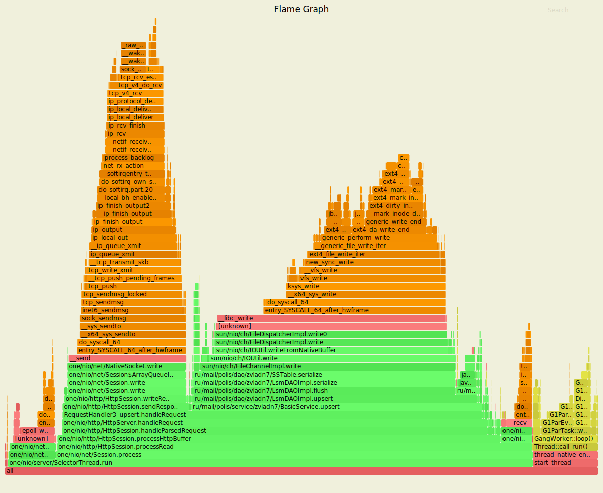
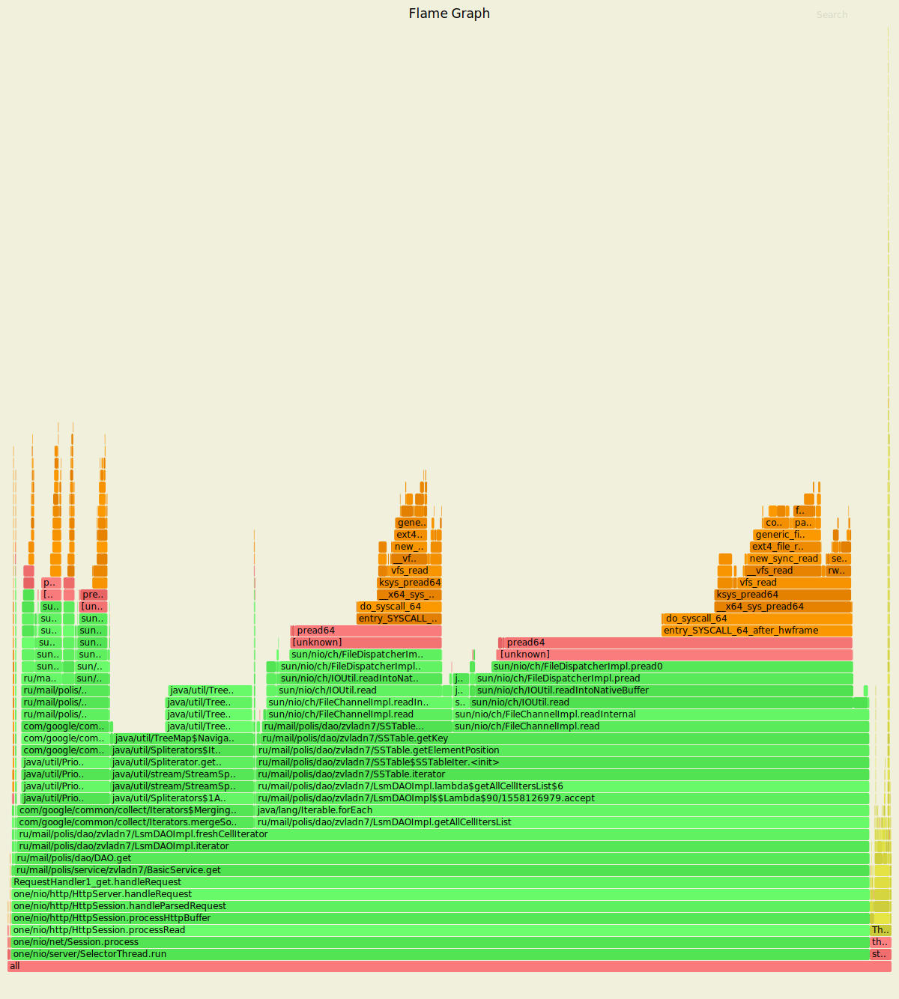

# Нагрузочное тестирование с помощью wrk2

Параметры запуска тестов:
1. Thread - 1
2. Connection - 1
3. Requests per second - 20000
4. Duration - 60s

### 1) Тестирование PUT запросов

`wrk2 -t1 -c1 -R20000 -d60s -s wrk/put.lua --latency  http://localhost:8080`

Running 1m test @ http://localhost:8080
  1 threads and 1 connections
  Thread calibration: mean lat.: 0.770ms, rate sampling interval: 10ms

      Thread Stats   Avg      Stdev     Max   +/- Stdev
        Latency   324.44ms  502.04ms   2.34s    83.67%
        Req/Sec    20.89k    13.87k   48.78k    57.89%
  Latency Distribution (HdrHistogram - Recorded Latency)
 
     50.000%    1.34ms
     75.000%  569.34ms
     90.000%    1.05s 
     99.000%    2.12s 
     99.900%    2.33s 
     99.990%    2.34s 
     99.999%    2.34s 
    100.000%    2.34s 

  Detailed Percentile spectrum:
       Value   Percentile   TotalCount 1/(1-Percentile)

       0.020     0.000000            3         1.00
       0.267     0.100000        99234         1.11
       0.501     0.200000       198254         1.25
       0.728     0.300000       296994         1.43
       0.947     0.400000       396008         1.67
       1.336     0.500000       494704         2.00
       2.389     0.550000       544161         2.22
     123.519     0.600000       593638         2.50
     273.407     0.650000       643098         2.86
     423.679     0.700000       692647         3.33
     569.343     0.750000       742094         4.00
     639.999     0.775000       766827         4.44
     714.239     0.800000       791512         5.00
     791.039     0.825000       816284         5.71
     869.887     0.850000       841067         6.67
     953.343     0.875000       865753         8.00
     997.887     0.887500       878180         8.89
    1048.575     0.900000       890479        10.00
    1103.871     0.912500       902959        11.43
    1173.503     0.925000       915322        13.33
    1275.903     0.937500       927647        16.00
    1328.127     0.943750       933762        17.78
    1389.567     0.950000       939921        20.00
    1470.463     0.956250       946149        22.86
    1548.287     0.962500       952335        26.67
    1625.087     0.968750       958531        32.00
    1672.191     0.971875       961592        35.56
    1753.087     0.975000       964670        40.00
    1835.007     0.978125       967770        45.71
    1914.879     0.981250       970853        53.33
    1993.727     0.984375       973922        64.00
    2030.591     0.985938       975481        71.11
    2067.455     0.987500       977048        80.00
    2097.151     0.989062       978563        91.43
    2138.111     0.990625       980170       106.67
    2174.975     0.992188       981714       128.00
    2195.455     0.992969       982491       142.22
    2213.887     0.993750       983251       160.00
    2234.367     0.994531       984043       182.86
    2252.799     0.995313       984751       213.33
    2271.231     0.996094       985567       256.00
    2281.471     0.996484       985955       284.44
    2291.711     0.996875       986342       320.00
    2301.951     0.997266       986748       365.71
    2310.143     0.997656       987082       426.67
    2316.287     0.998047       987511       512.00
    2318.335     0.998242       987765       568.89
    2320.383     0.998437       987891       640.00
    2324.479     0.998633       988140       731.43
    2326.527     0.998828       988263       853.33
    2330.623     0.999023       988516      1024.00
    2330.623     0.999121       988516      1137.78
    2332.671     0.999219       988639      1280.00
    2334.719     0.999316       988762      1462.86
    2336.767     0.999414       988885      1706.67
    2338.815     0.999512       989019      2048.00
    2338.815     0.999561       989019      2275.56
    2338.815     0.999609       989019      2560.00
    2340.863     0.999658       989157      2925.71
    2340.863     0.999707       989157      3413.33
    2340.863     0.999756       989157      4096.00
    2342.911     0.999780       989296      4551.11
    2342.911     0.999805       989296      5120.00
    2342.911     0.999829       989296      5851.43
    2342.911     0.999854       989296      6826.67
    2342.911     0.999878       989296      8192.00
    2342.911     0.999890       989296      9102.22
    2342.911     0.999902       989296     10240.00
    2342.911     0.999915       989296     11702.86
    2344.959     0.999927       989379     13653.33
    2344.959     1.000000       989379          inf

    [Mean    =      324.440, StdDeviation   =      502.044]
    [Max     =     2342.912, Total count    =       989379]
    [Buckets =           27, SubBuckets     =         2048]
----------------------------------------------------------
  1189474 requests in 1.00m, 76.00MB read

    Requests/sec:  19821.96
    Transfer/sec:    1.27MB

#### Результаты профилирования async-profiler (CPU): 

Анализ: 
 - Обработка запроса: 79.41%
 - Запись в сокет: 25.03%
 - Чтение из сокета: 6.76%
 - Вставка в DAO: 39.39%, причем 34.32% из них - это flush на диск
 
#### Результаты профилирования async-profiler (ALLOC):
 
`wrk2 -t1 -c1 -R20000 -d60s -s wrk/put.lua --latency  http://localhost:8080`

Running 1m test @ http://localhost:8080
  1 threads and 1 connections
  Thread calibration: mean lat.: 1.181ms, rate sampling interval: 10ms
  
    Thread Stats   Avg      Stdev     Max   +/- Stdev
      Latency   354.56ms  533.74ms   2.48s    84.35%
      Req/Sec    20.91k    13.89k   47.22k    56.52%
  Latency Distribution (HdrHistogram - Recorded Latency)

     50.000%    1.57ms
     75.000%  614.40ms
     90.000%    1.10s 
     99.000%    2.28s 
     99.900%    2.47s 
     99.990%    2.48s 
     99.999%    2.48s 
    100.000%    2.48s 

  Detailed Percentile spectrum:
       Value   Percentile   TotalCount 1/(1-Percentile)

       0.020     0.000000            1         1.00
       0.274     0.100000        99192         1.11
       0.514     0.200000       198193         1.25
       0.749     0.300000       297104         1.43
       0.977     0.400000       396128         1.67
       1.574     0.500000       494729         2.00
      58.815     0.550000       544169         2.22
     199.935     0.600000       593668         2.50
     334.079     0.650000       643136         2.86
     473.087     0.700000       692614         3.33
     614.399     0.750000       742208         4.00
     687.103     0.775000       766876         4.44
     760.319     0.800000       791528         5.00
     833.023     0.825000       816403         5.71
     909.823     0.850000       840978         6.67
     992.767     0.875000       865789         8.00
    1041.919     0.887500       878089         8.89
    1095.679     0.900000       890509        10.00
    1161.215     0.912500       902907        11.43
    1261.567     0.925000       915224        13.33
    1359.871     0.937500       927603        16.00
    1433.599     0.943750       933785        17.78
    1513.471     0.950000       939979        20.00
    1593.343     0.956250       946134        22.86
    1673.215     0.962500       952349        26.67
    1757.183     0.968750       958487        32.00
    1821.695     0.971875       961580        35.56
    1901.567     0.975000       964673        40.00
    1979.391     0.978125       967751        45.71
    2059.263     0.981250       970880        53.33
    2136.063     0.984375       973926        64.00
    2177.023     0.985938       975527        71.11
    2215.935     0.987500       977025        80.00
    2256.895     0.989062       978596        91.43
    2297.855     0.990625       980178       106.67
    2328.575     0.992188       981747       128.00
    2338.815     0.992969       982502       142.22
    2353.151     0.993750       983225       160.00
    2369.535     0.994531       983991       182.86
    2390.015     0.995313       984800       213.33
    2408.447     0.996094       985522       256.00
    2418.687     0.996484       985928       284.44
    2428.927     0.996875       986328       320.00
    2439.167     0.997266       986732       365.71
    2449.407     0.997656       987132       426.67
    2457.599     0.998047       987471       512.00
    2461.695     0.998242       987714       568.89
    2465.791     0.998437       987984       640.00
    2467.839     0.998633       988121       731.43
    2469.887     0.998828       988343       853.33
    2471.935     0.999023       988659      1024.00
    2471.935     0.999121       988659      1137.78
    2471.935     0.999219       988659      1280.00
    2473.983     0.999316       988943      1462.86
    2473.983     0.999414       988943      1706.67
    2473.983     0.999512       988943      2048.00
    2476.031     0.999561       989125      2275.56
    2476.031     0.999609       989125      2560.00
    2476.031     0.999658       989125      2925.71
    2476.031     0.999707       989125      3413.33
    2478.079     0.999756       989339      4096.00
    2478.079     0.999780       989339      4551.11
    2478.079     0.999805       989339      5120.00
    2478.079     0.999829       989339      5851.43
    2478.079     0.999854       989339      6826.67
    2478.079     0.999878       989339      8192.00
    2478.079     0.999890       989339      9102.22
    2478.079     0.999902       989339     10240.00
    2478.079     0.999915       989339     11702.86
    2478.079     0.999927       989339     13653.33
    2478.079     0.999939       989339     16384.00
    2478.079     0.999945       989339     18204.44
    2478.079     0.999951       989339     20480.00
    2480.127     0.999957       989384     23405.71
    2480.127     1.000000       989384          inf

    [Mean    =      354.557, StdDeviation   =      533.735]
    [Max     =     2478.080, Total count    =       989384]
    [Buckets =           27, SubBuckets     =         2048]
----------------------------------------------------------
  1189474 requests in 1.00m, 76.00MB read

    Requests/sec:  19822.34
    Transfer/sec:      1.27MB

#### Результаты профилирования async-profiler (ALLOC): 

Анализ:
 - HttpBuffer занимает - 100%
 - Service занимает - 49.77%
 - Dao.upsert занимает - 33.83%
 - Response - 5.17%
 
В основном память уходит на создании байтовых массивов и буфферов: для ключа и значение, при обработке запроса, 
а также для того, чтобы записать объекты на диск при flush'e

### 2) Тестирование GET запросов

`wrk2 -t1 -c1 -R2000 -d30s -s wrk/get.lua --latency  http://localhost:8080`

Running 30s test @ http://localhost:8080
  1 threads and 1 connections
  Thread calibration: mean lat.: 4467.315ms, rate sampling interval: 15523ms
  
    Thread Stats   Avg      Stdev     Max   +/- Stdev
      Latency    17.03s     4.93s   25.66s    57.52%
      Req/Sec   291.00      0.00   291.00    100.00%
 
  Latency Distribution (HdrHistogram - Recorded Latency)
    
     50.000%   16.97s 
     75.000%   21.36s 
     90.000%   23.97s 
     99.000%   25.51s 
     99.900%   25.66s 
     99.990%   25.67s 
     99.999%   25.67s 
    100.000%   25.67s 

  Detailed Percentile spectrum:
      
         Value   Percentile   TotalCount 1/(1-Percentile)
        8585.215     0.000000            1         1.00
       10289.151     0.100000          584         1.11
       11952.127     0.200000         1165         1.25
       13606.911     0.300000         1745         1.43
       15261.695     0.400000         2326         1.67
       16973.823     0.500000         2910         2.00
       17793.023     0.550000         3200         2.22
       18612.223     0.600000         3489         2.50
       19447.807     0.650000         3783         2.86
       20381.695     0.700000         4072         3.33
       21364.735     0.750000         4362         4.00
       21774.335     0.775000         4507         4.44
       22233.087     0.800000         4652         5.00
       22659.071     0.825000         4802         5.71
       23052.287     0.850000         4943         6.67
       23527.423     0.875000         5090         8.00
       23773.183     0.887500         5164         8.89
       23969.791     0.900000         5233        10.00
       24182.783     0.912500         5310        11.43
       24379.391     0.925000         5378        13.33
       24592.383     0.937500         5453        16.00
       24690.687     0.943750         5487        17.78
       24838.143     0.950000         5528        20.00
       24936.447     0.956250         5561        22.86
       25034.751     0.962500         5596        26.67
       25149.439     0.968750         5636        32.00
       25198.591     0.971875         5654        35.56
       25247.743     0.975000         5671        40.00
       25296.895     0.978125         5687        45.71
       25362.431     0.981250         5708        53.33
       25411.583     0.984375         5726        64.00
       25444.351     0.985938         5737        71.11
       25460.735     0.987500         5743        80.00
       25493.503     0.989062         5753        91.43
       25526.271     0.990625         5765       106.67
       25542.655     0.992188         5771       128.00
       25559.039     0.992969         5776       142.22
       25575.423     0.993750         5781       160.00
       25591.807     0.994531         5787       182.86
       25591.807     0.995313         5787       213.33
       25608.191     0.996094         5793       256.00
       25624.575     0.996484         5798       284.44
       25624.575     0.996875         5798       320.00
       25640.959     0.997266         5804       365.71
       25640.959     0.997656         5804       426.67
       25640.959     0.998047         5804       512.00
       25640.959     0.998242         5804       568.89
       25657.343     0.998437         5809       640.00
       25657.343     0.998633         5809       731.43
       25657.343     0.998828         5809       853.33
       25657.343     0.999023         5809      1024.00
       25657.343     0.999121         5809      1137.78
       25673.727     0.999219         5814      1280.00
       25673.727     1.000000         5814          inf
     
    [Mean    =    17033.230, StdDeviation   =     4926.968]
    [Max     =    25657.344, Total count    =         5814]
    [Buckets =           27, SubBuckets     =         2048]
----------------------------------------------------------
  8656 requests in 30.00s, 615.02KB read
    
    Requests/sec:    288.52
    Transfer/sec:     20.50KB

#### Результаты профилирования async-profiler (CPU): 

Анализ: 
 - Практически все время занимает чтение из DAO, что является логичным, поскольку поиск по ключу - это чтение
 из файла, для прочтения которого необходимо обратиться к памяти и выделить наиболее `свежие` данные.
 - Фактически, чтение из файла занимает - 68.91% времени.
 - 26.82% времени тратится на инициализацию merge iterator'а

#### Результаты профилирования async-profiler (ALLOC):

`wrk2 -t1 -c1 -R2000 -d30s -s wrk/get.lua --latency  http://localhost:8080`

Running 30s test @ http://localhost:8080
  1 threads and 1 connections
  Thread calibration: mean lat.: 4328.488ms, rate sampling interval: 15441ms
  
    Thread Stats   Avg      Stdev     Max   +/- Stdev
      Latency    17.11s     4.91s   25.64s    57.62%
      Req/Sec   291.00      0.00   291.00    100.00%
      
  Latency Distribution (HdrHistogram - Recorded Latency)

     50.000%   17.14s 
     75.000%   21.36s 
     90.000%   23.87s 
     99.000%   25.48s 
     99.900%   25.64s 
     99.990%   25.66s 
     99.999%   25.66s 
    100.000%   25.66s 

  Detailed Percentile spectrum:
      
          Value   Percentile   TotalCount 1/(1-Percentile)
        8568.831     0.000000            2         1.00
       10280.959     0.100000          583         1.11
       11968.511     0.200000         1164         1.25
       13713.407     0.300000         1744         1.43
       15458.303     0.400000         2325         1.67
       17137.663     0.500000         2906         2.00
       17989.631     0.550000         3199         2.22
       18841.599     0.600000         3490         2.50
       19660.799     0.650000         3776         2.86
       20529.151     0.700000         4070         3.33
       21364.735     0.750000         4359         4.00
       21790.719     0.775000         4504         4.44
       22200.319     0.800000         4648         5.00
       22642.687     0.825000         4797         5.71
       23052.287     0.850000         4941         6.67
       23461.887     0.875000         5087         8.00
       23658.495     0.887500         5157         8.89
       23871.487     0.900000         5232        10.00
       24068.095     0.912500         5302        11.43
       24297.471     0.925000         5374        13.33
       24526.847     0.937500         5448        16.00
       24657.919     0.943750         5483        17.78
       24772.607     0.950000         5523        20.00
       24887.295     0.956250         5557        22.86
       25001.983     0.962500         5593        26.67
       25100.287     0.968750         5628        32.00
       25165.823     0.971875         5650        35.56
       25214.975     0.975000         5664        40.00
       25280.511     0.978125         5684        45.71
       25329.663     0.981250         5702        53.33
       25378.815     0.984375         5720        64.00
       25411.583     0.985938         5730        71.11
       25444.351     0.987500         5742        80.00
       25460.735     0.989062         5747        91.43
       25493.503     0.990625         5757       106.67
       25526.271     0.992188         5767       128.00
       25542.655     0.992969         5772       142.22
       25559.039     0.993750         5778       160.00
       25559.039     0.994531         5778       182.86
       25575.423     0.995313         5783       213.33
       25591.807     0.996094         5789       256.00
       25591.807     0.996484         5789       284.44
       25608.191     0.996875         5794       320.00
       25608.191     0.997266         5794       365.71
       25624.575     0.997656         5800       426.67
       25624.575     0.998047         5800       512.00
       25624.575     0.998242         5800       568.89
       25624.575     0.998437         5800       640.00
       25640.959     0.998633         5806       731.43
       25640.959     0.998828         5806       853.33
       25640.959     0.999023         5806      1024.00
       25640.959     0.999121         5806      1137.78
       25640.959     0.999219         5806      1280.00
       25640.959     0.999316         5806      1462.86
       25640.959     0.999414         5806      1706.67
       25657.343     0.999512         5809      2048.00
       25657.343     1.000000         5809          inf
    
    
    [Mean    =    17107.923, StdDeviation   =     4913.839]
    [Max     =    25640.960, Total count    =         5809]
    [Buckets =           27, SubBuckets     =         2048]
  8696 requests in 30.00s, 617.87KB read
  
    Requests/sec:    289.87
    Transfer/sec:     20.60KB
#### Результаты профилирования async-profiler (ALLOC): 

Анализ:
 - HttpBuffer занимает - 100%
 - Dao.get занимает - 99.75%
 - Response - 0.03%
 
В основном память уходит на создании байтовых массивов и буфферов: для ключа и значение, при обработке запроса, 
а также для того, чтобы прочитать объекты из файлов.
