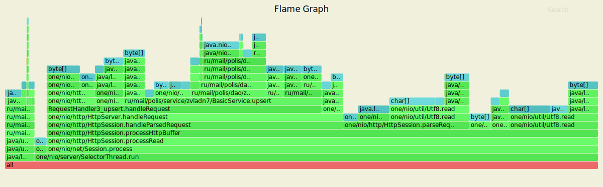
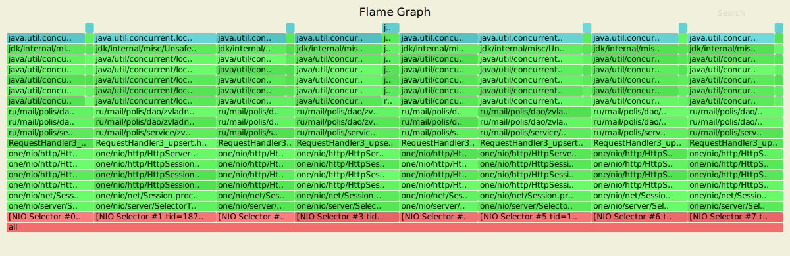
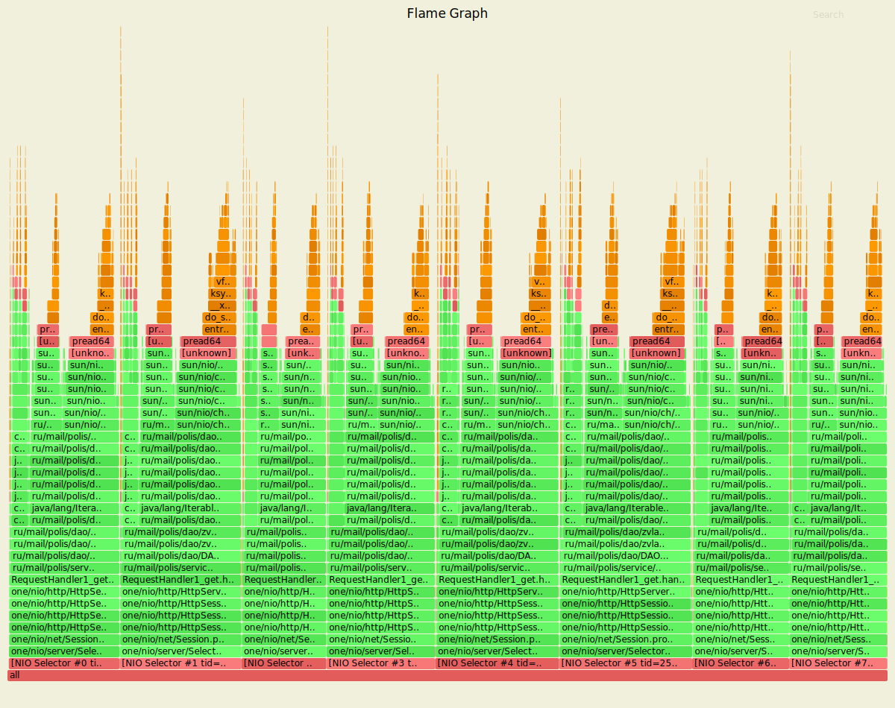

# Нагрузочное тестирование с помощью wrk2

### 1) Тестирование PUT запросов

Параметры запуска тестов:
1. Thread - 4
2. Connection - 64
3. Requests per second - 80000
4. Duration - 3m

`wrk2 -t4 -c64 -R80000 -d3m -s wrk/put.lua --latency  http://localhost:8080`

Running 3m test @ http://localhost:8080
  4 threads and 64 connections
      
      Thread calibration: mean lat.: 1.241ms, rate sampling interval: 10ms
      Thread calibration: mean lat.: 1.230ms, rate sampling interval: 10ms
      Thread calibration: mean lat.: 1.225ms, rate sampling interval: 10ms
      Thread calibration: mean lat.: 1.236ms, rate sampling interval: 10ms
      Thread Stats   Avg      Stdev     Max   +/- Stdev
        Latency     1.39ms    1.41ms  65.92ms   94.76%
        Req/Sec    21.12k     2.54k   43.00k    79.76%
  Latency Distribution (HdrHistogram - Recorded Latency)
      
     50.000%    1.19ms
     75.000%    1.70ms
     90.000%    2.28ms
     99.000%    6.23ms
     99.900%   17.95ms
     99.990%   37.63ms
     99.999%   56.16ms
    100.000%   65.98ms

  Detailed Percentile spectrum:
       Value   Percentile   TotalCount 1/(1-Percentile)

       0.021     0.000000            1         1.00
       0.395     0.100000      1361814         1.11
       0.622     0.200000      2723656         1.25
       0.823     0.300000      4079895         1.43
       1.008     0.400000      5444464         1.67
       1.187     0.500000      6798451         2.00
       1.279     0.550000      7483160         2.22
       1.372     0.600000      8156680         2.50
       1.472     0.650000      8839866         2.86
       1.581     0.700000      9520539         3.33
       1.704     0.750000     10199447         4.00
       1.773     0.775000     10538338         4.44
       1.849     0.800000     10879160         5.00
       1.933     0.825000     11217883         5.71
       2.028     0.850000     11557706         6.67
       2.139     0.875000     11895585         8.00
       2.205     0.887500     12067115         8.89
       2.281     0.900000     12237331        10.00
       2.371     0.912500     12407180        11.43
       2.483     0.925000     12575441        13.33
       2.631     0.937500     12744223        16.00
       2.727     0.943750     12829019        17.78
       2.845     0.950000     12914298        20.00
       2.995     0.956250     12999264        22.86
       3.195     0.962500     13084140        26.67
       3.471     0.968750     13169104        32.00
       3.653     0.971875     13211525        35.56
       3.875     0.975000     13253999        40.00
       4.155     0.978125     13296792        45.71
       4.503     0.981250     13338920        53.33
       4.955     0.984375     13381277        64.00
       5.231     0.985938     13402476        71.11
       5.563     0.987500     13423769        80.00
       5.955     0.989062     13445022        91.43
       6.439     0.990625     13466177       106.67
       7.043     0.992188     13487400       128.00
       7.419     0.992969     13498049       142.22
       7.859     0.993750     13508648       160.00
       8.399     0.994531     13519263       182.86
       9.079     0.995313     13529925       213.33
       9.975     0.996094     13540555       256.00
      10.519     0.996484     13545891       284.44
      11.143     0.996875     13551128       320.00
      11.879     0.997266     13556474       365.71
      12.767     0.997656     13561757       426.67
      13.871     0.998047     13567054       512.00
      14.495     0.998242     13569707       568.89
      15.191     0.998437     13572368       640.00
      15.967     0.998633     13575011       731.43
      16.959     0.998828     13577684       853.33
      18.095     0.999023     13580322      1024.00
      18.799     0.999121     13581670      1137.78
      19.551     0.999219     13582998      1280.00
      20.447     0.999316     13584301      1462.86
      21.535     0.999414     13585633      1706.67
      22.783     0.999512     13586960      2048.00
      23.551     0.999561     13587633      2275.56
      24.431     0.999609     13588286      2560.00
      25.535     0.999658     13588954      2925.71
      26.847     0.999707     13589622      3413.33
      28.575     0.999756     13590277      4096.00
      29.679     0.999780     13590609      4551.11
      30.943     0.999805     13590944      5120.00
      32.351     0.999829     13591272      5851.43
      33.919     0.999854     13591601      6826.67
      35.615     0.999878     13591938      8192.00
      36.639     0.999890     13592101      9102.22
      37.919     0.999902     13592267     10240.00
      39.423     0.999915     13592433     11702.86
      40.927     0.999927     13592597     13653.33
      42.367     0.999939     13592763     16384.00
      43.071     0.999945     13592854     18204.44
      43.807     0.999951     13592929     20480.00
      44.799     0.999957     13593015     23405.71
      46.079     0.999963     13593097     27306.67
      47.711     0.999969     13593179     32768.00
      48.799     0.999973     13593220     36408.89
      50.175     0.999976     13593261     40960.00
      51.071     0.999979     13593302     46811.43
      51.839     0.999982     13593346     54613.33
      52.671     0.999985     13593385     65536.00
      53.407     0.999986     13593407     72817.78
      54.303     0.999988     13593429     81920.00
      55.807     0.999989     13593447     93622.86
      56.671     0.999991     13593468    109226.67
      57.375     0.999992     13593489    131072.00
      57.759     0.999993     13593499    145635.56
      58.207     0.999994     13593510    163840.00
      58.687     0.999995     13593520    187245.71
      59.199     0.999995     13593530    218453.33
      59.743     0.999996     13593541    262144.00
      59.903     0.999997     13593546    291271.11
      60.031     0.999997     13593551    327680.00
      60.287     0.999997     13593557    374491.43
      60.511     0.999998     13593563    436906.67
      60.735     0.999998     13593567    524288.00
      60.895     0.999998     13593570    582542.22
      61.023     0.999998     13593573    655360.00
      61.183     0.999999     13593574    748982.86
      61.247     0.999999     13593577    873813.33
      61.791     0.999999     13593580   1048576.00
      62.143     0.999999     13593581   1165084.44
      62.591     0.999999     13593582   1310720.00
      63.007     0.999999     13593583   1497965.71
      63.071     0.999999     13593585   1747626.67
      63.519     1.000000     13593586   2097152.00
      64.031     1.000000     13593587   2330168.89
      64.031     1.000000     13593587   2621440.00
      64.511     1.000000     13593588   2995931.43
      64.959     1.000000     13593589   3495253.33
      64.959     1.000000     13593589   4194304.00
      65.439     1.000000     13593590   4660337.78
      65.439     1.000000     13593590   5242880.00
      65.439     1.000000     13593590   5991862.86
      65.727     1.000000     13593591   6990506.67
      65.727     1.000000     13593591   8388608.00
      65.727     1.000000     13593591   9320675.55
      65.727     1.000000     13593591  10485760.00
      65.727     1.000000     13593591  11983725.71
      65.983     1.000000     13593592  13981013.34
      65.983     1.000000     13593592          inf
      
    [Mean    =        1.389, StdDeviation   =        1.407]
    [Max     =       65.920, Total count    =     13593592]
    [Buckets =           27, SubBuckets     =         2048]
----------------------------------------------------------
  14396929 requests in 3.00m, 0.90GB read
    
    Requests/sec:  79982.98
    Transfer/sec:      5.11MB

#### Результаты профилирования async-profiler (CPU): 

`./profiler.sh -d 20 -e cpu -f ./hw2/cpu_put_hw2.svg 18735`

Анализ: 
 - Обработка запроса: 67.71%, где:
    - Чтение из сокета: 8.48%
    - handleRequest: 53.05%, где:
        - Запись в сокет: 31.16%
        - BasicService.upsert: 16.5%, из которых 12.65 вставка в DAO
 Из этого можно сделать вывод, что 53.05% нагрузки на CPU приходится на обработку запроса,
 что блокирует наши Selector'ы и снижает пропускную способность нашего сервера. Логичным
 решением является вынести обработку запросов в отдельный пул потоков(что и будет сделано в 
 3 этапе)
 - 9.51% - занимает блокировка Selector'ов
 - Flush в пуле потоков ExecutorService - 17.14%

Соотвественно видно, что засчет переноса flush'a в пул потоков, мы частично сняли нагрузку с 
Selector'ов, то есть уменьшили время их блокировки, а значит увеличили пропускную способность.

#### Результаты профилирования async-profiler (ALLOC): 

`./profiler.sh -d 20 -e alloc -f ./hw2/alloc_put_hw2.svg 18735`

Анализ:
 - Выделение при обработки запроса занимает 92.97%, где:
    - handleParsedRequest - 50%, где:
        - BasicService.upsert занимает - 33.46%(DAO.upsert - 12.75%)
        - Response - 6.16%
        - sendResponse - 8.13%
    - parseRequest - 21.27%
        - Request - 5.26%
 - Flush - 4.97%

Большая часть памяти выделяется для создания байтовых буферов, для парса, создания и обработки запросов.
Причем работа Service и DAO занимает около 40%. Также хорошо, что flush происходит в пуле потоков, что
хоть незначительно, но все же снижает количество аллокаций, которые производятся при обработке 
запроса Selector'ом. В перспективе понятно, что количество аллокаций при обработке можно сократить
еще больше за счет переноса выполнения запросов в отдельный пул потоков.

#### Результаты профилирования async-profiler (LOCK): 

`./profiler.sh -d 20 -e lock -f ./hw2/lock_put_hw2.svg 18735`

Анализ:
 - ReentrantReadWriteLock.ReadLock - 97.73%
 - ReentrantReadWriteLock.WriteLock - 2.27%

Ожидание ReentrantReadWriteLock.ReadLock, происходит при flush'e очередного `memory table` на диск.
Ожидание ReentrantReadWriteLock.WriteLock, происходит при желании записать на диск, но, когда в этот момент в `memory table` 
вставляют, удаляют, обновляют значения другие потоки.

Также было проведено профилирования с использования ключика `-t` у `async-profiler`.
Где видно, что результаты работы различных селекторов являются приблизительно одинаковыми.
Разница заключается лишь в том, на какой из Selector'ов приходится больше операций `upsert`, 
которые в итоге завершаются `flush'ем` на диск.

#### Результаты профилирования async-profiler с -t (CPU): 

#### Результаты профилирования async-profiler c -t (ALLOC): 

#### Результаты профилирования async-profiler c -t (LOCK): 

### 2) Тестирование GET запросов

Параметры запуска тестов:
1. Thread - 4
2. Connection - 64
3. Requests per second - 2000
4. Duration - 3m

`wrk2 -t4 -c64 -R2000 -d60m -s wrk/get.lua --latency  http://localhost:8080`

Running 3m test @ http://localhost:8080
  4 threads and 64 connections
      
      Thread calibration: mean lat.: 2.690ms, rate sampling interval: 10ms
      Thread calibration: mean lat.: 2.823ms, rate sampling interval: 10ms
      Thread calibration: mean lat.: 2.747ms, rate sampling interval: 10ms
      Thread calibration: mean lat.: 2.714ms, rate sampling interval: 10ms
      Thread Stats   Avg      Stdev     Max   +/- Stdev
        Latency     4.75ms   14.85ms 367.10ms   95.67%
        Req/Sec   527.20    145.35     2.00k    82.87%
  Latency Distribution (HdrHistogram - Recorded Latency)
      
     50.000%    2.13ms
     75.000%    2.64ms
     90.000%    3.90ms
     99.000%   60.48ms
     99.900%  220.93ms
     99.990%  331.26ms
     99.999%  363.01ms
    100.000%  367.36ms

  Detailed Percentile spectrum:
       Value   Percentile   TotalCount 1/(1-Percentile)

       0.894     0.000000            1         1.00
       1.423     0.100000        34101         1.11
       1.643     0.200000        68155         1.25
       1.821     0.300000       102008         1.43
       1.980     0.400000       136092         1.67
       2.131     0.500000       170310         2.00
       2.211     0.550000       186944         2.22
       2.301     0.600000       203977         2.50
       2.397     0.650000       221145         2.86
       2.505     0.700000       238021         3.33
       2.639     0.750000       255028         4.00
       2.719     0.775000       263471         4.44
       2.813     0.800000       271929         5.00
       2.933     0.825000       280465         5.71
       3.097     0.850000       288962         6.67
       3.367     0.875000       297404         8.00
       3.577     0.887500       301635         8.89
       3.901     0.900000       305858        10.00
       4.483     0.912500       310124        11.43
       6.455     0.925000       314358        13.33
      11.039     0.937500       318603        16.00
      13.711     0.943750       320727        17.78
      16.415     0.950000       322856        20.00
      19.375     0.956250       324974        22.86
      22.863     0.962500       327104        26.67
      27.199     0.968750       329226        32.00
      29.999     0.971875       330283        35.56
      33.023     0.975000       331352        40.00
      36.223     0.978125       332410        45.71
      40.383     0.981250       333469        53.33
      45.567     0.984375       334536        64.00
      48.671     0.985938       335063        71.11
      52.447     0.987500       335592        80.00
      57.247     0.989062       336123        91.43
      63.551     0.990625       336655       106.67
      73.663     0.992188       337185       128.00
      80.511     0.992969       337454       142.22
      86.719     0.993750       337717       160.00
      94.079     0.994531       337982       182.86
     102.847     0.995313       338248       213.33
     114.879     0.996094       338513       256.00
     123.839     0.996484       338646       284.44
     131.711     0.996875       338781       320.00
     141.183     0.997266       338911       365.71
     152.575     0.997656       339044       426.67
     165.375     0.998047       339177       512.00
     172.927     0.998242       339244       568.89
     183.295     0.998437       339309       640.00
     195.199     0.998633       339376       731.43
     209.151     0.998828       339442       853.33
     223.871     0.999023       339509      1024.00
     233.087     0.999121       339543      1137.78
     240.127     0.999219       339575      1280.00
     248.447     0.999316       339608      1462.86
     258.175     0.999414       339641      1706.67
     268.287     0.999512       339675      2048.00
     272.383     0.999561       339693      2275.56
     278.783     0.999609       339708      2560.00
     284.159     0.999658       339724      2925.71
     291.583     0.999707       339741      3413.33
     298.495     0.999756       339758      4096.00
     302.847     0.999780       339766      4551.11
     306.943     0.999805       339774      5120.00
     312.063     0.999829       339784      5851.43
     318.207     0.999854       339791      6826.67
     324.607     0.999878       339799      8192.00
     329.727     0.999890       339803      9102.22
     331.519     0.999902       339807     10240.00
     336.383     0.999915       339812     11702.86
     340.479     0.999927       339816     13653.33
     344.063     0.999939       339820     16384.00
     345.599     0.999945       339823     18204.44
     347.647     0.999951       339824     20480.00
     349.183     0.999957       339826     23405.71
     350.719     0.999963       339828     27306.67
     353.279     0.999969       339830     32768.00
     356.351     0.999973       339831     36408.89
     356.607     0.999976       339832     40960.00
     358.399     0.999979       339833     46811.43
     359.167     0.999982       339834     54613.33
     359.679     0.999985       339835     65536.00
     360.447     0.999986       339836     72817.78
     360.447     0.999988       339836     81920.00
     363.007     0.999989       339837     93622.86
     363.007     0.999991       339837    109226.67
     365.055     0.999992       339838    131072.00
     365.055     0.999993       339838    145635.56
     365.055     0.999994       339838    163840.00
     366.591     0.999995       339839    187245.71
     366.591     0.999995       339839    218453.33
     366.591     0.999996       339839    262144.00
     366.591     0.999997       339839    291271.11
     366.591     0.999997       339839    327680.00
     367.359     0.999997       339840    374491.43
     367.359     1.000000       339840          inf
    [Mean    =        4.755, StdDeviation   =       14.846]
    [Max     =      367.104, Total count    =       339840]
    [Buckets =           27, SubBuckets     =         2048]
----------------------------------------------------------
  359952 requests in 3.00m, 25.59MB read

    Requests/sec:   1999.73
    Transfer/sec:    145.59KB

#### Результаты профилирования async-profiler (CPU): 

`./profiler.sh -d 20 -e cpu -f ./hw2/get/cpu_get_hw2.svg 25055`

Анализ:
 - Обработка запроса: 99.23%:
    - DAO.get занимает(BasicService.get) - 97.25%
        - DAO.iterator занимает 96.43%
            - Merge различных iterator'ов занимает - 14.53%
            - getAllCellIters: 80.67%
                - 79.92% CPU тратится на то, чтобы бинарным поиском найти место в файле,
                  с которого нужно читать, из которых 26.65% - это чтение смещений из файла, 
                  и еще 52.92% чтение остальных данных
        - TransformIterator - 0.78%
 - NativeSelector.select - 0.42%
 
Видим, что процесс обработки запроса занимает практически все время работы CPU. Отсюда следует, что
мы блокируем наши Selector'ы на достаточно продолжительный промежуток времени, снижая пропускную способность
нашего сервера, о чем говорит количество GET запросов(2000) в секунду, которые мы можем обрабатывать(оно на порядок
меньше, чем при PUT запросах). Обусловленно это тем, что работа iterator'а занимает достаточно много времени,
так как необходимо смерджить все данные из файлов, а после еще и определить, какое значение является актуальным для
каждого ключа.

Следовательно, логичным решением для увеличения пропускной способности является перенос обработки запросов в отдельный
пул потоков, что сделано в следующем этапе, а также уменьшить количество файл, которые необходимо мерджить.
Последнее можно сделать за счёт переодического compaction'а. Попробуй это реализовать в последущих этапах.

#### Результаты профилирования async-profiler (ALLOC): 

`./profiler.sh -d 20 -e alloc -f ./hw2/get/alloc_get_hw2.svg 25055`

Анализ:
 - Обработка запроса: 99.09% (DAO.get - 98.07%), где: 
    - Iterator: 96.09%
        - Merge Iterator и его Priority Queue занимают - 19.82%
        - CollapseIter - 1.59%
        - getAllCellIters - 73.11%, при этом в основном память выделяется под байтовый буфер для 
            текущего ключа в бинарном поиске, где 51.95% выделяется под сам ключ, а 20.46% на смещение
            до него 
    - Transformed.iterator - 1.76%
 
 Из результатов профилирования видно, что как уже было сказано выше выделение памяти - это в основном создания
 байтовых буфером и обычных массивов. При этом можно заметить, что вся аллокация уходит на создание этих буферов
 при вызове iterator'a, при мердже, поиске по ключу и тд. Соответственно, как и при CPU анализе получаем, что
 будет выгодно переодически делать `compaction`
 
 #### Результаты профилирования async-profiler (LOCK): 
 
 `wrk2 -t4 -c16 -R2000 -d60s -s wrk/get.lua --latency  http://localhost:8080`

#### Результаты профилирования async-profiler (LOCK): 

Анализ:
 - DAO.get - 100%: 
    - Iterator: 95.33%
         - MergeIterator - 14.99%, Из `flame graph` видно, что блокировка происходит
         при вызове SSTable.get, где блокировкой является обращение к файлу.
         - CollapseIterator - 5.03%. (Аналогично)
         - getAllCellIters - 75.31%. Блокировки являются обращением к файлам, где 27.42% - это 
         блокировки при получении смещения на ключ, 47.89% - это остальное чтение из файла.
    - TransformedIterator - 4.67%. Аналогично обращение к файлу при SSTable.get
    
Из анализа видно, что все время занимают блокировки в файлах, что является логичным при GET запросах.
ReentrantReadWriteLock не появляется в `flame graph`, поскольку при чтении данных используется только 
readLock, который допускает одновременное ресурса, поскольку нет вызовов writeLock.lock(), так как это
происходит только при желании изменить данные.
 
Также было проведено профилирования с использования ключика `-t` у `async-profiler`.
Где видно, что результаты работы различных селекторов являются приблизительно одинаковыми.

#### Результаты профилирования async-profiler с -t (CPU): 

#### Результаты профилирования async-profiler c -t (ALLOC): 

#### Результаты профилирования async-profiler c -t (LOCK): 

