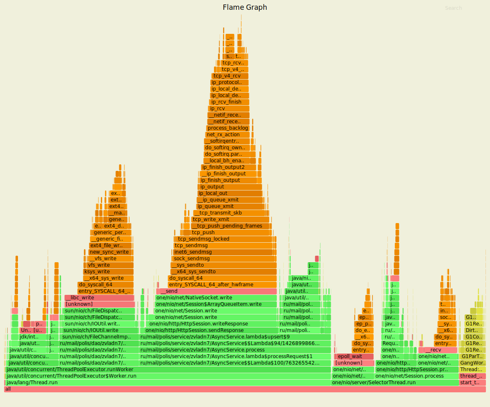
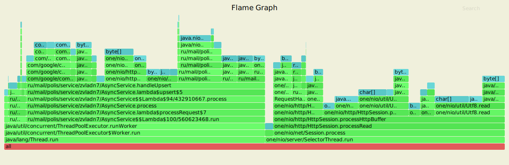
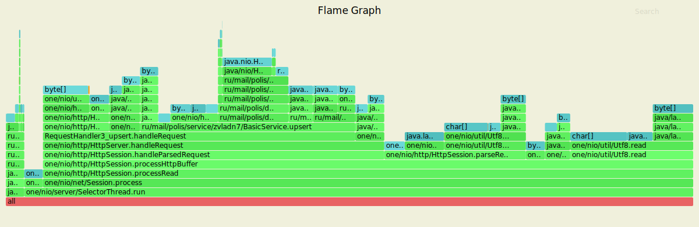
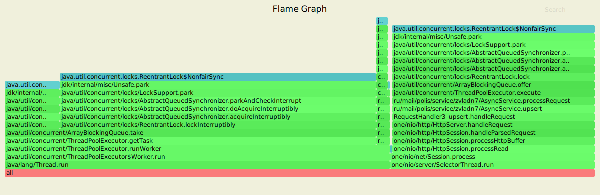
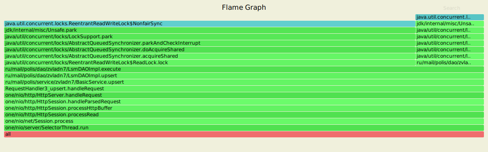
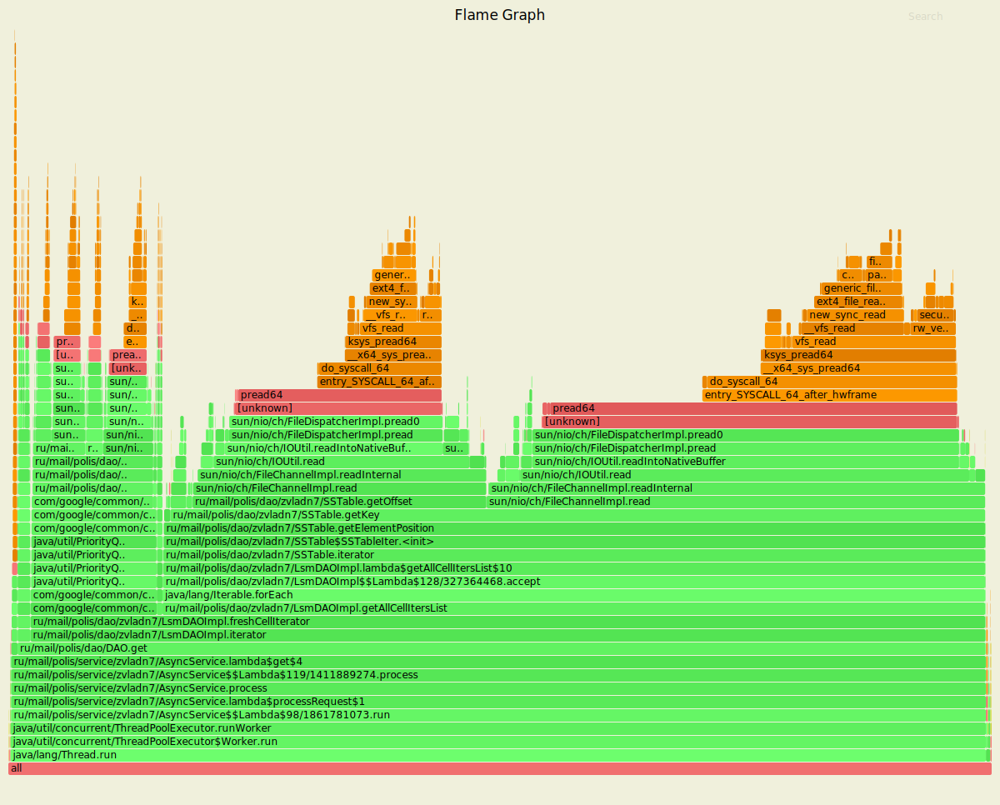
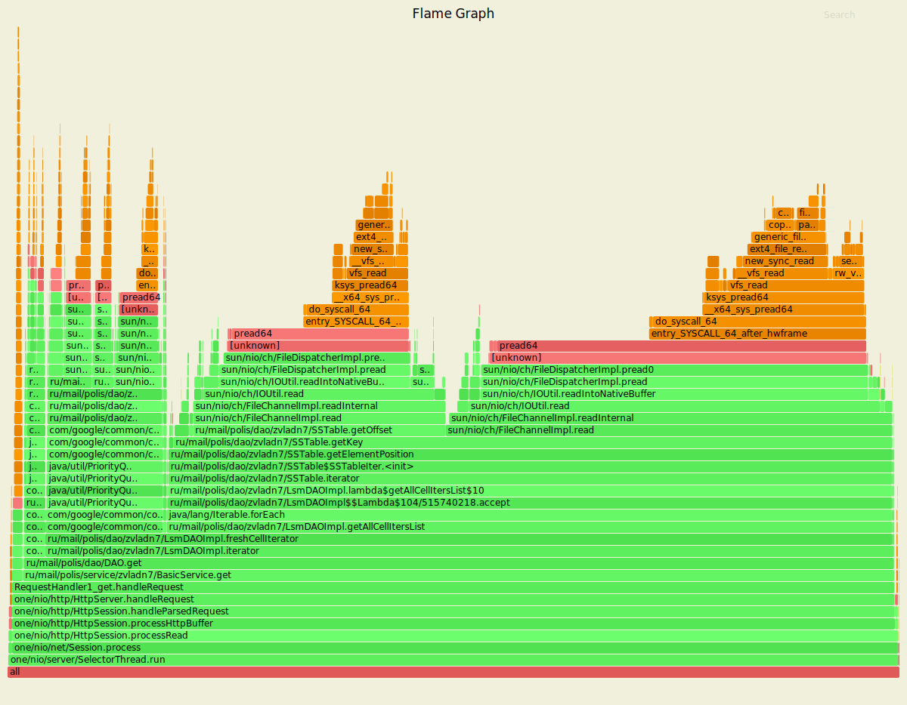
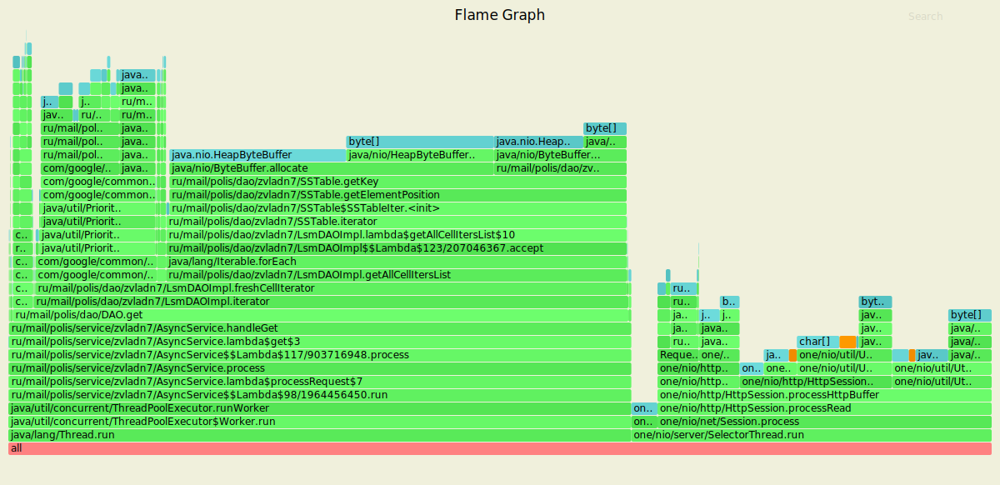
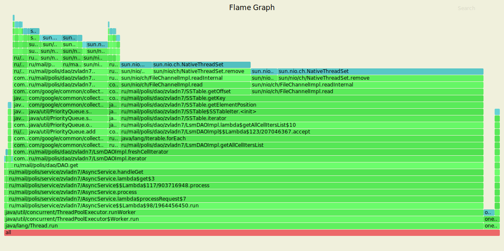
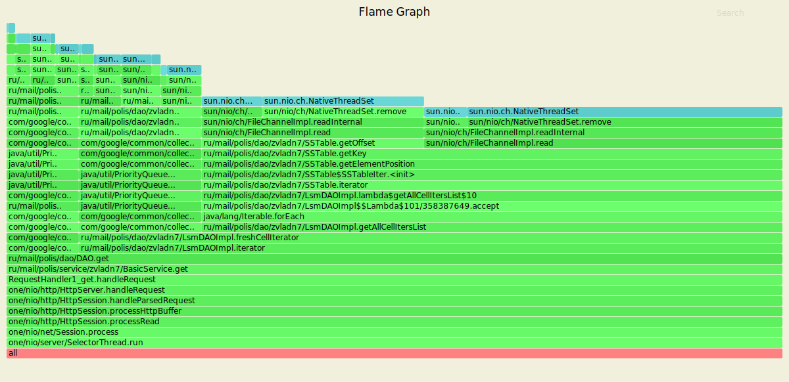

# Нагрузочное тестирование с помощью wrk2

### 1) Тестирование PUT запросов

Параметры запуска тестов:
1. Thread - 4
2. Connection - 64
3. Requests per second - 80000
4. Duration - 60s

`wrk2 -t4 -c64 -R80000 -d60s -s wrk/put.lua --latency  http://localhost:8080`

Running 1m test @ http://localhost:8080
  4 threads and 64 connections
  
      Thread calibration: mean lat.: 1.289ms, rate sampling interval: 10ms
      Thread calibration: mean lat.: 1.301ms, rate sampling interval: 10ms
      Thread calibration: mean lat.: 1.316ms, rate sampling interval: 10ms
      Thread calibration: mean lat.: 1.307ms, rate sampling interval: 10ms
      Thread Stats   Avg      Stdev     Max   +/- Stdev
        Latency     1.35ms    0.96ms  27.49ms   82.10%
        Req/Sec    21.11k     2.20k   40.11k    75.47%
  Latency Distribution (HdrHistogram - Recorded Latency)
  
     50.000%    1.21ms
     75.000%    1.74ms
     90.000%    2.29ms
     99.000%    4.80ms
     99.900%    9.88ms
     99.990%   18.30ms
     99.999%   24.03ms
    100.000%   27.50ms

  Detailed Percentile spectrum:
       Value   Percentile   TotalCount 1/(1-Percentile)

       0.029     0.000000            2         1.00
       0.425     0.100000       400655         1.11
       0.646     0.200000       800500         1.25
       0.842     0.300000      1199832         1.43
       1.026     0.400000      1599255         1.67
       1.208     0.500000      1996831         2.00
       1.302     0.550000      2196765         2.22
       1.399     0.600000      2397887         2.50
       1.501     0.650000      2596292         2.86
       1.613     0.700000      2796104         3.33
       1.739     0.750000      2996193         4.00
       1.808     0.775000      3096009         4.44
       1.883     0.800000      3195428         5.00
       1.966     0.825000      3295669         5.71
       2.059     0.850000      3396062         6.67
       2.165     0.875000      3495753         8.00
       2.223     0.887500      3544638         8.89
       2.291     0.900000      3595006        10.00
       2.367     0.912500      3644823        11.43
       2.459     0.925000      3695013        13.33
       2.571     0.937500      3744424        16.00
       2.639     0.943750      3769190        17.78
       2.721     0.950000      3794480        20.00
       2.817     0.956250      3819360        22.86
       2.939     0.962500      3844080        26.67
       3.103     0.968750      3868979        32.00
       3.211     0.971875      3881292        35.56
       3.347     0.975000      3893775        40.00
       3.515     0.978125      3906297        45.71
       3.731     0.981250      3918747        53.33
       4.013     0.984375      3931255        64.00
       4.191     0.985938      3937504        71.11
       4.399     0.987500      3943777        80.00
       4.635     0.989062      3949945        91.43
       4.915     0.990625      3956207       106.67
       5.255     0.992188      3962420       128.00
       5.447     0.992969      3965568       142.22
       5.663     0.993750      3968679       160.00
       5.911     0.994531      3971806       182.86
       6.199     0.995313      3974912       213.33
       6.547     0.996094      3978026       256.00
       6.755     0.996484      3979579       284.44
       6.995     0.996875      3981133       320.00
       7.275     0.997266      3982681       365.71
       7.607     0.997656      3984241       426.67
       8.031     0.998047      3985802       512.00
       8.279     0.998242      3986583       568.89
       8.591     0.998437      3987368       640.00
       8.935     0.998633      3988149       731.43
       9.367     0.998828      3988922       853.33
       9.951     0.999023      3989702      1024.00
      10.319     0.999121      3990099      1137.78
      10.751     0.999219      3990480      1280.00
      11.287     0.999316      3990877      1462.86
      11.863     0.999414      3991263      1706.67
      12.455     0.999512      3991653      2048.00
      12.839     0.999561      3991846      2275.56
      13.295     0.999609      3992040      2560.00
      13.911     0.999658      3992237      2925.71
      14.583     0.999707      3992432      3413.33
      15.335     0.999756      3992625      4096.00
      15.791     0.999780      3992725      4551.11
      16.255     0.999805      3992821      5120.00
      16.719     0.999829      3992918      5851.43
      17.183     0.999854      3993017      6826.67
      17.759     0.999878      3993114      8192.00
      18.079     0.999890      3993163      9102.22
      18.383     0.999902      3993211     10240.00
      18.687     0.999915      3993261     11702.86
      19.135     0.999927      3993308     13653.33
      19.567     0.999939      3993357     16384.00
      19.839     0.999945      3993381     18204.44
      20.111     0.999951      3993405     20480.00
      20.447     0.999957      3993430     23405.71
      20.911     0.999963      3993454     27306.67
      21.423     0.999969      3993479     32768.00
      21.615     0.999973      3993491     36408.89
      21.935     0.999976      3993504     40960.00
      22.383     0.999979      3993516     46811.43
      22.751     0.999982      3993527     54613.33
      23.151     0.999985      3993540     65536.00
      23.391     0.999986      3993546     72817.78
      23.711     0.999988      3993553     81920.00
      23.999     0.999989      3993558     93622.86
      24.463     0.999991      3993564    109226.67
      24.767     0.999992      3993570    131072.00
      25.167     0.999993      3993573    145635.56
      25.343     0.999994      3993576    163840.00
      25.439     0.999995      3993579    187245.71
      25.647     0.999995      3993582    218453.33
      25.951     0.999996      3993585    262144.00
      26.047     0.999997      3993587    291271.11
      26.063     0.999997      3993588    327680.00
      26.207     0.999997      3993590    374491.43
      26.351     0.999998      3993591    436906.67
      26.495     0.999998      3993593    524288.00
      26.543     0.999998      3993594    582542.22
      26.543     0.999998      3993594    655360.00
      26.655     0.999999      3993595    748982.86
      26.703     0.999999      3993596    873813.33
      27.151     0.999999      3993597   1048576.00
      27.151     0.999999      3993597   1165084.44
      27.151     0.999999      3993597   1310720.00
      27.279     0.999999      3993598   1497965.71
      27.279     0.999999      3993598   1747626.67
      27.327     1.000000      3993599   2097152.00
      27.327     1.000000      3993599   2330168.89
      27.327     1.000000      3993599   2621440.00
      27.327     1.000000      3993599   2995931.43
      27.327     1.000000      3993599   3495253.33
      27.503     1.000000      3993600   4194304.00
      27.503     1.000000      3993600          inf
      
    [Mean    =        1.349, StdDeviation   =        0.964]
    [Max     =       27.488, Total count    =      3993600]
    [Buckets =           27, SubBuckets     =         2048]
----------------------------------------------------------
  4796906 requests in 1.00m, 306.50MB read
  
    Requests/sec:  79948.92
    Transfer/sec:      5.11MB

#### Результаты профилирования async-profiler (CPU): 

Анализ: 
 - Выборка запроса selector'ом: 9.72%
 - Обработка запроа - 17.01%, из которых 3.53% уходит на постановку задачи в очередь Exector Service и 7.31% на
 чтение из сокета
 - Обработка запросов в пуле потоков ExecutorService - 69.27%
 - Выборка из очереди ExecutorService занимает - 10.64%, из которых 5.71% уходит на блокировку и
 2.32% на разблокировку lock'a в очереди
 - На flush данных на диск в пуле Executor Service'ов уходит 15.94%
 - Выполнение Runnable, вытащенного из очереди Executor Service, занимает 42.01%, из которых 27.63% уходит на отправку
 Response'a(24.86% - это запись в сокета) и 8.46% на вставку в DAO(где 7.34% вставка в ConcurrentSkipListMap)
 
 #### Результаты профилирования предудыщего этапа async-profiler (CPU): 
 

 
Анализ: 
 - Обработка запроса: 74.41%
 - Запись в сокет: 33.92%
 - Чтение из сокета: 13.35%
 - Вставка в ConcurrentSkipListMap - Memory Table в DAO занимает - 9.87%
 - Flush в 4 потока занимает - 7.42%%
 
 В сравнении с предыдущим этапом видно, что время обработки запроса сократилось примерно в 4 раза, 
 что позволяет намного меньше блокировать наши Selector'ы. Время, которое мы раньше затрачивали на
 обработку запроса, теперь делегировалось пулу потоков Executor Service. Чтение, запись в сокет, а также
 flush на диск примерно сохранились в том же порядке.
 
 
#### Результаты профилирования async-profiler (ALLOC):
 
`wrk2 -t4 -c64 -R80000 -d60s -s wrk/put.lua --latency  http://localhost:8080`

Running 1m test @ http://localhost:8080
  4 threads and 64 connections
      
      Thread calibration: mean lat.: 1.358ms, rate sampling interval: 10ms
      Thread calibration: mean lat.: 1.354ms, rate sampling interval: 10ms
      Thread calibration: mean lat.: 1.383ms, rate sampling interval: 10ms
      Thread calibration: mean lat.: 1.350ms, rate sampling interval: 10ms
      Thread Stats   Avg      Stdev     Max   +/- Stdev
        Latency     2.17ms    5.93ms  97.15ms   97.34%
        Req/Sec    21.11k     2.56k   41.44k    78.31%
  Latency Distribution (HdrHistogram - Recorded Latency)
      
     50.000%    1.25ms
     75.000%    1.84ms
     90.000%    2.61ms
     99.000%   31.20ms
     99.900%   78.27ms
     99.990%   91.39ms
     99.999%   95.55ms
    100.000%   97.21ms

  Detailed Percentile spectrum:
       Value   Percentile   TotalCount 1/(1-Percentile)

       0.031     0.000000            1         1.00
       0.446     0.100000       399841         1.11
       0.670     0.200000       799969         1.25
       0.870     0.300000      1199872         1.43
       1.061     0.400000      1598951         1.67
       1.253     0.500000      1998656         2.00
       1.352     0.550000      2197629         2.22
       1.457     0.600000      2397410         2.50
       1.570     0.650000      2595662         2.86
       1.697     0.700000      2796074         3.33
       1.843     0.750000      2996035         4.00
       1.925     0.775000      3094844         4.44
       2.017     0.800000      3195229         5.00
       2.121     0.825000      3295197         5.71
       2.243     0.850000      3395509         6.67
       2.393     0.875000      3494909         8.00
       2.489     0.887500      3544786         8.89
       2.605     0.900000      3594086        10.00
       2.757     0.912500      3643914        11.43
       2.975     0.925000      3694036        13.33
       3.331     0.937500      3743731        16.00
       3.613     0.943750      3768687        17.78
       4.021     0.950000      3793650        20.00
       4.615     0.956250      3818605        22.86
       5.455     0.962500      3843468        26.67
       6.715     0.968750      3868462        32.00
       7.591     0.971875      3880907        35.56
       8.791     0.975000      3893411        40.00
      10.623     0.978125      3905863        45.71
      13.615     0.981250      3918341        53.33
      17.951     0.984375      3930850        64.00
      21.247     0.985938      3937060        71.11
      24.879     0.987500      3943299        80.00
      28.655     0.989062      3949548        91.43
      32.991     0.990625      3955795       106.67
      38.527     0.992188      3962018       128.00
      41.535     0.992969      3965158       142.22
      44.831     0.993750      3968290       160.00
      48.415     0.994531      3971379       182.86
      52.831     0.995313      3974500       213.33
      57.855     0.996094      3977630       256.00
      60.767     0.996484      3979183       284.44
      63.647     0.996875      3980740       320.00
      66.303     0.997266      3982317       365.71
      68.863     0.997656      3983870       426.67
      71.423     0.998047      3985460       512.00
      72.639     0.998242      3986230       568.89
      74.047     0.998437      3987000       640.00
      75.455     0.998633      3987758       731.43
      76.927     0.998828      3988550       853.33
      78.463     0.999023      3989327      1024.00
      79.295     0.999121      3989719      1137.78
      80.127     0.999219      3990128      1280.00
      80.895     0.999316      3990511      1462.86
      81.919     0.999414      3990886      1706.67
      83.135     0.999512      3991279      2048.00
      83.711     0.999561      3991468      2275.56
      84.415     0.999609      3991658      2560.00
      85.247     0.999658      3991857      2925.71
      86.143     0.999707      3992051      3413.33
      87.039     0.999756      3992240      4096.00
      87.551     0.999780      3992335      4551.11
      88.255     0.999805      3992437      5120.00
      89.087     0.999829      3992531      5851.43
      89.855     0.999854      3992639      6826.67
      90.559     0.999878      3992727      8192.00
      91.007     0.999890      3992777      9102.22
      91.455     0.999902      3992830     10240.00
      91.839     0.999915      3992877     11702.86
      92.351     0.999927      3992924     13653.33
      92.799     0.999939      3992976     16384.00
      93.055     0.999945      3992997     18204.44
      93.311     0.999951      3993019     20480.00
      93.567     0.999957      3993043     23405.71
      93.887     0.999963      3993067     27306.67
      94.271     0.999969      3993092     32768.00
      94.399     0.999973      3993105     36408.89
      94.591     0.999976      3993117     40960.00
      94.783     0.999979      3993128     46811.43
      94.975     0.999982      3993140     54613.33
      95.167     0.999985      3993153     65536.00
      95.295     0.999986      3993158     72817.78
      95.423     0.999988      3993167     81920.00
      95.487     0.999989      3993171     93622.86
      95.679     0.999991      3993178    109226.67
      95.871     0.999992      3993184    131072.00
      95.935     0.999993      3993187    145635.56
      95.999     0.999994      3993191    163840.00
      95.999     0.999995      3993191    187245.71
      96.127     0.999995      3993194    218453.33
      96.255     0.999996      3993197    262144.00
      96.383     0.999997      3993203    291271.11
      96.383     0.999997      3993203    327680.00
      96.383     0.999997      3993203    374491.43
      96.383     0.999998      3993203    436906.67
      96.447     0.999998      3993205    524288.00
      96.575     0.999998      3993207    582542.22
      96.575     0.999998      3993207    655360.00
      96.575     0.999999      3993207    748982.86
      96.703     0.999999      3993209    873813.33
      96.703     0.999999      3993209   1048576.00
      96.703     0.999999      3993209   1165084.44
      96.703     0.999999      3993209   1310720.00
      96.767     0.999999      3993210   1497965.71
      96.767     0.999999      3993210   1747626.67
      96.895     1.000000      3993211   2097152.00
      96.895     1.000000      3993211   2330168.89
      96.895     1.000000      3993211   2621440.00
      96.895     1.000000      3993211   2995931.43
      96.895     1.000000      3993211   3495253.33
      97.215     1.000000      3993212   4194304.00
      97.215     1.000000      3993212          inf
    
    [Mean    =        2.171, StdDeviation   =        5.934]
    [Max     =       97.152, Total count    =      3993212]
    [Buckets =           27, SubBuckets     =         2048]
----------------------------------------------------------
  4796506 requests in 1.00m, 306.48MB read

    Requests/sec:  79941.96
    Transfer/sec:      5.11MB

#### Результаты профилирования async-profiler (ALLOC): 

Анализ:
 - NativeSelector.select занимает - 1.63%
 - HttpBuffer занимает - 46.27%
 - Request - 4.74%
 - Parse Http Request - 17.09%
 - handle request - 9.97%
 - ThreadPoolExecutor.runWorker занимает 47.7%, где:
    - sendResponse - 8.34%, а сам Response - 6.22%
    - Dao.upsert занимает - 8.78%
    - Flush -3.55%
 
#### Результаты профилирования предыдущего этапа async-profiler (ALLOC): 

Анализ:
 - HttpBuffer занимает - 92.37%
 - BasicService.upsert занимает - 30.94%
 - Dao.upsert занимает - 10.37%
 - Response - 6.81%
 - Parse Http Request - 19.73%
 - Request - 5.93%
 - Flush - 4.50%
 
В сравенение с предыдущим этапом видно, что в целом количество выделенной памяти и ее распределение 
изменилась не сильно. Разница лишь в том, что HttpBuffer запрашивает в 2 раза меньше памяти. Но та же
память теперь аллоцируется при исполнении задачи из ExecutorService'a.
  
#### Результаты профилирования async-profiler (LOCK):
 
`wrk2 -t4 -c64 -R80000 -d60s -s wrk/put.lua --latency  http://localhost:8080`

Running 1m test @ http://localhost:8080
  4 threads and 64 connections
      
      Thread calibration: mean lat.: 1.462ms, rate sampling interval: 10ms
      Thread calibration: mean lat.: 1.425ms, rate sampling interval: 10ms
      Thread calibration: mean lat.: 1.407ms, rate sampling interval: 10ms
      Thread calibration: mean lat.: 1.452ms, rate sampling interval: 10ms
      Thread Stats   Avg      Stdev     Max   +/- Stdev
        Latency     1.48ms    1.81ms  65.66ms   95.92%
        Req/Sec    21.12k     2.49k   43.00k    78.51%
  Latency Distribution (HdrHistogram - Recorded Latency)
  
     50.000%    1.21ms
     75.000%    1.76ms
     90.000%    2.39ms
     99.000%    7.49ms
     99.900%   26.72ms
     99.990%   43.29ms
     99.999%   58.21ms
    100.000%   65.73ms

  Detailed Percentile spectrum:
       Value   Percentile   TotalCount 1/(1-Percentile)

       0.032     0.000000            1         1.00
       0.428     0.100000       400314         1.11
       0.643     0.200000       800009         1.25
       0.838     0.300000      1198211         1.43
       1.023     0.400000      1598509         1.67
       1.209     0.500000      1998187         2.00
       1.305     0.550000      2197248         2.22
       1.405     0.600000      2396313         2.50
       1.513     0.650000      2597564         2.86
       1.630     0.700000      2795946         3.33
       1.763     0.750000      2995585         4.00
       1.837     0.775000      3095156         4.44
       1.919     0.800000      3195540         5.00
       2.010     0.825000      3295085         5.71
       2.115     0.850000      3396133         6.67
       2.235     0.875000      3494854         8.00
       2.307     0.887500      3545372         8.89
       2.387     0.900000      3594258        10.00
       2.485     0.912500      3644123        11.43
       2.607     0.925000      3694115        13.33
       2.769     0.937500      3744311        16.00
       2.875     0.943750      3768949        17.78
       3.011     0.950000      3793950        20.00
       3.191     0.956250      3819014        22.86
       3.443     0.962500      3843937        26.67
       3.807     0.968750      3868814        32.00
       4.055     0.971875      3881273        35.56
       4.363     0.975000      3893880        40.00
       4.743     0.978125      3906236        45.71
       5.219     0.981250      3918686        53.33
       5.839     0.984375      3931189        64.00
       6.215     0.985938      3937403        71.11
       6.643     0.987500      3943677        80.00
       7.143     0.989062      3949883        91.43
       7.759     0.990625      3956128       106.67
       8.623     0.992188      3962390       128.00
       9.199     0.992969      3965500       142.22
       9.935     0.993750      3968616       160.00
      10.863     0.994531      3971734       182.86
      12.095     0.995313      3974843       213.33
      13.671     0.996094      3977961       256.00
      14.559     0.996484      3979516       284.44
      15.551     0.996875      3981087       320.00
      16.815     0.997266      3982653       365.71
      18.431     0.997656      3984198       426.67
      20.527     0.998047      3985764       512.00
      21.711     0.998242      3986540       568.89
      22.863     0.998437      3987327       640.00
      24.031     0.998633      3988105       731.43
      25.487     0.998828      3988879       853.33
      26.895     0.999023      3989666      1024.00
      27.599     0.999121      3990047      1137.78
      28.367     0.999219      3990437      1280.00
      29.263     0.999316      3990831      1462.86
      30.367     0.999414      3991219      1706.67
      32.031     0.999512      3991607      2048.00
      32.959     0.999561      3991801      2275.56
      33.983     0.999609      3992000      2560.00
      34.975     0.999658      3992195      2925.71
      36.575     0.999707      3992389      3413.33
      38.367     0.999756      3992582      4096.00
      39.391     0.999780      3992679      4551.11
      40.191     0.999805      3992776      5120.00
      40.831     0.999829      3992873      5851.43
      41.439     0.999854      3992972      6826.67
      42.175     0.999878      3993068      8192.00
      42.815     0.999890      3993120      9102.22
      43.391     0.999902      3993167     10240.00
      43.935     0.999915      3993214     11702.86
      44.447     0.999927      3993265     13653.33
      45.471     0.999939      3993312     16384.00
      45.887     0.999945      3993336     18204.44
      46.399     0.999951      3993361     20480.00
      46.943     0.999957      3993385     23405.71
      47.647     0.999963      3993410     27306.67
      48.479     0.999969      3993434     32768.00
      49.631     0.999973      3993446     36408.89
      50.943     0.999976      3993458     40960.00
      53.503     0.999979      3993470     46811.43
      55.295     0.999982      3993482     54613.33
      56.511     0.999985      3993496     65536.00
      57.055     0.999986      3993501     72817.78
      57.279     0.999988      3993507     81920.00
      58.047     0.999989      3993513     93622.86
      58.943     0.999991      3993519    109226.67
      60.671     0.999992      3993525    131072.00
      60.895     0.999993      3993528    145635.56
      61.023     0.999994      3993531    163840.00
      61.471     0.999995      3993534    187245.71
      62.047     0.999995      3993538    218453.33
      62.111     0.999996      3993540    262144.00
      62.527     0.999997      3993542    291271.11
      62.559     0.999997      3993543    327680.00
      62.975     0.999997      3993545    374491.43
      63.295     0.999998      3993546    436906.67
      63.583     0.999998      3993548    524288.00
      63.679     0.999998      3993550    582542.22
      63.679     0.999998      3993550    655360.00
      63.679     0.999999      3993550    748982.86
      64.159     0.999999      3993551    873813.33
      64.223     0.999999      3993552   1048576.00
      64.223     0.999999      3993552   1165084.44
      64.223     0.999999      3993552   1310720.00
      64.671     0.999999      3993553   1497965.71
      64.671     0.999999      3993553   1747626.67
      65.087     1.000000      3993554   2097152.00
      65.087     1.000000      3993554   2330168.89
      65.087     1.000000      3993554   2621440.00
      65.087     1.000000      3993554   2995931.43
      65.087     1.000000      3993554   3495253.33
      65.727     1.000000      3993555   4194304.00
      65.727     1.000000      3993555          inf
      
    [Mean    =        1.484, StdDeviation   =        1.809]
    [Max     =       65.664, Total count    =      3993555]
    [Buckets =           27, SubBuckets     =         2048]
----------------------------------------------------------
  4796888 requests in 1.00m, 306.50MB read

    Requests/sec:  79948.28
    Transfer/sec:      5.11MB

#### Результаты профилирования async-profiler (LOCK): 

Анализ:
 - 34.45% занимает блокировки при постановки задачи в очередь ExecutorService'a
 - Выборка из ArrayBlockingQueue ExecutorService'a занимает 62.95%
 - LocalCache - 2.35
 - ReentrantReadWriteLock - 0.03%

#### Результаты профилирования предыдущего этапа async-profiler (LOCK): 

Анализ:
 - ReentrantReadWriteLock.ReadLock - 85.71%
 - ReentrantReadWriteLock.WriteLock - 14.29%
 
 
Видим, что большую часть времени занимают блокировки в ArrayBlockingQueue при постановки и выборки
задач в Executor Service.
Также можно заметить, что посравнению с предыдущим этам, время блокирования увеличилось на порядок,
но пропускная способность сервера увеличилась за счет того, что мы не блокируем 
наши Selector'ы.

### 2) Тестирование GET запросов

Параметры запуска тестов:
1. Thread - 4
2. Connection - 64
3. Requests per second - 2500
4. Duration - 60s

`wrk2 -t4 -c64 -R2500 -d60s -s wrk/get.lua --latency  http://localhost:8080`

Running 1m test @ http://localhost:8080
  4 threads and 64 connections
      
      Thread calibration: mean lat.: 5.159ms, rate sampling interval: 17ms
      Thread calibration: mean lat.: 6.335ms, rate sampling interval: 16ms
      Thread calibration: mean lat.: 5.186ms, rate sampling interval: 17ms
      Thread calibration: mean lat.: 4.892ms, rate sampling interval: 16ms
      Thread Stats   Avg      Stdev     Max   +/- Stdev
        Latency     5.37ms    6.76ms  49.86ms   92.45%
        Req/Sec   644.91    240.00     1.07k    74.40%
  Latency Distribution (HdrHistogram - Recorded Latency)
      
     50.000%    3.27ms
     75.000%    5.07ms
     90.000%    7.18ms
     99.000%   36.51ms
     99.900%   42.40ms
     99.990%   47.07ms
     99.999%   48.67ms
    100.000%   49.89ms

  Detailed Percentile spectrum:
       Value   Percentile   TotalCount 1/(1-Percentile)

       0.081     0.000000            1         1.00
       2.040     0.100000        12502         1.11
       2.409     0.200000        24988         1.25
       2.677     0.300000        37539         1.43
       2.945     0.400000        49973         1.67
       3.267     0.500000        62479         2.00
       3.487     0.550000        68687         2.22
       3.819     0.600000        74926         2.50
       4.263     0.650000        81185         2.86
       4.679     0.700000        87472         3.33
       5.075     0.750000        93715         4.00
       5.295     0.775000        96813         4.44
       5.523     0.800000        99911         5.00
       5.791     0.825000       103020         5.71
       6.111     0.850000       106156         6.67
       6.523     0.875000       109265         8.00
       6.795     0.887500       110848         8.89
       7.179     0.900000       112390        10.00
       8.351     0.912500       113952        11.43
      12.335     0.925000       115507        13.33
      17.327     0.937500       117068        16.00
      19.743     0.943750       117849        17.78
      22.719     0.950000       118630        20.00
      25.215     0.956250       119415        22.86
      27.471     0.962500       120192        26.67
      29.903     0.968750       120970        32.00
      30.975     0.971875       121362        35.56
      31.951     0.975000       121754        40.00
      32.767     0.978125       122144        45.71
      33.599     0.981250       122533        53.33
      34.495     0.984375       122921        64.00
      35.039     0.985938       123126        71.11
      35.615     0.987500       123317        80.00
      36.159     0.989062       123517        91.43
      36.799     0.990625       123709       106.67
      37.471     0.992188       123900       128.00
      37.823     0.992969       124003       142.22
      38.207     0.993750       124098       160.00
      38.623     0.994531       124194       182.86
      39.135     0.995313       124292       213.33
      39.583     0.996094       124390       256.00
      39.903     0.996484       124434       284.44
      40.287     0.996875       124483       320.00
      40.639     0.997266       124531       365.71
      40.895     0.997656       124581       426.67
      41.311     0.998047       124629       512.00
      41.503     0.998242       124655       568.89
      41.695     0.998437       124677       640.00
      41.951     0.998633       124702       731.43
      42.207     0.998828       124727       853.33
      42.495     0.999023       124752      1024.00
      42.623     0.999121       124764      1137.78
      42.815     0.999219       124778      1280.00
      42.975     0.999316       124789      1462.86
      43.295     0.999414       124799      1706.67
      43.615     0.999512       124812      2048.00
      43.903     0.999561       124818      2275.56
      43.999     0.999609       124824      2560.00
      44.415     0.999658       124831      2925.71
      44.607     0.999707       124836      3413.33
      45.343     0.999756       124843      4096.00
      45.375     0.999780       124845      4551.11
      45.599     0.999805       124848      5120.00
      46.015     0.999829       124851      5851.43
      46.367     0.999854       124854      6826.67
      46.975     0.999878       124857      8192.00
      47.071     0.999890       124860      9102.22
      47.071     0.999902       124860     10240.00
      47.391     0.999915       124862     11702.86
      47.455     0.999927       124863     13653.33
      47.551     0.999939       124865     16384.00
      47.615     0.999945       124866     18204.44
      47.615     0.999951       124866     20480.00
      47.999     0.999957       124867     23405.71
      48.127     0.999963       124868     27306.67
      48.191     0.999969       124869     32768.00
      48.191     0.999973       124869     36408.89
      48.191     0.999976       124869     40960.00
      48.479     0.999979       124870     46811.43
      48.479     0.999982       124870     54613.33
      48.671     0.999985       124871     65536.00
      48.671     0.999986       124871     72817.78
      48.671     0.999988       124871     81920.00
      48.671     0.999989       124871     93622.86
      48.671     0.999991       124871    109226.67
      49.887     0.999992       124872    131072.00
      49.887     1.000000       124872          inf
      
    [Mean    =        5.370, StdDeviation   =        6.757]
    [Max     =       49.856, Total count    =       124872]
    [Buckets =           27, SubBuckets     =         2048]
----------------------------------------------------------
  149331 requests in 1.00m, 10.49MB read

    Requests/sec:   2488.46
    Transfer/sec:    178.96KB

#### Результаты профилирования async-profiler (CPU): 

Анализ:
 - DAO.get занимает - 97.17%
 - DAO.iterator занимает 95.92%
 - Merge различных iterator'ов занимает - 14.36%
 - 79.37% CPU тратится на то, чтобы бинарным поиском найти место в файле,
 с которого нужно читать, из которых 28.25% - это чтение смещений на ключ,
 50.76% на само чтение непосредственно.

#### Результаты профилирования предыдущего этапа async-profiler (CPU): 

Анализ:
 - DAO.get занимает - 97.12%
 - DAO.iterator занимает 93.23%
 - Merge различных iterator'ов занимает - 13.47%
 - 79.31% CPU тратится на то, чтобы бинарным поиском найти место в файле,
 с которого нужно читать, из которых 28.12% - это чтение смещений из файла, и еще 47.73% чтение
 остальных данных
 
Видим, что картина происходящего фактически не изменилась. Единственное, что отличается, это
место исполнение DAO.get. В нынешней версии обработка происходит в выделенном пуле потоков, в то
время как в предущем этапе обработка происходила в обработчике http запроса.

#### Результаты профилирования async-profiler (ALLOC): 

`wrk2 -t4 -c64 -R2500 -d60s -s wrk/get.lua --latency  http://localhost:8080`

Running 1m test @ http://localhost:8080
  4 threads and 64 connections
      
      Thread calibration: mean lat.: 8.901ms, rate sampling interval: 65ms
      Thread calibration: mean lat.: 9.556ms, rate sampling interval: 65ms
      Thread calibration: mean lat.: 8.950ms, rate sampling interval: 64ms
      Thread calibration: mean lat.: 8.942ms, rate sampling interval: 64ms
      Thread Stats   Avg      Stdev     Max   +/- Stdev
        Latency     8.06ms   11.81ms  63.74ms   84.78%
        Req/Sec   629.43    123.82     1.00k    76.94%
  Latency Distribution (HdrHistogram - Recorded Latency)
      
     50.000%    3.06ms
     75.000%    4.47ms
     90.000%   28.78ms
     99.000%   47.29ms
     99.900%   52.26ms
     99.990%   55.10ms
     99.999%   59.23ms
    100.000%   63.78ms

  Detailed Percentile spectrum:
       Value   Percentile   TotalCount 1/(1-Percentile)

       0.062     0.000000            1         1.00
       0.778     0.100000        12491         1.11
       1.576     0.200000        24966         1.25
       2.385     0.300000        37442         1.43
       2.765     0.400000        49974         1.67
       3.063     0.500000        62451         2.00
       3.213     0.550000        68640         2.22
       3.377     0.600000        74898         2.50
       3.573     0.650000        81154         2.86
       3.839     0.700000        87362         3.33
       4.467     0.750000        93603         4.00
       7.275     0.775000        96722         4.44
      11.607     0.800000        99846         5.00
      16.063     0.825000       102961         5.71
      20.255     0.850000       106092         6.67
      24.447     0.875000       109214         8.00
      26.655     0.887500       110768         8.89
      28.783     0.900000       112335        10.00
      30.975     0.912500       113892        11.43
      33.279     0.925000       115449        13.33
      35.839     0.937500       117010        16.00
      37.087     0.943750       117804        17.78
      38.271     0.950000       118575        20.00
      39.455     0.956250       119343        22.86
      40.703     0.962500       120137        26.67
      41.887     0.968750       120901        32.00
      42.559     0.971875       121301        35.56
      43.263     0.975000       121684        40.00
      43.999     0.978125       122070        45.71
      44.863     0.981250       122470        53.33
      45.727     0.984375       122852        64.00
      46.143     0.985938       123049        71.11
      46.623     0.987500       123243        80.00
      47.007     0.989062       123437        91.43
      47.455     0.990625       123633       106.67
      47.935     0.992188       123828       128.00
      48.223     0.992969       123928       142.22
      48.511     0.993750       124025       160.00
      48.831     0.994531       124129       182.86
      49.183     0.995313       124220       213.33
      49.599     0.996094       124320       256.00
      49.791     0.996484       124369       284.44
      50.015     0.996875       124413       320.00
      50.303     0.997266       124460       365.71
      50.623     0.997656       124508       426.67
      51.007     0.998047       124559       512.00
      51.167     0.998242       124581       568.89
      51.423     0.998437       124607       640.00
      51.743     0.998633       124635       731.43
      51.967     0.998828       124656       853.33
      52.319     0.999023       124680      1024.00
      52.511     0.999121       124695      1137.78
      52.639     0.999219       124704      1280.00
      52.831     0.999316       124715      1462.86
      53.087     0.999414       124728      1706.67
      53.279     0.999512       124741      2048.00
      53.375     0.999561       124749      2275.56
      53.503     0.999609       124753      2560.00
      53.599     0.999658       124758      2925.71
      53.887     0.999707       124767      3413.33
      53.951     0.999756       124771      4096.00
      53.983     0.999780       124773      4551.11
      54.175     0.999805       124777      5120.00
      54.303     0.999829       124779      5851.43
      54.623     0.999854       124782      6826.67
      54.879     0.999878       124785      8192.00
      55.071     0.999890       124787      9102.22
      55.103     0.999902       124788     10240.00
      55.391     0.999915       124790     11702.86
      55.487     0.999927       124791     13653.33
      55.583     0.999939       124793     16384.00
      55.775     0.999945       124794     18204.44
      55.775     0.999951       124794     20480.00
      56.383     0.999957       124795     23405.71
      56.671     0.999963       124796     27306.67
      56.703     0.999969       124797     32768.00
      56.703     0.999973       124797     36408.89
      56.703     0.999976       124797     40960.00
      58.943     0.999979       124798     46811.43
      58.943     0.999982       124798     54613.33
      59.231     0.999985       124799     65536.00
      59.231     0.999986       124799     72817.78
      59.231     0.999988       124799     81920.00
      59.231     0.999989       124799     93622.86
      59.231     0.999991       124799    109226.67
      63.775     0.999992       124800    131072.00
      63.775     1.000000       124800          inf
      
    [Mean    =        8.055, StdDeviation   =       11.814]
    [Max     =       63.744, Total count    =       124800]
    [Buckets =           27, SubBuckets     =         2048]
----------------------------------------------------------
  149936 requests in 1.00m, 10.53MB read

    Requests/sec:   2498.84
    Transfer/sec:    179.71KB

#### Результаты профилирования async-profiler (ALLOC): 

Анализ:
 - HttpBuffer занимает - 33.98%
 - Merge Iterator и его Priority Queue занимают - 12.34%
 - AsyncService.get занимает - 2.91%
 - Лямбда из очереди ExecutorService - 63.3%
 - Dao.get занимает - 62.59%
 - SSTable.iterator - 46.82%, при этом в основном память выделяется под байтовый буфер для 
 текущего ключа в бинарном поиске, где 32.99% выделяется под сам ключ, а 13.5% на смещение
 до него 
 - Transformed.iterator - 2.03%

#### Результаты профилирования предыдущего этапа async-profiler (ALLOC): 

Анализ:
 - HttpBuffer занимает - 99.1%
 - Merge Iterator и его Priority Queue занимают - 21.71%
 - BasicService.get занимает - 97.76%
 - Dao.get занимает - 96.9%
 - SSTable.iterator - 60.45%, при этом в основном память выделяется под байтовый буфер для 
 текущего ключа в бинарном поиске, где 48.75% выделяется под сам ключ, а 10.99% на смещение
 до него 
 - Transformed.iterator - 11.33%
 
 Видим, что по сравнении с предыдущим этапом в целом выделение памяти перешло побольшей части
 в код при выполнении лямбды, вытащенной из пула потоков ExecutorService, а это значит, что мы 
 освободили HttpBuffer от лишних аллокаций. Однако был добавлен кэш уровень, который в итоге 
 все таки немного увеличил эту память.
 
 #### Результаты профилирования async-profiler (LOCK): 
 
 `wrk2 -t4 -c16 -R2000 -d60s -s wrk/get.lua --latency  http://localhost:8080`

Running 1m test @ http://localhost:8080
  4 threads and 64 connections
      
      Thread calibration: mean lat.: 6.988ms, rate sampling interval: 49ms
      Thread calibration: mean lat.: 7.021ms, rate sampling interval: 50ms
      Thread calibration: mean lat.: 7.690ms, rate sampling interval: 51ms
      Thread calibration: mean lat.: 6.998ms, rate sampling interval: 49ms
      Thread Stats   Avg      Stdev     Max   +/- Stdev
        Latency     7.66ms   11.77ms  60.38ms   85.46%
        Req/Sec   631.06    129.66     1.02k    78.24%
  Latency Distribution (HdrHistogram - Recorded Latency)
      
     50.000%    2.90ms
     75.000%    4.02ms
     90.000%   28.09ms
     99.000%   48.00ms
     99.900%   54.69ms
     99.990%   57.53ms
     99.999%   59.33ms
    100.000%   60.42ms

  Detailed Percentile spectrum:
       Value   Percentile   TotalCount 1/(1-Percentile)

       0.074     0.000000            1         1.00
       0.727     0.100000        12481         1.11
       1.349     0.200000        24973         1.25
       2.245     0.300000        37446         1.43
       2.619     0.400000        49976         1.67
       2.905     0.500000        62461         2.00
       3.051     0.550000        68683         2.22
       3.205     0.600000        74912         2.50
       3.379     0.650000        81146         2.86
       3.609     0.700000        87367         3.33
       4.021     0.750000        93605         4.00
       4.583     0.775000        96718         4.44
       8.639     0.800000        99847         5.00
      13.535     0.825000       102961         5.71
      18.543     0.850000       106083         6.67
      23.391     0.875000       109205         8.00
      25.775     0.887500       110762         8.89
      28.095     0.900000       112326        10.00
      30.367     0.912500       113879        11.43
      32.927     0.925000       115443        13.33
      35.647     0.937500       117011        16.00
      36.927     0.943750       117784        17.78
      38.239     0.950000       118559        20.00
      39.551     0.956250       119363        22.86
      40.863     0.962500       120136        26.67
      42.143     0.968750       120902        32.00
      42.847     0.971875       121302        35.56
      43.519     0.975000       121685        40.00
      44.223     0.978125       122081        45.71
      45.055     0.981250       122461        53.33
      45.983     0.984375       122854        64.00
      46.495     0.985938       123045        71.11
      47.103     0.987500       123245        80.00
      47.679     0.989062       123448        91.43
      48.319     0.990625       123636       106.67
      48.927     0.992188       123828       128.00
      49.215     0.992969       123920       142.22
      49.663     0.993750       124024       160.00
      50.111     0.994531       124117       182.86
      50.623     0.995313       124215       213.33
      51.167     0.996094       124311       256.00
      51.455     0.996484       124359       284.44
      51.807     0.996875       124408       320.00
      52.191     0.997266       124458       365.71
      52.575     0.997656       124507       426.67
      53.119     0.998047       124554       512.00
      53.375     0.998242       124579       568.89
      53.695     0.998437       124607       640.00
      53.983     0.998633       124627       731.43
      54.463     0.998828       124653       853.33
      54.719     0.999023       124677      1024.00
      55.007     0.999121       124692      1137.78
      55.135     0.999219       124701      1280.00
      55.295     0.999316       124714      1462.86
      55.583     0.999414       124724      1706.67
      55.839     0.999512       124737      2048.00
      56.031     0.999561       124743      2275.56
      56.191     0.999609       124750      2560.00
      56.319     0.999658       124755      2925.71
      56.543     0.999707       124761      3413.33
      56.735     0.999756       124767      4096.00
      56.799     0.999780       124770      4551.11
      56.895     0.999805       124773      5120.00
      57.055     0.999829       124777      5851.43
      57.183     0.999854       124779      6826.67
      57.311     0.999878       124782      8192.00
      57.439     0.999890       124784      9102.22
      57.535     0.999902       124785     10240.00
      57.823     0.999915       124787     11702.86
      57.887     0.999927       124788     13653.33
      58.175     0.999939       124790     16384.00
      58.303     0.999945       124791     18204.44
      58.303     0.999951       124791     20480.00
      58.399     0.999957       124792     23405.71
      58.463     0.999963       124793     27306.67
      59.007     0.999969       124794     32768.00
      59.007     0.999973       124794     36408.89
      59.007     0.999976       124794     40960.00
      59.231     0.999979       124795     46811.43
      59.231     0.999982       124795     54613.33
      59.327     0.999985       124796     65536.00
      59.327     0.999986       124796     72817.78
      59.327     0.999988       124796     81920.00
      59.327     0.999989       124796     93622.86
      59.327     0.999991       124796    109226.67
      60.415     0.999992       124797    131072.00
      60.415     1.000000       124797          inf
      
    [Mean    =        7.663, StdDeviation   =       11.769]
    [Max     =       60.384, Total count    =       124797]
    [Buckets =           27, SubBuckets     =         2048]
----------------------------------------------------------
  149933 requests in 1.00m, 10.53MB read

    Requests/sec:   2498.80
    Transfer/sec:    179.71KB

#### Результаты профилирования async-profiler (LOCK): 

Анализ:
 - LocalCache - 0.74%
 - 95% занимают блокировки файлов
 - MergeIterator - 16.21%, что также является блокировкой файлов
 - TransformedIterator - 3.01%, что также является блокировкой файлов
 - SSTable.iterator - 73.34%, что также является блокировкой файлов
 - AsyncService.get(ThreadPoolExecutor.execute) - 1.05%
 
 Из анализа видно, что большую часть занимают блокировки в файлах.
 
#### Результаты профилирования предыдущего этапа с помощью async-profiler (LOCK): 

Анализ:
 - 55.19% - SSTable iterator
 - MergeIterator - 15.8%, что также является блокировкой файлов
 - TransformedIterator - 9.52%, что также является блокировкой файлов
 
В сравнении с предыдущим этапом видим, что появилась блокировка при постановки задачи
в очередь ExecutorService'a и при добавлении в кэш. Остальные параметры остались примерно на том же уровне.
 
