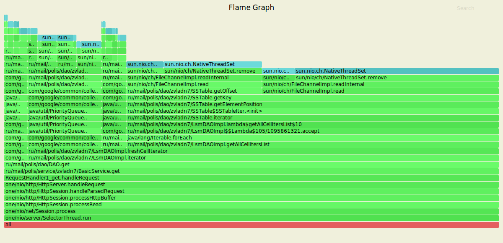
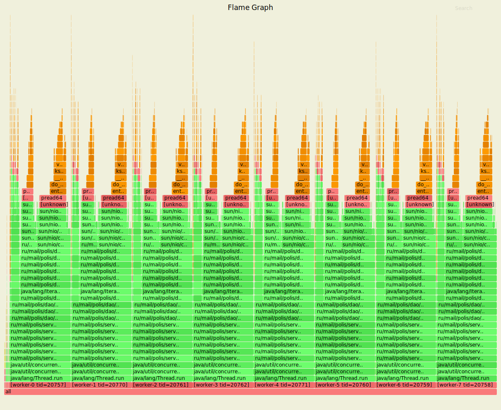

# Нагрузочное тестирование с помощью wrk2

### 1) Тестирование PUT запросов

Параметры запуска тестов:
1. Thread - 4
2. Connection - 64
3. Requests per second - 80000
4. Duration - 3m

`wrk2 -t4 -c64 -R80000 -d3m -s wrk/put.lua --latency  http://localhost:8080`

Running 3m test @ http://localhost:8080
  4 threads and 64 connections
      
      Thread calibration: mean lat.: 1.436ms, rate sampling interval: 10ms
      Thread calibration: mean lat.: 1.401ms, rate sampling interval: 10ms
      Thread calibration: mean lat.: 1.370ms, rate sampling interval: 10ms
      Thread calibration: mean lat.: 1.413ms, rate sampling interval: 10ms
      Thread Stats   Avg      Stdev     Max   +/- Stdev
        Latency     1.40ms    1.27ms  41.12ms   92.99%
        Req/Sec    21.11k     2.28k   43.11k    75.22%
  Latency Distribution (HdrHistogram - Recorded Latency
      
     50.000%    1.20ms
     75.000%    1.75ms
     90.000%    2.36ms
     99.000%    5.71ms
     99.900%   16.78ms
     99.990%   28.82ms
     99.999%   35.04ms
    100.000%   41.15ms

  Detailed Percentile spectrum:
  
       Value   Percentile   TotalCount 1/(1-Percentile)

       0.028     0.000000            1         1.00
       0.427     0.100000      1364111         1.11
       0.637     0.200000      2723049         1.25
       0.828     0.300000      4080780         1.43
       1.011     0.400000      5441732         1.67
       1.195     0.500000      6800466         2.00
       1.291     0.550000      7479967         2.22
       1.390     0.600000      8161024         2.50
       1.496     0.650000      8836596         2.86
       1.613     0.700000      9518015         3.33
       1.745     0.750000     10198548         4.00
       1.818     0.775000     10537494         4.44
       1.899     0.800000     10877327         5.00
       1.988     0.825000     11215653         5.71
       2.091     0.850000     11556620         6.67
       2.211     0.875000     11899548         8.00
       2.279     0.887500     12067175         8.89
       2.357     0.900000     12238024        10.00
       2.447     0.912500     12407588        11.43
       2.555     0.925000     12574163        13.33
       2.697     0.937500     12745156        16.00
       2.785     0.943750     12829459        17.78
       2.893     0.950000     12914786        20.00
       3.027     0.956250     12999526        22.86
       3.203     0.962500     13084010        26.67
       3.443     0.968750     13169307        32.00
       3.599     0.971875     13211684        35.56
       3.787     0.975000     13253950        40.00
       4.021     0.978125     13296562        45.71
       4.315     0.981250     13339167        53.33
       4.683     0.984375     13381224        64.00
       4.911     0.985938     13402544        71.11
       5.175     0.987500     13423743        80.00
       5.487     0.989062     13445030        91.43
       5.867     0.990625     13466246       106.67
       6.347     0.992188     13487425       128.00
       6.647     0.992969     13498038       142.22
       7.007     0.993750     13508664       160.00
       7.455     0.994531     13519346       182.86
       8.011     0.995313     13529871       213.33
       8.743     0.996094     13540535       256.00
       9.199     0.996484     13545859       284.44
       9.759     0.996875     13551143       320.00
      10.439     0.997266     13556449       365.71
      11.335     0.997656     13561757       426.67
      12.495     0.998047     13567038       512.00
      13.167     0.998242     13569708       568.89
      13.911     0.998437     13572357       640.00
      14.751     0.998633     13575011       731.43
      15.775     0.998828     13577661       853.33
      16.943     0.999023     13580337      1024.00
      17.647     0.999121     13581654      1137.78
      18.367     0.999219     13582986      1280.00
      19.199     0.999316     13584294      1462.86
      20.191     0.999414     13585637      1706.67
      21.343     0.999512     13586968      2048.00
      22.015     0.999561     13587615      2275.56
      22.767     0.999609     13588285      2560.00
      23.567     0.999658     13588942      2925.71
      24.447     0.999707     13589604      3413.33
      25.391     0.999756     13590267      4096.00
      25.887     0.999780     13590604      4551.11
      26.399     0.999805     13590931      5120.00
      26.895     0.999829     13591267      5851.43
      27.471     0.999854     13591593      6826.67
      28.095     0.999878     13591926      8192.00
      28.447     0.999890     13592093      9102.22
      28.895     0.999902     13592259     10240.00
      29.343     0.999915     13592429     11702.86
      29.823     0.999927     13592589     13653.33
      30.431     0.999939     13592756     16384.00
      30.735     0.999945     13592838     18204.44
      31.167     0.999951     13592921     20480.00
      31.583     0.999957     13593004     23405.71
      32.047     0.999963     13593087     27306.67
      32.511     0.999969     13593172     32768.00
      32.831     0.999973     13593213     36408.89
      33.119     0.999976     13593254     40960.00
      33.407     0.999979     13593298     46811.43
      33.759     0.999982     13593338     54613.33
      34.079     0.999985     13593379     65536.00
      34.303     0.999986     13593401     72817.78
      34.591     0.999988     13593420     81920.00
      34.815     0.999989     13593439     93622.86
      35.263     0.999991     13593460    109226.67
      35.839     0.999992     13593482    131072.00
      36.031     0.999993     13593492    145635.56
      36.351     0.999994     13593504    163840.00
      36.543     0.999995     13593513    187245.71
      36.831     0.999995     13593522    218453.33
      37.183     0.999996     13593534    262144.00
      37.375     0.999997     13593539    291271.11
      37.599     0.999997     13593543    327680.00
      37.823     0.999997     13593548    374491.43
      37.983     0.999998     13593553    436906.67
      38.335     0.999998     13593559    524288.00
      38.527     0.999998     13593561    582542.22
      38.591     0.999998     13593564    655360.00
      38.751     0.999999     13593566    748982.86
      39.007     0.999999     13593569    873813.33
      39.423     0.999999     13593572   1048576.00
      39.455     0.999999     13593573   1165084.44
      39.679     0.999999     13593575   1310720.00
      39.679     0.999999     13593575   1497965.71
      39.743     0.999999     13593577   1747626.67
      39.903     1.000000     13593578   2097152.00
      39.967     1.000000     13593579   2330168.89
      39.967     1.000000     13593579   2621440.00
      40.127     1.000000     13593580   2995931.43
      40.159     1.000000     13593581   3495253.33
      40.159     1.000000     13593581   4194304.00
      40.223     1.000000     13593582   4660337.78
      40.223     1.000000     13593582   5242880.00
      40.223     1.000000     13593582   5991862.86
      40.639     1.000000     13593583   6990506.67
      40.639     1.000000     13593583   8388608.00
      40.639     1.000000     13593583   9320675.55
      40.639     1.000000     13593583  10485760.00
      40.639     1.000000     13593583  11983725.71
      41.151     1.000000     13593584  13981013.34
      41.151     1.000000     13593584          inf
      
    [Mean    =        1.398, StdDeviation   =        1.271]
    [Max     =       41.120, Total count    =     13593584]
    [Buckets =           27, SubBuckets     =         2048]
----------------------------------------------------------
  14396896 requests in 3.00m, 0.90GB read
  
    Requests/sec:  79983.07
    Transfer/sec:      5.11MB

#### Результаты профилирования async-profiler (CPU): 

`./profiler.sh -d 20 -e cpu -f ./hw2/cpu_put_hw2.svg 13330`

Анализ: 
 - Обработка запроса: 18.62%, где:
    - Чтение из сокета: 8.45%
    - processHttpBuffer: 10.05%
 - ThreadPoolExecutor: Worker.run: 67.51%, где:
    - getTask - получение обработчика из ArrayBlockingQueue: 10.57%
    - Обработка лямбды, поставленной в очередь AsyncService занимает: 40.54%, где:
        - LocalCache.computeIfPresent: 2.14%
        - sendResponse: 28.08%(в том числе 24.78% - это запись в сокет)
        - DAO.upsert: 9.48%, где 7.73% занимает запись key-value в ConcurrentSkipListMap
 
 Из этого можно сделать вывод, что по сравнению с предыдущим этапом время на обработку запроса
 Selector'ом сократилось приблизительно в 4 раза, а это значит, что время его блокировки уменьшилось,
 следовательно пропускная способность сервера увеличилась.
 - 9.75% - занимает блокировка Selector'ов
 - Flush в пуле потоков ExecutorService - 15.87%
 
В целом видно, что распределение CPU к выполнению каждого действия осталось приблизительно таким же.
Вообщем увеличилось оно лишь за счёт добавления кэша(2.14%), а также постановки и выборки задач по
обработке запросов в ArrayBlockingQueue ExecutorService. Но как результат это привело к
освобождению Selector'ов от длительных блокировок.

Для сравнения приведены результаты профилирования предыдущего этапа:

#### Результаты профилирования предыдущего async-profiler (CPU): 

`./profiler.sh -d 20 -e cpu -f ./hw2/cpu_put_hw2.svg 18735`

Результаты: 
 - Обработка запроса: 67.71%, где:
    - Чтение из сокета: 8.48%
    - handleRequest: 53.05%, где:
        - Запись в сокет: 31.16%
        - BasicService.upsert: 16.5%, из которых 12.65 вставка в DAO
 - 9.51% - занимает блокировка Selector'ов
 - Flush в пуле потоков ExecutorService - 17.14%

#### Результаты профилирования async-profiler (ALLOC): 

`./profiler.sh -d 20 -e alloc -f ./hw2/alloc_put_hw2.svg 13330`

Анализ:
 - Выделение при обработки запроса занимает 47.18%, где:
    - handleParsedRequest - 9.98%, где:
        - handleRequest: 6.84%
            - AsyncService.upsert: - 2.59%
            - getRequiredParameter: 4.24%
        - Request.getPath: 3.15%
    - parseRequest - 18.71% (Request - 4.06%)
 
 Видно, что количество памяти, выдяляемой при обработке запроса по сранению с предыдущим этапом
 сократилось приблизительно в 2 раза, что позволяет нам говорить о том, что достаточно большая 
 нагрузка была снята с Selector'ов => время их блокировки уменьшилось, количество обрабатываемых 
 запросов увеличилось.
 - NativeSelector.select: 1.45%       
 - ThreadPoolExecutor: Worker.run: 51.36%, где:
    - Flush - 2.04%
    - handleUpsert лямбда run - 48.56%
        - 11.01% - DAO.upsert
        - LocalCache - 8.49%
        - sendResponse - 7.12%
    
    К предыдущему этапу прибавились аллокации для cashe из guava, что очевидно.
    - getTask - 0.76%
    
По результатам профилирования видно, что около половины аллокаций было делегировано на пул потоков,
обратывающих запросы, что несомненно увеличило пропускную способность сервера.
Большая часть памяти все также выделяется для создания байтовых буферов, для парса, создания и обработки запросов.

Для сравнения приведены результаты предыдущего этапа:

#### Результаты профилирования async-profiler (ALLOC): 

`./profiler.sh -d 20 -e alloc -f ./hw2/alloc_put_hw2.svg 18735`

Результаты:
 - Выделение при обработки запроса занимает 92.97%, где:
    - handleParsedRequest - 50%, где:
        - BasicService.upsert занимает - 33.46%(DAO.upsert - 12.75%)
        - Response - 6.16%
        - sendResponse - 8.13%
    - parseRequest - 21.27%
        - Request - 5.26%
 - Flush - 4.97%
 
#### Результаты профилирования async-profiler (LOCK): 

`./profiler.sh -d 20 -e lock -f ./hw2/lock_put_hw2.svg 13330` 
 
Анализ:
 - Постановка обработчика запросов в очередь ArrayBlockingQueue ExecutorService: 37%
 - Выборка обработчика запросов из очереди ArrayBlockingQueue ExecutorService: 60.37%
 - Блокировки в LocalCache из guava: 2.22%
 - sendResponse: 0.16%
 - ReentrantReadWriteLock.ReadLock - 0.66%
 
По результатам профилирования видно, что время блокировок значительно увеличилось по сранению
с предыдущим этапом на порядки. Поскольку появилось сразу несколько конкарент структур:
ExecutorService и его очередь ArrayBlockingQueue, а также Cache. Видно, что блокировки очереди
занимают большую часть, однако это оправдано тем, что мы снимаем нагрузку с Selector'ов, передавая
обработку запросов пулу потоков, тем самым увеличивая пропускную способность.

Для сравнения приведены результаты предыдущего этапа.
 
#### Результаты профилирования async-profiler (LOCK): 

`./profiler.sh -d 20 -e lock -f ./hw2/lock_put_hw2.svg 18735`

Результаты:
 - ReentrantReadWriteLock.ReadLock - 97.73%
 - ReentrantReadWriteLock.WriteLock - 2.27%

Также было проведено профилирования с использования ключика `-t` у `async-profiler`.
Где видно, что результаты работы различных селекторов и потоков являются приблизительно одинаковыми.
Разница заключается лишь в том, на какой из потоков приходится больше операций `upsert`.

#### Результаты профилирования async-profiler с -t (CPU): 

#### Результаты профилирования async-profiler c -t (ALLOC): 

#### Результаты профилирования async-profiler c -t (LOCK): 

### 2) Тестирование GET запросов

Параметры запуска тестов:
1. Thread - 4
2. Connection - 64
3. Requests per second - 2500
4. Duration - 3m

`wrk2 -t4 -c64 -R2500 -d60m -s wrk/get.lua --latency  http://localhost:8080`

Running 3m test @ http://localhost:8080
  4 threads and 64 connections
      
      Thread calibration: mean lat.: 7.466ms, rate sampling interval: 56ms
      Thread calibration: mean lat.: 8.164ms, rate sampling interval: 56ms
      Thread calibration: mean lat.: 7.469ms, rate sampling interval: 55ms
      Thread calibration: mean lat.: 7.495ms, rate sampling interval: 55ms
      Thread Stats   Avg      Stdev     Max   +/- Stdev
        Latency     4.57ms    4.44ms  66.43ms   95.45%
        Req/Sec   630.38     37.85     0.88k    91.10%
  Latency Distribution (HdrHistogram - Recorded Latency)
      
     50.000%    3.94ms
     75.000%    4.96ms
     90.000%    6.35ms
     99.000%   25.20ms
     99.900%   51.36ms
     99.990%   56.93ms
     99.999%   59.01ms
    100.000%   66.50ms

  Detailed Percentile spectrum:
  
       Value   Percentile   TotalCount 1/(1-Percentile)

       0.061     0.000000            1         1.00
       1.313     0.100000        42496         1.11
       2.923     0.200000        85019         1.25
       3.355     0.300000       127505         1.43
       3.659     0.400000       170057         1.67
       3.943     0.500000       212472         2.00
       4.093     0.550000       233785         2.22
       4.255     0.600000       255056         2.50
       4.447     0.650000       276521         2.86
       4.679     0.700000       297544         3.33
       4.963     0.750000       318601         4.00
       5.131     0.775000       329271         4.44
       5.315     0.800000       339927         5.00
       5.519     0.825000       350609         5.71
       5.747     0.850000       361183         6.67
       6.007     0.875000       371754         8.00
       6.163     0.887500       377088         8.89
       6.351     0.900000       382367        10.00
       6.583     0.912500       387686        11.43
       6.891     0.925000       392933        13.33
       7.355     0.937500       398248        16.00
       7.719     0.943750       400922        17.78
       8.247     0.950000       403569        20.00
       9.103     0.956250       406209        22.86
      10.375     0.962500       408865        26.67
      12.111     0.968750       411520        32.00
      13.143     0.971875       412852        35.56
      14.407     0.975000       414184        40.00
      15.703     0.978125       415503        45.71
      17.039     0.981250       416833        53.33
      18.687     0.984375       418164        64.00
      19.839     0.985938       418822        71.11
      21.487     0.987500       419488        80.00
      23.535     0.989062       420149        91.43
      26.623     0.990625       420810       106.67
      30.863     0.992188       421477       128.00
      33.119     0.992969       421807       142.22
      35.359     0.993750       422140       160.00
      37.695     0.994531       422470       182.86
      40.127     0.995313       422802       213.33
      42.495     0.996094       423136       256.00
      43.487     0.996484       423302       284.44
      44.543     0.996875       423465       320.00
      45.471     0.997266       423633       365.71
      46.559     0.997656       423797       426.67
      47.935     0.998047       423964       512.00
      48.671     0.998242       424051       568.89
      49.343     0.998437       424134       640.00
      49.983     0.998633       424212       731.43
      50.623     0.998828       424296       853.33
      51.455     0.999023       424378      1024.00
      51.839     0.999121       424420      1137.78
      52.383     0.999219       424465      1280.00
      52.767     0.999316       424504      1462.86
      53.279     0.999414       424544      1706.67
      53.887     0.999512       424585      2048.00
      54.143     0.999561       424609      2275.56
      54.463     0.999609       424629      2560.00
      54.847     0.999658       424647      2925.71
      55.231     0.999707       424670      3413.33
      55.615     0.999756       424690      4096.00
      55.839     0.999780       424699      4551.11
      56.031     0.999805       424710      5120.00
      56.351     0.999829       424721      5851.43
      56.543     0.999854       424732      6826.67
      56.703     0.999878       424741      8192.00
      56.831     0.999890       424747      9102.22
      56.959     0.999902       424752     10240.00
      57.087     0.999915       424756     11702.86
      57.247     0.999927       424761     13653.33
      57.503     0.999939       424769     16384.00
      57.503     0.999945       424769     18204.44
      57.695     0.999951       424774     20480.00
      57.695     0.999957       424774     23405.71
      58.015     0.999963       424777     27306.67
      58.111     0.999969       424781     32768.00
      58.111     0.999973       424781     36408.89
      58.239     0.999976       424782     40960.00
      58.335     0.999979       424783     46811.43
      58.399     0.999982       424785     54613.33
      58.783     0.999985       424786     65536.00
      58.975     0.999986       424787     72817.78
      58.975     0.999988       424787     81920.00
      59.007     0.999989       424788     93622.86
      59.391     0.999991       424789    109226.67
      59.391     0.999992       424789    131072.00
      59.423     0.999993       424790    145635.56
      59.423     0.999994       424790    163840.00
      59.423     0.999995       424790    187245.71
      59.999     0.999995       424791    218453.33
      59.999     0.999996       424791    262144.00
      59.999     0.999997       424791    291271.11
      59.999     0.999997       424791    327680.00
      59.999     0.999997       424791    374491.43
      66.495     0.999998       424792    436906.67
      66.495     1.000000       424792          inf

    [Mean    =        4.570, StdDeviation   =        4.436]
    [Max     =       66.432, Total count    =       424792]
    [Buckets =           27, SubBuckets     =         2048]
----------------------------------------------------------
  449928 requests in 3.00m, 32.13MB read

    Requests/sec:   2499.59
    Transfer/sec:    182.80KB

#### Результаты профилирования async-profiler (CPU): 

`./profiler.sh -d 20 -e cpu -f ./hw3/cpu_get.svg 13330`

Анализ:
 - ThreadPoolExecutor: Worker.run: 98.9%:
    - DAO.get - 97.76%
        - DAO.iterator занимает 97.29%
            - Merge различных iterator'ов занимает - 13.19%
            - getAllCellIters: 83.65%
                 - 82.79% CPU тратится на то, чтобы бинарным поиском найти место в файле,
                      с которого нужно читать, из которых 28.63% - это чтение смещений из файла, 
                      и еще 54.12% чтение остальных данных
        - TransformIterator - 0.44%
    - sendResponse - 0.76%        
 
По результатам профилирования видно, что основным отличием по сравнению с предыдущим этапом
является тот факт, что запрос обрабатывается в пуле потоках, а не блокирует Selector, 
что позволяет увиличить пропускную способность 
Iterator'ы занимают почти все время работы, что логично, ведь им приходится читать данные из файлов,
мерджить данные и выбирать из них наиболее `свежие`.

Для уменьшее времени чтения логичным решением является проведение переодических `compaction` операций, 
что я постараюсь реализовать в будущих этапах(попытка была, но она пока не увенчалась успехов).

Для сравнения приведены результаты предыдущего этапа

#### Результаты профилирования предыдущего этапа async-profiler (CPU): 

`./profiler.sh -d 20 -e cpu -f ./hw2/get/cpu_get_hw2.svg 25055`

Результаты:
 - Обработка запроса: 99.23%:
    - DAO.get занимает(BasicService.get) - 97.25%
        - DAO.iterator занимает 96.43%
            - Merge различных iterator'ов занимает - 14.53%
            - getAllCellIters: 80.67%
                - 79.92% CPU тратится на то, чтобы бинарным поиском найти место в файле,
                  с которого нужно читать, из которых 26.65% - это чтение смещений из файла, 
                  и еще 52.92% чтение остальных данных
        - TransformIterator - 0.78%
 - NativeSelector.select - 0.42%

#### Результаты профилирования async-profiler (ALLOC): 

`./profiler.sh -d 20 -e alloc -f ./hw3/alloc_get.svg 13330`

Анализ:
 - Обработка запроса: 13.79%
 - ThreadPoolExecutor: Worker.run: 84.3%:
    - Iterator: 82.67%
        - Merge Iterator и его Priority Queue занимают - 16.45%
        - CollapseIter - 0.88%
        - getAllCellIters - 65.04%, при этом в основном память выделяется под байтовый буфер для 
            текущего ключа в бинарном поиске, где 47.08% выделяется под сам ключ, а 17.53% на смещение
            до него 
    - Transformed.iterator - 0.91%

 Из результатов профилирования видно, что как уже было сказано выше выделение памяти - это в основном создания
 байтовых буфером и обычных массивов. При этом можно заметить, что вся аллокация уходит на создание этих буферов
 при вызове iterator'a, при мердже, поиске по ключу и тд. 

Однако по сравнению с предыдущим этапом большая чась аллокаций происходит при обработке запросов в пуле
потоков, а не на Selector'ах, что снимает с них нагрузку и время блокировки, как говорилось выше.

Для сравнения приведены результаты профилирования предыдущего этапа.

#### Результаты профилирования async-profiler (ALLOC): 

`./profiler.sh -d 20 -e alloc -f ./hw2/get/alloc_get_hw2.svg 25055`

Результаты:
 - Обработка запроса: 99.09% (DAO.get - 98.07%), где: 
    - Iterator: 96.09%
        - Merge Iterator и его Priority Queue занимают - 19.82%
        - CollapseIter - 1.59%
        - getAllCellIters - 73.11%
    - Transformed.iterator - 1.76%

 
 
 
 #### Результаты профилирования async-profiler (LOCK): 
 
 
`./profiler.sh -d 20 -e alloc -f ./hw3/alloc_get.svg 13330`

Анализ:
 - DAO.get - 98.66%: 
    - Iterator: 97.5%
         - MergeIterator - 13.83%, Из `flame graph` видно, что блокировка происходит
         при вызове SSTable.get, где блокировкой является обращение к файлу.
         - CollapseIterator - 1.15%. (Аналогично)
         - getAllCellIters - 82.52%. Блокировки являются обращением к файлам, где 27.42% - это 
         блокировки при получении смещения на ключ, 47.89% - это остальное чтение из файла.
    - TransformedIterator - 1.16%. Аналогично обращение к файлу при SSTable.get
 - Cache - 0.67%  

Из анализа видно, что все время занимают блокировки в файлах, что является логичным при GET запросах.
ReentrantReadWriteLock не появляется в `flame graph`, поскольку при чтении данных используется только 
readLock, который допускает одновременное ресурса, поскольку нет вызовов writeLock.lock(), так как это
происходит только при желании изменить данные.
Также по сравнению с предудщим этапом добавились блокировки в cache.
 
Для сравнения приведены результаты профилирования предыдущего этапа

#### Результаты профилирования предыдущего этапа async-profiler (LOCK): 

`./profiler.sh -d 20 -e alloc -f ./hw3/alloc_get.svg 25055`

Анализ:
 - DAO.get - 100%: 
    - Iterator: 95.33%
         - MergeIterator - 14.99%
         - CollapseIterator - 5.03%
         - getAllCellIters - 75.31%
    - TransformedIterator - 4.67%
    
Также было проведено профилирования с использования ключика `-t` у `async-profiler`.
Где видно, что результаты работы различных селекторов являются приблизительно одинаковыми.

#### Результаты профилирования async-profiler с -t (CPU): 

#### Результаты профилирования async-profiler c -t (ALLOC): 

#### Результаты профилирования async-profiler c -t (LOCK): 

### Результаты с использованием cache

`wrk -t4 -c64 -R2000 -d3m -s wrk/get_cache.lua --latency http://localhost:8080Running 3m test @ http://localhost:8080`

  4 threads and 64 connections

      Thread calibration: mean lat.: 1.214ms, rate sampling interval: 10ms
      Thread calibration: mean lat.: 1.218ms, rate sampling interval: 10ms
      Thread calibration: mean lat.: 1.227ms, rate sampling interval: 10ms
      Thread calibration: mean lat.: 1.219ms, rate sampling interval: 10ms
      Thread Stats   Avg      Stdev     Max   +/- Stdev
        Latency     1.22ms  821.18us  17.63ms   95.21%
        Req/Sec   525.67    115.91     1.33k    56.01%
  Latency Distribution (HdrHistogram - Recorded Latency)
  
     50.000%    1.17ms
     75.000%    1.45ms
     90.000%    1.74ms
     99.000%    2.37ms
     99.900%   11.98ms
     99.990%   14.14ms
     99.999%   16.06ms
    100.000%   17.65ms

  Detailed Percentile spectrum:

       Value   Percentile   TotalCount 1/(1-Percentile)

       0.071     0.000000            1         1.00
       0.580     0.100000        34123         1.11
       0.765     0.200000        67988         1.25
       0.918     0.300000       102033         1.43
       1.051     0.400000       135941         1.67
       1.170     0.500000       169965         2.00
       1.225     0.550000       186958         2.22
       1.279     0.600000       204039         2.50
       1.332     0.650000       221018         2.86
       1.387     0.700000       238097         3.33
       1.446     0.750000       255074         4.00
       1.479     0.775000       263606         4.44
       1.515     0.800000       271963         5.00
       1.557     0.825000       280379         5.71
       1.609     0.850000       288884         6.67
       1.668     0.875000       297393         8.00
       1.701     0.887500       301641         8.89
       1.736     0.900000       305871        10.00
       1.772     0.912500       310134        11.43
       1.812     0.925000       314370        13.33
       1.857     0.937500       318600        16.00
       1.883     0.943750       320737        17.78
       1.912     0.950000       322904        20.00
       1.943     0.956250       324972        22.86
       1.981     0.962500       327159        26.67
       2.025     0.968750       329222        32.00
       2.053     0.971875       330356        35.56
       2.081     0.975000       331391        40.00
       2.115     0.978125       332446        45.71
       2.155     0.981250       333524        53.33
       2.205     0.984375       334563        64.00
       2.231     0.985938       335085        71.11
       2.265     0.987500       335593        80.00
       2.315     0.989062       336126        91.43
       2.425     0.990625       336657       106.67
       3.349     0.992188       337185       128.00
       4.259     0.992969       337451       142.22
       5.095     0.993750       337721       160.00
       5.967     0.994531       337982       182.86
       7.027     0.995313       338247       213.33
       8.951     0.996094       338515       256.00
       9.943     0.996484       338648       284.44
      10.335     0.996875       338779       320.00
      10.687     0.997266       338913       365.71
      10.967     0.997656       339047       426.67
      11.223     0.998047       339183       512.00
      11.351     0.998242       339243       568.89
      11.495     0.998437       339312       640.00
      11.639     0.998633       339376       731.43
      11.823     0.998828       339444       853.33
      11.991     0.999023       339511      1024.00
      12.103     0.999121       339542      1137.78
      12.239     0.999219       339577      1280.00
      12.399     0.999316       339608      1462.86
      12.495     0.999414       339641      1706.67
      12.623     0.999512       339675      2048.00
      12.743     0.999561       339693      2275.56
      12.871     0.999609       339708      2560.00
      12.959     0.999658       339724      2925.71
      13.135     0.999707       339741      3413.33
      13.303     0.999756       339758      4096.00
      13.447     0.999780       339766      4551.11
      13.575     0.999805       339774      5120.00
      13.687     0.999829       339783      5851.43
      13.775     0.999854       339791      6826.67
      13.951     0.999878       339799      8192.00
      14.023     0.999890       339803      9102.22
      14.255     0.999902       339807     10240.00
      14.423     0.999915       339811     11702.86
      14.743     0.999927       339816     13653.33
      14.823     0.999939       339820     16384.00
      14.975     0.999945       339822     18204.44
      15.007     0.999951       339824     20480.00
      15.111     0.999957       339826     23405.71
      15.135     0.999963       339828     27306.67
      15.311     0.999969       339830     32768.00
      15.359     0.999973       339831     36408.89
      15.391     0.999976       339832     40960.00
      15.463     0.999979       339833     46811.43
      15.607     0.999982       339834     54613.33
      15.767     0.999985       339835     65536.00
      15.903     0.999986       339836     72817.78
      15.903     0.999988       339836     81920.00
      16.055     0.999989       339837     93622.86
      16.055     0.999991       339837    109226.67
      16.231     0.999992       339838    131072.00
      16.231     0.999993       339838    145635.56
      16.231     0.999994       339838    163840.00
      16.319     0.999995       339839    187245.71
      16.319     0.999995       339839    218453.33
      16.319     0.999996       339839    262144.00
      16.319     0.999997       339839    291271.11
      16.319     0.999997       339839    327680.00
      17.647     0.999997       339840    374491.43
      17.647     1.000000       339840          inf
    [Mean    =        1.216, StdDeviation   =        0.821]
    [Max     =       17.632, Total count    =       339840]
    [Buckets =           27, SubBuckets     =         2048]
----------------------------------------------------------
  359957 requests in 3.00m, 24.69MB read

    Requests/sec:   1999.73
    Transfer/sec:    140.44KB

#### Результаты профилирования async-profiler (CPU): 

`./profiler.sh -d 20 -e cpu -f hw3/cache/cpu_get_cache.svg 5709`

#### Результаты профилирования async-profiler (ALLOC): 

`./profiler.sh -d 20 -e alloc -f hw3/cache/alloc_get_cache.svg 5709`

#### Результаты профилирования async-profiler (LOCK): 

`./profiler.sh -d 20 -e lock -f hw3/cache/lock_get_cache.svg 5709`

По сравнению с результатами профилирования, когда идут одни кэш промахи видно, что в данном случае
время CPU, затраченное для обработки GET запроса, снизилось в разы, поскольку нет необходимости в 
том, чтобы постоянно читать с диска(c постоянными промахами DAO.get занимал почти все время CPU), поскольку актуальное значение уже лежит кэше, следовательно, единственной
операцией является извление из map(поскольку Cache под капотом является ей).

Количество памяти также снизилось в разы и в основном выделяется только на буферы и массивы байтов
для обработки, парса запроса и его параметров, а также отправки ответа. При кэш промахах приходилось 
выделять много памяти для поиска ключа, мерджа актуальных значений и тд, при попаданиях это значение
резко снизилось.

Также стало меньше блокировок, поскольку основными блокировками также являлись блокировки при чтении
файлов, при попадании - это в основном блокировки для постановки задачи в блокирующую очередь, выборке
из нее и отправке ответа, хотя периодические чтение из файлов все равно происходят.
