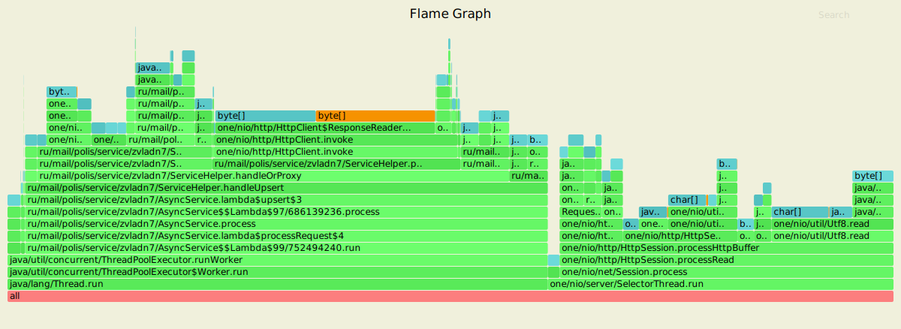
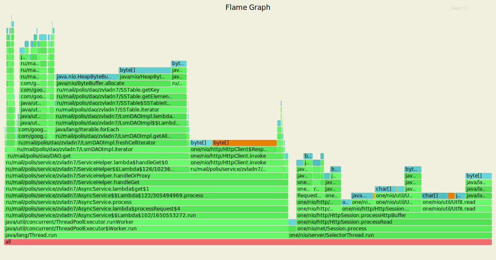

# Нагрузочное тестирование с помощью wrk2

### 1) Тестирование PUT запросов

Параметры запуска тестов:
1. Thread - 4
2. Connection - 64
3. Requests per second - 70000
4. Duration - 3m

`wrk2 -t4 -c64 -780000 -d3m -s wrk/put.lua --latency  http://localhost:8080`

Running 3m test @ http://localhost:8080
  4 threads and 64 connections
      
      Thread calibration: mean lat.: 1.333ms, rate sampling interval: 10ms
      Thread calibration: mean lat.: 1.342ms, rate sampling interval: 10ms
      Thread calibration: mean lat.: 1.312ms, rate sampling interval: 10ms
      Thread calibration: mean lat.: 1.343ms, rate sampling interval: 10ms
      Thread Stats   Avg      Stdev     Max   +/- Stdev
        Latency     1.57ms    1.90ms  80.70ms   95.93%
        Req/Sec    18.46k     2.13k   36.67k    76.74%
  Latency Distribution (HdrHistogram - Recorded Latency)
      
     50.000%    1.28ms
     75.000%    1.84ms
     90.000%    2.49ms
     99.000%    8.21ms
     99.900%   25.55ms
     99.990%   48.45ms
     99.999%   68.48ms
    100.000%   80.77ms

  Detailed Percentile spectrum:
  
       Value   Percentile   TotalCount 1/(1-Percentile)

       0.030     0.000000            2         1.00
       0.465     0.100000      1192416         1.11
       0.695     0.200000      2384448         1.25
       0.896     0.300000      3573457         1.43
       1.087     0.400000      4763116         1.67
       1.277     0.500000      5948168         2.00
       1.374     0.550000      6542573         2.22
       1.476     0.600000      7140028         2.50
       1.585     0.650000      7733249         2.86
       1.706     0.700000      8328100         3.33
       1.844     0.750000      8924346         4.00
       1.921     0.775000      9221650         4.44
       2.004     0.800000      9516935         5.00
       2.097     0.825000      9815510         5.71
       2.203     0.850000     10114389         6.67
       2.329     0.875000     10411175         8.00
       2.403     0.887500     10557867         8.89
       2.491     0.900000     10707097        10.00
       2.595     0.912500     10854357        11.43
       2.725     0.925000     11004067        13.33
       2.895     0.937500     11151522        16.00
       3.009     0.943750     11226304        17.78
       3.153     0.950000     11300178        20.00
       3.345     0.956250     11374570        22.86
       3.613     0.962500     11448634        26.67
       3.997     0.968750     11522792        32.00
       4.255     0.971875     11560288        35.56
       4.567     0.975000     11597410        40.00
       4.951     0.978125     11634340        45.71
       5.439     0.981250     11671610        53.33
       6.083     0.984375     11708605        64.00
       6.507     0.985938     11727157        71.11
       7.035     0.987500     11745791        80.00
       7.707     0.989062     11764367        91.43
       8.599     0.990625     11782998       106.67
       9.807     0.992188     11801528       128.00
      10.607     0.992969     11810831       142.22
      11.519     0.993750     11820117       160.00
      12.623     0.994531     11829361       182.86
      13.951     0.995313     11838664       213.33
      15.527     0.996094     11847945       256.00
      16.399     0.996484     11852654       284.44
      17.375     0.996875     11857328       320.00
      18.447     0.997266     11861917       365.71
      19.663     0.997656     11866571       426.67
      20.991     0.998047     11871197       512.00
      21.711     0.998242     11873500       568.89
      22.543     0.998437     11875857       640.00
      23.423     0.998633     11878169       731.43
      24.463     0.998828     11880480       853.33
      25.727     0.999023     11882811      1024.00
      26.431     0.999121     11883968      1137.78
      27.199     0.999219     11885125      1280.00
      28.015     0.999316     11886282      1462.86
      28.991     0.999414     11887438      1706.67
      30.127     0.999512     11888610      2048.00
      30.751     0.999561     11889184      2275.56
      31.471     0.999609     11889767      2560.00
      32.431     0.999658     11890341      2925.71
      33.663     0.999707     11890927      3413.33
      35.071     0.999756     11891501      4096.00
      36.095     0.999780     11891795      4551.11
      37.247     0.999805     11892081      5120.00
      38.687     0.999829     11892377      5851.43
      40.767     0.999854     11892662      6826.67
      44.639     0.999878     11892953      8192.00
      46.911     0.999890     11893102      9102.22
      48.767     0.999902     11893244     10240.00
      51.615     0.999915     11893387     11702.86
      55.391     0.999927     11893532     13653.33
      58.431     0.999939     11893678     16384.00
      59.999     0.999945     11893750     18204.44
      61.503     0.999951     11893824     20480.00
      62.719     0.999957     11893895     23405.71
      63.615     0.999963     11893968     27306.67
      64.543     0.999969     11894042     32768.00
      64.991     0.999973     11894078     36408.89
      65.535     0.999976     11894113     40960.00
      65.983     0.999979     11894154     46811.43
      66.495     0.999982     11894186     54613.33
      67.135     0.999985     11894223     65536.00
      67.519     0.999986     11894242     72817.78
      68.031     0.999988     11894258     81920.00
      68.415     0.999989     11894276     93622.86
      68.799     0.999991     11894297    109226.67
      69.311     0.999992     11894314    131072.00
      69.631     0.999993     11894323    145635.56
      69.823     0.999994     11894331    163840.00
      70.207     0.999995     11894340    187245.71
      70.783     0.999995     11894349    218453.33
      71.423     0.999996     11894358    262144.00
      71.871     0.999997     11894363    291271.11
      72.383     0.999997     11894367    327680.00
      72.703     0.999997     11894372    374491.43
      73.279     0.999998     11894376    436906.67
      74.303     0.999998     11894381    524288.00
      74.623     0.999998     11894383    582542.22
      75.135     0.999998     11894385    655360.00
      76.031     0.999999     11894388    748982.86
      76.735     0.999999     11894390    873813.33
      76.927     0.999999     11894392   1048576.00
      77.247     0.999999     11894394   1165084.44
      77.247     0.999999     11894394   1310720.00
      77.887     0.999999     11894396   1497965.71
      78.015     0.999999     11894397   1747626.67
      78.399     1.000000     11894398   2097152.00
      78.399     1.000000     11894398   2330168.89
      78.655     1.000000     11894399   2621440.00
      79.295     1.000000     11894400   2995931.43
      79.295     1.000000     11894400   3495253.33
      79.871     1.000000     11894401   4194304.00
      79.871     1.000000     11894401   4660337.78
      79.871     1.000000     11894401   5242880.00
      79.935     1.000000     11894402   5991862.86
      79.935     1.000000     11894402   6990506.67
      79.935     1.000000     11894402   8388608.00
      79.935     1.000000     11894402   9320675.55
      79.935     1.000000     11894402  10485760.00
      80.767     1.000000     11894403  11983725.71
      80.767     1.000000     11894403          inf
    #[Mean    =        1.566, StdDeviation   =        1.896]
    #[Max     =       80.704, Total count    =     11894403]
    #[Buckets =           27, SubBuckets     =         2048]
----------------------------------------------------------
  12597373 requests in 3.00m, 804.92MB read
    
    Requests/sec:  69985.14
    Transfer/sec:      4.47MB

#### Результаты профилирования async-profiler (CPU): 

`./profiler.sh -d 20 -e cpu -f ./hw4/cpu_put.svg 12385`

Анализ: 
 - Обработка запроса: 19.13%, где:
    - Чтение из сокета: 7.75%
    - processHttpBuffer: 10.77%
 - ThreadPoolExecutor: Worker.run: 66.8%, где:
    - getTask - получение обработчика из ArrayBlockingQueue: 12.06%
    - Обработка лямбды, поставленной в очередь AsyncService занимает: 42.74%, где:
        - handleOrProxy: 40.31%:
            - process:
                - sendResponse: 29.84%(в том числе 26.9% - это запись в сокет)
                - DAO.upsert: 8.44%, где 7.26% занимает запись key-value в ConcurrentSkipListMap
            - nodeFor - определение ноды для обработки запроса: 1.69%    
 - NativeSelector.select - 10.13%(в том числе блокировка Selector'ов - 9.83%)
 - Flush в пуле потоков ExecutorService - 11.7%
 
В целом видно, что распределение CPU к выполнению каждого действия по сравнению с предыдущим этапом
осталось приблизительно таким же.
Время обработки запроса, как в Session.process, так и в пуле потоков ExecutorService несколько увеличилось
за счёт того, что необходимо опредлять ноду, на которой будут храниться данные, и в случае, если это
нода не локальная, проксировать ее на нужный service, повторно выполняя эти методы.

#### Результаты профилирования async-profiler (ALLOC): 

`./profiler.sh -d 20 -e alloc -f ./hw4/alloc_put.svg 12385`

Анализ:
 - Выделение при обработки запроса занимает 46.76%, где:
    - handleParsedRequest - 9.57%, где:
        - handleRequest: 6.78%
            - AsyncService.upsert: - 2.63%
            - getRequiredParameter: 4.14%
        - Request.getPath: 2.8%
    - parseRequest - 19.14% (Request - 4.06%)
 
 Видно, что количество памяти, выдяляемой при обработке запроса по сранению с предыдущим этапом
 сократилось приблизительно в 2 раза, что позволяет нам говорить о том, что достаточно большая 
 нагрузка была снята с Selector'ов => время их блокировки уменьшилось, количество обрабатываемых 
 запросов увеличилось.
 - NativeSelector.select: 1.17%       
 - ThreadPoolExecutor: Worker.run: 52.07%, где:
    - Flush - 3.05%
    - handleUpsert лямбда run - 48.26%
        - 12.51% - DAO.upsert
        - sendResponse - 8.55%
        - nodeFor - 8.48%    
    - getTask - 0.77%
    
Большая часть памяти все также выделяется для создания байтовых буферов, для парса, создания и обработки запросов.
По сравнению с предыдущим этапом видим, что в целом распределение памяти осталось в том же порядке. 
Наибольший прирост получился за счёт аллокаций при определении, на какой ноде необходимо выполнить
запрос, то есть нахождении промежутока на `hash ring'e`
 
#### Результаты профилирования async-profiler (LOCK): 

`./profiler.sh -d 20 -e lock -f ./hw4/lock_put.svg 12385` 
 
Анализ:
 - Постановка обработчика запросов в очередь ArrayBlockingQueue ExecutorService: 36.83%
 - Выборка обработчика запросов из очереди ArrayBlockingQueue ExecutorService: 62.41%
 - sendResponse: 0.26%
 - ReentrantReadWriteLock.ReadLock - 0.04%
 
Аналогично с предыдущим этапом, так как картин блокировок практически эквивалентна.
Видно, что блокировки очереди Executor Service занимают большую часть, однако это 
оправдано тем, что мы снимаем нагрузку с Selector'ов, передавая обработку запросов пулу потоков, 
тем самым увеличивая пропускную способность.

### 2) Тестирование GET запросов

Параметры запуска тестов:
1. Thread - 4
2. Connection - 64
3. Requests per second - 2000
4. Duration - 3m

`wrk2 -t4 -c64 -R2000 -d60m -s wrk/get.lua --latency  http://localhost:8080`

Running 3m test @ http://localhost:8080
  4 threads and 64 connections
      
      Thread calibration: mean lat.: 3.257ms, rate sampling interval: 10ms
      Thread calibration: mean lat.: 3.307ms, rate sampling interval: 10ms
      Thread calibration: mean lat.: 3.286ms, rate sampling interval: 10ms
      Thread calibration: mean lat.: 3.252ms, rate sampling interval: 10ms
      Thread Stats   Avg      Stdev     Max   +/- Stdev
        Latency     4.10ms    6.50ms 152.19ms   98.15%
        Req/Sec   526.78    106.14     1.22k    64.28%
  Latency Distribution (HdrHistogram - Recorded Latency)
      
     50.000%    3.37ms
     75.000%    3.88ms
     90.000%    4.53ms
     99.000%   20.54ms
     99.900%  111.87ms
     99.990%  137.60ms
     99.999%  150.65ms
    100.000%  152.32ms

  Detailed Percentile spectrum:
       
       Value   Percentile   TotalCount 1/(1-Percentile)

       1.611     0.000000            1         1.00
       2.497     0.100000        33985         1.11
       2.785     0.200000        68011         1.25
       3.001     0.300000       101964         1.43
       3.189     0.400000       136275         1.67
       3.367     0.500000       170109         2.00
       3.459     0.550000       187231         2.22
       3.553     0.600000       203992         2.50
       3.655     0.650000       221200         2.86
       3.763     0.700000       238038         3.33
       3.885     0.750000       254963         4.00
       3.955     0.775000       263483         4.44
       4.033     0.800000       271932         5.00
       4.123     0.825000       280436         5.71
       4.227     0.850000       288994         6.67
       4.359     0.875000       297573         8.00
       4.439     0.887500       301650         8.89
       4.535     0.900000       305878        10.00
       4.659     0.912500       310227        11.43
       4.819     0.925000       314425        13.33
       5.047     0.937500       318611        16.00
       5.215     0.943750       320759        17.78
       5.427     0.950000       322861        20.00
       5.731     0.956250       324982        22.86
       6.179     0.962500       327105        26.67
       6.895     0.968750       329222        32.00
       7.387     0.971875       330283        35.56
       8.095     0.975000       331343        40.00
       9.095     0.978125       332406        45.71
      10.447     0.981250       333466        53.33
      12.343     0.984375       334531        64.00
      13.767     0.985938       335059        71.11
      15.759     0.987500       335591        80.00
      18.783     0.989062       336121        91.43
      22.239     0.990625       336652       106.67
      25.519     0.992188       337184       128.00
      28.447     0.992969       337451       142.22
      31.791     0.993750       337714       160.00
      38.303     0.994531       337979       182.86
      49.503     0.995313       338245       213.33
      62.943     0.996094       338510       256.00
      68.095     0.996484       338646       284.44
      73.663     0.996875       338777       320.00
      79.871     0.997266       338908       365.71
      86.847     0.997656       339041       426.67
      94.271     0.998047       339174       512.00
      97.727     0.998242       339240       568.89
     102.207     0.998437       339308       640.00
     106.495     0.998633       339373       731.43
     109.503     0.998828       339440       853.33
     112.191     0.999023       339510      1024.00
     113.343     0.999121       339542      1137.78
     114.687     0.999219       339572      1280.00
     116.031     0.999316       339607      1462.86
     117.695     0.999414       339638      1706.67
     119.615     0.999512       339672      2048.00
     120.511     0.999561       339689      2275.56
     122.175     0.999609       339705      2560.00
     123.583     0.999658       339721      2925.71
     124.927     0.999707       339738      3413.33
     126.719     0.999756       339755      4096.00
     127.871     0.999780       339763      4551.11
     129.279     0.999805       339771      5120.00
     131.583     0.999829       339779      5851.43
     132.863     0.999854       339788      6826.67
     134.911     0.999878       339796      8192.00
     137.087     0.999890       339800      9102.22
     137.599     0.999902       339804     10240.00
     138.367     0.999915       339808     11702.86
     141.311     0.999927       339813     13653.33
     142.335     0.999939       339818     16384.00
     143.615     0.999945       339819     18204.44
     145.151     0.999951       339821     20480.00
     146.303     0.999957       339823     23405.71
     146.815     0.999963       339825     27306.67
     147.967     0.999969       339827     32768.00
     148.223     0.999973       339828     36408.89
     148.735     0.999976       339829     40960.00
     148.863     0.999979       339830     46811.43
     149.119     0.999982       339831     54613.33
     150.143     0.999985       339832     65536.00
     150.271     0.999986       339833     72817.78
     150.271     0.999988       339833     81920.00
     150.655     0.999989       339834     93622.86
     150.655     0.999991       339834    109226.67
     151.423     0.999992       339835    131072.00
     151.423     0.999993       339835    145635.56
     151.423     0.999994       339835    163840.00
     152.063     0.999995       339836    187245.71
     152.063     0.999995       339836    218453.33
     152.063     0.999996       339836    262144.00
     152.063     0.999997       339836    291271.11
     152.063     0.999997       339836    327680.00
     152.319     0.999997       339837    374491.43
     152.319     1.000000       339837          inf
    #[Mean    =        4.098, StdDeviation   =        6.501]
    #[Max     =      152.192, Total count    =       339837]
    #[Buckets =           27, SubBuckets     =         2048]
----------------------------------------------------------
  359948 requests in 3.00m, 25.59MB read

    Requests/sec:   1999.71
    Transfer/sec:    145.59KB

#### Результаты профилирования async-profiler (CPU): 

`./profiler.sh -d 20 -e cpu -f ./hw4/cpu_get.svg 12385`

Анализ:
 - ThreadPoolExecutor: Worker.run: 99.14%:
    - DAO.get - 97.83%
        - DAO.iterator занимает 97.32%
            - Merge различных iterator'ов занимает - 13.58%
            - getAllCellIters: 83.11%
                 - 83.11% CPU тратится на то, чтобы бинарным поиском найти место в файле,
                      с которого нужно читать, из которых 26.9% - это чтение смещений из файла, 
                      и еще 54.32% чтение остальных данных
            - CollapseIterator - 0.5%         
        - TransformIterator - 0.5%
    - sendResponse - 0.93%   
 - Session.process - 0.57%        
 
По результатам профилирования видно, что распределение CPU примерно тоже.
Iterator'ы занимают почти все время работы, что логично, ведь им приходится читать данные из файлов,
мерджить данные и выбирать из них наиболее `свежие`.

#### Результаты профилирования async-profiler (ALLOC): 

`./profiler.sh -d 20 -e alloc -f ./hw4/alloc_get.svg 12385`

Анализ:
 - Обработка запроса: 29.27%
 - ThreadPoolExecutor: Worker.run: 69.79%:
    - Iterator: 67.82%
        - Merge Iterator и его Priority Queue занимают - 18.69%
        - CollapseIter - 1.01%
        - getAllCellIters - 47.74%, при этом в основном память выделяется под байтовый буфер для 
            текущего ключа в бинарном поиске, где 40.37% выделяется под сам ключ, а 6.87% на смещение
            до него 
    - Transformed.iterator - 1.09%

 Из результатов профилирования видно, что как уже было сказано выше выделение памяти - это в основном создания
 байтовых буфером и обычных массивов. 
 По сравнению с предыдущим этапом выделение памяти в Session.process увеличилось, поскольку необходимо проксировать
 запрос на другой сервис, если ключ не относится к локальной ноде. Соответственно, другому сервису нужно
 заново распарсить и обработать запрос.
 
 #### Результаты профилирования async-profiler (LOCK): 
 
 
`./profiler.sh -d 20 -e alloc -f ./hw4/alloc_get.svg 12385`

Анализ:
 - DAO.get - 98.46%: 
    - Iterator: 97.1%
         - MergeIterator - 15.04%, Из `flame graph` видно, что блокировка происходит
         при вызове SSTable.get, где блокировкой является обращение к файлу.
         - CollapseIterator - 1.5%. (Аналогично)
         - getAllCellIters - 80.55%. Блокировки являются обращением к файлам, где 28.94% - это 
         блокировки при получении смещения на ключ, 51.62% - это остальное чтение из файла.
    - TransformedIterator - 1.35%. Аналогично обращение к файлу при SSTable.get
 - ThreadPoolExecutor.getTask - 0.9%
 
Из анализа видно, что все почти время занимают блокировки в файлах, что является логичным при GET запросах,
поскольку необходимо прочитать все значения из файлов, смерджить их и выбрать наиболее `свежие`
ReentrantReadWriteLock не появляется в `flame graph`, поскольку при чтении данных используется только 
readLock, который допускает одновременное ресурса, поскольку нет вызовов writeLock.lock(), так как это
происходит только при желании изменить данные.
