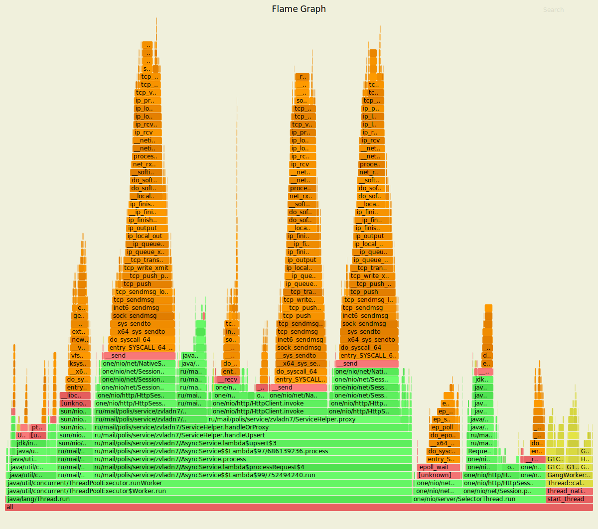
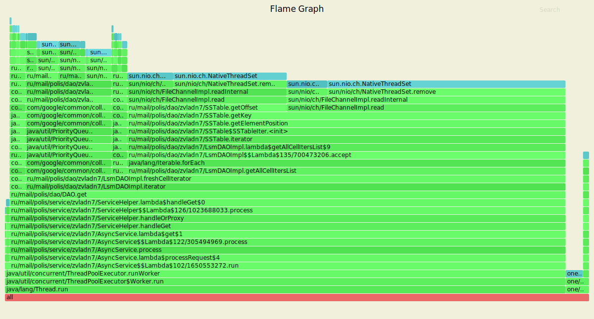

# Нагрузочное тестирование с помощью wrk2

### 1) Тестирование PUT запросов

Параметры запуска тестов:
1. Thread - 4
2. Connection - 64
3. Requests per second - 40000
4. Duration - 3m

`wrk2 -t4 -c64 -40000 -d3m -s wrk/put.lua --latency  http://localhost:8080`

Running 3m test @ http://localhost:8080
  4 threads and 64 connections
  
      Thread calibration: mean lat.: 1.654ms, rate sampling interval: 10ms
      Thread calibration: mean lat.: 1.654ms, rate sampling interval: 10ms
      Thread calibration: mean lat.: 1.647ms, rate sampling interval: 10ms
      Thread calibration: mean lat.: 1.682ms, rate sampling interval: 10ms
      Thread Stats   Avg      Stdev     Max   +/- Stdev
        Latency     2.71ms    8.25ms 203.90ms   96.86%
        Req/Sec    10.55k     1.57k   29.56k    85.96%
  Latency Distribution (HdrHistogram - Recorded Latency)
      
     50.000%    1.40ms
     75.000%    2.02ms
     90.000%    3.14ms
     99.000%   28.43ms
     99.900%  142.98ms
     99.990%  181.76ms
     99.999%  198.53ms
    100.000%  204.03ms

  Detailed Percentile spectrum:
  
       Value   Percentile   TotalCount 1/(1-Percentile)

       0.041     0.000000            2         1.00
       0.664     0.100000       680540         1.11
       0.883     0.200000      1361633         1.25
       1.062     0.300000      2042643         1.43
       1.230     0.400000      2719511         1.67
       1.405     0.500000      3400113         2.00
       1.500     0.550000      3740739         2.22
       1.603     0.600000      4079938         2.50
       1.718     0.650000      4418381         2.86
       1.853     0.700000      4758383         3.33
       2.015     0.750000      5098055         4.00
       2.109     0.775000      5268331         4.44
       2.215     0.800000      5439791         5.00
       2.337     0.825000      5609492         5.71
       2.485     0.850000      5777233         6.67
       2.693     0.875000      5947526         8.00
       2.855     0.887500      6032696         8.89
       3.137     0.900000      6117356        10.00
       3.805     0.912500      6202041        11.43
       4.799     0.925000      6287265        13.33
       5.935     0.937500      6372101        16.00
       6.579     0.943750      6414423        17.78
       7.315     0.950000      6457089        20.00
       8.215     0.956250      6499601        22.86
       9.399     0.962500      6541864        26.67
      11.031     0.968750      6584454        32.00
      12.039     0.971875      6605601        35.56
      13.223     0.975000      6626935        40.00
      14.671     0.978125      6648057        45.71
      16.687     0.981250      6669369        53.33
      19.551     0.984375      6690626        64.00
      21.359     0.985938      6701175        71.11
      23.599     0.987500      6711820        80.00
      26.303     0.989062      6722450        91.43
      30.191     0.990625      6733028       106.67
      35.647     0.992188      6743666       128.00
      39.743     0.992969      6748988       142.22
      44.703     0.993750      6754275       160.00
      51.647     0.994531      6759583       182.86
      59.615     0.995313      6764884       213.33
      67.199     0.996094      6770215       256.00
      70.911     0.996484      6772854       284.44
      75.327     0.996875      6775530       320.00
      80.511     0.997266      6778156       365.71
      87.551     0.997656      6780817       426.67
      97.279     0.998047      6783481       512.00
     102.143     0.998242      6784792       568.89
     108.543     0.998437      6786127       640.00
     119.167     0.998633      6787446       731.43
     135.423     0.998828      6788771       853.33
     143.743     0.999023      6790118      1024.00
     146.687     0.999121      6790775      1137.78
     149.759     0.999219      6791427      1280.00
     153.215     0.999316      6792111      1462.86
     156.799     0.999414      6792761      1706.67
     160.767     0.999512      6793426      2048.00
     163.199     0.999561      6793753      2275.56
     165.503     0.999609      6794092      2560.00
     167.423     0.999658      6794419      2925.71
     169.983     0.999707      6794755      3413.33
     172.287     0.999756      6795077      4096.00
     173.951     0.999780      6795244      4551.11
     175.231     0.999805      6795411      5120.00
     176.639     0.999829      6795577      5851.43
     178.175     0.999854      6795744      6826.67
     179.711     0.999878      6795915      8192.00
     180.607     0.999890      6795989      9102.22
     181.887     0.999902      6796076     10240.00
     183.039     0.999915      6796161     11702.86
     184.703     0.999927      6796238     13653.33
     186.495     0.999939      6796327     16384.00
     187.135     0.999945      6796370     18204.44
     187.903     0.999951      6796405     20480.00
     189.183     0.999957      6796446     23405.71
     190.079     0.999963      6796490     27306.67
     191.359     0.999969      6796528     32768.00
     192.255     0.999973      6796549     36408.89
     193.279     0.999976      6796570     40960.00
     194.047     0.999979      6796590     46811.43
     194.815     0.999982      6796612     54613.33
     195.839     0.999985      6796634     65536.00
     196.223     0.999986      6796643     72817.78
     197.375     0.999988      6796653     81920.00
     198.399     0.999989      6796664     93622.86
     199.295     0.999991      6796673    109226.67
     200.703     0.999992      6796685    131072.00
     201.087     0.999993      6796689    145635.56
     201.343     0.999994      6796694    163840.00
     201.727     0.999995      6796699    187245.71
     202.111     0.999995      6796707    218453.33
     202.239     0.999996      6796710    262144.00
     202.495     0.999997      6796716    291271.11
     202.495     0.999997      6796716    327680.00
     202.623     0.999997      6796718    374491.43
     202.751     0.999998      6796720    436906.67
     202.879     0.999998      6796726    524288.00
     202.879     0.999998      6796726    582542.22
     202.879     0.999998      6796726    655360.00
     202.879     0.999999      6796726    748982.86
     203.263     0.999999      6796728    873813.33
     203.391     0.999999      6796730   1048576.00
     203.391     0.999999      6796730   1165084.44
     203.391     0.999999      6796730   1310720.00
     203.647     0.999999      6796732   1497965.71
     203.647     0.999999      6796732   1747626.67
     203.647     1.000000      6796732   2097152.00
     203.775     1.000000      6796733   2330168.89
     203.775     1.000000      6796733   2621440.00
     203.775     1.000000      6796733   2995931.43
     203.903     1.000000      6796734   3495253.33
     203.903     1.000000      6796734   4194304.00
     203.903     1.000000      6796734   4660337.78
     203.903     1.000000      6796734   5242880.00
     203.903     1.000000      6796734   5991862.86
     204.031     1.000000      6796735   6990506.67
     204.031     1.000000      6796735          inf
    #[Mean    =        2.706, StdDeviation   =        8.254]
    #[Max     =      203.904, Total count    =      6796735]
    #[Buckets =           27, SubBuckets     =         2048]
----------------------------------------------------------
  7179159 requests in 3.00m, 586.50MB read
    
    Requests/sec:  39884.60
    Transfer/sec:      3.26MB

В результате нагрузочного тестирования с помощью `wrk2` получили, что по сравнению с предыдущим
этапом количество запросов, обрабатываемых за секунду и укладывающихся в приемлемый `latency` 
сократилось в 2 раза. Также видно, что 1% запросов требует большей задержки, чем 99%. Можно предположить, 
что это происходит из-за `GC`, поскольку нам приходится проксировать запросы на другие сервисы, если изначально
нода, на которую пришели данные, не является локальной для них. А следовательно, приходится заново вычитывать данные, 
парсить запрос и тд, что, безусловно, требует новых аллокаций.

Также из `percentile` можно увидеть, что по сравнению с прошлым этапом, где его возрастание наблюдается
с плавным увеличением времени задержки, в данном этапе при значении `0.978125` значение задержки далее начинает
более стремительно расти и в итоге достигает `200ms` при `percentile` = 1.

#### Результаты профилирования async-profiler (CPU): 

`./profiler.sh -d 20 -e cpu -f ./hw4/cpu_put.svg 12764`

Анализ: 
 - Обработка запроса: 14.23%, где:
    - Чтение из сокета: 4.47%
    - processHttpBuffer: 9.59%
 - ThreadPoolExecutor: Worker.run: 69.01%, где:
    - getTask - получение обработчика из ArrayBlockingQueue: 8.25%
    - Обработка лямбды, поставленной в очередь AsyncService занимает: 54.27%, где:
        - handleOrProxy: 53.6%:
            - process: 19.11%
                - sendResponse: 13.93%(в том числе 12.62% - это запись в сокет)
                - DAO.upsert: 5.01%, где 4.34% занимает запись key-value в ConcurrentSkipListMap
            - ServiceHelper.proxy: 32.85%
                - HttpClient.invoke: 19.76%
                - sendResponse: 12.28%
            - nodeFor - определение ноды для обработки запроса: 1.25%    
    - Flush в пуле потоков ExecutorService - 6.16%
 - NativeSelector.select - 8.03%(в том числе блокировка Selector'ов - 7.9%)
 
По результатам профилирования видно, что расход CPU по сравнению с предыдущим этапом вырос 
на 21% (HttpClient.invoke + ServiceTopology.nodeFor). `sendResponse` в `ServiceHelper.proxy`
не увеличил расход CPU, поскольку - это отправка ответов на запросы с других нод. Если посмотреть
суммарный расход CPU в методе `process` и `proxy`, то получим около 25%, что сравнимо с предыдущим 
этапом. 12.28% `sendResponse` в `ServiceHelper.proxy` говорит нам о том, что чуть меньше половины 
запросов было проксировано на другие шарды.

В целом остальные показатели использует столько же CPU, уменьшение их процентных составляющих является
лишь результатом увеличения общего значения использования CPU, а значит и знаменателя при их расчете.

#### Результаты профилирования async-profiler (ALLOC): 

`./profiler.sh -d 20 -e alloc -f ./hw4/alloc_put.svg 12764`

Анализ:
 - Выделение при обработки запроса занимает 37.68%, где:
    - handleParsedRequest - 7.57%, где:
        - handleRequest: 4.75%
            - AsyncService.upsert: - 2.04%
            - getRequiredParameter: 2.71%
        - Request.getPath: 2.39%
    - parseRequest - 12.92% (Request - 3.31%)
 
 Видно, что процентная составляющая аллокаций в разных методах сократилась, однако 
 это произошло не из-за их явного уменьшея, а из-за того, что общее количество выделения
 памяти увеличилось.
 - NativeSelector.select: 1.33%       
 - ThreadPoolExecutor: Worker.run: 60.98%, где:
    - Flush - 0.48%
        он требует крайне мало выделений, поскольку память под данные для записи уже была
        аллоцирована, а все записи идут на диск.
    - handleUpsert лямбда run - 59%
        - process:
            - DAO.upsert - 7.74%
            - sendResponse - 5.07%
            - Response - 3.94%
        - proxy (HttpClient.invoke) - 27.5%
        - nodeFor - 5.48%    
    - getTask - 1.51%
    
Большая часть памяти все также выделяется для создания байтовых буферов, для парса, создания и обработки запросов.
По сравнению с предыдущим этапом видно, что появились значительные аллокации при проксировании запроса на шард, 
где должны лежать соответствующие ключ и значение.(27.5%) А также 5.48% выделений для определения ноды, на которую
должна произойти запись.
 
#### Результаты профилирования async-profiler (LOCK): 

`./profiler.sh -d 20 -e lock -f ./hw4/lock_put.svg 12385` 
 
Анализ:
 - Постановка обработчика запросов в очередь ArrayBlockingQueue ExecutorService: 33.06%
 - Выборка обработчика запросов из очереди ArrayBlockingQueue ExecutorService: 39.2%
 - HttpClient.invoke: 13.27%
 - HttpSession - 13.62%

По сравнению с предыдущим этапом появилась значительная блокировка, 13.27%) при ожидании ответа на запросы
в случае, если они были проксированы на другой сервис.
Также видно, что увеличилось время ожидания обработки запроса в очереди пула потоков, поскольку
некоторые запросы приходится проксировать на другие нады.
Однако блокировки при постановке и выборки задач обработки запросов из ArrayBlockingQueue
ExecutorService все так же занимают большую часть времени.

### 2) Тестирование GET запросов

Параметры запуска тестов:
1. Thread - 4
2. Connection - 64
3. Requests per second - 2500
4. Duration - 3m

`wrk2 -t4 -c64 -R2500 -d60m -s wrk/get.lua --latency  http://localhost:8080`

Running 3m test @ http://localhost:8080
  4 threads and 64 connections
      
      Thread calibration: mean lat.: 3.035ms, rate sampling interval: 12ms
      Thread calibration: mean lat.: 3.959ms, rate sampling interval: 15ms
      Thread calibration: mean lat.: 3.082ms, rate sampling interval: 12ms
      Thread calibration: mean lat.: 3.075ms, rate sampling interval: 12ms
      Thread Stats   Avg      Stdev     Max   +/- Stdev
        Latency     4.65ms   11.98ms 245.25ms   97.36%
        Req/Sec   651.15    251.84     2.45k    76.73%
  Latency Distribution (HdrHistogram - Recorded Latency)
      
     50.000%    2.54ms
     75.000%    3.78ms
     90.000%    6.68ms
     99.000%   57.06ms
     99.900%  183.42ms
     99.990%  227.84ms
     99.999%  237.44ms
    100.000%  245.38ms

  Detailed Percentile spectrum:
  
       Value   Percentile   TotalCount 1/(1-Percentile)

       0.265     0.000000            1         1.00
       1.395     0.100000        42572         1.11
       1.719     0.200000        85031         1.25
       1.986     0.300000       127561         1.43
       2.247     0.400000       170013         1.67
       2.535     0.500000       212641         2.00
       2.695     0.550000       233688         2.22
       2.883     0.600000       255000         2.50
       3.105     0.650000       276120         2.86
       3.393     0.700000       297365         3.33
       3.775     0.750000       318615         4.00
       4.025     0.775000       329237         4.44
       4.323     0.800000       339905         5.00
       4.687     0.825000       350504         5.71
       5.155     0.850000       361100         6.67
       5.791     0.875000       371737         8.00
       6.203     0.887500       377013         8.89
       6.679     0.900000       382348        10.00
       7.259     0.912500       387655        11.43
       7.915     0.925000       392942        13.33
       8.711     0.937500       398264        16.00
       9.175     0.943750       400949        17.78
       9.719     0.950000       403567        20.00
      10.415     0.956250       406222        22.86
      11.471     0.962500       408870        26.67
      13.343     0.968750       411530        32.00
      15.055     0.971875       412857        35.56
      18.127     0.975000       414183        40.00
      22.639     0.978125       415507        45.71
      27.887     0.981250       416836        53.33
      35.391     0.984375       418162        64.00
      40.607     0.985938       418827        71.11
      46.495     0.987500       419491        80.00
      53.023     0.989062       420154        91.43
      60.159     0.990625       420818       106.67
      68.735     0.992188       421482       128.00
      73.535     0.992969       421813       142.22
      78.783     0.993750       422144       160.00
      84.671     0.994531       422477       182.86
      91.391     0.995313       422809       213.33
     101.119     0.996094       423139       256.00
     108.287     0.996484       423307       284.44
     117.311     0.996875       423472       320.00
     123.583     0.997266       423639       365.71
     133.631     0.997656       423804       426.67
     142.335     0.998047       423971       512.00
     148.351     0.998242       424055       568.89
     152.703     0.998437       424138       640.00
     158.847     0.998633       424220       731.43
     168.447     0.998828       424301       853.33
     184.831     0.999023       424384      1024.00
     189.695     0.999121       424427      1137.78
     198.271     0.999219       424468      1280.00
     202.367     0.999316       424508      1462.86
     206.847     0.999414       424550      1706.67
     211.327     0.999512       424594      2048.00
     212.863     0.999561       424613      2275.56
     215.295     0.999609       424633      2560.00
     217.215     0.999658       424653      2925.71
     219.903     0.999707       424674      3413.33
     221.695     0.999756       424696      4096.00
     222.335     0.999780       424707      4551.11
     222.975     0.999805       424718      5120.00
     224.127     0.999829       424726      5851.43
     225.151     0.999854       424736      6826.67
     226.815     0.999878       424748      8192.00
     227.327     0.999890       424752      9102.22
     228.351     0.999902       424757     10240.00
     229.247     0.999915       424762     11702.86
     229.759     0.999927       424767     13653.33
     230.655     0.999939       424773     16384.00
     230.911     0.999945       424776     18204.44
     231.551     0.999951       424779     20480.00
     231.679     0.999957       424780     23405.71
     231.807     0.999963       424783     27306.67
     232.575     0.999969       424787     32768.00
     232.575     0.999973       424787     36408.89
     233.215     0.999976       424788     40960.00
     233.343     0.999979       424789     46811.43
     235.263     0.999982       424791     54613.33
     235.519     0.999985       424792     65536.00
     236.799     0.999986       424793     72817.78
     236.799     0.999988       424793     81920.00
     237.439     0.999989       424794     93622.86
     237.695     0.999991       424795    109226.67
     237.695     0.999992       424795    131072.00
     238.079     0.999993       424796    145635.56
     238.079     0.999994       424796    163840.00
     238.079     0.999995       424796    187245.71
     238.847     0.999995       424797    218453.33
     238.847     0.999996       424797    262144.00
     238.847     0.999997       424797    291271.11
     238.847     0.999997       424797    327680.00
     238.847     0.999997       424797    374491.43
     245.375     0.999998       424798    436906.67
     245.375     1.000000       424798          inf
    #[Mean    =        4.648, StdDeviation   =       11.984]
    #[Max     =      245.248, Total count    =       424798]
    #[Buckets =           27, SubBuckets     =         2048]
----------------------------------------------------------
  449331 requests in 3.00m, 40.17MB read
    
    Requests/sec:   2496.27
    Transfer/sec:    228.51KB

По результатам нагрузочного тестирования по сранению с предыдущим этапом как и в случае
с PUT запросами видим, что 1% запросов имеет более высокий `latency`, остальные 99% сравнимы
с прошлым этапом. Можно предположить, как это уже делалось выше, что это происходит из-за
работы `GC`, поскольку в данном случае некоторые запросы необходимо проксировать, а значит 
заново парсить запрос и тд. Также байтовые буферы должны выделяться самим HttpClient для 
передачи соответствующего запроса на другую ноду.

Как и в случае с PUT запросами видим резкое увеличение задержки после `0.968750` персентиля, 
в прошлом же этапе наблюдался более спокойный рост(что опять же можно списать на работу сборщика).

#### Результаты профилирования async-profiler (CPU): 

`./profiler.sh -d 20 -e cpu -f ./hw4/cpu_get.svg 17479`

Анализ:
 - ThreadPoolExecutor: Worker.run: 95.31%:
    - DAO.get - 84.62%
        - DAO.iterator занимает 82.79%
            - Merge различных iterator'ов занимает - 10.36%%
            - getAllCellIters: 70.2%
                 - 70,2 CPU тратится на то, чтобы бинарным поиском найти место в файле,
                      с которого нужно читать, из которых 22.65% - это чтение смещений из файла, 
                      и еще 46.19% чтение остальных данных
            - CollapseIterator - 1.81%         
        - TransformIterator - 1.73%
    - sendResponse - 2.43%  
    - ServiceHelper.proxy: 5.51%
        - HttpClient.invoke: 3.81%
        - sendResponse: 1.64%
        - nodeFor - 0.27%
 - Session.process - 2.85%        
 
 
Видно, что по сравнению с предыдущим этапом, где DAO.get занимал 97%, DAO.get стал занимать
84.62% времени CPU. Произошло это за счёт того, что необходимо определять на какой ноде лежат
данные, перенаправлять туда запрос, и только потом читать данные с диска. Следовательно, за 
счёт этого, как видно из `flame graph` получили 5.51% дополнительной работы CPU. 
Также видим увеличение Session.process в 5 раз. Это анологично происходит из-за того, что
запросы приходится проксировать на другие сервисы, а, следовательно, иногда обрабатывать дважды. 

Однако, несмотря на все эти факторы, DAO.get, а именно работа с итератором занимает большее 
время работы CPU, что является логичным, поскольку чтение из файлов, мердж данных и определение 
их актуальности является тяжелой задачей, особенно, когда данных становится много.

#### Результаты профилирования async-profiler (ALLOC): 

`./profiler.sh -d 20 -e alloc -f ./hw4/alloc_get.svg 17479`

Анализ:
 - Обработка запроса: 40.12%
 - ThreadPoolExecutor: Worker.run: 58.23%:
    - Iterator: 35.51%
        - Merge Iterator и его Priority Queue занимают - 6.28%
        - CollapseIter - 1.35%
        - getAllCellIters - 27.15%, при этом в основном память выделяется под байтовый буфер для 
            текущего ключа в бинарном поиске, где 23.65% выделяется под сам ключ, а 3.23% на смещение
            до него 
    - Transformed.iterator - 1.66%
    - HttpClient.invoke - 19.14%

Из результатов профилирования видно, что по сравнения с предыдущим этапом, где 13.79% аллокаций
происходило при обработке запроса, в данном этапе в 3 раза увеличилось число аллокаций при обработке
запроса, поскольку запросы приходится проксировать на другие ноды, если нода, на которую пришел
запрос, не отвечает за данный ключ.
Также видим, что помимо этого дополнительный выделения памяти требуются при проксировании этого запроса
через HttpClient, где аллоцируется буфер для чтения `response`.

По прежнему основными объектами аллокаций являются байтовый буферы и массивы.
 
 #### Результаты профилирования async-profiler (LOCK): 
 
 
`./profiler.sh -d 20 -e alloc -f ./hw4/alloc_get.svg 17479`

Анализ:
 - DAO.get - 96.8%: 
    - Iterator: 95.31%
         - MergeIterator - 16.43%, Из `flame graph` видно, что блокировка происходит
         при вызове SSTable.get, где блокировкой является обращение к файлу.
         - CollapseIterator - 1.55%. (Аналогично)
         - getAllCellIters - 77.34%. Блокировки являются обращением к файлам, где 28.08% - это 
         блокировки при получении смещения на ключ, 49.25% - это остальное чтение из файла.
    - TransformedIterator - 1.49%. Аналогично обращение к файлу при SSTable.get
 - ThreadPoolExecutor.getTask - 0.32%
 - ThreadPoolExecutor.execute - 0.26%

Также как и в предыдущем этапе из анализа видно, что почти все время занимают блокировки в файлах, что является логичным при GET запросах,
поскольку необходимо прочитать все значения из файлов, смерджить их и выбрать наиболее `свежие`
Блокировки при проксировании запросов не находятся на `flame graphe`, предположительно, так как они слишком
малы.
