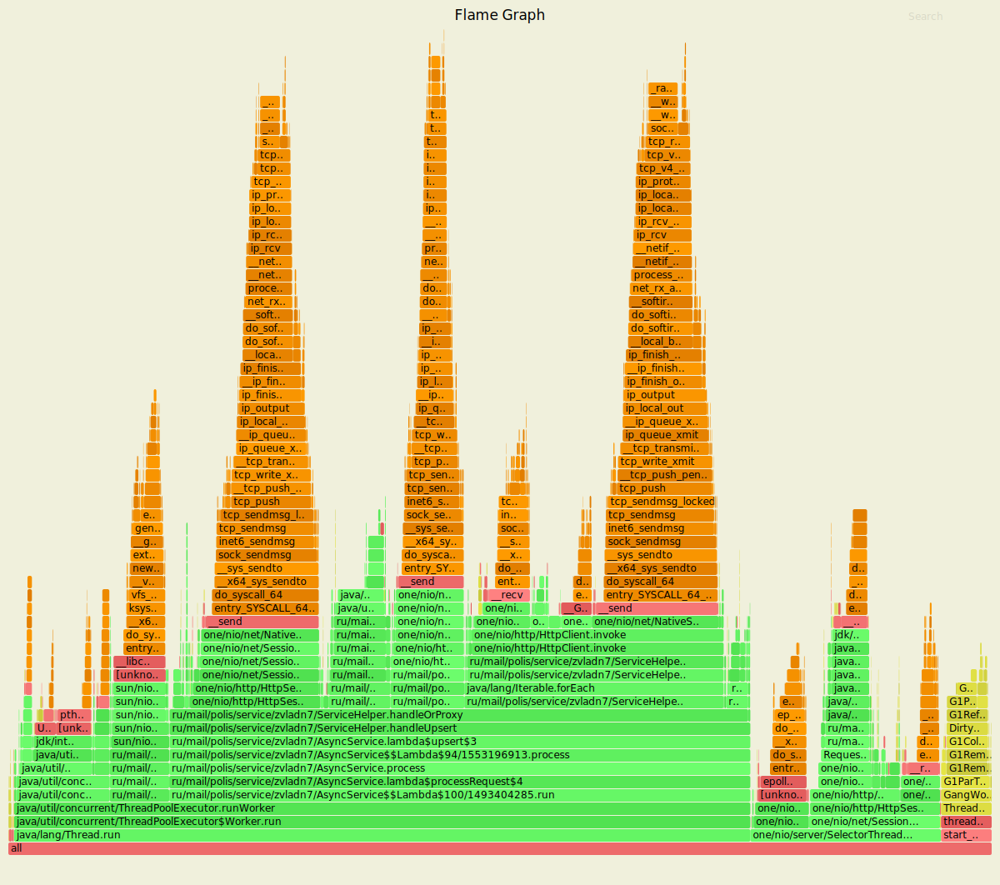
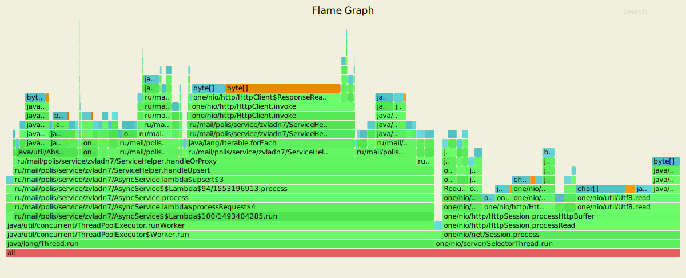
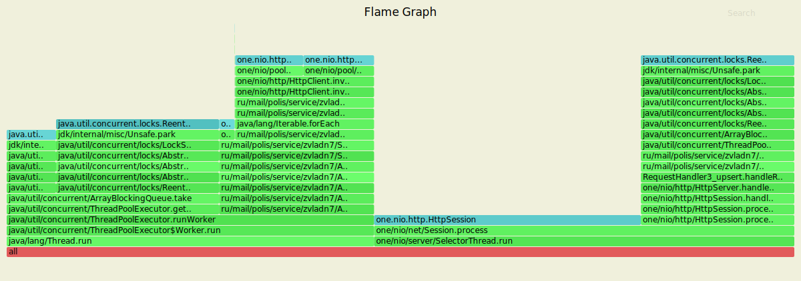
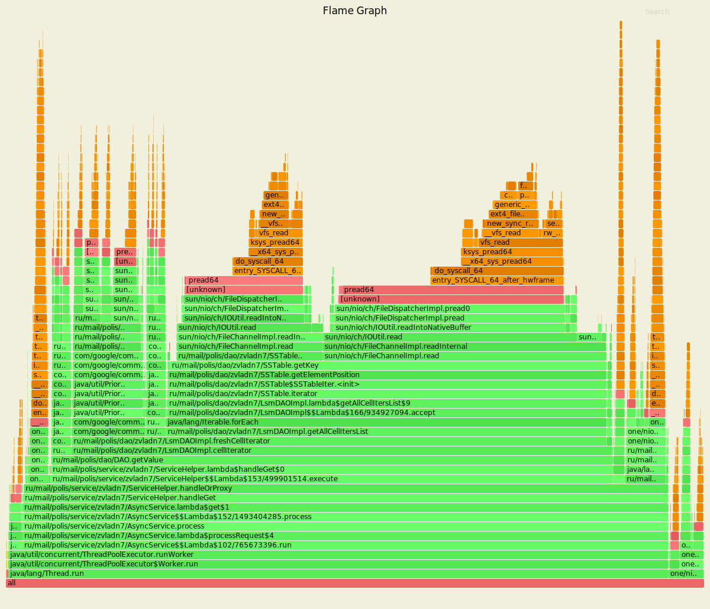
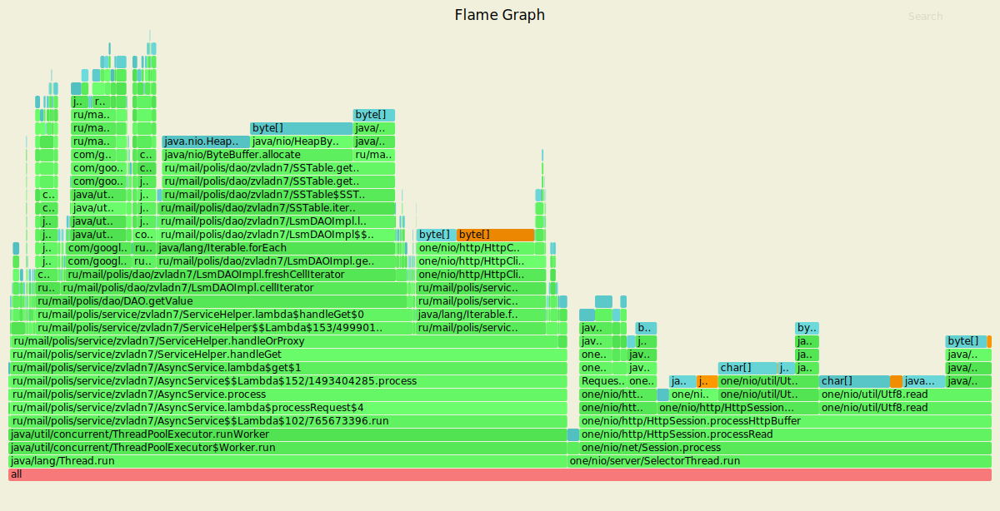
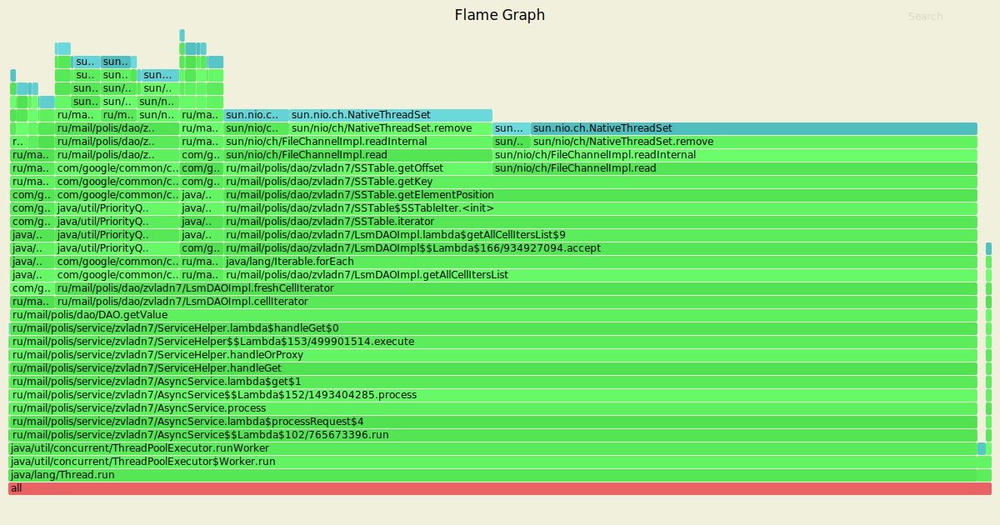

# Нагрузочное тестирование с помощью wrk2

### 1) Тестирование PUT запросов

Параметры запуска тестов:
1. Thread - 4
2. Connection - 64
3. Requests per second - 15000
4. Duration - 3m

`wrk2 -t4 -c64 -15000 -d3m -s wrk/put.lua --latency  http://localhost:8080`

Running 3m test @ http://localhost:8080
  4 threads and 64 connections
      
      Thread calibration: mean lat.: 1.529ms, rate sampling interval: 10ms
      Thread calibration: mean lat.: 1.528ms, rate sampling interval: 10ms
      Thread calibration: mean lat.: 1.544ms, rate sampling interval: 10ms
      Thread calibration: mean lat.: 1.616ms, rate sampling interval: 10ms
      Thread Stats   Avg      Stdev     Max   +/- Stdev
        Latency     1.68ms    3.07ms  80.38ms   96.14%
        Req/Sec     3.95k   550.06     8.89k    79.51%
  Latency Distribution (HdrHistogram - Recorded Latency)
  
     50.000%    1.19ms
     75.000%    1.63ms
     90.000%    2.22ms
     99.000%   13.74ms
     99.900%   41.41ms
     99.990%   59.33ms
     99.999%   69.95ms
    100.000%   80.45ms

  Detailed Percentile spectrum:
  
       Value   Percentile   TotalCount 1/(1-Percentile)

       0.104     0.000000            1         1.00
       0.507     0.100000       255085         1.11
       0.692     0.200000       510242         1.25
       0.862     0.300000       765547         1.43
       1.025     0.400000      1020049         1.67
       1.188     0.500000      1275561         2.00
       1.271     0.550000      1402874         2.22
       1.355     0.600000      1530525         2.50
       1.441     0.650000      1657996         2.86
       1.531     0.700000      1784433         3.33
       1.632     0.750000      1912264         4.00
       1.689     0.775000      1975407         4.44
       1.754     0.800000      2039478         5.00
       1.829     0.825000      2102889         5.71
       1.921     0.850000      2166661         6.67
       2.042     0.875000      2230372         8.00
       2.121     0.887500      2262176         8.89
       2.225     0.900000      2294289        10.00
       2.373     0.912500      2326029        11.43
       2.625     0.925000      2357677        13.33
       3.095     0.937500      2389546        16.00
       3.423     0.943750      2405474        17.78
       3.819     0.950000      2421345        20.00
       4.295     0.956250      2437360        22.86
       4.863     0.962500      2453265        26.67
       5.591     0.968750      2469204        32.00
       6.031     0.971875      2477145        35.56
       6.567     0.975000      2485086        40.00
       7.227     0.978125      2493055        45.71
       8.095     0.981250      2500986        53.33
       9.279     0.984375      2508973        64.00
      10.039     0.985938      2512935        71.11
      11.095     0.987500      2516936        80.00
      12.583     0.989062      2520902        91.43
      14.711     0.990625      2524885       106.67
      18.143     0.992188      2528869       128.00
      20.031     0.992969      2530854       142.22
      21.999     0.993750      2532848       160.00
      24.143     0.994531      2534841       182.86
      26.527     0.995313      2536832       213.33
      29.151     0.996094      2538819       256.00
      30.383     0.996484      2539817       284.44
      31.807     0.996875      2540818       320.00
      33.247     0.997266      2541817       365.71
      34.623     0.997656      2542812       426.67
      36.063     0.998047      2543809       512.00
      36.927     0.998242      2544307       568.89
      37.951     0.998437      2544797       640.00
      39.039     0.998633      2545291       731.43
      40.223     0.998828      2545789       853.33
      41.535     0.999023      2546286      1024.00
      42.591     0.999121      2546539      1137.78
      43.551     0.999219      2546786      1280.00
      44.575     0.999316      2547036      1462.86
      45.823     0.999414      2547288      1706.67
      47.487     0.999512      2547531      2048.00
      48.479     0.999561      2547659      2275.56
      49.247     0.999609      2547781      2560.00
      50.143     0.999658      2547905      2925.71
      51.391     0.999707      2548030      3413.33
      52.991     0.999756      2548159      4096.00
      53.695     0.999780      2548215      4551.11
      54.527     0.999805      2548278      5120.00
      55.359     0.999829      2548340      5851.43
      56.511     0.999854      2548403      6826.67
      58.111     0.999878      2548464      8192.00
      58.847     0.999890      2548495      9102.22
      59.487     0.999902      2548527     10240.00
      60.127     0.999915      2548560     11702.86
      60.671     0.999927      2548589     13653.33
      61.535     0.999939      2548620     16384.00
      62.207     0.999945      2548635     18204.44
      62.783     0.999951      2548652     20480.00
      63.295     0.999957      2548667     23405.71
      63.807     0.999963      2548682     27306.67
      64.767     0.999969      2548698     32768.00
      65.183     0.999973      2548705     36408.89
      66.111     0.999976      2548713     40960.00
      66.431     0.999979      2548721     46811.43
      67.199     0.999982      2548729     54613.33
      68.031     0.999985      2548737     65536.00
      68.287     0.999986      2548741     72817.78
      68.927     0.999988      2548745     81920.00
      69.759     0.999989      2548748     93622.86
      70.463     0.999991      2548753    109226.67
      71.807     0.999992      2548756    131072.00
      72.127     0.999993      2548758    145635.56
      73.087     0.999994      2548760    163840.00
      73.343     0.999995      2548762    187245.71
      73.791     0.999995      2548764    218453.33
      74.239     0.999996      2548766    262144.00
      74.431     0.999997      2548767    291271.11
      75.135     0.999997      2548768    327680.00
      75.647     0.999997      2548769    374491.43
      76.095     0.999998      2548770    436906.67
      76.223     0.999998      2548771    524288.00
      76.223     0.999998      2548771    582542.22
      77.055     0.999998      2548772    655360.00
      77.055     0.999999      2548772    748982.86
      78.143     0.999999      2548773    873813.33
      78.143     0.999999      2548773   1048576.00
      78.143     0.999999      2548773   1165084.44
      78.975     0.999999      2548774   1310720.00
      78.975     0.999999      2548774   1497965.71
      78.975     0.999999      2548774   1747626.67
      78.975     1.000000      2548774   2097152.00
      78.975     1.000000      2548774   2330168.89
      80.447     1.000000      2548775   2621440.00
      80.447     1.000000      2548775          inf
      
    #[Mean    =        1.682, StdDeviation   =        3.073]
    #[Max     =       80.384, Total count    =      2548775]
    #[Buckets =           27, SubBuckets     =         2048]
----------------------------------------------------------
  2695807 requests in 3.00m, 172.25MB read

    Requests/sec:  14976.85
    Transfer/sec:      0.96MB

В результате репликации количество запросов, которые может обрабатывать сервис уменьшилось. 
Причем, что логично, уменьшилось оно в 3 раза, поскольку по мы используем значение 
 `replicas` по умолчанию, а значит кворум(2/3), то есть как минимум 2 копии данных, а в лучшем
случае 3. Однако при тестировании ноды не отключались => 3 копии

#### Результаты профилирования async-profiler (CPU): 

`./profiler.sh -d 20 -e cpu -f ./hw5/cpu_put.svg 17375`

Анализ: 
 - Обработка запроса: 13.34%, где:
    - Чтение из сокета: 4.03%
    - processHttpBuffer: 9.12%
 - ThreadPoolExecutor: Worker.run: 74.87%, где:
    - getTask - получение обработчика из ArrayBlockingQueue: 9.5%
    - Обработка лямбды, поставленной в очередь AsyncService занимает: 59.09%, где:
        - handleOrProxy: 53.6%:
            - process: 19.11%
                - sendResponse: 13.3%(в том числе 11.99% - это запись в сокет)
                - DAO.upsert: 5.67%, где 5.03% занимает запись key-value в ConcurrentSkipListMap
                - resolve - 7.51% (7.50% -sendResponse)
                - ServiceHelper.proxy: 26.37%(HttpClient.invoke: 25.63%)
            - nodesForKey - определение нод репликации: 2.25%    
    - Flush в пуле потоков ExecutorService - 6.06%
 - NativeSelector.select - 5.62%
 
По результатам профилирования CPU по сравнению с прошлым этапом видно, что определение нод для
репликации с помощью `nodesForKey` занимают в 2 раза больше CPU, чем для реализации `nodeFor`
для шардирования, что логично, поскольку кроме операции `tailMap` для `hashRing` необходимо 
также проитерироваться по циклу, чтобы найти следующие `n - 1` ноды, на которые данные будут
также отреплицированны.

Доля работы Worker'а ExecutorService выросла на 5% за счёт того, что необходимо проитерироваться
по списку выбранных нод, синхронно выполнить запросы с помощью HttpClient, а также разрешить
конфликты в случае если ответы от нод различаются.

Доли CPU у `Session.process, flush, getTask, NativeSelector.select` остались прежними.

#### Результаты профилирования async-profiler (ALLOC): 

`./profiler.sh -d 20 -e alloc -f ./hw5/alloc_put.svg 17375`

Анализ:
 - Выделение при обработки запроса занимает 35.3%, где:
    - handleParsedRequest - 5.96%, где:
        - handleRequest: 3.84%
        - Request.getPath: 2.13%
    - parseRequest - 10.7% (Request - 2.5%)
 - NativeSelector.select: 1.19%       
 - ThreadPoolExecutor: Worker.run: 63.52%, где:
    - handleUpsert лямбда run - 59%
        - process:
            - DAO.upsert - 5.12%
            - sendResponse - 2.49%
            - Response - 2.25%
        - proxy (HttpClient.invoke) - 24.42%
            Как я понял, что оранжевый байтовый массив - это массив `body`, соответственно
            можем в видеть как он вырос на 4% по сравнению с предыдущим этапо. Это можно 
            объяснить тем, что помимо самого `value` ответ запроса мы кладем `timestamp`, 
            что приводит к увеличению его доли на `flame graph`
        - nodeFor - 5.48%    
        - nodesForKey - 9.09%, что на 3.5% больше доли для поиска одной ноды в топологии для 
        предыдущего этапа, что происходит из-за того, что нам нужно также аллоцировать 1 или 2
        итератора в зависимости от ситуации для определения множества нод, на которые будут
        реплицироваться данные
    - getTask - 1.05%
    

#### Результаты профилирования async-profiler (LOCK): 

`./profiler.sh -d 20 -e lock -f ./hw5/lock_put.svg 17375` 
 
Анализ:
 - Постановка обработчика запросов в очередь ArrayBlockingQueue ExecutorService: 19.48%
 - Выборка обработчика запросов из очереди ArrayBlockingQueue ExecutorService: 26.96%
 - HttpClient.invoke: 17.63%
 - HttpSession - 33.87%
 - sendResponse - 1.99%

По сравнению с предыдущим этапом появилась значительная блокировка, 13.27%) при ожидании ответа на запросы
в случае, если они были проксированы на другой сервис.
Также видно, что увеличилось время ожидания обработки запроса в очереди пула потоков, поскольку
некоторые запросы приходится проксировать на другие нады.
Однако блокировки при постановке и выборки задач обработки запросов из ArrayBlockingQueue
ExecutorService все так же занимают большую часть времени.

По сравнению с предыдущим этапов видно, что блокировка при попытка получить соединения из пула
и вернуть соединение в пул у HttpClient.invoke увеличилось на 4%.
Также блокировка HttpSession.process по сравнению с предыдущим этапом увеличилась на 20%.
Это происходит потому, что нам приходит проксировать 2 запроса на другие ноды, тем самым вновь
занимая Selector'ы. 

### 2) Тестирование GET запросов

Параметры запуска тестов:
1. Thread - 4
2. Connection - 64
3. Requests per second - 2000
4. Duration - 3m

`wrk2 -t4 -c64 -R2000 -d60m -s wrk/get.lua --latency  http://localhost:8080`

Running 3m test @ http://localhost:8080
  4 threads and 64 connections
      
      Thread calibration: mean lat.: 3.718ms, rate sampling interval: 14ms
      Thread calibration: mean lat.: 3.694ms, rate sampling interval: 14ms
      Thread calibration: mean lat.: 3.698ms, rate sampling interval: 13ms
      Thread calibration: mean lat.: 3.675ms, rate sampling interval: 14ms
      Thread Stats   Avg      Stdev     Max   +/- Stdev
        Latency     4.26ms   13.14ms 217.09ms   98.27%
        Req/Sec   389.37     69.53     1.36k    64.31%
  Latency Distribution (HdrHistogram - Recorded Latency)
      
     50.000%    2.43ms
     75.000%    3.03ms
     90.000%    4.24ms
     99.000%   70.33ms
     99.900%  183.68ms
     99.990%  202.24ms
     99.999%  208.00ms
    100.000%  217.21ms

  Detailed Percentile spectrum:
  
       Value   Percentile   TotalCount 1/(1-Percentile)

       0.670     0.000000            1         1.00
       1.414     0.100000        25561         1.11
       1.739     0.200000        51013         1.25
       1.973     0.300000        76531         1.43
       2.205     0.400000       102021         1.67
       2.433     0.500000       127675         2.00
       2.543     0.550000       140390         2.22
       2.651     0.600000       153019         2.50
       2.763     0.650000       165738         2.86
       2.885     0.700000       178430         3.33
       3.027     0.750000       191282         4.00
       3.111     0.775000       197678         4.44
       3.205     0.800000       203916         5.00
       3.319     0.825000       210330         5.71
       3.463     0.850000       216712         6.67
       3.677     0.875000       223063         8.00
       3.863     0.887500       226247         8.89
       4.235     0.900000       229421        10.00
       4.959     0.912500       232593        11.43
       5.755     0.925000       235781        13.33
       6.643     0.937500       238965        16.00
       7.167     0.943750       240556        17.78
       7.747     0.950000       242157        20.00
       8.431     0.956250       243742        22.86
       9.199     0.962500       245343        26.67
      10.199     0.968750       246933        32.00
      10.879     0.971875       247729        35.56
      11.735     0.975000       248518        40.00
      12.911     0.978125       249315        45.71
      14.991     0.981250       250112        53.33
      24.095     0.984375       250908        64.00
      40.895     0.985938       251306        71.11
      56.831     0.987500       251705        80.00
      65.471     0.989062       252103        91.43
      73.855     0.990625       252503       106.67
      86.271     0.992188       252902       128.00
      94.399     0.992969       253098       142.22
     101.567     0.993750       253297       160.00
     109.503     0.994531       253497       182.86
     117.439     0.995313       253697       213.33
     125.503     0.996094       253896       256.00
     130.495     0.996484       253994       284.44
     136.447     0.996875       254096       320.00
     143.871     0.997266       254194       365.71
     155.135     0.997656       254294       426.67
     165.887     0.998047       254393       512.00
     171.391     0.998242       254442       568.89
     174.975     0.998437       254493       640.00
     177.919     0.998633       254543       731.43
     180.863     0.998828       254593       853.33
     183.935     0.999023       254643      1024.00
     185.727     0.999121       254667      1137.78
     187.263     0.999219       254694      1280.00
     188.799     0.999316       254717      1462.86
     190.591     0.999414       254742      1706.67
     192.383     0.999512       254767      2048.00
     192.895     0.999561       254780      2275.56
     193.535     0.999609       254791      2560.00
     194.303     0.999658       254803      2925.71
     195.711     0.999707       254819      3413.33
     196.607     0.999756       254829      4096.00
     197.631     0.999780       254834      4551.11
     199.295     0.999805       254841      5120.00
     199.679     0.999829       254847      5851.43
     200.447     0.999854       254853      6826.67
     201.471     0.999878       254859      8192.00
     201.983     0.999890       254864      9102.22
     202.367     0.999902       254867     10240.00
     202.751     0.999915       254869     11702.86
     203.647     0.999927       254874     13653.33
     203.775     0.999939       254875     16384.00
     204.543     0.999945       254876     18204.44
     205.439     0.999951       254878     20480.00
     205.823     0.999957       254881     23405.71
     205.823     0.999963       254881     27306.67
     206.079     0.999969       254883     32768.00
     206.079     0.999973       254883     36408.89
     206.335     0.999976       254884     40960.00
     206.719     0.999979       254885     46811.43
     207.615     0.999982       254886     54613.33
     207.999     0.999985       254887     65536.00
     207.999     0.999986       254887     72817.78
     207.999     0.999988       254887     81920.00
     208.127     0.999989       254888     93622.86
     208.127     0.999991       254888    109226.67
     211.071     0.999992       254889    131072.00
     211.071     0.999993       254889    145635.56
     211.071     0.999994       254889    163840.00
     211.071     0.999995       254889    187245.71
     211.071     0.999995       254889    218453.33
     217.215     0.999996       254890    262144.00
     217.215     1.000000       254890          inf
     
    #[Mean    =        4.260, StdDeviation   =       13.136]
    #[Max     =      217.088, Total count    =       254890]
    #[Buckets =           27, SubBuckets     =         2048]
----------------------------------------------------------
  269976 requests in 3.00m, 19.09MB read

    Requests/sec:   1499.85
    Transfer/sec:    108.63KB

По сравнению с предыдущим этапом нагрузка(количетсво запросов в секунду), которую может
обрабатывать сервер уменьшилось на 1000 запросов. При 1600 запросах `latency` улетает в 
секунду, что уже неприемлимо. Это происходит из-за того, что мы добавили реплицирования,
а следовательно проксируем запрос уже не одну ноду, а на две.

#### Результаты профилирования async-profiler (CPU): 

`./profiler.sh -d 20 -e cpu -f ./hw4/cpu_get.svg 17375`

Анализ:
 - ThreadPoolExecutor: Worker.run: 94.55%:
    - DAO.getValue - 80.36%
        - DAO.cellIterator занимает 77.44%
            - Merge различных iterator'ов занимает - 10.46%%
            - getAllCellIters: 63.13%
                 - 63.13% CPU тратится на то, чтобы бинарным поиском найти место в файле,
                      с которого нужно читать, из которых 20.94% - это чтение смещений из файла, 
                      и еще 40.55% чтение остальных данных
            - CollapseIterator - 2.98%         
        - TransformIterator - 1.73%
    - sendResponse - 2.93%  
    - resolve - 1.62%
    - ServiceHelper.proxy: 5.79%
        - HttpClient.invoke: 5.68%
    - nodesForKey: 0.34%
 - Session.process - 3.45%        
 
По сравнению с предыдщим этапом основые изменения распределения CPU наблюдаются при выполнении
Worker'a. Доля DAO.getValue уменьшилась на 4%, getAllCellIters на 7%, а CollapseIterator на 1% увеличилось(так как 
перестали убирать `могилки` из выборки итератора). Также можно заметить, что доля CPU для разрешения
конфликтных ситаций занимает всего 1.62% CPU. К тому же, можно заметить, что доля HttpClient.invoke
увеличилась на 2% - это обусловленно тем, что запрос гарантированно проксируется на 2 ноды, в 
то время как на прошлом этапе мог только на 1.

Однако все так же большая часть CPU - 80% уходит на то, чтобы прочитать данные из файла, смерджить их
и выделить наиболее актуальные из них.

#### Результаты профилирования async-profiler (ALLOC): 

`./profiler.sh -d 20 -e alloc -f ./hw4/alloc_get.svg 17375`

Анализ:
 - Обработка запроса: 41.94%
 - ThreadPoolExecutor: Worker.run: 56.84%:
    - DAO.getValue - 37.85%
        - cellIterator: 35.28%
            - Merge Iterator и его Priority Queue занимают - 6.74%
            - CollapseIter - 2.49%
            - getAllCellIters - 24.38%, при этом в основном память выделяется под байтовый буфер для 
                текущего ключа в бинарном поиске, где 19.43% выделяется под сам ключ, а 4.28% на смещение
                до него 
    - ServiceHelper.proxy - 13.28% (HttpClient.invoke - 13.20%)
    - nodesForKey - 1.19%    

По сравнению с предыдущим этапом видим, что количество аллокаций связанных с проксированние запроса
уменьшилось на 4%, в то время как DAO.getValue увеличилось на 2%. Это можно объяснить тем, что 
хоть количество проксирований запросов увеличилось, вместе с этим увеличилось и количество чтений 
данных с диска. Однако операция чтения более затратная, что и объясняет данное, хоть и небольшое, 
перераспределение.
 
 #### Результаты профилирования async-profiler (LOCK): 
 
 
`./profiler.sh -d 20 -e alloc -f ./hw4/alloc_get.svg 17375`

Анализ:
 - DAO.getValue - 98.37%: 
    - Iterator: 93.82%
         - MergeIterator - 12.67%, Из `flame graph` видно, что блокировка происходит
         при вызове SSTable.get, где блокировкой является обращение к файлу.
         - CollapseIterator - 4.48%. (Аналогично)
         - getAllCellIters - 76.67%. Блокировки являются обращением к файлам, где 27.35% - это 
         блокировки при получении смещения на ключ, 49.32% - это остальное чтение из файла.
    - CollapseIterator - 1.49%. Аналогично обращение к файлу при SSTable.get
 - ThreadPoolExecutor.getTask - 0.2%
 - ThreadPoolExecutor.execute - 0.59%

Также как и в предыдущем этапе из анализа видно, что почти все время занимают блокировки в файлах, что является логичным при GET запросах,
поскольку необходимо прочитать все значения из файлов, смерджить их и выбрать наиболее `свежие`
