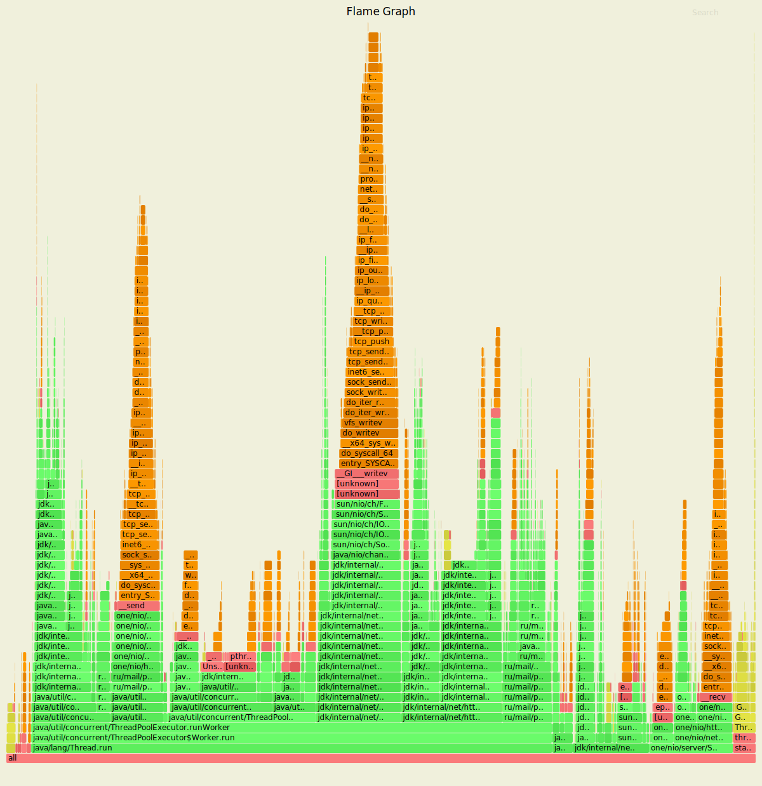

# Нагрузочное тестирование с помощью wrk2

### 1) Тестирование PUT запросов

Параметры запуска тестов:
1. Thread - 4
2. Connection - 64
3. Requests per second - 8000
4. Duration - 3m

`wrk -t4 -c64 -R8000 -d3m -s wrk/put.lua --latency http://localhost:8080`

Running 3m test @ http://localhost:8080
  4 threads and 64 connections
      
      Thread calibration: mean lat.: 1.644ms, rate sampling interval: 10ms
      Thread calibration: mean lat.: 1.643ms, rate sampling interval: 10ms
      Thread calibration: mean lat.: 1.645ms, rate sampling interval: 10ms
      Thread calibration: mean lat.: 2.130ms, rate sampling interval: 10ms
      Thread Stats   Avg      Stdev     Max   +/- Stdev
        Latency    25.44ms  110.24ms 948.22ms   95.59%
        Req/Sec     2.11k   471.50     5.11k    77.07%
  Latency Distribution (HdrHistogram - Recorded Latency)

     50.000%    2.01ms
     75.000%    3.10ms
     90.000%    8.12ms
     99.000%  687.61ms
     99.900%  839.17ms
     99.990%  903.17ms
     99.999%  943.10ms
    100.000%  948.73ms

  Detailed Percentile spectrum:
  
       Value   Percentile   TotalCount 1/(1-Percentile)

       0.223     0.000000            1         1.00
       0.938     0.100000       135976         1.11
       1.232     0.200000       272212         1.25
       1.496     0.300000       407779         1.43
       1.749     0.400000       543798         1.67
       2.014     0.500000       679645         2.00
       2.161     0.550000       747958         2.22
       2.321     0.600000       815730         2.50
       2.511     0.650000       883880         2.86
       2.753     0.700000       951777         3.33
       3.103     0.750000      1019688         4.00
       3.339     0.775000      1053560         4.44
       3.649     0.800000      1087405         5.00
       4.081     0.825000      1121372         5.71
       4.771     0.850000      1155353         6.67
       6.079     0.875000      1189373         8.00
       6.975     0.887500      1206301         8.89
       8.123     0.900000      1223287        10.00
       9.591     0.912500      1240344        11.43
      11.911     0.925000      1257275        13.33
      19.263     0.937500      1274264        16.00
      33.887     0.943750      1282744        17.78
      91.263     0.950000      1291235        20.00
     139.391     0.956250      1299735        22.86
     258.431     0.962500      1308231        26.67
     345.343     0.968750      1316744        32.00
     390.143     0.971875      1320968        35.56
     444.159     0.975000      1325216        40.00
     492.287     0.978125      1329463        45.71
     557.567     0.981250      1333731        53.33
     611.839     0.984375      1337970        64.00
     635.903     0.985938      1340091        71.11
     656.895     0.987500      1342221        80.00
     675.327     0.989062      1344335        91.43
     696.319     0.990625      1346503       106.67
     716.287     0.992188      1348588       128.00
     727.551     0.992969      1349639       142.22
     738.303     0.993750      1350719       160.00
     749.055     0.994531      1351786       182.86
     760.319     0.995313      1352835       213.33
     773.119     0.996094      1353929       256.00
     780.287     0.996484      1354449       284.44
     788.479     0.996875      1354964       320.00
     796.159     0.997266      1355498       365.71
     804.351     0.997656      1356012       426.67
     814.591     0.998047      1356552       512.00
     819.711     0.998242      1356810       568.89
     824.319     0.998437      1357081       640.00
     829.439     0.998633      1357339       731.43
     834.559     0.998828      1357631       853.33
     840.191     0.999023      1357876      1024.00
     844.287     0.999121      1358016      1137.78
     847.359     0.999219      1358138      1280.00
     851.967     0.999316      1358276      1462.86
     856.063     0.999414      1358401      1706.67
     860.671     0.999512      1358542      2048.00
     863.231     0.999561      1358607      2275.56
     866.303     0.999609      1358667      2560.00
     872.447     0.999658      1358731      2925.71
     879.615     0.999707      1358801      3413.33
     884.223     0.999756      1358864      4096.00
     886.783     0.999780      1358895      4551.11
     889.343     0.999805      1358928      5120.00
     892.415     0.999829      1358962      5851.43
     897.023     0.999854      1358994      6826.67
     901.631     0.999878      1359035      8192.00
     902.143     0.999890      1359051      9102.22
     903.167     0.999902      1359062     10240.00
     904.703     0.999915      1359077     11702.86
     907.775     0.999927      1359097     13653.33
     909.823     0.999939      1359111     16384.00
     912.895     0.999945      1359119     18204.44
     918.015     0.999951      1359127     20480.00
     924.159     0.999957      1359135     23405.71
     928.255     0.999963      1359144     27306.67
     931.327     0.999969      1359154     32768.00
     932.351     0.999973      1359157     36408.89
     933.375     0.999976      1359160     40960.00
     936.447     0.999979      1359164     46811.43
     939.519     0.999982      1359170     54613.33
     940.543     0.999985      1359173     65536.00
     942.079     0.999986      1359177     72817.78
     942.079     0.999988      1359177     81920.00
     943.103     0.999989      1359179     93622.86
     945.151     0.999991      1359181    109226.67
     945.663     0.999992      1359185    131072.00
     945.663     0.999993      1359185    145635.56
     945.663     0.999994      1359185    163840.00
     946.175     0.999995      1359187    187245.71
     946.175     0.999995      1359187    218453.33
     946.687     0.999996      1359191    262144.00
     946.687     0.999997      1359191    291271.11
     946.687     0.999997      1359191    327680.00
     946.687     0.999997      1359191    374491.43
     946.687     0.999998      1359191    436906.67
     946.687     0.999998      1359191    524288.00
     946.687     0.999998      1359191    582542.22
     946.687     0.999998      1359191    655360.00
     947.711     0.999999      1359192    748982.86
     947.711     0.999999      1359192    873813.33
     947.711     0.999999      1359192   1048576.00
     947.711     0.999999      1359192   1165084.44
     947.711     0.999999      1359192   1310720.00
     948.735     0.999999      1359193   1497965.71
     948.735     1.000000      1359193          inf

    #[Mean    =       25.444, StdDeviation   =      110.241]
    #[Max     =      948.224, Total count    =      1359193]
    #[Buckets =           27, SubBuckets     =         2048]
----------------------------------------------------------
  1437625 requests in 3.00m, 91.86MB read

    Requests/sec:   7986.85
    Transfer/sec:    522.58KB

#### Результаты профилирования async-profiler (CPU): 

`./profiler.sh -d 20 -e cpu -f ./hw6/cpu_put_.svg 11940`

По сравнению с предыдущим этапом по flame graph'у сразу становтся видно, что
довольно большую долю CPU теперь занимает код асинхронного HttpClient. 10.67% выполнение
запроса из очереди LinkedBlockingQueue ExecutorService.
При завершение и выполнение запроса доля CPU - 16.95%, где 5.51% тратится на исполнение, а 11.41%
на завершение, в частности 8.93% тратится для возвращение соединениея в пулл.

Также видим, что доля CPU на выборку задач из очерди ExecutorService неизменно с прошлых этапом
остается приближенно равным 10%

Также из флейм графа видно, что на обработку локальных для ноды запросов требуеся доля CPU,
равная 10.99%, где обращение к DAO это всего лишь 2.6%, а 8.33% отправка на завершение CompletableFuture.

Еще можно заметить, что появился HttpClient SelectorManager, который выбирает Selector(2.31%),
очищает просроченные соединения(1.21%), а также 1.59% на чтение из сокета.

#### Результаты профилирования async-profiler (ALLOC): 

`./profiler.sh -d 20 -e alloc -f ./hw6/alloc_put_.svg 11940`

 По сравнению с предыдущим этапом видим незначательное, но увиление аллокаций при обработке запроса
селектором, это происходит за счёт того, что часть методов, таких как постановка проксированных запросов
в очередь HttpClient происходит теперь не в пуле потоков, следовательно требуется выделение памяти для 
прохода по циклу через ноды с помощью итератора, что влечет за собой 10.44% долю выделения
памяти. Это же относится и nodesForKey(4.68%)

При выполнении локальных запросов на ноде требуется 26.27% выделений, где 18.16% аллоцируется для байтовых буферов
для получения ответа, а 8.11% на внутренние аллокации CompletableFuture

#### Результаты профилирования async-profiler (LOCK): 

`./profiler.sh -d 20 -e lock -f ./hw6/lock_put.svg 11940`

По сранению с предыдущим этапом видим колосальный прирост блокировок на флейм графе.
Это в первую очередь происходит за счёт того, что HttpClient'у необходимо возвращать соединения 
обратно в пул(29.48%). А 9.25% для получение соединение из пула. 20.87% уходит на обработку
CompletableFuture.

### 2) Тестирование GET запросов

Параметры запуска тестов:
1. Thread - 4
2. Connection - 64
3. Requests per second - 1500
4. Duration - 3m

`wrk -t4 -c64 -R1500 -d3m -s wrk/get.lua --latency http://localhost:8080`

Running 3m test @ http://localhost:8080
  4 threads and 64 connections

      Thread calibration: mean lat.: 5.662ms, rate sampling interval: 22ms
      Thread calibration: mean lat.: 5.701ms, rate sampling interval: 23ms
      Thread calibration: mean lat.: 11.091ms, rate sampling interval: 33ms
      Thread calibration: mean lat.: 5.653ms, rate sampling interval: 22ms
      Thread Stats   Avg      Stdev     Max   +/- Stdev
        Latency     7.30ms   11.84ms  93.50ms   91.17%
        Req/Sec   382.74    156.69     1.45k    85.00%
  Latency Distribution (HdrHistogram - Recorded Latency)

     50.000%    2.59ms
     75.000%    7.03ms
     90.000%   14.26ms
     99.000%   58.24ms
     99.900%   69.38ms
     99.990%   77.57ms
     99.999%   83.39ms
    100.000%   93.57ms

  Detailed Percentile spectrum:
  
       Value   Percentile   TotalCount 1/(1-Percentile)

       0.562     0.000000            1         1.00
       1.268     0.100000        25545         1.11
       1.542     0.200000        51031         1.25
       1.777     0.300000        76540         1.43
       2.049     0.400000       101963         1.67
       2.589     0.500000       127461         2.00
       3.447     0.550000       140211         2.22
       4.567     0.600000       152935         2.50
       5.507     0.650000       165721         2.86
       6.311     0.700000       178435         3.33
       7.027     0.750000       191207         4.00
       7.439     0.775000       197569         4.44
       7.935     0.800000       203911         5.00
       8.503     0.825000       210305         5.71
       9.247     0.850000       216666         6.67
      10.655     0.875000       223057         8.00
      11.815     0.887500       226219         8.89
      14.263     0.900000       229400        10.00
      19.599     0.912500       232586        11.43
      26.815     0.925000       235773        13.33
      33.695     0.937500       238959        16.00
      36.479     0.943750       240557        17.78
      39.263     0.950000       242152        20.00
      41.951     0.956250       243759        22.86
      44.639     0.962500       245335        26.67
      47.423     0.968750       246930        32.00
      48.767     0.971875       247721        35.56
      50.303     0.975000       248516        40.00
      51.743     0.978125       249319        45.71
      53.215     0.981250       250114        53.33
      54.911     0.984375       250916        64.00
      55.807     0.985938       251305        71.11
      56.735     0.987500       251711        80.00
      57.631     0.989062       252109        91.43
      58.751     0.990625       252499       106.67
      59.967     0.992188       252902       128.00
      60.479     0.992969       253097       142.22
      61.247     0.993750       253305       160.00
      61.823     0.994531       253496       182.86
      62.687     0.995313       253695       213.33
      63.583     0.996094       253894       256.00
      64.063     0.996484       253998       284.44
      64.607     0.996875       254093       320.00
      65.151     0.997266       254194       365.71
      65.919     0.997656       254298       426.67
      66.687     0.998047       254397       512.00
      67.135     0.998242       254444       568.89
      67.583     0.998437       254495       640.00
      68.095     0.998633       254542       731.43
      68.735     0.998828       254591       853.33
      69.503     0.999023       254640      1024.00
      69.887     0.999121       254664      1137.78
      70.207     0.999219       254690      1280.00
      70.783     0.999316       254716      1462.86
      71.487     0.999414       254739      1706.67
      71.871     0.999512       254764      2048.00
      72.255     0.999561       254776      2275.56
      72.703     0.999609       254791      2560.00
      72.959     0.999658       254802      2925.71
      73.663     0.999707       254814      3413.33
      74.687     0.999756       254826      4096.00
      75.071     0.999780       254832      4551.11
      75.327     0.999805       254839      5120.00
      75.775     0.999829       254846      5851.43
      76.159     0.999854       254852      6826.67
      76.927     0.999878       254858      8192.00
      77.503     0.999890       254860      9102.22
      77.695     0.999902       254864     10240.00
      77.887     0.999915       254867     11702.86
      78.463     0.999927       254870     13653.33
      79.167     0.999939       254874     16384.00
      79.167     0.999945       254874     18204.44
      79.359     0.999951       254876     20480.00
      79.807     0.999957       254878     23405.71
      80.127     0.999963       254879     27306.67
      80.575     0.999969       254881     32768.00
      80.575     0.999973       254881     36408.89
      80.639     0.999976       254882     40960.00
      80.895     0.999979       254883     46811.43
      82.751     0.999982       254884     54613.33
      83.391     0.999985       254885     65536.00
      83.391     0.999986       254885     72817.78
      83.391     0.999988       254885     81920.00
      83.455     0.999989       254886     93622.86
      83.455     0.999991       254886    109226.67
      91.007     0.999992       254887    131072.00
      91.007     0.999993       254887    145635.56
      91.007     0.999994       254887    163840.00
      91.007     0.999995       254887    187245.71
      91.007     0.999995       254887    218453.33
      93.567     0.999996       254888    262144.00
      93.567     1.000000       254888          inf
      
    #[Mean    =        7.305, StdDeviation   =       11.837]
    #[Max     =       93.504, Total count    =       254888]
    #[Buckets =           27, SubBuckets     =         2048]
----------------------------------------------------------
  269619 requests in 3.00m, 19.07MB read

    Requests/sec:   1497.60
    Transfer/sec:    108.46KB

#### Результаты профилирования async-profiler (CPU): 

`./profiler.sh -d 20 -e cpu -f ./hw6/cpu_get.svg 11940`

По прежнему большую долю CPU занимает обращение к DAO(76.16%), что логично, поскольку
нам необходиом прочитать с диска и смерджить данные. Поскольку вызов к DAO оборачивается
в CompletableFuture, то на ее завершение уходит доля CPU равная 2.18%.

Доля CPU getTask увеличилась примерно в 8-10 раз по сравнению с предыдущим этапом. Это вышло
из-за того, что мы добавили еще один ExecutorService для HttpClient. И наш Worker ExecutorService
стал выполнять больше задач.

Также в сумме около 7% тратится на выполнение задач HttpClient, в число которых входит получить соединение
из пула, вернуть его обратно и тд.

#### Результаты профилирования async-profiler (ALLOC): 

`./profiler.sh -d 20 -e alloc -f ./hw6/alloc_get.svg 11940`

Как и в случае с PUT запросами видим небольшое увеличение доли аллокации на Selector'e, 
поскольку необходимо итерироваться по списку нод для реплицирования, на что аллоцируется
также 10.46%, а также 5.38% на поиск этих самых реплик на хэш кольце.

Для выполнения локальных запросов(то есть обращению к DAO) выдялется 48.24%, где большая
часть 40.66% выделяется соответственно для мерджа данных из файлов, чтение ключей и значения, 
а меньшая часть уходит на внутренние аллокации CompletableFuture при завершении задачи.

Также 5.31% выделяется при выполнении задачи в HttpClient.
 
 #### Результаты профилирования async-profiler (LOCK): 
 
 
`./profiler.sh -d 20 -e alloc -f ./hw6/alloc_get.svg 11940`

В отличие от прошлого этапа, где почти полностью флейм граф занимали блокировки на чтения из файлов,
здесь добавились блокировки при работе с асинхронным HttpClient.

7.92% - возвращение соединения в пул, 0.71% получение соединения.

postComplete - 17.49. 

22.51% Блокировка SelectorManager, то есть ожидание задач в очереди на выполнение
