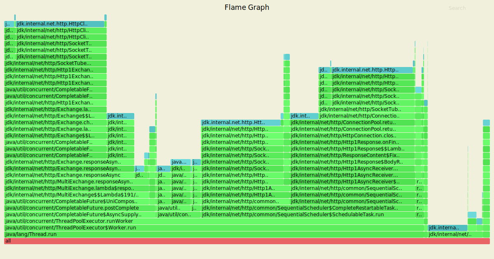

# Нагрузочное тестирование с помощью wrk2

### 1) Тестирование PUT запросов

Параметры запуска тестов:
1. Thread - 4
2. Connection - 64
3. Requests per second - 8000
4. Duration - 1m

wrk -t4 -c64 -R8000 -d1m -s wrk/put.lua --latency http://localhost:8080

Running 1m test @ http://localhost:8080
  4 threads and 64 connections
      
      Thread calibration: mean lat.: 348.295ms, rate sampling interval: 1609ms
      Thread calibration: mean lat.: 339.880ms, rate sampling interval: 1610ms
      Thread calibration: mean lat.: 341.606ms, rate sampling interval: 1617ms
      Thread calibration: mean lat.: 344.856ms, rate sampling interval: 1608ms
  
      Thread Stats   Avg      Stdev     Max   +/- Stdev
        Latency     1.96ms    1.49ms  22.38ms   87.70%
        Req/Sec     2.00k     2.34     2.01k    91.06%
  Latency Distribution (HdrHistogram - Recorded Latency)
  
     50.000%    1.59ms
     75.000%    2.25ms
     90.000%    3.49ms
     99.000%    8.31ms
     99.900%   12.85ms
     99.990%   16.48ms
     99.999%   20.61ms
    100.000%   22.40ms

  Detailed Percentile spectrum:
       
       Value   Percentile   TotalCount 1/(1-Percentile)

       0.202     0.000000            1         1.00
       0.745     0.100000        39958         1.11
       0.988     0.200000        79883         1.25
       1.199     0.300000       119830         1.43
       1.397     0.400000       159841         1.67
       1.592     0.500000       199685         2.00
       1.695     0.550000       219830         2.22
       1.805     0.600000       239746         2.50
       1.928     0.650000       259656         2.86
       2.073     0.700000       279559         3.33
       2.251     0.750000       299550         4.00
       2.361     0.775000       309653         4.44
       2.489     0.800000       319538         5.00
       2.649     0.825000       329574         5.71
       2.857     0.850000       339535         6.67
       3.129     0.875000       349511         8.00
       3.299     0.887500       354484         8.89
       3.493     0.900000       359441        10.00
       3.725     0.912500       364423        11.43
       3.999     0.925000       369416        13.33
       4.339     0.937500       374428        16.00
       4.543     0.943750       376946        17.78
       4.763     0.950000       379396        20.00
       5.019     0.956250       381904        22.86
       5.311     0.962500       384394        26.67
       5.671     0.968750       386882        32.00
       5.899     0.971875       388141        35.56
       6.143     0.975000       389376        40.00
       6.451     0.978125       390636        45.71
       6.799     0.981250       391883        53.33
       7.215     0.984375       393121        64.00
       7.483     0.985938       393750        71.11
       7.783     0.987500       394372        80.00
       8.095     0.989062       394997        91.43
       8.463     0.990625       395626       106.67
       8.895     0.992188       396246       128.00
       9.151     0.992969       396558       142.22
       9.415     0.993750       396865       160.00
       9.703     0.994531       397176       182.86
      10.031     0.995313       397489       213.33
      10.399     0.996094       397802       256.00
      10.615     0.996484       397962       284.44
      10.847     0.996875       398114       320.00
      11.119     0.997266       398269       365.71
      11.415     0.997656       398427       426.67
      11.783     0.998047       398581       512.00
      11.975     0.998242       398659       568.89
      12.167     0.998437       398741       640.00
      12.375     0.998633       398817       731.43
      12.591     0.998828       398893       853.33
      12.871     0.999023       398970      1024.00
      13.031     0.999121       399009      1137.78
      13.215     0.999219       399048      1280.00
      13.383     0.999316       399089      1462.86
      13.583     0.999414       399127      1706.67
      13.871     0.999512       399165      2048.00
      14.007     0.999561       399186      2275.56
      14.183     0.999609       399204      2560.00
      14.447     0.999658       399224      2925.71
      14.703     0.999707       399243      3413.33
      14.999     0.999756       399263      4096.00
      15.151     0.999780       399273      4551.11
      15.367     0.999805       399282      5120.00
      15.615     0.999829       399292      5851.43
      15.855     0.999854       399302      6826.67
      16.063     0.999878       399312      8192.00
      16.295     0.999890       399317      9102.22
      16.479     0.999902       399321     10240.00
      16.703     0.999915       399326     11702.86
      16.959     0.999927       399331     13653.33
      17.471     0.999939       399336     16384.00
      17.679     0.999945       399339     18204.44
      17.743     0.999951       399341     20480.00
      17.967     0.999957       399343     23405.71
      18.351     0.999963       399346     27306.67
      18.639     0.999969       399348     32768.00
      18.911     0.999973       399350     36408.89
      19.023     0.999976       399351     40960.00
      19.887     0.999979       399352     46811.43
      20.271     0.999982       399353     54613.33
      20.415     0.999985       399354     65536.00
      20.447     0.999986       399355     72817.78
      20.607     0.999988       399356     81920.00
      20.607     0.999989       399356     93622.86
      20.687     0.999991       399357    109226.67
      20.687     0.999992       399357    131072.00
      21.327     0.999993       399358    145635.56
      21.327     0.999994       399358    163840.00
      21.327     0.999995       399358    187245.71
      22.319     0.999995       399359    218453.33
      22.319     0.999996       399359    262144.00
      22.319     0.999997       399359    291271.11
      22.319     0.999997       399359    327680.00
      22.319     0.999997       399359    374491.43
      22.399     0.999998       399360    436906.67
      22.399     1.000000       399360          inf

    #[Mean    =        1.958, StdDeviation   =        1.490]
    #[Max     =       22.384, Total count    =       399360]
    #[Buckets =           27, SubBuckets     =         2048]
----------------------------------------------------------
  
  479723 requests in 1.00m, 30.65MB read

    Requests/sec:   7995.29
    Transfer/sec:    523.13KB
    
Видим, что по сравнению с предыдущим этапом удалось сократить 4 в раза `latency`.
Было 80ms при 100%, данная же реализация смогла управиться в 22.4ms, что является результатом
того, что мы использовали CompletableFuture, а не синхронно дожидались ответа от ноды, как 
это было в предыдущем этапе.

#### Результаты профилирования async-profiler (CPU): 

`./profiler.sh -d 20 -e cpu -f ./hw6/cpu_put_.svg 11940`

По сравнению с предыдущим этапом доля CPU селекторов one.nio уменьшилось на 8%,
поскольку в данной реализации мы проксируем запросы с помощью HttpClient, селекторы
которого также появились на flame graph и составляют 10%.
2.74% занимает ForkJoinWorkerThread, который занимается постановкой на выполнение CompletableFuture

На ExectuorService приходится на 4% меньше CPU. Здесь идет распредение CompletableFuture(около 17% доли CPU),
getTask(19.86%), на сетевой взаимодействие HttpClient уходит около 25%.

#### Результаты профилирования async-profiler (ALLOC): 

`./profiler.sh -d 20 -e alloc -f ./hw6/alloc_put_.svg 11940`

По сравнению с предыдущим этапом удалось сократить долю аллокаций на селекторах one-nio в 2 раза.
Селектор HttpClient занимает 3.36%.
Около 6% аллокаций уходит на определение ноды при проксировании запросов.
Появились новый аллокаций приходится на CompletableFuture, в которой происходит обработка проксированных запросов
и обработка локальных запросов, то есть поход в DAO.

Около 10% аллокаций добавилось за счёт выполнения запросов на HttpClient.

#### Результаты профилирования async-profiler (LOCK): 

`./profiler.sh -d 20 -e lock -f ./hw6/lock_put.svg 11940`

По сравнению с предыдущим этапом видим координальные изменения.
Видим, что достаточно большую долю новых блокировок - 44% занимает выполнение запросов при помощи
HttpClient, однако они не блокирует селекторы и выполняются на отдельных потоках, что дает возможность 
параллельно ставить задачи в очередь на выполнение.

Это в первую очердь происходит за счёт того, что HttpClient'у необходимо возвращать
соединения обратно в пул - 25.72%. А для получения соединения из пула 5.68%. 31.12% уходит
на блокировки CompletableFuture.

### 2) Тестирование GET запросов

Параметры запуска тестов:
1. Thread - 4
2. Connection - 64
3. Requests per second - 2000
4. Duration - 1m

`wrk -t4 -c64 -R2000 -d1m -s wrk/get.lua --latency http://localhost:8080`

Running 1m test @ http://localhost:8080

          Thread calibration: mean lat.: 1.700ms, rate sampling interval: 10ms
          Thread calibration: mean lat.: 1.733ms, rate sampling interval: 10ms
          Thread calibration: mean lat.: 1.688ms, rate sampling interval: 10ms
          Thread calibration: mean lat.: 1.689ms, rate sampling interval: 10ms
          Thread Stats   Avg      Stdev     Max   +/- Stdev
            Latency     2.26ms    4.10ms  75.01ms   95.52%
            Req/Sec   527.52    132.19     1.80k    74.99%
            
  Latency Distribution (HdrHistogram - Recorded Latency)
      
         50.000%    1.51ms
         75.000%    1.90ms
         90.000%    2.46ms
         99.000%   19.52ms
         99.900%   59.84ms
         99.990%   71.36ms
         99.999%   74.94ms
        100.000%   75.07ms

  Detailed Percentile spectrum:
  
       Value   Percentile   TotalCount 1/(1-Percentile)

       0.401     0.000000            1         1.00
       0.920     0.100000        10000         1.11
       1.102     0.200000        19993         1.25
       1.250     0.300000        29963         1.43
       1.382     0.400000        39966         1.67
       1.510     0.500000        49945         2.00
       1.573     0.550000        54941         2.22
       1.639     0.600000        59911         2.50
       1.714     0.650000        64954         2.86
       1.799     0.700000        69907         3.33
       1.898     0.750000        74925         4.00
       1.956     0.775000        77393         4.44
       2.022     0.800000        79896         5.00
       2.099     0.825000        82409         5.71
       2.189     0.850000        84872         6.67
       2.303     0.875000        87384         8.00
       2.373     0.887500        88619         8.89
       2.463     0.900000        89878        10.00
       2.583     0.912500        91117        11.43
       2.785     0.925000        92353        13.33
       3.251     0.937500        93597        16.00
       3.807     0.943750        94221        17.78
       4.811     0.950000        94847        20.00
       6.711     0.956250        95470        22.86
       9.207     0.962500        96093        26.67
      11.247     0.968750        96721        32.00
      12.207     0.971875        97032        35.56
      13.111     0.975000        97344        40.00
      14.143     0.978125        97654        45.71
      15.175     0.981250        97967        53.33
      16.559     0.984375        98278        64.00
      17.311     0.985938        98434        71.11
      18.079     0.987500        98589        80.00
      18.911     0.989062        98746        91.43
      19.967     0.990625        98904       106.67
      21.231     0.992188        99060       128.00
      22.031     0.992969        99135       142.22
      23.023     0.993750        99213       160.00
      24.223     0.994531        99292       182.86
      25.807     0.995313        99369       213.33
      28.159     0.996094        99447       256.00
      30.319     0.996484        99486       284.44
      32.463     0.996875        99525       320.00
      38.719     0.997266        99564       365.71
      46.239     0.997656        99604       426.67
      51.519     0.998047        99642       512.00
      53.183     0.998242        99661       568.89
      55.263     0.998437        99681       640.00
      57.023     0.998633        99702       731.43
      58.463     0.998828        99720       853.33
      60.255     0.999023        99740      1024.00
      61.407     0.999121        99750      1137.78
      62.079     0.999219        99759      1280.00
      62.719     0.999316        99768      1462.86
      63.903     0.999414        99778      1706.67
      64.927     0.999512        99788      2048.00
      65.599     0.999561        99794      2275.56
      66.047     0.999609        99798      2560.00
      66.367     0.999658        99803      2925.71
      66.687     0.999707        99807      3413.33
      67.647     0.999756        99812      4096.00
      68.479     0.999780        99815      4551.11
      68.607     0.999805        99817      5120.00
      68.991     0.999829        99819      5851.43
      69.183     0.999854        99822      6826.67
      69.631     0.999878        99824      8192.00
      71.359     0.999890        99826      9102.22
      71.743     0.999902        99827     10240.00
      71.999     0.999915        99829     11702.86
      71.999     0.999927        99829     13653.33
      72.063     0.999939        99830     16384.00
      72.255     0.999945        99832     18204.44
      72.255     0.999951        99832     20480.00
      72.255     0.999957        99832     23405.71
      73.279     0.999963        99833     27306.67
      73.279     0.999969        99833     32768.00
      73.983     0.999973        99834     36408.89
      73.983     0.999976        99834     40960.00
      73.983     0.999979        99834     46811.43
      74.943     0.999982        99835     54613.33
      74.943     0.999985        99835     65536.00
      74.943     0.999986        99835     72817.78
      74.943     0.999988        99835     81920.00
      74.943     0.999989        99835     93622.86
      75.071     0.999991        99836    109226.67
      75.071     1.000000        99836          inf
      
    #[Mean    =        2.258, StdDeviation   =        4.096]
    #[Max     =       75.008, Total count    =        99836]
    #[Buckets =           27, SubBuckets     =         2048]
----------------------------------------------------------
  119952 requests in 1.00m, 8.42MB read

    Requests/sec:   1999.20
    Transfer/sec:    143.68KB

Также как и PUT запросам, GET запросы стали требовать меньшей задержки для обработки.
В сравнении с предыдущим этапом, где при 100% было 217ms, в данном этапе задержка всего 75ms,
что в 3 раз меньше. Это также как и с PUT запросами является результатом использования
асинхронного клиента и CompletableFuture.

#### Результаты профилирования async-profiler (CPU): 

`./profiler.sh -d 20 -e cpu -f ./hw6/cpu_get.svg 11940`

По сравнению с предыдущей реализацией видим, что доля требуемая на прочтение данных из DAO уменьшилась
на 30% и теперь составлет 49.5%. Также можно заметить, что чтение происходит с использованием 
CompletableFuture. Около 10% уходит на работу с асинхронным клиентом.

Также видим, что SelectorManager асинхронного клиента также появился на flame graph и его доля
составляет 8%. Селектор one-nio все также остался 3%, это случилось, видимо, ввиду случайности момента
профилирования система, по логике его доля должна была уменьшиться, так как запросы при проксировании
перевели с него на асинхронный клиент.

#### Результаты профилирования async-profiler (ALLOC): 

`./profiler.sh -d 20 -e alloc -f ./hw6/alloc_get.svg 11940`

Количество аллокаций на селекторе one-nio осталось прежним. Возможно, это произошло ввиду случайности
момента профилирования система, поскольку по логике, как я уже писал выше, количество аллокаций должно
было уменьшиться, так как часть запросов перенаправили на асинхронный клиент.

На работу асинхронного клиента приходится около 13% доли аллокаций.
Также видим, что доля аллокаций при получении значений из DAO уменьшилось на 7% по сравнению
с прошлым этапом.
 
 #### Результаты профилирования async-profiler (LOCK): 
 
 
`./profiler.sh -d 20 -e alloc -f ./hw6/alloc_get.svg 11940`

В отличие от прошлого этапа, где почти полностью флейм граф занимали блокировки на чтения из файлов,
здесь добавились блокировки при работе с асинхронным HttpClient.

Появились дополнительные блокировки связанные с CompletableFuture - 39%.
9.25% - возвращение соединения в пул, 1.46% получение соединения.

Появилась блокировка 30.72% SelectorManager - это блокировка селекторов асинхронного клиента.

Блокировки чтения из файлов, то есть из DAO, занимают 17.37%
