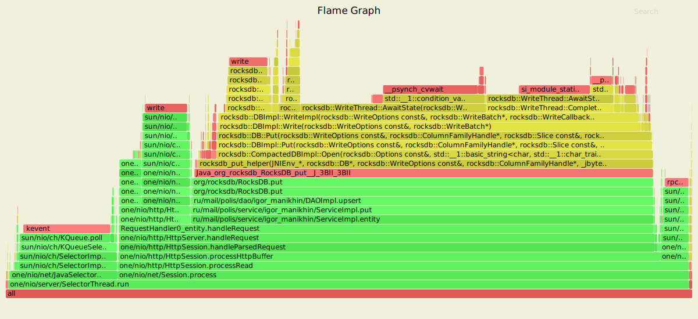
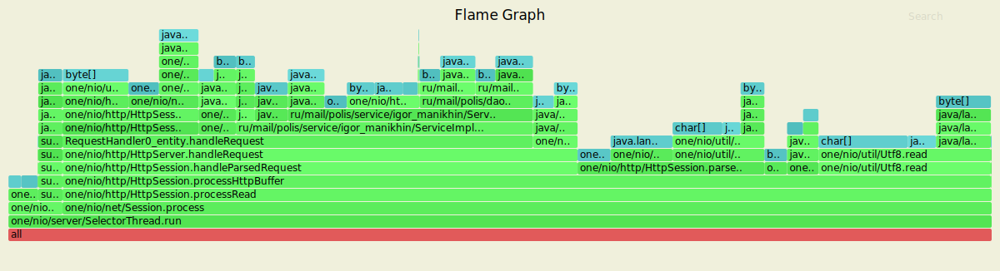
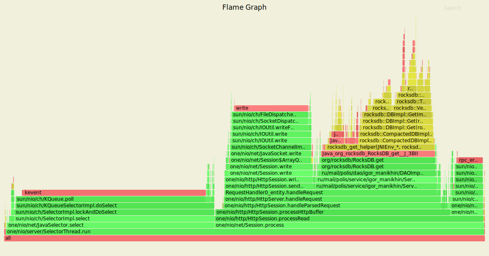
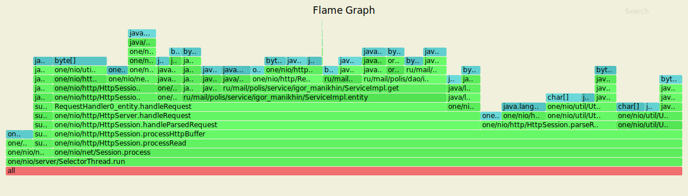

#  Многопоточность

RocksDB изначально является потокобезопасным хранилищем данных, поэтому вследствие данного факта исходный код проекта не был изменён. 
Было проведено нагрузочное тестирование с помощью wrk в несколько соединений. Полученные результаты при проведённом нагрузочном - представлены его результаты.

## Обстрел сервера PUT-запросами
Параметры запуска wrk

* Количестов потоков, выполняющих отправку запросов на сервер - 4
* Количестов открытых соединений - 16
* Количество запросов в секунду - 20000
* Длительность - 60 секунд

Результаты нагрузочного тестирования сервера через wrk представлены ниже:

```
Running 1m test @ http://127.0.0.1:8080/
  4 threads and 16 connections
  Thread calibration: mean lat.: 1.540ms, rate sampling interval: 10ms
  Thread calibration: mean lat.: 1.443ms, rate sampling interval: 10ms
  Thread calibration: mean lat.: 1.637ms, rate sampling interval: 10ms
  Thread calibration: mean lat.: 1.604ms, rate sampling interval: 10ms
  Thread Stats   Avg      Stdev     Max   +/- Stdev
    Latency     1.27ms  671.13us  10.54ms   68.84%
    Req/Sec     5.27k   431.43     8.22k    72.13%
  1199809 requests in 1.00m, 76.66MB read
Requests/sec:  19996.84
Transfer/sec:      1.28MB
```
## Результаты с async profiler-а (CPU)

Из диаграммы видно, что большинство запросов принадлежат NIO Selector-у, который обрабатывает отправляемые PUT запросы. 
Читая диграмму снизу вверх `one.nio.server.SelectorThread.run` -> `org.rocksdb.RocksDB.put`, видим, что процесс заканчивается помещением данных в RocksDB.

## Результаты с async profiler-а (ALLOC)

Аналогичная ситуация с CPU — запросы NIO Selector-а занимают большую часть. 
Посмотрев на диграмму снизу вверх `one.nio.server.SelectorThread.run` -> `byte[]`, видно, что процесс заканчивается выделением памяти для примитивов. 
Итак, можно сделать вывод, что 50-60% памяти занимает обработка запросов и где-то 30% - запись данных в DAO.

## Результаты с async profiler-a (LOCK)

Несмотря на многочисленные запуски async profiler, Flame Graph пустой, что говорит об отсутствии блокировок. 
RocksDB использует WriterThread для обработки многопоточной записи. Все «писатели» войдут в JoinBatchGroup. 
Если «писатель» текущего потока получит так называемый group_leader, то он произведет запись. У всего процесса нет конкуренции.

# Обстрел сервера GET-запросами
Параметры запуска wrk

* Количестов потоков, выполняющих отправку запросов на сервер - 4
* Количестов открытых соединений - 16
* Количество запросов в секунду - 20000
* Длительность - 60 секунд

Результаты нагрузочного тестирования сервера через wrk представлены ниже:

```
Running 1m test @ http://127.0.0.1:8080/
  4 threads and 16 connections
  Thread calibration: mean lat.: 1.217ms, rate sampling interval: 10ms
  Thread calibration: mean lat.: 1.224ms, rate sampling interval: 10ms
  Thread calibration: mean lat.: 1.218ms, rate sampling interval: 10ms
  Thread calibration: mean lat.: 1.219ms, rate sampling interval: 10ms
  Thread Stats   Avg      Stdev     Max   +/- Stdev
    Latency     1.23ms  622.04us  11.77ms   67.18%
    Req/Sec     5.27k   419.87    10.22k    71.83%
  1199819 requests in 1.00m, 84.21MB read
Requests/sec:  19997.19
Transfer/sec:      1.40MB
```

## Результаты с async profiler-а (CPU)

В случае с обстрелом сервера GET-запросами - на работу с DAO уходит около 20%. Обработка запросов составляет порядка 45%. 
20-30% уходит на чтение / запись в сокет. На графике явно видно `sun/nio/ch/SelectorImpl.lockAndDoSelect`, так как в данном случае выполняется работа с многопоточностью.

## Результаты с async profiler-а (ALLOC)

На данном Flame Graph парсинг и обработка запросов составляют около 55% и 30-37% — получение данных из DAO ru.mail.polis.dao.DAOImpl.get.

## Результаты с async profiler-a (LOCK)

Аналогичная ситуация с обстрелом сервера PUT-запросами, Flame Graph пустой; блокировок потоков нет. 
Получен такой же результат, как и было показано на лекции для кастомной имплементации DAO. 
Во время обстрела сервера GET-запросами никто не пытается записывать что-либо в хранилище данных; блокировок потоков нет.
