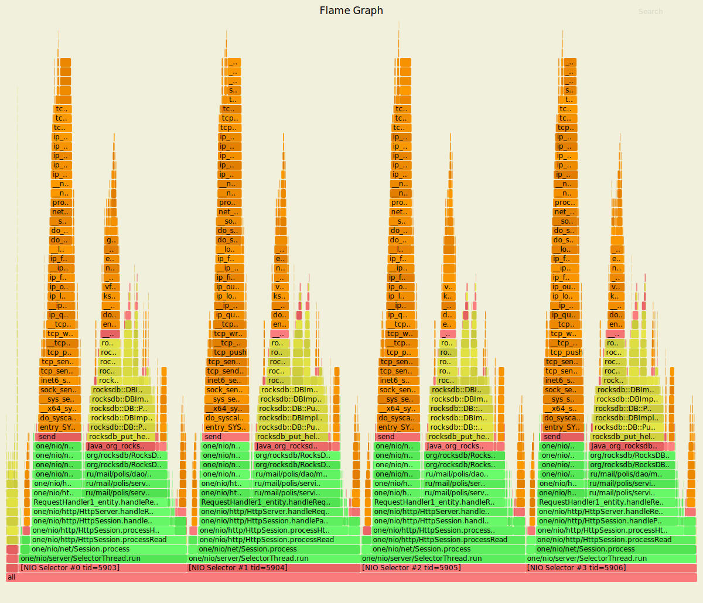
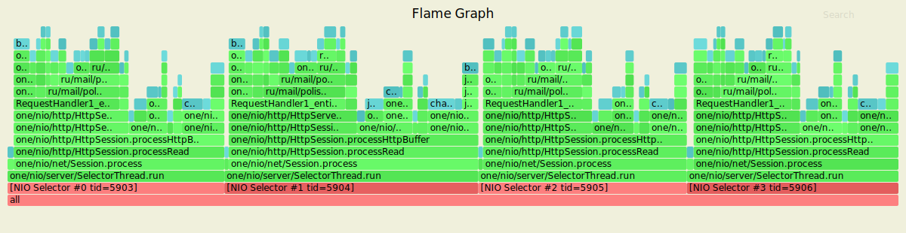
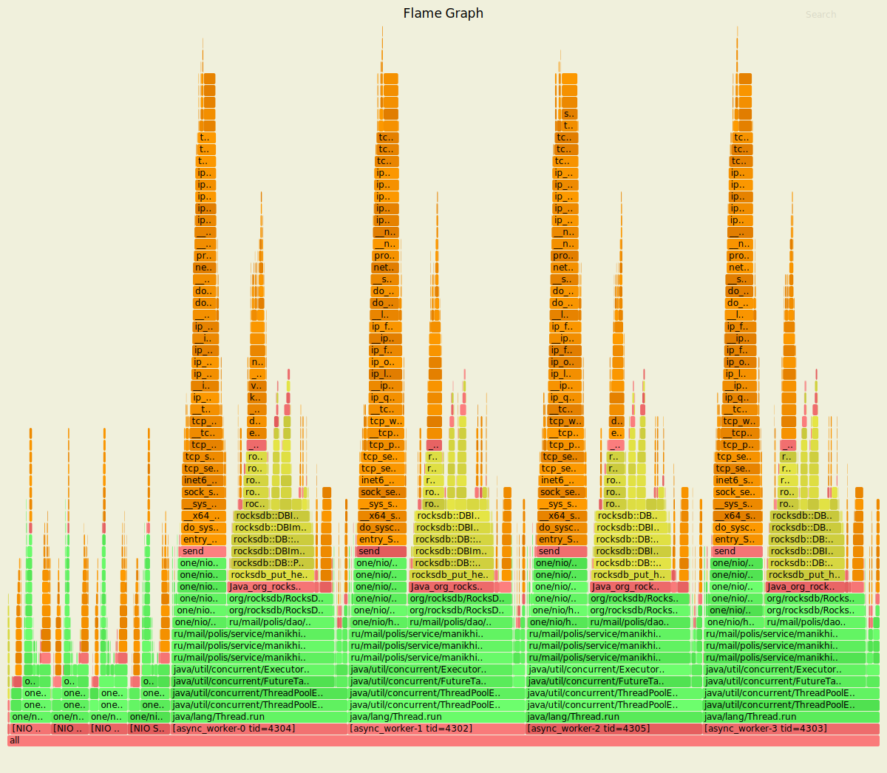
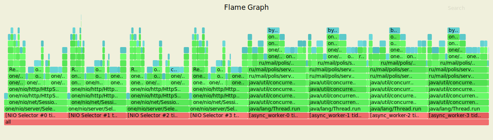
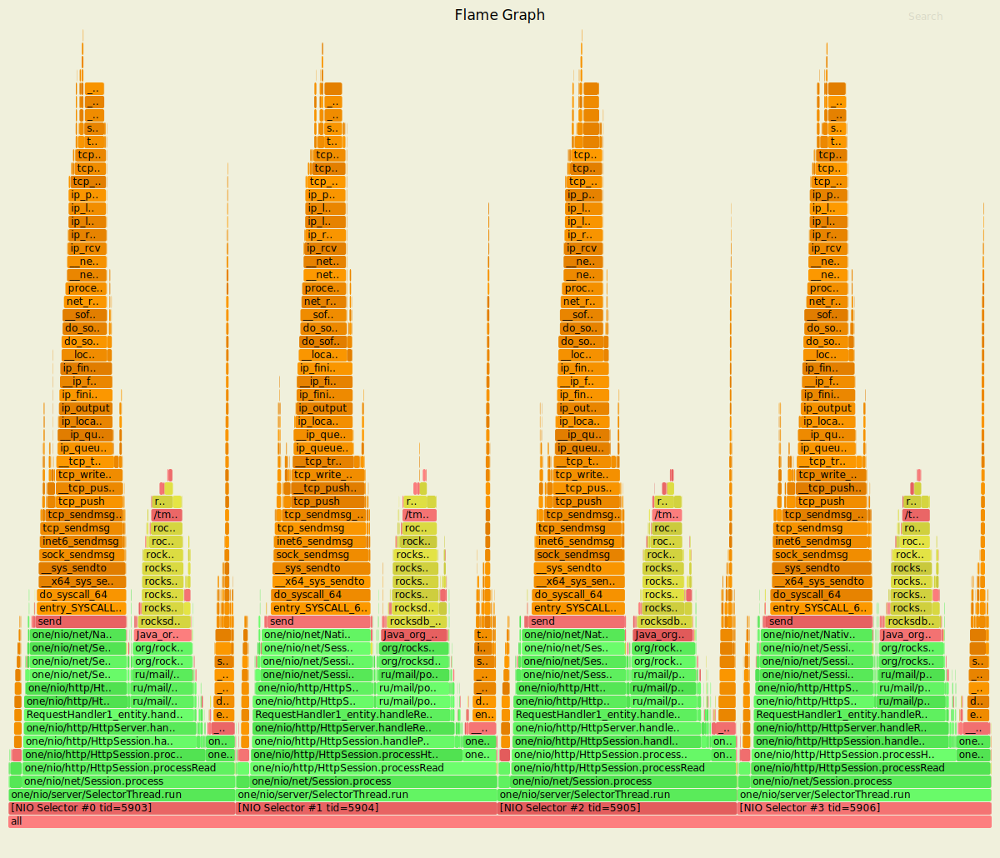
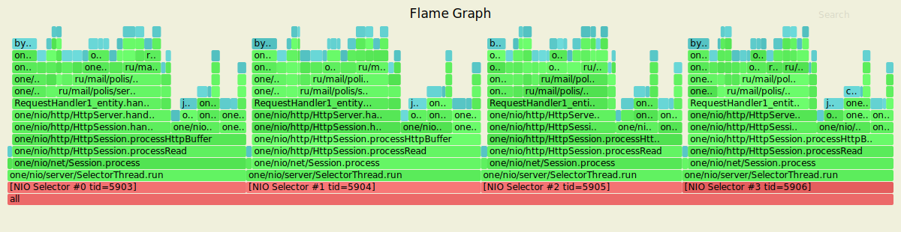
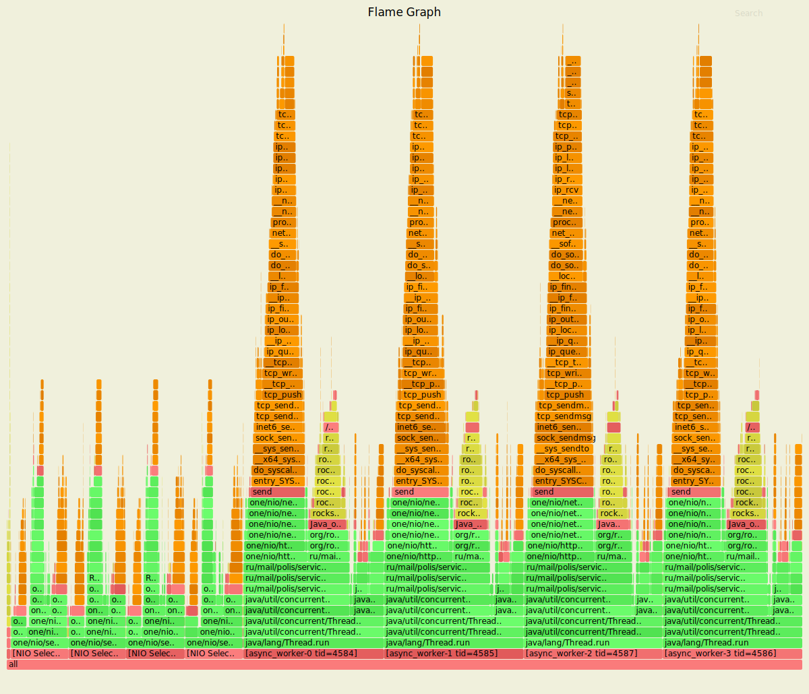
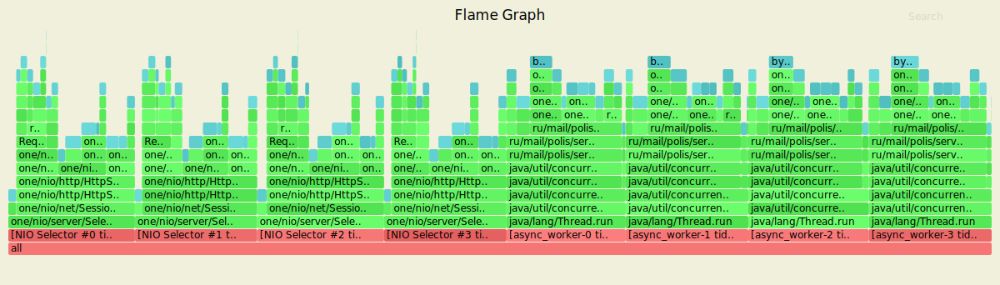
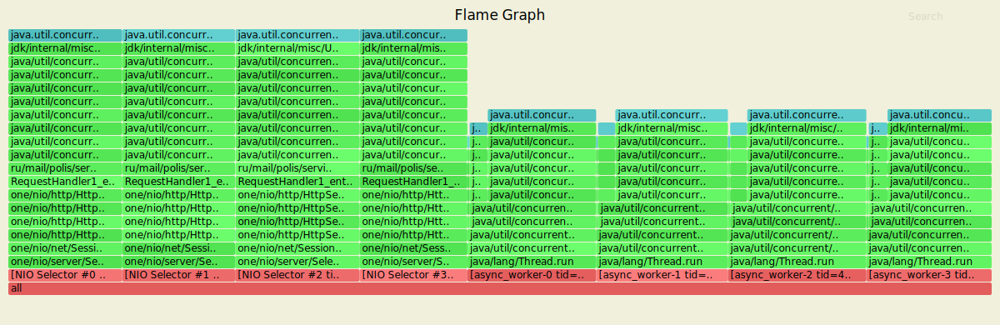

#  Асинхронный сервер

## Обстрел сервера PUT-запросами

### Синхронная обработка PUT-запросов

Параметры запуска wrk

* Количестов потоков, выполняющих отправку запросов на сервер - 4
* Количестов открытых соединений - 64
* Количество запросов в секунду - 10000
* Длительность - 60 секунд

Результаты нагрузочного тестирования сервера через wrk представлены ниже:

```
Running 1m test @ http://127.0.0.1:8080
  4 threads and 64 connections
  Thread calibration: mean lat.: 4.793ms, rate sampling interval: 17ms
  Thread calibration: mean lat.: 4.875ms, rate sampling interval: 18ms
  Thread calibration: mean lat.: 4.156ms, rate sampling interval: 16ms
  Thread calibration: mean lat.: 4.541ms, rate sampling interval: 17ms
  Thread Stats   Avg      Stdev     Max   +/- Stdev
    Latency     1.89ms    2.08ms  62.82ms   97.98%
    Req/Sec     2.58k   332.29     5.69k    70.42%
  Latency Distribution (HdrHistogram - Recorded Latency)
 50.000%    1.70ms
 75.000%    2.29ms
 90.000%    2.86ms
 99.000%    5.84ms
 99.900%   34.81ms
 99.990%   58.05ms
 99.999%   61.38ms
100.000%   62.85ms

  Detailed Percentile spectrum:
       Value   Percentile   TotalCount 1/(1-Percentile)

       0.106     0.000000            1         1.00
       0.727     0.100000        50060         1.11
       1.000     0.200000        99955         1.25
       1.250     0.300000       149960         1.43
       1.479     0.400000       199681         1.67
       1.699     0.500000       249772         2.00
       1.807     0.550000       274643         2.22
       1.917     0.600000       299675         2.50
       2.033     0.650000       324626         2.86
       2.153     0.700000       349656         3.33
       2.285     0.750000       374485         4.00
       2.359     0.775000       386993         4.44
       2.437     0.800000       399509         5.00
       2.523     0.825000       412077         5.71
       2.619     0.850000       424409         6.67
       2.729     0.875000       436807         8.00
       2.793     0.887500       443040         8.89
       2.863     0.900000       449298        10.00
       2.943     0.912500       455621        11.43
       3.035     0.925000       461856        13.33
       3.145     0.937500       468010        16.00
       3.209     0.943750       471183        17.78
       3.279     0.950000       474245        20.00
       3.363     0.956250       477385        22.86
       3.465     0.962500       480478        26.67
       3.591     0.968750       483618        32.00
       3.669     0.971875       485155        35.56
       3.763     0.975000       486726        40.00
       3.887     0.978125       488273        45.71
       4.059     0.981250       489839        53.33
       4.347     0.984375       491391        64.00
       4.575     0.985938       492175        71.11
       4.915     0.987500       492955        80.00
       5.403     0.989062       493730        91.43
       6.227     0.990625       494509       106.67
       7.323     0.992188       495290       128.00
       8.019     0.992969       495679       142.22
       8.943     0.993750       496072       160.00
       9.919     0.994531       496459       182.86
      11.319     0.995313       496851       213.33
      13.127     0.996094       497239       256.00
      14.431     0.996484       497434       284.44
      15.991     0.996875       497629       320.00
      17.647     0.997266       497825       365.71
      19.839     0.997656       498019       426.67
      22.511     0.998047       498214       512.00
      24.479     0.998242       498311       568.89
      26.223     0.998437       498409       640.00
      28.319     0.998633       498506       731.43
      31.599     0.998828       498604       853.33
      35.391     0.999023       498702      1024.00
      38.719     0.999121       498750      1137.78
      42.303     0.999219       498799      1280.00
      44.415     0.999316       498848      1462.86
      46.815     0.999414       498896      1706.67
      49.055     0.999512       498945      2048.00
      50.271     0.999561       498969      2275.56
      51.359     0.999609       498995      2560.00
      52.479     0.999658       499018      2925.71
      53.791     0.999707       499043      3413.33
      54.815     0.999756       499068      4096.00
      55.231     0.999780       499080      4551.11
      55.711     0.999805       499091      5120.00
      56.607     0.999829       499104      5851.43
      57.087     0.999854       499115      6826.67
      57.663     0.999878       499131      8192.00
      57.791     0.999890       499134      9102.22
      58.207     0.999902       499141     10240.00
      58.431     0.999915       499146     11702.86
      58.943     0.999927       499152     13653.33
      59.263     0.999939       499158     16384.00
      59.359     0.999945       499161     18204.44
      59.647     0.999951       499164     20480.00
      59.839     0.999957       499167     23405.71
      59.999     0.999963       499170     27306.67
      60.159     0.999969       499173     32768.00
      60.415     0.999973       499175     36408.89
      60.447     0.999976       499176     40960.00
      60.607     0.999979       499178     46811.43
      60.895     0.999982       499179     54613.33
      60.927     0.999985       499181     65536.00
      60.991     0.999986       499182     72817.78
      60.991     0.999988       499182     81920.00
      61.375     0.999989       499183     93622.86
      61.567     0.999991       499184    109226.67
      61.727     0.999992       499185    131072.00
      61.727     0.999993       499185    145635.56
      61.727     0.999994       499185    163840.00
      62.047     0.999995       499186    187245.71
      62.047     0.999995       499186    218453.33
      62.367     0.999996       499187    262144.00
      62.367     0.999997       499187    291271.11
      62.367     0.999997       499187    327680.00
      62.367     0.999997       499187    374491.43
      62.367     0.999998       499187    436906.67
      62.847     0.999998       499188    524288.00
      62.847     1.000000       499188          inf
#[Mean    =        1.889, StdDeviation   =        2.079]
#[Max     =       62.816, Total count    =       499188]
#[Buckets =           27, SubBuckets     =         2048]
----------------------------------------------------------
  592411 requests in 1.00m, 37.85MB read
Requests/sec:   9873.71
Transfer/sec:    646.03KB
```

За выставленное время было произведено 592411 PUT-запросов, была достигнута нагрузка в 9893.71 
запросов в секунду, что соответствует выставленной стабильной нагрузке.99% запросов обрабатываются за 5.84ms.

#### Результаты с async profiler-а (CPU)


Профилирование cpu с помощью async-profiler показывает, что каждый из задействованных для обработки входящих запросов
селекторов занимает порядка 25% ресурсов процессора. Около 13% ресурсов процессора в каждом задействованном селекторе
затрачивается на выполнение метода put `ServiceImpl.put`, отвечающего за обработку входящих PUT-запросов. 
Кроме того, можно сказать, что около 8% ресурсов процессора в каждом селекторе затрачивается на отправку ответов на 
входящие PUT-запросы `HttpSession.sendResponse`.

#### Результаты с async profiler-а (ALLOC)


Профилирование выделения памяти (alloc) с помощью async-profiler показывает, что то каждый из задействованных для 
обработки входящих запросовселекторов занимает порядка 25% ресурсов процессора. Около 8% памяти в каждом селекторе 
затрачивается на выполнение метода put `ServiceImpl.put`, отвечающего за обработку входящих PUT-запросов.
2.5% памяти в каждом селекторе затрачивается а отправку ответов на входящие PUT-запросы `HttpSession.sendResponse`.

#### Результаты с async profiler-a (LOCK)


Несмотря на многочисленные запуски async profiler, Flame Graph пустой, что говорит об отсутствии блокировок. 
RocksDB использует WriterThread для обработки многопоточной записи. Все «писатели» войдут в JoinBatchGroup. 
Если «писатель» текущего потока получит так называемый group_leader, то он произведет запись. У всего процесса нет
конкуренции.

### Асинхронная обработка PUT-запросов

Параметры запуска wrk

* Количестов потоков, выполняющих отправку запросов на сервер - 4
* Количестов открытых соединений - 64
* Количество запросов в секунду - 10000
* Длительность - 60 секунд

Результаты нагрузочного тестирования сервера через wrk представлены ниже:

```
Running 1m test @ http://127.0.0.1:8080
  4 threads and 64 connections
  Thread calibration: mean lat.: 2.806ms, rate sampling interval: 10ms
  Thread calibration: mean lat.: 2.804ms, rate sampling interval: 10ms
  Thread calibration: mean lat.: 2.192ms, rate sampling interval: 10ms
  Thread calibration: mean lat.: 2.751ms, rate sampling interval: 10ms
  Thread Stats   Avg      Stdev     Max   +/- Stdev
    Latency     1.67ms  830.92us  24.70ms   74.41%
    Req/Sec     2.63k   400.32     5.00k    74.60%
  Latency Distribution (HdrHistogram - Recorded Latency)
 50.000%    1.60ms
 75.000%    2.12ms
 90.000%    2.60ms
 99.000%    3.69ms
 99.900%    9.01ms
 99.990%   17.33ms
 99.999%   22.64ms
100.000%   24.72ms

  Detailed Percentile spectrum:
       Value   Percentile   TotalCount 1/(1-Percentile)

       0.141     0.000000            1         1.00
       0.750     0.100000        50031         1.11
       0.999     0.200000       100018         1.25
       1.210     0.300000       149999         1.43
       1.404     0.400000       199837         1.67
       1.596     0.500000       249674         2.00
       1.693     0.550000       274678         2.22
       1.793     0.600000       299633         2.50
       1.897     0.650000       324648         2.86
       2.005     0.700000       349457         3.33
       2.123     0.750000       374695         4.00
       2.185     0.775000       386879         4.44
       2.253     0.800000       399432         5.00
       2.325     0.825000       411893         5.71
       2.407     0.850000       424533         6.67
       2.497     0.875000       436883         8.00
       2.549     0.887500       443157         8.89
       2.603     0.900000       449279        10.00
       2.667     0.912500       455588        11.43
       2.739     0.925000       461847        13.33
       2.821     0.937500       468031        16.00
       2.869     0.943750       471199        17.78
       2.925     0.950000       474341        20.00
       2.985     0.956250       477405        22.86
       3.053     0.962500       480508        26.67
       3.137     0.968750       483651        32.00
       3.185     0.971875       485206        35.56
       3.239     0.975000       486720        40.00
       3.299     0.978125       488312        45.71
       3.367     0.981250       489842        53.33
       3.453     0.984375       491422        64.00
       3.505     0.985938       492194        71.11
       3.569     0.987500       492977        80.00
       3.641     0.989062       493750        91.43
       3.729     0.990625       494533       106.67
       3.845     0.992188       495302       128.00
       3.919     0.992969       495692       142.22
       4.005     0.993750       496079       160.00
       4.119     0.994531       496469       182.86
       4.279     0.995313       496857       213.33
       4.515     0.996094       497250       256.00
       4.695     0.996484       497441       284.44
       4.963     0.996875       497638       320.00
       5.291     0.997266       497831       365.71
       5.823     0.997656       498026       426.67
       6.503     0.998047       498221       512.00
       6.987     0.998242       498318       568.89
       7.447     0.998437       498418       640.00
       7.815     0.998633       498513       731.43
       8.351     0.998828       498612       853.33
       9.103     0.999023       498710      1024.00
       9.455     0.999121       498757      1137.78
       9.887     0.999219       498806      1280.00
      10.239     0.999316       498854      1462.86
      10.727     0.999414       498903      1706.67
      11.215     0.999512       498952      2048.00
      11.519     0.999561       498976      2275.56
      11.959     0.999609       499001      2560.00
      12.239     0.999658       499025      2925.71
      12.623     0.999707       499049      3413.33
      13.327     0.999756       499074      4096.00
      13.727     0.999780       499086      4551.11
      14.127     0.999805       499098      5120.00
      14.535     0.999829       499110      5851.43
      15.151     0.999854       499123      6826.67
      16.327     0.999878       499135      8192.00
      16.959     0.999890       499141      9102.22
      17.487     0.999902       499147     10240.00
      17.759     0.999915       499153     11702.86
      18.319     0.999927       499159     13653.33
      20.159     0.999939       499165     16384.00
      20.559     0.999945       499168     18204.44
      20.927     0.999951       499172     20480.00
      20.991     0.999957       499174     23405.71
      21.247     0.999963       499177     27306.67
      21.503     0.999969       499180     32768.00
      21.567     0.999973       499182     36408.89
      21.663     0.999976       499183     40960.00
      21.839     0.999979       499185     46811.43
      21.919     0.999982       499188     54613.33
      21.919     0.999985       499188     65536.00
      22.063     0.999986       499189     72817.78
      22.063     0.999988       499189     81920.00
      22.639     0.999989       499190     93622.86
      22.783     0.999991       499191    109226.67
      22.911     0.999992       499193    131072.00
      22.911     0.999993       499193    145635.56
      22.911     0.999994       499193    163840.00
      22.911     0.999995       499193    187245.71
      22.911     0.999995       499193    218453.33
      24.527     0.999996       499194    262144.00
      24.527     0.999997       499194    291271.11
      24.527     0.999997       499194    327680.00
      24.527     0.999997       499194    374491.43
      24.527     0.999998       499194    436906.67
      24.719     0.999998       499195    524288.00
      24.719     1.000000       499195          inf
#[Mean    =        1.667, StdDeviation   =        0.831]
#[Max     =       24.704, Total count    =       499195]
#[Buckets =           27, SubBuckets     =         2048]
----------------------------------------------------------
  597243 requests in 1.00m, 38.16MB read
Requests/sec:   9953.48
Transfer/sec:    651.25KB
```

За выставленное время было произведено 597243 PUT-запросов, была достигнута нагрузка в 9953.48
запросов в секунду, что соответствует выставленной стабильной нагрузке. 99% запросов обрабатываются за 3.69ms.

#### Результаты с async profiler-а (CPU)


Профилирование cpu с помощью async-profiler показывает, что каждый из задейстовванных для парсинга
и отдачи входящих запросов `async_worker` потокам селекторов занимает около 4.7% ресорсов процессора. 
Также имеются 4 `async_worker` потока, обрабатывающих запросы к асинхронному серверу, каждый из которых занимает 20% 
ресурсов процессора. На изображении наглядно видно, все действия по обработке запросов и отправке ответов 
деллегированы из используемых селекторов в `async_worker` потоки. Около 19% процессорных ресурсов в каждом 
`async_worker` потоке уходит на выполнение метода put `AsyncServiceImpl.put`, отвечающего за обработку входящих 
PUT-запросов. Около 6% процессорных ресурсов в каждом `async_worker` потоке уходит на отправку ответа `HttpSession.sendResponse`.

#### Результаты с async profiler-а (ALLOC)


Профилирование выделения памяти (alloc) с помощью async-profiler показывает, что каждый из используемых селекторов и 
`async_worker` потоков, обрабатывающих входящие PUT-запросы к асинхронному серверу `AsyncServiceImpl`, занимает 12.5% памяти.
Около 10% памяти в каждом `async_worker` потоке затрачивается на выполнение метода put `AsyncServiceImpl.put`,
отвечающего за обработку входящих PUT-запросов. Около 3% памяти в каждом `async_worker` потоке уходит на отправку ответа
`HttpSession.sendResponse`.

#### Результаты с async profiler-a (LOCK)


Профилирование показывает, что были добавлены блокировки, связанные с переключением между потоками.

## Обстрел сервера GET-запросами
### Синхронная обработка GET-запросов

Параметры запуска wrk

* Количестов потоков, выполняющих отправку запросов на сервер - 4
* Количестов открытых соединений - 64
* Количество запросов в секунду - 10000
* Длительность - 60 секунд

Результаты нагрузочного тестирования сервера через wrk представлены ниже:

```
Running 1m test @ http://127.0.0.1:8080
  4 threads and 64 connections
  Thread calibration: mean lat.: 89.356ms, rate sampling interval: 548ms
  Thread calibration: mean lat.: 90.775ms, rate sampling interval: 622ms
  Thread calibration: mean lat.: 70.350ms, rate sampling interval: 469ms
  Thread calibration: mean lat.: 74.983ms, rate sampling interval: 533ms
  Thread Stats   Avg      Stdev     Max   +/- Stdev
    Latency    52.38ms  100.90ms 932.35ms   88.12%
    Req/Sec     2.51k   506.68     4.70k    77.99%
  Latency Distribution (HdrHistogram - Recorded Latency)
 50.000%    5.97ms
 75.000%   50.78ms
 90.000%  178.18ms
 99.000%  474.37ms
 99.900%  703.49ms
 99.990%  876.03ms
 99.999%  907.26ms
100.000%  932.86ms

  Detailed Percentile spectrum:
       Value   Percentile   TotalCount 1/(1-Percentile)

       0.075     0.000000            1         1.00
       0.719     0.100000        49968         1.11
       1.092     0.200000        99975         1.25
       1.478     0.300000       149888         1.43
       2.193     0.400000       199879         1.67
       5.967     0.500000       249779         2.00
       9.359     0.550000       274799         2.22
      13.863     0.600000       299743         2.50
      20.799     0.650000       324726         2.86
      32.271     0.700000       349706         3.33
      50.783     0.750000       374697         4.00
      63.167     0.775000       387167         4.44
      79.167     0.800000       399689         5.00
      98.111     0.825000       412161         5.71
     119.551     0.850000       424640         6.67
     145.791     0.875000       437139         8.00
     161.279     0.887500       443362         8.89
     178.175     0.900000       449627        10.00
     198.271     0.912500       455876        11.43
     221.695     0.925000       462093        13.33
     248.447     0.937500       468337        16.00
     262.655     0.943750       471484        17.78
     277.503     0.950000       474607        20.00
     293.631     0.956250       477724        22.86
     311.807     0.962500       480849        26.67
     333.567     0.968750       483944        32.00
     345.343     0.971875       485509        35.56
     360.703     0.975000       487082        40.00
     376.831     0.978125       488635        45.71
     396.543     0.981250       490196        53.33
     420.863     0.984375       491750        64.00
     434.943     0.985938       492528        71.11
     449.023     0.987500       493323        80.00
     464.127     0.989062       494095        91.43
     481.279     0.990625       494873       106.67
     501.247     0.992188       495650       128.00
     514.815     0.992969       496039       142.22
     529.919     0.993750       496436       160.00
     541.695     0.994531       496826       182.86
     556.031     0.995313       497214       213.33
     577.535     0.996094       497605       256.00
     590.847     0.996484       497800       284.44
     605.183     0.996875       497993       320.00
     619.007     0.997266       498187       365.71
     632.319     0.997656       498382       426.67
     646.655     0.998047       498578       512.00
     655.871     0.998242       498678       568.89
     665.599     0.998437       498771       640.00
     676.351     0.998633       498869       731.43
     689.663     0.998828       498967       853.33
     705.023     0.999023       499064      1024.00
     714.239     0.999121       499113      1137.78
     727.551     0.999219       499162      1280.00
     750.079     0.999316       499210      1462.86
     769.535     0.999414       499259      1706.67
     790.527     0.999512       499310      2048.00
     802.303     0.999561       499332      2275.56
     812.031     0.999609       499356      2560.00
     821.759     0.999658       499382      2925.71
     833.023     0.999707       499405      3413.33
     842.239     0.999756       499430      4096.00
     846.335     0.999780       499442      4551.11
     852.479     0.999805       499456      5120.00
     858.623     0.999829       499466      5851.43
     865.791     0.999854       499479      6826.67
     870.399     0.999878       499491      8192.00
     873.983     0.999890       499497      9102.22
     877.567     0.999902       499503     10240.00
     880.639     0.999915       499509     11702.86
     884.735     0.999927       499515     13653.33
     887.295     0.999939       499522     16384.00
     890.367     0.999945       499524     18204.44
     891.391     0.999951       499528     20480.00
     892.927     0.999957       499530     23405.71
     896.511     0.999963       499536     27306.67
     896.511     0.999969       499536     32768.00
     898.047     0.999973       499538     36408.89
     901.119     0.999976       499539     40960.00
     902.143     0.999979       499541     46811.43
     902.655     0.999982       499542     54613.33
     906.751     0.999985       499545     65536.00
     906.751     0.999986       499545     72817.78
     906.751     0.999988       499545     81920.00
     907.263     0.999989       499546     93622.86
     912.383     0.999991       499547    109226.67
     918.015     0.999992       499548    131072.00
     918.015     0.999993       499548    145635.56
     918.015     0.999994       499548    163840.00
     923.135     0.999995       499549    187245.71
     923.135     0.999995       499549    218453.33
     928.255     0.999996       499550    262144.00
     928.255     0.999997       499550    291271.11
     928.255     0.999997       499550    327680.00
     928.255     0.999997       499550    374491.43
     928.255     0.999998       499550    436906.67
     932.863     0.999998       499551    524288.00
     932.863     1.000000       499551          inf
#[Mean    =       52.376, StdDeviation   =      100.900]
#[Max     =      932.352, Total count    =       499551]
#[Buckets =           27, SubBuckets     =         2048]
----------------------------------------------------------
  596707 requests in 1.00m, 39.27MB read
Requests/sec:   9946.86
Transfer/sec:    670.25KB
```

За выставленное время было произведено 596707 GET-запросов, была достигнута нагрузка в 9946.86
запросов в секунду, что соответствует выставленной стабильной нагрузке. 99% запросов обрабатываются за 474.37ms.

#### Результаты с async profiler-а (CPU)


Профилирование cpu с помощью async-profiler показывает, что каждый из задействованных для обработки входящих запросов
селекторов занимает порядка 25% ресурсов процессора. Около 8% ресурсов процессора в каждом задействованном селекторе
затрачивается на выполнение метода get `ServiceImpl.get`, отвечающего за обработку входящих GET-запросов. 
Кроме того, можно сказать, что около 12% ресурсов процессора в каждом селекторе затрачивается на отправку ответов на 
входящие GET-запросы `HttpSession.sendResponse`.

#### Результаты с async profiler-а (ALLOC)


Профилирование выделения памяти (alloc) с помощью async-profiler показывает, что каждый из задействованных для обработки
входящих запросов селекторов занимает порядка 25% ресурсов процессора. 8% ресурсов процессора в каждом задействованном 
селекторе затрачивается на выполнение метода get `ServiceImpl.get`, отвечающего за обработку входящих GET-запросов. 
Кроме того, можно сказать, что около 4% ресурсов процессора в каждом селекторе затрачивается на отправку ответов на 
входящие GET-запросы `HttpSession.sendResponse`.

#### Результаты с async profiler-a (LOCK)


Аналогичная ситуация с обстрелом синхронного сервера PUT-запросами, Flame Graph пустой; блокировок потоков нет. 
Во время обстрела сервера GET-запросами никто не пытается записывать что-либо в хранилище данных; блокировок потоков нет.

### Асинхронная обработка GET-запросов

Параметры запуска wrk

* Количестов потоков, выполняющих отправку запросов на сервер - 4
* Количестов открытых соединений - 64
* Количество запросов в секунду - 10000
* Длительность - 60 секунд

Результаты нагрузочного тестирования сервера через wrk представлены ниже:

```
Running 1m test @ http://127.0.0.1:8080
  4 threads and 64 connections
  Thread calibration: mean lat.: 25.081ms, rate sampling interval: 160ms
  Thread calibration: mean lat.: 36.764ms, rate sampling interval: 239ms
  Thread calibration: mean lat.: 43.938ms, rate sampling interval: 308ms
  Thread calibration: mean lat.: 30.446ms, rate sampling interval: 189ms
  Thread Stats   Avg      Stdev     Max   +/- Stdev
    Latency    32.05ms   57.23ms 555.01ms   88.76%
    Req/Sec     2.51k   638.68     6.07k    80.28%
  Latency Distribution (HdrHistogram - Recorded Latency)
 50.000%    6.78ms
 75.000%   34.72ms
 90.000%   98.56ms
 99.000%  271.36ms
 99.900%  433.15ms
 99.990%  522.75ms
 99.999%  545.28ms
100.000%  555.52ms

  Detailed Percentile spectrum:
       Value   Percentile   TotalCount 1/(1-Percentile)

       0.111     0.000000            1         1.00
       0.903     0.100000        49944         1.11
       1.359     0.200000        99802         1.25
       1.919     0.300000       149705         1.43
       3.471     0.400000       199568         1.67
       6.779     0.500000       249459         2.00
       9.455     0.550000       274436         2.22
      13.279     0.600000       299391         2.50
      18.335     0.650000       324345         2.86
      25.151     0.700000       349245         3.33
      34.719     0.750000       374231         4.00
      40.991     0.775000       386680         4.44
      48.319     0.800000       399159         5.00
      57.247     0.825000       411625         5.71
      68.479     0.850000       424094         6.67
      81.663     0.875000       436581         8.00
      89.279     0.887500       442789         8.89
      98.559     0.900000       449041        10.00
     109.375     0.912500       455262        11.43
     122.111     0.925000       461507        13.33
     137.215     0.937500       467731        16.00
     145.791     0.943750       470870        17.78
     155.519     0.950000       473977        20.00
     166.399     0.956250       477088        22.86
     179.199     0.962500       480234        26.67
     193.023     0.968750       483332        32.00
     200.447     0.971875       484893        35.56
     209.151     0.975000       486459        40.00
     219.007     0.978125       488001        45.71
     229.887     0.981250       489575        53.33
     241.407     0.984375       491122        64.00
     248.447     0.985938       491901        71.11
     256.255     0.987500       492685        80.00
     265.215     0.989062       493476        91.43
     275.967     0.990625       494240       106.67
     289.023     0.992188       495019       128.00
     296.959     0.992969       495405       142.22
     304.895     0.993750       495799       160.00
     313.087     0.994531       496187       182.86
     322.303     0.995313       496578       213.33
     332.799     0.996094       496969       256.00
     338.687     0.996484       497169       284.44
     345.087     0.996875       497358       320.00
     355.583     0.997266       497548       365.71
     369.919     0.997656       497742       426.67
     387.327     0.998047       497945       512.00
     395.775     0.998242       498035       568.89
     404.223     0.998437       498132       640.00
     412.159     0.998633       498229       731.43
     421.887     0.998828       498330       853.33
     434.175     0.999023       498425      1024.00
     441.343     0.999121       498474      1137.78
     448.511     0.999219       498525      1280.00
     457.727     0.999316       498570      1462.86
     465.407     0.999414       498620      1706.67
     476.415     0.999512       498670      2048.00
     482.559     0.999561       498692      2275.56
     488.447     0.999609       498717      2560.00
     494.335     0.999658       498743      2925.71
     499.199     0.999707       498767      3413.33
     506.367     0.999756       498791      4096.00
     508.671     0.999780       498802      4551.11
     511.743     0.999805       498814      5120.00
     514.559     0.999829       498826      5851.43
     516.607     0.999854       498838      6826.67
     519.935     0.999878       498851      8192.00
     521.727     0.999890       498858      9102.22
     524.031     0.999902       498863     10240.00
     526.335     0.999915       498869     11702.86
     529.919     0.999927       498876     13653.33
     531.967     0.999939       498882     16384.00
     532.479     0.999945       498884     18204.44
     532.991     0.999951       498888     20480.00
     534.015     0.999957       498890     23405.71
     535.039     0.999963       498893     27306.67
     538.111     0.999969       498896     32768.00
     539.647     0.999973       498898     36408.89
     540.671     0.999976       498899     40960.00
     542.207     0.999979       498901     46811.43
     542.719     0.999982       498902     54613.33
     544.767     0.999985       498905     65536.00
     544.767     0.999986       498905     72817.78
     544.767     0.999988       498905     81920.00
     545.279     0.999989       498906     93622.86
     546.815     0.999991       498907    109226.67
     547.839     0.999992       498908    131072.00
     547.839     0.999993       498908    145635.56
     547.839     0.999994       498908    163840.00
     551.935     0.999995       498909    187245.71
     551.935     0.999995       498909    218453.33
     552.447     0.999996       498910    262144.00
     552.447     0.999997       498910    291271.11
     552.447     0.999997       498910    327680.00
     552.447     0.999997       498910    374491.43
     552.447     0.999998       498910    436906.67
     555.519     0.999998       498911    524288.00
     555.519     1.000000       498911          inf
#[Mean    =       32.051, StdDeviation   =       57.234]
#[Max     =      555.008, Total count    =       498911]
#[Buckets =           27, SubBuckets     =         2048]
----------------------------------------------------------
  596609 requests in 1.00m, 41.64MB read
Requests/sec:   9942.89
Transfer/sec:    710.64KB
```

За выставленное время было произведено 596609 GET-запросов, была достигнута нагрузка в 9942.89
запросов в секунду, что соответствует выставленной стабильной нагрузке. 99% запросов обрабатываются за 271.36ms.

#### Результаты с async profiler-а (CPU)


Профилирование cpu с помощью async-profiler показывает, что каждый из задейстовванных для парсинга
и отдачи входящих запросов `async_worker` потокам селекторов занимает около 7.5% ресорсов процессора. 
Также имеются 4 `async_worker` потока, обрабатывающих запросы к асинхронному серверу, каждый из которых занимает 17% 
ресурсов процессора. На изображении наглядно видно, все действия по обработке запросов и отправке ответов 
деллегированы из используемых селекторов в `async_worker` потоки. Около 18% процессорных ресурсов в каждом 
`async_worker` потоке уходит на выполнение метода get `AsyncServiceImpl.get`, отвечающего за обработку входящих 
GET-запросов. Около 8% процессорных ресурсов в каждом `async_worker` потоке уходит на отправку ответа `HttpSession.sendResponse`.

#### Результаты с async profiler-а (ALLOC)


Профилирование выделения памяти (alloc) с помощью async-profiler показывает, что каждый из задействованных для обработки
входящих запросов селекторов занимает порядка 12% ресурсов процессора. 9% ресурсов процессора в каждом задействованном 
селекторе затрачивается на выполнение метода get `AsyncServiceImpl.get`, отвечающего за обработку входящих GET-запросов. 
Около 3% памяти в каждом `async_worker` потоке уходит на отправку ответа `HttpSession.sendResponse`.


#### Результаты с async profiler-a (LOCK)


Профилирование показывает, что были добавлены блокировки, связанные с переключением между потоками.