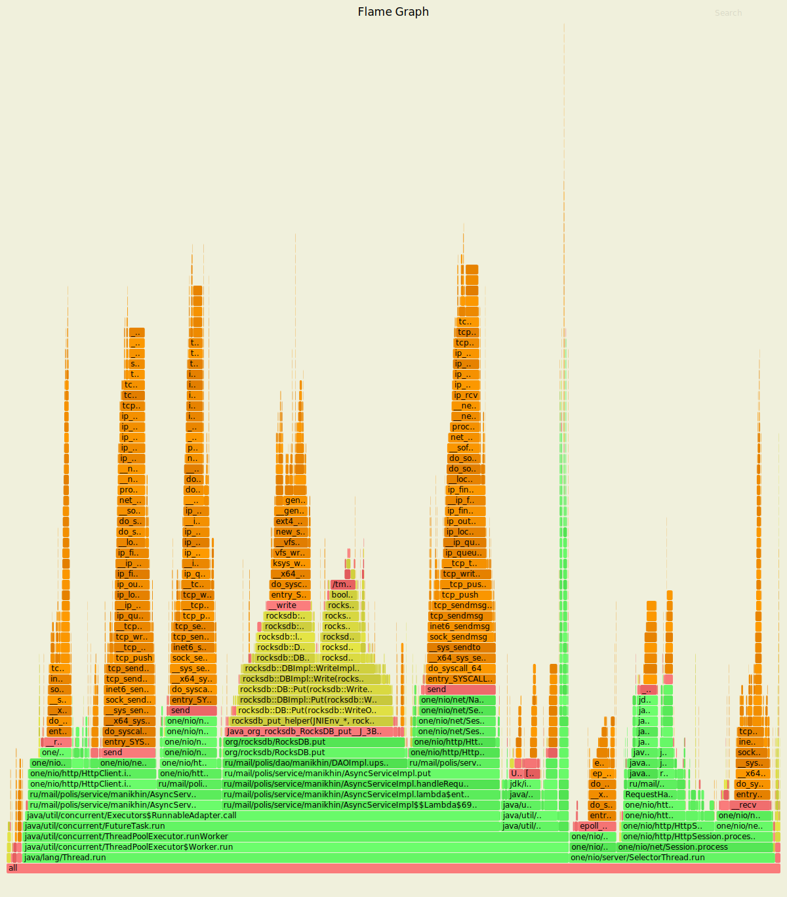
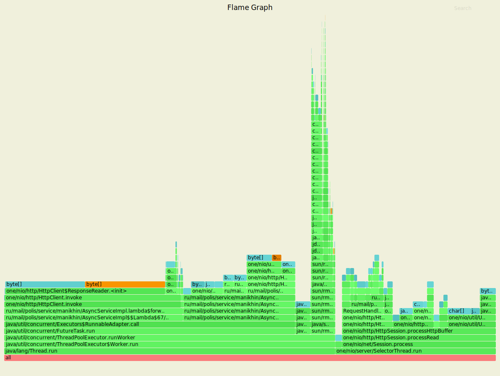
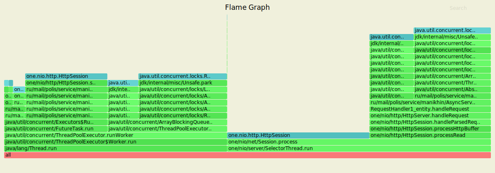
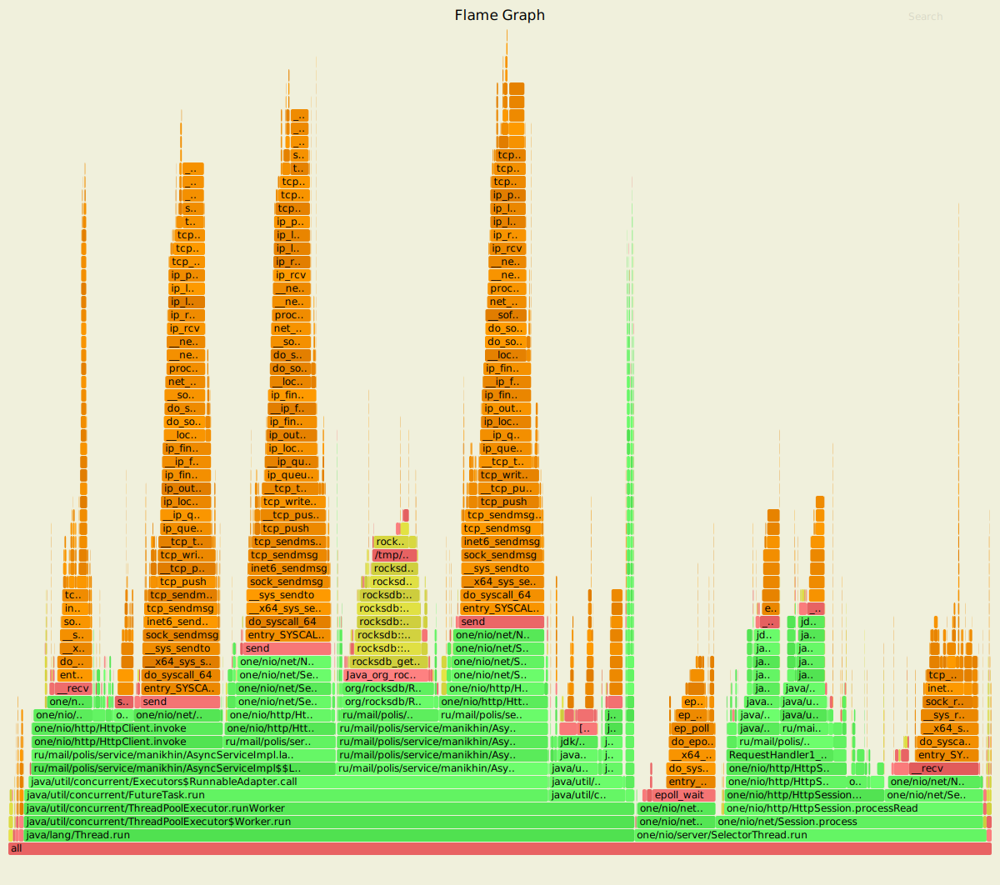
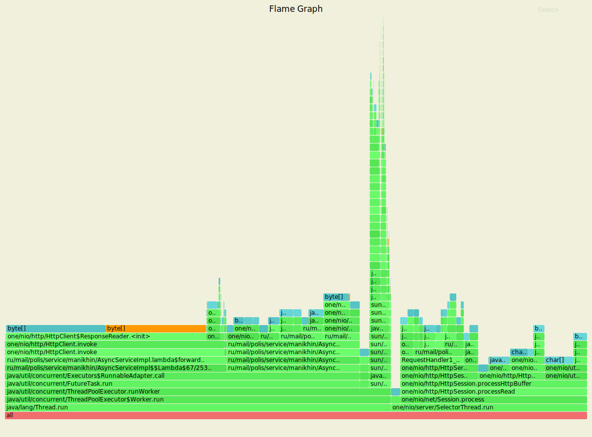
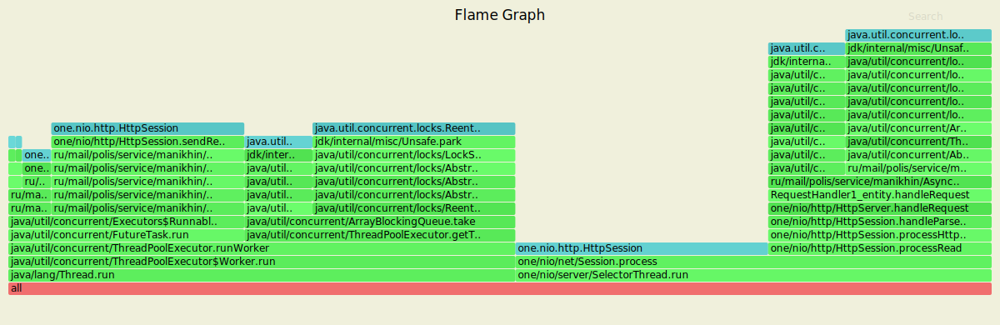

#  Шардирование

На данном этапе было реализовано горизонтальное масштабирование через поддержку кластерных конфигураций,
состоящих из нескольких узлов, взаимодействующих друг с другом через HTTP API. Нагрузочное тестирование проводилось,
как и ранее, путём "обстрела" PUT и GET-запросами реализованного сервера с одним исключением, что тестирование 
проводилось лишь одного узла кластерной конфигурации с адресом `http://127.0.0.1:8080`. 

## Обстрел тестируемого узла PUT-запросами

Параметры запуска wrk
 
 * Количестов потоков, выполняющих отправку запросов на сервер - 4
 * Количестов открытых соединений - 64
 * Количество запросов в секунду -7000
 * Длительность - 60 секунд

Тестирование описанного ранее узла проводилось, по сравнению с предыдущей асинхронной реализацией сервера,
на 7000 запросов в секунду, поскольку данное количество является наиболее оптимальным для максимально возможной
обработки входящий запросов для одного узла. Это связано с тем, что часть входящих запросов проксируется на другие
доступные узлы.
 
Результаты нагрузочного тестирования сервера через wrk представлены ниже:

```
Running 1m test @ http://127.0.0.1:8080
  4 threads and 64 connections
  Thread calibration: mean lat.: 275.274ms, rate sampling interval: 1608ms
  Thread calibration: mean lat.: 175.302ms, rate sampling interval: 941ms
  Thread calibration: mean lat.: 335.339ms, rate sampling interval: 1363ms
  Thread calibration: mean lat.: 644.132ms, rate sampling interval: 3272ms
  Thread Stats   Avg      Stdev     Max   +/- Stdev
    Latency   141.04ms  233.61ms   1.99s    87.04%
    Req/Sec     1.77k   279.34     2.92k    77.44%
  Latency Distribution (HdrHistogram - Recorded Latency)
 50.000%   30.05ms
 75.000%  183.42ms
 90.000%  446.21ms
 99.000%    1.05s 
 99.900%    1.79s 
 99.990%    1.93s 
 99.999%    1.98s 
100.000%    1.99s 

  Detailed Percentile spectrum:
       Value   Percentile   TotalCount 1/(1-Percentile)

       0.146     0.000000            1         1.00
       1.825     0.100000        35252         1.11
       3.017     0.200000        70528         1.25
       5.115     0.300000       105713         1.43
      12.015     0.400000       140975         1.67
      30.047     0.500000       176192         2.00
      44.959     0.550000       193810         2.22
      65.791     0.600000       211421         2.50
      93.503     0.650000       229039         2.86
     130.431     0.700000       246675         3.33
     183.423     0.750000       264291         4.00
     217.215     0.775000       273093         4.44
     253.439     0.800000       281898         5.00
     293.119     0.825000       290727         5.71
     336.895     0.850000       299554         6.67
     384.511     0.875000       308329         8.00
     413.695     0.887500       312729         8.89
     446.207     0.900000       317145        10.00
     482.303     0.912500       321536        11.43
     522.239     0.925000       325947        13.33
     566.271     0.937500       330388        16.00
     590.335     0.943750       332561        17.78
     617.471     0.950000       334787        20.00
     647.679     0.956250       336960        22.86
     685.567     0.962500       339173        26.67
     726.015     0.968750       341363        32.00
     750.591     0.971875       342460        35.56
     779.263     0.975000       343564        40.00
     815.615     0.978125       344663        45.71
     864.767     0.981250       345763        53.33
     921.599     0.984375       346865        64.00
     951.807     0.985938       347414        71.11
     987.135     0.987500       347968        80.00
    1021.951     0.989062       348518        91.43
    1069.055     0.990625       349066       106.67
    1148.927     0.992188       349617       128.00
    1192.959     0.992969       349897       142.22
    1230.847     0.993750       350174       160.00
    1270.783     0.994531       350440       182.86
    1338.367     0.995313       350716       213.33
    1431.551     0.996094       350994       256.00
    1480.703     0.996484       351128       284.44
    1527.807     0.996875       351266       320.00
    1569.791     0.997266       351405       365.71
    1611.775     0.997656       351541       426.67
    1656.831     0.998047       351678       512.00
    1687.551     0.998242       351748       568.89
    1717.247     0.998437       351816       640.00
    1748.991     0.998633       351886       731.43
    1775.615     0.998828       351954       853.33
    1798.143     0.999023       352024      1024.00
    1809.407     0.999121       352057      1137.78
    1821.695     0.999219       352095      1280.00
    1831.935     0.999316       352129      1462.86
    1843.199     0.999414       352164      1706.67
    1851.391     0.999512       352194      2048.00
    1859.583     0.999561       352212      2275.56
    1873.919     0.999609       352230      2560.00
    1885.183     0.999658       352246      2925.71
    1897.471     0.999707       352264      3413.33
    1907.711     0.999756       352280      4096.00
    1912.831     0.999780       352290      4551.11
    1915.903     0.999805       352299      5120.00
    1918.975     0.999829       352307      5851.43
    1924.095     0.999854       352316      6826.67
    1929.215     0.999878       352323      8192.00
    1931.263     0.999890       352329      9102.22
    1935.359     0.999902       352332     10240.00
    1939.455     0.999915       352337     11702.86
    1942.527     0.999927       352342     13653.33
    1944.575     0.999939       352345     16384.00
    1946.623     0.999945       352347     18204.44
    1949.695     0.999951       352349     20480.00
    1952.767     0.999957       352354     23405.71
    1952.767     0.999963       352354     27306.67
    1956.863     0.999969       352357     32768.00
    1956.863     0.999973       352357     36408.89
    1961.983     0.999976       352358     40960.00
    1965.055     0.999979       352359     46811.43
    1968.127     0.999982       352360     54613.33
    1975.295     0.999985       352362     65536.00
    1975.295     0.999986       352362     72817.78
    1975.295     0.999988       352362     81920.00
    1980.415     0.999989       352363     93622.86
    1980.415     0.999991       352363    109226.67
    1984.511     0.999992       352365    131072.00
    1984.511     0.999993       352365    145635.56
    1984.511     0.999994       352365    163840.00
    1984.511     0.999995       352365    187245.71
    1984.511     0.999995       352365    218453.33
    1984.511     0.999996       352365    262144.00
    1984.511     0.999997       352365    291271.11
    1984.511     0.999997       352365    327680.00
    1989.631     0.999997       352366    374491.43
    1989.631     1.000000       352366          inf
#[Mean    =      141.037, StdDeviation   =      233.609]
#[Max     =     1988.608, Total count    =       352366]
#[Buckets =           27, SubBuckets     =         2048]
----------------------------------------------------------
  415826 requests in 1.00m, 32.91MB read
Requests/sec:   6930.36
Transfer/sec:    561.73KB
```

За выставленное время было произведено 415826 PUT-запросов, была достигнута нагрузка в 6930.36
запросов в секунду, что соответствует выставленной стабильной нагрузке. 99% запросов обрабатываются за 1.05s.


#### Результаты с async profiler-а (CPU)


Профилирование cpu с помощью async-profiler показывает следующие результаты:

* Вставка в DAO занимает около 25% процессорных ресурсов
* Получение узла по ключу, на который будет просироваться входящие запросы занимает около 25% процессорных ресурсов  
* Формирование и отправка ответов на входящие запросы занимает около 8% процессорных ресурсов
* Обеспечение работы пула экзекьюторов занимает около 70% процессорных ресурсов

#### Результаты с async profiler-а (ALLOC)


Профилирование выделения памяти (alloc) с помощью async-profiler показывает следующие результаты:

* Под вставку в DAO отводится около 5% общей выделяемой памяти
* Под получение узла по ключу, на который будет проксироваться входящие запросы отводится около 36% 
  общей выделяемой памяти   
* Под формирование и отправку ответов на входящие запросы отводится около 10% общей выделяемой памяти
* Под обеспечение работы пула экзекьюторов отводится около 67% общей выделяемой памяти

#### Результаты с async profiler-a (LOCK)


Профилирование блокировок (lock) с помощью async-profiler показывает следующие результаты:

* Около 45% блокировок приходятся на обеспечение работы пула экзекуторов
* Около 24% блокировок приходится на `ArrayBlockingQueue`, в котором находятся все экзекьютеры
* Около 4% блокировок приходится на получение узла по ключу, на который будет проксироваться входящие запросы
* Около 16% блокировок приходится на формирование и отправку ответов на входящие запросы

## Обстрел тестируемого узла GET-запросами

Параметры запуска wrk
 
 * Количестов потоков, выполняющих отправку запросов на сервер - 4
 * Количестов открытых соединений - 64
 * Количество запросов в секунду -7000
 * Длительность - 60 секунд
 
Тестирование описанного ранее узла проводилось, по сравнению с предыдущей асинхронной реализацией сервера,
на 7000 запросов в секунду, поскольку данное количество является наиболее оптимальным для максимально возможной
обработки входящий запросов для одного узла. Это связано с тем, что часть входящих запросов проксируется на другие
доступные узлы.

Результаты нагрузочного тестирования сервера через wrk представлены ниже:

```
Running 1m test @ http://127.0.0.1:8080
  4 threads and 64 connections
  Thread calibration: mean lat.: 117.824ms, rate sampling interval: 808ms
  Thread calibration: mean lat.: 68.641ms, rate sampling interval: 513ms
  Thread calibration: mean lat.: 51.749ms, rate sampling interval: 333ms
  Thread calibration: mean lat.: 71.854ms, rate sampling interval: 469ms
  Thread Stats   Avg      Stdev     Max   +/- Stdev
    Latency    45.65ms   86.09ms 646.66ms   88.43%
    Req/Sec     1.76k   398.20     3.23k    79.81%
  Latency Distribution (HdrHistogram - Recorded Latency)
 50.000%    7.20ms
 75.000%   42.62ms
 90.000%  155.65ms
 99.000%  406.27ms
 99.900%  551.42ms
 99.990%  629.25ms
 99.999%  645.63ms
100.000%  647.17ms

  Detailed Percentile spectrum:
       Value   Percentile   TotalCount 1/(1-Percentile)

       0.131     0.000000            1         1.00
       1.024     0.100000        34938         1.11
       1.528     0.200000        69883         1.25
       2.203     0.300000       104806         1.43
       3.755     0.400000       139673         1.67
       7.195     0.500000       174611         2.00
      10.263     0.550000       192078         2.22
      14.599     0.600000       209512         2.50
      20.847     0.650000       226981         2.86
      29.631     0.700000       244455         3.33
      42.623     0.750000       261902         4.00
      51.071     0.775000       270629         4.44
      61.663     0.800000       279354         5.00
      75.519     0.825000       288102         5.71
      94.079     0.850000       296823         6.67
     120.063     0.875000       305546         8.00
     136.447     0.887500       309914         8.89
     155.647     0.900000       314269        10.00
     175.743     0.912500       318631        11.43
     197.503     0.925000       322999        13.33
     221.183     0.937500       327374        16.00
     233.727     0.943750       329560        17.78
     246.911     0.950000       331726        20.00
     262.015     0.956250       333912        22.86
     278.527     0.962500       336098        26.67
     298.495     0.968750       338285        32.00
     309.503     0.971875       339364        35.56
     320.511     0.975000       340452        40.00
     332.799     0.978125       341567        45.71
     346.879     0.981250       342641        53.33
     363.007     0.984375       343738        64.00
     373.247     0.985938       344284        71.11
     385.535     0.987500       344823        80.00
     398.079     0.989062       345370        91.43
     411.647     0.990625       345909       106.67
     426.751     0.992188       346456       128.00
     435.711     0.992969       346726       142.22
     445.183     0.993750       347006       160.00
     454.911     0.994531       347277       182.86
     466.687     0.995313       347549       213.33
     480.511     0.996094       347819       256.00
     487.935     0.996484       347957       284.44
     495.359     0.996875       348092       320.00
     504.319     0.997266       348228       365.71
     513.023     0.997656       348366       426.67
     521.983     0.998047       348502       512.00
     527.359     0.998242       348569       568.89
     533.503     0.998437       348640       640.00
     539.647     0.998633       348705       731.43
     544.767     0.998828       348772       853.33
     552.959     0.999023       348844      1024.00
     557.055     0.999121       348881      1137.78
     562.175     0.999219       348909      1280.00
     570.367     0.999316       348944      1462.86
     579.071     0.999414       348979      1706.67
     587.263     0.999512       349013      2048.00
     592.383     0.999561       349029      2275.56
     598.527     0.999609       349046      2560.00
     603.647     0.999658       349063      2925.71
     607.743     0.999707       349079      3413.33
     612.351     0.999756       349096      4096.00
     614.911     0.999780       349105      4551.11
     618.495     0.999805       349113      5120.00
     620.543     0.999829       349124      5851.43
     623.615     0.999854       349130      6826.67
     626.687     0.999878       349139      8192.00
     627.711     0.999890       349143      9102.22
     629.247     0.999902       349149     10240.00
     631.295     0.999915       349152     11702.86
     632.831     0.999927       349156     13653.33
     634.367     0.999939       349161     16384.00
     634.879     0.999945       349162     18204.44
     635.903     0.999951       349165     20480.00
     636.927     0.999957       349168     23405.71
     637.439     0.999963       349169     27306.67
     638.463     0.999969       349172     32768.00
     638.463     0.999973       349172     36408.89
     638.975     0.999976       349174     40960.00
     638.975     0.999979       349174     46811.43
     640.511     0.999982       349175     54613.33
     642.559     0.999985       349176     65536.00
     644.607     0.999986       349177     72817.78
     644.607     0.999988       349177     81920.00
     645.631     0.999989       349179     93622.86
     645.631     0.999991       349179    109226.67
     645.631     0.999992       349179    131072.00
     645.631     0.999993       349179    145635.56
     645.631     0.999994       349179    163840.00
     646.143     0.999995       349180    187245.71
     646.143     0.999995       349180    218453.33
     646.143     0.999996       349180    262144.00
     646.143     0.999997       349180    291271.11
     646.143     0.999997       349180    327680.00
     647.167     0.999997       349181    374491.43
     647.167     1.000000       349181          inf
#[Mean    =       45.653, StdDeviation   =       86.090]
#[Max     =      646.656, Total count    =       349181]
#[Buckets =           27, SubBuckets     =         2048]
----------------------------------------------------------
  415677 requests in 1.00m, 35.22MB read
  Non-2xx or 3xx responses: 38
Requests/sec:   6926.99
Transfer/sec:    600.93KB
```

За выставленное время было произведено 415677 PUT-запросов, была достигнута нагрузка в 6926.36
запросов в секунду, что соответствует выставленной стабильной нагрузке. 99% запросов обрабатываются за 406.27ms.

#### Результаты с async profiler-а (CPU)


Профилирование cpu с помощью async-profiler показывает следующие результаты:

* Получение данных по ключу занимает около 21% процессорных ресурсов
* Получение узла по ключу, на который будет просироваться входящие запросы занимает около 30% процессорных ресурсов  
* Формирование и отправка ответов на входящие запросы занимает около 11% процессорных ресурсов
* Обеспечение работы пула экзекьюторов занимает около 62% процессорных ресурсов

#### Результаты с async profiler-а (ALLOC)


Профилирование выделения памяти (alloc) с помощью async-profiler показывает следующие результаты:

* Под получение данных по ключу отводится около 22% общей выделяемой памяти
* Под получение узла по ключу, на который будет проксироваться входящие запросы отводится около 37% 
  общей выделяемой памяти   
* Под формирование и отправку ответов на входящие запросы отводится около % общей выделяемой памяти
* Под обеспечение работы пула экзекьюторов отводится около 66% общей выделяемой памяти

#### Результаты с async profiler-a (LOCK)


Профилирование блокировок (lock) с помощью async-profiler показывает следующие результаты:

* Около 50% блокировок приходятся на обеспечение работы пула экзекуторов
* Около 27% блокировок приходится на `ArrayBlockingQueue`, в котором находятся все экзекьютеры
* Около 4% блокировок приходится на получение узла по ключу, на который будет проксироваться входящие запросы
* Около 3% блокировок приходится на формирование и отправку ответов на входящие запросы

## Выводы

По сравнению с асинхронной реализацией сервера без шарнирования - произовдительность обработываемых запросов снизилась
на 2000 запросов в секунду. Результат асихнронной реализации без шарнирования составлял около 10000 обработываемых входящих 
запросов. Но, если учесть что на данный момент за обработку входящих запросов отвечают 3 узла - производительнось увеличилась
на 11000 обрабатываемых запросов в секунду, поскольку каждый узел, по результатам проведённого тестирования, может обрабатывать
около 7000 входящих запросов.