#  Репликация

На данном этапе была реализована поддержка хранения нескольких реплик данных
в кластере для обеспечения отказоустойчивости

## Обстрел сервера PUT-запросами

Параметры запуска wrk
 
 * Количестов потоков, выполняющих отправку запросов на сервер - 4
 * Количестов открытых соединений - 64
 * Количество запросов в секунду - 7000
 * Длительность - 60 секунд
 
Тестирование описанного ранее узла проводилось на 7000 запросов в секунду, поскольку данное количество является наиболее оптимальным для максимально возможной
обработки входящий запросов для одного узла. Это связано с тем, что часть входящих запросов проксируется на другие
доступные узлы и, что немало важно, слабым железом на машине, на которой проводилось данное тестирование.

## Обстрел тестируемого узла PUT-запросами (при ack = 1 и from = 3)
 
Результаты нагрузочного тестирования сервера через wrk представлены ниже:
```
Running 1m test @ http://127.0.0.1:8080
  4 threads and 64 connections
  Thread calibration: mean lat.: 2123.901ms, rate sampling interval: 7221ms
  Thread calibration: mean lat.: 2411.015ms, rate sampling interval: 8105ms
  Thread calibration: mean lat.: 2743.955ms, rate sampling interval: 8863ms
  Thread calibration: mean lat.: 1785.677ms, rate sampling interval: 7999ms
  Thread Stats   Avg      Stdev     Max   +/- Stdev
    Latency    16.90s     7.45s   33.16s    58.89%
    Req/Sec   844.87     78.22     1.00k    69.57%
  Latency Distribution (HdrHistogram - Recorded Latency)
 50.000%   16.65s 
 75.000%   23.00s 
 90.000%   27.38s 
 99.000%   30.93s 
 99.900%   32.72s 
 99.990%   33.05s 
 99.999%   33.13s 
100.000%   33.18s 

  Detailed Percentile spectrum:
       Value   Percentile   TotalCount 1/(1-Percentile)

    3692.543     0.000000            1         1.00
    6959.103     0.100000        16912         1.11
    9019.391     0.200000        33796         1.25
   11714.559     0.300000        50721         1.43
   14286.847     0.400000        67581         1.67
   16646.143     0.500000        84504         2.00
   18104.319     0.550000        92934         2.22
   19431.423     0.600000       101401         2.50
   20660.223     0.650000       109789         2.86
   21872.639     0.700000       118234         3.33
   23003.135     0.750000       126785         4.00
   23642.111     0.775000       130935         4.44
   24281.087     0.800000       135218         5.00
   25034.751     0.825000       139346         5.71
   25870.335     0.850000       143567         6.67
   26591.231     0.875000       147841         8.00
   27033.599     0.887500       149991         8.89
   27377.663     0.900000       152049        10.00
   27721.727     0.912500       154175        11.43
   28049.407     0.925000       156270        13.33
   28409.855     0.937500       158406        16.00
   28573.695     0.943750       159420        17.78
   28803.071     0.950000       160537        20.00
   29016.063     0.956250       161553        22.86
   29278.207     0.962500       162605        26.67
   29507.583     0.968750       163618        32.00
   29671.423     0.971875       164178        35.56
   29818.879     0.975000       164713        40.00
   29982.719     0.978125       165243        45.71
   30162.943     0.981250       165765        53.33
   30425.087     0.984375       166265        64.00
   30572.543     0.985938       166535        71.11
   30719.999     0.987500       166832        80.00
   30834.687     0.989062       167052        91.43
   30998.527     0.990625       167340       106.67
   31227.903     0.992188       167597       128.00
   31326.207     0.992969       167723       142.22
   31440.895     0.993750       167854       160.00
   31653.887     0.994531       167973       182.86
   31817.727     0.995313       168129       213.33
   31981.567     0.996094       168242       256.00
   32079.871     0.996484       168305       284.44
   32194.559     0.996875       168368       320.00
   32309.247     0.997266       168440       365.71
   32407.551     0.997656       168513       426.67
   32489.471     0.998047       168575       512.00
   32505.855     0.998242       168604       568.89
   32555.007     0.998437       168639       640.00
   32604.159     0.998633       168666       731.43
   32669.695     0.998828       168700       853.33
   32718.847     0.999023       168729      1024.00
   32784.383     0.999121       168766      1137.78
   32784.383     0.999219       168766      1280.00
   32800.767     0.999316       168782      1462.86
   32833.535     0.999414       168802      1706.67
   32849.919     0.999512       168811      2048.00
   32915.455     0.999561       168827      2275.56
   32931.839     0.999609       168837      2560.00
   32931.839     0.999658       168837      2925.71
   32948.223     0.999707       168846      3413.33
   32964.607     0.999756       168857      4096.00
   32964.607     0.999780       168857      4551.11
   32980.991     0.999805       168865      5120.00
   32980.991     0.999829       168865      5851.43
   32997.375     0.999854       168871      6826.67
   33013.759     0.999878       168873      8192.00
   33046.527     0.999890       168876      9102.22
   33062.911     0.999902       168877     10240.00
   33079.295     0.999915       168879     11702.86
   33095.679     0.999927       168885     13653.33
   33095.679     0.999939       168885     16384.00
   33095.679     0.999945       168885     18204.44
   33095.679     0.999951       168885     20480.00
   33112.063     0.999957       168888     23405.71
   33112.063     0.999963       168888     27306.67
   33112.063     0.999969       168888     32768.00
   33128.447     0.999973       168891     36408.89
   33128.447     0.999976       168891     40960.00
   33128.447     0.999979       168891     46811.43
   33128.447     0.999982       168891     54613.33
   33128.447     0.999985       168891     65536.00
   33128.447     0.999986       168891     72817.78
   33128.447     0.999988       168891     81920.00
   33144.831     0.999989       168892     93622.86
   33144.831     0.999991       168892    109226.67
   33144.831     0.999992       168892    131072.00
   33144.831     0.999993       168892    145635.56
   33144.831     0.999994       168892    163840.00
   33177.599     0.999995       168893    187245.71
   33177.599     1.000000       168893          inf
#[Mean    =    16897.833, StdDeviation   =     7450.093]
#[Max     =    33161.216, Total count    =       168893]
#[Buckets =           27, SubBuckets     =         2048]
----------------------------------------------------------
  206224 requests in 1.00m, 13.18MB read
Requests/sec:   3436.63
Transfer/sec:    224.86KB
```
За выставленное время было произведено 206224 PUT-запросов, была достигнута нагрузка в 3436.63
запросов в секунду. При нагрузке в 99% время обработки запросов занимает около 30.93 секунд.
По сравнению с реализацией сервера с шарнированием уменьшилось количество обрабатываемых запросов в секунду. 

#### Результаты с async profiler-а (CPU)
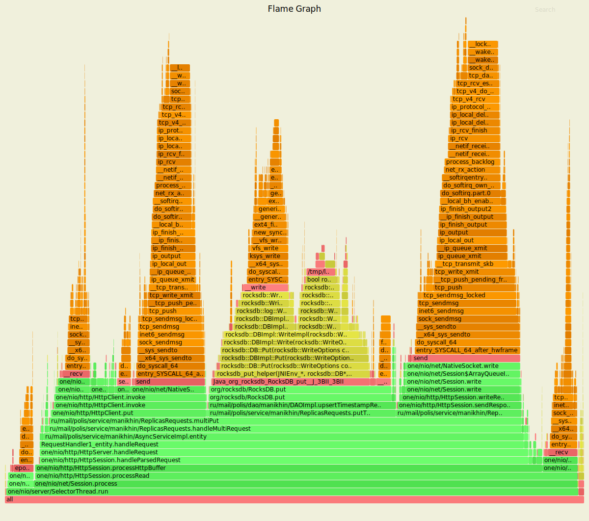

Профилирование cpu с помощью async-profiler показывает следующие результаты:

* Вставка свежей записи в DAO занимает около 32% процессорных ресурсов
* Просирование входящих запросов занимает около 26% процессорных ресурсов  
* Формирование и отправка ответов на входящие запросы занимает около 21.69% процессорных ресурсов
* Обработка входящих запросов на сохранение свежих записей в методе `multiPut` 
  занимает около 80% процессорных ресурсов

#### Результаты с async profiler-а (ALLOC)
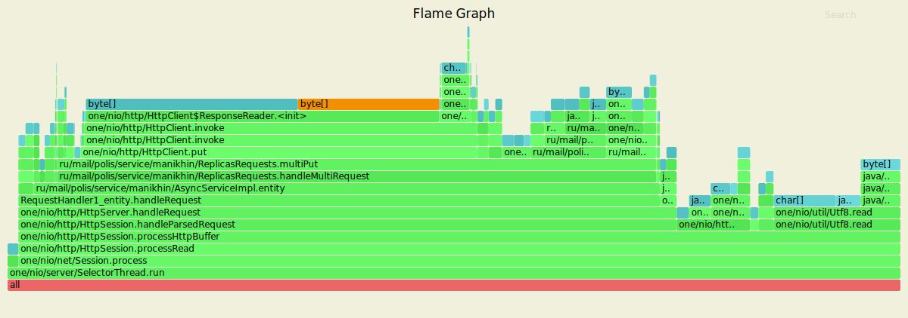

Профилирование выделения памяти (alloc) с помощью async-profiler показывает следующие результаты:

* Под вставку свежих записей в DAO отводится около 8% общей выделяемой памяти
* Под проксирование входящих запросов отводится около 44% общей выделяемой памяти   
* Под формирование и отправку ответов на входящие запросы отводится около 5% общей выделяемой памяти
* Под обработку входящих запросов на сохранение свежих записей в методе `multiPut` 
  отводится около 6% общей выделяемой памяти

#### Результаты с async profiler-a (LOCK)
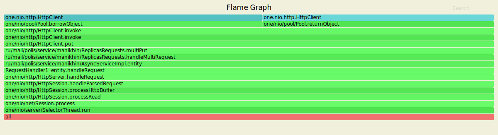

Профилирование блокировок (lock) с помощью async-profiler показывает следующие результаты:

* Около 100% блокировок призодится на вставку свежих записей в DAO отводится
* Около 100% блокировок приходится на проксирование входящие запросов
* Около 100% блокировок приходится на формирование и отправку ответов на входящие запросы

## Обстрел тестируемого узла PUT-запросами (при ack = 2 и from = 3)

Результаты нагрузочного тестирования сервера через wrk представлены ниже:
```
Running 1m test @ http://127.0.0.1:8080
  4 threads and 64 connections
  Thread calibration: mean lat.: 2561.338ms, rate sampling interval: 9543ms
  Thread calibration: mean lat.: 2638.001ms, rate sampling interval: 9371ms
  Thread calibration: mean lat.: 2932.385ms, rate sampling interval: 9306ms
  Thread calibration: mean lat.: 2412.471ms, rate sampling interval: 9297ms
  Thread Stats   Avg      Stdev     Max   +/- Stdev
    Latency    15.58s     6.89s   31.87s    58.64%
    Req/Sec     0.99k   117.85     1.35k    75.00%
  Latency Distribution (HdrHistogram - Recorded Latency)
 50.000%   15.17s 
 75.000%   21.22s 
 90.000%   25.40s 
 99.000%   29.56s 
 99.900%   31.64s 
 99.990%   31.83s 
 99.999%   31.88s 
100.000%   31.88s 

  Detailed Percentile spectrum:
       Value   Percentile   TotalCount 1/(1-Percentile)

    2332.671     0.000000            1         1.00
    6873.087     0.100000        19827         1.11
    8310.783     0.200000        39626         1.25
   10452.991     0.300000        59466         1.43
   12754.943     0.400000        79234         1.67
   15171.583     0.500000        99031         2.00
   16367.615     0.550000       108918         2.22
   17711.103     0.600000       118934         2.50
   18792.447     0.650000       128714         2.86
   20054.015     0.700000       138626         3.33
   21217.279     0.750000       148522         4.00
   21741.567     0.775000       153501         4.44
   22364.159     0.800000       158502         5.00
   23117.823     0.825000       163396         5.71
   23904.255     0.850000       168391         6.67
   24739.839     0.875000       173242         8.00
   25051.135     0.887500       175740         8.89
   25395.199     0.900000       178361        10.00
   25706.495     0.912500       180809        11.43
   26050.559     0.925000       183166        13.33
   26542.079     0.937500       185636        16.00
   26771.455     0.943750       186968        17.78
   26968.063     0.950000       188105        20.00
   27197.439     0.956250       189427        22.86
   27394.047     0.962500       190597        26.67
   27721.727     0.968750       191835        32.00
   27885.567     0.971875       192481        35.56
   28098.559     0.975000       193049        40.00
   28442.623     0.978125       193674        45.71
   28819.455     0.981250       194290        53.33
   29065.215     0.984375       194914        64.00
   29294.591     0.985938       195206        71.11
   29409.279     0.987500       195556        80.00
   29507.583     0.989062       195866        91.43
   29622.271     0.990625       196145       106.67
   29769.727     0.992188       196472       128.00
   29818.879     0.992969       196600       142.22
   29949.951     0.993750       196753       160.00
   30212.095     0.994531       196911       182.86
   30375.935     0.995313       197076       213.33
   30605.311     0.996094       197217       256.00
   30965.759     0.996484       197298       284.44
   31096.831     0.996875       197383       320.00
   31227.903     0.997266       197448       365.71
   31424.511     0.997656       197526       426.67
   31506.431     0.998047       197607       512.00
   31539.199     0.998242       197656       568.89
   31571.967     0.998437       197709       640.00
   31588.351     0.998633       197748       731.43
   31604.735     0.998828       197760       853.33
   31637.503     0.999023       197820      1024.00
   31637.503     0.999121       197820      1137.78
   31653.887     0.999219       197840      1280.00
   31670.271     0.999316       197865      1462.86
   31686.655     0.999414       197884      1706.67
   31703.039     0.999512       197895      2048.00
   31719.423     0.999561       197927      2275.56
   31719.423     0.999609       197927      2560.00
   31719.423     0.999658       197927      2925.71
   31735.807     0.999707       197936      3413.33
   31768.575     0.999756       197947      4096.00
   31768.575     0.999780       197947      4551.11
   31784.959     0.999805       197951      5120.00
   31801.343     0.999829       197964      5851.43
   31801.343     0.999854       197964      6826.67
   31817.727     0.999878       197967      8192.00
   31834.111     0.999890       197974      9102.22
   31834.111     0.999902       197974     10240.00
   31834.111     0.999915       197974     11702.86
   31866.879     0.999927       197977     13653.33
   31866.879     0.999939       197977     16384.00
   31883.263     0.999945       197989     18204.44
   31883.263     1.000000       197989          inf
#[Mean    =    15580.046, StdDeviation   =     6890.568]
#[Max     =    31866.880, Total count    =       197989]
#[Buckets =           27, SubBuckets     =         2048]
----------------------------------------------------------
  231265 requests in 1.00m, 14.78MB read
Requests/sec:   3853.95
Transfer/sec:    252.16KB
```

За выставленное время было произведено 231265 PUT-запросов, была достигнута нагрузка в 3853.95
запросов в секунду. При нагрузке в 99% время обработки запросов занимает около 29.56 секунд.
По сравнению с реализацией сервера с шарнированием уменьшилось количество обрабатываемых запросов в секунду.

#### Результаты с async profiler-а (CPU)
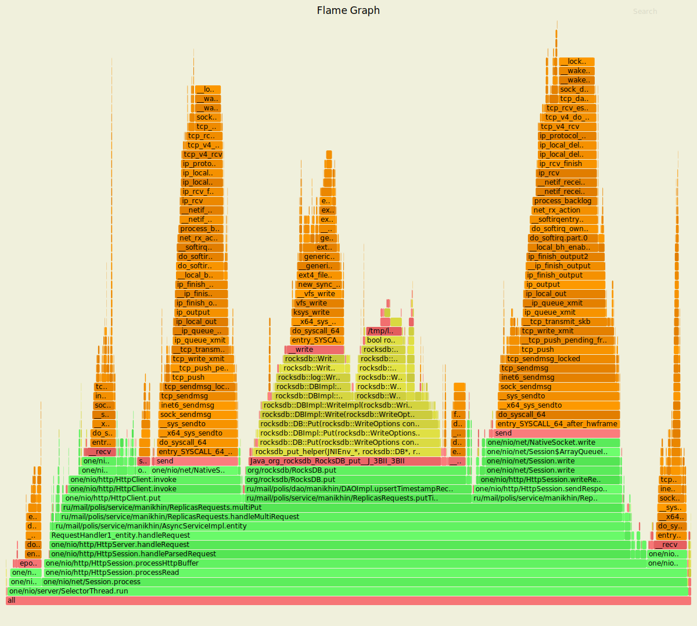

Профилирование cpu с помощью async-profiler показывает следующие результаты:

* Вставка свежей записи в DAO занимает около 32% процессорных ресурсов
* Просирование входящих запросов занимает около 25% процессорных ресурсов  
* Формирование и отправка ответов на входящие запросы занимает около 21.69% процессорных ресурсов
* Обработка входящих запросов на сохранение свежих записей в методе `multiPut` 
  занимает около 80% процессорных ресурсов


#### Результаты с async profiler-а (ALLOC)
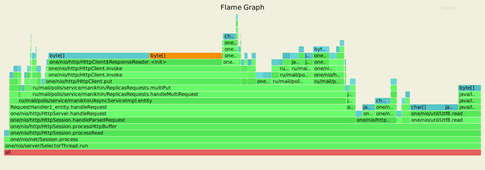

Профилирование выделения памяти (alloc) с помощью async-profiler показывает следующие результаты:

* Под вставку свежих записей в DAO отводится около 7% общей выделяемой памяти
* Под проксирование входящих запросов отводится около 40% общей выделяемой памяти   
* Под формирование и отправку ответов на входящие запросы отводится около 6.53% общей выделяемой памяти
* Под обработку входящих запросов на сохранение свежих записей в методе `multiPut` 
  отводится около 80% общей выделяемой памяти

#### Результаты с async profiler-a (LOCK)
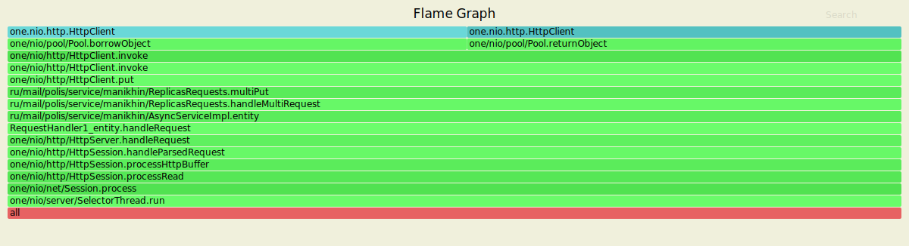

Профилирование блокировок (lock) с помощью async-profiler показывает следующие результаты:

* Около 100% блокировок призодится на вставку свежих записей в DAO отводится
* Около 100% блокировок приходится на проксирование входящие запросов
* Около 100% блокировок приходится на формирование и отправку ответов на входящие запросы

## Обстрел сервера GET-запросами

Параметры запуска wrk
 
 * Количестов потоков, выполняющих отправку запросов на сервер - 4
 * Количестов открытых соединений - 64
 * Количество запросов в секунду - 7000
 * Длительность - 60 секунд
 
Тестирование описанного ранее узла проводилось на 7000 запросов в секунду, поскольку данное количество является наиболее оптимальным для максимально возможной
обработки входящий запросов для одного узла. Это связано с тем, что часть входящих запросов проксируется на другие
доступные узлы и, что немало важно, слабым железом на машине, на которой проводилось данное тестирование.

## Обстрел тестируемого узла GET-запросами (при ack = 1 и from = 3)

Результаты нагрузочного тестирования сервера через wrk представлены ниже:
```
Running 1m test @ http://127.0.0.1:8080
  4 threads and 64 connections
  Thread calibration: mean lat.: 1062.384ms, rate sampling interval: 4024ms
  Thread calibration: mean lat.: 518.968ms, rate sampling interval: 2791ms
  Thread calibration: mean lat.: 1314.617ms, rate sampling interval: 5582ms
  Thread calibration: mean lat.: 2008.626ms, rate sampling interval: 6803ms
  Thread Stats   Avg      Stdev     Max   +/- Stdev
    Latency     6.50s     4.42s   23.23s    68.45%
    Req/Sec     1.35k   276.48     1.98k    61.36%
  Latency Distribution (HdrHistogram - Recorded Latency)
 50.000%    5.60s 
 75.000%    9.03s 
 90.000%   13.37s 
 99.000%   18.20s 
 99.900%   21.81s 
 99.990%   23.15s 
 99.999%   23.25s 
100.000%   23.25s 

  Detailed Percentile spectrum:
       Value   Percentile   TotalCount 1/(1-Percentile)

       0.310     0.000000            1         1.00
    1576.959     0.100000        25784         1.11
    2680.831     0.200000        51597         1.25
    3581.951     0.300000        77385         1.43
    4501.503     0.400000       103160         1.67
    5595.135     0.500000       128961         2.00
    6053.887     0.550000       141799         2.22
    6545.407     0.600000       154738         2.50
    7323.647     0.650000       167619         2.86
    8196.095     0.700000       180456         3.33
    9027.583     0.750000       193439         4.00
    9502.719     0.775000       199792         4.44
   10059.775     0.800000       206250         5.00
   10928.127     0.825000       212693         5.71
   11599.871     0.850000       219150         6.67
   12386.303     0.875000       225581         8.00
   12869.631     0.887500       228812         8.89
   13369.343     0.900000       232027        10.00
   13860.863     0.912500       235273        11.43
   14426.111     0.925000       238478        13.33
   14974.975     0.937500       241722        16.00
   15204.351     0.943750       243348        17.78
   15368.191     0.950000       244913        20.00
   15556.607     0.956250       246547        22.86
   15802.367     0.962500       248151        26.67
   16252.927     0.968750       249769        32.00
   16400.383     0.971875       250554        35.56
   16588.799     0.975000       251358        40.00
   16859.135     0.978125       252164        45.71
   17137.663     0.981250       252985        53.33
   17530.879     0.984375       253768        64.00
   17727.487     0.985938       254174        71.11
   17940.479     0.987500       254609        80.00
   18104.319     0.989062       254994        91.43
   18300.927     0.990625       255400       106.67
   18497.535     0.992188       255810       128.00
   18677.759     0.992969       255984       142.22
   18874.367     0.993750       256198       160.00
   19087.359     0.994531       256389       182.86
   19316.735     0.995313       256593       213.33
   19611.647     0.996094       256790       256.00
   19726.335     0.996484       256895       284.44
   19873.791     0.996875       256995       320.00
   20070.399     0.997266       257101       365.71
   20316.159     0.997656       257190       426.67
   20545.535     0.998047       257292       512.00
   20742.143     0.998242       257345       568.89
   20889.599     0.998437       257399       640.00
   20987.903     0.998633       257447       731.43
   21463.039     0.998828       257493       853.33
   21905.407     0.999023       257544      1024.00
   22118.399     0.999121       257571      1137.78
   22331.391     0.999219       257593      1280.00
   22413.311     0.999316       257620      1462.86
   22527.999     0.999414       257645      1706.67
   22626.303     0.999512       257671      2048.00
   22675.455     0.999561       257682      2275.56
   22724.607     0.999609       257698      2560.00
   22757.375     0.999658       257707      2925.71
   22806.527     0.999707       257723      3413.33
   22839.295     0.999756       257735      4096.00
   22855.679     0.999780       257739      4551.11
   22872.063     0.999805       257744      5120.00
   22888.447     0.999829       257750      5851.43
   23117.823     0.999854       257757      6826.67
   23134.207     0.999878       257764      8192.00
   23150.591     0.999890       257769      9102.22
   23150.591     0.999902       257769     10240.00
   23166.975     0.999915       257776     11702.86
   23166.975     0.999927       257776     13653.33
   23199.743     0.999939       257781     16384.00
   23199.743     0.999945       257781     18204.44
   23216.127     0.999951       257785     20480.00
   23216.127     0.999957       257785     23405.71
   23216.127     0.999963       257785     27306.67
   23232.511     0.999969       257787     32768.00
   23232.511     0.999973       257787     36408.89
   23248.895     0.999976       257794     40960.00
   23248.895     1.000000       257794          inf
#[Mean    =     6500.708, StdDeviation   =     4422.991]
#[Max     =    23232.512, Total count    =       257794]
#[Buckets =           27, SubBuckets     =         2048]
----------------------------------------------------------
  309162 requests in 1.00m, 21.08MB read
  Non-2xx or 3xx responses: 94539
Requests/sec:   5152.72
Transfer/sec:    359.80KB
```

За выставленное время было произведено 309162 GET-запросов, была достигнута нагрузка в 5152.72
запросов в секунду. При нагрузке в 99% время обработки запросов занимает около 18.20 секунд.
По сравнению с реализацией сервера с шарнированием уменьшилось количество обрабатываемых запросов в секунду.

#### Результаты с async profiler-а (CPU)
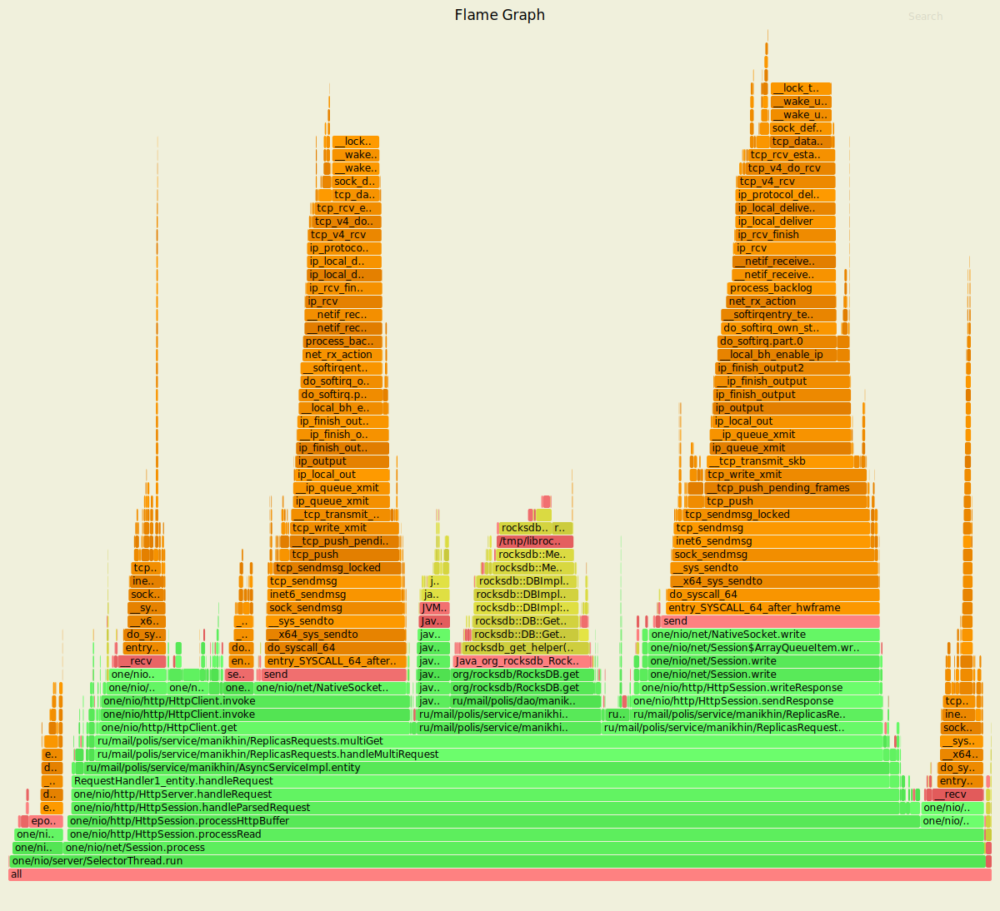

Профилирование cpu с помощью async-profiler показывает следующие результаты:

* Получение свежей записи из DAO занимает около 15% процессорных ресурсов
* Просирование входящих запросов занимает около 31% процессорных ресурсов  
* Формирование и отправка ответов на входящие запросы занимает около 25.60% процессорных ресурсов
* Обработка входящих запросов на получение свежих записей в методе `multiGet` 
  занимает около 80% процессорных ресурсов

#### Результаты с async profiler-а (ALLOC)
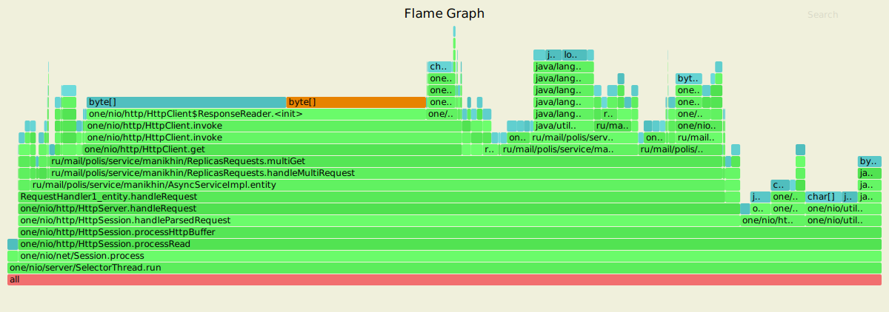

Профилирование выделения памяти (alloc) с помощью async-profiler показывает следующие результаты:

* Под получение свежих записей из DAO отводится около 15% общей выделяемой памяти
* Под проксирование входящих запросов отводится около 43% общей выделяемой памяти   
* Под формирование и отправку ответов на входящие запросы отводится около 5.36% общей выделяемой памяти
* Под обработку входящих запросов на получение свежих записей в методе `multiGet` 
  отводится около 77% общей выделяемой памяти

#### Результаты с async profiler-a (LOCK)
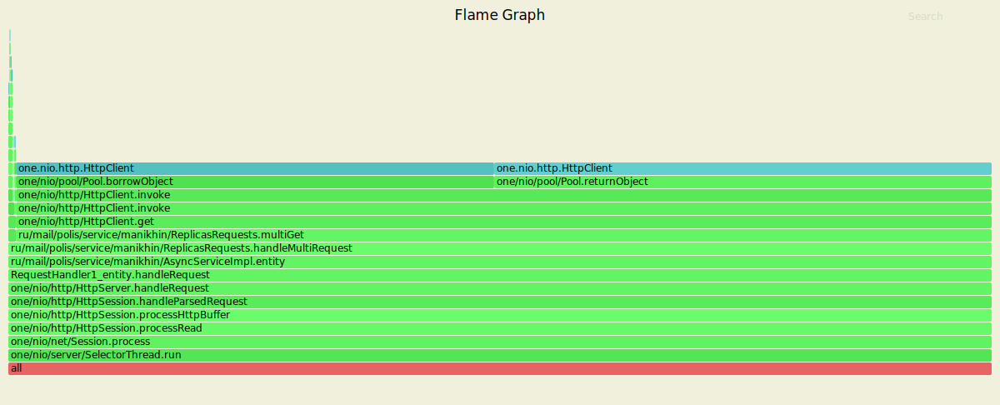

Профилирование блокировок (lock) с помощью async-profiler показывает следующие результаты:

* Около 99% блокировок приходится на получение свежих записей из DAO
* Около 99% блокировок приходится на проксирование входящие запросов
* Около 99% блокировок приходится на формирование и отправку ответов на входящие запросы

## Обстрел тестируемого узла GET-запросами (при ack = 2 и from = 3)

Результаты нагрузочного тестирования сервера через wrk представлены ниже:
```
Running 1m test @ http://127.0.0.1:8080
  4 threads and 64 connections
  Thread calibration: mean lat.: 430.623ms, rate sampling interval: 2383ms
  Thread calibration: mean lat.: 166.459ms, rate sampling interval: 927ms
  Thread calibration: mean lat.: 1256.917ms, rate sampling interval: 4210ms
  Thread calibration: mean lat.: 530.557ms, rate sampling interval: 2420ms
  Thread Stats   Avg      Stdev     Max   +/- Stdev
    Latency     3.54s     2.93s   14.11s    69.28%
    Req/Sec     1.46k   460.64     3.02k    70.19%
  Latency Distribution (HdrHistogram - Recorded Latency)
 50.000%    3.11s 
 75.000%    5.29s 
 90.000%    7.69s 
 99.000%   12.12s 
 99.900%   13.80s 
 99.990%   14.09s 
 99.999%   14.12s 
100.000%   14.12s 

  Detailed Percentile spectrum:
       Value   Percentile   TotalCount 1/(1-Percentile)

       0.267     0.000000            1         1.00
     387.327     0.100000        29431         1.11
     782.335     0.200000        58901         1.25
    1260.543     0.300000        88296         1.43
    1964.031     0.400000       117739         1.67
    3108.863     0.500000       147167         2.00
    3614.719     0.550000       161928         2.22
    4046.847     0.600000       176588         2.50
    4403.199     0.650000       191332         2.86
    4866.047     0.700000       206037         3.33
    5287.935     0.750000       220767         4.00
    5566.463     0.775000       228104         4.44
    5820.415     0.800000       235465         5.00
    6164.479     0.825000       242818         5.71
    6492.159     0.850000       250166         6.67
    6950.911     0.875000       257550         8.00
    7360.511     0.887500       261221         8.89
    7692.287     0.900000       264887        10.00
    7938.047     0.912500       268557        11.43
    8216.575     0.925000       272255        13.33
    8617.983     0.937500       275919        16.00
    8863.743     0.943750       277766        17.78
    9142.271     0.950000       279603        20.00
    9682.943     0.956250       281436        22.86
   10207.231     0.962500       283301        26.67
   10477.567     0.968750       285140        32.00
   10633.215     0.971875       286046        35.56
   10846.207     0.975000       286967        40.00
   11132.927     0.978125       287870        45.71
   11304.959     0.981250       288821        53.33
   11501.567     0.984375       289755        64.00
   11616.255     0.985938       290172        71.11
   11788.287     0.987500       290640        80.00
   11984.895     0.989062       291091        91.43
   12214.271     0.990625       291547       106.67
   12451.839     0.992188       292009       128.00
   12591.103     0.992969       292243       142.22
   12705.791     0.993750       292491       160.00
   12746.751     0.994531       292709       182.86
   12943.359     0.995313       292926       213.33
   13107.199     0.996094       293161       256.00
   13205.503     0.996484       293287       284.44
   13262.847     0.996875       293391       320.00
   13369.343     0.997266       293501       365.71
   13426.687     0.997656       293621       426.67
   13475.839     0.998047       293740       512.00
   13557.759     0.998242       293806       568.89
   13606.911     0.998437       293860       640.00
   13639.679     0.998633       293917       731.43
   13688.831     0.998828       293978       853.33
   13811.711     0.999023       294052      1024.00
   13811.711     0.999121       294052      1137.78
   13819.903     0.999219       294088      1280.00
   13828.095     0.999316       294107      1462.86
   13852.671     0.999414       294144      1706.67
   13860.863     0.999512       294165      2048.00
   13869.055     0.999561       294188      2275.56
   13877.247     0.999609       294202      2560.00
   13885.439     0.999658       294208      2925.71
   14032.895     0.999707       294219      3413.33
   14065.663     0.999756       294239      4096.00
   14073.855     0.999780       294249      4551.11
   14073.855     0.999805       294249      5120.00
   14082.047     0.999829       294274      5851.43
   14082.047     0.999854       294274      6826.67
   14082.047     0.999878       294274      8192.00
   14082.047     0.999890       294274      9102.22
   14090.239     0.999902       294286     10240.00
   14090.239     0.999915       294286     11702.86
   14090.239     0.999927       294286     13653.33
   14098.431     0.999939       294296     16384.00
   14098.431     0.999945       294296     18204.44
   14098.431     0.999951       294296     20480.00
   14098.431     0.999957       294296     23405.71
   14098.431     0.999963       294296     27306.67
   14106.623     0.999969       294298     32768.00
   14106.623     0.999973       294298     36408.89
   14106.623     0.999976       294298     40960.00
   14114.815     0.999979       294300     46811.43
   14114.815     0.999982       294300     54613.33
   14123.007     0.999985       294305     65536.00
   14123.007     1.000000       294305          inf
#[Mean    =     3543.910, StdDeviation   =     2926.317]
#[Max     =    14114.816, Total count    =       294305]
#[Buckets =           27, SubBuckets     =         2048]
----------------------------------------------------------
  355335 requests in 1.00m, 24.24MB read
  Non-2xx or 3xx responses: 109828
Requests/sec:   5921.82
Transfer/sec:    413.64KB
```

За выставленное время было произведено 355335 GET-запросов, была достигнута нагрузка в 5921.82
запросов в секунду. При нагрузке в 99% время обработки запросов занимает около 12.12 секунд.
По сравнению с реализацией сервера с шарнированием уменьшилось количество обрабатываемых запросов в секунду.

#### Результаты с async profiler-а (CPU)
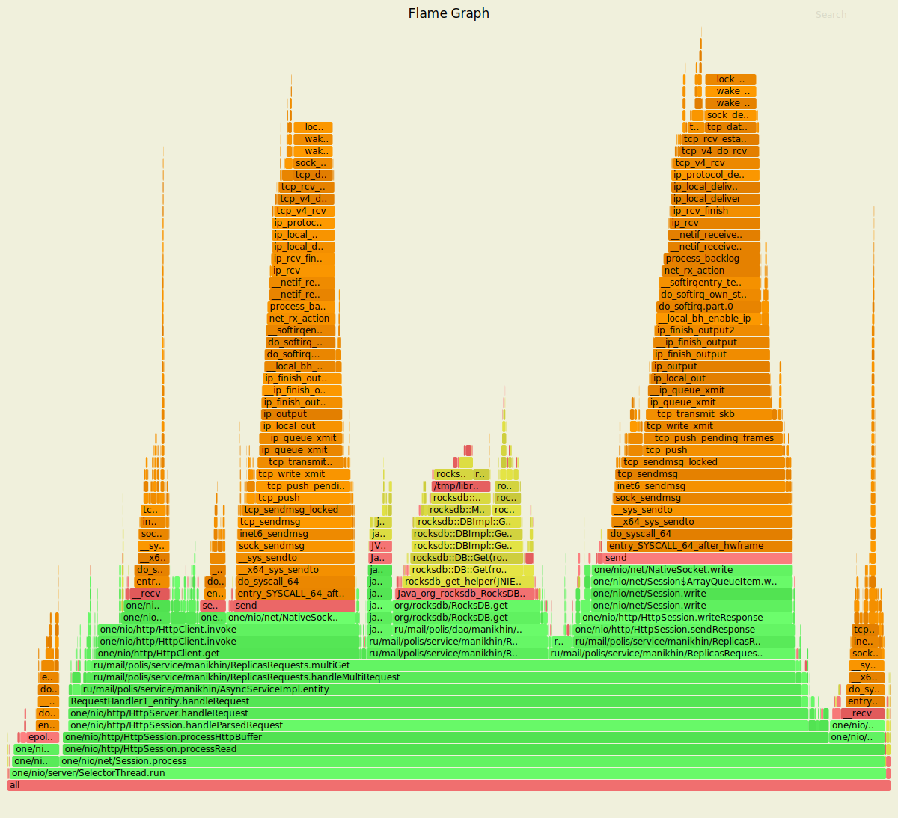

Профилирование cpu с помощью async-profiler показывает следующие результаты:

* Получение свежей записи из DAO занимает около 17% процессорных ресурсов
* Просирование входящих запросов занимает около 29% процессорных ресурсов  
* Формирование и отправка ответов на входящие запросы занимает около 25.60% процессорных ресурсов
* Обработка входящих запросов на получение свежих записей в методе `multiGet` 
  занимает около 79% процессорных ресурсов

#### Результаты с async profiler-а (ALLOC)
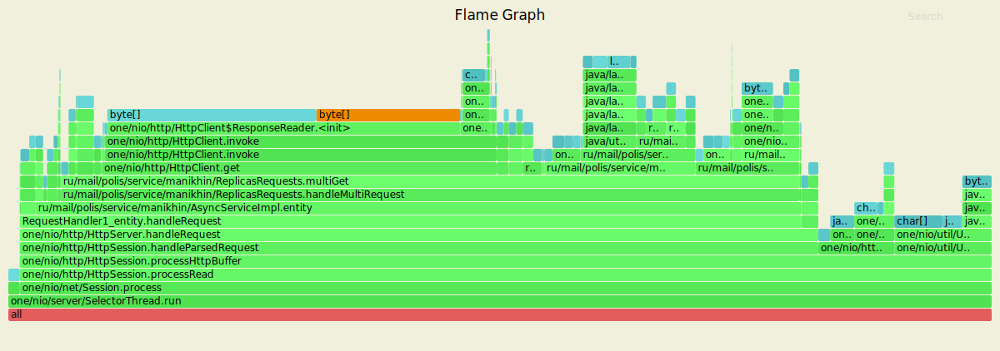

Профилирование выделения памяти (alloc) с помощью async-profiler показывает следующие результаты:

* Под получение свежих записей из DAO отводится около 5% общей выделяемой памяти
* Под проксирование входящих запросов отводится около 39% общей выделяемой памяти   
* Под формирование и отправку ответов на входящие запросы отводится около 5.86% общей выделяемой памяти
* Под обработку входящих запросов на получение свежих записей в методе `multiGet` 
  отводится около 75% общей выделяемой памяти

#### Результаты с async profiler-a (LOCK)
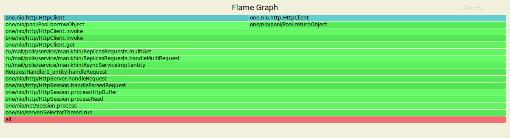

Профилирование блокировок (lock) с помощью async-profiler показывает следующие результаты:

* Около 100% блокировок приходится на получение свежих записей из DAO
* Около 100% блокировок приходится на проксирование входящие запросов
* Около 100% блокировок приходится на формирование и отправку ответов на входящие запросы

## Выводы

По сравнению с асинхронной реализацией сервера с шарнированием - произовдительность обработываемых запросов существенно снизилась.
Результат асихнронной реализации с шарнированием составлял около 7000 обработываемых входящих запросов против 4-5 тысяч у реализации
с реаликацией. Причиной этому может быть, как вариант, слабое железо на машине, на которой проводилось тестирование,
а также распределение нагрузки между узлами, выполняемое через проксирование входящих запросов. Было проведено нагрузочное тестирование реализованного сервера с репликацией данных с различными параметрами ack и from,
по результатам которого можно сказать, что производительность обработки входящих PUT и GET-запросов вне зависимости от значений
ack и from, имеет очень мальнькую разницу.