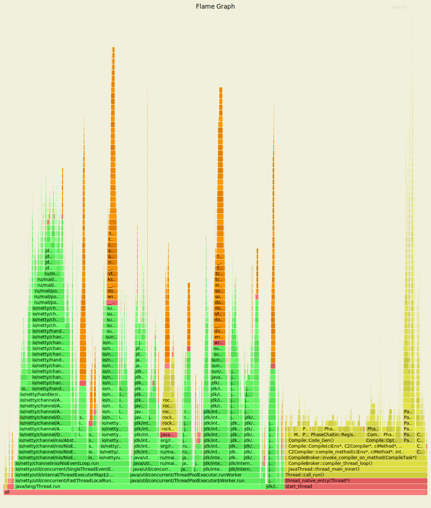
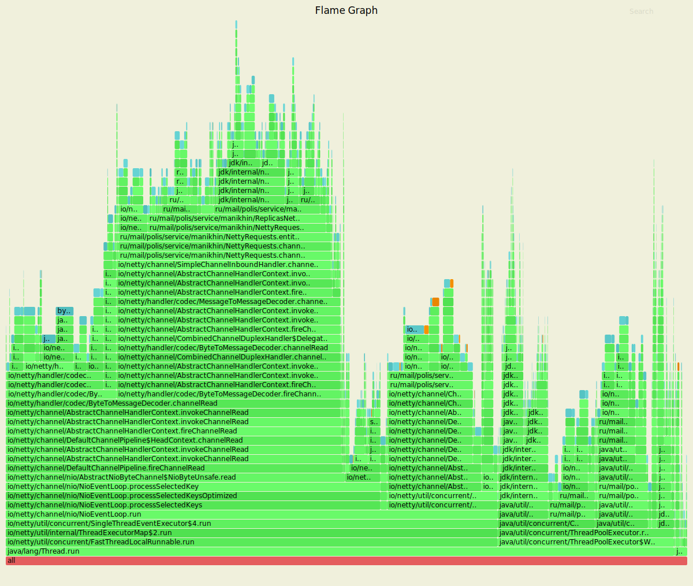
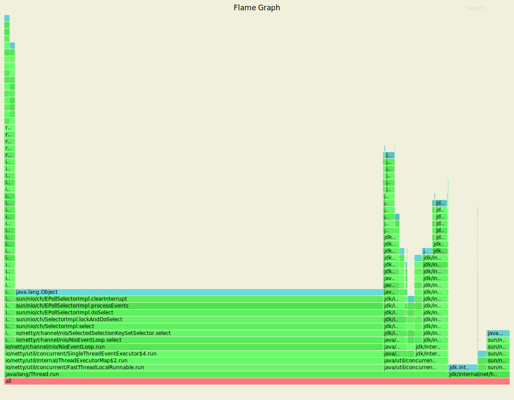
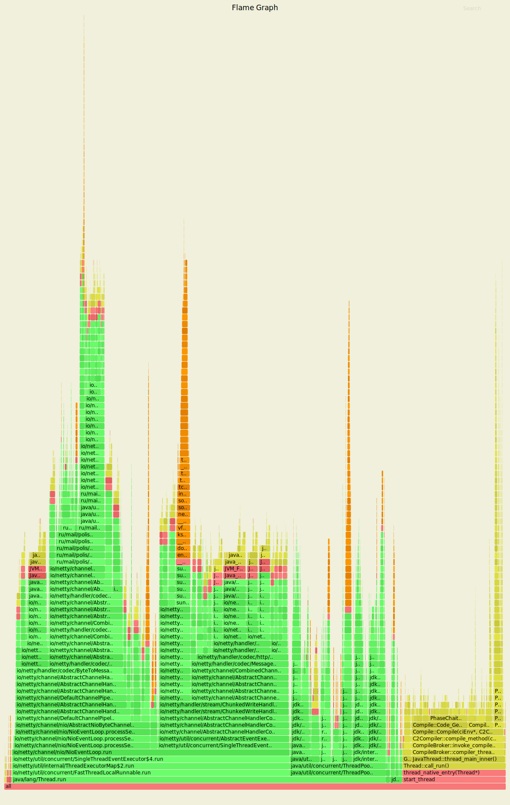
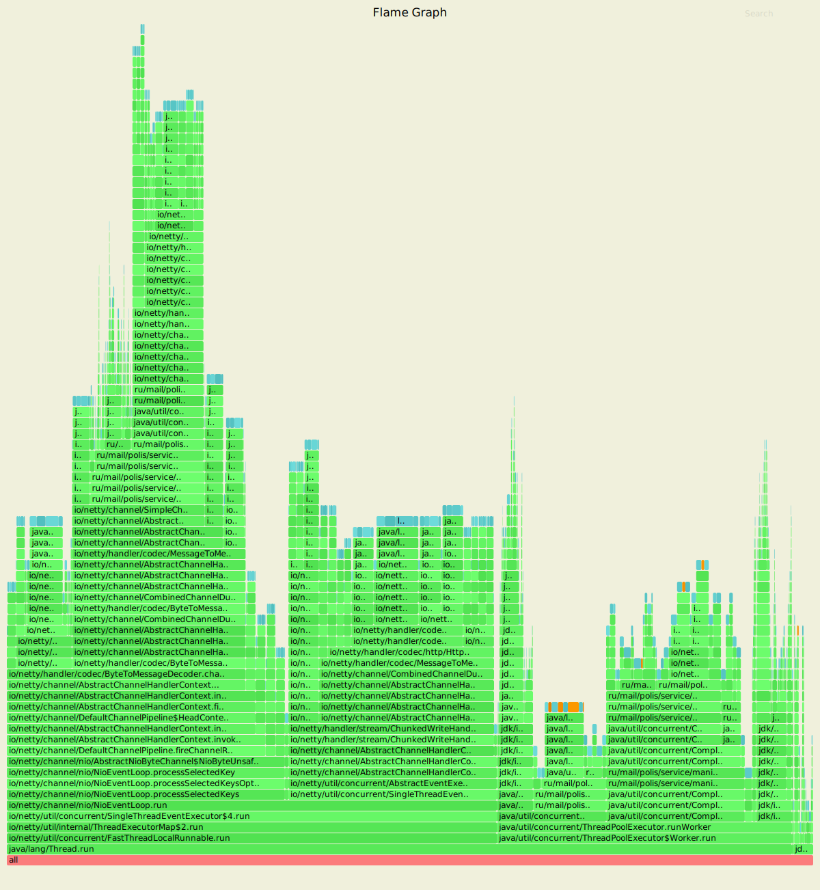
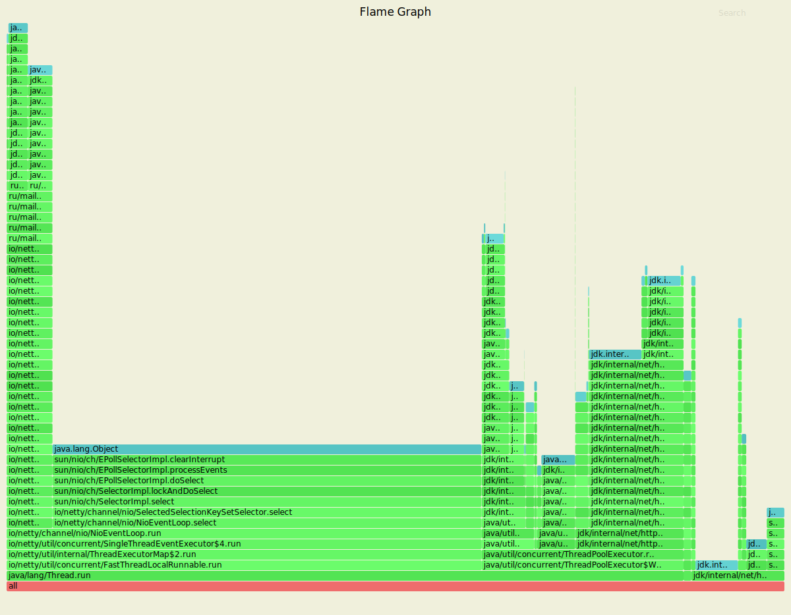

#  Реализация асинхронного сервиса на основе фреймворка "Netty"

На данном этапе был реализован асинхронный веб-сервис на основе фреймворка "Netty"
с целью сравнения с реализацией асинхронного веб-сервиса на основе "one-nio" по 
приросту/ухудшению производительности

## Обстрел сервера PUT-запросами

Параметры запуска wrk

* Количестов потоков, выполняющих отправку запросов на сервер - 4
* Количестов открытых соединений - 20
* Количество запросов в секунду - 20000
* Длительность - 60 секунд

## Обстрел тестируемого узла PUT-запросами (при ack = 3 и from = 3)

Результаты нагрузочного тестирования реализации сервера на основе фреймворка "Netty" через wrk представлены ниже:

```
Running 1m test @ http://127.0.0.1:8081
  4 threads and 20 connections
  Thread calibration: mean lat.: 6382.284ms, rate sampling interval: 18071ms
  Thread calibration: mean lat.: 6389.574ms, rate sampling interval: 18071ms
  Thread calibration: mean lat.: 6389.897ms, rate sampling interval: 18120ms
  Thread calibration: mean lat.: 6414.007ms, rate sampling interval: 18137ms
  Thread Stats   Avg      Stdev     Max   +/- Stdev
    Latency    35.69s    12.92s    0.91m    57.95%
    Req/Sec   416.38     55.78   480.00     50.00%
  Latency Distribution (HdrHistogram - Recorded Latency)
 50.000%   36.31s 
 75.000%   47.64s 
 90.000%    0.87m 
 99.000%    0.91m 
 99.900%    0.91m 
 99.990%    0.91m 
 99.999%    0.91m 
100.000%    0.91m 

  Detailed Percentile spectrum:
       Value   Percentile   TotalCount 1/(1-Percentile)

    9625.599     0.000000            1         1.00
   16736.255     0.100000         9621         1.11
   22757.375     0.200000        19262         1.25
   27672.575     0.300000        28861         1.43
   32063.487     0.400000        38475         1.67
   36306.943     0.500000        48097         2.00
   39124.991     0.550000        52902         2.22
   41680.895     0.600000        57720         2.50
   43810.815     0.650000        62537         2.86
   45875.199     0.700000        67351         3.33
   47644.671     0.750000        72174         4.00
   48463.871     0.775000        74546         4.44
   49315.839     0.800000        76941         5.00
   50036.735     0.825000        79432         5.71
   50659.327     0.850000        81823         6.67
   51314.687     0.875000        84199         8.00
   51642.367     0.887500        85433         8.89
   51970.047     0.900000        86635        10.00
   52264.959     0.912500        87796        11.43
   52625.407     0.925000        89044        13.33
   52920.319     0.937500        90230        16.00
   53084.159     0.943750        90879        17.78
   53215.231     0.950000        91385        20.00
   53411.839     0.956250        92061        22.86
   53608.447     0.962500        92618        26.67
   53805.055     0.968750        93205        32.00
   53903.359     0.971875        93534        35.56
   54001.663     0.975000        93857        40.00
   54099.967     0.978125        94169        45.71
   54198.271     0.981250        94434        53.33
   54329.343     0.984375        94702        64.00
   54394.879     0.985938        94872        71.11
   54460.415     0.987500        95051        80.00
   54493.183     0.989062        95128        91.43
   54558.719     0.990625        95328       106.67
   54591.487     0.992188        95434       128.00
   54624.255     0.992969        95554       142.22
   54657.023     0.993750        95678       160.00
   54657.023     0.994531        95678       182.86
   54689.791     0.995313        95789       213.33
   54722.559     0.996094        95896       256.00
   54722.559     0.996484        95896       284.44
   54722.559     0.996875        95896       320.00
   54755.327     0.997266        95979       365.71
   54755.327     0.997656        95979       426.67
   54788.095     0.998047        96072       512.00
   54788.095     0.998242        96072       568.89
   54788.095     0.998437        96072       640.00
   54788.095     0.998633        96072       731.43
   54788.095     0.998828        96072       853.33
   54820.863     0.999023        96144      1024.00
   54820.863     0.999121        96144      1137.78
   54820.863     0.999219        96144      1280.00
   54820.863     0.999316        96144      1462.86
   54820.863     0.999414        96144      1706.67
   54820.863     0.999512        96144      2048.00
   54820.863     0.999561        96144      2275.56
   54820.863     0.999609        96144      2560.00
   54820.863     0.999658        96144      2925.71
   54853.631     0.999707        96174      3413.33
   54853.631     0.999756        96174      4096.00
   54853.631     0.999780        96174      4551.11
   54853.631     0.999805        96174      5120.00
   54853.631     0.999829        96174      5851.43
   54853.631     0.999854        96174      6826.67
   54853.631     0.999878        96174      8192.00
   54853.631     0.999890        96174      9102.22
   54853.631     0.999902        96174     10240.00
   54853.631     0.999915        96174     11702.86
   54853.631     0.999927        96174     13653.33
   54853.631     0.999939        96174     16384.00
   54853.631     0.999945        96174     18204.44
   54853.631     0.999951        96174     20480.00
   54853.631     0.999957        96174     23405.71
   54853.631     0.999963        96174     27306.67
   54853.631     0.999969        96174     32768.00
   54853.631     0.999973        96174     36408.89
   54853.631     0.999976        96174     40960.00
   54853.631     0.999979        96174     46811.43
   54853.631     0.999982        96174     54613.33
   54853.631     0.999985        96174     65536.00
   54853.631     0.999986        96174     72817.78
   54853.631     0.999988        96174     81920.00
   54853.631     0.999989        96174     93622.86
   54886.399     0.999991        96175    109226.67
   54886.399     1.000000        96175          inf
#[Mean    =    35687.242, StdDeviation   =    12915.043]
#[Max     =    54853.632, Total count    =        96175]
#[Buckets =           27, SubBuckets     =         2048]
----------------------------------------------------------
  103803 requests in 1.00m, 6.63MB read
Requests/sec:   1730.06
Transfer/sec:    113.20KB
```

Результаты нагрузочного тестирования реализации сервера на основе "one-nio" через wrk представлены ниже:

```
Running 1m test @ http://127.0.0.1:8080
  4 threads and 20 connections
  Thread calibration: mean lat.: 2123.901ms, rate sampling interval: 7221ms
  Thread calibration: mean lat.: 2411.015ms, rate sampling interval: 8105ms
  Thread calibration: mean lat.: 2743.955ms, rate sampling interval: 8863ms
  Thread calibration: mean lat.: 1785.677ms, rate sampling interval: 7999ms
  Thread Stats   Avg      Stdev     Max   +/- Stdev
    Latency    16.90s     7.45s   33.16s    58.89%
    Req/Sec   844.87     78.22     1.00k    69.57%
  Latency Distribution (HdrHistogram - Recorded Latency)
 50.000%   16.65s 
 75.000%   23.00s 
 90.000%   27.38s 
 99.000%   30.93s 
 99.900%   32.72s 
 99.990%   33.05s 
 99.999%   33.13s 
100.000%   33.18s 

  Detailed Percentile spectrum:
       Value   Percentile   TotalCount 1/(1-Percentile)

    3692.543     0.000000            1         1.00
    6959.103     0.100000        16912         1.11
    9019.391     0.200000        33796         1.25
   11714.559     0.300000        50721         1.43
   14286.847     0.400000        67581         1.67
   16646.143     0.500000        84504         2.00
   18104.319     0.550000        92934         2.22
   19431.423     0.600000       101401         2.50
   20660.223     0.650000       109789         2.86
   21872.639     0.700000       118234         3.33
   23003.135     0.750000       126785         4.00
   23642.111     0.775000       130935         4.44
   24281.087     0.800000       135218         5.00
   25034.751     0.825000       139346         5.71
   25870.335     0.850000       143567         6.67
   26591.231     0.875000       147841         8.00
   27033.599     0.887500       149991         8.89
   27377.663     0.900000       152049        10.00
   27721.727     0.912500       154175        11.43
   28049.407     0.925000       156270        13.33
   28409.855     0.937500       158406        16.00
   28573.695     0.943750       159420        17.78
   28803.071     0.950000       160537        20.00
   29016.063     0.956250       161553        22.86
   29278.207     0.962500       162605        26.67
   29507.583     0.968750       163618        32.00
   29671.423     0.971875       164178        35.56
   29818.879     0.975000       164713        40.00
   29982.719     0.978125       165243        45.71
   30162.943     0.981250       165765        53.33
   30425.087     0.984375       166265        64.00
   30572.543     0.985938       166535        71.11
   30719.999     0.987500       166832        80.00
   30834.687     0.989062       167052        91.43
   30998.527     0.990625       167340       106.67
   31227.903     0.992188       167597       128.00
   31326.207     0.992969       167723       142.22
   31440.895     0.993750       167854       160.00
   31653.887     0.994531       167973       182.86
   31817.727     0.995313       168129       213.33
   31981.567     0.996094       168242       256.00
   32079.871     0.996484       168305       284.44
   32194.559     0.996875       168368       320.00
   32309.247     0.997266       168440       365.71
   32407.551     0.997656       168513       426.67
   32489.471     0.998047       168575       512.00
   32505.855     0.998242       168604       568.89
   32555.007     0.998437       168639       640.00
   32604.159     0.998633       168666       731.43
   32669.695     0.998828       168700       853.33
   32718.847     0.999023       168729      1024.00
   32784.383     0.999121       168766      1137.78
   32784.383     0.999219       168766      1280.00
   32800.767     0.999316       168782      1462.86
   32833.535     0.999414       168802      1706.67
   32849.919     0.999512       168811      2048.00
   32915.455     0.999561       168827      2275.56
   32931.839     0.999609       168837      2560.00
   32931.839     0.999658       168837      2925.71
   32948.223     0.999707       168846      3413.33
   32964.607     0.999756       168857      4096.00
   32964.607     0.999780       168857      4551.11
   32980.991     0.999805       168865      5120.00
   32980.991     0.999829       168865      5851.43
   32997.375     0.999854       168871      6826.67
   33013.759     0.999878       168873      8192.00
   33046.527     0.999890       168876      9102.22
   33062.911     0.999902       168877     10240.00
   33079.295     0.999915       168879     11702.86
   33095.679     0.999927       168885     13653.33
   33095.679     0.999939       168885     16384.00
   33095.679     0.999945       168885     18204.44
   33095.679     0.999951       168885     20480.00
   33112.063     0.999957       168888     23405.71
   33112.063     0.999963       168888     27306.67
   33112.063     0.999969       168888     32768.00
   33128.447     0.999973       168891     36408.89
   33128.447     0.999976       168891     40960.00
   33128.447     0.999979       168891     46811.43
   33128.447     0.999982       168891     54613.33
   33128.447     0.999985       168891     65536.00
   33128.447     0.999986       168891     72817.78
   33128.447     0.999988       168891     81920.00
   33144.831     0.999989       168892     93622.86
   33144.831     0.999991       168892    109226.67
   33144.831     0.999992       168892    131072.00
   33144.831     0.999993       168892    145635.56
   33144.831     0.999994       168892    163840.00
   33177.599     0.999995       168893    187245.71
   33177.599     1.000000       168893          inf
#[Mean    =    16897.833, StdDeviation   =     7450.093]
#[Max     =    33161.216, Total count    =       168893]
#[Buckets =           27, SubBuckets     =         2048]
----------------------------------------------------------
  206224 requests in 1.00m, 13.18MB read
Requests/sec:   3436.63
Transfer/sec:    224.86KB
```

За выставленное время было произведено 103803 PUT-запросов на сервер, реализованного на "Netty", и 206224 PUT-запросов
на сервер, реализованного на "one-nio" соответсвенно. Была достигнута нагрузка в 1730.06 запросов в секунду (реализация 
сервера на Netty) и 3436.63 запросов в секунду (реализация сервера на one-nio). При нагрузке в 99% время обработки 
запросов занимает около 0.91 минуты (реализация сервера на netty) и 30.93 секунд (реализация сервера на one-nio).
По сравнению с реализацией сервера на one-nio - количество обрабатываемых запросов уменьшилось в 2 раза и время 
выполнения запросов просело в 3 раза.

#### Результаты с async profiler-а (CPU)

Рис. 1 - Результаты профилирования процессора под нагрузкой (реализация сервера на Netty)


Рис. 2 - Результаты профилирования процессора под нагрузкой (реализация сервера на One-Nio)

---
Профилирование cpu с помощью async-profiler показывает следующие результаты:

* Вставка свежей записи в DAO занимает около 4.67% (реализация на Netty) и 32% (реализация на One-Nio) 
  процессорных ресурсов
* Просирование входящих запросов занимает около 4.03% (реализация на Netty) и 26% (реализация на One-Nio) 
  процессорных ресурсов
* Формирование и отправка ответов на входящие запросы занимает около 6.49% (реализация на Netty) и 21.69% 
  (реализация на One-Nio) процессорных ресурсов
* Обработка входящих запросов на сохранение свежих записей в методе `multiPut`занимает около 6.29% 
  (реализация на Netty) и 80% (реализация на One-Nio) процессорных ресурсов 
* В реализации сервера на Netty большая доля ресурсов процессора уходит на выполнение таких операций как:
  ThreadExecutorMap (27.08%), на многократную работу с каналом, выполняющим обработку входящих запросов (12.22%)

#### Результаты с async profiler-а (ALLOC)

Рис. 3 - Результаты профилирования выделения памяти при нагрузке сервера (реализация сервера на Netty)


Рис. 4 - Результаты профилирования выделения памяти при нагрузке сервера (реализация сервера на One-Nio)

---
Профилирование выделения памяти (alloc) с помощью async-profiler показывает следующие результаты:

* Под вставку свежих записей в DAO отводится около 6.85% (реализация на Netty) и 8% (реализация на One-Nio) 
  общей выделяемой памяти
* Под проксирование входящих запросов отводится около 15.66% (реализация на Netty) и 44% (реализация на One-Nio) 
  общей выделяемой памяти
* Под формирование и отправку ответов на входящие запросы отводится около 5.32% (реализация на Netty) и 5%
  (реализация на One-Nio) общей выделяемой памяти
* Под обработку входящих запросов на сохранение свежих записей в методе `multiPut` отводится около 26.18%
  (реализация на Netty) и 6% (реализация на One-Nio) общей выделяемой памяти
* В реализации сервера на Netty наибольше всего выделяется памяти под многократную работу с каналом, выполняющим
обработку входящих запросов (31.25 - 32.89%) и использование ThreadExecutorMap (70.63%)

#### Результаты с async profiler-a (LOCK)

Рис. 5 - Результаты профилирования наличия/отсутствия блокировок при нагрузке сервера (реализация сервера на Netty)


Рис. 6 - Результаты профилирования наличия/отсутствия блокировок при нагрузке сервера (реализация сервера на One-Nio)

---
Профилирование блокировок (lock) с помощью async-profiler показывает следующие результаты:

* Около 2.11% (реализация на Netty) и 100% (реализация на One-Nio) блокировок приходится на вставку свежих
  записей в DAO
* Около 1.05% (реализация на Netty) и 100% (реализация на One-Nio) блокировок приходится на проксирование входящих
  запросов
* Около 2% (реализация на Netty) и 100% (реализация на One-Nio) блокировок приходится на формирование и отправку ответов
  на входящие запросы
* В реализации сервера на Netty наибольшая часть блокировок приходится на работу с NioEventLoop и EpolSelector'ом 
  (72.81%)   


## Обстрел тестируемого узла GET-запросами (при ack = 3 и from = 3)

Параметры запуска wrk

* Количестов потоков, выполняющих отправку запросов на сервер - 4
* Количестов открытых соединений - 20
* Количество запросов в секунду - 20000
* Длительность - 60 секунд


Результаты нагрузочного тестирования реализации сервера на основе фреймворка "Netty" через wrk представлены ниже:

```
Running 1m test @ http://127.0.0.1:8081
  4 threads and 20 connections
  Thread calibration: mean lat.: 4911.752ms, rate sampling interval: 16457ms
  Thread calibration: mean lat.: 4915.831ms, rate sampling interval: 16457ms
  Thread calibration: mean lat.: 4911.545ms, rate sampling interval: 16441ms
  Thread calibration: mean lat.: 4935.588ms, rate sampling interval: 16433ms
  Thread Stats   Avg      Stdev     Max   +/- Stdev
    Latency    30.03s    11.63s   50.10s    58.08%
    Req/Sec     0.90k    29.66     0.94k    66.67%
  Latency Distribution (HdrHistogram - Recorded Latency)
 50.000%   30.26s 
 75.000%   40.14s 
 90.000%   46.04s 
 99.000%   49.58s 
 99.900%   49.97s 
 99.990%   50.10s 
 99.999%   50.14s 
100.000%   50.14s 

  Detailed Percentile spectrum:
       Value   Percentile   TotalCount 1/(1-Percentile)

    8945.663     0.000000            2         1.00
   13959.167     0.100000        18012         1.11
   18087.935     0.200000        36037         1.25
   21987.327     0.300000        53997         1.43
   25903.103     0.400000        71962         1.67
   30261.247     0.500000        89998         2.00
   32243.711     0.550000        99003         2.22
   34209.791     0.600000       108049         2.50
   36175.871     0.650000       117000         2.86
   38174.719     0.700000       126010         3.33
   40140.799     0.750000       134993         4.00
   41123.839     0.775000       139499         4.44
   42106.879     0.800000       143925         5.00
   43089.919     0.825000       148459         5.71
   44072.959     0.850000       153028         6.67
   45055.999     0.875000       157528         8.00
   45514.751     0.887500       159657         8.89
   46039.039     0.900000       162029        10.00
   46530.559     0.912500       164245        11.43
   47022.079     0.925000       166436        13.33
   47513.599     0.937500       168660        16.00
   47775.743     0.943750       169841        17.78
   48005.119     0.950000       170904        20.00
   48267.263     0.956250       172100        22.86
   48529.407     0.962500       173307        26.67
   48758.783     0.968750       174364        32.00
   48857.087     0.971875       174836        35.56
   48988.159     0.975000       175459        40.00
   49119.231     0.978125       176076        45.71
   49217.535     0.981250       176530        53.33
   49348.607     0.984375       177145        64.00
   49414.143     0.985938       177456        71.11
   49479.679     0.987500       177763        80.00
   49545.215     0.989062       178065        91.43
   49577.983     0.990625       178227       106.67
   49643.519     0.992188       178527       128.00
   49676.287     0.992969       178671       142.22
   49709.055     0.993750       178827       160.00
   49741.823     0.994531       178983       182.86
   49774.591     0.995313       179132       213.33
   49807.359     0.996094       179269       256.00
   49807.359     0.996484       179269       284.44
   49840.127     0.996875       179388       320.00
   49872.895     0.997266       179504       365.71
   49872.895     0.997656       179504       426.67
   49905.663     0.998047       179595       512.00
   49905.663     0.998242       179595       568.89
   49938.431     0.998437       179674       640.00
   49938.431     0.998633       179674       731.43
   49971.199     0.998828       179736       853.33
   49971.199     0.999023       179736      1024.00
   49971.199     0.999121       179736      1137.78
   50003.967     0.999219       179781      1280.00
   50003.967     0.999316       179781      1462.86
   50036.735     0.999414       179824      1706.67
   50036.735     0.999512       179824      2048.00
   50036.735     0.999561       179824      2275.56
   50036.735     0.999609       179824      2560.00
   50069.503     0.999658       179857      2925.71
   50069.503     0.999707       179857      3413.33
   50069.503     0.999756       179857      4096.00
   50069.503     0.999780       179857      4551.11
   50102.271     0.999805       179886      5120.00
   50102.271     0.999829       179886      5851.43
   50102.271     0.999854       179886      6826.67
   50102.271     0.999878       179886      8192.00
   50102.271     0.999890       179886      9102.22
   50102.271     0.999902       179886     10240.00
   50102.271     0.999915       179886     11702.86
   50102.271     0.999927       179886     13653.33
   50102.271     0.999939       179886     16384.00
   50102.271     0.999945       179886     18204.44
   50102.271     0.999951       179886     20480.00
   50102.271     0.999957       179886     23405.71
   50135.039     0.999963       179893     27306.67
   50135.039     1.000000       179893          inf
#[Mean    =    30026.630, StdDeviation   =    11625.177]
#[Max     =    50102.272, Total count    =       179893]
#[Buckets =           27, SubBuckets     =         2048]
----------------------------------------------------------
  201022 requests in 1.00m, 18.35MB read
Requests/sec:   3350.34
Transfer/sec:    313.20KB
```

Результаты нагрузочного тестирования реализации сервера на основе "one-nio" через wrk представлены ниже:

```
Running 1m test @ http://127.0.0.1:8080
  4 threads and 64 connections
  Thread calibration: mean lat.: 430.623ms, rate sampling interval: 2383ms
  Thread calibration: mean lat.: 166.459ms, rate sampling interval: 927ms
  Thread calibration: mean lat.: 1256.917ms, rate sampling interval: 4210ms
  Thread calibration: mean lat.: 530.557ms, rate sampling interval: 2420ms
  Thread Stats   Avg      Stdev     Max   +/- Stdev
    Latency     3.54s     2.93s   14.11s    69.28%
    Req/Sec     1.46k   460.64     3.02k    70.19%
  Latency Distribution (HdrHistogram - Recorded Latency)
 50.000%    3.11s 
 75.000%    5.29s 
 90.000%    7.69s 
 99.000%   12.12s 
 99.900%   13.80s 
 99.990%   14.09s 
 99.999%   14.12s 
100.000%   14.12s 

  Detailed Percentile spectrum:
       Value   Percentile   TotalCount 1/(1-Percentile)

       0.267     0.000000            1         1.00
     387.327     0.100000        29431         1.11
     782.335     0.200000        58901         1.25
    1260.543     0.300000        88296         1.43
    1964.031     0.400000       117739         1.67
    3108.863     0.500000       147167         2.00
    3614.719     0.550000       161928         2.22
    4046.847     0.600000       176588         2.50
    4403.199     0.650000       191332         2.86
    4866.047     0.700000       206037         3.33
    5287.935     0.750000       220767         4.00
    5566.463     0.775000       228104         4.44
    5820.415     0.800000       235465         5.00
    6164.479     0.825000       242818         5.71
    6492.159     0.850000       250166         6.67
    6950.911     0.875000       257550         8.00
    7360.511     0.887500       261221         8.89
    7692.287     0.900000       264887        10.00
    7938.047     0.912500       268557        11.43
    8216.575     0.925000       272255        13.33
    8617.983     0.937500       275919        16.00
    8863.743     0.943750       277766        17.78
    9142.271     0.950000       279603        20.00
    9682.943     0.956250       281436        22.86
   10207.231     0.962500       283301        26.67
   10477.567     0.968750       285140        32.00
   10633.215     0.971875       286046        35.56
   10846.207     0.975000       286967        40.00
   11132.927     0.978125       287870        45.71
   11304.959     0.981250       288821        53.33
   11501.567     0.984375       289755        64.00
   11616.255     0.985938       290172        71.11
   11788.287     0.987500       290640        80.00
   11984.895     0.989062       291091        91.43
   12214.271     0.990625       291547       106.67
   12451.839     0.992188       292009       128.00
   12591.103     0.992969       292243       142.22
   12705.791     0.993750       292491       160.00
   12746.751     0.994531       292709       182.86
   12943.359     0.995313       292926       213.33
   13107.199     0.996094       293161       256.00
   13205.503     0.996484       293287       284.44
   13262.847     0.996875       293391       320.00
   13369.343     0.997266       293501       365.71
   13426.687     0.997656       293621       426.67
   13475.839     0.998047       293740       512.00
   13557.759     0.998242       293806       568.89
   13606.911     0.998437       293860       640.00
   13639.679     0.998633       293917       731.43
   13688.831     0.998828       293978       853.33
   13811.711     0.999023       294052      1024.00
   13811.711     0.999121       294052      1137.78
   13819.903     0.999219       294088      1280.00
   13828.095     0.999316       294107      1462.86
   13852.671     0.999414       294144      1706.67
   13860.863     0.999512       294165      2048.00
   13869.055     0.999561       294188      2275.56
   13877.247     0.999609       294202      2560.00
   13885.439     0.999658       294208      2925.71
   14032.895     0.999707       294219      3413.33
   14065.663     0.999756       294239      4096.00
   14073.855     0.999780       294249      4551.11
   14073.855     0.999805       294249      5120.00
   14082.047     0.999829       294274      5851.43
   14082.047     0.999854       294274      6826.67
   14082.047     0.999878       294274      8192.00
   14082.047     0.999890       294274      9102.22
   14090.239     0.999902       294286     10240.00
   14090.239     0.999915       294286     11702.86
   14090.239     0.999927       294286     13653.33
   14098.431     0.999939       294296     16384.00
   14098.431     0.999945       294296     18204.44
   14098.431     0.999951       294296     20480.00
   14098.431     0.999957       294296     23405.71
   14098.431     0.999963       294296     27306.67
   14106.623     0.999969       294298     32768.00
   14106.623     0.999973       294298     36408.89
   14106.623     0.999976       294298     40960.00
   14114.815     0.999979       294300     46811.43
   14114.815     0.999982       294300     54613.33
   14123.007     0.999985       294305     65536.00
   14123.007     1.000000       294305          inf
#[Mean    =     3543.910, StdDeviation   =     2926.317]
#[Max     =    14114.816, Total count    =       294305]
#[Buckets =           27, SubBuckets     =         2048]
----------------------------------------------------------
  355335 requests in 1.00m, 24.24MB read
Requests/sec:   5921.82
Transfer/sec:    413.64KB
```

За выставленное время было произведено 201022 GET-запросов на сервер, реализованного на "Netty", и 355335 GET-запросов
на сервер, реализованного на "one-nio" соответсвенно. Была достигнута нагрузка в 3350.34 запросов в секунду (реализация
сервера на Netty) и 5921.82 запросов в секунду (реализация сервера на one-nio). При нагрузке в 99% время обработки
запросов занимает около 49.58 секунд (реализация сервера на netty) и 12.12 секунд (реализация сервера на one-nio).
По сравнению с реализацией сервера на one-nio - количество обрабатываемых запросов уменьшилось в 1/4 раза и время
выполнения запросов просело в 3 раза.

#### Результаты с async profiler-а (CPU)

Рис. 7 - Результаты профилирования процессора под нагрузкой (реализация сервера на Netty)


Рис. 8 - Результаты профилирования процессора под нагрузкой (реализация сервера на One-Nio)

---
Профилирование cpu с помощью async-profiler показывает следующие результаты:

* Получение свежей записи из DAO занимает около 9.42% (реализация на Netty) и 17% (реализация на One-Nio) процессорных
  ресурсов
* Просирование входящих запросов занимает около 2.56% (реализация на Netty) и 29% (реализация на One-Nio) процессорных
  ресурсов
* Формирование и отправка ответов на входящие запросы занимает около 4.98% (реализация на Netty) и 25.60% 
  (реализация на One-Nio) процессорных ресурсов
* Обработка входящих запросов на получение свежих записей в методе `multiGet` занимает около 9.42% (реализация на Netty)
  и 79% (реализация на One-Nio) процессорных ресурсов
* В реализации сервера на Netty большая доля ресурсов процессора уходит на выполнение таких операций как:
  ThreadExecutorMap (55.39%), на многократную работу с каналом, выполняющим обработку входящих запросов (22.12 - 23%)  

#### Результаты с async profiler-а (ALLOC)

Рис. 9 - Результаты профилирования выделения памяти при нагрузке сервера (реализация сервера на Netty)


Рис. 10 - Результаты профилирования выделения памяти при нагрузке сервера (реализация сервера на One-Nio)

---
Профилирование выделения памяти (alloc) с помощью async-profiler показывает следующие результаты:

* Под получение свежих записей из DAO отводится около 13.55% (реализация на Netty) и 5% (реализация на One-Nio) общей
  выделяемой памяти
* Под проксирование входящих запросов отводится около 3.25% (реализация на Netty) и 39% (реализация на One-Nio) общей
  выделяемой памяти
* Под формирование и отправку ответов на входящие запросы отводится около 8.81% (реализация на Netty) и 5.86%
  (реализация на One-Nio) общей выделяемой памяти
* Под обработку входящих запросов на получение свежих записей в методе `multiGet`отводится около 13.55% 
  (реализация на Netty) и 75% (реализация на One-Nio) общей выделяемой памяти
* В реализации сервера на Netty наибольше всего выделяется памяти под многократную работу с каналом, выполняющим
  обработку входящих запросов (21.52%) и использование ThreadExecutorMap (60.78%)

#### Результаты с async profiler-a (LOCK)

Рис. 11 - Результаты профилирования наличия/отсутствия блокировок при нагрузке сервера (реализация сервера на Netty)


Рис. 12 - Результаты профилирования наличия/отсутствия блокировок при нагрузке сервера (реализация сервера на One-Nio)

---
Профилирование блокировок (lock) с помощью async-profiler показывает следующие результаты:

* Около 5.88% (реализация на Netty) и 100% (реализация на One-Nio) блокировок приходится на получение свежих записей
  из DAO
* Около 2.50% (реализация на Netty) и 100% (реализация на One-Nio) блокировок приходится на проксирование входящих
  запросов
* Около 2% (реализация на Netty) и 100% (реализация на One-Nio) блокировок приходится на формирование и отправку ответов
  на входящие запросы   
* В реализации сервера на Netty наибольшая часть блокировок приходится на работу с NioEventLoop и EpolSelector'ом
  (55.15 - 61.08%)
  
## Выводы
По итогам проведённого нагрузочного тестирования можно сделать выводы, что реализация сервиса на Netty, исходя из
приведённого выше сравниттельного анализа с реализацией сервиса на One-Nio, проигрывает по количеству и времени обработки
входящих PUT и GET запросов. Такая низкая производительность реализации сервиса на Netty связана с высоким поотреблением
и выделение ресурсов на работу внутренних компонентов Netty таких как NioEventLoop, EpolSelector и многократное
использование и инициализацию канала, в рамках которого производится обработка входящих запросов. Как один из возможных
вариантов - это связвно с нерациональной и многократной очисткой канала после записи в него ответов на обработанные 
входящие запросы, что даёт задуматься над оптимизацией самой реализацией, и, что тоже вполне вероятно, инкрементацией 
и декрементацией ссылок на продолжительность использования и работы с запросами и структурами данных типа ByteBuf.
Кроме того, это говорит о том, что требуется проводить более тонкую настройку сервера и самого pipeline, в котором
производится добавление батареек для обработки и работы с входящими запросами.